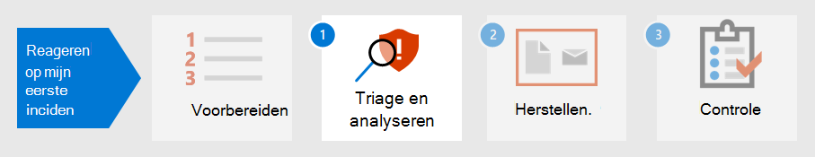

# Uw beveiligingshouding voorbereiden op het eerste incidentPrepare your security posture for your first incident

[!INCLUDE [Microsoft 365 Defender rebranding](../includes/microsoft-defender.md)]

**Van toepassing op:****Applies to:**
- Microsoft 365 DefenderMicrosoft 365 Defender

Als u zich voorbereidt op incidentafhandeling, moet het netwerk van een organisatie voldoende worden beschermd tegen verschillende soorten beveiligingsincidenten.Preparing for incident handling involves setting up sufficient protection of an organization's network from different kinds of security incidents. Om het risico op beveiligingsincidenten te beperken, raadt het National Institute of Standards and Technology (NIST) verschillende beveiligingspraktijken aan, waaronder risicobeoordelingen, het verbeteren van de beveiliging van de host, het veilig configureren van netwerken en het voorkomen van malware.To reduce the risk of security incidents, National Institute of Standards and Technology (NIST) recommends several security practices including risk assessments, hardening host security, configuring networks securely, and preventing malware. 

Microsoft 365 Defender kan helpen bij het aanpakken van verschillende aspecten van incidentpreventie:Microsoft 365 Defender can help address several aspects of incident prevention: 

- Een [Zero Trust-framework](https://docs.microsoft.com/security/zero-trust/) implementerenImplementing a [Zero Trust](https://docs.microsoft.com/security/zero-trust/) framework
- Uw beveiligingsstatus bepalen door een score toe te wijzen met [Microsoft Secure Score](microsoft-secure-score.md)Determining your security posture by assigning a score with [Microsoft Secure Score](microsoft-secure-score.md)
- Bedreigingen voorkomen via kwetsbaarheidsbeoordelingen in [Bedreigings- en kwetsbaarheidsbeheer](../defender-endpoint/next-gen-threat-and-vuln-mgt.md)Preventing threats through vulnerability assessments in [Threat and Vulnerability Management](../defender-endpoint/next-gen-threat-and-vuln-mgt.md)
- Inzicht in de meest recente beveiligingsrisico's, zodat u zich op deze bedreigingen kunt voorbereidenUnderstanding the latest security threats so you can prepare for them

## Stap 1.Step 1. Nul vertrouwen implementerenImplement Zero Trust

[Zero Trust](https://docs.microsoft.com/security/zero-trust/) is een geïntegreerde beveiligingsbeschouwing en end-to-endstrategie waarin rekening wordt gehouden met de complexe aard van elke moderne omgeving, met inbegrip van het mobiele personeel en de gebruikers, apparaten, toepassingen en gegevens, waar ze zich ook bevinden.[Zero Trust](https://docs.microsoft.com/security/zero-trust/) is an integrated security philosophy and end-to-end strategy that considers the complex nature of any modern environment, including the mobile workforce and the users, devices, applications and data, wherever they may be located. Door één deelvenster met glas te bieden om alle eindpuntdetecties op een consistente manier te beheren, kan  Microsoft 365 Defender het uw beveiligingsteam gemakkelijker maken om de basisprincipes van Zero Trust te implementeren.By providing a single pane of glass to manage all endpoint detections in a consistent way, Microsoft 365 Defender can make it easier for your security operations team to implement the [guiding principles](https://docs.microsoft.com/security/zero-trust/#guiding-principles-of-zero-trust) of Zero Trust. 

Onderdelen van Microsoft 365 Defender kunnen schendingen van regels weergeven die zijn geïmplementeerd om beleid voor voorwaardelijke toegang voor Zero Trust tot stand te brengen door gegevens van Microsoft Defender voor Eindpunt (MDE) of andere mobiele beveiligingsleveranciers te integreren als informatiebron voor beleidsregels voor apparaat compliance en implementatie van beleidsregels voor voorwaardelijke toegang op apparaten.Components of Microsoft 365 Defender can display violations of rules that have been implemented to establish Conditional Access policies for Zero Trust by integrating data from Microsoft Defender for Endpoint (MDE) or other mobile security vendors as an information source for device compliance policies and implementation of device-based Conditional Access policies. 

Apparaatrisico is rechtstreeks van invloed op de bronnen die toegankelijk zijn voor de gebruiker van dat apparaat.Device risk directly influences what resources will be accessible by the user of that device. De weigering van toegang tot resources op basis van bepaalde criteria is het hoofdthema van Zero Trust en Microsoft 365 Defender biedt informatie die nodig is om de criteria op vertrouwensniveau te bepalen.The denial of access to resources based on certain criteria is the main theme of Zero Trust and Microsoft 365 Defender provides information needed to determine the trust level criteria. Zo kan Microsoft 365 Defender het softwareversieniveau van een apparaat bieden via de pagina Bedreigings- en beveiligingsprobleembeheer, terwijl beleidsregels voor voorwaardelijke toegang apparaten beperken die verouderde of kwetsbare versies hebben.For example, Microsoft 365 Defender can provide the software version level of a device through the Threat and Vulnerability Management page while Conditional Access policies restrict devices that have outdated or vulnerable versions.

Automatisering is een essentieel onderdeel van het implementeren en onderhouden van een Zero Trust-omgeving, terwijl ook het aantal waarschuwingen wordt beperkt dat mogelijk tot incidenten kan leiden.Automation is a crucial part of implementing and maintaining a Zero Trust environment while also reducing the number of alerts that would potentially lead to incident response (IR) events. Onderdelen van Microsoft 365 Defender kunnen worden geautomatiseerd, zoals herstelacties [(ook](m365d-autoir.md) wel onderzoeken voor een incident in het Microsoft 365-beveiligingscentrum genoemd), meldingsacties en zelfs het maken van ondersteuningstickets, zoals in [ServiceNow.](https://microsoft.service-now.com/sp/)Components of Microsoft 365 Defender can be automated such as [remediation actions](m365d-autoir.md) (known as investigations for an incident in the Microsoft 365 security center), notification actions, and even the creation of support tickets such as in [ServiceNow](https://microsoft.service-now.com/sp/).

## Stap 2.Step 2. De beveiligingsstatus van uw organisatie bepalenDetermine your organization’s security posture

Vervolgens kunnen organisaties de [Microsoft Secure Score](microsoft-secure-score.md) in Microsoft 365 Defender gebruiken om uw huidige beveiligingsstatus te bepalen en aanbevelingen te overwegen voor het verbeteren van deze score.Next, organizations can use the [Microsoft Secure Score](microsoft-secure-score.md) in Microsoft 365 Defender to determine your current security posture and consider recommendations on how to improve it. Hoe hoger de score is, hoe meer beveiligingsaanbevelingen en verbeteracties door de organisatie zijn genomen.The higher the score is, the more security recommendations and improvement actions have been taken by the organization. Aanbevelingen voor veilige score kunnen worden gebruikt voor verschillende producten en organisaties in staat stellen hun scores nog hoger te maken.Secure Score recommendations can be taken across different products and allow organizations to raise their scores even higher. 

:::image type="content" source="../../media/first-incident-prepare/first-incident-secure-score.png" alt-text="Voorbeeld van Microsoft Secure Score in het Microsoft-beveiligingscentrum":::
 
## Stap 3.Step 3. De kwetsbaarheidsblootstelling van uw organisatie beoordelenAssess your organization’s vulnerability exposure

Het voorkomen van incidenten kan helpen bij het stroomlijnen van de beveiligingsactiviteiten om zich te richten op aan de hand van kritieke en belangrijke beveiligingsincidenten.Preventing incidents can help streamline security operations efforts to focus on on-going critical and important security incidents. Softwareproblemen zijn vaak een preventief toegangspunt voor aanvallen die kunnen leiden tot gegevensdiefstal, gegevensverlies of verstoring van bedrijfsactiviteiten.Software vulnerabilities are often a preventable entry point for attacks that can lead to data theft, data loss, or disruption of business operations. Als er geen aanvallen worden uitgevoerd, moeten beveiligingsbewerkingen ernaar streven om een acceptabel niveau van blootstelling aan kwetsbaarheid [in](../defender-endpoint/tvm-exposure-score.md) hun organisatie te bereiken en te behouden.If no attacks are on-going, security operations must strive to achieve and maintain an acceptable level of [vulnerability exposure](../defender-endpoint/tvm-exposure-score.md) in their organization.

Als u de voortgang van  de softwarepatching wilt controleren, gaat u naar de pagina Bedreigings- en kwetsbaarheidsbeheer in Defender voor Eindpunt, die u kunt openen vanuit Microsoft 365 Defender via het tabblad **Meer** bronnen.To check your software patching progress, visit the [Threat and Vulnerability Management](../defender-endpoint/next-gen-threat-and-vuln-mgt.md) page in Defender for Endpoint, which you can access from Microsoft 365 Defender through the **More resources** tab.

:::image type="content" source="../../media/first-incident-prepare/first-incident-vulnerability.png" alt-text="Voorbeeld van de pagina Bedreiging en kwetsbaarheid in het Microsoft-beveiligingscentrum"::: 
 
## 4. Nieuwe bedreigingen begrijpen4. Understand emerging threats

Gebruik [bedreigingsanalyse](threat-analytics.md) in het Microsoft 365 beveiligingscentrum om up-to-date te blijven met het huidige landschap van beveiligingsrisico's.Use [threat analytics](threat-analytics.md) in the Microsoft 365 security center to keep up-to-date with the current security threat landscape. Deskundige beveiligingsonderzoekers van Microsoft maken rapporten waarin de meest recente cyberdreigingen gedetailleerd worden beschreven, zodat u kunt begrijpen hoe deze van invloed kunnen zijn op uw Microsoft 365-abonnement, apparaten en gebruikers.Expert Microsoft security researchers create reports that describe the latest cyber-threats in detail so you can understand how they might affect your Microsoft 365 subscription, devices, and users. Deze rapporten kunnen bestaan uit:These reports can include:

- Actieve bedreigingsacteurs en hun campagnesActive threat actors and their campaigns
- Populaire en nieuwe aanvalstechniekenPopular and new attack techniques
- Kritieke beveiligingslekkenCritical vulnerabilities
- Veelvoorkomende aanvalsoppervlakkenCommon attack surfaces
- Voorkomende malwarePrevalent malware

U kunt de aanbevelingen van een nieuwe bedreiging implementeren om uw beveiligingshouding te versterken en het oppervlak van de aanval te minimaliseren.You can implement the recommendations of an emerging threat to strengthen your security posture and minimize your attack surface area.

Maak tijd in uw planning om regelmatig de sectie [Bedreigingsanalyse](threat-analytics.md) van het Microsoft 365 te controleren.Make time in your schedule to regularly check the [Threat Analytics](threat-analytics.md) section of the Microsoft 365 security center.

## Volgende stapNext step

Meer informatie over het [triagen en analyseren van incidenten.](first-incident-analyze.md)Learn how to [triage and analyze incidents](first-incident-analyze.md).

## Zie ookSee also

- [Overzicht van incidentenIncidents overview](incidents-overview.md)
- [Incidenten onderzoekenInvestigate incidents](investigate-incidents.md)
- [Incidenten beherenManage incidents](manage-incidents.md)
