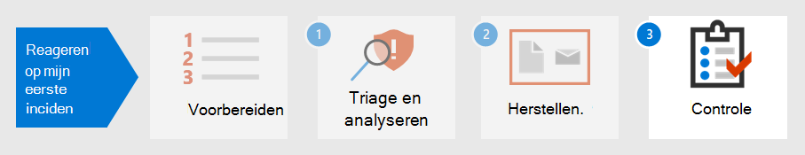

# Stap 2. Herstel uw eerste incident

[!INCLUDE [Microsoft 365 Defender rebranding](../includes/microsoft-defender.md)]

**Van toepassing op:**
- Microsoft 365 Defender

Microsoft 365 Defender biedt niet alleen detectie- en analysemogelijkheden, maar biedt ook insluiting en uitbanning van malware. Containment bevat stappen om de impact van de aanval te verminderen, terwijl het uitroeien ervoor zorgt dat alle sporen van activiteiten van de aanvaller uit het netwerk worden verwijderd.  Microsoft 365 Defender biedt verschillende herstelacties die kunnen worden geconfigureerd om automatisch te [herstellen,](m365d-autoir.md) afhankelijk van uw besturingssysteem en het type aanval.

Microsoft 365 Defender biedt verschillende herstelacties die door analisten handmatig kunnen worden gestart. Acties zijn onderverdeeld in twee categorieën: Acties op apparaten en Acties op bestanden. Sommige acties kunnen worden gebruikt om de bedreiging onmiddellijk te stoppen, terwijl andere acties helpen bij verdere technische analyse.

## Acties op apparaten

- **Het apparaat isoleren:** deze activiteit blokkeert onmiddellijk al het netwerkverkeer (internet en interne) om de verspreiding van malware te minimaliseren en analisten in staat te stellen door te gaan met de analyse zonder dat een kwaadwillende een aanval kan voortzetten. De enige verbinding die is toegestaan, is met de Microsoft Defender for Identity-servicecloud, zodat Microsoft Defender voor identiteit het apparaat kan blijven controleren. 
- **De uitvoering van apps** beperken: als u wilt voorkomen dat een toepassing wordt uitgevoerd, wordt een codeintegriteitsbeleid toegepast waarmee alleen bestanden kunnen worden uitgevoerd als ze zijn ondertekend met een door Microsoft uitgegeven certificaat. Deze beperkingsmethode kan voorkomen dat een aanvaller gecompromitteerde apparaten kan beheren en verdere schadelijke activiteiten kan uitvoeren.
- **Antivirusscan uitvoeren:** een Microsoft Defender Antivirus kan worden uitgevoerd naast andere antivirusoplossingen, ongeacht of Defender Antivirus de actieve antivirusoplossing is of niet. Als een ander antivirusproduct de primaire oplossing voor endpointbeveiliging is, kunt u Defender Antivirus uitvoeren in de passieve modus.
- **Automatisch onderzoek starten:** u kunt een nieuw, algemeen, geautomatiseerd onderzoek starten op het apparaat. Terwijl een onderzoek wordt uitgevoerd, wordt elke andere waarschuwing die van het apparaat wordt gegenereerd, toegevoegd aan een lopend geautomatiseerd onderzoek totdat dat onderzoek is voltooid. Bovendien worden deze apparaten toegevoegd aan het onderzoek als dezelfde bedreiging op andere apparaten wordt gezien.
- **Livereactie starten:** live-antwoord is een mogelijkheid die u direct toegang geeft tot een apparaat met behulp van een externe shell-verbinding. Dit biedt u de mogelijkheid om uitgebreid onderzoek te doen en direct actie te ondernemen om geïdentificeerde bedreigingen in realtime snel te kunnen bevatten. Live response is ontworpen om onderzoeken te verbeteren door u in staat te stellen om gerechtelijke gegevens te verzamelen, scripts uit te voeren, verdachte entiteiten te verzenden voor analyse, bedreigingen te corrigeren en proactief te zoeken naar nieuwe bedreigingen.
- **Onderzoekspakket verzamelen:** als onderdeel van het onderzoek- of antwoordproces kunt u een onderzoekspakket verzamelen vanaf een apparaat. Door het onderzoekspakket te verzamelen, kunt u de huidige status van het apparaat identificeren en meer inzicht krijgen in de hulpprogramma's en technieken die door de aanvaller worden gebruikt. 
- **Raadpleeg een bedreigingsexpert** (beschikbaar in acties op apparaten en bestanden) - U kunt een Bedreigingsexpert van Microsoft raadplegen voor meer informatie over mogelijk gecompromitteerde apparaten of apparaten die al zijn gecompromitteerd. Bedreigingsexperts van Microsoft kunnen rechtstreeks vanuit de Microsoft Defender-beveiligingscentrum voor een tijdige en nauwkeurige reactie. 

## Acties op bestanden

- **Bestand stoppen en in quarantaine** plaatsen: deze actie omvat het stoppen van lopende processen, het quarantineren van bestanden en het verwijderen van permanente gegevens, zoals registersleutels. Deze actie wordt van kracht op apparaten Windows 10, versie 1703 of hoger, waar het bestand de afgelopen 30 dagen is waargenomen. 
- **Indicatoren toevoegen om bestanden te blokkeren** of toe te staan: voorkom verdere verspreiding van een aanval in uw organisatie door potentieel schadelijke bestanden of verdachte malware te verbieden. Met deze bewerking wordt voorkomen dat het bestand wordt gelezen, geschreven of uitgevoerd op apparaten in uw organisatie.
- **Bestand downloaden** of verzamelen: met deze actie kunnen analisten een bestand downloaden in een beveiligd .zip archiefbestand voor verdere analyse door de organisatie.
- **Diepgaande analyse:** met deze actie wordt een bestand uitgevoerd in een beveiligde, volledig geinstrumenteerde cloudomgeving. Uitgebreide analyseresultaten tonen de activiteiten, waargenomen gedragingen en bijbehorende artefacten van het bestand, zoals verwijderde bestanden, registerwijzigingen en communicatie met IP-adressen. 

Als u het voorbeeld in [Incidenten opsporen, triageeren](first-incident-analyze.md#analyze-your-first-incident)en analyseren voortzet, kan een analist dit incident met deze acties herstellen:

1. Het wachtwoord voor het gebruikersaccount onmiddellijk opnieuw instellen
2. Het apparaat isoleren in Microsoft 365 Defender totdat de uitgebreide analyse is voltooid
3. Controleer of het schadelijke bestand in quarantaine is geplaatst SharePoint
4. Controleren welke eindpunten zijn beïnvloed door malware
5. Systemen opnieuw opbouwen
6. Controleren op vergelijkbare Microsoft Cloud App Security voor andere gebruikers
7. Een aangepaste indicator maken in Microsoft Defender voor Eindpunt om een IP-adres van tor te blokkeren
8. Maak een beheeractie in Microsoft Cloud App Security voor dit type waarschuwing, zoals in de volgende afbeelding:

   :::image type="content" source="../../media/first-incident-remediate/first-incident-mcas-governance.png" alt-text="Voorbeeld van beheeracties in de Microsoft Cloud App Security portal"::: 
 
De meeste herstelacties kunnen worden toegepast en bijgespoord in Microsoft 365 Defender. 

## Playbooks gebruiken

Daarnaast kan geautomatiseerde herstel worden gemaakt met behulp van playbooks. Op dit moment bevat Microsoft [Playbook-sjablonen GitHub](https://github.com/microsoft/Microsoft-Cloud-App-Security/tree/master/Playbooks) met playbooks voor de volgende scenario's:

- Gevoelige bestanden delen verwijderen na het aanvragen van gebruikersvalidatie
- Auto-triage infrequent landwaarschuwingen
- Actie voor manager aanvragen voordat u een account uitbelt
- Schadelijke regels voor Postvak IN uitschakelen

Playbooks gebruiken Power Automate om aangepaste automatiseringsstromen voor robotische processen te maken om bepaalde activiteiten te automatiseren zodra specifieke criteria zijn geactiveerd. Organisaties kunnen playbooks maken op basis van bestaande sjablonen of vanuit het niets. 

Hier is een voorbeeld.
 
:::image type="content" source="../../media/first-incident-remediate/first-incident-power-automate.png" alt-text="Voorbeeld van een Power Automate aangepaste automatiseringsstroom voor robotische processen"::: 
 
Playbooks kunnen ook worden gemaakt tijdens [de controle na](first-incident-post.md) het incident om herstelacties te maken van incidenten voor snellere herstelacties. 

## Volgende stap

Meer informatie over [het uitvoeren van een post-incident review van een incident.](first-incident-post.md)

## Zie ook

- [Overzicht van incidenten](incidents-overview.md)
- [Incidenten onderzoeken](investigate-incidents.md)
- [Incidenten beheren](manage-incidents.md)
