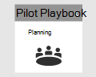
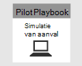

# Uw Microsoft 365 Defender-pilot sluiten en samenvatten  

[!INCLUDE [Microsoft 365 Defender rebranding](../includes/microsoft-defender.md)]

**Van toepassing op:**
- Microsoft 365 Defender

| [Planning](m365d-pilot-plan.md) | [Voorbereiding](prepare-m365d-eval.md) |  [Een aanval simuleren](m365d-pilot-simulate.md) |  Sluiten en samenvatten|
|--|--|--|--|
|| | |*U bent er!*|

U bent momenteel bezig met het sluiten en samenvatten van de fase.

U hebt zojuist een geavanceerde geheugen-alleen-aanvalssimulatie uitgevoerd die code op afstand heeft uitgevoerd op een domeincontroller. U hebt gezien hoe Microsoft Defender voor Eindpunt en Microsoft Defender voor identiteit waarschuwingen detecteren en maken voor verborgen schadelijke activiteiten. U hebt ook gezien hoe waarschuwingen uit verschillende bronnen samen met andere contextuele informatie worden bezorgd in één incident in de microsoft 365-beveiligingscentrumportal. Als u dergelijke integratie ondervindt, kunnen SOC-analisten de benodigde actie onderzoeken en ondernemen. U hebt ook een geavanceerde query gemaakt om inkomende e-mailberichten te identificeren waarin de gebruiker de bijlage heeft geopend of opgeslagen en detectie heeft gemaakt op basis van die query.

U hebt het einde van het proces bereikt nadat alle tests zijn afgerond.

De uiteindelijke uitvoer moet zijn:

- Een voltooide scorecard
- Een gedetailleerd rapport van de resultaten van de pilot
- Een beslissing over hoe u verder kunt gaan

Presenteert de rapporten van uw uiteindelijke uitvoer aan interne  belanghebbenden (die u hebt geïdentificeerd tijdens de voorbereidingsfase) en Microsoft-contactpersonen. Een dergelijke inspanning zorgt ervoor dat feedback kan worden gebruikt om producten en documentatie te verbeteren.

We hopen dat u genoten hebt van deze simulatie. Begin met het implementeren van wat u op grotere schaal in uw organisatie hebt geleerd om het beste uit de geïntegreerde beveiligingsoplossing te halen.

## Volgende stap
Meer informatie over de Microsoft 365 Defender-pilaren via de volgende interactieve handleidingen:
- [Uw organisatie beveiligen met Microsoft Defender voor Office 365](https://aka.ms/O365ATP-Interactive-Guide)
- [Verdachte activiteiten en mogelijke aanvallen detecteren met Microsoft Defender voor identiteit](https://aka.ms/AATP-Interactive-Guide)
- [Bedreigingen detecteren en waarschuwingen beheren met Microsoft Cloud App Security](https://aka.ms/DetectThreatsAndAlertsMCAS-InteractiveGuide)
- [Bedreigingen onderzoeken en corrigeren met Microsoft Defender voor Eindpunt](https://aka.ms/MDATP-IR-Interactive-Guide)