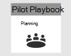

# Uw pilotproject Microsoft 365 Defender plannenPlanning your pilot Microsoft 365 Defender project 

[!INCLUDE [Microsoft 365 Defender rebranding](../includes/microsoft-defender.md)]

**Van toepassing op:****Applies to:**
- Microsoft 365 DefenderMicrosoft 365 Defender

| PlanningPlanning| [VoorbereidingPreparation](prepare-m365d-eval.md) |  [Een aanval simulerenSimulate attack](m365d-pilot-simulate.md) |  [Sluiten en samenvattenClose and summarize](m365d-pilot-close.md)|
|--|--|--|--|
|*U bent er!**You are here!*| | | |

U bent momenteel bezig met de planningsfase.You're currently in the planning phase.

Om ervoor te zorgen dat uw pilotproject een succes is, is het essentieel om in het begin grondig te plannen met uw belanghebbenden en goedkeuringen te krijgen.To ensure that your pilot project is a success, it is essential to plan thoroughly with and get approvals from your stakeholders in the beginning. Elementen van planning zijn onder andere het identificeren van bereik, gebruiksgevallen, vereisten en succescriteria.Elements of planning include identifying scope, use cases, requirements, and success criteria.

In deze handleiding wordt u begeleid bij het plannen van uw pilotproject.This guide walks you through how to plan your pilot project. 

>[!IMPORTANT]
>Volg de testinstructies zo nauwkeurig mogelijk voor optimale resultaten.For optimum results, follow the pilot instructions as closely as possible.

## BereikScope

Het bereik van de pilot bepaalt hoe breed de test zal zijn, op basis van uw omgeving en acceptabele testmethoden.The scope of the pilot will determine how broad the test will be, based on your environment and acceptable testing methods. Hier volgen enkele voorbeeldbereiken om rekening mee te houden:Here are some example scopes to consider:

- Ontwikkel- of testomgeving met eindpunten, servers, domeincontrollers.Development or test environment which includes endpoints, servers, domain controllers.
- Productieomgeving met Microsoft 365, Azure, Active Directory-services, eindpunten en serversProduction environment with Microsoft 365, Azure, Active Directory services, endpoints, and servers

>[!NOTE]
>Als u nog niet de volledige licenties hebt, kunt  u proeflicenties krijgen om Microsoft 365 Defender te evalueren: plannen, voorbereiden, instellen, configureren en uitvoeren van uw pilotproject.If you don’t have the full licenses yet, you can get trial licenses to [evaluate Microsoft 365 Defender](m365d-evaluation.md?ocid=cx-docs-MTPtriallab) – plan, prepare, setup, configure, and run your pilot project. Uw belanghebbenden spelen een grote rol bij het vergemakkelijken van het proces van begin tot einde.Your stakeholders will play a big role in helping facilitate the process from start to finish.

De typen besturingssystemen die moeten worden geëvalueerd, moeten ook worden gedefinieerd op basis van de organisatiestructuur.The types of operating systems to be evaluated should also be defined based on the organizational makeup. Dit kan het volgende zijn: [Mac-eindpunten,](/windows/security/threat-protection/microsoft-defender-atp/microsoft-defender-atp-mac#system-requirements) [Linux-servers,](/windows/security/threat-protection/microsoft-defender-atp/microsoft-defender-atp-linux#system-requirements) [Windows 10 eindpunten,](/windows/security/threat-protection/microsoft-defender-atp/minimum-requirements#supported-windows-versions) [Windows Server 2016.](/windows/security/threat-protection/microsoft-defender-atp/minimum-requirements#supported-windows-versions)This may include the following: [Mac endpoints](/windows/security/threat-protection/microsoft-defender-atp/microsoft-defender-atp-mac#system-requirements), [Linux Servers](/windows/security/threat-protection/microsoft-defender-atp/microsoft-defender-atp-linux#system-requirements), [Windows 10 endpoints](/windows/security/threat-protection/microsoft-defender-atp/minimum-requirements#supported-windows-versions), [Windows Server 2016](/windows/security/threat-protection/microsoft-defender-atp/minimum-requirements#supported-windows-versions).

## Gebruik casesUse cases

Use cases represent statements of how the tool being test is meant to be consumed by its intended users.Use cases represent statements of how the tool being tested is meant to be consumed by its intended users. Deze kunnen worden geformuleerd als gebruikersverhalen vanuit het oogpunt van een bepaalde persoon, zoals een SOC-analist.These can be formulated as user stories from the point of view of a particular persona, such as a SOC analyst. Bijvoorbeeld:For example:

- Als soc-analist moet ik waarschuwingen en gebeurtenissen op apparaten, gebruikers en postvakken in mijn netwerk bekijken, correleren, beoordelen en beheren.As a SOC analyst, I need to view, correlate, assess and manage alerts and events across devices, users, and mailboxes in my network. [Incident management][Incident management]
- Als soc-analist moet ik de functie en het proces hebben om schadelijke gebeurtenissen in mijn netwerk automatisch te onderzoeken en te beantwoorden.As a SOC analyst, I must have the tool and process to automatically investigate and respond to malicious events in my network. [Auto IR][Auto IR]
- Als soc-analist moet ik gegevens uit mijn omgeving doorzoeken om bekende en potentiële bedreigingen en verdachte activiteiten te vinden.As a SOC analyst, I must search data from my environment to find known and potential threats, and suspicious activities. [Advanced Hunting][Advanced Hunting]

Houd er rekening mee dat deze gebruiksgevallen moeten worden gemaakt binnen de parameters van het gedefinieerde bereik.Keep in mind that these use cases should be created within the parameters of the defined scope. Als het testbereik bijvoorbeeld geen evaluatie bevat van hulpprogramma's zoals Microsoft Cloud App Security, moet u geen gevallen gebruiken die hiervan afhankelijk zijn als gegevensbron.If, for example, the scope of testing does not include an evaluation of tools such as Microsoft Cloud App Security, then use cases that rely on this as a data source should not be created.

## VereistenRequirements

In de lijst met gebruiksgevallen kunt u beginnen met het maken van vereisten.From the list of use cases, you can start to create requirements. Vereisten omvatten functies die een hulpmiddel moet hebben om aan de gebruiksgevallen te voldoen.Requirements include features a tool must have to satisfy the use cases. Deze vereisten kunnen worden onderverdeeld in categorieën zoals configuratie en onderhoud, ondersteuning voor integraties en functiespecifieke vereisten, zoals de mogelijkheid om te jagen en de mogelijkheid om aangepaste waarschuwingen te maken.These requirements can be broken down into categories such as configuration and maintenance, support for integrations, and feature-specific requirements like hunting ability and the ability to build custom alerts.

## TestplanTest plan

Afhankelijk van de vereisten kunnen verschillende testmethoden geschikt zijn.Depending on the requirements, different methods of testing may be appropriate. Als de vereiste bijvoorbeeld is om de effectiviteit van geautomatiseerde herstel te evalueren, moet het testplan stappen bevatten om het gedrag(en) te genereren dat een geautomatiseerde herstelactie binnen de Microsoft 365 Defender.For instance, if the requirement is to evaluate the efficacy of Automated Remediation, the test plan needs to include steps to generate the behavior(s) that would trigger an automated remediation action within Microsoft 365 Defender. Als de vereiste is om een bepaald gedrag of een bepaalde aanval te detecteren, kan de test meer stappen omvatten.If the requirement is to detect a particular behavior or attack, then the test may involve more steps. Het punt is om een plan te hebben om nauwkeurig te testen op uw vereisten.The point is to have a plan in place to accurately test against your requirements.

## SuccescriteriaSuccess criteria

Succescriteria is uiteindelijk de balk die is ingesteld voor het meten van wat u aan het testen bent.Success criteria is ultimately the bar set to measure against what you are testing. Of u nu Microsoft 365 Defender (of een andere technologie) test op andere hulpmiddelen of op zichzelf, er moeten een aantal meetbare criteria zijn om de waarde te bepalen die het hulpprogramma biedt.Whether you are testing Microsoft 365 Defender (or any other technology for that matter) against other tools or by itself, there must be some quantifiable criteria to determine the value the tool provides. Op basis van het bereik, de vereisten en het testplan bepalen de succescriteria hoe de test moet worden beoordeeld.Based on the scope, requirements, and testing plan, the success criteria will determine how to score the test. Dit moet minder een pass of fail zijn en meer een gewogen score op basis van uw behoeften.This should be less of a pass or fail and more of a weighted scoring based on your needs. Als u bijvoorbeeld wilt slagen, moet een hulpmiddel mogelijk boven de 80% scoren in bepaalde kritieke gebieden die u identificeert.For example, to be successful, a tool may need to score above 80% in certain critical areas you identify.

## ScorecardScorecard

U kunt alle elementen van uw plan samenbrengen door een scorecard te maken.One way to bring all elements of your plan together can be to create a scorecard. Zie hieronder een voorbeeldscorecard:See a sample scorecard below:

| Use caseUse case | VereistenRequirements | ConfiguratievereistenConfiguration requirements | TestplanTest plan | Verwachte uitkomstExpected outcome | TeststatusTest status | ScoreScore | OpmerkingenNotes |
|:-------|:-------|:-------|:-------|:-------|:-------|:-------|:-------|
|IncidentbeheerIncident management|- Microsoft 365 Defender- Microsoft 365 Defender   - Microsoft Defender voor identiteit- Microsoft Defender for Identity   - Microsoft Defender voor Eindpunt- Microsoft Defender for Endpoint   - Microsoft Cloud App Security (optioneel)- Microsoft Cloud App Security (optional)|Bekijk de [vereisten voor voorbereiding,](m365d-evaluation.md?ocid=cx-docs-MTPtriallab) configuratie en configuratie voor meer informatieSee the [prerequisites](m365d-evaluation.md?ocid=cx-docs-MTPtriallab) for preparation, set-up, and configuration for details |[Een aanval simulerenSimulate attack](m365d-pilot-simulate.md)   [Het incident onderzoekenInvestigate the incident](./m365d-pilot-simulate.md#investigate-an-incident) |De onderzoeker kan het bereik en de impact van het incident begrijpen en het incident beherenInvestigators can understand the scope and impact of the incident and manage the incident||||
|AutoIRAutoIR|- Microsoft 365 Defender- Microsoft 365 Defender   - Microsoft Defender voor identiteit- Microsoft Defender for Identity   - Microsoft Defender voor Eindpunt- Microsoft Defender for Endpoint |Bekijk de [vereisten voor voorbereiding,](m365d-evaluation.md?ocid=cx-docs-MTPtriallab) configuratie en configuratie voor meer informatieSee the [prerequisites](m365d-evaluation.md?ocid=cx-docs-MTPtriallab) for preparation, set-up, and configuration for details  AutoIR inschakelenEnable AutoIR  |[Een aanval simulerenSimulate attack](m365d-pilot-simulate.md)   [Geautomatiseerd onderzoekAutomated investigation](m365d-pilot-simulate.md#automated-investigation-and-remediation) |Waarschuwingen en incidenten worden automatisch door de Microsoft 365 DefenderAlerts and incidents are automatically remediated by Microsoft 365 Defender||||
|Geavanceerd opsporenAdvanced hunting|- Microsoft 365 Defender- Microsoft 365 Defender   - Microsoft Defender voor Eindpunt- Microsoft Defender for Endpoint   -Microsoft Defender voor Office 365-Microsoft Defender for Office 365 |Bekijk de [vereisten voor voorbereiding,](m365d-evaluation.md?ocid=cx-docs-MTPtriallab) configuratie en configuratie voor meer informatieSee the [prerequisites](m365d-evaluation.md?ocid=cx-docs-MTPtriallab) for preparation, set-up, and configuration for details|[Scenario voor geavanceerd jagenAdvanced hunting scenario](./m365d-pilot-simulate.md#advanced-hunting-scenario) |Speurders kunnen gegevens vinden door middel van geavanceerd zoeken, draaien naar beïnvloede entiteiten en door aangepaste detecties te makenInvestigators can find data through advanced hunting, pivoting to impacted entities, and by creating custom detections||||

## Volgende stapNext step

|  [VoorbereidingsfasePreparation phase](prepare-m365d-eval.md) | Uw testomgeving Microsoft 365 Defender voorbereidenPrepare your Microsoft 365 Defender pilot environment
|:-------|:-----|
