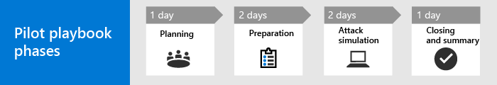

# Uw testproject voor Microsoft 365 Defender uitvoerenRun your pilot Microsoft 365 Defender project 

[!INCLUDE [Microsoft 365 Defender rebranding](../includes/microsoft-defender.md)]

**Van toepassing op:****Applies to:**
- Microsoft 365 DefenderMicrosoft 365 Defender

Deze handleiding helpt u bij het uitvoeren van een pilotproject door aanwijzers te geven om ervoor te zorgen dat u een goed gestructureerd plan hebt, u begeleidt bij het gebruik van de functie aanvalssimulatie en de pilot ten slotte afsluit met belangrijke take-aways om na te denken over en de resultaten te documenteren.This guide helps you run a pilot project by providing pointers to ensure you have a well-structured plan, guiding you through using the attack simulation feature, and finally concluding the pilot with key take-aways for you to reflect on and document results.

Met een pilot kunt u effectief bepalen wat het voordeel is van het gebruik van Microsoft 365 Defender.Running a pilot helps you effectively determine the benefit of adoptiing Microsoft 365 Defender. Voordat u Microsoft 365 Defender in uw productieomgeving inschakelen en uw gebruiksgevallen start, kunt u het beste plannen om de taken voor uw testproject te bepalen en de succescriteria in te stellen.Before enabling Microsoft 365 Defender in your production environment and starting your use cases, it's best to plan to determine the tasks to accomplish for your pilot project and set the success criteria. 

## Deze test playbook gebruikenHow to use this pilot playbook

Deze handleiding bevat een overzicht van Microsoft 365 Defender en stapsgewijs instructies over het instellen van uw pilotproject.This guide provides an overview of Microsoft 365 Defender and step-by-step instructions on how to set up your pilot project. 

Microsoft 365 Defender is een geïntegreerde suite voor bedrijfsdefensie vóór en na inbreuk die inheems bescherming, detectie, preventie, onderzoek en antwoord coördineert in eindpunten, identiteiten, e-mail en toepassingen om geïntegreerde bescherming tegen geavanceerde aanvallen te bieden.Microsoft 365 Defender is a unified pre- and post-breach enterprise defense suite that natively coordinates protection, detection, prevention, investigation, and response across endpoints, identities, email, and applications to provide integrated protection against sophisticated attacks. Dit doet het door de volgende mogelijkheden te combineren en te orveren tot één beveiligingsoplossing:It does so by combining and orchestrating the following capabilities into a single security solution:
  - Microsoft Defender voor Eindpunt, de nieuwe naam voor Microsoft Defender Advanced Threat Protection (eindpunten)Microsoft Defender for Endpoint, the new name for Microsoft Defender Advanced Threat Protection (endpoints)
  - Microsoft Defender voor Office 365, de nieuwe naam voor Office 365 ATP (e-mail)Microsoft Defender for Office 365, the new name for Office 365 ATP (email) 
  - Microsoft Defender voor identiteit, de nieuwe naam voor Azure ATP (identiteit)Microsoft Defender for Identity, the new name for Azure ATP (identity) 
  - Microsoft Cloud App Security (apps)Microsoft Cloud App Security (apps)

Met de geïntegreerde Microsoft 365 Defender-oplossing kunnen beveiligingsprofessionals de bedreigingssignalen die Microsoft Defender voor Eindpunt, Microsoft Defender voor Office 365, Microsoft Defender voor identiteit en Microsoft Cloud App Security ontvangen, samensmelten en bepalen wat het volledige bereik en de impact van de bedreiging is, hoe de bedreiging in de omgeving is ingevoerd, wat de gevolgen zijn en wat de gevolgen zijn voor de organisatie.With the integrated Microsoft 365 Defender solution, security professionals can stitch together the threat signals that Microsoft Defender for Endpoint, Microsoft Defender for Office 365, Microsoft Defender for Identity, and Microsoft Cloud App Security receive, and determine the full scope and impact of the threat, how it entered the environment, what it's affected, and how it's currently impacting the organization. Microsoft 365 Defender voert automatisch actie om de aanval te voorkomen of te stoppen en getroffen postvakken, eindpunten en gebruikersidentiteiten te voorkomen of te herstellen.Microsoft 365 Defender takes automatic action to prevent or stop the attack and self-heal affected mailboxes, endpoints, and user identities. Zie het [Microsoft 365 Defender-overzicht voor](microsoft-365-defender.md) meer informatie.See the [Microsoft 365 Defender overview](microsoft-365-defender.md) for details.

De volgende voorbeeldtijdlijn is afhankelijk van de juiste resources in uw omgeving.The following sample timeline varies depending on having the right resources in your environment. Sommige detecties en werkstromen hebben mogelijk meer leertijd nodig dan de andere.Some detections and workflows might need more learning time than the others.

>[!IMPORTANT]
>Volg de testinstructies zo nauwkeurig mogelijk voor optimale resultaten.For optimum results, follow the pilot instructions as closely as possible.

### Testfasen van een playbookPilot playbook phases 

Er zijn vier fasen in het uitvoeren van een Microsoft 365 Defender-pilot:There are four phases in running a Microsoft 365 Defender pilot:

|FasePhase | BeschrijvingDescription | 
|:-------|:-----|
| [PlanningPlanning](m365d-pilot-plan.md)  ~ 1 dag~ 1 day| Lees waar u rekening mee moet houden voordat u uw Microsoft 365 Defender-testproject gaat uitvoeren:Learn what you need to consider before running your Microsoft 365 Defender pilot project:   - Bereik- Scope   - Use cases- Use cases  - Vereisten- Requirements  - Testplan- Test plan   - Succescriteria- Success criteria   - Scorecard- Scorecard 
| [VoorbereidingPreparation](m365d-evaluation.md)  ~2 dagen~2 days|  Access Microsoft 365 Security Center to set up your Microsoft 365 Defender pilot environment.Access Microsoft 365 Security Center to set up your Microsoft 365 Defender pilot  environment. U wordt begeleid naar:You'll be guided to:  - Identificeer belanghebbenden en zoek aanmelding voor uw pilot- Identify stakeholders and seek sign-off for your pilot   - Milieuoverwegingen- Environment considerations  - Access- Access  - Configuratie van Azure Active Directory- Azure Active Directory setup   - Configuratieorder- Configuration order   - Registreren voor proefversie van Microsoft 365 E5- Sign up for Microsoft 365 E5 Trial   - Domein configureren- Configure domain  - Microsoft 365 E5-licenties toewijzen- Assign Microsoft 365 E5 licenses   - De installatiewizard in de portal voltooien- Complete the setup wizard in the portal|
| [AanvalssimulatieAttack simulation](m365d-pilot-simulate.md)  ~2 dagen~2 days| Als u een aanval wilt simuleren, wordt u begeleid naar:To simulate an attack, you'll be guided to:  - Controleer de vereisten voor de testomgeving- Verify the test environment requirements  - Voer de simulatie uit-  Run the simulation  - Een incident onderzoeken- Investigate an incident  - het incident oplossen- resolve the incident 
| [Sluiten en samenvattingClosing and summary](m365d-pilot-close.md)  ~ 1 dag~ 1 day| Wanneer u het einde van het proces hebt bereikt, wordt u begeleid naar:When you've reached the end of the process, you'll be guided to:  - Ga door de uiteindelijke uitvoer- Go through your final output - Presenteert uw uitvoer aan uw belanghebbenden- Present your output to your stakeholders  - Feedback geven- Provide feedback  - Volgende stappen ondernemen- Take next steps 

## Volgende stapNext step
|[PlanningsfasePlanning phase](m365d-pilot-plan.md) | Uw Microsoft 365 Defender-testproject plannenPlan your Microsoft 365 Defender pilot project 
|:-------|:-----|
