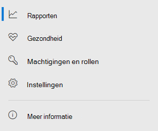

# Microsoft Defender voor Eindpunt in Microsoft 365 DefenderMicrosoft Defender for Endpoint in Microsoft 365 Defender

[!INCLUDE [Microsoft 365 Defender rebranding](../includes/microsoft-defender.md)]

**Van toepassing op:****Applies to:**

- [Microsoft 365 DefenderMicrosoft 365 Defender](microsoft-365-defender.md)
- [Microsoft Defender voor EndpointMicrosoft Defender for Endpoint](https://go.microsoft.com/fwlink/p/?linkid=2154037)

## SnelzoekverwijzingQuick reference

De afbeelding en de onderstaande tabel bevat de wijzigingen in de navigatie tussen de Microsoft Defender-beveiligingscentrum en Microsoft 365 Defender.The image and the table below lists the changes in navigation between the Microsoft Defender Security Center and Microsoft 365 Defender.

> [!div class="mx-imgBorder"]
> 

| Microsoft Defender-beveiligingscentrumMicrosoft Defender Security Center | Microsoft 365 DefenderMicrosoft 365 Defender |
|---------|---------|
| DashboardsDashboards <ul><li>BeveiligingsbewerkingenSecurity Operations</li><li>DreigingsanalyseThreat Analytics</li></ul>  |HomeHome <ul><li>DreigingsanalyseThreat analytics</li></ul>   |
| IncidentenIncidents | Incidenten & waarschuwingenIncidents & alerts |
| ApparaatvoorraadDevice inventory | ApparaatvoorraadDevice inventory |
| WaarschuwingenwachtrijAlerts queue | Incidenten & waarschuwingenIncidents & alerts |
| Geautomatiseerde onderzoekenAutomated investigations | ActiecentrumAction center |
| Geavanceerd opsporenAdvanced hunting | OpsporingHunting |
| RapportenReports | RapportenReports |
| Partners & API'sPartners & APIs | Partners & API'sPartners & APIs |
| Threat & Vulnerability ManagementThreat & Vulnerability Management | BeveiligingsprobleembeheerVulnerability management |
| Evaluatie en zelfstudiesEvaluation and tutorials | Evaluatie & zelfstudiesEvaluation & tutorials |
| ConfiguratiebeheerConfiguration management | ConfiguratiebeheerConfiguration management |
| InstellingenSettings | InstellingenSettings | 

De verbeterde [Microsoft 365 Defender](overview-security-center.md) combineert beveiligingsfuncties die e-mail, samenwerking, identiteit en apparaatrisico's [https://security.microsoft.com](https://security.microsoft.com) beveiligen, detecteren, onderzoeken en erop reageren.The improved [Microsoft 365 Defender](overview-security-center.md) at [https://security.microsoft.com](https://security.microsoft.com) combines security capabilities that protect, detect, investigate, and respond to email, collaboration, identity, and device threats. Hiermee wordt functionaliteit uit bestaande Microsoft-beveiligingsportalen, waaronder Microsoft Defender-beveiligingscentrum en het Office 365 Beveiligingscentrum & Compliancecentrum.This  brings together functionality from existing Microsoft security portals, including Microsoft Defender Security Center and the Office 365 Security & Compliance center.

Als u bekend bent met de Microsoft Defender-beveiligingscentrum, wordt in dit artikel een beschrijving van enkele wijzigingen en verbeteringen in Microsoft 365 Defender.If you're familiar with the Microsoft Defender Security Center, this article helps describe some of the changes and improvements in Microsoft 365 Defender. Er zijn echter enkele nieuwe en bijgewerkte elementen waar u rekening mee moet houden.However there are some new and updated elements to be aware of.

Historisch gezien [is de Microsoft Defender-beveiligingscentrum](/windows/security/threat-protection/microsoft-defender-atp/portal-overview) de thuisbasis van Microsoft Defender voor Eindpunt.Historically, the [Microsoft Defender Security Center](/windows/security/threat-protection/microsoft-defender-atp/portal-overview) has been the home for Microsoft Defender for Endpoint. Beveiligingsteams van ondernemingen hebben deze gebruikt om waarschuwingen van potentiële geavanceerde permanente bedreigingsactiviteit of datalekken te controleren en te helpen beantwoorden.Enterprise security teams have used it to monitor and help responding to alerts of potential advanced persistent threat activity or data breaches. Om het aantal portals te verminderen, Microsoft 365 Defender de thuisbasis voor het bewaken en beheren van beveiliging in uw Microsoft-identiteiten, gegevens, apparaten, apps en infrastructuur.To help reduce the number of portals, Microsoft 365 Defender will be the home for monitoring and managing security across your Microsoft identities, data, devices, apps, and infrastructure.

Microsoft Defender voor Eindpunt in Microsoft 365 Defender ondersteunt het verlenen van toegang tot beheerde beveiligingsserviceproviders [op](/windows/security/threat-protection/microsoft-defender-atp/grant-mssp-access) dezelfde manier als toegang wordt verleend in het [Microsoft Defender-beveiligingscentrum.](mssp-access.md)Microsoft Defender for Endpoint in Microsoft 365 Defender supports [granting access to managed security service providers (MSSPs)](/windows/security/threat-protection/microsoft-defender-atp/grant-mssp-access) in the same way [access is granted in the Microsoft Defender security center](mssp-access.md).

> [!IMPORTANT]
> Wat u ziet in Microsoft 365 Defender, is afhankelijk van uw huidige abonnementen.What you see in Microsoft 365 Defender depends on your current subscriptions. Als u bijvoorbeeld geen licentie hebt voor Microsoft Defender voor Office 365, wordt de sectie E-mail & samenwerking niet weergegeven.For example, if you don't have a license for Microsoft Defender for Office 365, then the Email & Collaboration section will not be shown.

> [!Note]
> Microsoft 365 Defender is niet beschikbaar voor:Microsoft 365 Defender is not available for:
>- US Government Community Cloud (GCC)US Government Community Cloud (GCC)
>- US Government Community Cloud High (GCC High)US Government Community Cloud High (GCC High)
>- Amerikaanse ministerie van DefensieUS Department of Defense
>- Alle Amerikaanse overheidsinstellingen met commerciële licentiesAll US government institutions with commercial licenses

Bekijk de Microsoft 365 Defender: [https://security.microsoft.com](https://security.microsoft.com) .Take a look at Microsoft 365 Defender: [https://security.microsoft.com](https://security.microsoft.com).

Meer informatie over de voordelen: [Overzicht van Microsoft 365 Defender](overview-security-center.md)Learn more about the benefits: [Overview of Microsoft 365 Defender](overview-security-center.md)

## Wat is er gewijzigdWhat's changed

Deze tabel is een beknopt overzicht van de wijzigingen tussen de Microsoft Defender-beveiligingscentrum en Microsoft 365 Defender.This table is a quick reference of the changes between the Microsoft Defender Security Center and Microsoft 365 Defender.

### Waarschuwingen en actiesAlerts and actions

| GebiedArea | Beschrijving van wijzigingDescription of change |
|---------|---------|
| [Incidenten & waarschuwingenIncidents & alerts](incidents-overview.md)  | In Microsoft 365 Defender kunt u incidenten en waarschuwingen beheren voor al uw eindpunten, e-mail en identiteiten.In Microsoft 365 Defender, you can manage incidents and alerts across all of your endpoints, email, and identities. We hebben de ervaring geconvergeerd om u te helpen gerelateerde gebeurtenissen gemakkelijker te vinden.We've converged the experience to help you find related events more easily. Zie Overzicht van [incidenten voor meer informatie.](incidents-overview.md)For more information, see [Incidents Overview](incidents-overview.md).   |
| [OpsporingHunting](advanced-hunting-overview.md)  |  Als u aangepaste detectieregels wijzigt die zijn gemaakt in Microsoft Defender voor Eindpunt om identiteits- en e-mailtabellen op te nemen, worden deze automatisch verplaatst naar Microsoft 365 Defender.Modifying custom detection rules created in Microsoft Defender for Endpoint to include identity and email tables automatically moves them to Microsoft 365 Defender. De bijbehorende waarschuwingen worden ook weergegeven in Microsoft 365 Defender.Their corresponding alerts will also appear in Microsoft 365 Defender. Lees Aangepaste detectieregels migreren voor meer informatie over [deze wijzigingen.](advanced-hunting-migrate-from-mde.md#migrate-custom-detection-rules)For more details about these changes, read [Migrate custom detection rules](advanced-hunting-migrate-from-mde.md#migrate-custom-detection-rules).   De `DeviceAlertEvents` tabel voor geavanceerde jacht is niet beschikbaar in Microsoft 365 Defender.The `DeviceAlertEvents` table for advanced hunting isn't available in Microsoft 365 Defender. Als u apparaatspecifieke waarschuwingsgegevens wilt opvragen in Microsoft 365 Defender, kunt u de tabellen en tabellen gebruiken om nog meer informatie uit `AlertInfo` diverse bronnen op te `AlertEvidence` vragen.To query device-specific alert information in Microsoft 365 Defender, you can use the `AlertInfo` and `AlertEvidence` tables to accommodate even more information from a diverse set of sources. Maak uw volgende apparaatgerelateerde query door [Schrijfquery's te volgen zonder DeviceAlertEvents.](advanced-hunting-migrate-from-mde.md#write-queries-without-devicealertevents)Craft your next device-related query by following [Write queries without DeviceAlertEvents](advanced-hunting-migrate-from-mde.md#write-queries-without-devicealertevents).|
|[ActiecentrumAction center](m365d-action-center.md)    | Lijsten in behandeling en voltooide acties die zijn uitgevoerd na geautomatiseerde onderzoeken en herstelacties.Lists pending and completed actions that were taken following automated investigations and remediation actions. Voorheen werd het actiecentrum in het Microsoft Defender-beveiligingscentrum weergegeven in behandeling en voltooide acties voor herstelacties die alleen op apparaten zijn uitgevoerd, terwijl Geautomatiseerde onderzoeken waarschuwingen en status vermeldden.Formerly, the Action center in the Microsoft Defender Security Center listed pending and completed actions for remediation actions taken on devices only, while Automated investigations listed alerts and status. In de verbeterde Microsoft 365 Defender worden herstelacties en onderzoeken in het actiecentrum op verschillende e-mail, apparaten en gebruikers bijeengeplaatst, allemaal op één locatie.In the  improved Microsoft 365 Defender, the Action center brings together remediation actions and investigations across email, devices, and users—all in one location.  |
| [DreigingsanalyseThreat analytics](threat-analytics.md) |  Verplaatst naar de bovenkant van de navigatiebalk voor eenvoudigere detectie en gebruik.Moved to the top of the navigation bar for easier discovery and use. Bevat nu bedreigingsgegevens voor zowel eindpunten als e-mail en samenwerking.Now includes threat information for both endpoints and email and collaboration.    |

### EindpuntenEndpoints

| GebiedArea | Beschrijving van wijzigingDescription of change |
|---------|---------|
|ZoekenSearch   |  In plaats van in de kop te staan, wordt de zoekbalk van Microsoft Defender voor Eindpunt verplaatst onder de sectie Eindpunten.Instead of being in the heading, Microsoft Defender for Endpoint search bar is moving under the Endpoints section. U kunt blijven zoeken naar apparaten, bestanden, gebruikers, URL's, IPs, beveiligingslekken, software en aanbevelingen.You can continue to search for devices, files, users, URLs, IPs, vulnerabilities, software, and recommendations.  |
|[DashboardDashboard](/windows/security/threat-protection/microsoft-defender-atp/security-operations-dashboard)   |  Dit is uw dashboard voor beveiligingsbewerkingen.This is your security operations dashboard. Bekijk een overzicht van het aantal actieve waarschuwingen dat is geactiveerd, welke apparaten risico lopen, welke gebruikers risico lopen en het ernstniveau voor waarschuwingen, apparaten en gebruikers.See an overview of how many active alerts were triggered, which devices are at risk, which users are at risk, and severity level for alerts, devices, and users. U kunt ook zien of apparaten sensorproblemen hebben, uw algehele service-status en hoe er niet-opgeloste waarschuwingen zijn gedetecteerd.You can also see if any devices have sensor issues, your overall service health, and how any unresolved alerts were detected. |
|ApparaatvoorraadDevice inventory | Geen wijzigingen.No changes. |
|[BeveiligingsprobleembeheerVulnerability management](/windows/security/threat-protection/microsoft-defender-atp/next-gen-threat-and-vuln-mgt)    |    De naam is ingekort om in het navigatiedeelvenster te passen.Name was shortened to fit in the navigation pane. Het is hetzelfde als de Threat and Vulnerability Management sectie, met alle pagina's eronder.It's the same as the threat and vulnerability management section, with all the pages underneath.     |
| Partners en API'sPartners and APIs | Geen wijzigingen.No changes. |
| Evaluaties & zelfstudiesEvaluations & tutorials    |     Nieuwe test- en leermogelijkheden.New testing and learning capabilities.     |
| ConfiguratiebeheerConfiguration management   |  Geen wijzigingen.No changes.  |

> [!NOTE]
> **Automatisch onderzoek en herstel** maakt nu deel uit van incidenten.**Automatic investigation and remediation** is now a part of  incidents. U kunt gebeurtenissen voor automatisch onderzoek en herstel zien op het **tabblad Incident > Onderzoek.**You can see Automated  investigation and remediation events in the **Incident > Investigation** tab.

> [!TIP]
> Apparaatzoekfunctie wordt uitgevoerd vanuit eindpunten > Zoeken.Device search is done from Endpoints > Search.

### Toegang en rapportageAccess and reporting

| GebiedArea | Beschrijving van wijzigingDescription of change |
|---------|---------|
| RapportenReports  | Zie rapporten voor eindpunten en e-mail & samenwerking, waaronder bedreigingsbeveiliging, apparaattoestand en -naleving en Kwetsbare apparaten.See reports for endpoints and email & collaboration, including Threat protection, Device health and compliance, and Vulnerable devices. |
| GezondheidHealth  |  Momenteel wordt een koppeling gemaakt naar de pagina 'Service-status' in [het Microsoft 365 beheercentrum.](https://admin.microsoft.com/)Currently links out to the "Service health" page in the [Microsoft 365 admin center](https://admin.microsoft.com/). |
| InstellingenSettings |  Beheer uw instellingen voor Microsoft 365 Defender, Eindpunten, E-mail & samenwerking, Identiteiten en Apparaatdetectie.Manage your settings for Microsoft 365 Defender, Endpoints, Email & collaboration, Identities, and Device discovery.   |

## Microsoft 365 beveiligingsnavigatie en -mogelijkhedenMicrosoft 365 security navigation and capabilities

De navigatie links, of balk snel starten, is vast bekend.The left navigation, or quick launch bar, will look familiar. Er zijn echter enkele nieuwe en bijgewerkte elementen in dit beveiligingscentrum.However, there are some new and updated elements in this security center.

### Incidenten en waarschuwingenIncidents and alerts

Dit brengt beheer voor incidenten en waarschuwingen samen voor e-mail, apparaten en identiteiten.Brings together incident and alert management across your email, devices, and identities. De waarschuwingspagina biedt volledige context voor de waarschuwing door aanvalssignalen te combineren om een gedetailleerd verhaal te maken.The alert page provides full context to the alert by combining attack signals to construct a detailed story. Een nieuwe, verenigde ervaring brengt nu een consistente weergave samen voor waarschuwingen in verschillende workloads.A new, unified experience now brings together a consistent view of alerts across workloads. Je kan snel sorteren, onderzoeken en doeltreffend actie ondernemen.You can quickly triage, investigate, and take effective action.

- [Meer informatie over incidentenLearn more about incidents](incidents-overview.md)
- [Meer informatie over het beheren van waarschuwingenLearn more about managing alerts](investigate-alerts.md)

### OpsporingHunting

Spoor proactief dreigingen, malware en schadelijke activiteiten op in de eindpunten, Office 365 postvakken en meer met behulp van [geavanceerde opsporingsquery's](advanced-hunting-overview.md).Proactively search for threats, malware, and malicious activity across your endpoints, Office 365 mailboxes, and more by using [advanced hunting queries](advanced-hunting-overview.md). Deze krachtige query's kunnen worden gebruikt om bedreigingsindicatoren en entiteiten te zoeken en te controleren op bekende en potentiële bedreigingen.These powerful queries can be used to locate and review threat indicators and entities for both known and potential threats.

[Aangepaste detectieregels kunnen](custom-detection-rules.md) worden gemaakt van geavanceerde zoekquery's om u te helpen proactief te kijken naar gebeurtenissen die een indicatie kunnen zijn van inbreukactiviteit en verkeerd geconfigureerde apparaten.[Custom detection rules](custom-detection-rules.md) can be built from advanced hunting queries to help you proactively watch for events that might be indicative of breach activity and misconfigured devices.

### ActiecentrumAction center

Het Actiecentrum geeft de onderzoeken weer die aangemaakt werden door geautomatiseerde onderzoeks- en reactiefuncties.Action center shows you the investigations created by automated investigation and response capabilities. Deze geautomatiseerde self-healing in Microsoft 365 Defender kan beveiligingsteams bijstaan bij het automatisch reageren op specifieke gebeurtenissen.This automated, self-healing in Microsoft 365 Defender can help security teams by automatically responding to specific events.

[Meer informatie over het Actiecentrum.](m365d-action-center.md)[Learn more about the Action center](m365d-action-center.md).

### DreigingsanalyseThreat Analytics

Haal bedreigingsinformatie op via Microsoft beveiligingsonderzoeksexperten.Get threat intelligence from expert Microsoft security researchers. Dreigingsanalyse helpt beveiligingsteams efficiënter omgaan met opkomende dreigingen.Threat Analytics helps security teams be more efficient when facing emerging threats. Dreigingsanalyse houdt in:Threat Analytics includes:

- E-mailgerelateerde detectie en beperkingen uit Microsoft Defender voor Office 365.Email-related detections and mitigations from Microsoft Defender for Office 365. Dit is bovenop de eindpuntgegevens die reeds beschikbaar zijn in Microsoft Defender voor Eindpunt.This is in addition to the endpoint data already available from Microsoft Defender for Endpoint.
- Incidentenweergave gerelateerd aan dreigingen.Incidents view related to the threats.
- Geavanceerde ervaring voor snelle identificatie en gebruik van informatie waarop actie kan op uitgevoerd worden in de rapporten.Enhanced experience for quickly identifying and using actionable information in the reports.

U hebt toegang tot bedreigingsanalyse via de navigatiebalk linksboven in Microsoft 365 Defender of via een speciale dashboardkaart met de belangrijkste bedreigingen voor uw organisatie.You can access threat analytics either from the upper left navigation bar in Microsoft 365 Defender, or from a dedicated dashboard card that shows the top threats for your organization.

Meer informatie over het bijhouden en beantwoorden van nieuwe [bedreigingen met bedreigingsanalyse.](./threat-analytics.md)Learn more about how to [track and respond to emerging threats with threat analytics](./threat-analytics.md).

### Sectie EindpuntenEndpoints section

De beveiliging van eindpunten in uw organisatie weergeven en beheren.View and manage the security of endpoints in your organization. Als u de Microsoft Defender-beveiligingscentrum gebruikt, ziet deze er bekend uit.If you've used the Microsoft Defender Security Center, it will look familiar.

### Access en rapportenAccess and reports

Bekijk rapporten, wijzig instellingen en gebruikersrollen.View reports, change your settings, and modify user roles.

### SIEM API-verbindingenSIEM API connections

Als u de [SIEM-API van Defender voor Eindpunt gebruikt,](../defender-endpoint/enable-siem-integration.md)kunt u dit blijven doen.If you use the [Defender for Endpoint SIEM API](../defender-endpoint/enable-siem-integration.md), you can continue to do so. We hebben nieuwe koppelingen toegevoegd aan de API-payload die naar de waarschuwingspagina of de incidentpagina in de Microsoft 365 beveiligingsportal wijzen.We’ve added new links on the API payload that point to the alert page or the incident page in the Microsoft 365 security portal. Nieuwe API-velden zijn LinkToMTP en IncidentLinkToMTP.New API fields include LinkToMTP and IncidentLinkToMTP. Zie Accounts omleiden van Microsoft Defender voor Eindpunt naar Microsoft 365 [Defender voor meer informatie.](./microsoft-365-security-mde-redirection.md)For more information, see [Redirecting accounts from Microsoft Defender for Endpoint to Microsoft 365 Defender](./microsoft-365-security-mde-redirection.md).

### E-mailwaarschuwingenEmail alerts

U kunt e-mailwaarschuwingen blijven gebruiken voor Defender voor Eindpunt.You can continue to use email alerts for Defender for Endpoint. We hebben nieuwe koppelingen toegevoegd in de e-mailberichten die wijzen naar de waarschuwingspagina of de pagina met incidenten in Microsoft 365 Defender.We've added new links in the emails that point to the alert page or the incident page in Microsoft 365 Defender. Zie Accounts omleiden van Microsoft Defender voor Eindpunt naar Microsoft 365 [Defender voor meer informatie.](./microsoft-365-security-mde-redirection.md)For more information, see [Redirecting accounts from Microsoft Defender for Endpoint to Microsoft 365 Defender](./microsoft-365-security-mde-redirection.md).

### Managed Security Service Providers (MSSP)Managed Security Service Providers (MSSP)

Aanmelden bij meerdere tenants tegelijk in dezelfde browsersessie wordt momenteel niet ondersteund in de geïntegreerde portal.Logging in to multiple tenants simultaneously in the same browsing session is currently not supported in the unified portal. U kunt ervoor kiezen om de automatische omleiding af te sluiten door terug te keren naar de voormalige [Microsoft Defender for Endpoint-portal,](microsoft-365-security-mde-redirection.md#can-i-go-back-to-using-the-former-portal)om deze functionaliteit te behouden totdat het probleem is opgelost.You can opt-out of the automatic redirection by [reverting to the former Microsoft Defender for Endpoint portal](microsoft-365-security-mde-redirection.md#can-i-go-back-to-using-the-former-portal), to maintain this functionality until the issue is resolved.

## Gerelateerde informatieRelated information

- [Microsoft 365 DefenderMicrosoft 365 Defender](overview-security-center.md)
- [Microsoft Defender voor Eindpunt in Microsoft 365 DefenderMicrosoft Defender for Endpoint in Microsoft 365 Defender](microsoft-365-security-center-mde.md)
- [Accounts omleiden van Microsoft Defender voor Eindpunt naar Microsoft 365 DefenderRedirecting accounts from Microsoft Defender for Endpoint to Microsoft 365 Defender](microsoft-365-security-mde-redirection.md)
