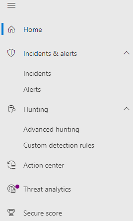

# <a name="microsoft-defender-for-office-365-in-the-microsoft-365-security-center"></a>Microsoft Defender voor Office 365 in het Microsoft 365-beveiligingscentrum

[!INCLUDE [Microsoft 365 Defender rebranding](../includes/microsoft-defender.md)]

**Van toepassing op:**
- [Microsoft 365 Defender](microsoft-365-defender.md)
- [Microsoft Defender voor Endpoint](https://go.microsoft.com/fwlink/p/?linkid=2154037)
- [Microsoft Defender voor Office 365](/microsoft-365/security/office-365-security/defender-for-office-365)

## <a name="quick-reference"></a>Snelzoekverwijzing

De afbeelding en de onderstaande tabel bevat de wijzigingen in de navigatie tussen het Office 365 beveiligingscentrum & compliancecentrum en het Microsoft 365 beveiligingscentrum.

> [!div class="mx-imgBorder"]
> 

<br>

****

|Office 365 Beveiligings- & compliance|Microsoft 365-beveiligingscentrum|Microsoft 365-compliancecentrum|Exchange-beheercentrum|
|---|---|---|---|
|Waarschuwingen|E-mail en samenwerking|||
|Classificatie||Zie [Microsoft 365 compliancecentrum](https://compliance.microsoft.com/homepage)||
|Preventie van gegevensverlies||Zie [Microsoft 365 compliancecentrum](https://compliance.microsoft.com/homepage)||
|Records Management||Zie [Microsoft 365 compliancecentrum](https://compliance.microsoft.com/homepage) ||
|Informatiebeheer||Zie [Microsoft 365 compliancecentrum](https://compliance.microsoft.com/homepage)||
|Bedreigingsbeheer|E-mail en samenwerking|||
|E-mailstroom|||Zie [Exchange beheercentrum](https://admin.exchange.microsoft.com/#/)|
|Gegevensprivacy||Zie [Microsoft 365 compliancecentrum](https://compliance.microsoft.com/homepage)||
|Zoeken|Zoeken|||
|Rapporten|Rapport|||
|Servicecontrole|Instellingen|||
|

Het verbeterde [Microsoft 365 beveiligingscentrum](./overview-security-center.md) in <https://security.microsoft.com> combineert beveiligingsfuncties uit bestaande Microsoft beveiligingsportalen, inclusief Microsoft Defender beveiligingscentrum en het Office 365 beveiligings- en compliancecentrum. Dit verbeterde centrum helpt beveiligingsteams hun organisatie doeltreffender en efficiënter beschermen tegen bedreigingen.

Het artikel over het Office 365 beveiligings- en complianceportaal (protection.office.com) geeft een beschrijving van enkele wijzigingen en verbeteringen aan het Microsoft Office 365 beveiligingscentrum. 

Meer informatie over voordelen: [Overzicht van Microsoft 365-beveiligingscentrum](overview-security-center.md)

Als je op zoek bent naar items gerelateerd aan compliance, bezoek dan het [Microsoft 365-compliancecentrum](https://compliance.microsoft.com/homepage).

## <a name="whats-changed"></a>Wat is er gewijzigd

Deze tabel is een snelle verwijzing naar gebieden van E-mail en Samenwerking waar wijzigen zijn aangebracht aan het **Beveiligings- en compliancecentrum** en het **Microsoft 365-beveiligingsportaal**. Klik op de snelkoppelingen om meer te lezen over deze gebieden.

<br>

****

|Gebied|Beschrijving van wijziging|
|---|---|
|[Entiteitspagina van e-mail](../office-365-security/mdo-email-entity-page.md)|Deze pagina **verenigt** e-mailgegevens die over verschillende pagina's of weergaves in het verleden zijn verspreid. E-mails onderzoeken voor bedreigingen en trends is *gecentraliseerd*. Koptekstinformatie en preview van e-mail zijn beschikbaar via dezelfde e-mailpagina, samen met andere handige informatie over e-mails. Ook de deactiveringsstatus voor schadelijke bestandsbijlagen of URL's kunnen teruggevonden worden op het tabblad op dezelfde pagina. De E-mailentiteitspagina geeft de beheerder en beveiligingsteams de mogelijkheid om de bedreiging van e-mails en de status hiervan te begrijpen en vervolgens snel te handelen.|
|[Onderzoek](../office-365-security/office-365-air.md#changes-are-coming-soon-in-your-security-center)|Dit brengt AIR-functies samen in [Defender voor Office 365](/microsoft-365/security/office-365-security/defender-for-office-365) en [Defender voor eindpunt](../defender-endpoint/automated-investigations.md). Met deze updates en verbeteringen kan jouw beveiligingsteam informatie bekijken over geautomatiseerde onderzoeken en herstelacties in e-mail, samenwerkingsinhoud, gebruikersaccounts en apparaten, allemaal op één plaats.|
|[Waarschuwingsweergave](../../compliance/alert-policies.md)|Het flyoutvenster **Waarschuwingen weergeven** in het Office beveiligings- en compliancecentrum heeft nu ook snelkoppelingen naar het Microsoft 365-beveiligingscentrum. Klik op de snelkoppeling **Waarschuwingspagina openen** om het Microsoft 365-beveiligingscentrum te openen. Klik op eender welke Office 365-waarschuwing in de Waarschingswachtrij om toegang te krijgen tot de pagina **Waarschuwingen weergeven**.|
|[Aanvalssimulatietraining](../office-365-security/attack-simulation-training-insights.md)|Gebruik Aanvalssimulatietraining om realistische aanvalsscenario's uit te voeren in jouw organisatie. Met deze gesimuleerde aanvallen kan je jouw personeel trainen voordat een echte aanval jouw organisatie treft. Aanvalssimulatietraining bevat meer opties, geavanceerde rapporten en verbeterde trainingsstromen waardoor je de aanvalsscenario's en trainingsscenario's gemakkelijk kan leveren en beheren.|
|

Geen wijzigingen aan deze gebieden:

- [Verkenner](../office-365-security/threat-explorer.md)
- [Beleid en regels](../../compliance/alert-policies.md)
- [Campagne](../office-365-security/campaigns.md)
- [Inzendingen](../office-365-security/admin-submission.md)
- [Controle](./m365d-action-center.md)
- [Bedreigingstrackers](../office-365-security/threat-trackers.md)

Controleer ook de sectie **Relevante informatie** onderaan dit artikel.

> [!IMPORTANT]
> De Microsoft 365 Beveiligingsportal <https://security.microsoft.com> () combineert beveiligingsfuncties in <https://securitycenter.windows.com> en <https://protection.office.com> . Wat je te zien krijgt hangt echter af van het abonnement. Als je bijvoorbeeld enkel Microsoft Defender voor Office 365 Plan 1 of 2 hebt als alleenstaande abonnementen, zal je geen functies voor Beveiliging voor eindpunten te zien krijgen en klanten van Defender voor Office Plan 1 zullen geen items te zien krijgen zoals Dreigingsanalyse.

> [!TIP]
> Alle Exchange Online Protection (EOP)-functies worden opgenomen in het Microsoft 365 beveiligingscentrum, omdat EOP een kernelement is van Defender voor Office 365.

## <a name="microsoft-365-security-center-home-page"></a>Startpagina van Microsoft 365-beveiligingscentrum

De startpagina van de portaaloppervlakken:

- Secure Score beoordelingen
- het aantal gebruikers en apparaten die risico lopen
- actieve incidentwachtrij
- lijsten van bevoegde OAuth-apps
- statusgegevens van apparaat
- tweets uit de feed van Twitter van beveiligingsanalyse van Microsoft.
- en meer samenvattingsinformatie

Met de **Rondleiding** kan je snel de pagina's Eindpunt of E-mail en samenwerking verkennen. Merk op dat wat je te zien krijgt afhangt of je een licentie voor Defender voor Office 365 en/of Defender voor Eindpunt hebt.

Er is ook een snelkoppeling naar het **Office 365 beveiligings- en compliancecentrum** ter vergelijking. De laatste snelkoppeling is naar de pagina **Nieuw**, die recente updates beschrijft.

## <a name="improved-capabilities"></a>Verbeterde functies

De navigatie links, of balk snel starten, is vast bekend. Er zijn echter enkele nieuwe en bijgewerkte elementen in dit beveiligingscentrum.

### <a name="incidents-and-alerts"></a>Incidenten en waarschuwingen

Dit brengt beheer voor incidenten en waarschuwingen samen voor e-mail, apparaten en identiteiten. Waarschuwingen zijn nu beschikbaar onder het knooppunt Onderzoek en hiermee wordt een breder zicht op een aanval gegeven. De waarschuwingspagina biedt volledige context bij een waarschuwing door signalen van een aanval te combineren om een gedetailleerd verhaal op te bouwen. Voordien waren waarschuwingen specifiek voor verschillende workloads. Een nieuwe, verenigde ervaring brengt nu een consistente weergave samen voor waarschuwingen in verschillende workloads. Je kan snel sorteren, onderzoeken en doeltreffend actie ondernemen.

- [Meer informatie over Onderzoeken](incidents-overview.md)
- [Meer informatie over het beheren van waarschuwingen](/windows/security/threat-protection/microsoft-defender-atp/review-alerts)



### <a name="hunting"></a>Opsporing

Spoor proactief dreigingen, malware en schadelijke activiteiten op in de eindpunten, Office 365 postvakken en meer met behulp van [geavanceerde opsporingsquery's](advanced-hunting-overview.md). Deze krachtige query's kunnen gebruikt worden om dreigingsindicatoren en entiteiten voor bekende en potentiële dreigingen te lokaliseren en controleren.

[Aangepaste detectieregels](/windows/security/threat-protection/microsoft-defender-atp/custom-detection-rules) kunnen gemaakt worden uit geavanceerde opsporingsquery's waarmee je proactief kan uitkijken voor gebeurtenissen die kunnen aanwijzen op inbreuk en verkeerd geconfigureerde apparaten.

### <a name="action-center"></a>Actiecentrum

Het Actiecentrum geeft de onderzoeken weer die aangemaakt werden door geautomatiseerde onderzoeks- en reactiefuncties. Deze geautomatiseerde self-healing in Microsoft 365 Defender kan beveiligingsteams bijstaan bij het automatisch reageren op specifieke gebeurtenissen.

[Meer informatie over Actiecentrum](m365d-action-center.md)

#### <a name="threat-analytics"></a>Dreigingsanalyse

Haal bedreigingsinformatie op via Microsoft beveiligingsonderzoeksexperten. Dreigingsanalyse helpt beveiligingsteams efficiënter omgaan met opkomende dreigingen. Dreigingsanalyse houdt in:

- E-mailgerelateerde detectie en beperkingen uit Microsoft Defender voor Office 365. Dit is bovenop de eindpuntgegevens die reeds beschikbaar zijn in Microsoft Defender voor Eindpunt.
- Incidentenweergave gerelateerd aan dreigingen.
- Geavanceerde ervaring voor snelle identificatie en gebruik van informatie waarop actie kan op uitgevoerd worden in de rapporten.
Toegang krijgen tot dreigingsanalyse kan via de navigatiebalk links bovenaan het Microsoft 365-beveiligingscentrum of via de toegewezen dashboardkaart die de belangrijkste dreigingen voor jouw organisatie weergeeft.

Meer informatie over hoe je [opkomende dreigingen kan traceren en beantwoorden met dreigingsanalyse](./threat-analytics.md)

### <a name="email--collaboration"></a>E-mail en samenwerking

Traceer en onderzoek dreigingen op e-mails van gebruikers, traceer campagnes en meer. Als je Office 365 beveiligings- en compliancecentrum reeds gebruikt hebt, zal je dit bekend zijn.

:::image type="content" source="../../media/converge-3-email-and-collab-new.png" alt-text="Het menu snel starten voor E-mail en samenwerken (of MSDO) aan de linkerzijde van het Microsoft 365-beveiligingscentrum.":::

### <a name="access-and-reports"></a>Toegang en rapporten

Bekijk rapporten, wijzig instellingen en gebruikersrollen.

:::image type="content" source="../../media/converge-4-access-and-reporting-new.png" alt-text="Het menu snel starten voor machtigingen en rapportage in het Microsoft 365-beveiligingscentrum, aan de linkerzijde van het beveiligingscentrum.":::

> [!NOTE]
> Voor Defender voor Office 365-gebruikers kunt  u nu DKIM-sleutels (DomainKeys Identified Mail) beheren en draaien via het Microsoft 365-beveiligingscentrum: of naar Beleidsregels & bedreigingsbeleid <https://security.microsoft.com/threatpolicy>  \>  \> **DKIM** gaan.

## <a name="advanced-hunting-example-for-microsoft-defender-for-office-365"></a>Voorbeeld van geavanceerde opsporing voor Microsoft Defender voor Office 365

Wil je aan de slag met het zoeken naar e-maildreigingen met geavanceerde opsporing? Probeer dit:

De sectie [Aan de slag](/microsoft-365/security/office-365-security/defender-for-office-365.md#getting-started) van het [Artikel over Microsoft Defender voor Office 365](/microsoft-365/security/office-365-security/defender-for-office-365) heeft logische vroege configuratiesegmenten die er als volgt uitzien:

1. Configureer alles met 'Anti' in de naam.
   - Anti-malware
   - Anti-phishing
   - Antispam
2. Stel alles in met 'Safe' in de naam.
   - Veilige koppelingen
   - Veilige bijlagen
3. De werkbelastingen verdedigen (bijv. SharePoint Online, OneDrive en Teams).
4. Beveiligen met auto purge van nul uur.

Samen met de [snelkoppeling](../office-365-security/protect-against-threats.md) om meteen aan de slag te gaan en start de configuratie op Dag 1.

De laatste stap in **Aan de slag** is de bescherming van gebruikers met **Zero-Hour Auto Purge**, ook bekend als ZAP. Het kan heel belangrijk zijn om te weten of jouw inspanningen om verdachte of schadelijke e-mail te zappen na levering succesvol waren of niet.

Een belangrijk voordeel van het samenvoegen van deze twee beveiligingscentra is snelle navigatie naar Kusto querytaal om problemen op te sporen. Beveiligingsteams kunnen ZAP-missers controleren door hun volgende [stappen](https://security.microsoft.com/advanced-hunting)hier onder **Geavanceerd** jagen \> **te volgen.**

1. Klik op Query op de pagina Geavanceerde opsporing.
1. Kopieer de query onderaan naar het queryvenster.
1. Selecteer Query uitvoeren.

```kusto
EmailPostDeliveryEvents 
| where Timestamp > ago(7d)
//List malicious emails that were not zapped successfullyconverge-2-endpoints-new.png
| where ActionType has "ZAP" and ActionResult == "Error"
| project ZapTime = Timestamp, ActionType, NetworkMessageId , RecipientEmailAddress 
//Get logon activity of recipients using RecipientEmailAddress and AccountUpn
| join kind=inner IdentityLogonEvents on $left.RecipientEmailAddress == $right.AccountUpn
| where Timestamp between ((ZapTime-24h) .. (ZapTime+24h))
//Show only pertinent info, such as account name, the app or service, protocol, the target device, and type of logon
| project ZapTime, ActionType, NetworkMessageId , RecipientEmailAddress, AccountUpn, 
LogonTime = Timestamp, AccountDisplayName, Application, Protocol, DeviceName, LogonType
```

:::image type="content" source="../../media/converge-13-advanced-hunt-an-email-zap-new.png" alt-text="De pagina Geavanceerd zoeken (onder Jagen) met Query geselecteerd boven aan het queryvenster en het uitvoeren van een Kusto-query om ZAP-acties in de afgelopen 7 dagen vast te leggen.":::

De gegevens van deze query zullen in het resultatenvenster onder de query zelf zichtbaar zijn. Resultaten bevatten informatie zoal 'DeviceName', 'AccountDisplayName' en 'ZapTime' in een resultatenset die kan aangepast worden. Resultaten kunnen geëxporteerd worden voor het archief. Als het om een query gaat die je later opnieuw nodig zult hebben, selecteer dan **Opslaan** > **Opslaan als** en voeg de query toe aan de lijst van query's, gedeeld of community query's.

## <a name="related-information"></a>Gerelateerde informatie

- [Microsoft Defender voor Office 365 in het Microsoft 365-beveiligingscentrum](microsoft-365-security-center-mdo.md)
- [Het Actiecentrum](./m365d-action-center.md)
- [Waarschuwingen voor E-mail en samenwerking](../../compliance/alert-policies.md#default-alert-policies)
- [Dreigingen in apparaten, e-mailberichten, apps en identiteiten opsporen](./advanced-hunting-query-emails-devices.md)
- [Aangepaste regels voor detectie](/microsoft-365/security/defender-endpoint/custom-detection-rules)
- [Een simulatie voor een phishing-aanval maken](../office-365-security/attack-simulation-training.md) en [een nettolading maken voor de training van jouw personeel](../office-365-security/attack-simulation-training-payloads.md)
