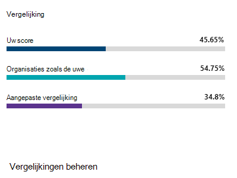

# Uw Microsoft Secure Score-geschiedenis bijhouden en doelstellingen behalen

[!INCLUDE [Microsoft 365 Defender rebranding](../includes/microsoft-defender.md)]

[Microsoft Secure Score](microsoft-secure-score.md) is een meting van de beveiligingsstatus van een organisatie, waarbij een hoger aantal aangeeft dat er meer verbeteracties zijn uitgevoerd. Deze is te vinden https://security.microsoft.com/securescore in het [Microsoft 365-beveiligingscentrum.](overview-security-center.md)

## Inzichten krijgen in activiteiten die van invloed zijn op uw score

Bekijk een grafiek van de score van uw organisatie in de tijd op **het tabblad** Geschiedenis.

Onder de grafiek ziet u een lijst met alle acties in het geselecteerde tijdbereik en de kenmerken, zoals resulterende punten en categorie. U kunt een datumbereik aanpassen en filteren op categorie.

Als u de verbeteringsactie selecteert die is gekoppeld aan een activiteit, wordt de flyout actie voor volledige verbetering weergegeven.

Als u alle geschiedenis voor die specifieke verbeteringsactie wilt weergeven, selecteert u de koppeling Geschiedenis in de flyout.

## Trends ontdekken en doelen stellen

Op het **tabblad & trends** zijn er verschillende grafieken en grafieken om u meer inzicht te geven in trends en doelen te stellen. U kunt het datumbereik instellen voor de hele pagina met visualisaties. De visualisaties omvatten:

* **Uw veilige scorezone:** aangepast op basis van de doelen en definities van goede, goede en slechte scorebereiken van uw organisatie.
* **Regressietrend:** een tijdlijn met punten die zijn teruggegaan vanwege configuratie-, gebruikers- of apparaatwijzigingen.  
* **Vergelijkingstrend:** hoe de Secure Score van uw organisatie zich verhoudt tot die van anderen in de tijd. Deze weergave kan lijnen bevatten die het scoregemiddelde vertegenwoordigen van organisaties met hetzelfde aantal zitplaatsen en een aangepaste vergelijkingsweergave die u kunt instellen.
* **Trend voor acceptatie van risico'** - Tijdlijn van verbeteracties gemarkeerd als 'geaccepteerd risico'.
* **Scorewijzigingen:** het aantal punten dat is bereikt, de punten zijn teruggegaan en de score wordt gewijzigd in het opgegeven datumbereik.

### Uw score vergelijken met organisaties zoals die van u

Er zijn twee plaatsen om te zien hoe uw score zich verhoudt tot organisaties die op u lijken. In beide grafieken kunt u **Vergelijkingen beheren selecteren om** de gegevens van uw organisatie weer te geven en te bewerken. U kunt ook een aangepaste vergelijking maken op basis van industrie, organisatiegrootte, licenties en regio's.

#### Vergelijkingsbalkdiagram

Het vergelijkingsbalkdiagram is het **tabblad** Overzicht. Beweeg de muisaanwijzer over de grafiek om de score en scorekans weer te geven. De vergelijkingsgegevens worden geanonimiseerd, zodat we niet precies weten welke andere tenants in de mix zitten.

- **Organisaties zoals u:** een gemiddelde score van andere tenants (mits we ten minste vijf of meer tenants hebben om te vergelijken) die in aanmerking komen voor de volgende criteria:
    1. Dezelfde industrie
    2. Dezelfde grootte van de organisatie
    3. Alle regio's
    4. Microsoft-producten die worden gebruikt, lijken 80% op elkaar
    5. Kans (maximale score die kan worden bereikt met de huidige licentie) binnen een bereik van 20% van uw tenant

- **Aangepaste vergelijking:** moet worden ingesteld door Vergelijking beheren te **selecteren** op basis van de volgende criteria:
    1. Geselecteerde bedrijfstak(en)
    2. Geselecteerde organisatiegrootte(en)
    3. Geselecteerde regio(en)
    4. Geselecteerde licentie(en)
    5. Microsoft-producten die worden gebruikt, lijken 80% op elkaar
    6. Kans (maximale score die kan worden bereikt met de huidige licentie) binnen een bereik van 20% van uw tenant

Als u een aangepaste selectie hebt gemaakt, maar de resultaten minder dan vijf andere tenants hebben die we kunnen vergelijken, ziet u 'Niet beschikbaar vanwege beperkte gegevens'.

#### Vergelijkingstrend

Bekijk op **het tabblad & trends** hoe de secure score van uw organisatie zich verhoudt tot die van anderen.

## Wij horen graag van u

Als u problemen hebt, laat het ons weten door een bericht te plaatsen in de [beveiligings-, privacy- & Compliance-community.](https://techcommunity.microsoft.com/t5/Security-Privacy-Compliance/bd-p/security_privacy) We houden de community in de gaten en bieden hulp.

## Verwante informatiebronnen

- [Overzicht van Microsoft Secure Score](microsoft-secure-score.md)
- [Uw beveiligingspositie vaststellen](microsoft-secure-score-improvement-actions.md)
- [Binnenkort beschikbaar](microsoft-secure-score-whats-coming.md)
- [Nieuwe functies](microsoft-secure-score-whats-new.md)
