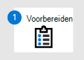
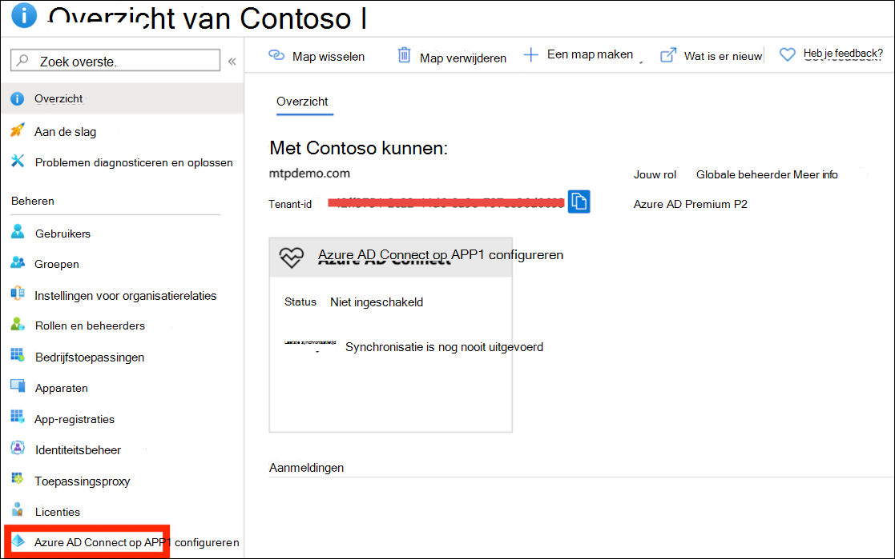
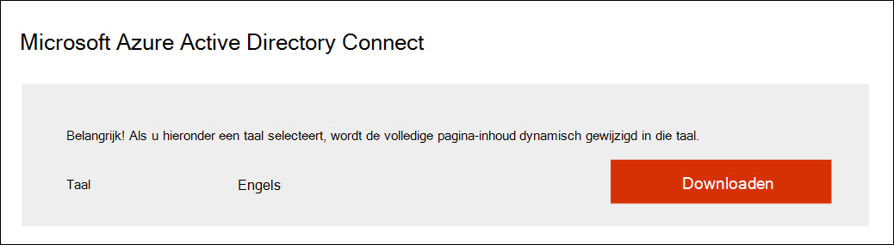
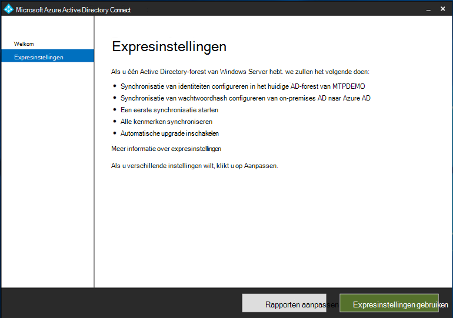
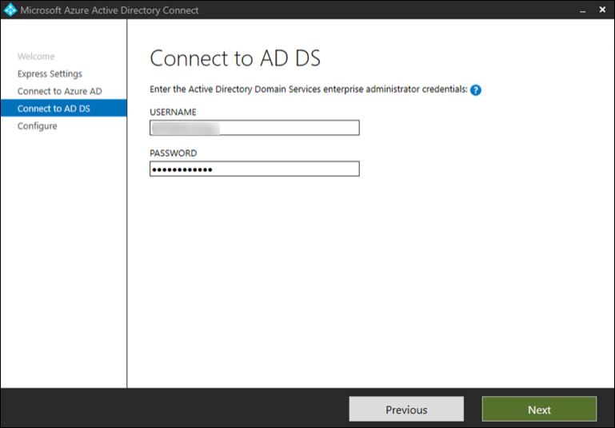
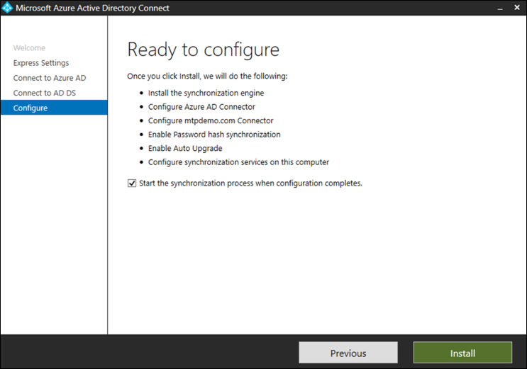
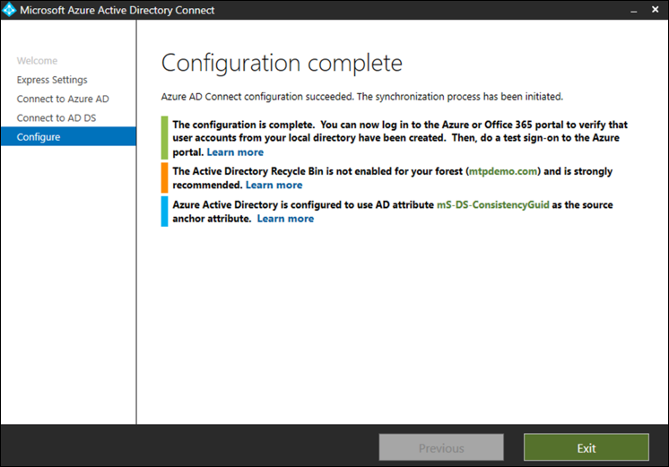

# Uw proeflaboratorium Microsoft 365 Defender testomgeving voorbereiden

[!INCLUDE [Microsoft 365 Defender rebranding](../includes/microsoft-defender.md)]

**Van toepassing op:**
- Microsoft 365 Defender

Het maken Microsoft 365 Defender testlaboratorium of testomgeving en de implementatie ervan is een proces in drie fasen:

| Fase 1: Voorbereiden | [Fase 2: Instellen](setup-m365deval.md) | [Fase 3: Onboarden](config-m365d-eval.md) |  [Terug naar pilot playbook](m365d-pilot.md) |
|--|--|--|--|
|*U bent er!* | || |

U bent momenteel bezig met de voorbereidingsfase.

Voorbereiding is essentieel voor een geslaagde implementatie. In deze sectie wordt u begeleid bij wat u moet overwegen terwijl u zich voorbereidt op het maken van een proeflaboratorium of testomgeving voor uw Microsoft 365 Defender implementatie.

## Vereisten
Meer informatie over de licentie-, hardware- en softwarevereisten en andere configuratie-instellingen voor het inrichten en gebruiken van Microsoft 365 Defender. Bekijk de minimumvereisten voor [Microsoft 365 Defender](/microsoft-365/security/defender/prerequisites), [Microsoft Defender voor](/windows/security/threat-protection/microsoft-defender-atp/minimum-requirements)Eindpunt , Microsoft Defender [voor](/office365/servicedescriptions/office-365-advanced-threat-protection-service-description)Office 365 , Microsoft [Defender voor](/azure-advanced-threat-protection/atp-prerequisites)identiteit , [Microsoft Cloud App Security](/azure-advanced-threat-protection/atp-prerequisites).

## Belanghebbenden en aanmelding
Identificeer alle belanghebbenden die betrokken zijn bij het project en wie zich mogelijk moeten aanmelden, controleren of op de hoogte moeten blijven, ongeacht of ze een testproject willen evalueren of uitvoeren.

>[!NOTE]
>Niet alle organisaties hebben mogelijk de vervaldatum van de beveiligingsorganisatie om dergelijke rollen te hebben. In dat geval overlegt u met uw leidinggevende team over controle- en goedkeuringsaccountvaardigheden.

Voeg belanghebbenden toe aan de onderstaande tabel voor uw organisatie.

-   SO = Aanmelden bij dit project

-   R = Controleer dit project en geef input

-   I = Op de hoogte van dit project

| Naam                 | Rol                                                                                                                                                                                                          | Actie |
|----------------------|---------------------------------------------------------------------------------------------------------------------------------------------------------------------------------------------------------------|--------|
| Naam en e-mail invoeren | **CiSO (Chief Information Security Officer)** Een uitvoerend vertegenwoordiger die fungeert als sponsor binnen de *organisatie voor de implementatie van nieuwe technologie.*                                                  | SO     |
| Naam en e-mail invoeren | **Hoofd van het Cyber Defense Operations Center (CDOC) Een** vertegenwoordiger van het *CDOC-team* dat verantwoordelijk is voor het definiëren van de manier waarop deze wijziging wordt afgestemd op de processen in het beveiligingsteam van klanten.       | SO     |
| Naam en e-mail invoeren | **Beveiligingsarchitect** Een vertegenwoordiger van het beveiligingsteam die verantwoordelijk is voor het definiëren van de manier waarop deze wijziging wordt uitgelijnd met de *belangrijkste beveiligingsarchitectuur in de organisatie.*                         | R      |
| Naam en e-mail invoeren | **Werkplekarchitect** *Een vertegenwoordiger van het IT-team* die verantwoordelijk is voor het definiëren van de manier waarop deze wijziging wordt afgestemd op de basisarchitectuur van de werkplek in de organisatie.                             | R      |
| Naam en e-mail invoeren | **Beveiligingsanalist** Een vertegenwoordiger van het CDOC-team die feedback kan geven over de detectiemogelijkheden, gebruikerservaring en het algemene nut van deze wijziging vanuit het perspectief van *beveiligingsbewerkingen.* | I      |

## Bereid uw Azure Active Directory
Sla deze stap over als u synchronisatie al hebt ingeschakeld tussen Active Directory en Azure Active Directory on-premises. Bekijk bestaande best practices-documentatie van Azure Active Directory. De volgende stappen zijn geoptimaliseerd voor het evalueren of uitvoeren van een pilot Microsoft 365 Defender project.

1. Ga naar de [Azure Active Directory](https://portal.azure.com/#blade/Microsoft_AAD_IAM/ActiveDirectoryMenuBlade) portal > **Azure AD Verbinding maken.** 
   

2. Klik **op** Downloaden **van Microsoft Azure Active Directory Verbinding maken** en breng deze over naar uw domeincontroller.
  

3. Volg de wizard Azure Active Directory Verbinding maken domeincontroller. Lees de licentievoorwaarden en privacyverklaring en schakel het selectievakje in als u akkoord gaat. Klik op **Continue**.
  

4. Ga naar **Express Instellingen.**
  

5. Voer uw globale beheerdersreferenties in. Klik op **Volgende**.
  

6. Voer uw beheerdersreferenties voor Active Directory Domain Services in. Klik op **Volgende**.
  

7. Klik **op Installeren** om de configuratie te bevestigen.
  

8. Gefeliciteerd, u hebt de configuratie Azure Active Directory Verbinding maken.
  

U kunt nu [gebruikers en groepen toevoegen aan Active Directory](/azure-advanced-threat-protection/atp-playbook-setup-lab#bkmk_hydrate) en een [SAM-R-beleid configureren.](/azure-advanced-threat-protection/atp-playbook-setup-lab#configure-sam-r-capabilities-from-contosodc)  

## Configuratieorder
In de volgende tabel wordt aangegeven welke volgorde Microsoft aanbeveelt voor het configureren van de Microsoft 365 Defender onderdelen voor de implementatie van uw proeflaboratorium of testomgeving.

| Onderdeel                               | Omschrijving                                                                                                                                                                                                                                                                                                                                                                                                                                                                                                                                                                                                                                                                                              | Rangschikking van configuratieorders |
|-----------------------------------------|----------------------------------------------------------------------------------------------------------------------------------------------------------------------------------------------------------------------------------------------------------------------------------------------------------------------------------------------------------------------------------------------------------------------------------------------------------------------------------------------------------------------------------------------------------------------------------------------------------------------------------------------------------------------------------------------------------|---------------------|
|Microsoft Defender voor Office 365|Microsoft Defender voor Office 365 beschermt je organisatie tegen kwaadwillende bedreigingen afkomstig van e-mailberichten, koppelingen (URL’s) en hulpmiddelen voor samenwerking.   [Meer informatie.](/microsoft-365/security/office-365-security/defender-for-office-365)                                                                                                                                                                                                                                             | 1                   |
|Microsoft Defender for Identity|Microsoft Defender voor identiteit gebruikt Active Directory-signalen om geavanceerde bedreigingen, gecompromitteerde identiteiten en kwaadaardige insideracties die zijn gericht op uw organisatie te identificeren, te detecteren en te onderzoeken.   [Meer informatie](/azure-advanced-threat-protection/).| 2 |
|Microsoft Cloud App Security| Microsoft Cloud App Security is een Cloud Access Security Broker (CASB) die op meerdere clouds werkt. Het biedt uitgebreide zichtbaarheid, controle over het reizen van gegevens en geavanceerde analyses om cyberaanvallen in al uw cloudservices te identificeren en te bestrijden.   [Meer informatie](/cloud-app-security/).                                                                                                                                                                                                                                                                                                                                                                       |3                   |
|Microsoft Defender voor Eindpunt | Microsoft Defender voor Eindpunt de mogelijkheden voor detectie van en reactie op eindpunten bieden detectie van geavanceerde aanvallen die bijna in realtime en uitvoerbaar zijn. Beveiligingsanalisten kunnen waarschuwingen effectief prioriteit geven, zichtbaarheid krijgen in het volledige bereik van een beveiligingsschending en reactieacties ondernemen om bedreigingen te herstellen.   [Meer informatie.](/windows/security/threat-protection/microsoft-defender-atp/microsoft-defender-advanced-threat-protection)                                     |4                   |                                                                                                                                                                                                                                    

## Volgende stap
|  [Fase 2: Instellen](setup-m365deval.md) | Uw testlaboratorium Microsoft 365 Defender testomgeving instellen
|:-------|:-----|
