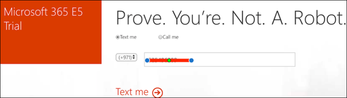

# Uw proeflabomgeving voor Microsoft 365 Defender instellen 

[!INCLUDE [Microsoft 365 Defender rebranding](../includes/microsoft-defender.md)]

**Van toepassing op:**
- Microsoft 365 Defender 

Het maken van een proeflaboratorium of testomgeving van Microsoft 365 Defender en de implementatie ervan is een proces in drie fasen:

| [Fase 1: Voorbereiden](prepare-m365d-eval.md) | Fase 2: Instellen | [Fase 3: Onboard](config-m365d-eval.md) |  [Terug naar pilot playbook](m365d-pilot.md) |
|--|--|--|--|
||*U bent er!*  | | |

U bent momenteel in de set-upfase. Neem de eerste stappen om toegang te krijgen tot het Microsoft 365-beveiligingscentrum en stel vervolgens uw proeflaboratorium of testomgeving in.

Meld u aan voor een Office 365- of Azure Active *Directory-abonnement* om een .onmicrosoft.com-tenant te genereren die u kunt gebruiken om u aan te melden voor uw Microsoft 365 E5-licentie. 

>[!NOTE]
>Als u al een bestaand Office 365- of Azure Active Directory-abonnement hebt, kunt u de proefversie of proefversie van Office 365 E5 overslaan.

In deze fase wordt u begeleid naar:
- Een proefversie van Office 365 E5 maken
- Proefabonnement op Microsoft 365 inschakelen

## Een proefversie van Office 365 E5 maken
>[!NOTE]
>Als u al een bestaand Office 365- of Azure Active Directory-abonnement hebt, kunt u de stappen voor het maken van proefversies van Office 365 E5 overslaan.

1. Ga naar de [Office 365 E5-productportal](https://www.microsoft.com/microsoft-365/business/office-365-enterprise-e5-business-software?activetab=pivot%3aoverviewtab) en selecteer **Gratis proefabonnement.**

   
  
2. Voltooi de proefregistratie door uw e-mailadres (persoonlijk of zakelijk) in te vullen. Klik **op Account instellen.**

   

3. Vul uw voornaam, achternaam, zakelijke telefoonnummer, bedrijfsnaam, bedrijfsgrootte en land of regio in.  

   
   
   > [!NOTE]
   > Het land of de regio die u hier hebt ingesteld, bepaalt de datacenterregio waar uw Office 365 wordt gehost.
  
4. Kies uw verificatievoorkeur: via een sms-bericht of oproep. Klik **op Verificatiecode verzenden.** 

   

5. Stel de aangepaste domeinnaam in voor uw tenant en klik vervolgens op **Volgende.**

   
 
6. Stel de eerste identiteit in, die een globale beheerder voor de tenant is. Vul Naam **en** **wachtwoord in.** Klik **op Registreren**.

   

7. Klik **op Ga naar Setup om** de inrichting van de proefversie van Office 365 E5 te voltooien.

   

8. Verbind uw bedrijfsdomein met de Office 365-tenant. [Optioneel] Kies **Verbinding maken met een domein dat u al hebt** en typ uw domeinnaam. Klik op **Volgende**.

   
 
9. Voeg een TXT- of MX-record toe om het domeineigenschap te valideren. Nadat u de TXT- of MX-record aan uw domein hebt toegevoegd, selecteert u **Verifiëren.**

   
 
10. [Optioneel] Maak meer gebruikersaccounts voor uw tenant. U kunt deze stap overslaan door op Volgende te **klikken.**

    
 
11. [Optioneel] Office-apps downloaden. Klik **op Volgende** om deze stap over te slaan. 

    

12. [Optioneel] E-mailberichten migreren. Nogmaals, u kunt deze stap overslaan.

    
 
13. Kies onlineservices. Selecteer **Exchange** en klik op **Volgende.** 

    

14. Voeg MX-, CNAME- en TXT-records toe aan uw domein. Wanneer u klaar is, selecteert u **Verifiëren.**

    
 
15. Gefeliciteerd, u hebt de inrichting van uw Office 365-tenant voltooid.

    

## Proefabonnement op Microsoft 365 inschakelen

>[!NOTE]
>Als u zich aanmeldt voor een proefabonnement, krijgt u 25 gebruikerslicenties voor een maand. Zie [Een M365-abonnement](../../commerce/try-or-buy-microsoft-365.md) proberen of kopen voor meer informatie.

1. Klik [in het Microsoft 365-beheercentrum](https://admin.microsoft.com/)op **Facturering** en ga naar **Services aanschaffen.**

2. Selecteer **Microsoft 365 E5 en** klik op Gratis **proefabonnement starten.** 

   

3. Kies uw verificatievoorkeur: via een sms-bericht of oproep. Nadat u hebt besloten, voert u het telefoonnummer in, selecteert u **Mij sms'en** of **Mij bellen,** afhankelijk van uw selectie.

   
 
4. Voer de verificatiecode in en klik **op Uw gratis proefabonnement starten.**

   

5. Klik **op Nu proberen** om uw proefversie van Microsoft 365 E5 te bevestigen.

   
 
6. Ga naar het **Microsoft 365-beheercentrum**  >  **Gebruikers Actieve**  >  **gebruikers**. Selecteer uw gebruikersaccount, selecteer **Productlicenties beheren** en verwissel de licentie van Office 365 E5 naar **Microsoft 365 E5.** Klik op **Opslaan**.

   
 
7. Selecteer nogmaals het globale beheerdersaccount en klik **op Gebruikersnaam beheren.**

   

8. [Optioneel] Wijzig het domein van *onmicrosoft.com* in uw eigen domein, afhankelijk van wat u hebt gekozen in de vorige stappen. Klik op **Wijzigingen opslaan**.

   

## Volgende stap
|[Fase 3: Configureren & Onboard](config-m365d-eval.md) | Configureer elke Microsoft 365 Defender-pijler voor uw proeflaboratorium of testomgeving van Microsoft 365 Defender en gebruik uw eindpunten.
|:-------|:-----|
