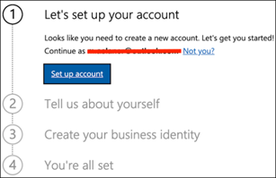

# Uw proefversie Microsoft 365 Defender in een labomgeving instellenSet up your Microsoft 365 Defender trial in a lab environment 

[!INCLUDE [Microsoft 365 Defender rebranding](../includes/microsoft-defender.md)]

**Van toepassing op:****Applies to:**
- Microsoft 365 DefenderMicrosoft 365 Defender 

In dit onderwerp wordt u begeleid bij het instellen van een speciale labomgeving.This topic guides you to set up a dedicated lab environment. Zie de nieuwe handleiding Evalueren en Microsoft 365 Defender voor informatie over het instellen van [een proefversie in productie.](eval-overview.md)For information on setting up a trial in production, see the new [Evaluate and pilot Microsoft 365 Defender](eval-overview.md) guide. 

## Een proef tenant Office 365 E5 makenCreate an Office 365 E5 trial tenant
>[!NOTE]
>Als u al een bestaand abonnement Office 365 of Azure Active Directory hebt, kunt u de stappen voor het maken Office 365 E5 proefversie van tenants overslaan.If you already have an existing Office 365 or Azure Active Directory subscription, you can skip the Office 365 E5 trial tenant creation steps.

1. Ga naar de [Office 365 E5 productportal en](https://www.microsoft.com/microsoft-365/business/office-365-enterprise-e5-business-software?activetab=pivot%3aoverviewtab) selecteer **Gratis proefabonnement.**Go to the [Office 365 E5 product portal](https://www.microsoft.com/microsoft-365/business/office-365-enterprise-e5-business-software?activetab=pivot%3aoverviewtab) and select **Free trial**.

   
  
2. Voltooi de proefregistratie door uw e-mailadres (persoonlijk of zakelijk) in te vullen.Complete the trial registration by entering your email address (personal or corporate). Klik **op Account instellen.**Click **Set up account**.

   

3. Vul uw voornaam, achternaam, zakelijke telefoonnummer, bedrijfsnaam, bedrijfsgrootte en land of regio in.Fill in your first name, last name, business phone number, company name, company size, and country or region.  

   
   
   > [!NOTE]
   > Het land of de regio die u hier hebt ingesteld, bepaalt de datacenterregio waar Office 365 wordt gehost.The country or region you set here determines the data center region your Office 365 will be hosted.
  
4. Kies uw verificatievoorkeur: via een sms-bericht of oproep.Choose your verification preference: through a text message or call. Klik **op Verificatiecode verzenden.**Click **Send Verification Code**. 

   

5. Stel de aangepaste domeinnaam in voor uw tenant en klik vervolgens op **Volgende.**Set the custom domain name for your tenant, then click **Next**.

   
 
6. Stel de eerste identiteit in, die een globale beheerder voor de tenant is.Set up the first identity, which will be a Global Administrator for the tenant. Vul Naam **en** **wachtwoord in.**Fill in **Name** and **Password**. Klik op **Registeren**.Click **Sign up**.

   

7. Klik **op Ga naar Setup om** de proefversie van Office 365 E5 te voltooien.Click **Go to Setup** to complete the Office 365 E5 trial tenant provisioning.

   

8. Verbinding maken uw bedrijfsdomein aan de Office 365 tenant.Connect your corporate domain to the Office 365 tenant. [Optioneel] Kies **Verbinding maken domein dat u al hebt en** typ uw domeinnaam.[Optional] Choose **Connect a domain you already own** and type in your domain name. Klik op **Volgende**.Click **Next**.

   
 
9. Voeg een TXT- of MX-record toe om het domeineigenschap te valideren.Add a TXT or MX record to validate the domain ownership. Nadat u de TXT- of MX-record aan uw domein hebt toegevoegd, selecteert u **Verifiëren.**Once you’ve added the TXT or MX record to your domain, select **Verify**.

   
 
10. [Optioneel] Maak meer gebruikersaccounts voor uw tenant.[Optional] Create more user accounts for your tenant. U kunt deze stap overslaan door op Volgende te **klikken.**You can skip this step by clicking **Next**.

    
 
11. [Optioneel] Download Office apps.[Optional] Download Office apps. Klik **op Volgende** om deze stap over te slaan.Click **Next** to skip this step. 

    

12. [Optioneel] E-mailberichten migreren.[Optional] Migrate email messages. Nogmaals, u kunt deze stap overslaan.Again, you can skip this step.

    
 
13. Kies onlineservices.Choose online services. Selecteer **Exchange** en klik op **Volgende.**Select **Exchange** and click **Next**. 

    

14. Voeg MX-, CNAME- en TXT-records toe aan uw domein.Add MX, CNAME, and TXT records to your domain. Wanneer u klaar is, selecteert u **Verifiëren.**When completed, select **Verify**.

    
 
15. Gefeliciteerd, u hebt de inrichting van uw Office 365 voltooid.Congratulations, you have completed the provisioning of your Office 365 tenant.

    

## Proefabonnement Microsoft 365 inschakelenEnable Microsoft 365 trial subscription

>[!NOTE]
>Als u zich aanmeldt voor een proefabonnement, krijgt u 25 gebruikerslicenties voor een maand.Signing up for a trial gives you 25 user licenses to use for a month. Zie [Een M365-abonnement](../../commerce/try-or-buy-microsoft-365.md) proberen of kopen voor meer informatie.See [Try or Buy an M365 subscription](../../commerce/try-or-buy-microsoft-365.md) for details.

1. Klik [Microsoft 365-beheer in Microsoft 365-beheer](https://admin.microsoft.com/) **op Facturering** en ga naar Services **aanschaffen.**From [Microsoft 365 Admin Center](https://admin.microsoft.com/), click **Billing** and then navigate to **Purchase services**.

2. Selecteer **Microsoft 365 E5** en klik op **Gratis proefabonnement starten.**Select **Microsoft 365 E5** and click **Start free trial**. 

   

3. Kies uw verificatievoorkeur: via een sms-bericht of oproep.Choose your verification preference: through a text message or call. Nadat u hebt besloten, voert u het telefoonnummer in, selecteert u **Mij sms'en** of **Mij bellen,** afhankelijk van uw selectie.Once you have decided, enter the phone number, select **Text me** or **Call me** depending on your selection.

   
 
4. Voer de verificatiecode in en klik **op Uw gratis proefabonnement starten.**Enter the verification code and click **Start your free trial**.

   

5. Klik **op Nu proberen** om uw proefabonnement Microsoft 365 E5 bevestigen.Click **Try now** to confirm your Microsoft 365 E5 trial.

   
 
6. Ga naar het **Microsoft 365-beheer Center**  >  **Users Active**  >  **Users**.Go to the **Microsoft 365 Admin Center** > **Users** > **Active users**. Selecteer uw gebruikersaccount, selecteer **Productlicenties beheren** en verwissel de licentie van Office 365 E5 naar **Microsoft 365 E5.**Select your user account, select **Manage product licenses**, then swap the license from Office 365 E5 to **Microsoft 365 E5**. Klik op **Opslaan**.Click **Save**.

   
 
7. Selecteer nogmaals het globale beheerdersaccount en klik **op Gebruikersnaam beheren.**Select the global administrator account again then click **Manage username**.

   

8. [Optioneel] Wijzig het domein van *onmicrosoft.com* in uw eigen domein, afhankelijk van wat u hebt gekozen in de vorige stappen.[Optional] Change the domain from *onmicrosoft.com* to your own domain—depending on what you chose on the previous steps. Klik op **Wijzigingen opslaan**.Click **Save changes**.

   

## Volgende stapNext step
|[Fase 3: Configureren & OnboardPhase 3: Configure & Onboard](config-m365d-eval.md) | Configureer elke Microsoft 365 Defender voor uw Microsoft 365 Defender proeflaboratorium of testomgeving en aan boord van uw eindpunten.Configure each Microsoft 365 Defender pillar for your Microsoft 365 Defender trial lab or pilot environment and onboard your endpoints.
|:-------|:-----|
