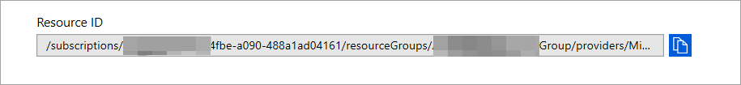
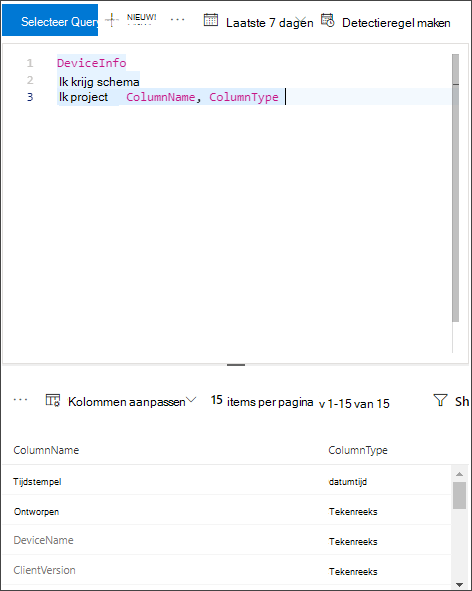

# <a name="configure-microsoft-365-defender-to-stream-advanced-hunting-events-to-your-azure-event-hub"></a>Configureer Microsoft 365 Defender om Advanced Hunting-gebeurtenissen te streamen naar uw Azure Event Hub

[!INCLUDE [Microsoft 365 Defender rebranding](../../includes/microsoft-defender.md)]


**Van toepassing op:**
- [Microsoft 365 Defender](https://go.microsoft.com/fwlink/?linkid=2118804)

[!include[Prerelease information](../../includes/prerelease.md)]

## <a name="before-you-begin"></a>Voordat u begint

1. Maak een [gebeurtenishub](/azure/event-hubs/) in uw tenant.

2. Meld u aan bij [uw Azure-tenant,](https://ms.portal.azure.com/)ga naar Abonnementen > Uw > **Resource Providers > Registreren bij Microsoft.Insights.**

3. Maak een Event Hub Namespace, ga naar **Event Hub > Toevoegen** en selecteer de prijslaag, doorvoereenheden en Auto-Opdrijf geschikt voor verwachte belasting. Zie Prijzen - Event Hub | [ Microsoft Azure](https://azure.microsoft.com/en-us/pricing/details/event-hubs/).  

### <a name="add-contributor-permissions"></a>Machtigingen voor inzenders toevoegen 
Nadat de naamruimte van de gebeurtenishub is gemaakt, moet u het volgende doen:
1. Definieer de gebruiker die zich als inzender Microsoft 365 Defender.

2. Als u verbinding maakt met een toepassing, voegt u de App Registration Service Principal toe als lezer, Azure Event Hub Data Receiver (dit kan ook op resourcegroep- of abonnementsniveau). 

    Ga naar **Naamruimte voor gebeurtenishubs > Access-besturingselement (IAM) > Toevoegen** en verifiëren onder **Roltoewijzingen.**

## <a name="enable-raw-data-streaming"></a>Onbewerkte gegevensstreaming inschakelen

1. Meld u aan bij [het Microsoft 365 Defender-beveiligingscentrum](https://security.microsoft.com) als een ***Globale beheerder** _ of _*_Beveiligingsbeheerder_**.

2. Ga naar de [pagina Streaming API-instellingen](https://security.microsoft.com/settings/mtp_settings/raw_data_export).

3. Klik op **Toevoegen.**

4. Kies een naam voor uw nieuwe instellingen.

5. Kies **Gebeurtenissen doorsturen naar Azure Event Hub**.

6. U kunt selecteren of u de gebeurtenisgegevens wilt exporteren naar één gebeurtenishub of als u elke gebeurtenistabel wilt exporteren naar een andere gebeurtenishub in de naamruimte van de gebeurtenishub. 

7. Als u de gebeurtenisgegevens naar één gebeurtenishub wilt exporteren, voert u de naam van de **gebeurtenishub** en de resource-id van de **gebeurtenishub in.**

   Als u de **resource-id Event Hub** wilt downloaden, gaat u naar de naamruimte van de Azure Event Hub-naamruimte op het tabblad [Azure](https://ms.portal.azure.com/)Properties > kopieert u de tekst  >   onder **Resource-id:**

   

8. Kies de gebeurtenissen die u wilt streamen en klik op **Opslaan.**

## <a name="the-schema-of-the-events-in-azure-event-hub"></a>Het schema van de gebeurtenissen in Azure Event Hub

```JSON
{
    "records": [
                    {
                        "time": "<The time Microsoft 365 Defender received the event>"
                        "tenantId": "<The Id of the tenant that the event belongs to>"
                        "category": "<The Advanced Hunting table name with 'AdvancedHunting-' prefix>"
                        "properties": { <Microsoft 365 Defender Advanced Hunting event as Json> }
                    }
                    ...
                ]
}
```

- Elk bericht van de gebeurtenishub in Azure Event Hub bevat een lijst met records.

- Elke record bevat de naam van de gebeurtenis, de tijd dat Microsoft 365 Defender de gebeurtenis heeft ontvangen, de tenant waar deze deel van uitmaken (u ontvangt alleen gebeurtenissen van uw tenant) en de gebeurtenis in JSON-indeling in een eigenschap genaamd **"** eigenschappen ".

- Zie Geavanceerd overzicht van de Microsoft 365 Defender voor meer informatie over het schema van de gebeurtenissen [in Defender.](advanced-hunting-overview.md)

- In Advanced Hunting heeft de **tabel DeviceInfo** een kolom met de naam **MachineGroep** die de groep van het apparaat bevat. Hier wordt elke gebeurtenis ook gedecoreerd met deze kolom. 


## <a name="data-types-mapping"></a>Gegevenstypen toewijzen

Ga als volgt te werk om de gegevenstypen voor gebeurteniseigenschappen op te halen:

1. Meld u aan [bij Microsoft 365 beveiligingscentrum](https://security.microsoft.com) en ga naar [de pagina Geavanceerd zoeken.](https://security.microsoft.com/hunting-package)

2. Voer de volgende query uit om de gegevenstypentoewijzing voor elke gebeurtenis te krijgen:
 
   ```kusto
   {EventType}
   | getschema
   | project ColumnName, ColumnType 
   ```

- Hier volgt een voorbeeld voor apparaatgegevensgebeurtenis: 

  

## <a name="related-topics"></a>Verwante onderwerpen
- [Overzicht van geavanceerd jagen](advanced-hunting-overview.md)
- [Microsoft 365 Defender-streaming-API](streaming-api.md)
- [Gebeurtenissen Microsoft 365 Defender streamen naar uw Azure-opslagaccount](streaming-api-storage.md)
- [Azure Event Hub-documentatie](/azure/event-hubs/)
- [Verbindingsproblemen oplossen - Azure Event Hub](/azure/event-hubs/troubleshooting-guide)
