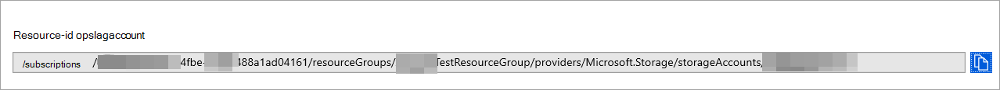

# <a name="configure-microsoft-365-defender-to-stream-advanced-hunting-events-to-your-storage-account"></a>Configureer Microsoft 365 Defender advanced hunting-gebeurtenissen te streamen naar uw Storage account

[!INCLUDE [Microsoft 365 Defender rebranding](../../includes/microsoft-defender.md)]


**Van toepassing op:**
- [Microsoft 365 Defender](https://go.microsoft.com/fwlink/?linkid=2118804)

[!include[Prerelease information](../../includes/prerelease.md)]

## <a name="before-you-begin"></a>Voordat u begint

1. Maak een [Storage account](/azure/storage/common/storage-account-overview) in uw tenant.

2. Meld u aan bij [uw Azure-tenant](https://ms.portal.azure.com/), ga naar Abonnementen > Uw abonnement **> Resource Providers > Registreren bij Microsoft.Insights.**

## <a name="enable-raw-data-streaming"></a>Onbewerkte gegevensstreaming inschakelen

1. Meld u aan bij de Microsoft 365 Defender portal ( <https://security.microsoft.com> ) als een * Globale **beheerder** _ of _*_Beveiligingsbeheerder_**.

2. Ga naar **Instellingen** \> **Microsoft 365 Defender** \> **Streaming API**. Als u rechtstreeks naar de **pagina Streaming API wilt** gaan, gebruikt u <https://security.microsoft.com/settings/mtp_settings/raw_data_export> .

3. Klik op **Toevoegen**.

4. Configureer de volgende instellingen in de flyout **Add new Streaming API settings** that appears:
   1. **Naam:** Kies een naam voor uw nieuwe instellingen.
   2. Selecteer **Gebeurtenissen doorsturen om Azure Storage.**
   3. Typ uw **Storage accountresource-id** in het vak Account **Storage resource-id** dat wordt weergegeven. Als u uw **accountresource-Storage** wilt downloaden, opent u de Azure-portal op , klikt u op Storage accounts naar het tabblad Eigenschappen om de tekst onder accountresource-id <https://portal.azure.com>  \> Storage \> **kopiëren.**

      

   4. Kies in **de flyout Nieuwe streaming API-instellingen** toevoegen de **gebeurtenistypen** die u wilt streamen.

   Wanneer u klaar bent, klikt u op **Verzenden.**

## <a name="the-schema-of-the-events-in-the-storage-account"></a>Het schema van de gebeurtenissen in het Storage account

- Er wordt een blobcontainer gemaakt voor elk gebeurtenistype:

  

- Het schema van elke rij in een blob is het volgende JSON:

  ```JSON
  {
          "time": "<The time Microsoft 365 Defender received the event>"
          "tenantId": "<Your tenant ID>"
          "category": "<The Advanced Hunting table name with 'AdvancedHunting-' prefix>"
          "properties": { <Microsoft 365 Defender Advanced Hunting event as Json> }
  }
  ```

- Elke blob bevat meerdere rijen.

- Elke rij bevat de naam van de gebeurtenis, de tijd dat Defender voor Eindpunt de gebeurtenis heeft ontvangen, de tenant waar deze deel van uitmaken (u ontvangt alleen gebeurtenissen van uw tenant) en de gebeurtenis in JSON-indeling in een eigenschap genaamd 'eigenschappen'.

- Zie Geavanceerd overzicht van de Microsoft 365 Defender voor meer informatie over het schema [van Microsoft 365 Defender gebeurtenissen.](../defender/advanced-hunting-overview.md)

## <a name="data-types-mapping"></a>Gegevenstypen toewijzen

Ga als volgt te werk om de gegevenstypen voor onze gebeurteniseigenschappen op te halen:

1. Meld u aan bij de Microsoft 365 Defender portal <https://security.microsoft.com> () en ga naar **Hunting** \> **Advanced hunting.** Als u rechtstreeks naar de pagina **Geavanceerd wilt gaan,** gebruikt u <security.microsoft.com/advanced-hunting>.

2. Voer op **het** tabblad Query de volgende query uit om de gegevenstypentoewijzing voor elke gebeurtenis te krijgen:

   ```text
   {EventType}
   | getschema
   | project ColumnName, ColumnType
   ```

- Hier volgt een voorbeeld voor apparaatgegevensgebeurtenis:

  

## <a name="related-topics"></a>Verwante onderwerpen

- [Overzicht van geavanceerd jagen](../defender/advanced-hunting-overview.md)
- [Microsoft 365 Defender Streaming-API](streaming-api.md)
- [Gebeurtenissen Microsoft 365 Defender naar uw Azure-opslagaccount streamen](streaming-api-storage.md)
- [Azure Storage Accountdocumentatie](/azure/storage/common/storage-account-overview)
