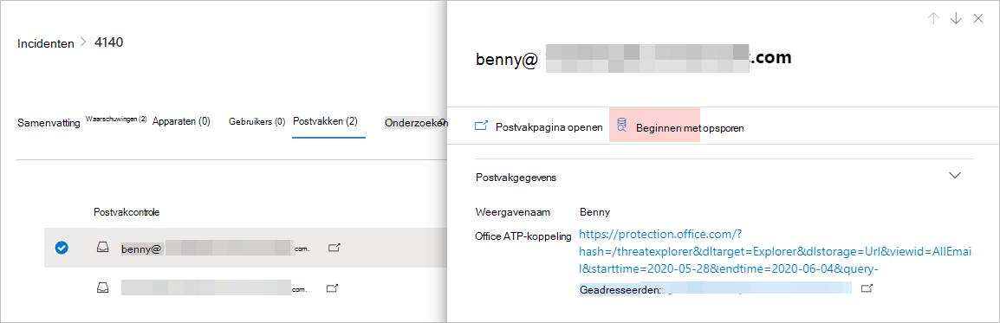
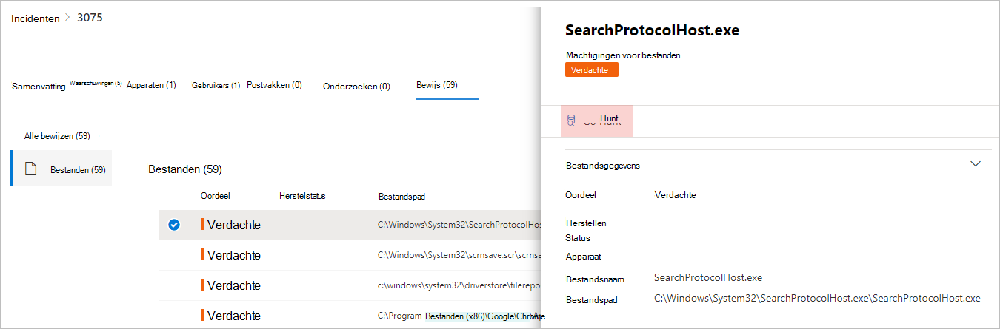
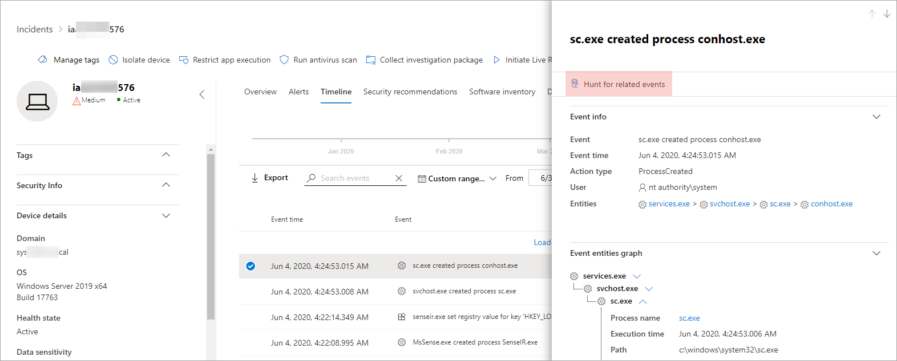

# <a name="quickly-hunt-for-entity-or-event-information-with-go-hunt"></a><span data-ttu-id="43959-104">Snel op zoek naar entiteits- of evenementinformatie met go hunt</span><span class="sxs-lookup"><span data-stu-id="43959-104">Quickly hunt for entity or event information with go hunt</span></span>

<span data-ttu-id="43959-105">**Van toepassing op:**</span><span class="sxs-lookup"><span data-stu-id="43959-105">**Applies to:**</span></span>
- <span data-ttu-id="43959-106">Microsoft Threat Protection</span><span class="sxs-lookup"><span data-stu-id="43959-106">Microsoft Threat Protection</span></span>

[!INCLUDE [Prerelease information](../includes/prerelease.md)]

<span data-ttu-id="43959-107">Met de *go hunt-actie* u gebeurtenissen en verschillende entiteitstypen snel onderzoeken met behulp van krachtige op query gebaseerde [geavanceerde jachtmogelijkheden.](advanced-hunting-overview.md)</span><span class="sxs-lookup"><span data-stu-id="43959-107">With the *go hunt* action, you can quickly investigate events and various entity types using powerful query-based [advanced hunting](advanced-hunting-overview.md) capabilities.</span></span> <span data-ttu-id="43959-108">Met deze actie wordt automatisch een geavanceerde jachtquery uitgevoerd om relevante informatie over de geselecteerde gebeurtenis of entiteit te vinden.</span><span class="sxs-lookup"><span data-stu-id="43959-108">This action automatically runs an advanced hunting query to find relevant information about the selected event or entity.</span></span>

<span data-ttu-id="43959-109">De *actie Go Hunt* is beschikbaar in verschillende delen van het beveiligingscentrum wanneer gebeurtenis- of entiteitsgegevens worden weergegeven.</span><span class="sxs-lookup"><span data-stu-id="43959-109">The *go hunt* action is available in various sections of the security center whenever event or entity details are displayed.</span></span> <span data-ttu-id="43959-110">U bijvoorbeeld *go hunt* gebruiken vanuit de volgende secties:</span><span class="sxs-lookup"><span data-stu-id="43959-110">For example, you can use *go hunt* from the following sections:</span></span>

- <span data-ttu-id="43959-111">Op de [incidentpagina](investigate-incidents.md#incident-overview)u details bekijken over gebruikers, apparaten en vele andere entiteiten die aan een incident zijn gekoppeld.</span><span class="sxs-lookup"><span data-stu-id="43959-111">In the [incident page](investigate-incidents.md#incident-overview), you can review details about users, devices, and many other entities associated with an incident.</span></span> <span data-ttu-id="43959-112">Als u een entiteit selecteert, krijgt u aanvullende informatie en verschillende acties die u op die entitity uitvoeren.</span><span class="sxs-lookup"><span data-stu-id="43959-112">As you select an entity, you get additional information as well as various actions you could take on that entitity.</span></span> <span data-ttu-id="43959-113">In het onderstaande voorbeeld wordt een postvak geselecteerd, waarin details over het postvak worden weergegeven en de optie om te zoeken naar meer informatie over het postvak.</span><span class="sxs-lookup"><span data-stu-id="43959-113">In the example below, a mailbox is selected, showing details about the mailbox as well the option to hunt for more information about the mailbox.</span></span>

    

- <span data-ttu-id="43959-115">Op de incidentpagina u ook toegang krijgen tot een lijst met entiteiten onder het tabblad Bewijs. Het selecteren van een van deze entiteiten biedt een optie om snel te zoeken naar informatie over die entiteit.</span><span class="sxs-lookup"><span data-stu-id="43959-115">In the incident page, you can also access a list of entities under the evidence tab. Selecting one of those entities provides an option to quickly hunt for information about that entity.</span></span>

    


- <span data-ttu-id="43959-117">Wanneer u de tijdlijn voor een apparaat bekijkt, u een gebeurtenis in de tijdlijn selecteren om aanvullende informatie over die gebeurtenis weer te geven.</span><span class="sxs-lookup"><span data-stu-id="43959-117">When viewing the timeline for a device, you can select an event in the timeline to view additional information about that event.</span></span> <span data-ttu-id="43959-118">Zodra een evenement is geselecteerd, krijg je de mogelijkheid om te jagen voor andere relevante gebeurtenissen in geavanceerde jacht.</span><span class="sxs-lookup"><span data-stu-id="43959-118">Once an event is selected, you get the option to hunt for other relevant events in advanced hunting.</span></span>

    

<span data-ttu-id="43959-120">Als u **Ga hunt** of Hunt voor **gerelateerde gebeurtenissen** selecteert, worden verschillende query's doorstaan, afhankelijk van of u een entiteit of een gebeurtenis hebt geselecteerd.</span><span class="sxs-lookup"><span data-stu-id="43959-120">Selecting **Go hunt** or **Hunt for related events** passes different queries, depending on whether you've selected an entity or an event.</span></span>

## <a name="query-for-entity-information"></a><span data-ttu-id="43959-121">Query voor entiteitsgegevens</span><span class="sxs-lookup"><span data-stu-id="43959-121">Query for entity information</span></span>
<span data-ttu-id="43959-122">Wanneer u *go hunt* gebruikt om informatie over een gebruiker, apparaat of een ander type entiteit op te vragen, controleert de query alle relevante schematabellen op gebeurtenissen waarbij die entiteit betrokken is.</span><span class="sxs-lookup"><span data-stu-id="43959-122">When using *go hunt* to query for information about a user, device, or any other type of entity, the query checks all relevant schema tables for any events involving that entity.</span></span> <span data-ttu-id="43959-123">Om de resultaten beheersbaar te houden, wordt de query beperkt tot ongeveer dezelfde periode als de vroegste activiteit in de afgelopen 30 dagen waarbij de entiteit betrokken is en is gekoppeld aan het incident.</span><span class="sxs-lookup"><span data-stu-id="43959-123">To keep the results manageable, the query is scoped to around the same time period as the earliest activity in the past 30 days that involves the entity and is associated with the incident.</span></span>

<span data-ttu-id="43959-124">Hier is een voorbeeld van de go hunt query voor een apparaat:</span><span class="sxs-lookup"><span data-stu-id="43959-124">Here is an example of the go hunt query for a device:</span></span>

```kusto
let selectedTimestamp = datetime(2020-06-02T02:06:47.1167157Z);
let deviceName = "fv-az770.example.com";
let deviceId = "device-guid";
search in (DeviceLogonEvents, DeviceProcessEvents, DeviceNetworkEvents, DeviceFileEvents, DeviceRegistryEvents, DeviceImageLoadEvents, DeviceEvents, DeviceImageLoadEvents, IdentityLogonEvents, IdentityQueryEvents)
Timestamp between ((selectedTimestamp - 1h) .. (selectedTimestamp + 1h))
and DeviceName == deviceName
// or RemoteDeviceName == deviceName
// or DeviceId == deviceId
| take 100
```
### <a name="supported-entity-types"></a><span data-ttu-id="43959-125">Ondersteunde entiteitstypen</span><span class="sxs-lookup"><span data-stu-id="43959-125">Supported entity types</span></span>
<span data-ttu-id="43959-126">U *go hunt* gebruiken nadat u een van deze entiteitstypen hebt geselecteerd:</span><span class="sxs-lookup"><span data-stu-id="43959-126">You can use *go hunt* after selecting any of these entity types:</span></span>

- <span data-ttu-id="43959-127">Bestanden</span><span class="sxs-lookup"><span data-stu-id="43959-127">Files</span></span>
- <span data-ttu-id="43959-128">E-mails</span><span class="sxs-lookup"><span data-stu-id="43959-128">Emails</span></span>
- <span data-ttu-id="43959-129">E-mailclusters</span><span class="sxs-lookup"><span data-stu-id="43959-129">Email clusters</span></span>
- <span data-ttu-id="43959-130">Postvakken</span><span class="sxs-lookup"><span data-stu-id="43959-130">Mailboxes</span></span>
- <span data-ttu-id="43959-131">Gebruikers</span><span class="sxs-lookup"><span data-stu-id="43959-131">Users</span></span>
- <span data-ttu-id="43959-132">Apparaten</span><span class="sxs-lookup"><span data-stu-id="43959-132">Devices</span></span>
- <span data-ttu-id="43959-133">IP-adressen</span><span class="sxs-lookup"><span data-stu-id="43959-133">IP addresses</span></span>
- <span data-ttu-id="43959-134">Urls</span><span class="sxs-lookup"><span data-stu-id="43959-134">URLs</span></span>

## <a name="query-for-event-information"></a><span data-ttu-id="43959-135">Query voor gebeurtenisgegevens</span><span class="sxs-lookup"><span data-stu-id="43959-135">Query for event information</span></span>
<span data-ttu-id="43959-136">Wanneer u *go hunt* gebruikt om informatie over een tijdlijngebeurtenis op te vragen, controleert de query alle relevante schematabellen voor andere gebeurtenissen rond het tijdstip van de geselecteerde gebeurtenis.</span><span class="sxs-lookup"><span data-stu-id="43959-136">When using *go hunt* to query for information about a timeline event, the query checks all relevant schema tables for other events around the time of the selected event.</span></span> <span data-ttu-id="43959-137">In de volgende query worden bijvoorbeeld gebeurtenissen weergegeven in verschillende schematabellen die zich rond dezelfde periode op hetzelfde apparaat hebben voorgedaan:</span><span class="sxs-lookup"><span data-stu-id="43959-137">For example, the following query lists events in various schema tables that occured around the same time period on the same device:</span></span>

```kusto
// List relevant events 30 minutes before and after selected LogonAttempted event
let selectedEventTimestamp = datetime(2020-06-04T01:29:09.2496688Z);
search in (DeviceFileEvents, DeviceProcessEvents, DeviceEvents, DeviceRegistryEvents, DeviceNetworkEvents, DeviceImageLoadEvents, DeviceLogonEvents)
    Timestamp between ((selectedEventTimestamp - 30m) .. (selectedEventTimestamp + 30m))
    and DeviceId == "079ecf9c5798d249128817619606c1c47369eb3e"
| sort by Timestamp desc
| extend Relevance = iff(Timestamp == selectedEventTimestamp, "Selected event", iff(Timestamp < selectedEventTimestamp, "Earlier event", "Later event"))
| project-reorder Relevance
```

## <a name="adjust-the-query"></a><span data-ttu-id="43959-138">De query aanpassen</span><span class="sxs-lookup"><span data-stu-id="43959-138">Adjust the query</span></span>
<span data-ttu-id="43959-139">Met enige kennis van de [querytaal](advanced-hunting-query-language.md)u de query aanpassen aan uw voorkeur.</span><span class="sxs-lookup"><span data-stu-id="43959-139">With some knowledge of the [query language](advanced-hunting-query-language.md), you can adjust the query to your preference.</span></span> <span data-ttu-id="43959-140">U deze regel bijvoorbeeld aanpassen, die de grootte van het tijdvenster bepaalt:</span><span class="sxs-lookup"><span data-stu-id="43959-140">For example, you can adjust this line, which determines the size of the time window:</span></span>

```kusto
Timestamp between ((selectedTimestamp - 1h) .. (selectedTimestamp + 1h))
```

<span data-ttu-id="43959-141">Naast het wijzigen van de query om relevantere resultaten te krijgen, u ook:</span><span class="sxs-lookup"><span data-stu-id="43959-141">In addition to modifying the query to get more relevant results, you can also:</span></span>
- [<span data-ttu-id="43959-142">Bekijk de resultaten als grafieken</span><span class="sxs-lookup"><span data-stu-id="43959-142">View the results as charts</span></span>](advanced-hunting-query-results.md#view-query-results-as-a-table-or-chart)
- [<span data-ttu-id="43959-143">Een aangepaste detectieregel maken</span><span class="sxs-lookup"><span data-stu-id="43959-143">Create a custom detection rule</span></span>](custom-detection-rules.md)

## <a name="related-topics"></a><span data-ttu-id="43959-144">Verwante onderwerpen</span><span class="sxs-lookup"><span data-stu-id="43959-144">Related topics</span></span>
- [<span data-ttu-id="43959-145">Overzicht van geavanceerd opsporen</span><span class="sxs-lookup"><span data-stu-id="43959-145">Advanced hunting overview</span></span>](advanced-hunting-overview.md)
- [<span data-ttu-id="43959-146">De querytaal leren</span><span class="sxs-lookup"><span data-stu-id="43959-146">Learn the query language</span></span>](advanced-hunting-query-language.md)
- [<span data-ttu-id="43959-147">Werken met queryresultaten</span><span class="sxs-lookup"><span data-stu-id="43959-147">Work with query results</span></span>](advanced-hunting-query-results.md)
- [<span data-ttu-id="43959-148">Aangepaste detectieregels</span><span class="sxs-lookup"><span data-stu-id="43959-148">Custom detection rules</span></span>](custom-detection-rules.md)