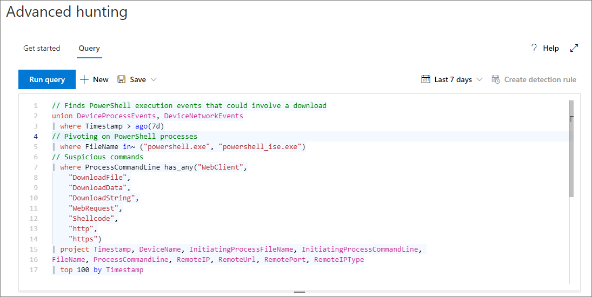

# <a name="learn-the-advanced-hunting-query-language"></a>Leer de geavanceerde jachtquerytaal

**Van toepassing op:**
- Microsoft Threat Protection

Geavanceerde jacht is gebaseerd op de [Kusto query taal.](https://docs.microsoft.com/azure/kusto/query/) U Kusto-syntaxis en operatoren gebruiken om query's te construeren die informatie in het [schema](advanced-hunting-schema-tables.md) vinden dat specifiek is gestructureerd voor geavanceerde jacht. Voer uw eerste query uit om deze concepten beter te begrijpen.

## <a name="try-your-first-query"></a>Probeer uw eerste query

Ga in het Microsoft 365-beveiligingscentrum naar **Hunting** om uw eerste query uit te voeren. Gebruik het volgende voorbeeld:

```kusto
// Finds PowerShell execution events that could involve a download
union DeviceProcessEvents, DeviceNetworkEvents
| where Timestamp > ago(7d)
// Pivoting on PowerShell processes
| where FileName in~ ("powershell.exe", "powershell_ise.exe")
// Suspicious commands
| where ProcessCommandLine has_any("WebClient",
 "DownloadFile",
 "DownloadData",
 "DownloadString",
"WebRequest",
"Shellcode",
"http",
"https")
| project Timestamp, DeviceName, InitiatingProcessFileName, InitiatingProcessCommandLine, 
FileName, ProcessCommandLine, RemoteIP, RemoteUrl, RemotePort, RemoteIPType
| top 100 by Timestamp
```

Zo zal het eruit zien in de geavanceerde jacht.



### <a name="describe-the-query-and-specify-the-tables-to-search"></a>De query beschrijven en de tabellen opgeven die u moet zoeken
Een korte opmerking is toegevoegd aan het begin van de query om te beschrijven waar het voor is. Dit helpt als u later besluit de query op te slaan en te delen met anderen in uw organisatie. 

```kusto
// Finds PowerShell execution events that could involve a download
```

De query zelf begint meestal met een tabelnaam, gevolgd door een reeks elementen die door een pijp zijn gestart ( `|` ). In dit voorbeeld beginnen we met het maken van een unie van twee tabellen `DeviceProcessEvents` en voegen we zo nodig `DeviceNetworkEvents` leidingelementen toe.

```kusto
union DeviceProcessEvents, DeviceNetworkEvents
```
### <a name="set-the-time-range"></a>Het tijdsbereik instellen
Het eerste gepipeteerde element is een tijdfilter scoped naar de vorige zeven dagen. Als u het tijdsbereik zo smal mogelijk houdt, zorgt u ervoor dat query's goed presteren, beheersbare resultaten retourneren en geen time-out krijgen.

```kusto
| where Timestamp > ago(7d)
```

### <a name="check-specific-processes"></a>Specifieke processen controleren
Het tijdsbereik wordt onmiddellijk gevolgd door een zoekopdracht naar procesbestandsnamen die de PowerShell-toepassing vertegenwoordigen.

```kusto
// Pivoting on PowerShell processes
| where FileName in~ ("powershell.exe", "powershell_ise.exe")
```

### <a name="search-for-specific-command-strings"></a>Zoeken naar specifieke opdrachttekenreeksen
Daarna zoekt de query naar tekenreeksen in opdrachtlijnen die doorgaans worden gebruikt om bestanden te downloaden met PowerShell.

```kusto
// Suspicious commands
| where ProcessCommandLine has_any("WebClient",
    "DownloadFile",
    "DownloadData",
    "DownloadString",
    "WebRequest",
    "Shellcode",
    "http",
    "https")
```

### <a name="customize-result-columns-and-length"></a>Resultaatkolommen en -lengte aanpassen 
Nu uw query duidelijk de gegevens identificeert die u wilt vinden, u elementen toevoegen die bepalen hoe de resultaten eruit zien. `project`retourneert specifieke kolommen en `top` beperkt het aantal resultaten. Deze operatoren helpen ervoor te zorgen dat de resultaten goed zijn opgemaakt en redelijk groot en eenvoudig te verwerken zijn.

```kusto
| project Timestamp, DeviceName, InitiatingProcessFileName, InitiatingProcessCommandLine, 
FileName, ProcessCommandLine, RemoteIP, RemoteUrl, RemotePort, RemoteIPType
| top 100 by Timestamp
```

Klik **op Query uitvoeren** om de resultaten te bekijken. Selecteer het pictogram uitvouwen rechtsboven in de queryeditor om u te concentreren op uw jachtquery en de resultaten. 


>[!TIP]
>U queryresultaten weergeven als grafieken en snel filters aanpassen. Lees voor advies [over het werken met queryresultaten](advanced-hunting-query-results.md)

## <a name="learn-common-query-operators-for-advanced-hunting"></a>Leer algemene queryoperators voor geavanceerde jacht

Nu u uw eerste query hebt uitgevoerd en een algemeen idee hebt van de componenten, is het tijd om een beetje terug te krabbelen en een aantal basisprincipes te leren. De Kusto-querytaal die wordt gebruikt door geavanceerde jacht, ondersteunt een reeks operatoren, waaronder de volgende veelvoorkomende.

| Operator | Beschrijving en gebruik |
|--|--|
| `where` | Filter een tabel naar de subset van rijen die voldoen aan een predicaat. |
| `summarize` | Maak een tabel die de inhoud van de invoertabel samenvoegt. |
| `join` | Voeg de rijen van twee tabellen samen om een nieuwe tabel te vormen door waarden van de opgegeven kolom(en) uit elke tabel te matchen. |
| `count` | Retourneert het aantal records in de invoerrecordset. |
| `top` | Retourneert de eerste N-records gesorteerd op de opgegeven kolommen. |
| `limit` | Ga terug naar het opgegeven aantal rijen. |
| `project` | Selecteer de kolommen die u wilt opnemen, de naam of de daling wilt wijzigen en nieuwe berekende kolommen invoegen. |
| `extend` | Maak berekende kolommen en plaats ze aan de resultatenset. |
| `makeset` |  Retourleer een dynamische array (JSON) van de set afzonderlijke waarden die Expr in de groep opneemt. |
| `find` | Zoek rijen die overeenkomen met een predicaat in een set tabellen. |

Als u een live voorbeeld van deze operatoren wilt zien, voert u ze uit vanuit de sectie Aan de **slag** in geavanceerde jacht.

## <a name="understand-data-types-and-their-query-syntax-implications"></a>Gegevenstypen en de implicaties van querysyntaxis begrijpen

Gegevens in geavanceerde jachttabellen worden over het algemeen ingedeeld in de volgende gegevenstypen.

| Gegevenstype | Implicaties voor beschrijving en query |
|--|--|
| `datetime` | Gegevens en tijdsinformatie die doorgaans gebeurtenistimetamps vertegenwoordigen |
| `string` | Tekentekenreeks |
| `bool` | Waar of onwaar |
| `int` | 32-bits numerieke waarde  |
| `long` | 64-bits numerieke waarde |

## <a name="get-help-as-you-write-queries"></a>Hulp krijgen bij het schrijven van query's
Profiteer van de volgende functionaliteit om query's sneller te schrijven:
- **Autosuggest** - als je schrijft query's, geavanceerde jacht biedt suggesties van IntelliSense. 
- **Schemastructuur** : een schemaweergave met de lijst met tabellen en hun kolommen wordt naast uw werkgebied weergegeven. Voor meer informatie u de muisaanwijzer op een item laten zweven. Dubbelklik op een item om het in te voegen aan de queryeditor.
- **[Schemaverwijzing](advanced-hunting-schema-tables.md#get-schema-information-in-the-security-center)** — in-portalverwijzing met tabel- en kolombeschrijvingen, ondersteunde gebeurtenistypen `ActionType` (waarden) en voorbeeldquery's

## <a name="work-with-multiple-queries-in-the-editor"></a>Werken met meerdere query's in de editor
De queryeditor kan dienen als uw krasblok voor het experimenteren met meerdere query's. Ga als u meerdere query's gebruikt:

- Scheid elke query met een lege regel.
- Plaats de cursor op een deel van een query om die query te selecteren voordat u deze uitvoert. Hiermee wordt alleen de geselecteerde query uitgevoerd. Als u een andere query wilt uitvoeren, verplaatst u de cursor dienovereenkomstig en selecteert u **Query uitvoeren**.


## <a name="use-sample-queries"></a>Voorbeeldquery's gebruiken

De sectie **Aan de slag** biedt een paar eenvoudige query's met veelgebruikte operators. Probeer deze query's uit te voeren en kleine wijzigingen aan te brengen.


>[!NOTE]
>Naast de basisqueryvoorbeelden u ook toegang krijgen tot [gedeelde query's](advanced-hunting-shared-queries.md) voor specifieke scenario's voor bedreigingsjacht. Verken de gedeelde query's aan de linkerkant van de pagina of de GitHub-queryrepository.

## <a name="access-query-language-documentation"></a>Documentatie over querytaal openen

Zie [Kusto querytaaldocumentatie](https://docs.microsoft.com/azure/kusto/query/)voor meer informatie over kusto-querytaal en ondersteunde operatoren.

## <a name="related-topics"></a>Verwante onderwerpen
- [Overzicht van geavanceerd opsporen](advanced-hunting-overview.md)
- [Werken met queryresultaten](advanced-hunting-query-results.md)
- [Gedeelde query's gebruiken](advanced-hunting-shared-queries.md)
- [Zoek naar bedreigingen op verschillende apparaten en e-mails](advanced-hunting-query-emails-devices.md)
- [Meer informatie over het schema](advanced-hunting-schema-tables.md)
- [Aanbevolen procedures voor query's toepassen](advanced-hunting-best-practices.md)
