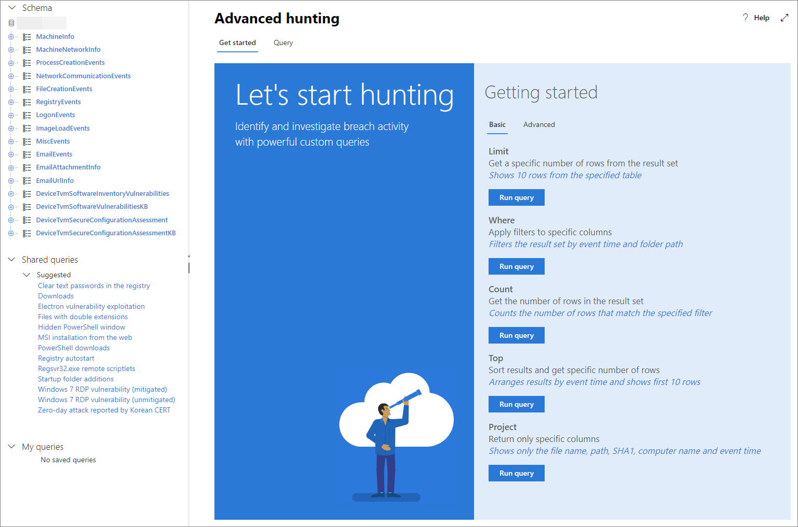

# <a name="learn-the-advanced-hunting-query-language"></a>Leer de geavanceerde jachtquerytaal

**Van toepassing op:**
- Microsoft-bedreigingsbeveiliging

Geavanceerde jacht is gebaseerd op de [Kusto query taal](https://docs.microsoft.com/azure/kusto/query/). U kusto-syntaxis en operatoren gebruiken om query's te maken die informatie vinden in het [schema](advanced-hunting-schema-tables.md) dat specifiek is gestructureerd voor geavanceerde jacht. Voer uw eerste query uit om deze concepten beter te begrijpen.

## <a name="try-your-first-query"></a>Probeer uw eerste query

Ga in het beveiligingscentrum van Microsoft 365 naar **Op jacht** om uw eerste query uit te voeren. Gebruik het volgende voorbeeld:

```kusto
// Finds PowerShell execution events that could involve a download
union DeviceProcessEvents, DeviceNetworkEvents
| where Timestamp > ago(7d)
// Pivoting on PowerShell processes
| where FileName in~ ("powershell.exe", "powershell_ise.exe")
// Suspicious commands
| where ProcessCommandLine has_any("WebClient",
 "DownloadFile",
 "DownloadData",
 "DownloadString",
"WebRequest",
"Shellcode",
"http",
"https")
| project Timestamp, DeviceName, InitiatingProcessFileName, InitiatingProcessCommandLine, 
FileName, ProcessCommandLine, RemoteIP, RemoteUrl, RemotePort, RemoteIPType
| top 100 by Timestamp
```

Dit is hoe het eruit zal zien in geavanceerde jacht.


Er is een korte opmerking toegevoegd aan het begin van de query om te beschrijven waar deze voor is. Dit helpt als u later besluit om de query op te slaan en te delen met anderen in uw organisatie. 

```kusto
// Finds PowerShell execution events that could involve a download
```

De query zelf begint meestal met een tabelnaam, gevolgd door`|`een reeks elementen die door een pipe zijn gestart ( ). In dit voorbeeld beginnen we met het `DeviceProcessEvents` creëren `DeviceNetworkEvents`van een unie van twee tabellen en, en voeg piped elementen toe als dat nodig is.

```kusto
union DeviceProcessEvents, DeviceNetworkEvents
```
Het eerste piped element is een tijdfilter dat is uitgevoerd naar de voorgaande zeven dagen. Als u het tijdsbereik zo beperkt mogelijk houdt, zorgt u ervoor dat query's goed presteren, beheerbare resultaten opleveren en geen time-out krijgen.

```kusto
| where Timestamp > ago(7d)
```

Het tijdsbereik wordt onmiddellijk gevolgd door een zoekopdracht naar procesbestandsnamen die de PowerShell-toepassing vertegenwoordigen.

```
// Pivoting on PowerShell processes
| where FileName in~ ("powershell.exe", "powershell_ise.exe")
```

Daarna zoekt de query naar tekenreeksen in opdrachtregels die doorgaans worden gebruikt om bestanden te downloaden met PowerShell.

```kusto
// Suspicious commands
| where ProcessCommandLine has_any("WebClient",
 "DownloadFile",
 "DownloadData",
 "DownloadString",
"WebRequest",
"Shellcode",
"http",
"https")
```
Nu uw query duidelijk de gegevens identificeert die u wilt vinden, u elementen toevoegen die bepalen hoe de resultaten eruit zien. `project`retourneert `top` specifieke kolommen en beperkt het aantal resultaten, waardoor de resultaten goed zijn opgemaakt en redelijk groot en eenvoudig te verwerken zijn.

```kusto
| project Timestamp, DeviceName, InitiatingProcessFileName, InitiatingProcessCommandLine, 
FileName, ProcessCommandLine, RemoteIP, RemoteUrl, RemotePort, RemoteIPType
| top 100 by Timestamp
```

Klik **op Query uitvoeren** om de resultaten te bekijken. Selecteer het uitvouwpictogram rechtsboven in de queryeditor om u te concentreren op uw jachtquery en de resultaten.


## <a name="learn-common-query-operators-for-advanced-hunting"></a>Meer informatie over algemene query-operators voor geavanceerde jacht

Nu u uw eerste query hebt uitgevoerd en een algemeen idee hebt van de onderdelen, is het tijd om een beetje terug te krabbelen en enkele basisprincipes te leren. De Kusto-querytaal die door geavanceerde jacht wordt gebruikt, ondersteunt een reeks operatoren, waaronder de volgende gemeenschappelijke.

| Operator | Beschrijving en gebruik |
|--|--|
| `where` | Filter een tabel naar de subset van rijen die voldoen aan een predicaat. |
| `summarize` | Maak een tabel die de inhoud van de invoertabel samenvoegt. |
| `join` | Voeg de rijen van twee tabellen samen om een nieuwe tabel te vormen door de waarden van de opgegeven kolom(en) van elke tabel af te voegen. |
| `count` | Retourneer het aantal records in de set invoerrecord. |
| `top` | Retourneer de eerste N-records gesorteerd op de opgegeven kolommen. |
| `limit` | Ga terug naar het opgegeven aantal rijen. |
| `project` | Selecteer de kolommen die u wilt opnemen, de naam wijzigen of neerzetten en nieuwe berekende kolommen invoegen. |
| `extend` | Maak berekende kolommen en sluit ze toe aan de resultatenset. |
| `makeset` |  Retourneer een dynamische (JSON)-array van de set afzonderlijke waarden die Expr in de groep neemt. |
| `find` | Zoek rijen die overeenkomen met een predicaat in een reeks tabellen. |

Om een live voorbeeld van deze operators te zien, voert u ze uit vanaf de sectie **Aan de slag** in geavanceerde jacht.

## <a name="understand-data-types-and-their-query-syntax-implications"></a>Gegevenstypen en de implicaties van de syntaxis van query's begrijpen

Gegevens in geavanceerde jachttabellen worden over het algemeen ingedeeld in de volgende gegevenstypen.

| Gegevenstype | Implicaties voor beschrijving en query |
|--|--|
| `datetime` | Gegevens- en tijdsinformatie die doorgaans gebeurtenistijdstempels vertegenwoordigen |
| `string` | Tekentekenreeks |
| `bool` | Waar of onwaar |
| `int` | 32-bits numerieke waarde  |
| `long` | 64-bits numerieke waarde |

## <a name="use-sample-queries"></a>Voorbeeldquery's gebruiken

De sectie **Aan de slag** biedt een paar eenvoudige query's met veelgebruikte operatoren. Probeer het uitvoeren van deze query's en het maken van kleine wijzigingen aan hen.



>[!NOTE]
>Naast de basisqueryvoorbeelden hebt u ook toegang tot [gedeelde query's](advanced-hunting-shared-queries.md) voor specifieke scenario's voor de jacht op bedreigingen. Bekijk de gedeelde query's aan de linkerkant van de pagina of de GitHub-queryopslagplaats.

## <a name="access-query-language-documentation"></a>Taaldocumentatie voor query's openen

Zie [Kusto-querytaaldocumentatie](https://docs.microsoft.com/azure/kusto/query/)voor meer informatie over kusto-querytaal en ondersteunde operatoren.

## <a name="related-topics"></a>Verwante onderwerpen
- [Geavanceerd jachtoverzicht](advanced-hunting-overview.md)
- [Werken met queryresultaten](advanced-hunting-query-results.md)
- [Gedeelde query's gebruiken](advanced-hunting-shared-queries.md)
- [Zoek naar bedreigingen op verschillende apparaten en e-mails](advanced-hunting-query-emails-devices.md)
- [Het schema begrijpen](advanced-hunting-schema-tables.md)
- [Aanbevolen procedures voor query's toepassen](advanced-hunting-best-practices.md)
