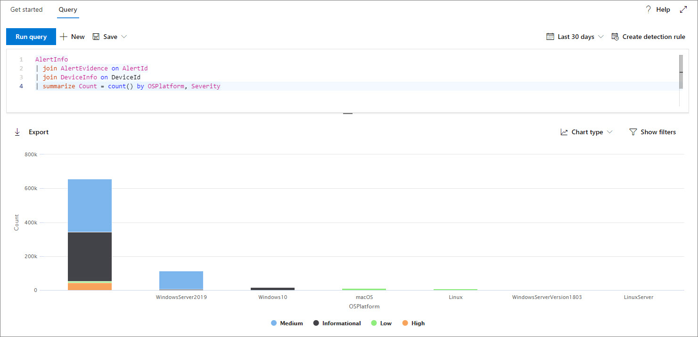
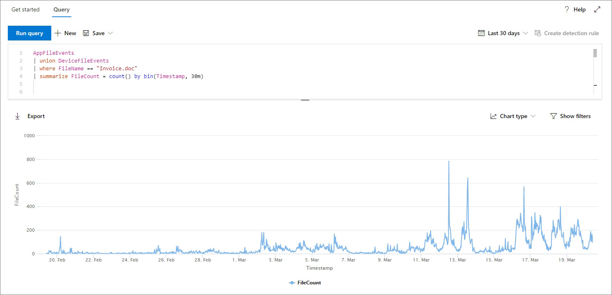
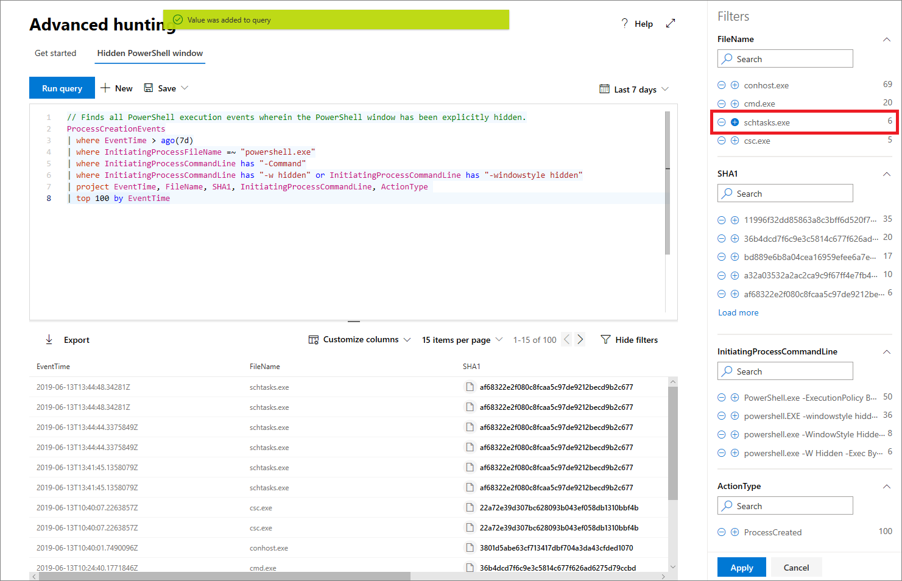

# <a name="work-with-advanced-hunting-query-results"></a><span data-ttu-id="d7a6a-104">Werken met geavanceerde jachtqueryresultaten</span><span class="sxs-lookup"><span data-stu-id="d7a6a-104">Work with advanced hunting query results</span></span>

<span data-ttu-id="d7a6a-105">**Van toepassing op:**</span><span class="sxs-lookup"><span data-stu-id="d7a6a-105">**Applies to:**</span></span>
- <span data-ttu-id="d7a6a-106">Microsoft Threat Protection</span><span class="sxs-lookup"><span data-stu-id="d7a6a-106">Microsoft Threat Protection</span></span>

[!INCLUDE [Prerelease information](../includes/prerelease.md)]

<span data-ttu-id="d7a6a-107">Hoewel u uw geavanceerde jachtquery's construeren om zeer nauwkeurige informatie terug te geven, u ook werken met de queryresultaten om meer inzicht te krijgen en specifieke activiteiten en indicatoren te onderzoeken. [advanced hunting](advanced-hunting-overview.md)</span><span class="sxs-lookup"><span data-stu-id="d7a6a-107">While you can construct your [advanced hunting](advanced-hunting-overview.md) queries to return very precise information, you can also work with the query results to gain further insight and investigate specific activities and indicators.</span></span> <span data-ttu-id="d7a6a-108">U de volgende acties uitvoeren op uw queryresultaten:</span><span class="sxs-lookup"><span data-stu-id="d7a6a-108">You can take the following actions on your query results:</span></span>

- <span data-ttu-id="d7a6a-109">Resultaten weergeven als een tabel of grafiek</span><span class="sxs-lookup"><span data-stu-id="d7a6a-109">View results as a table or chart</span></span>
- <span data-ttu-id="d7a6a-110">Tabellen en grafieken exporteren</span><span class="sxs-lookup"><span data-stu-id="d7a6a-110">Export tables and charts</span></span>
- <span data-ttu-id="d7a6a-111">Inzoomen op gedetailleerde entiteitsgegevens</span><span class="sxs-lookup"><span data-stu-id="d7a6a-111">Drill down to detailed entity information</span></span>
- <span data-ttu-id="d7a6a-112">Uw query's rechtstreeks vanuit de resultaten aanpassen of filters toepassen</span><span class="sxs-lookup"><span data-stu-id="d7a6a-112">Tweak your queries directly from the results or apply filters</span></span>

## <a name="view-query-results-as-a-table-or-chart"></a><span data-ttu-id="d7a6a-113">Queryresultaten weergeven als een tabel of grafiek</span><span class="sxs-lookup"><span data-stu-id="d7a6a-113">View query results as a table or chart</span></span>
<span data-ttu-id="d7a6a-114">Geavanceerde jacht geeft standaard queryresultaten weer als tabelgegevens.</span><span class="sxs-lookup"><span data-stu-id="d7a6a-114">By default, advanced hunting displays query results as tabular data.</span></span> <span data-ttu-id="d7a6a-115">U ook dezelfde gegevens weergeven als een grafiek.</span><span class="sxs-lookup"><span data-stu-id="d7a6a-115">You can also display the same data as a chart.</span></span> <span data-ttu-id="d7a6a-116">Geavanceerde jacht ondersteunt de volgende standpunten:</span><span class="sxs-lookup"><span data-stu-id="d7a6a-116">Advanced hunting supports the following views:</span></span>

| <span data-ttu-id="d7a6a-117">Type weergeven</span><span class="sxs-lookup"><span data-stu-id="d7a6a-117">View type</span></span> | <span data-ttu-id="d7a6a-118">Beschrijving</span><span class="sxs-lookup"><span data-stu-id="d7a6a-118">Description</span></span> |
| -- | -- |
| <span data-ttu-id="d7a6a-119">**Tabel**</span><span class="sxs-lookup"><span data-stu-id="d7a6a-119">**Table**</span></span> | <span data-ttu-id="d7a6a-120">Hiermee worden de queryresultaten weergegeven in tabelindeling</span><span class="sxs-lookup"><span data-stu-id="d7a6a-120">Displays the query results in tabular format</span></span> |
| <span data-ttu-id="d7a6a-121">**Kolomdiagram**</span><span class="sxs-lookup"><span data-stu-id="d7a6a-121">**Column chart**</span></span> | <span data-ttu-id="d7a6a-122">Hiermee worden een reeks unieke items op de x-as weergegeven als verticale balken waarvan de hoogten numerieke waarden uit een ander veld weergeven</span><span class="sxs-lookup"><span data-stu-id="d7a6a-122">Renders a series of unique items on the x-axis as vertical bars whose heights represent numeric values from another field</span></span> |
| <span data-ttu-id="d7a6a-123">**Gestapeld kolomdiagram**</span><span class="sxs-lookup"><span data-stu-id="d7a6a-123">**Stacked column chart**</span></span> | <span data-ttu-id="d7a6a-124">Hiermee worden een reeks unieke items op de x-as weergegeven als gestapelde verticale balken waarvan de hoogten numerieke waarden van een of meer andere velden weergeven</span><span class="sxs-lookup"><span data-stu-id="d7a6a-124">Renders a series of unique items on the x-axis as stacked vertical bars whose heights represent numeric values from one or more other fields</span></span> |
| <span data-ttu-id="d7a6a-125">**Cirkeldiagram**</span><span class="sxs-lookup"><span data-stu-id="d7a6a-125">**Pie chart**</span></span> | <span data-ttu-id="d7a6a-126">Hiermee worden sectionele cirkels weergegeven die unieke items vertegenwoordigen.</span><span class="sxs-lookup"><span data-stu-id="d7a6a-126">Renders sectional pies representing unique items.</span></span> <span data-ttu-id="d7a6a-127">De grootte van elke cirkel vertegenwoordigt numerieke waarden uit een ander veld.</span><span class="sxs-lookup"><span data-stu-id="d7a6a-127">The size of each pie represents numeric values from another field.</span></span> |
| <span data-ttu-id="d7a6a-128">**Donut-diagram**</span><span class="sxs-lookup"><span data-stu-id="d7a6a-128">**Donut chart**</span></span> | <span data-ttu-id="d7a6a-129">Hiermee worden sectionele bogen weergegeven die unieke items vertegenwoordigen.</span><span class="sxs-lookup"><span data-stu-id="d7a6a-129">Renders sectional arcs representing unique items.</span></span> <span data-ttu-id="d7a6a-130">De lengte van elke boog vertegenwoordigt numerieke waarden uit een ander veld.</span><span class="sxs-lookup"><span data-stu-id="d7a6a-130">The length of each arc represents numeric values from another field.</span></span> |
| <span data-ttu-id="d7a6a-131">**Lijndiagram**</span><span class="sxs-lookup"><span data-stu-id="d7a6a-131">**Line chart**</span></span> | <span data-ttu-id="d7a6a-132">Hiermee worden numerieke waarden gecompseerd voor een reeks unieke items en worden de uitgezette waarden verbonden</span><span class="sxs-lookup"><span data-stu-id="d7a6a-132">Plots numeric values for a series of unique items and connects the plotted values</span></span> |
| <span data-ttu-id="d7a6a-133">**Spreidingsdiagram**</span><span class="sxs-lookup"><span data-stu-id="d7a6a-133">**Scatter chart**</span></span> | <span data-ttu-id="d7a6a-134">Plots numerieke waarden voor een reeks unieke items</span><span class="sxs-lookup"><span data-stu-id="d7a6a-134">Plots numeric values for a series of unique items</span></span> |
| <span data-ttu-id="d7a6a-135">**Gebiedsdiagram**</span><span class="sxs-lookup"><span data-stu-id="d7a6a-135">**Area chart**</span></span> | <span data-ttu-id="d7a6a-136">Hiermee worden numerieke waarden geperceleerd voor een reeks unieke items en worden de secties onder de uitgezette waarden gevuld</span><span class="sxs-lookup"><span data-stu-id="d7a6a-136">Plots numeric values for a series of unique items and fills the sections below the plotted values</span></span> |

### <a name="construct-queries-for-effective-charts"></a><span data-ttu-id="d7a6a-137">Query's maken voor effectieve grafieken</span><span class="sxs-lookup"><span data-stu-id="d7a6a-137">Construct queries for effective charts</span></span>
<span data-ttu-id="d7a6a-138">Bij het renderen van grafieken identificeert geavanceerde jacht automatisch kolommen van belang en de numerieke waarden die moeten worden samengevoegd.</span><span class="sxs-lookup"><span data-stu-id="d7a6a-138">When rendering charts, advanced hunting automatically identifies columns of interest and the numeric values to aggregate.</span></span> <span data-ttu-id="d7a6a-139">Als u zinvolle grafieken wilt krijgen, maakt u uw query's om de specifieke waarden die u wilt zien te retourneren.</span><span class="sxs-lookup"><span data-stu-id="d7a6a-139">To get meaningful charts, construct your queries to return the specific values you want to see visualized.</span></span> <span data-ttu-id="d7a6a-140">Hier volgen enkele voorbeeldquery's en de resulterende grafieken.</span><span class="sxs-lookup"><span data-stu-id="d7a6a-140">Here are some sample queries and the resulting charts.</span></span>

#### <a name="alerts-by-severity"></a><span data-ttu-id="d7a6a-141">Waarschuwingen op ernst</span><span class="sxs-lookup"><span data-stu-id="d7a6a-141">Alerts by severity</span></span>
<span data-ttu-id="d7a6a-142">Gebruik de `summarize` operator om een numeriek aantal te verkrijgen van de waarden die u wilt in kaart brengen.</span><span class="sxs-lookup"><span data-stu-id="d7a6a-142">Use the `summarize` operator to obtain a numeric count of the values you want to chart.</span></span> <span data-ttu-id="d7a6a-143">De onderstaande query gebruikt de `summarize` operator om het aantal waarschuwingen op ernst te krijgen.</span><span class="sxs-lookup"><span data-stu-id="d7a6a-143">The query below uses the `summarize` operator to get the number of alerts by severity.</span></span>

```kusto
AlertInfo
| summarize Total = count() by Severity
```
<span data-ttu-id="d7a6a-144">Bij het renderen van de resultaten wordt in een kolomdiagram elke ernstwaarde weergegeven als een afzonderlijke kolom:</span><span class="sxs-lookup"><span data-stu-id="d7a6a-144">When rendering the results, a column chart displays each severity value as a separate column:</span></span>

<span data-ttu-id="d7a6a-145">
 *Queryresultaten voor waarschuwingen op ernst die worden weergegeven als een kolomdiagram*</span><span class="sxs-lookup"><span data-stu-id="d7a6a-145">
*Query results for alerts by severity displayed as a column chart*</span></span>

#### <a name="alert-severity-by-operating-system"></a><span data-ttu-id="d7a6a-146">Ernst waarschuwing door besturingssysteem</span><span class="sxs-lookup"><span data-stu-id="d7a6a-146">Alert severity by operating system</span></span>
<span data-ttu-id="d7a6a-147">U de operator ook gebruiken `summarize` om resultaten voor te bereiden op het in kaart brengen van waarden uit meerdere velden.</span><span class="sxs-lookup"><span data-stu-id="d7a6a-147">You could also use the `summarize` operator to prepare results for charting values from multiple fields.</span></span> <span data-ttu-id="d7a6a-148">U bijvoorbeeld begrijpen hoe de ernst van de waarschuwing over besturingssystemen (OS) wordt verdeeld.</span><span class="sxs-lookup"><span data-stu-id="d7a6a-148">For example, you might want to understand how alert severities are distributed across operating systems (OS).</span></span> 

<span data-ttu-id="d7a6a-149">De onderstaande query gebruikt een `join` operator om OS-informatie uit de tabel te halen `DeviceInfo` en gebruikt vervolgens om waarden te tellen `summarize` in zowel de als de `OSPlatform` `Severity` kolommen:</span><span class="sxs-lookup"><span data-stu-id="d7a6a-149">The query below uses a `join` operator to pull in OS information from the `DeviceInfo` table, and then uses `summarize` to count values in both the `OSPlatform` and `Severity` columns:</span></span>

```kusto
AlertInfo
| join AlertEvidence on AlertId
| join DeviceInfo on DeviceId
| summarize Count = count() by OSPlatform, Severity 
```
<span data-ttu-id="d7a6a-150">Deze resultaten worden het best gevisualiseerd met behulp van een gestapeld kolomdiagram:</span><span class="sxs-lookup"><span data-stu-id="d7a6a-150">These results are best visualized using a stacked column chart:</span></span>

<span data-ttu-id="d7a6a-151">
 *Queryresultaten voor waarschuwingen per besturingssysteem en ernst weergegeven als een gestapelde grafiek*</span><span class="sxs-lookup"><span data-stu-id="d7a6a-151">
*Query results for alerts by OS and severity displayed as a stacked chart*</span></span>

#### <a name="phishing-emails-across-top-ten-sender-domains"></a><span data-ttu-id="d7a6a-152">Phishing-e-mails in de tien beste afzenderdomeinen</span><span class="sxs-lookup"><span data-stu-id="d7a6a-152">Phishing emails across top ten sender domains</span></span>
<span data-ttu-id="d7a6a-153">Als u te maken hebt met een lijst met waarden die niet eindig zijn, u de operator gebruiken `Top` om alleen de waarden met de meeste instanties in kaart te brengen.</span><span class="sxs-lookup"><span data-stu-id="d7a6a-153">If you're dealing with a list of values that isn’t finite, you can use the `Top` operator to chart only the values with the most instances.</span></span> <span data-ttu-id="d7a6a-154">Gebruik bijvoorbeeld de onderstaande query om de top tien van afzenderdomeinen met de meeste phishing-e-mails te krijgen:</span><span class="sxs-lookup"><span data-stu-id="d7a6a-154">For example, to get the top ten sender domains with the most phishing emails, use the query below:</span></span>

```kusto
EmailEvents
| where PhishFilterVerdict == "Phish"
| summarize Count = count() by SenderFromDomain
| top 10 by Count
```
<span data-ttu-id="d7a6a-155">Gebruik de cirkeldiagramweergave om de verdeling over de bovenste domeinen effectief weer te geven:</span><span class="sxs-lookup"><span data-stu-id="d7a6a-155">Use the pie chart view to effectively show distribution across the top domains:</span></span>

<span data-ttu-id="d7a6a-156">
 *Cirkeldiagram met de distributie van phishing-e-mails over de bovenste afzenderdomeinen*</span><span class="sxs-lookup"><span data-stu-id="d7a6a-156">
*Pie chart showing distribution of phishing emails across top sender domains*</span></span>

#### <a name="file-activities-over-time"></a><span data-ttu-id="d7a6a-157">Bestandsactiviteiten in de loop van de tijd</span><span class="sxs-lookup"><span data-stu-id="d7a6a-157">File activities over time</span></span>
<span data-ttu-id="d7a6a-158">Met behulp van de `summarize` operator met de `bin()` functie, u controleren op gebeurtenissen waarbij een bepaalde indicator in de tijd.</span><span class="sxs-lookup"><span data-stu-id="d7a6a-158">Using the `summarize` operator with the `bin()` function, you can check for events involving a particular indicator over time.</span></span> <span data-ttu-id="d7a6a-159">De onderstaande query telt gebeurtenissen met het bestand `invoice.doc` met intervallen van 30 minuten om pieken in activiteit met betrekking tot dat bestand weer te geven:</span><span class="sxs-lookup"><span data-stu-id="d7a6a-159">The query below counts events involving the file `invoice.doc` at 30 minute intervals to show spikes in activity related to that file:</span></span>

```kusto
AppFileEvents
| union DeviceFileEvents
| where FileName == "invoice.doc"
| summarize FileCount = count() by bin(Timestamp, 30m)
```
<span data-ttu-id="d7a6a-160">In het onderstaande lijndiagram worden tijdsperioden met meer activiteit duidelijk `invoice.doc` weergegeven:</span><span class="sxs-lookup"><span data-stu-id="d7a6a-160">The line chart below clearly highlights time periods with more activity involving `invoice.doc`:</span></span> 

<span data-ttu-id="d7a6a-161">
 *Lijndiagram met het aantal gebeurtenissen met een bestand in de loop van de tijd*</span><span class="sxs-lookup"><span data-stu-id="d7a6a-161">
*Line chart showing the number of events involving a file over time*</span></span>


## <a name="export-tables-and-charts"></a><span data-ttu-id="d7a6a-162">Tabellen en grafieken exporteren</span><span class="sxs-lookup"><span data-stu-id="d7a6a-162">Export tables and charts</span></span>
<span data-ttu-id="d7a6a-163">Nadat u een query hebt uitgevoerd, selecteert u **Exporteren** om de resultaten op te slaan in het lokale bestand.</span><span class="sxs-lookup"><span data-stu-id="d7a6a-163">After running a query, select **Export** to save the results to local file.</span></span> <span data-ttu-id="d7a6a-164">De door u gekozen weergave bepaalt hoe de resultaten worden geëxporteerd:</span><span class="sxs-lookup"><span data-stu-id="d7a6a-164">Your chosen view determines how the results are exported:</span></span>

- <span data-ttu-id="d7a6a-165">**Tabelweergave** — de queryresultaten worden in tabelvorm geëxporteerd als een Microsoft Excel-werkmap</span><span class="sxs-lookup"><span data-stu-id="d7a6a-165">**Table view** — the query results are exported in tabular form as a Microsoft Excel workbook</span></span>
- <span data-ttu-id="d7a6a-166">**Elke grafiek** — de queryresultaten worden geëxporteerd als jpeg-afbeelding van de gerenderde grafiek</span><span class="sxs-lookup"><span data-stu-id="d7a6a-166">**Any chart** — the query results are exported as a JPEG image of the rendered chart</span></span>

## <a name="drill-down-from-query-results"></a><span data-ttu-id="d7a6a-167">Inzoomen op queryresultaten</span><span class="sxs-lookup"><span data-stu-id="d7a6a-167">Drill down from query results</span></span>
<span data-ttu-id="d7a6a-168">Als u snel een record in uw queryresultaten wilt inspecteren, selecteert u de bijbehorende rij om het **recordpaneel Inspecteren** te openen.</span><span class="sxs-lookup"><span data-stu-id="d7a6a-168">To quickly inspect a record in your query results, select the corresponding row to open the **Inspect record** panel.</span></span> <span data-ttu-id="d7a6a-169">Het deelvenster geeft de volgende informatie op basis van de geselecteerde record:</span><span class="sxs-lookup"><span data-stu-id="d7a6a-169">The panel provides the following information based on the selected record:</span></span>

- <span data-ttu-id="d7a6a-170">**Activa** — samengevat overzicht van de belangrijkste elementen (postvakken, apparaten en gebruikers) in de record, verrijkt met beschikbare informatie, zoals risico- en blootstellingsniveaus</span><span class="sxs-lookup"><span data-stu-id="d7a6a-170">**Assets** — summarized view of the main assets (mailboxes, devices, and users) found in the record, enriched with available information, such as risk and exposure levels</span></span>
- <span data-ttu-id="d7a6a-171">**Processtructuur** — gegenereerd voor records met procesinformatie en verrijkt met behulp van beschikbare contextuele informatie; in het algemeen kunnen query's die meer kolommen retourneren resulteren in rijkere procesbomen.</span><span class="sxs-lookup"><span data-stu-id="d7a6a-171">**Process tree** — generated for records with process information and enriched using available contextual information; in general, queries that return more columns can result in richer process trees.</span></span>
- <span data-ttu-id="d7a6a-172">**Alle details** — alle waarden uit de kolommen in de record</span><span class="sxs-lookup"><span data-stu-id="d7a6a-172">**All details** — all the values from the columns in the record</span></span>  


<span data-ttu-id="d7a6a-174">Als u meer informatie over een specifieke entiteit wilt weergeven in uw queryresultaten, zoals een machine, bestand, gebruiker, IP-adres of URL, selecteert u de entiteitsidentyzer om een gedetailleerde profielpagina voor die entiteit te openen.</span><span class="sxs-lookup"><span data-stu-id="d7a6a-174">To view more information about a specific entity in your query results, such as a machine, file, user, IP address, or URL, select the entity identifier to open a detailed profile page for that entity.</span></span>

## <a name="tweak-your-queries-from-the-results"></a><span data-ttu-id="d7a6a-175">Uw query's aanpassen aan de resultaten</span><span class="sxs-lookup"><span data-stu-id="d7a6a-175">Tweak your queries from the results</span></span>
<span data-ttu-id="d7a6a-176">Klik met de rechtermuisknop op een waarde in de resultatenset om uw query snel te verbeteren.</span><span class="sxs-lookup"><span data-stu-id="d7a6a-176">Right-click a value in the result set to quickly enhance your query.</span></span> <span data-ttu-id="d7a6a-177">U de opties gebruiken om:</span><span class="sxs-lookup"><span data-stu-id="d7a6a-177">You can use the options to:</span></span>

- <span data-ttu-id="d7a6a-178">Zoek expliciet naar de geselecteerde waarde ( `==` )</span><span class="sxs-lookup"><span data-stu-id="d7a6a-178">Explicitly look for the selected value (`==`)</span></span>
- <span data-ttu-id="d7a6a-179">De geselecteerde waarde uitsluiten van de query ( `!=` )</span><span class="sxs-lookup"><span data-stu-id="d7a6a-179">Exclude the selected value from the query (`!=`)</span></span>
- <span data-ttu-id="d7a6a-180">Meer geavanceerde operators ophalen voor het toevoegen van de waarde aan uw query, zoals `contains` , `starts with` en`ends with`</span><span class="sxs-lookup"><span data-stu-id="d7a6a-180">Get more advanced operators for adding the value to your query, such as `contains`, `starts with` and `ends with`</span></span> 


## <a name="filter-the-query-results"></a><span data-ttu-id="d7a6a-182">De queryresultaten filteren</span><span class="sxs-lookup"><span data-stu-id="d7a6a-182">Filter the query results</span></span>
<span data-ttu-id="d7a6a-183">De filters die rechts worden weergegeven, geven een overzicht van de resultatenset.</span><span class="sxs-lookup"><span data-stu-id="d7a6a-183">The filters displayed to the right provide a summary of the result set.</span></span> <span data-ttu-id="d7a6a-184">Elke kolom heeft een eigen sectie met de afzonderlijke waarden die voor die kolom zijn gevonden en het aantal instanties.</span><span class="sxs-lookup"><span data-stu-id="d7a6a-184">Each column has its own section that lists the distinct values found for that column and the number of instances.</span></span>

<span data-ttu-id="d7a6a-185">Verfijn uw query door de of knoppen te selecteren `+` op de waarden die u wilt opnemen of uitsluiten en selecteer `-` **vervolgens Query uitvoeren**.</span><span class="sxs-lookup"><span data-stu-id="d7a6a-185">Refine your query by selecting the `+` or `-` buttons on the values that you want to include or exclude and then selecting **Run query**.</span></span>



<span data-ttu-id="d7a6a-187">Zodra u het filter toepast om de query te wijzigen en vervolgens de query uit te voeren, worden de resultaten dienovereenkomstig bijgewerkt.</span><span class="sxs-lookup"><span data-stu-id="d7a6a-187">Once you apply the filter to modify the query and then run the query, the results are updated accordingly.</span></span>

## <a name="related-topics"></a><span data-ttu-id="d7a6a-188">Verwante onderwerpen</span><span class="sxs-lookup"><span data-stu-id="d7a6a-188">Related topics</span></span>
- [<span data-ttu-id="d7a6a-189">Overzicht van geavanceerd opsporen</span><span class="sxs-lookup"><span data-stu-id="d7a6a-189">Advanced hunting overview</span></span>](advanced-hunting-overview.md)
- [<span data-ttu-id="d7a6a-190">De querytaal leren</span><span class="sxs-lookup"><span data-stu-id="d7a6a-190">Learn the query language</span></span>](advanced-hunting-query-language.md)
- [<span data-ttu-id="d7a6a-191">Gedeelde query's gebruiken</span><span class="sxs-lookup"><span data-stu-id="d7a6a-191">Use shared queries</span></span>](advanced-hunting-shared-queries.md)
- [<span data-ttu-id="d7a6a-192">Zoek naar bedreigingen op verschillende apparaten en e-mails</span><span class="sxs-lookup"><span data-stu-id="d7a6a-192">Hunt for threats across devices and emails</span></span>](advanced-hunting-query-emails-devices.md)
- [<span data-ttu-id="d7a6a-193">Meer informatie over het schema</span><span class="sxs-lookup"><span data-stu-id="d7a6a-193">Understand the schema</span></span>](advanced-hunting-schema-tables.md)
- [<span data-ttu-id="d7a6a-194">Aanbevolen procedures voor query's toepassen</span><span class="sxs-lookup"><span data-stu-id="d7a6a-194">Apply query best practices</span></span>](advanced-hunting-best-practices.md)
- [<span data-ttu-id="d7a6a-195">Overzicht van aangepaste detectie</span><span class="sxs-lookup"><span data-stu-id="d7a6a-195">Custom detections overview</span></span>](custom-detections-overview.md)
