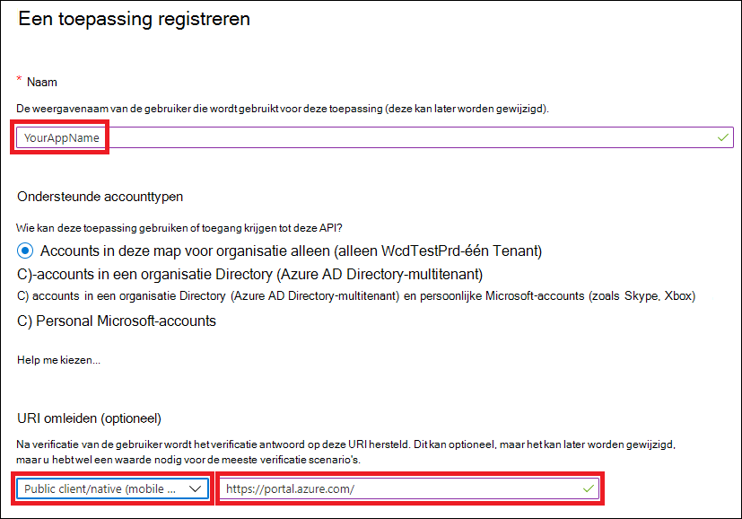

# <a name="create-an-app-to-access-microsoft-365-defender-apis-on-behalf-of-a-user"></a><span data-ttu-id="ea280-104">Een app maken voor toegang tot Microsoft 365 Defender API's namens een gebruiker</span><span class="sxs-lookup"><span data-stu-id="ea280-104">Create an app to access Microsoft 365 Defender APIs on behalf of a user</span></span>

[!INCLUDE [Microsoft 365 Defender rebranding](../includes/microsoft-defender.md)]

<span data-ttu-id="ea280-105">**Van toepassing op:**</span><span class="sxs-lookup"><span data-stu-id="ea280-105">**Applies to:**</span></span>

- <span data-ttu-id="ea280-106">Microsoft 365 Defender</span><span class="sxs-lookup"><span data-stu-id="ea280-106">Microsoft 365 Defender</span></span>

> [!IMPORTANT]
> <span data-ttu-id="ea280-107">Sommige informatie heeft betrekking op vooraf uitgebracht product dat aanzienlijk kan worden gewijzigd voordat het in de handel wordt gebracht.</span><span class="sxs-lookup"><span data-stu-id="ea280-107">Some information relates to prereleased product which may be substantially modified before it's commercially released.</span></span> <span data-ttu-id="ea280-108">Microsoft biedt geen garanties, uitdrukkelijk of impliciet, met betrekking tot de informatie die hier wordt be gegeven.</span><span class="sxs-lookup"><span data-stu-id="ea280-108">Microsoft makes no warranties, express or implied, with respect to the information provided here.</span></span>

<span data-ttu-id="ea280-109">Op deze pagina wordt beschreven hoe u een toepassing maakt om namens één gebruiker programmatische toegang te krijgen tot Microsoft 365 Defender.</span><span class="sxs-lookup"><span data-stu-id="ea280-109">This page describes how to create an application to get programmatic access to Microsoft 365 Defender on behalf of a single user.</span></span>

<span data-ttu-id="ea280-110">Als u programmeertoegang tot Microsoft 365 Defender nodig hebt zonder een gedefinieerde gebruiker (bijvoorbeeld als u een achtergrond-app of daemon schrijft), zie Een app maken voor toegang tot [Microsoft 365 Defender](api-create-app-web.md)zonder een gebruiker.</span><span class="sxs-lookup"><span data-stu-id="ea280-110">If you need programmatic access to Microsoft 365 Defender without a defined user (for example, if you're writing a background app or daemon), see [Create an app to access Microsoft 365 Defender without a user](api-create-app-web.md).</span></span> <span data-ttu-id="ea280-111">Zie Een app maken met partnertoegang tot [Microsoft 365](api-partner-access.md)Defender-API's als u toegang moet bieden voor meerdere tenants, bijvoorbeeld als u een grote organisatie of een groep klanten gebruikt. Zie Aan de slag als u niet zeker weet welk type toegang u [nodig hebt.](api-access.md)</span><span class="sxs-lookup"><span data-stu-id="ea280-111">If you need to provide access for multiple tenants—for example, if you're serving a large organization or a group of customers—see [Create an app with partner access to Microsoft 365 Defender APIs](api-partner-access.md).If you're not sure which kind of access you need, see [Get started](api-access.md).</span></span>

<span data-ttu-id="ea280-112">Microsoft 365 Defender laat veel van zijn gegevens en acties zien via een set programmatische API's.</span><span class="sxs-lookup"><span data-stu-id="ea280-112">Microsoft 365 Defender exposes much of its data and actions through a set of programmatic APIs.</span></span> <span data-ttu-id="ea280-113">Met deze API's kunt u werkstromen automatiseren en gebruikmaken van de mogelijkheden van Microsoft 365 Defender.</span><span class="sxs-lookup"><span data-stu-id="ea280-113">Those APIs help you automate workflows and make use of Microsoft 365 Defender's capabilities.</span></span> <span data-ttu-id="ea280-114">Voor deze API-toegang is OAuth2.0-verificatie vereist.</span><span class="sxs-lookup"><span data-stu-id="ea280-114">This API access requires OAuth2.0 authentication.</span></span> <span data-ttu-id="ea280-115">Zie [OAuth 2.0 Authorization Code Flow voor](https://docs.microsoft.com/azure/active-directory/develop/active-directory-v2-protocols-oauth-code)meer informatie.</span><span class="sxs-lookup"><span data-stu-id="ea280-115">For more information, see [OAuth 2.0 Authorization Code Flow](https://docs.microsoft.com/azure/active-directory/develop/active-directory-v2-protocols-oauth-code).</span></span>

<span data-ttu-id="ea280-116">Over het algemeen moet u de volgende stappen nemen om deze API's te gebruiken:</span><span class="sxs-lookup"><span data-stu-id="ea280-116">In general, you'll need to take the following steps to use these APIs:</span></span>

- <span data-ttu-id="ea280-117">Maak een Azure Active Directory-toepassing (Azure AD).</span><span class="sxs-lookup"><span data-stu-id="ea280-117">Create an Azure Active Directory (Azure AD) application.</span></span>
- <span data-ttu-id="ea280-118">Krijg een toegangs token met deze toepassing.</span><span class="sxs-lookup"><span data-stu-id="ea280-118">Get an access token using this application.</span></span>
- <span data-ttu-id="ea280-119">Gebruik het token om toegang te krijgen tot de Microsoft 365 Defender-API.</span><span class="sxs-lookup"><span data-stu-id="ea280-119">Use the token to access Microsoft 365 Defender API.</span></span>

<span data-ttu-id="ea280-120">In dit artikel wordt uitgelegd hoe u:</span><span class="sxs-lookup"><span data-stu-id="ea280-120">This article explains how to:</span></span>

- <span data-ttu-id="ea280-121">Een Azure AD-toepassing maken</span><span class="sxs-lookup"><span data-stu-id="ea280-121">Create an Azure AD application</span></span>
- <span data-ttu-id="ea280-122">Een toegangs token voor Microsoft 365 Defender krijgen</span><span class="sxs-lookup"><span data-stu-id="ea280-122">Get an access token to Microsoft 365 Defender</span></span>
- <span data-ttu-id="ea280-123">Het token valideren</span><span class="sxs-lookup"><span data-stu-id="ea280-123">Validate the token</span></span>

> [!NOTE]
> <span data-ttu-id="ea280-124">Wanneer u namens een gebruiker toegang krijgt tot de Microsoft 365 Defender API, hebt u de juiste toepassingsmachtigingen en gebruikersmachtigingen nodig.</span><span class="sxs-lookup"><span data-stu-id="ea280-124">When accessing Microsoft 365 Defender API on behalf of a user, you will need the correct application permissions and user permissions.</span></span>

> [!TIP]
> <span data-ttu-id="ea280-125">Als u toestemming hebt om een actie uit te voeren in de portal, bent u over de machtiging voor het uitvoeren van de actie in de API.</span><span class="sxs-lookup"><span data-stu-id="ea280-125">If you have the permission to perform an action in the portal, you have the permission to perform the action in the API.</span></span>

## <a name="create-an-app"></a><span data-ttu-id="ea280-126">Een app maken</span><span class="sxs-lookup"><span data-stu-id="ea280-126">Create an app</span></span>

1. <span data-ttu-id="ea280-127">Meld u aan [bij Azure](https://portal.azure.com) als gebruiker met de **rol globale** beheerder.</span><span class="sxs-lookup"><span data-stu-id="ea280-127">Sign in to [Azure](https://portal.azure.com) as a user with the **Global Administrator** role.</span></span>

2. <span data-ttu-id="ea280-128">Navigeer **naar de nieuwe registratie** van Azure Active Directory  >  **App-registraties.**  >  </span><span class="sxs-lookup"><span data-stu-id="ea280-128">Navigate to **Azure Active Directory** > **App registrations** > **New registration**.</span></span>

   

3. <span data-ttu-id="ea280-130">Kies in het formulier een naam voor uw toepassing, voer de volgende gegevens in voor de omleidings-URI en selecteer **Register.**</span><span class="sxs-lookup"><span data-stu-id="ea280-130">In the form, choose a name for your application and enter the following information for the redirect URI, then select **Register**.</span></span>

   

   - <span data-ttu-id="ea280-132">**Toepassingstype:** Openbare client</span><span class="sxs-lookup"><span data-stu-id="ea280-132">**Application type:** Public client</span></span>
   - <span data-ttu-id="ea280-133">**Omleidings-URI:**https://portal.azure.com</span><span class="sxs-lookup"><span data-stu-id="ea280-133">**Redirect URI:** https://portal.azure.com</span></span>

4. <span data-ttu-id="ea280-134">Selecteer op uw **toepassingspagina** API-machtigingen Toevoegen machtiging-API's die door mijn organisatie >, typ Microsoft Threat Protection en selecteer  >    >   Microsoft **Threat Protection.** </span><span class="sxs-lookup"><span data-stu-id="ea280-134">On your application page, select **API Permissions** > **Add permission** > **APIs my organization uses** >, type **Microsoft Threat Protection**, and select **Microsoft Threat Protection**.</span></span> <span data-ttu-id="ea280-135">Uw app heeft nu toegang tot Microsoft 365 Defender.</span><span class="sxs-lookup"><span data-stu-id="ea280-135">Your app can now access Microsoft 365 Defender.</span></span>

   > [!TIP]
   > <span data-ttu-id="ea280-136">*Microsoft Threat Protection* is een voormalige naam voor Microsoft 365 Defender en wordt niet weergegeven in de oorspronkelijke lijst.</span><span class="sxs-lookup"><span data-stu-id="ea280-136">*Microsoft Threat Protection* is a former name for Microsoft 365 Defender, and will not appear in the original list.</span></span> <span data-ttu-id="ea280-137">U moet beginnen met het schrijven van de naam in het tekstvak om deze weer te geven.</span><span class="sxs-lookup"><span data-stu-id="ea280-137">You need to start writing its name in the text box to see it appear.</span></span>

   

   - <span data-ttu-id="ea280-139">Kies **Gedelegeerde machtigingen.**</span><span class="sxs-lookup"><span data-stu-id="ea280-139">Choose **Delegated permissions**.</span></span> <span data-ttu-id="ea280-140">Kies de relevante machtigingen voor uw scenario (bijvoorbeeld **Incident.Read)** en selecteer **Vervolgens Machtigingen toevoegen.**</span><span class="sxs-lookup"><span data-stu-id="ea280-140">Choose the relevant permissions for your scenario (for example **Incident.Read**), and then select **Add permissions**.</span></span>

   

    > [!NOTE]
    > <span data-ttu-id="ea280-142">U moet de relevante machtigingen voor uw scenario selecteren.</span><span class="sxs-lookup"><span data-stu-id="ea280-142">You need to select the relevant permissions for your scenario.</span></span> <span data-ttu-id="ea280-143">*Alle incidenten lezen* is slechts een voorbeeld.</span><span class="sxs-lookup"><span data-stu-id="ea280-143">*Read all incidents* is just an example.</span></span> <span data-ttu-id="ea280-144">Om te bepalen welke machtiging u nodig hebt, raadpleegt u de **sectie Machtigingen** in de API die u wilt bellen.</span><span class="sxs-lookup"><span data-stu-id="ea280-144">To determine which permission you need, please look at the **Permissions** section in the API you want to call.</span></span>
    >
    > <span data-ttu-id="ea280-145">Als u bijvoorbeeld geavanceerde [query's wilt uitvoeren,](api-advanced-hunting.md)selecteert u de machtiging Geavanceerde query's uitvoeren. als u [een apparaat wilt isoleren,](https://docs.microsoft.com/windows/security/threat-protection/microsoft-defender-atp/isolate-machine)selecteert u de machtiging 'Isoleert computer'.</span><span class="sxs-lookup"><span data-stu-id="ea280-145">For instance, to [run advanced queries](api-advanced-hunting.md), select the 'Run advanced queries' permission; to [isolate a device](https://docs.microsoft.com/windows/security/threat-protection/microsoft-defender-atp/isolate-machine), select the 'Isolate machine' permission.</span></span>

5. <span data-ttu-id="ea280-146">Selecteer **Beheerdersmachtiging verlenen.**</span><span class="sxs-lookup"><span data-stu-id="ea280-146">Select **Grant admin consent**.</span></span> <span data-ttu-id="ea280-147">Telkens wanneer u een machtiging toevoegt, moet u Toestemming **van een beheerder verlenen** selecteren om deze van kracht te laten worden.</span><span class="sxs-lookup"><span data-stu-id="ea280-147">Every time you add a permission, you must select **Grant admin consent** for it to take effect.</span></span>

   

6. <span data-ttu-id="ea280-149">Neem uw toepassings-id en tenant-id op in een veilige plaats.</span><span class="sxs-lookup"><span data-stu-id="ea280-149">Record your application ID and your tenant ID somewhere safe.</span></span> <span data-ttu-id="ea280-150">Ze worden weergegeven onder Overzicht op **uw** toepassingspagina.</span><span class="sxs-lookup"><span data-stu-id="ea280-150">They're listed under **Overview** on your application page.</span></span>

   

## <a name="get-an-access-token"></a><span data-ttu-id="ea280-152">Een toegangs token krijgen</span><span class="sxs-lookup"><span data-stu-id="ea280-152">Get an access token</span></span>

<span data-ttu-id="ea280-153">Zie de Azure AD-zelfstudie [](https://docs.microsoft.com/azure/active-directory/develop/active-directory-v2-protocols-oauth-client-creds)voor meer informatie over Azure Active Directory-tokens.</span><span class="sxs-lookup"><span data-stu-id="ea280-153">For more information on Azure Active Directory tokens, see the [Azure AD tutorial](https://docs.microsoft.com/azure/active-directory/develop/active-directory-v2-protocols-oauth-client-creds).</span></span>

### <a name="get-an-access-token-using-powershell"></a><span data-ttu-id="ea280-154">Een toegangs token krijgen met behulp van PowerShell</span><span class="sxs-lookup"><span data-stu-id="ea280-154">Get an access token using PowerShell</span></span>

```PowerShell
if(!(Get-Package adal.ps)) { Install-Package -Name adal.ps } # Install the ADAL.PS package in case it's not already present

$tenantId = '' # Paste your directory (tenant) ID here.
$clientId = '' # Paste your application (client) ID here.
$redirectUri = '' # Paste your app's redirection URI

$authority = "https://login.windows.net/$tenantId"
$resourceUrl = 'https://api.security.microsoft.com'

$response = Get-ADALToken -Resource $resourceUrl -ClientId $cleintId -RedirectUri $redirectUri -Authority $authority -PromptBehavior:Always
$response.AccessToken | clip

$response.AccessToken
```

## <a name="validate-the-token"></a><span data-ttu-id="ea280-155">Het token valideren</span><span class="sxs-lookup"><span data-stu-id="ea280-155">Validate the token</span></span>

1. <span data-ttu-id="ea280-156">Kopieer en plak het token in [JWT om](https://jwt.ms) het te decoderen.</span><span class="sxs-lookup"><span data-stu-id="ea280-156">Copy and paste the token into [JWT](https://jwt.ms) to decode it.</span></span>
1. <span data-ttu-id="ea280-157">Zorg ervoor dat de *rollen die* binnen het gedecodeerde token worden gebruikt, de gewenste machtigingen bevatten.</span><span class="sxs-lookup"><span data-stu-id="ea280-157">Make sure that the *roles* claim within the decoded token contains the desired permissions.</span></span>

<span data-ttu-id="ea280-158">In de volgende afbeelding ziet u een gedecodeerd token dat is verkregen van een app, met ```Incidents.Read.All``` ```Incidents.ReadWrite.All``` en ```AdvancedHunting.Read.All``` machtigingen:</span><span class="sxs-lookup"><span data-stu-id="ea280-158">In the following image, you can see a decoded token acquired from an app, with ```Incidents.Read.All```, ```Incidents.ReadWrite.All```, and ```AdvancedHunting.Read.All``` permissions:</span></span>


## <a name="use-the-token-to-access-the-microsoft-365-defender-api"></a><span data-ttu-id="ea280-160">Het token gebruiken om toegang te krijgen tot de Microsoft 365 Defender-API</span><span class="sxs-lookup"><span data-stu-id="ea280-160">Use the token to access the Microsoft 365 Defender API</span></span>

1. <span data-ttu-id="ea280-161">Kies de API die u wilt gebruiken (incidenten of geavanceerd zoeken).</span><span class="sxs-lookup"><span data-stu-id="ea280-161">Choose the API you want to use (incidents, or advanced hunting).</span></span> <span data-ttu-id="ea280-162">Zie Ondersteunde [Microsoft 365 Defender API's](api-supported.md)voor meer informatie.</span><span class="sxs-lookup"><span data-stu-id="ea280-162">For more information, see [Supported Microsoft 365 Defender APIs](api-supported.md).</span></span>
2. <span data-ttu-id="ea280-163">Stel in de http-aanvraag die u gaat verzenden de autorisatiekop in op, Beller is het autorisatieschema en het token dat het gevalideerde `"Bearer" <token>` token is.  </span><span class="sxs-lookup"><span data-stu-id="ea280-163">In the http request you're about to send, set the authorization header to `"Bearer" <token>`, *Bearer* being the authorization scheme, and *token* being your validated token.</span></span>
3. <span data-ttu-id="ea280-164">Het token verloopt binnen een uur.</span><span class="sxs-lookup"><span data-stu-id="ea280-164">The token will expire within one hour.</span></span> <span data-ttu-id="ea280-165">U kunt gedurende deze periode meer dan één aanvraag met hetzelfde token verzenden.</span><span class="sxs-lookup"><span data-stu-id="ea280-165">You can send more than one request during this time  with the same token.</span></span>

<span data-ttu-id="ea280-166">In het volgende voorbeeld ziet u hoe u een aanvraag verstuurt om een lijst met incidenten met **C# op te halen.**</span><span class="sxs-lookup"><span data-stu-id="ea280-166">The following example shows how to send a request to get a list of incidents **using C#**.</span></span>

```C#
    var httpClient = new HttpClient();
    var request = new HttpRequestMessage(HttpMethod.Get, "https://api.security.microsoft.com/api/incidents");

    request.Headers.Authorization = new AuthenticationHeaderValue("Bearer", token);

    var response = httpClient.SendAsync(request).GetAwaiter().GetResult();
```

## <a name="related-articles"></a><span data-ttu-id="ea280-167">Verwante artikelen</span><span class="sxs-lookup"><span data-stu-id="ea280-167">Related articles</span></span>

- [<span data-ttu-id="ea280-168">Overzicht van Microsoft 365 Defender API's</span><span class="sxs-lookup"><span data-stu-id="ea280-168">Microsoft 365 Defender APIs overview</span></span>](api-overview.md)
- [<span data-ttu-id="ea280-169">Toegang tot de Microsoft 365 Defender-API's</span><span class="sxs-lookup"><span data-stu-id="ea280-169">Access the Microsoft 365 Defender APIs</span></span>](api-access.md)
- [<span data-ttu-id="ea280-170">Een app 'Hallo wereld' maken</span><span class="sxs-lookup"><span data-stu-id="ea280-170">Create a 'Hello world' app</span></span>](api-hello-world.md)
- [<span data-ttu-id="ea280-171">Een app maken voor toegang tot Microsoft 365 Defender zonder een gebruiker</span><span class="sxs-lookup"><span data-stu-id="ea280-171">Create an app to access Microsoft 365 Defender without a user</span></span>](api-create-app-web.md)
- [<span data-ttu-id="ea280-172">Een app maken met partnertoegang met meerdere tenants tot Microsoft 365 Defender-API's</span><span class="sxs-lookup"><span data-stu-id="ea280-172">Create an app with multi-tenant partner access to Microsoft 365 Defender APIs</span></span>](api-partner-access.md)
- [<span data-ttu-id="ea280-173">Meer informatie over API-limieten en licenties</span><span class="sxs-lookup"><span data-stu-id="ea280-173">Learn about API limits and licensing</span></span>](api-terms.md)
- [<span data-ttu-id="ea280-174">Meer te weten komen over foutcodes</span><span class="sxs-lookup"><span data-stu-id="ea280-174">Understand error codes</span></span>](api-error-codes.md)
- [<span data-ttu-id="ea280-175">OAuth 2.0 authorization for user sign in and API access</span><span class="sxs-lookup"><span data-stu-id="ea280-175">OAuth 2.0 authorization for user sign in and API access</span></span>](https://docs.microsoft.com/azure/active-directory/develop/active-directory-v2-protocols-oauth-code)
