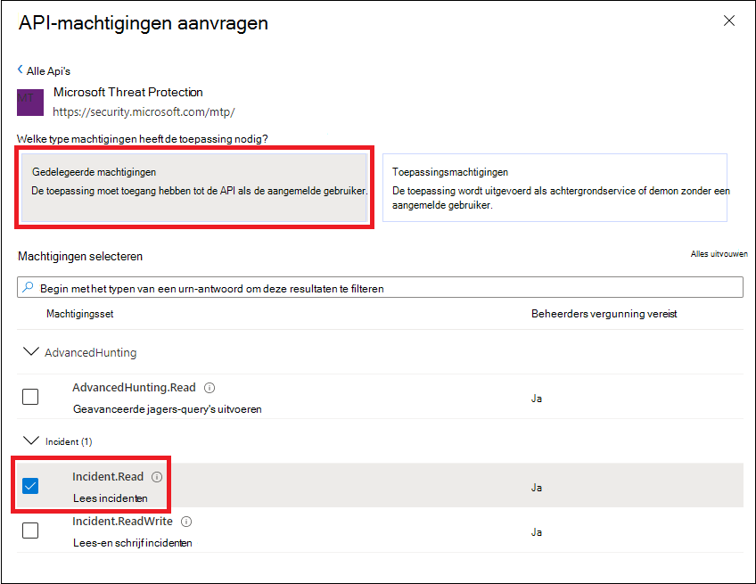
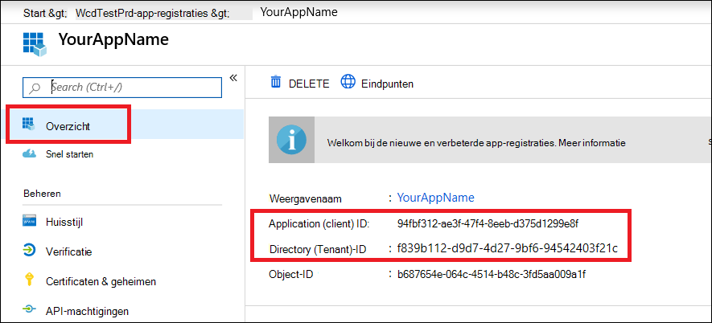

# <a name="create-an-app-to-access-microsoft-365-defender-apis-on-behalf-of-a-user"></a>Een app maken voor toegang tot Microsoft 365 Defender API's namens een gebruiker

[!INCLUDE [Microsoft 365 Defender rebranding](../includes/microsoft-defender.md)]

**Van toepassing op:**

- Microsoft 365 Defender

> [!IMPORTANT]
> Sommige informatie heeft betrekking op vooraf uitgebracht product dat aanzienlijk kan worden gewijzigd voordat het in de handel wordt gebracht. Microsoft biedt geen garanties, uitdrukkelijk of impliciet, met betrekking tot de informatie die hier wordt be gegeven.

Op deze pagina wordt beschreven hoe u een toepassing maakt om namens één gebruiker programmatische toegang te krijgen tot Microsoft 365 Defender.

Als u programmeertoegang tot Microsoft 365 Defender nodig hebt zonder een gedefinieerde gebruiker (bijvoorbeeld als u een achtergrond-app of daemon schrijft), zie Een app maken voor toegang tot [Microsoft 365 Defender](api-create-app-web.md)zonder een gebruiker. Zie Een app maken met partnertoegang tot [Microsoft 365](api-partner-access.md)Defender-API's als u toegang moet bieden voor meerdere tenants, bijvoorbeeld als u een grote organisatie of een groep klanten gebruikt. Zie Aan de slag als u niet zeker weet welk type toegang u [nodig hebt.](api-access.md)

Microsoft 365 Defender laat veel van zijn gegevens en acties zien via een set programmatische API's. Met deze API's kunt u werkstromen automatiseren en gebruikmaken van de mogelijkheden van Microsoft 365 Defender. Voor deze API-toegang is OAuth2.0-verificatie vereist. Zie [OAuth 2.0 Authorization Code Flow voor](https://docs.microsoft.com/azure/active-directory/develop/active-directory-v2-protocols-oauth-code)meer informatie.

Over het algemeen moet u de volgende stappen nemen om deze API's te gebruiken:

- Maak een Azure Active Directory-toepassing (Azure AD).
- Krijg een toegangs token met deze toepassing.
- Gebruik het token om toegang te krijgen tot de Microsoft 365 Defender-API.

In dit artikel wordt uitgelegd hoe u:

- Een Azure AD-toepassing maken
- Een toegangs token voor Microsoft 365 Defender krijgen
- Het token valideren

> [!NOTE]
> Wanneer u namens een gebruiker toegang krijgt tot de Microsoft 365 Defender API, hebt u de juiste toepassingsmachtigingen en gebruikersmachtigingen nodig.

> [!TIP]
> Als u toestemming hebt om een actie uit te voeren in de portal, bent u over de machtiging voor het uitvoeren van de actie in de API.

## <a name="create-an-app"></a>Een app maken

1. Meld u aan [bij Azure](https://portal.azure.com) als gebruiker met de **rol globale** beheerder.

2. Navigeer **naar de nieuwe registratie** van Azure Active Directory  >  **App-registraties.**  >  

   

3. Kies in het formulier een naam voor uw toepassing, voer de volgende gegevens in voor de omleidings-URI en selecteer **Register.**

   

   - **Toepassingstype:** Openbare client
   - **Omleidings-URI:**https://portal.azure.com

4. Selecteer op uw **toepassingspagina** API-machtigingen Toevoegen machtiging-API's die door mijn organisatie >, typ Microsoft Threat Protection en selecteer  >    >   Microsoft **Threat Protection.**  Uw app heeft nu toegang tot Microsoft 365 Defender.

   > [!TIP]
   > *Microsoft Threat Protection* is een voormalige naam voor Microsoft 365 Defender en wordt niet weergegeven in de oorspronkelijke lijst. U moet beginnen met het schrijven van de naam in het tekstvak om deze weer te geven.

   

   - Kies **Gedelegeerde machtigingen.** Kies de relevante machtigingen voor uw scenario (bijvoorbeeld **Incident.Read)** en selecteer **Vervolgens Machtigingen toevoegen.**

   

    > [!NOTE]
    > U moet de relevante machtigingen voor uw scenario selecteren. *Alle incidenten lezen* is slechts een voorbeeld. Om te bepalen welke machtiging u nodig hebt, raadpleegt u de **sectie Machtigingen** in de API die u wilt bellen.
    >
    > Als u bijvoorbeeld geavanceerde [query's wilt uitvoeren,](api-advanced-hunting.md)selecteert u de machtiging Geavanceerde query's uitvoeren. als u [een apparaat wilt isoleren,](https://docs.microsoft.com/windows/security/threat-protection/microsoft-defender-atp/isolate-machine)selecteert u de machtiging 'Isoleert computer'.

5. Selecteer **Beheerdersmachtiging verlenen.** Telkens wanneer u een machtiging toevoegt, moet u Toestemming **van een beheerder verlenen** selecteren om deze van kracht te laten worden.

   

6. Neem uw toepassings-id en tenant-id op in een veilige plaats. Ze worden weergegeven onder Overzicht op **uw** toepassingspagina.

   

## <a name="get-an-access-token"></a>Een toegangs token krijgen

Zie de Azure AD-zelfstudie [](https://docs.microsoft.com/azure/active-directory/develop/active-directory-v2-protocols-oauth-client-creds)voor meer informatie over Azure Active Directory-tokens.

### <a name="get-an-access-token-using-powershell"></a>Een toegangs token krijgen met behulp van PowerShell

```PowerShell
if(!(Get-Package adal.ps)) { Install-Package -Name adal.ps } # Install the ADAL.PS package in case it's not already present

$tenantId = '' # Paste your directory (tenant) ID here.
$clientId = '' # Paste your application (client) ID here.
$redirectUri = '' # Paste your app's redirection URI

$authority = "https://login.windows.net/$tenantId"
$resourceUrl = 'https://api.security.microsoft.com'

$response = Get-ADALToken -Resource $resourceUrl -ClientId $cleintId -RedirectUri $redirectUri -Authority $authority -PromptBehavior:Always
$response.AccessToken | clip

$response.AccessToken
```

## <a name="validate-the-token"></a>Het token valideren

1. Kopieer en plak het token in [JWT om](https://jwt.ms) het te decoderen.
1. Zorg ervoor dat de *rollen die* binnen het gedecodeerde token worden gebruikt, de gewenste machtigingen bevatten.

In de volgende afbeelding ziet u een gedecodeerd token dat is verkregen van een app, met ```Incidents.Read.All``` ```Incidents.ReadWrite.All``` en ```AdvancedHunting.Read.All``` machtigingen:


## <a name="use-the-token-to-access-the-microsoft-365-defender-api"></a>Het token gebruiken om toegang te krijgen tot de Microsoft 365 Defender-API

1. Kies de API die u wilt gebruiken (incidenten of geavanceerd zoeken). Zie Ondersteunde [Microsoft 365 Defender API's](api-supported.md)voor meer informatie.
2. Stel in de http-aanvraag die u gaat verzenden de autorisatiekop in op, Beller is het autorisatieschema en het token dat het gevalideerde `"Bearer" <token>` token is.  
3. Het token verloopt binnen een uur. U kunt gedurende deze periode meer dan één aanvraag met hetzelfde token verzenden.

In het volgende voorbeeld ziet u hoe u een aanvraag verstuurt om een lijst met incidenten met **C# op te halen.**

```C#
    var httpClient = new HttpClient();
    var request = new HttpRequestMessage(HttpMethod.Get, "https://api.security.microsoft.com/api/incidents");

    request.Headers.Authorization = new AuthenticationHeaderValue("Bearer", token);

    var response = httpClient.SendAsync(request).GetAwaiter().GetResult();
```

## <a name="related-articles"></a>Verwante artikelen

- [Overzicht van Microsoft 365 Defender API's](api-overview.md)
- [Toegang tot de Microsoft 365 Defender-API's](api-access.md)
- [Een app 'Hallo wereld' maken](api-hello-world.md)
- [Een app maken voor toegang tot Microsoft 365 Defender zonder een gebruiker](api-create-app-web.md)
- [Een app maken met partnertoegang met meerdere tenants tot Microsoft 365 Defender-API's](api-partner-access.md)
- [Meer informatie over API-limieten en licenties](api-terms.md)
- [Meer te weten komen over foutcodes](api-error-codes.md)
- [OAuth 2.0 authorization for user sign in and API access](https://docs.microsoft.com/azure/active-directory/develop/active-directory-v2-protocols-oauth-code)
