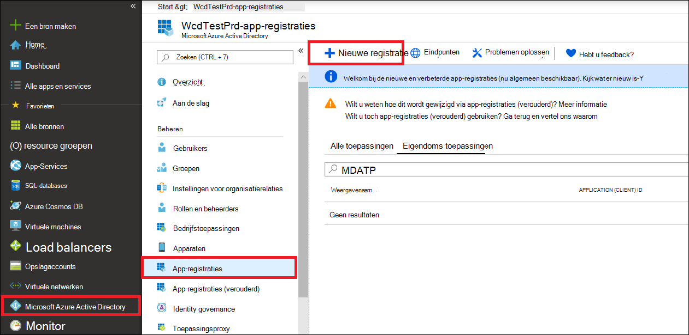
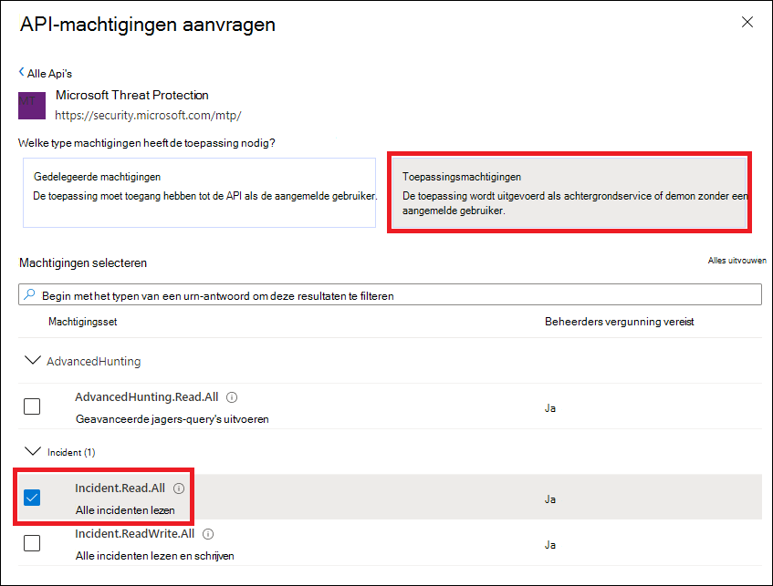
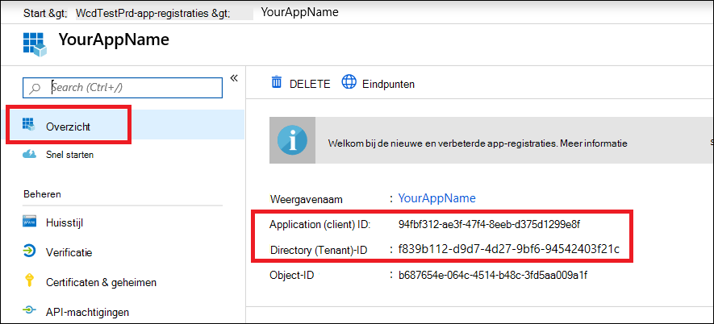

# <a name="hello-world-for-microsoft-365-defender-rest-api"></a>Hallo wereld voor Microsoft 365 Defender REST API

[!INCLUDE [Microsoft 365 Defender rebranding](../includes/microsoft-defender.md)]

**Van toepassing op:**

- Microsoft 365 Defender

> [!IMPORTANT]
> Sommige informatie verhoudt zich tot een voorvrijgegeven product dat bij de commerciële versie van de commerciële versie mogelijk ingrijpend werd gewijzigd. Microsoft biedt geen garanties, expliciete of impliciete informatie met betrekking tot de informatie die u hier opgeeft.

## <a name="get-incidents-using-a-simple-powershell-script"></a>Incidenten aanvragen met behulp van een eenvoudig PowerShell-script

Het duurt 5 tot 10 minuten voordat het project is voltooid. Deze tijds raming omvat het registreren van de toepassing en het toepassen van de code van het PowerShell-voorbeeldscript.

### <a name="register-an-app-in-azure-active-directory"></a>Een app registreren in azure Active Directory

1. Meld u aan bij [Azure](https://portal.azure.com) als een gebruiker met de rol van **globale beheerder** .

2. Ga naar de **Azure Active Directory**-  >  **app registraties**  >  **nieuwe registratie**.

   

3. Kies in het registratieformulier een naam voor de toepassing en selecteer vervolgens **registreren**. U moet een omleidings-URI selecteren optioneel. Dit voorbeeld is niet nodig.

4. Selecteer op de pagina toepassingen de optie **API-machtigingen**  >  **toevoegen**  >  **Mijn organisatie gebruikt** >, typ **Microsoft Threat Protection** en selecteer **Microsoft Threat Protection**. Uw app heeft nu toegang tot Microsoft 365 Defender.

   > [!TIP]
   > *Microsoft Threat Protection* is een voormalig naam voor microsoft 365 Defender en wordt niet weergegeven in de oorspronkelijke lijst. U moet de naam ervan beginnen te schrijven in het tekstvak om de naam weer te geven.
   

   - Kies **Application permissions**  >  **. Read. all** en selecteer **add machtigingen**.

   

5. Selecteer **beheerder toestemming verlenen**. Telkens wanneer u een machtiging toevoegt, moet u de machtiging **beheerder toestemming verlenen** selecteren om de machtiging van kracht te laten worden.

    

6. Voeg een geheim toe aan de toepassing. Selecteer **certificaten & geheimen**, voeg een beschrijving toe aan het geheim en selecteer vervolgens **toevoegen**.

    > [!TIP]
    > Wanneer u **toevoegen** hebt geselecteerd, selecteert u **de gegenereerde geheime waarde kopiëren**. U kunt de geheime waarde niet meer ophalen wanneer u niets hebt.

    

7. Registreer uw toepassings-ID en uw Tenant-ID ergens veilig. Ze worden weergegeven onder **overzicht** op de pagina toepassing.

   

### <a name="get-a-token-using-the-app-and-use-the-token-to-access-the-api"></a>Een token verkrijgen met behulp van de app en de token gebruiken om toegang te krijgen tot de API

Zie voor meer informatie over Azure Active Directory-tokens de [zelfstudie voor Azure AD](https://docs.microsoft.com/azure/active-directory/develop/active-directory-v2-protocols-oauth-client-creds).

> [!IMPORTANT]
> Hoewel het voorbeeld in deze demo-app u adviseert om te plakken in uw geheime waarde voor testdoeleinden, moet u **nooit hardcodee geheimen** verleggen in een toepassing die wordt uitgevoerd in de productie. Een derde partij kon uw geheim gebruiken om toegang te krijgen tot bronnen. U kunt de geheimen van uw apps veilig houden met behulp van [Azure Key-kluis](https://docs.microsoft.com/azure/key-vault/general/about-keys-secrets-certificates). Zie [geheimen in uw server-apps beheren met Azure-sleutel](https://docs.microsoft.com/learn/modules/manage-secrets-with-azure-key-vault/)beveiliging voor een praktisch voorbeeld van de manier waarop u uw app kunt beschermen.

1. Kopieer het onderstaande script en plak dit in uw favoriete teksteditor. Opslaan als **Get-Token.ps1**. U kunt de code ook uitvoeren als-is in PowerShell ISE, maar u moet deze opslaan, omdat we de code opnieuw moeten uitvoeren wanneer we het script voor het aanvullen van incidenten gebruiken in de volgende sectie.

    Met dit script wordt een token gegenereerd en opgeslagen in de werkmap onder de naam *Latest-token.txt*.

    ```PowerShell
    # This script gets the app context token and saves it to a file named "Latest-token.txt" under the current directory.
    # Paste in your tenant ID, client ID and app secret (App key).

    $tenantId = '' # Paste your directory (tenant) ID here
    $clientId = '' # Paste your application (client) ID here
    $appSecret = '' # # Paste your own app secret here to test, then store it in a safe place!

    $resourceAppIdUri = 'https://api.security.microsoft.com'
    $oAuthUri = "https://login.windows.net/$tenantId/oauth2/token"
    $authBody = [Ordered] @{
      resource = $resourceAppIdUri
      client_id = $clientId
      client_secret = $appSecret
      grant_type = 'client_credentials'
    }
    $authResponse = Invoke-RestMethod -Method Post -Uri $oAuthUri -Body $authBody -ErrorAction Stop
    $token = $authResponse.access_token
    Out-File -FilePath "./Latest-token.txt" -InputObject $token
    return $token
    ```

#### <a name="validate-the-token"></a>Het token valideren

1. Kopieer en plak het token dat u hebt ontvangen in [JWT](https://jwt.ms) om dit te decoderen.
1. *JWT* staat voor *JSON Web token*. Het met een cijfer genummerde token bevat een aantal met JSON opgemaakte items of claims. Zorg ervoor dat de *claim claim* binnen het genummerde token de gewenste machtigingen bevat.

    In de volgende afbeelding ziet u een versleuteld token dat u hebt verkregen uit een app, met ```Incidents.Read.All``` , ```Incidents.ReadWrite.All``` en ```AdvancedHunting.Read.All``` machtigingen:

    

### <a name="get-a-list-of-recent-incidents"></a>Een lijst met recente incidenten weergeven

In het onderstaande script wordt **Get-Token.ps1** gebruikt voor toegang tot de API. Vervolgens wordt een lijst met incidenten opgehaald die zijn bijgewerkt in de afgelopen 48 uur en wordt de lijst opgeslagen als een JSON-bestand.

> [!IMPORTANT]
> Sla dit script op in de map waarin u **Get-Token.ps1** hebt opgeslagen.

```PowerShell
# This script returns incidents last updated within the past 48 hours.

$token = ./Get-Token.ps1

# Get incidents from the past 48 hours.
# The script may appear to fail if you don't have any incidents in that time frame.
$dateTime = (Get-Date).ToUniversalTime().AddHours(-48).ToString("o")

# This URL contains the type of query and the time filter we created above.
# Note that `$filter` does not refer to a local variable in our script --
# it's actually an OData operator and part of the API's syntax.
$url = "https://api.security.microsoft.com/api/incidents?$filter=lastUpdateTime+ge+$dateTime"

# Set the webrequest headers
$headers = @{
    'Content-Type' = 'application/json'
    'Accept' = 'application/json'
    'Authorization' = "Bearer $token"
}

# Send the request and get the results.
$response = Invoke-WebRequest -Method Get -Uri $url -Headers $headers -ErrorAction Stop

# Extract the incidents from the results.
$incidents =  ($response | ConvertFrom-Json).value | ConvertTo-Json -Depth 99

# Get a string containing the execution time. We concatenate that string to the name 
# of the output file to avoid overwriting the file on consecutive runs of the script.
$dateTimeForFileName = Get-Date -Format o | foreach {$_ -replace ":", "."}

# Save the result as json
$outputJsonPath = "./Latest Incidents $dateTimeForFileName.json"

Out-File -FilePath $outputJsonPath -InputObject $incidents
```

U bent klaar! U hebt de volgende handelingen uitgevoerd:

- Het maken en registreren van een toepassing.
- Toestemming verleend voor de toepassing van waarschuwingen.
- Verbonden met de API.
- Gebruik een PowerShell-script om in de afgelopen 48 uur bijgewerkte incidenties te retourneren.

## <a name="related-articles"></a>Verwante artikelen

- [Overzicht van Microsoft 365 Defender-Api's](api-overview.md)
- [Toegang tot de Microsoft 365 Defender-Api's](api-access.md)
- [Een app maken om toegang te krijgen tot Microsoft 365 Defender zonder een gebruiker](api-create-app-web.md)
- [Een app maken om toegang te krijgen tot Microsoft 365 Defender-Api's namens een gebruiker](api-create-app-user-context.md)
- [Een app maken met toegang met meerdere tenants voor partners van Microsoft 365 Defender](api-partner-access.md)
- [Geheimen in uw server-apps beheren met Azure-sleutel kluis](https://docs.microsoft.com/learn/modules/manage-secrets-with-azure-key-vault/)
- [OAuth 2,0-autorisatie voor gebruikersaanmelding en API-toegang](https://docs.microsoft.com/azure/active-directory/develop/active-directory-v2-protocols-oauth-code)
