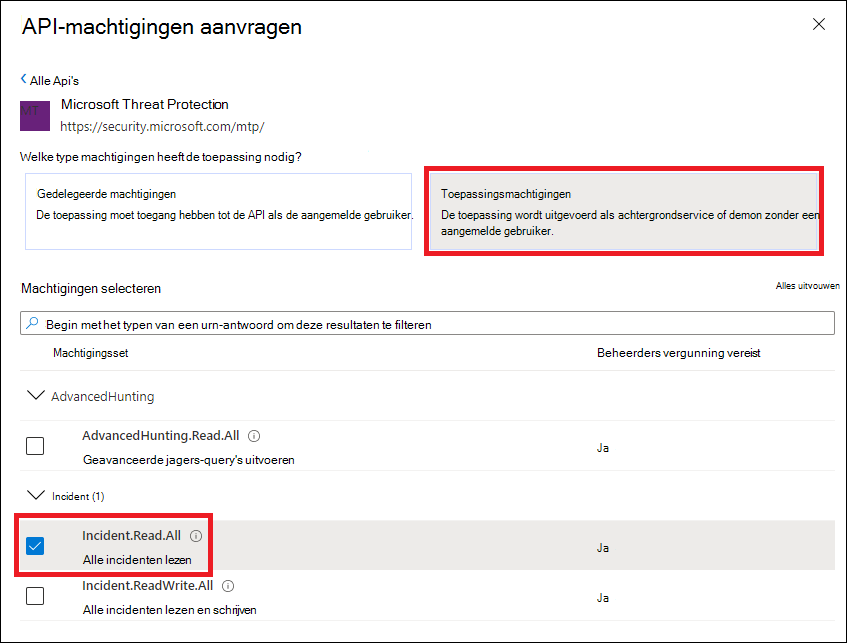

# <a name="partner-access-through-microsoft-365-defender-apis"></a><span data-ttu-id="b1926-104">Partner toegang via Microsoft 365 Defender-Api's</span><span class="sxs-lookup"><span data-stu-id="b1926-104">Partner access through Microsoft 365 Defender APIs</span></span>

[!INCLUDE [Microsoft 365 Defender rebranding](../includes/microsoft-defender.md)]


<span data-ttu-id="b1926-105">**Van toepassing op:**</span><span class="sxs-lookup"><span data-stu-id="b1926-105">**Applies to:**</span></span>
- <span data-ttu-id="b1926-106">Microsoft 365 Defender</span><span class="sxs-lookup"><span data-stu-id="b1926-106">Microsoft 365 Defender</span></span>

>[!IMPORTANT] 
><span data-ttu-id="b1926-107">Sommige informatie verhoudt zich tot een voorvrijgegeven product dat bij de commerciële versie van de commerciële versie mogelijk ingrijpend werd gewijzigd.</span><span class="sxs-lookup"><span data-stu-id="b1926-107">Some information relates to prereleased product which may be substantially modified before it's commercially released.</span></span> <span data-ttu-id="b1926-108">Microsoft biedt geen garanties, expliciete of impliciete informatie met betrekking tot de informatie die u hier opgeeft.</span><span class="sxs-lookup"><span data-stu-id="b1926-108">Microsoft makes no warranties, express or implied, with respect to the information provided here.</span></span>


<span data-ttu-id="b1926-109">Op deze pagina wordt beschreven hoe u een AAD-toepassing maakt om toegang te krijgen tot Microsoft 365 Defender namens uw klanten via programmering.</span><span class="sxs-lookup"><span data-stu-id="b1926-109">This page describes how to create an AAD application to get programmatic access to Microsoft 365 Defender on behalf of your customers.</span></span>

<span data-ttu-id="b1926-110">Microsoft 365 Defender geeft veel van zijn gegevens en acties getoond via een set programmeer Api's.</span><span class="sxs-lookup"><span data-stu-id="b1926-110">Microsoft 365 Defender exposes much of its data and actions through a set of programmatic APIs.</span></span> <span data-ttu-id="b1926-111">Met deze Api's wordt u geholpen bij het automatiseren van werkstromen en innoveren op basis van de mogelijkheden van Microsoft 365 Defender.</span><span class="sxs-lookup"><span data-stu-id="b1926-111">Those APIs will help you automate work flows and innovate based on Microsoft 365 Defender capabilities.</span></span> <span data-ttu-id="b1926-112">Voor API-toegang is OAuth 2.0-authenticatie vereist.</span><span class="sxs-lookup"><span data-stu-id="b1926-112">The API access requires OAuth2.0 authentication.</span></span> <span data-ttu-id="b1926-113">Voor meer informatie raadpleegt u [OAuth 2,0 Authorization code flow](https://docs.microsoft.com/azure/active-directory/develop/active-directory-v2-protocols-oauth-code).</span><span class="sxs-lookup"><span data-stu-id="b1926-113">For more information, see [OAuth 2.0 Authorization Code Flow](https://docs.microsoft.com/azure/active-directory/develop/active-directory-v2-protocols-oauth-code).</span></span>

<span data-ttu-id="b1926-114">In het algemeen dient u de volgende stappen uit te voeren om de Api's te gebruiken:</span><span class="sxs-lookup"><span data-stu-id="b1926-114">In general, you’ll need to take the following steps to use the APIs:</span></span>
- <span data-ttu-id="b1926-115">Maak een Aad-toepassing van **meerdere tenants** .</span><span class="sxs-lookup"><span data-stu-id="b1926-115">Create a **multi-tenant** AAD application.</span></span>
- <span data-ttu-id="b1926-116">Neem geautoriseerd (instemming) door de beheerder van uw klant voor uw toepassing om toegang te krijgen tot de informatie die nodig is voor Microsoft 365.</span><span class="sxs-lookup"><span data-stu-id="b1926-116">Get authorized (consent) by your customer administrator for your application to access Microsoft 365 Defender resources it needs.</span></span>
- <span data-ttu-id="b1926-117">U krijgt een toegangstoken met deze toepassing.</span><span class="sxs-lookup"><span data-stu-id="b1926-117">Get an access token using this application.</span></span>
- <span data-ttu-id="b1926-118">Gebruik het token om toegang te krijgen tot de Microsoft 365 Defender API.</span><span class="sxs-lookup"><span data-stu-id="b1926-118">Use the token to access Microsoft 365 Defender API.</span></span>

<span data-ttu-id="b1926-119">De volgende stappen uit de handleiding voor het maken van een AAD-toepassing: krijg een toegangstoken aan Microsoft 365 Defender en valideer het token.</span><span class="sxs-lookup"><span data-stu-id="b1926-119">The following steps with guide you how to create an AAD application, get an access token to Microsoft 365 Defender and validate the token.</span></span>

## <a name="create-the-multi-tenant-app"></a><span data-ttu-id="b1926-120">De app meerdere tenants maken</span><span class="sxs-lookup"><span data-stu-id="b1926-120">Create the multi-tenant app</span></span>

1. <span data-ttu-id="b1926-121">Meld u aan bij uw [Azure-Tenant](https://portal.azure.com) met een gebruiker met een **globale beheerdersrol** .</span><span class="sxs-lookup"><span data-stu-id="b1926-121">Log on to your [Azure tenant](https://portal.azure.com) with user that has **Global Administrator** role.</span></span>

2. <span data-ttu-id="b1926-122">Ga naar de **Azure Active Directory** -  >  **app registraties**  >  **nieuwe registratie**.</span><span class="sxs-lookup"><span data-stu-id="b1926-122">Navigate to **Azure Active Directory** > **App registrations** > **New registration**.</span></span> 

   

3. <span data-ttu-id="b1926-124">In het registratieformulier:</span><span class="sxs-lookup"><span data-stu-id="b1926-124">In the registration form:</span></span>

    - <span data-ttu-id="b1926-125">Kies een naam voor uw toepassing.</span><span class="sxs-lookup"><span data-stu-id="b1926-125">Choose a name for your application.</span></span>

    - <span data-ttu-id="b1926-126">Ondersteunde accounttypen: accounts in een willekeurige organisatie Directory.</span><span class="sxs-lookup"><span data-stu-id="b1926-126">Supported account types - accounts in any organizational directory.</span></span>

    - <span data-ttu-id="b1926-127">URI-type omleiden: Web, URI: https://portal.azure.com</span><span class="sxs-lookup"><span data-stu-id="b1926-127">Redirect URI - type: Web, URI: https://portal.azure.com</span></span>

    


4. <span data-ttu-id="b1926-129">Zorg dat uw toepassing toegang heeft tot Microsoft 365 Defender en wijs dit toe aan de minimaal vereiste machtigingen om de integratie te voltooien.</span><span class="sxs-lookup"><span data-stu-id="b1926-129">Allow your Application to access Microsoft 365 Defender and assign it with the minimal set of permissions required to complete the integration.</span></span>

   - <span data-ttu-id="b1926-130">Klik op de pagina van de toepassing op **API-machtigingen** voor het toevoegen van een  >  **machtiging** voor  >  **Mijn organisatie** > type **Microsoft 365 Defender** en klik op **Microsoft 365 Defender**.</span><span class="sxs-lookup"><span data-stu-id="b1926-130">On your application page, click **API Permissions** > **Add permission** > **APIs my organization uses** > type **Microsoft 365 Defender** and click on **Microsoft 365 Defender**.</span></span>

   >[!NOTE]
   ><span data-ttu-id="b1926-131">Microsoft 365 Defender wordt niet weergegeven in de oorspronkelijke lijst.</span><span class="sxs-lookup"><span data-stu-id="b1926-131">Microsoft 365 Defender does not appear in the original list.</span></span> <span data-ttu-id="b1926-132">U moet de naam ervan beginnen te schrijven in het tekstvak om de naam weer te geven.</span><span class="sxs-lookup"><span data-stu-id="b1926-132">You need to start writing its name in the text box to see it appear.</span></span>

   
   
   ### <a name="request-api-permissions"></a><span data-ttu-id="b1926-134">API-machtigingen aanvragen</span><span class="sxs-lookup"><span data-stu-id="b1926-134">Request API permissions</span></span>

   <span data-ttu-id="b1926-135">Om te bepalen welke machtigingen u nodig hebt, raadpleegt u de sectie **machtigingen** in de API die u wilt bellen.</span><span class="sxs-lookup"><span data-stu-id="b1926-135">To determine which permission you need, please look at the **Permissions** section in the API you are interested to call.</span></span> 

   <span data-ttu-id="b1926-136">In het volgende voorbeeld gebruiken we de machtiging **alle incidenten lezen** :</span><span class="sxs-lookup"><span data-stu-id="b1926-136">In the following example we will use **'Read all incidents'** permission:</span></span>

   <span data-ttu-id="b1926-137">Kies **Application permissions**  >  **incidenten. als... lezen. alle** > Klik op **machtigingen toevoegen**</span><span class="sxs-lookup"><span data-stu-id="b1926-137">Choose **Application permissions** > **Incidents.Read.All** > Click on **Add permissions**</span></span>

   


5. <span data-ttu-id="b1926-139">Klik op **toestemming verlenen**</span><span class="sxs-lookup"><span data-stu-id="b1926-139">Click **Grant consent**</span></span>

    >[!NOTE]
    ><span data-ttu-id="b1926-140">Telkens wanneer u toestemming toevoegt, moet u op **toestemming verlenen** om de nieuwe machtiging van kracht te laten worden.</span><span class="sxs-lookup"><span data-stu-id="b1926-140">Every time you add permission you must click on **Grant consent** for the new permission to take effect.</span></span>

    

6. <span data-ttu-id="b1926-142">Voeg een geheim toe aan de toepassing.</span><span class="sxs-lookup"><span data-stu-id="b1926-142">Add a secret to the application.</span></span>

    - <span data-ttu-id="b1926-143">Klik op **certificaten & geheimen** , voeg een beschrijving toe aan het geheim en klik op **toevoegen**.</span><span class="sxs-lookup"><span data-stu-id="b1926-143">Click **Certificates & secrets** , add description to the secret and click **Add**.</span></span>

    >[!IMPORTANT]
    > <span data-ttu-id="b1926-144">Nadat u **toevoegen** hebt geselecteerd, **kopieert u de gegenereerde geheime waarde**.</span><span class="sxs-lookup"><span data-stu-id="b1926-144">After selecting **Add** , **copy the generated secret value**.</span></span> <span data-ttu-id="b1926-145">Wanneer u niets kunt terughalen.</span><span class="sxs-lookup"><span data-stu-id="b1926-145">You won't be able to retrieve after you leave!</span></span>

    

7. <span data-ttu-id="b1926-147">Noteer de toepassings-ID:</span><span class="sxs-lookup"><span data-stu-id="b1926-147">Write down your application ID:</span></span>

   - <span data-ttu-id="b1926-148">Ga op de pagina toepassing naar **overzicht** en kopieer de volgende opties:</span><span class="sxs-lookup"><span data-stu-id="b1926-148">On your application page, go to **Overview** and copy the following:</span></span>

   

8. <span data-ttu-id="b1926-150">Voeg de toepassing toe aan de Tenant van uw klant.</span><span class="sxs-lookup"><span data-stu-id="b1926-150">Add the application to your customer's tenant.</span></span>

    <span data-ttu-id="b1926-151">U moet uw aanvraag in elke Tenant van de klant goedkeuren, waarbij u deze wilt gebruiken.</span><span class="sxs-lookup"><span data-stu-id="b1926-151">You need your application to be approved in each customer tenant where you intend to use it.</span></span> <span data-ttu-id="b1926-152">Dit komt doordat de toepassing wordt uitgevoerd met de Microsoft 365-app voor uw klant namens de klant.</span><span class="sxs-lookup"><span data-stu-id="b1926-152">This is because your application interacts with Microsoft 365 Defender application on behalf of your customer.</span></span>

    <span data-ttu-id="b1926-153">Een gebruiker met een **globale beheerder** van de Tenant van uw klant moet op de koppeling naar de toestemming klikken en de toepassing goedkeuren.</span><span class="sxs-lookup"><span data-stu-id="b1926-153">A user with **Global Administrator** from your customer's tenant need to click the consent link and approve your application.</span></span>

    <span data-ttu-id="b1926-154">Toestemming koppeling is van het formulier:</span><span class="sxs-lookup"><span data-stu-id="b1926-154">Consent link is of the form:</span></span>

    ```
    https://login.microsoftonline.com/common/oauth2/authorize?prompt=consent&client_id=00000000-0000-0000-0000-000000000000&response_type=code&sso_reload=true
    ```

    <span data-ttu-id="b1926-155">Wanneer 00000000-0000-0000-0000-000000000000 moet worden vervangen door uw toepassings-ID</span><span class="sxs-lookup"><span data-stu-id="b1926-155">Where 00000000-0000-0000-0000-000000000000 should be replaced with your Application ID</span></span>

    <span data-ttu-id="b1926-156">Nadat u op de koppeling toestemming hebt geklikt, meldt u zich aan met de hoofdbeheerder van de Tenant van de klant en gaat u akkoord met de toepassing.</span><span class="sxs-lookup"><span data-stu-id="b1926-156">After clicking on the consent link, login with the Global Administrator of the customer's tenant and consent the application.</span></span>

    

    <span data-ttu-id="b1926-158">Daarnaast moet u uw klant vragen voor hun Tenant-ID en deze opslaan voor toekomstig gebruik tijdens het verkrijgen van het token.</span><span class="sxs-lookup"><span data-stu-id="b1926-158">In addition, you will need to ask your customer for their tenant ID and save it for future use when acquiring the token.</span></span>

- <span data-ttu-id="b1926-159">**Klaar!**</span><span class="sxs-lookup"><span data-stu-id="b1926-159">**Done!**</span></span> <span data-ttu-id="b1926-160">U hebt een toepassing geregistreerd.</span><span class="sxs-lookup"><span data-stu-id="b1926-160">You have successfully registered an application!</span></span> 
- <span data-ttu-id="b1926-161">Zie voorbeelden hieronder voor het verwerving van tokens en validatie.</span><span class="sxs-lookup"><span data-stu-id="b1926-161">See examples below for token acquisition and validation.</span></span>

## <a name="get-an-access-token-examples"></a><span data-ttu-id="b1926-162">Een voorbeeld van een toegangstoken verkrijgen:</span><span class="sxs-lookup"><span data-stu-id="b1926-162">Get an access token examples:</span></span>

>[!NOTE]
> <span data-ttu-id="b1926-163">Als u namens de klant toegangstoken wilt verkrijgen, gebruikt u de Tenant-ID van de klant bij de volgende token verwervingen.</span><span class="sxs-lookup"><span data-stu-id="b1926-163">To get access token on behalf of your customer, use the customer's tenant ID on the following token acquisitions.</span></span>

<br><span data-ttu-id="b1926-164">Raadpleeg voor meer informatie over AAD-tokens [zelfstudie](https://docs.microsoft.com/azure/active-directory/develop/active-directory-v2-protocols-oauth-client-creds)</span><span class="sxs-lookup"><span data-stu-id="b1926-164">For more details on AAD token, refer to [AAD tutorial](https://docs.microsoft.com/azure/active-directory/develop/active-directory-v2-protocols-oauth-client-creds)</span></span>

### <a name="using-powershell"></a><span data-ttu-id="b1926-165">PowerShell gebruiken</span><span class="sxs-lookup"><span data-stu-id="b1926-165">Using PowerShell</span></span>

```
# That code gets the App Context Token and save it to a file named "Latest-token.txt" under the current directory
# Paste below your Tenant ID, App ID and App Secret (App key).

$tenantId = '' ### Paste your tenant ID here
$appId = '' ### Paste your Application ID here
$appSecret = '' ### Paste your Application key here

$resourceAppIdUri = 'https://api.security.microsoft.com'
$oAuthUri = "https://login.windows.net/$TenantId/oauth2/token"
$authBody = [Ordered] @{
    resource = "$resourceAppIdUri"
    client_id = "$appId"
    client_secret = "$appSecret"
    grant_type = 'client_credentials'
}
$authResponse = Invoke-RestMethod -Method Post -Uri $oAuthUri -Body $authBody -ErrorAction Stop
$token = $authResponse.access_token
Out-File -FilePath "./Latest-token.txt" -InputObject $token
return $token
```

### <a name="using-c"></a><span data-ttu-id="b1926-166">Met C#:</span><span class="sxs-lookup"><span data-stu-id="b1926-166">Using C#:</span></span>

><span data-ttu-id="b1926-167">De onderstaande code is getest met Nuget Microsoft. Identity model. clients. ActiveDirectory</span><span class="sxs-lookup"><span data-stu-id="b1926-167">The below code was tested with Nuget Microsoft.IdentityModel.Clients.ActiveDirectory</span></span>

- <span data-ttu-id="b1926-168">Een nieuwe console toepassing maken</span><span class="sxs-lookup"><span data-stu-id="b1926-168">Create a new Console Application</span></span>
- <span data-ttu-id="b1926-169">Nuget [Microsoft. Identity model. clients. ActiveDirectory](https://www.nuget.org/packages/Microsoft.IdentityModel.Clients.ActiveDirectory/) installeren</span><span class="sxs-lookup"><span data-stu-id="b1926-169">Install Nuget [Microsoft.IdentityModel.Clients.ActiveDirectory](https://www.nuget.org/packages/Microsoft.IdentityModel.Clients.ActiveDirectory/)</span></span>
- <span data-ttu-id="b1926-170">Onderstaande invoegtoepassing gebruiken</span><span class="sxs-lookup"><span data-stu-id="b1926-170">Add the below using</span></span>

    ```
    using Microsoft.IdentityModel.Clients.ActiveDirectory;
    ```

- <span data-ttu-id="b1926-171">Kopieer en plak de onderstaande code in de toepassing (Vergeet niet de drie variabelen bij te werken: ```tenantId, appId, appSecret``` )</span><span class="sxs-lookup"><span data-stu-id="b1926-171">Copy/Paste the below code in your application (do not forget to update the 3 variables: ```tenantId, appId, appSecret```)</span></span>

    ```
    string tenantId = "00000000-0000-0000-0000-000000000000"; // Paste your own tenant ID here
    string appId = "11111111-1111-1111-1111-111111111111"; // Paste your own app ID here
    string appSecret = "22222222-2222-2222-2222-222222222222"; // Paste your own app secret here for a test, and then store it in a safe place! 

    const string authority = "https://login.windows.net";
    const string mtpResourceId = "https://api.security.microsoft.com";

    AuthenticationContext auth = new AuthenticationContext($"{authority}/{tenantId}/");
    ClientCredential clientCredential = new ClientCredential(appId, appSecret);
    AuthenticationResult authenticationResult = auth.AcquireTokenAsync(mtpResourceId, clientCredential).GetAwaiter().GetResult();
    string token = authenticationResult.AccessToken;
    ```


### <a name="using-curl"></a><span data-ttu-id="b1926-172">Werken met krul</span><span class="sxs-lookup"><span data-stu-id="b1926-172">Using Curl</span></span>

> [!NOTE]
> <span data-ttu-id="b1926-173">De onderstaande procedure, krul voor Windows is al geïnstalleerd op de computer</span><span class="sxs-lookup"><span data-stu-id="b1926-173">The below procedure supposed Curl for Windows is already installed on your computer</span></span>

- <span data-ttu-id="b1926-174">Een opdrachtvenster openen</span><span class="sxs-lookup"><span data-stu-id="b1926-174">Open a command window</span></span>
- <span data-ttu-id="b1926-175">CLIENT_ID instellen op uw Azure-toepassings-ID</span><span class="sxs-lookup"><span data-stu-id="b1926-175">Set CLIENT_ID to your Azure application ID</span></span>
- <span data-ttu-id="b1926-176">CLIENT_SECRET instellen op uw Azure-toepassing Secret</span><span class="sxs-lookup"><span data-stu-id="b1926-176">Set CLIENT_SECRET to your Azure application secret</span></span>
- <span data-ttu-id="b1926-177">TENANT_ID instellen voor de Azure-TENANT-ID van de klant die de toepassing wil gebruiken voor toegang tot de Microsoft 365-app</span><span class="sxs-lookup"><span data-stu-id="b1926-177">Set TENANT_ID to the Azure tenant ID of the customer that wants to use your application to access Microsoft 365 Defender application</span></span>
- <span data-ttu-id="b1926-178">Voer de onderstaande opdracht uit:</span><span class="sxs-lookup"><span data-stu-id="b1926-178">Run the below command:</span></span>

```
curl -i -X POST -H "Content-Type:application/x-www-form-urlencoded" -d "grant_type=client_credentials" -d "client_id=%CLIENT_ID%" -d "scope=https://api.security.microsoft.com.default" -d "client_secret=%CLIENT_SECRET%" "https://login.microsoftonline.com/%TENANT_ID%/oauth2/v2.0/token" -k
```

<span data-ttu-id="b1926-179">U krijgt het volgende antwoord van het formulier:</span><span class="sxs-lookup"><span data-stu-id="b1926-179">You will get an answer of the form:</span></span>

```
{"token_type":"Bearer","expires_in":3599,"ext_expires_in":0,"access_token":"eyJ0eXAiOiJKV1QiLCJhbGciOiJSUzI1NiIsIn <truncated> aWReH7P0s0tjTBX8wGWqJUdDA"}
```

## <a name="validate-the-token"></a><span data-ttu-id="b1926-180">Het token valideren</span><span class="sxs-lookup"><span data-stu-id="b1926-180">Validate the token</span></span>

<span data-ttu-id="b1926-181">Sanity Controleer of u het juiste token hebt:</span><span class="sxs-lookup"><span data-stu-id="b1926-181">Sanity check to make sure you got a correct token:</span></span>

- <span data-ttu-id="b1926-182">Kopiëren/ [plakken het token](https://jwt.ms) dat u in de vorige stap ontvangt om dit te decoderen</span><span class="sxs-lookup"><span data-stu-id="b1926-182">Copy/paste into [JWT](https://jwt.ms) the token you get in the previous step in order to decode it</span></span>
- <span data-ttu-id="b1926-183">Valideren dat u de claim ' roles ' ontvangt met de gewenste machtigingen</span><span class="sxs-lookup"><span data-stu-id="b1926-183">Validate you get a 'roles' claim with the desired permissions</span></span>
- <span data-ttu-id="b1926-184">In de onderstaande schermafbeelding ziet u een versleuteld token dat u hebt verkregen van een toepassing met meerdere rechten voor Microsoft 365 Defender:</span><span class="sxs-lookup"><span data-stu-id="b1926-184">In the screenshot below, you can see a decoded token acquired from an Application with multiple permissions to Microsoft 365 Defender:</span></span>
- <span data-ttu-id="b1926-185">De ' TID ' claim is de Tenant-ID waarvan het token deel uitmaakt.</span><span class="sxs-lookup"><span data-stu-id="b1926-185">The "tid" claim is the tenant ID the token belongs to.</span></span>


## <a name="use-the-token-to-access-microsoft-365-defender-api"></a><span data-ttu-id="b1926-187">Het token gebruiken om toegang te krijgen tot de Microsoft 365 Defender API</span><span class="sxs-lookup"><span data-stu-id="b1926-187">Use the token to access Microsoft 365 Defender API</span></span>

- <span data-ttu-id="b1926-188">Kies de API die u wilt gebruiken voor meer informatie. [ondersteunde Microsoft 365 Defender-api's](api-supported.md)</span><span class="sxs-lookup"><span data-stu-id="b1926-188">Choose the API you want to use, for more information, see [Supported Microsoft 365 Defender APIs](api-supported.md)</span></span>
- <span data-ttu-id="b1926-189">Stel de autorisatie header in op de HTTP-aanvraag die u verstuurt naar ' Bearer {token} ' (Bearer is het autorisatieschema).</span><span class="sxs-lookup"><span data-stu-id="b1926-189">Set the Authorization header in the Http request you send to "Bearer {token}" (Bearer is the Authorization scheme)</span></span>
- <span data-ttu-id="b1926-190">De verlooptijd van het token is 1 uur (u kunt meer dan één aanvraag met hetzelfde token verzenden)</span><span class="sxs-lookup"><span data-stu-id="b1926-190">The Expiration time of the token is 1 hour (you can send more then one request with the same token)</span></span>

- <span data-ttu-id="b1926-191">Voorbeeld van het verzenden van een aanvraag voor het opvragen van een lijst met incidenten **met C#**</span><span class="sxs-lookup"><span data-stu-id="b1926-191">Example of sending a request to get a list of incidents **using C#**</span></span> 
    ```
    var httpClient = new HttpClient();

    var request = new HttpRequestMessage(HttpMethod.Get, "https://api.security.microsoft.com/api/incidents");

    request.Headers.Authorization = new AuthenticationHeaderValue("Bearer", token);

    var response = httpClient.SendAsync(request).GetAwaiter().GetResult();

    // Do something useful with the response
    ```

## <a name="related-topics"></a><span data-ttu-id="b1926-192">Verwante onderwerpen</span><span class="sxs-lookup"><span data-stu-id="b1926-192">Related topics</span></span> 

- [<span data-ttu-id="b1926-193">Toegang tot de Microsoft 365 Defender-Api's</span><span class="sxs-lookup"><span data-stu-id="b1926-193">Access the Microsoft 365 Defender APIs</span></span>](api-access.md)
- [<span data-ttu-id="b1926-194">Toegang tot Microsoft 365 Defender met toepassingscontext</span><span class="sxs-lookup"><span data-stu-id="b1926-194">Access  Microsoft 365 Defender with application context</span></span>](api-create-app-web.md)
- [<span data-ttu-id="b1926-195">Toegang tot Microsoft 365 Defender met gebruikerscontext</span><span class="sxs-lookup"><span data-stu-id="b1926-195">Access  Microsoft 365 Defender with user context</span></span>](api-create-app-user-context.md)
