# Microsoft Threat Protection-pijlers configureren voor uw proeflabomgeving

**Geldt voor:**
- Microsoft Threat Protection

Het maken van een Microsoft Threat Protection trial lab omgeving en het implementeren ervan is een proces in drie fasen:

 
<table border="0" width="100%" align="center">
  <tr style="text-align:center;">
    <td align="center" style="width:25%; border:0;" >
      <a href= "https://docs.microsoft.com/microsoft-365/security/mtp/prepare-mtpeval?view=o365-worldwide"> 
        
       Fase 1: Voorbereiden</a> 
    </td>
     <td align="center">
      <a href="https://docs.microsoft.com/microsoft-365/security/mtp/setup-mtpeval?view=o365-worldwide">
        
       Fase 2: Setup</a> 
    </td>
    <td align="center" bgcolor="#d5f5e3">
      <a href="https://docs.microsoft.com/microsoft-365/security/mtp/config-mtpeval?view=o365-worldwide">
        
       Fase 3: & configureren</a> 
</td>

  </tr>
</table>

U bevindt zich momenteel in de configuratiefase.

Voorbereiding is de sleutel tot een succesvolle implementatie. In dit artikel wordt u begeleid op de punten die u moet overwegen bij de voorbereiding van de implementatie van Microsoft Defender ATP.

## Pijlers van Microsoft Threat Protection
Microsoft Threat Protection bestaat uit vier pijlers. Hoewel één pijler al waarde kan bieden aan de beveiliging van uw netwerkorganisatie, geeft het inschakelen van de vier pijlers van Microsoft Threat Protection uw organisatie de meeste waarde.

  

In deze sectie u het volgende configureren:
-   Office 365 Advanced Threat Protection
-   Azure Advanced Threat Protection 
-   Microsoft Cloud App Security
-   Microsoft Defender Advanced Threat Protection

## Geavanceerde bedreigingsbeveiliging van Office 365 configureren
>[!NOTE]
>Sla deze stap over als u Office 365 Advanced Threat Protection al hebt ingeschakeld. 

Er is een PowerShell-module genaamd de *Office 365 Advanced Threat Protection Recommended Configuration Analyzer (ORCA)* die helpt bij het bepalen van een aantal van deze instellingen. Wanneer u wordt uitgevoerd als beheerder in uw tenant, helpt get-ORCAReport bij het genereren van een beoordeling van de anti-spam-, anti-phish- en andere instellingen voor berichthygiëne. U deze https://www.powershellgallery.com/packages/ORCA/module downloaden van. 

1. Navigeer naar [Office 365 Security & Compliance Center](https://protection.office.com/homepage) > **Threat Management** > **Policy**.
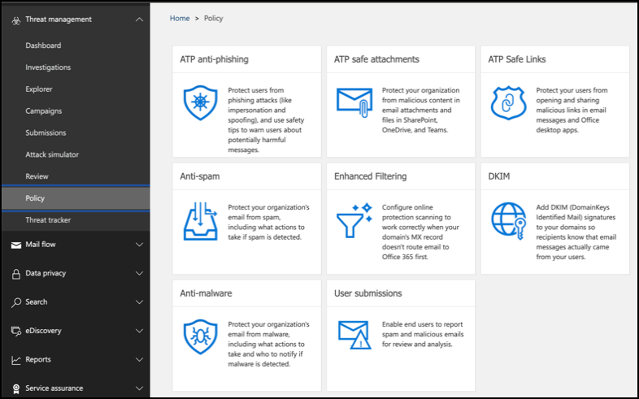  
 
2. Klik op **ATP anti-phishing**, selecteer **Maken** en vul de beleidsnaam en beschrijving in. Klik op **Volgende**.
  

>[!NOTE]
>Bewerk uw Advanced ATP anti-phishing beleid. **Geavanceerde phishingdrempel wijzigen** in 2 - **Agressief**.
 

3. Klik **op** de vervolgkeuzelijst Een voorwaarde toevoegen en selecteer uw domein(en) als geadresseerddomein. Klik op **Volgende**.
  
 
4. Bekijk uw instellingen. Klik **op Dit beleid maken** om dit te bevestigen. 
  
 
5. Selecteer **ATP Safe-bijlagen** en selecteer de optie **ATP inschakelen voor SharePoint, OneDrive en Microsoft Teams.**  
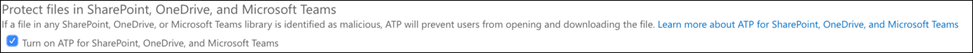  

6. Klik op het +-pictogram om een nieuw beleid voor veilige bijlagen te maken en pas het toe als ontvangerdomein op uw domeinen. Klik op **Opslaan**.
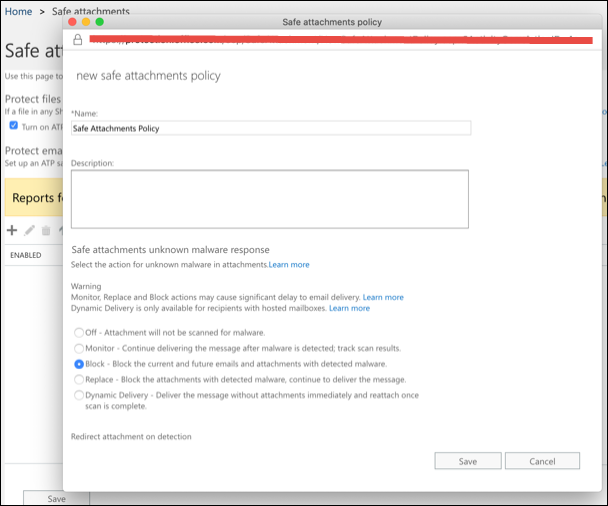  
 
7. Selecteer vervolgens het beleid **voor veilige koppelingen van ATP** en klik vervolgens op het potloodpictogram om het standaardbeleid te bewerken.

8. Zorg ervoor dat de optie **Niet volgen wanneer gebruikers op veilige koppelingen klikken** niet is geselecteerd, terwijl de rest van de opties is geselecteerd. Zie [Instellingen voor veilige koppelingen](https://docs.microsoft.com/microsoft-365/security/office-365-security/recommended-settings-for-eop-and-office365-atp?view=o365-worldwide) voor meer informatie. Klik op **Opslaan**. 
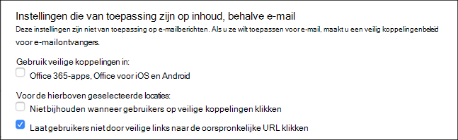  

9. Selecteer vervolgens het **beleid voor malwarebestrijding,** selecteer de standaardinstelling en kies het potloodpictogram.

10. Klik **op Instellingen** en selecteer Ja en gebruik de **standaardmeldingstekst** om **reactie op malwaredetectie**in te schakelen. Schakel het **filter voor algemene bijlagetypen** in. Klik op **Opslaan**.
   
  
11. Navigeer naar [Office 365 Security & Compliance Center](https://protection.office.com/homepage) > **Search** > **Audit log search** en schakel Controle in.  
  

12. Integreer Office 365 ATP met Microsoft Defender ATP. Navigeer naar [Office 365 Security & Compliance Center](https://protection.office.com/homepage) > **Threat management** > **Explorer** en selecteer **WDATP-instellingen** in de rechterbovenhoek van het scherm. Schakel in het dialoogvenster Microsoft Defender ATP-verbinding **Verbinding maken met Windows ATP**in.
  

## Azure Advanced Threat Protection configureren
>[!NOTE]
>Deze stap overslaan als u Azure Advanced Threat Protection al hebt ingeschakeld

1. Navigeer naar [Microsoft 365 Security Center](https://security.microsoft.com/info) > selecteer Meer **bronnen** > **Azure Advanced Threat Protection**.
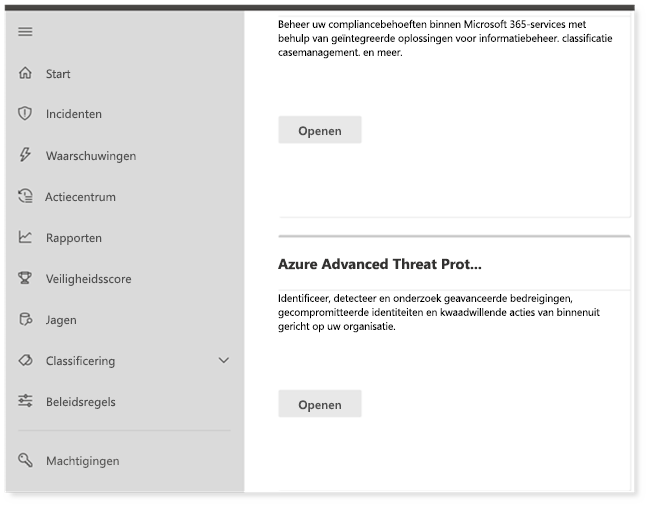  

2. Klik **op Maken** om de wizard Azure Advanced Threat Protection te starten. 
 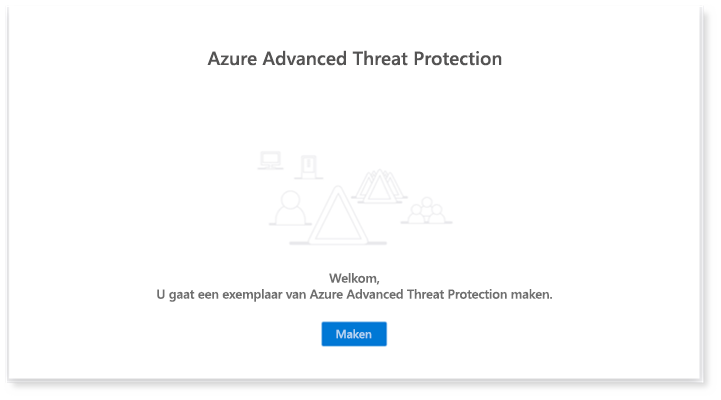  

3. Kies **Een gebruikersnaam en wachtwoord opgeven om verbinding te maken met uw Active Directory-forest.**  
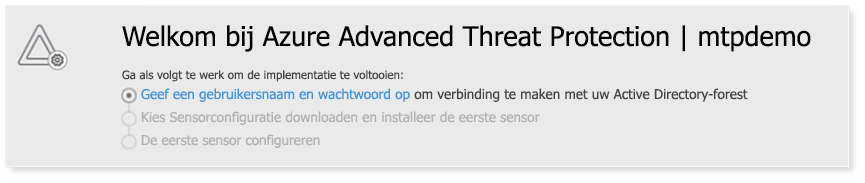  

4. Voer uw on-premises active directory-referenties in. Dit kan elk gebruikersaccount zijn dat leestoegang heeft tot Active Directory.
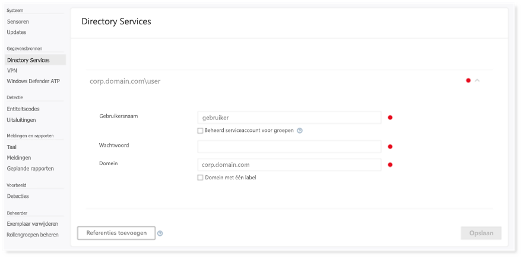  

5. Kies vervolgens **Sensorsetup downloaden** en het bestand overbrengen naar uw domeincontroller. 
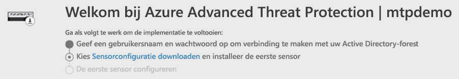  

6. Voer de Azure ATP-sensorsetup uit en begin met het volgen van de wizard.
 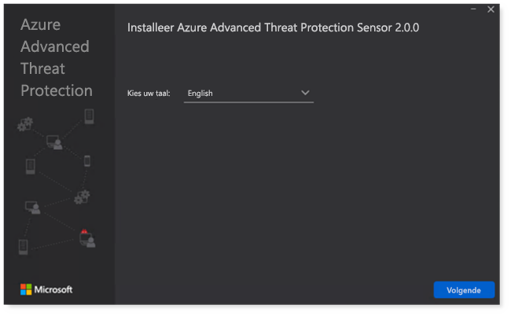  
 
7. Klik op **Volgende** bij het type sensorimplementatie.
 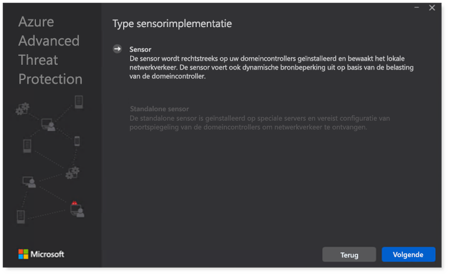  
 
8. Kopieer de toegangssleutel zoals u deze vervolgens in de wizard moet invoeren.
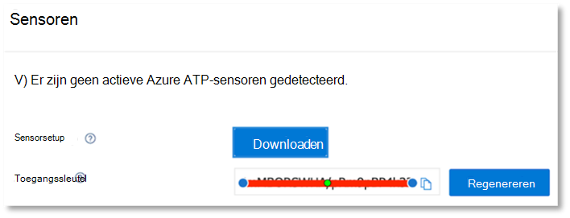  
 
9. Kopieer de toegangssleutel naar de wizard en klik op **Installeren**. 
 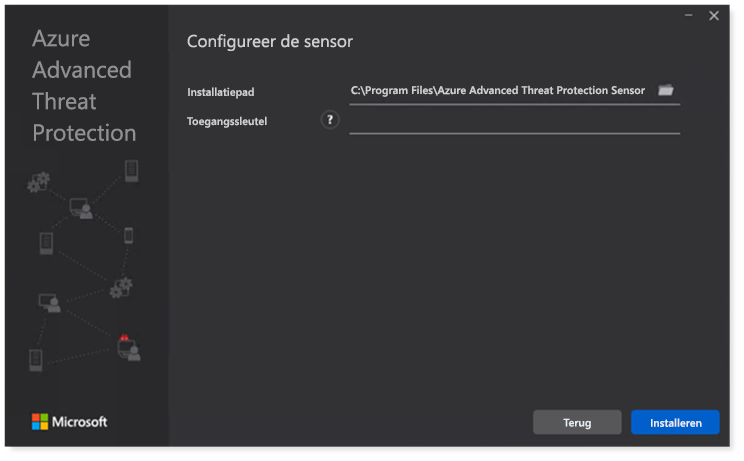  

10. Gefeliciteerd, u hebt Azure Advanced Threat Protection geconfigureerd op uw domeincontroller.
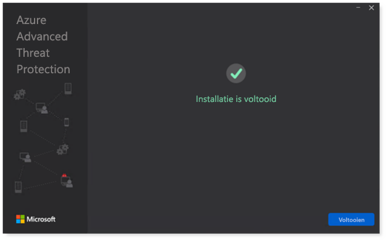  
 
11. Selecteer windows **defender ATP**in de sectie Azure Azure [Azure ATP](https://go.microsoft.com/fwlink/?linkid=2040449) en schakel de schakelaar in. Klik op **Opslaan**. 
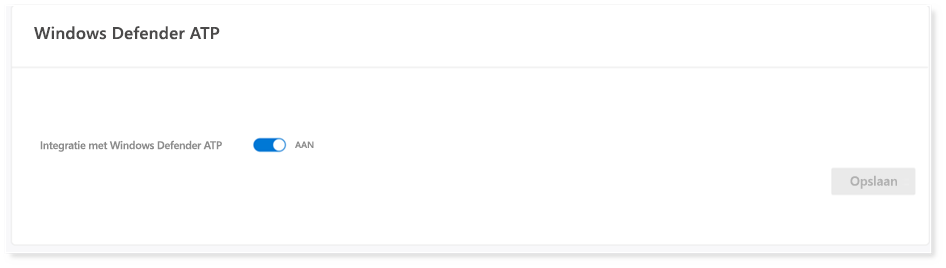  

>[!NOTE]
>Windows Defender ATP is omgedoopt tot Microsoft Defender ATP. Rebranding veranderingen in al onze portals worden uitgerold voor consistentie.

## Beveiliging van Microsoft Cloud-apps configureren
>[!NOTE]
>Sla deze stap over als u Microsoft Cloud App Security al hebt ingeschakeld. 

1. Navigeer naar [Microsoft 365 Security Center](https://security.microsoft.com/info) > **Meer resources** > **Microsoft Cloud App Security**.
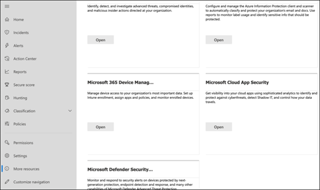  

2. Selecteer **Azure ATP-gegevensintegratie inschakelen**bij de informatieprompt om Azure ATP te integreren. 
 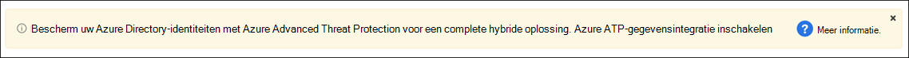  

>[!NOTE]
>Als u deze prompt niet ziet, kan dit betekenen dat uw Azure ATP-gegevensintegratie al is ingeschakeld. Als u het echter niet zeker weet, neemt u contact op met uw IT-beheerder om dit te bevestigen. 

3. Ga naar **Instellingen,** schakel de inschakelactie op **Azure ATP-integratie** in en klik op **Opslaan**. 
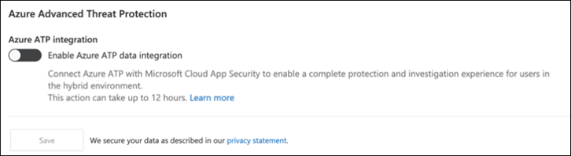  
>[!NOTE]
>Voor nieuwe Azure ATP-exemplaren wordt deze integratie-schakelaar automatisch ingeschakeld. Controleer of uw Azure ATP-integratie is ingeschakeld voordat u doorgaat met de volgende stap.
 
4. Selecteer onder de instellingen voor detectie van de cloud de OPTIE **Microsoft Defender ATP-integratie**en schakel vervolgens de integratie in. Klik op **Opslaan**.
  

5. Selecteer onder Instellingen voor detectie van de cloud de optie **Gebruikersverrijking**en schakel vervolgens de integratie met Azure Active Directory in.
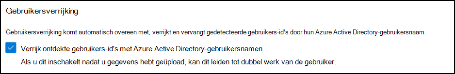  

## Geavanceerde bedreigingsbeveiliging van Microsoft Defender configureren
>[!NOTE]
>Sla deze stap over als u Microsoft Defender Advanced Threat Protection al hebt ingeschakeld.

1. Navigeer naar [Microsoft 365 Security Center](https://security.microsoft.com/info) > **Meer bronnen** > **Microsoft Defender Security Center**. Klik **op Openen**.
   
 
2. Volg de wizard Geavanceerde bedreigingsbeveiliging van Microsoft Defender. Klik op **Volgende**. 
   

3. Kies op basis van de locatie voor gegevensopslag, het beleid voor gegevensbehoud, de grootte van de organisatie en de opt-in voor preview-functies. 
   
>[!NOTE]
>U sommige instellingen, zoals de locatie voor gegevensopslag, niet achteraf wijzigen. 
 

Klik op **Volgende**. 

4. Klik **op Doorgaan** en informeer uw Microsoft Defender ATP-tenant.
   

5. Je eindpunten aan boord via Groepsbeleid, Microsoft Endpoint Manager of door een lokaal script uit te voeren naar Microsoft Defender ATP. Voor de eenvoud maakt deze gids gebruik van het lokale script.

6. Klik **op Pakket downloaden** en kopieer het onboardingscript naar uw eindpunt(en).  
   

7. Voer op uw eindpunt het onboarding-script uit als beheerder en kies Y.
   

8. Gefeliciteerd, je hebt je eerste eindpunt aan boord.  
 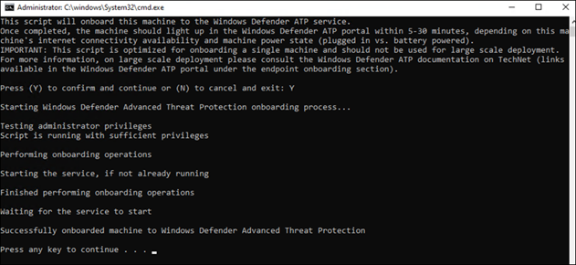  

9. Kopieer de detectietest vanuit de wizard Microsoft Defender ATP.
   

10. Kopieer het PowerShell-script naar een opdrachtprompt met verhoogde bevoegdheid en voer het uit. 
   

11. Selecteer **Microsoft Defender ATP gebruiken** in de wizard.
 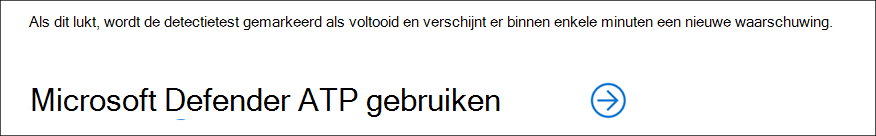  
 
12. Ga naar het [Microsoft Defender Security Center](https://securitycenter.windows.com/). Ga naar **Instellingen** en selecteer **Geavanceerde functies**. 
 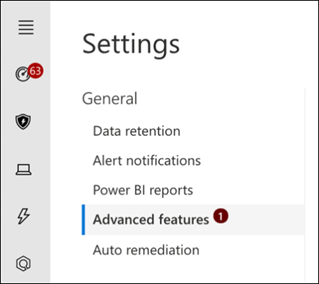  

13. Schakel de integratie met **Azure Advanced Threat Protection**in.  
 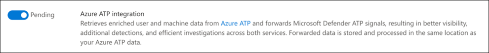  

14. Schakel de integratie met **Office 365 Threat Intelligence in.**
 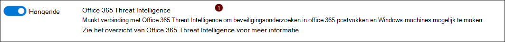  

15. Integratie met **Microsoft Cloud App Security**inschakelen.
   

16. Schuif omlaag en klik op **Voorkeuren opslaan** om de nieuwe integraties te bevestigen.
   

## Volgende stappen
[Schakel Microsoft Threat Protection in](https://docs.microsoft.com/microsoft-365/security/mtp/mtp-enable?view=o365-worldwide#start-using-the-service) en [genereer vervolgens een testwaarschuwing.](generate-test-alert.md)
