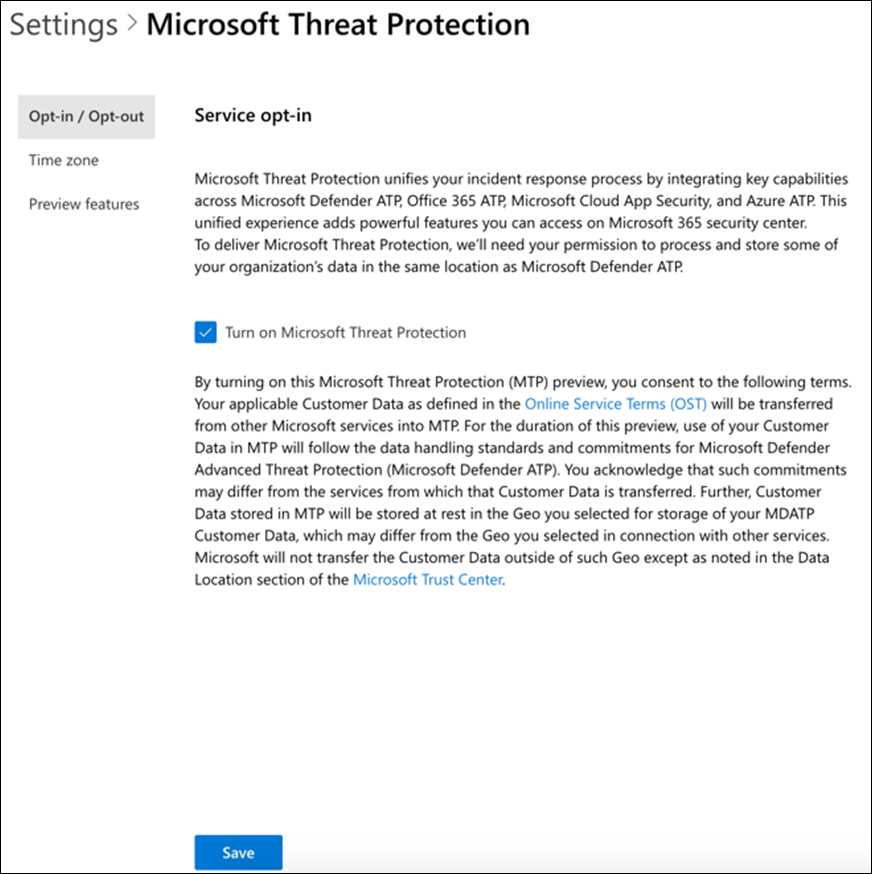

# Microsoft Threat Protection-pijlers configureren voor uw proeflabomgevingConfigure Microsoft Threat Protection pillars for your trial lab environment

**Geldt voor:****Applies to:**
- Microsoft Threat ProtectionMicrosoft Threat Protection

Het maken van een Microsoft Threat Protection trial lab omgeving en het implementeren ervan is een proces in drie fasen:Creating a Microsoft Threat Protection trial lab environment and deploying it is a three-phase process:

 
<table border="0" width="100%" align="center">
  <tr style="text-align:center;">
    <td align="center" style="width:25%; border:0;" >
      <a href= "https://docs.microsoft.com/microsoft-365/security/mtp/prepare-mtpeval?view=o365-worldwide"> 
        
       Fase 1: Voorbereiden</a>Phase 1: Prepare </a> 
    </td>
     <td align="center">
      <a href="https://docs.microsoft.com/microsoft-365/security/mtp/setup-mtpeval?view=o365-worldwide">
        
       Fase 2: Setup</a>Phase 2: Setup </a> 
    </td>
    <td align="center" bgcolor="#d5f5e3">
      <a href="https://docs.microsoft.com/microsoft-365/security/mtp/config-mtpeval?view=o365-worldwide">
        
       Fase 3: & configureren</a>Phase 3: Configure & Onboard </a> 
</td>

  </tr>
</table>

U bevindt zich momenteel in de configuratiefase.You are currently in the configuration phase.

Voorbereiding is de sleutel tot een succesvolle implementatie.Preparation is key to any successful deployment. In dit artikel wordt u begeleid op de punten die u moet overwegen bij de voorbereiding van de implementatie van Microsoft Defender ATP.In this article, you'll be guided on the points you'll need to consider as you prepare to deploy Microsoft Defender ATP.

## Pijlers van Microsoft Threat ProtectionMicrosoft Threat Protection pillars
Microsoft Threat Protection bestaat uit vier pijlers.Microsoft Threat Protection consists of four pillars. Hoewel één pijler al waarde kan bieden aan de beveiliging van uw netwerkorganisatie, geeft het inschakelen van de vier pijlers van Microsoft Threat Protection uw organisatie de meeste waarde.Although one pillar can already provide value to your network organization's security, enabling the four Microsoft Threat Protection pillars will give your organization the most value.

![Image of_Microsoft Threat Protection-oplossing voor gebruikers, Azure Advanced Threat Protection, voor eindpunten Microsoft Defender Advanced Threat Protection, voor cloud-apps, Microsoft Cloud App Security en voor gegevens, Office 365 Advanced Threat ProtectionImage of_Microsoft Threat Protection solution for users, Azure Advanced Threat Protection, for endpoints Microsoft Defender Advanced Threat Protection, for cloud apps, Microsoft Cloud App Security, and for data, Office 365 Advanced Threat Protection  ](../../media/mtp-eval-31.png)  

In deze sectie u het volgende configureren:This section will guide you to configure:
-   Office 365 Advanced Threat ProtectionOffice 365 Advanced Threat Protection
-   Azure Advanced Threat ProtectionAzure Advanced Threat Protection 
-   Microsoft Cloud App SecurityMicrosoft Cloud App Security
-   Microsoft Defender Advanced Threat ProtectionMicrosoft Defender Advanced Threat Protection

## Geavanceerde bedreigingsbeveiliging van Office 365 configurerenConfigure Office 365 Advanced Threat Protection
>[!NOTE]
>Sla deze stap over als u Office 365 Advanced Threat Protection al hebt ingeschakeld.Skip this step if you have already enabled Office 365 Advanced Threat Protection. 

Er is een PowerShell-module genaamd de *Office 365 Advanced Threat Protection Recommended Configuration Analyzer (ORCA)* die helpt bij het bepalen van een aantal van deze instellingen.There is a PowerShell Module called the *Office 365 Advanced Threat Protection Recommended Configuration Analyzer (ORCA)* that helps determine some of these settings. Wanneer u wordt uitgevoerd als beheerder in uw tenant, helpt get-ORCAReport bij het genereren van een beoordeling van de anti-spam-, anti-phish- en andere instellingen voor berichthygiëne.When run as an administrator in your tenant, get-ORCAReport will help generate an assessment of the anti-spam, anti-phish, and other message hygiene settings. U deze module downloaden van https://www.powershellgallery.com/packages/ORCA/ .You can download this module from https://www.powershellgallery.com/packages/ORCA/. 

1. Navigeer naar [office 365-beveiliging &](https://protection.office.com/homepage)  >  **het threat**  >  **managementbeleid**van het Compliance Center .Navigate to [Office 365 Security & Compliance Center](https://protection.office.com/homepage) > **Threat management** > **Policy**.
  
 
2. Klik op **ATP anti-phishing**, selecteer **Maken** en vul de beleidsnaam en beschrijving in.Click **ATP anti-phishing**, select **Create** and fill in the policy name and description. Klik op **Volgende**.Click **Next**.
  

>[!NOTE]
>Bewerk uw Advanced ATP anti-phishing beleid.Edit your Advanced ATP anti-phishing policy. **Geavanceerde phishingdrempel wijzigen** in 2 - **Agressief**.Change **Advanced Phishing Threshold** to **2 - Aggressive**.
 

3. Klik **op** de vervolgkeuzelijst Een voorwaarde toevoegen en selecteer uw domein(en) als geadresseerddomein.Click the **Add a condition** drop-down menu and select your domain(s) as recipient domain. Klik op **Volgende**.Click **Next**.
  
 
4. Bekijk uw instellingen.Review your settings. Klik **op Dit beleid maken** om dit te bevestigen.Click **Create this policy** to confirm. 
  
 
5. Selecteer **ATP Safe-bijlagen** en selecteer de optie **ATP inschakelen voor SharePoint, OneDrive en Microsoft Teams.**Select **ATP Safe attachments** and select the **Turn on ATP for SharePoint, OneDrive, and Microsoft Teams** option.  
  

6. Klik op het +-pictogram om een nieuw beleid voor veilige bijlagen te maken en pas het toe als ontvangerdomein op uw domeinen.Click the + icon to create a new safe attachment policy, apply it as recipient domain to your domains. Klik op **Opslaan**.Click **Save**.
  
 
7. Selecteer vervolgens het beleid **voor veilige koppelingen van ATP** en klik vervolgens op het potloodpictogram om het standaardbeleid te bewerken.Next, select the **ATP Safe Links** policy, then click the pencil icon to edit the default policy.

8. Zorg ervoor dat de optie **Niet volgen wanneer gebruikers op veilige koppelingen klikken** niet is geselecteerd, terwijl de rest van de opties is geselecteerd.Make sure that the **Do not track when users click safe links** option is not selected, while the rest of the options are selected. Zie [Instellingen voor veilige koppelingen](https://docs.microsoft.com/microsoft-365/security/office-365-security/recommended-settings-for-eop-and-office365-atp?view=o365-worldwide) voor meer informatie.See [Safe Links settings](https://docs.microsoft.com/microsoft-365/security/office-365-security/recommended-settings-for-eop-and-office365-atp?view=o365-worldwide) for details. Klik op **Opslaan**.Click **Save**. 
  

9. Selecteer vervolgens het **beleid voor malwarebestrijding,** selecteer de standaardinstelling en kies het potloodpictogram.Next select the **Anti-malware** policy, select the default, and choose the pencil icon.

10. Klik **op Instellingen** en selecteer Ja en gebruik de **standaardmeldingstekst** om **reactie op malwaredetectie**in te schakelen.Click **Settings** and select **Yes and use the default notification text** to enable **Malware Detection Response**. Schakel het **filter voor algemene bijlagetypen** in.Turn the **Common Attachment Types Filter** on. Klik op **Opslaan**.Click **Save**.
   
  
11. Navigeer naar [Office 365 Security & Compliance Center](https://protection.office.com/homepage)  >  **Search**Audit  >  **Log search** en schakel Controle in.Navigate to [Office 365 Security & Compliance Center](https://protection.office.com/homepage) > **Search** > **Audit log search** and turn Auditing on.  
  

12. Integreer Office 365 ATP met Microsoft Defender ATP.Integrate Office 365 ATP with Microsoft Defender ATP. Navigeer naar [Office 365 Security & Compliance Center](https://protection.office.com/homepage)Threat  >  **management**  >  **Explorer** en selecteer **WDATP-instellingen** in de rechterbovenhoek van het scherm.Navigate to [Office 365 Security & Compliance Center](https://protection.office.com/homepage) > **Threat management** > **Explorer** and select **WDATP Settings** on the upper right corner of the screen. Schakel in het dialoogvenster Microsoft Defender ATP-verbinding **Verbinding maken met Windows ATP**in.In the Microsoft Defender ATP connection dialog box, turn on **Connect to Windows ATP**.
  

## Azure Advanced Threat Protection configurerenConfigure Azure Advanced Threat Protection
>[!NOTE]
>Deze stap overslaan als u Azure Advanced Threat Protection al hebt ingeschakeldSkip this step if you have already enabled Azure Advanced Threat Protection

1. Navigeer naar [Microsoft 365 Security Center](https://security.microsoft.com/info) > selecteer Meer **bronnen**Azure Advanced  >  **Threat Protection**.Navigate to [Microsoft 365 Security Center](https://security.microsoft.com/info) > select **More Resources** > **Azure Advanced Threat Protection**.
  

2. Klik **op Maken** om de wizard Azure Advanced Threat Protection te starten.Click **Create** to start the Azure Advanced Threat Protection wizard. 
   

3. Kies **Een gebruikersnaam en wachtwoord opgeven om verbinding te maken met uw Active Directory-forest.**Choose **Provide a username and password to connect to your Active Directory forest**.  
  

4. Voer uw on-premises active directory-referenties in.Enter your Active Directory on-premises credentials. Dit kan elk gebruikersaccount zijn dat leestoegang heeft tot Active Directory.This can be any user account that has read access to Active Directory.
  

5. Kies vervolgens **Sensorsetup downloaden** en het bestand overbrengen naar uw domeincontroller.Next, choose **Download Sensor Setup** and transfer file to your domain controller. 
  

6. Voer de Azure ATP-sensorsetup uit en begin met het volgen van de wizard.Execute the Azure ATP Sensor Setup and begin following the wizard.
   
 
7. Klik op **Volgende** bij het type sensorimplementatie.Click **Next** at the sensor deployment type.
   
 
8. Kopieer de toegangssleutel zoals u deze vervolgens in de wizard moet invoeren.Copy the access key as you will need to enter it next in the Wizard.
  
 
9. Kopieer de toegangssleutel naar de wizard en klik op **Installeren**.Copy the access key into the Wizard and click **Install**. 
   

10. Gefeliciteerd, u hebt Azure Advanced Threat Protection geconfigureerd op uw domeincontroller.Congratulations, you have successfully configured Azure Advanced Threat Protection on your domain controller.
  
 
11. Selecteer windows **defender ATP**in de sectie Azure Azure [Azure ATP](https://go.microsoft.com/fwlink/?linkid=2040449) en schakel de schakelaar in.Under the [Azure Azure ATP](https://go.microsoft.com/fwlink/?linkid=2040449) settings section, select **Windows Defender ATP**, then turn the toggle on. Klik op **Opslaan**.Click **Save**. 
  

>[!NOTE]
>Windows Defender ATP is omgedoopt tot Microsoft Defender ATP.Windows Defender ATP has been rebranded as Microsoft Defender ATP. Rebranding veranderingen in al onze portals worden uitgerold voor consistentie.Rebranding changes across all of our portals are being rolled out the for consistency.

## Beveiliging van Microsoft Cloud-apps configurerenConfigure Microsoft Cloud App Security
>[!NOTE]
>Sla deze stap over als u Microsoft Cloud App Security al hebt ingeschakeld.Skip this step if you have already enabled Microsoft Cloud App Security. 

1. Navigeer naar [Microsoft 365 Security Center](https://security.microsoft.com/info)Meer  >  **resources**Microsoft Cloud  >  **App Security**.Navigate to [Microsoft 365 Security Center](https://security.microsoft.com/info) > **More Resources** > **Microsoft Cloud App Security**.
  

2. Selecteer **Azure ATP-gegevensintegratie inschakelen**bij de informatieprompt om Azure ATP te integreren.At the information prompt to integrate Azure ATP, select **Enable Azure ATP data integration**. 
   

>[!NOTE]
>Als u deze prompt niet ziet, kan dit betekenen dat uw Azure ATP-gegevensintegratie al is ingeschakeld.If you don’t see this prompt, it might mean that your Azure ATP data integration has already been enabled. Als u het echter niet zeker weet, neemt u contact op met uw IT-beheerder om dit te bevestigen.However, if you are not sure, contact your IT Administrator to confirm. 

3. Ga naar **Instellingen,** schakel de inschakelactie op **Azure ATP-integratie** in en klik op **Opslaan**.Go to **Settings**, turn the **Azure ATP integration** toggle on, then click **Save**. 
  
>[!NOTE]
>Voor nieuwe Azure ATP-exemplaren wordt deze integratie-schakelaar automatisch ingeschakeld.For new Azure ATP instances, this integration toggle is automatically turned on. Controleer of uw Azure ATP-integratie is ingeschakeld voordat u doorgaat met de volgende stap.Confirm that your Azure ATP integration has been enabled before you proceed to the next step.
 
4. Selecteer onder de instellingen voor detectie van de cloud de OPTIE **Microsoft Defender ATP-integratie**en schakel vervolgens de integratie in.Under the Cloud discovery settings, select **Microsoft Defender ATP integration**, then enable the integration. Klik op **Opslaan**.Click **Save**.
Click save.](../../media/mtp-eval-56.png)  

5. Selecteer onder Instellingen voor detectie van de cloud de optie **Gebruikersverrijking**en schakel vervolgens de integratie met Azure Active Directory in.Under Cloud discovery settings, select **User enrichment**, then enable the integration with Azure Active Directory.
  

## Geavanceerde bedreigingsbeveiliging van Microsoft Defender configurerenConfigure Microsoft Defender Advanced Threat Protection
>[!NOTE]
>Sla deze stap over als u Microsoft Defender Advanced Threat Protection al hebt ingeschakeld.Skip this step if you have already enabled Microsoft Defender Advanced Threat Protection.

1. Navigeer naar [Microsoft 365 Security Center](https://security.microsoft.com/info)Meer  >  **bronnen**Microsoft Defender  >  **Security Center**.Navigate to [Microsoft 365 Security Center](https://security.microsoft.com/info) > **More Resources** > **Microsoft Defender Security Center**. Klik **op Openen**.Click **Open**.
   
 
2. Volg de wizard Geavanceerde bedreigingsbeveiliging van Microsoft Defender.Follow the Microsoft Defender Advanced Threat Protection wizard. Klik op **Volgende**.Click **Next**. 
   

3. Kies op basis van de locatie voor gegevensopslag, het beleid voor gegevensbehoud, de grootte van de organisatie en de opt-in voor preview-functies.Choose based on your preferred data storage location, data retention policy, organization size, and opt-in for preview features. 
 Click next when you're done selecting.](../../media/mtp-eval-60.png)  
>[!NOTE]
>U sommige instellingen, zoals de locatie voor gegevensopslag, niet achteraf wijzigen.You cannot change some of the settings, like data storage location, afterwards. 
 

Klik op **Volgende**.Click **Next**. 

4. Klik **op Doorgaan** en informeer uw Microsoft Defender ATP-tenant.Click **Continue** and it will provision your Microsoft Defender ATP tenant.
   

5. Je eindpunten aan boord via Groepsbeleid, Microsoft Endpoint Manager of door een lokaal script uit te voeren naar Microsoft Defender ATP.Onboard your endpoints through Group Policies, Microsoft Endpoint Manager or by running a local script to Microsoft Defender ATP. Voor de eenvoud maakt deze gids gebruik van het lokale script.For simplicity, this guide uses the local script.

6. Klik **op Pakket downloaden** en kopieer het onboardingscript naar uw eindpunt(en).Click **Download package** and copy the onboarding script to your endpoint(s).  
   

7. Voer op uw eindpunt het onboarding-script uit als beheerder en kies Y.On your endpoint, run the onboarding script as Administrator and choose Y.
   

8. Gefeliciteerd, je hebt je eerste eindpunt aan boord.Congratulations, you have onboarded your first endpoint.  
   

9. Kopieer de detectietest vanuit de wizard Microsoft Defender ATP.Copy-paste the detection test from the Microsoft Defender ATP wizard.
   

10. Kopieer het PowerShell-script naar een opdrachtprompt met verhoogde bevoegdheid en voer het uit.Copy the PowerShell script to an elevated command prompt and run it. 
   

11. Selecteer **Microsoft Defender ATP gebruiken** in de wizard.Select **Start using Microsoft Defender ATP** from the Wizard.
   
 
12. Ga naar het [Microsoft Defender Security Center](https://securitycenter.windows.com/).Visit the [Microsoft Defender Security Center](https://securitycenter.windows.com/). Ga naar **Instellingen** en selecteer **Geavanceerde functies**.Go to **Settings** and then select **Advanced features**. 
   

13. Schakel de integratie met **Azure Advanced Threat Protection**in.Turn on the integration with **Azure Advanced Threat Protection**.  
   

14. Schakel de integratie met **Office 365 Threat Intelligence in.**Turn on the integration with **Office 365 Threat Intelligence**.
   

15. Integratie met **Microsoft Cloud App Security**inschakelen.Turn on integration with **Microsoft Cloud App Security**.
   

16. Schuif omlaag en klik op **Voorkeuren opslaan** om de nieuwe integraties te bevestigen.Scroll down and click **Save preferences** to confirm the new integrations.
   

## Microsoft Threat Protection inschakelenTurn on Microsoft Threat Protection
1. Ga naar [Microsoft 365 Security Center](https://security.microsoft.com/homepage).Go to [Microsoft 365 Security Center](https://security.microsoft.com/homepage). Navigeer naar **Instellingen** en selecteer **Microsoft Bedreigingsbeveiliging**.Navigate to **Settings** and then select **Microsoft Threat Protection**.
   

2. Schakel het selectievakje **Microsoft Bedreigingsbeveiliging inschakelen in** en klik op **Opslaan**.Select the **Turn on Microsoft Threat Protection** checkbox, then click **Save**.
   

Gefeliciteerd!Congratulations! U hebt zojuist uw Microsoft Threat Protection trial lab-omgeving gemaakt!You've just created your Microsoft Threat Protection trial lab environment! U nu een aanval simuleren en zien hoe de cross-productmogelijkheden detecteren, waarschuwingen maken en automatisch reageren op een bestandsloze aanval op een eindpunt.You can now simulate an attack and see how the cross product capabilities detect, create alerts, and automatically respond to a fileless attack on an endpoint.

## Volgende stappenNext steps
[Een testwaarschuwing genereren](generate-test-alert.md).[Generate a test alert](generate-test-alert.md).
