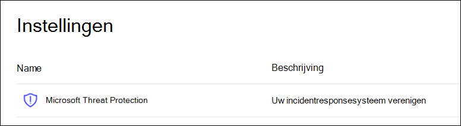

# Microsoft Threat Protection-pijlers configureren voor uw proefversie of pilot omgevingConfigure Microsoft Threat Protection pillars for your trial lab or pilot environment

**Van toepassing op:****Applies to:**
- Microsoft Threat ProtectionMicrosoft Threat Protection

U maakt een Microsoft Threat Protection-proefversie voor proef omgevingen of pilot omgevingen en de implementatie hiervan is een proces van drie fasen:Creating a Microsoft Threat Protection trial lab or pilot environment and deploying it is a three-phase process:

 
<table border="0" width="100%" align="center">
  <tr style="text-align:center;">
    <td align="center" style="width:25%; border:0;" >
      <a href= "https://docs.microsoft.com/microsoft-365/security/mtp/prepare-mtpeval?view=o365-worldwide"> 
        
       Fase 1: voorbereiding </a>Phase 1: Prepare </a> 
    </td>
     <td align="center">
      <a href="https://docs.microsoft.com/microsoft-365/security/mtp/setup-mtpeval?view=o365-worldwide">
        
       Fase 2: instellen </a>Phase 2: Setup </a> 
    </td>
    <td align="center" bgcolor="#d5f5e3">
      <a href="https://docs.microsoft.com/microsoft-365/security/mtp/config-mtpeval?view=o365-worldwide">
        
       Fase 3: & onboard configureren </a>Phase 3: Configure & Onboard </a> 
</td>

  </tr>
</table>

U bevindt zich momenteel in de configuratiefase.You're currently in the configuration phase.

De voorbereiding is essentieel voor een succesvolle implementatie.Preparation is key to any successful deployment. In dit artikel wordt u begeleid over de punten die u in overweging moet nemen wanneer u de implementatie van Microsoft Defender ATP gaat voorbereiden.In this article, you'll be guided on the points you'll need to consider as you prepare to deploy Microsoft Defender ATP.

## Microsoft Threat Protection-pijlersMicrosoft Threat Protection pillars
Microsoft Threat Protection bestaat uit vier pijlers.Microsoft Threat Protection consists of four pillars. Hoewel u met de vier Microsoft Threat Protection-gebruikers al een waarde kunt opgeven voor de veiligheid van uw netwerkorganisatie, kunt u de meeste waarden opgeven voor de vier Microsoft Threat Protection-pijler.Although one pillar can already provide value to your network organization's security, enabling the four Microsoft Threat Protection pillars will give your organization the most value.

![Afbeelding of_Microsoft oplossing voor beveiliging van bedreigingen voor gebruikers, Azure Advanced Threat Protection voor eindpunten van Microsoft Defender Advanced Threat Protection, voor Cloud-apps, Microsoft Cloud app Security en voor gegevens, Office 365 Advanced Threat ProtectionImage of_Microsoft Threat Protection solution for users, Azure Advanced Threat Protection, for endpoints Microsoft Defender Advanced Threat Protection, for cloud apps, Microsoft Cloud App Security, and for data, Office 365 Advanced Threat Protection  ](../../media/mtp-eval-31.png)  

In deze sectie wordt u begeleid bij de configuratie:This section will guide you to configure:
-   Office 365 Advanced Threat ProtectionOffice 365 Advanced Threat Protection
-   Azure Advanced Threat ProtectionAzure Advanced Threat Protection 
-   Microsoft Cloud App SecurityMicrosoft Cloud App Security
-   Microsoft Defender Advanced Threat ProtectionMicrosoft Defender Advanced Threat Protection

## Office 365 Advanced Threat Protection configurerenConfigure Office 365 Advanced Threat Protection
>[!NOTE]
>Sla deze stap over als u Office 365 Advanced Threat Protection al hebt ingeschakeld.Skip this step if you've already enabled Office 365 Advanced Threat Protection. 

Er is een PowerShell-module genaamd *Office 365 Advanced Threat Protection recommended configuration Analyzer (Orca)* waarmee enkele van deze instellingen kunnen worden vastgesteld.There's a PowerShell Module called the *Office 365 Advanced Threat Protection Recommended Configuration Analyzer (ORCA)* that helps determine some of these settings. Als u een beheerder van de Tenant uitvoert, kunt u met Get-ORCAReport een beoordeling maken van de antispam, anti-spam en andere instellingen voor bericht hygiëne.When run as an administrator in your tenant, get-ORCAReport will help generate an assessment of the anti-spam, anti-phish, and other message hygiene settings. U kunt deze module downloaden van https://www.powershellgallery.com/packages/ORCA/ .You can download this module from https://www.powershellgallery.com/packages/ORCA/. 

1. Ga naar de [beveiligings & beleid voor nalevings centrum van Office 365](https://protection.office.com/homepage)  >  **Threat management**  >  **Policy**.Navigate to [Office 365 Security & Compliance Center](https://protection.office.com/homepage) > **Threat management** > **Policy**.
  
 
2. Klik op **ATP anti-phishing**, selecteer **maken** en vul de Beleidsnaam en-beschrijving in.Click **ATP anti-phishing**, select **Create** and fill in the policy name and description. Klik op **Volgende**.Click **Next**.
  

>[!NOTE]
>Uw Advanced ATP anti phishingfilter-beleid bewerken.Edit your Advanced ATP anti-phishing policy. Wijzig de **Geavanceerde fraude drempel** in **2-agressief**.Change **Advanced Phishing Threshold** to **2 - Aggressive**.
 

3. Klik op het vervolgkeuzemenu **een voorwaarde toevoegen** en selecteer uw domein (en) als domein van de ontvanger.Click the **Add a condition** drop-down menu and select your domain(s) as recipient domain. Klik op **Volgende**.Click **Next**.
  
 
4. Controleer uw instellingen.Review your settings. Klik op **dit beleid maken** om te bevestigen.Click **Create this policy** to confirm. 
  
 
5. Selecteer **veilige ATP-bijlagen** en schakel de optie **ATP voor SharePoint, OneDrive en Microsoft teams inschakelen in** .Select **ATP Safe attachments** and select the **Turn on ATP for SharePoint, OneDrive, and Microsoft Teams** option.  
  

6. Klik op het pictogram + om een nieuw beleid voor veilige bijlagen te maken, wanneer u dit wilt toepassen als het domein van de geadresseerde voor uw domeinen.Click the + icon to create a new safe attachment policy, apply it as recipient domain to your domains. Klik op **Opslaan**.Click **Save**.
  
 
7. Vervolgens selecteert u het beleid voor **veilige koppelingen voor vrije verbindingen** en klikt u op het potloodpictogram om het standaardbeleid te bewerken.Next, select the **ATP Safe Links** policy, then click the pencil icon to edit the default policy.

8. Zorg ervoor dat de optie **niet bijhouden wanneer gebruikers op optie voor veilige koppelingen klikken** niet is geselecteerd, terwijl de andere opties zijn geselecteerd.Make sure that the **Do not track when users click safe links** option is not selected, while the rest of the options are selected. Zie [instellingen voor veilige koppelingen](https://docs.microsoft.com/microsoft-365/security/office-365-security/recommended-settings-for-eop-and-office365-atp) voor meer informatie.See [Safe Links settings](https://docs.microsoft.com/microsoft-365/security/office-365-security/recommended-settings-for-eop-and-office365-atp) for details. Klik op **Opslaan**.Click **Save**. 
  

9. Selecteer vervolgens het **anti-malwarebeleid** , selecteer het standaardbeleid en kies het potloodpictogram.Next select the **Anti-malware** policy, select the default, and choose the pencil icon.

10. Klik op **instellingen** en selecteer **Ja en gebruik de standaard Meldingstekst om het** detecteren van **malware**te activeren.Click **Settings** and select **Yes and use the default notification text** to enable **Malware Detection Response**. Schakel het **filter common Attachment types** in.Turn the **Common Attachment Types Filter** on. Klik op **Opslaan**.Click **Save**.
   
  
11. Ga naar het [Office 365-beveiligings & compliance](https://protection.office.com/homepage)  >  **Search**  >  **audit log Search** en Schakel controle in.Navigate to [Office 365 Security & Compliance Center](https://protection.office.com/homepage) > **Search** > **Audit log search** and turn Auditing on.  
  

12. Integreer Office 365 ATP met Microsoft Defender ATP.Integrate Office 365 ATP with Microsoft Defender ATP. Ga naar de [beveiligings & van het compliance-Beheercentrum van Office 365](https://protection.office.com/homepage)  >  **Threat management**  >  **Explorer** en selecteer **WDATP instellingen** in de rechterbovenhoek van het scherm.Navigate to [Office 365 Security & Compliance Center](https://protection.office.com/homepage) > **Threat management** > **Explorer** and select **WDATP Settings** on the upper right corner of the screen. Schakel in het dialoogvenster verbinding met Microsoft Defender ATP de optie **verbinding maken met Windows ATP**in.In the Microsoft Defender ATP connection dialog box, turn on **Connect to Windows ATP**.
  

## Azure Advanced Threat Protection configurerenConfigure Azure Advanced Threat Protection
>[!NOTE]
>Sla deze stap over als u Azure Advanced Threat Protection al hebt ingeschakeldSkip this step if you've already enabled Azure Advanced Threat Protection

1. Ga naar [Microsoft 365 Beveiligingscentrum](https://security.microsoft.com/info) > Selecteer **meer bronnen**  >  **Azure Advanced Threat Protection**.Navigate to [Microsoft 365 Security Center](https://security.microsoft.com/info) > select **More Resources** > **Azure Advanced Threat Protection**.
  

2. Klik op **maken** om de wizard van Azure Advanced Threat Protection te starten.Click **Create** to start the Azure Advanced Threat Protection wizard. 
   

3. Kies **een gebruikersnaam en wachtwoord opgeven om verbinding te maken met uw Active Directory-forest**.Choose **Provide a username and password to connect to your Active Directory forest**.  
  

4. Voer uw on-premises Active Directory-referenties in.Enter your Active Directory on-premises credentials. Dit kan elk gebruikersaccount zijn met leestoegang tot Active Directory.This can be any user account that has read access to Active Directory.
  

5. Kies vervolgens **Update sensoren** en zet bestand over naar uw domeincontroller.Next, choose **Download Sensor Setup** and transfer file to your domain controller. 
  

6. Voer de installatie van de Azure ATP-sensor uit en voer de wizard uit.Execute the Azure ATP Sensor Setup and begin following the wizard.
   
 
7. Klik op **volgende** bij het implementatietype van de sensor.Click **Next** at the sensor deployment type.
   
 
8. Kopieer de toegangscode omdat u deze moet typen, naast de wizard.Copy the access key because you need to enter it next in the Wizard.
  
 
9. Kopieer de toegangstoets in de wizard en klik op **installeren**.Copy the access key into the Wizard and click **Install**. 
   

10. Gefeliciteerd, u hebt Azure Advanced Threat Protection geconfigureerd op uw domeincontroller.Congratulations, you've successfully configured Azure Advanced Threat Protection on your domain controller.
  
 
11. Selecteer in de sectie instellingen van [Azure Azure ATP](https://go.microsoft.com/fwlink/?linkid=2040449) de optie **Windows Defender ATP**en zet vervolgens de wisselknop.Under the [Azure Azure ATP](https://go.microsoft.com/fwlink/?linkid=2040449) settings section, select **Windows Defender ATP**, then turn on the toggle. Klik op **Opslaan**.Click **Save**. 
  

>[!NOTE]
>Windows Defender ATP is opnieuw aangemerkt als Microsoft Defender ATP.Windows Defender ATP has been rebranded as Microsoft Defender ATP. Wijzigingen die u in alle portals aanbrengt, worden doorgevoerd in de consistentie.Rebranding changes across all of our portals are being rolled out the for consistency.

## Beveiligingsupdates voor Microsoft Cloud app configurerenConfigure Microsoft Cloud App Security
>[!NOTE]
>Sla deze stap over als u de beveiligingsversie van de Microsoft Cloud-app al hebt ingeschakeld.Skip this step if you've already enabled Microsoft Cloud App Security. 

1. Ga naar het [Microsoft 365-Beveiligingscentrum](https://security.microsoft.com/info)voor  >  **meer informatie**over beveiliging van de  >  **Microsoft Cloud-app**.Navigate to [Microsoft 365 Security Center](https://security.microsoft.com/info) > **More Resources** > **Microsoft Cloud App Security**.
  

2. Als u de informatie wilt hebben over het integreren van Azure ATP, selecteert u **Azure ATP Data Integration inschakelen**.At the information prompt to integrate Azure ATP, select **Enable Azure ATP data integration**. 
   

>[!NOTE]
>Als u deze vraag niet ziet, betekent dit dat uw Azure ATP-gegevensintegratie al is ingeschakeld.If you don’t see this prompt, it might mean that your Azure ATP data integration has already been enabled. Als u dat nog niet weet, neemt u contact op met uw IT-beheerder om te bevestigen.However, if you are not sure, contact your IT Administrator to confirm. 

3. Ga naar **instellingen**, schakel de wisselknop **Azure ATP-integratie** in en klik op **Opslaan**.Go to **Settings**, turn on the **Azure ATP integration** toggle, then click **Save**. 
  
>[!NOTE]
>Voor nieuwe exemplaren van Azure ATP wordt deze schakeloptie voor integratie automatisch ingeschakeld.For new Azure ATP instances, this integration toggle is automatically turned on. Controleer of de Azure ATP-integratie is ingeschakeld voordat u verder gaat met de volgende stap.Confirm that your Azure ATP integration has been enabled before you proceed to the next step.
 
4. Selecteer onder de instellingen voor Cloud detectie de optie **Microsoft Defender ATP-integratie**en schakel vervolgens de integratie in.Under the Cloud discovery settings, select **Microsoft Defender ATP integration**, then enable the integration. Klik op **Opslaan**.Click **Save**.
Click save.](../../media/mtp-eval-56.png)  

5. Selecteer onder instellingen voor Cloud detectie de optie **gebruikers verrijking**en schakel vervolgens integratie met Azure Active Directory in.Under Cloud discovery settings, select **User enrichment**, then enable the integration with Azure Active Directory.
  

## Microsoft Defender Advanced Threat Protection configurerenConfigure Microsoft Defender Advanced Threat Protection
>[!NOTE]
>Sla deze stap over als u Microsoft Defender Advanced Threat Protection al hebt ingeschakeld.Skip this step if you've already enabled Microsoft Defender Advanced Threat Protection.

1. Ga naar het [Microsoft 365-Beveiligingscentrum](https://security.microsoft.com/info)  >  **meer bronnen**  >  **Microsoft Defender-Beveiligingscentrum**.Navigate to [Microsoft 365 Security Center](https://security.microsoft.com/info) > **More Resources** > **Microsoft Defender Security Center**. Klik op **openen**.Click **Open**.
   
 
2. Volg de wizard Microsoft Defender Advanced Threat Protection.Follow the Microsoft Defender Advanced Threat Protection wizard. Klik op **Volgende**.Click **Next**. 
   

3. Kies op basis van de gewenste locatie voor gegevensopslag, het bewaarbeleid voor de gegevens, de organisatie grootte en opt-in voor Voorbeeldfuncties.Choose based on your preferred data storage location, data retention policy, organization size, and opt-in for preview features. 
 Click next when you're done selecting.](../../media/mtp-eval-60.png)  
>[!NOTE]
>U kunt een aantal instellingen, zoals de opslaglocatie van de gegevens, achteraf niet wijzigen.You cannot change some of the settings, like data storage location, afterwards. 
 

Klik op **Volgende**.Click **Next**. 

4. Klik op **Doorgaan** om uw Microsoft Defender ATP-Tenant te richten.Click **Continue** and it will provision your Microsoft Defender ATP tenant.
   

5. Haal uw eindpunten binnen via Groepsbeleid, Microsoft Endpoint Manager of door een lokaal script uit te voeren in Microsoft Defender ATP.Onboard your endpoints through Group Policies, Microsoft Endpoint Manager or by running a local script to Microsoft Defender ATP. Voor de eenvoud wordt in deze handleiding het lokale script gebruikt.For simplicity, this guide uses the local script.

6. Klik op **pakket downloaden** en kopieer het onboarding-script naar uw eindpunt (en).Click **Download package** and copy the onboarding script to your endpoint(s).  
   

7. Voer op het eindpunt het onboarding-script uit als beheerder en kies Y.On your endpoint, run the onboarding script as Administrator and choose Y.
   

8. Gefeliciteerd, u hebt het eerste eindpunt geboardd.Congratulations, you've onboarded your first endpoint.  
   

9. Kopieer-de detectietest wordt in de wizard van Microsoft Defender ATP geplakt.Copy-paste the detection test from the Microsoft Defender ATP wizard.
   

10. Kopieer het PowerShell-script naar een opdrachtprompt met verhoogde bevoegdheid en voer deze opdracht uit.Copy the PowerShell script to an elevated command prompt and run it. 
   

11. Selecteer in de wizard aan de **slag met Microsoft Defender ATP** .Select **Start using Microsoft Defender ATP** from the Wizard.
   
 
12. Ga naar het [Microsoft Defender-Beveiligingscentrum](https://securitycenter.windows.com/).Visit the [Microsoft Defender Security Center](https://securitycenter.windows.com/). Ga naar **instellingen** en selecteer **geavanceerde functies**.Go to **Settings** and then select **Advanced features**. 
   

13. Schakel de integratie met **Azure Advanced Threat Protection**in.Turn on the integration with **Azure Advanced Threat Protection**.  
   

14. Schakel de integratie met **Office 365 Threat Intelligence**in.Turn on the integration with **Office 365 Threat Intelligence**.
   

15. Schakel integratie met **Microsoft Cloud app Security**in.Turn on integration with **Microsoft Cloud App Security**.
   

16. Schuif omlaag en klik op **Voorkeuren opslaan** om de nieuwe integraties te bevestigen.Scroll down and click **Save preferences** to confirm the new integrations.
   

## Microsoft Threat Protection-service startenStart the Microsoft Threat Protection service
>[!NOTE]
>Vanaf 1 juni 2020 maakt Microsoft automatisch functies in Microsoft Threat Protection voor alle in aanmerking komende tenants.Starting June 1, 2020, Microsoft automatically enables Microsoft Threat Protection features for all eligible tenants. Zie het [artikel Microsoft Tech Community](https://techcommunity.microsoft.com/t5/security-privacy-and-compliance/microsoft-threat-protection-will-automatically-turn-on-for/ba-p/1345426) voor meer informatie over licenties.See this [Microsoft Tech Community article on license eligibility](https://techcommunity.microsoft.com/t5/security-privacy-and-compliance/microsoft-threat-protection-will-automatically-turn-on-for/ba-p/1345426) for details. 
 

Ga naar [Microsoft 365 Beveiligingscentrum](https://security.microsoft.com/homepage).Go to [Microsoft 365 Security Center](https://security.microsoft.com/homepage). Ga naar **instellingen** en selecteer vervolgens **Microsoft Threat Protection**.Navigate to **Settings** and then select **Microsoft Threat Protection**.
   

Zie [Microsoft Threat Protection inschakelen](mtp-enable.md)voor uitgebreide informatie.For a more comprehensive guidance, see [Turn on Microsoft Threat Protection](mtp-enable.md). 

Gefeliciteerd!Congratulations! U hebt zojuist een proefabonnement voor Microsoft Threat Protection gemaakt, of pilot omgeving.You've just created your Microsoft Threat Protection trial lab or pilot environment! U kunt nu vertrouwd raken met de gebruikersinterface van Microsoft Threat Protection.Now you can familiarize yourself with the Microsoft Threat Protection user interface! Lees wat u kunt leren en leer hoe u elk dashboard gebruikt voor uw dagelijkse beveiligingsbewerkingen: [Microsoft Threat Protection Interactive Guide](https://aka.ms/MTP-Interactive-Guide).See what you can learn from and know how to use each dashboard for your day-to-day security operation tasks: [Microsoft Threat Protection interactive guide](https://aka.ms/MTP-Interactive-Guide).

Vervolgens kunt u een aanval simuleren en kijken hoe de functies voor cross product detectie, waarschuwingen maken en automatisch reageren op een aanval met een bestand op een eindpunt.Next, you can simulate an attack and see how the cross product capabilities detect, create alerts, and automatically respond to a fileless attack on an endpoint.

## Volgende stappenNext steps
[Genereer een testwaarschuwing](generate-test-alert.md).[Generate a test alert](generate-test-alert.md).
