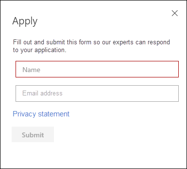

# Microsoft Threat Experts-mogelijkheden configureren en beheren via Microsoft 365 Defender

[!INCLUDE [Microsoft 365 Defender rebranding](../includes/microsoft-defender.md)]

**Van toepassing op:**

- [Microsoft 365 Defender](https://go.microsoft.com/fwlink/?linkid=2118804)
- [Microsoft Defender voor Endpoint](https://go.microsoft.com/fwlink/p/?linkid=2154037)

[!INCLUDE [Prerelease](../includes/prerelease.md)]

## Voordat u begint

> [!IMPORTANT]
> Voordat u van toepassing bent, moet u de geschiktheidsvereisten voor de Microsoft Threat Experts bespreken: Targeted Attack Notifications managed threat hunting service met uw Microsoft Technical Service-provider en accountteam.

Als u gerichte aanvalsmeldingen wilt ontvangen, moet Microsoft 365 Defender zijn geïmplementeerd met apparaten die zijn geregistreerd. Dien vervolgens een toepassing in via de M365-portal voor Microsoft Threat Experts - Targeted Attack Notifications.

Neem contact op met uw accountteam of Microsoft-vertegenwoordiger om u te abonneren op Microsoft Threat Experts - Experts on Demand. Met Experts on Demand kunt u overleggen met onze bedreigingsexperts over hoe u uw organisatie kunt beschermen tegen relevante detecties en tegens.

## Microsoft Threat Experts aanvragen - Service Meldingen van gerichte aanvallen

Als u al Microsoft Defender voor Eindpunt en Microsoft 365 Defender hebt, kunt u Microsoft Threat Experts aanvragen: targeted attack notifications via hun Microsoft 365 Defender-portal.  Met gerichte aanvalsmeldingen krijgt u speciale inzichten en analyses om de meest kritieke bedreigingen voor uw organisatie te identificeren, zodat u er snel op kunt reageren.

1. Ga in het navigatiedeelvenster naar Instellingen > Eindpunten > Algemene > Geavanceerde functies **> Microsoft Threat Experts - Targeted Attack Notifications**.

2. Selecteer **Toepassen.**

    

3. Voer uw naam en e-mailadres in, zodat Microsoft contact met u kan opnemen over uw toepassing.

    

4. Lees de [privacyverklaring](https://privacy.microsoft.com/en-us/privacystatement)en selecteer **Verzenden** wanneer u klaar bent. U ontvangt een welkomst-e-mail zodra uw toepassing is goedgekeurd.

    

5. Nadat u uw welkomstbericht hebt ontvangen, ontvangt u automatisch gerichte meldingen over aanvallen.

6. U kunt uw status verifiëren door naar **Instellingen > eindpunten > Algemene > Geavanceerde functies.** Nadat deze is goedgekeurd, is **de wisselknop Microsoft Threat Experts - Targeted Attack Notification** zichtbaar en ingeschakeld. 

## Waar ziet u de meldingen over gerichte aanvallen van Microsoft Threat Experts

U kunt een gerichte aanvalsmelding ontvangen van Microsoft Threat Experts via de volgende mediums:

- De pagina Incidenten van de Microsoft 365 **Defender-portal**
- Het dashboard Waarschuwingen van de Microsoft 365 **Defender-portal**
- OData alerting [API](https://docs.microsoft.com/windows/security/threat-protection/microsoft-defender-atp/get-alerts) and [REST API](https://docs.microsoft.com/windows/security/threat-protection/microsoft-defender-atp/pull-alerts-using-rest-api)
- [DeviceAlertEvents](https://docs.microsoft.com/windows/security/threat-protection/microsoft-defender-atp/advanced-hunting-devicealertevents-table) table in Advanced hunting
- Uw Postvak IN, als u ervoor kiest om gerichte aanvalsmeldingen per e-mail naar u te laten verzenden. Zie [Hieronder een meldingsregel voor e-mail](#create-an-email-notification-rule) maken.

### Een meldingsregel voor e-mail maken

U kunt regels maken voor het verzenden van e-mailmeldingen voor geadresseerden van meldingen. Zie Waarschuwingsmeldingen  [configureren](https://docs.microsoft.com/windows/security/threat-protection/microsoft-defender-atp/configure-email-notifications) voor het maken, bewerken, verwijderen of oplossen van e-mailmeldingen voor meer informatie.

## Meldingen van gerichte aanvallen weergeven

U ontvangt een gerichte aanvalsmelding van Microsoft Threat Experts in uw e-mail nadat u uw systeem hebt geconfigureerd voor het ontvangen van een e-mailmelding.

1. Selecteer de koppeling in het e-mailbericht om naar de bijbehorende waarschuwingscontext te gaan in het dashboard met **bedreigingsexperts.**

2. Selecteer op **de** pagina Waarschuwingen hetzelfde waarschuwingsonderwerp als het onderwerp dat u in de e-mail hebt ontvangen, om meer informatie weer te geven.

## Abonneren op Microsoft Threat Experts - Experts on Demand

Als u al klant bent van Microsoft Defender voor Eindpunt, kunt u contact opnemen met uw Microsoft-vertegenwoordiger om u te abonneren op Microsoft Threat Experts - Experts on Demand.

## Raadpleeg een Microsoft-bedreigingsexpert over verdachte cyberbeveiligingsactiviteiten in uw organisatie

U kunt contact opnemen met Microsoft Threat Experts vanuit de Microsoft 365 Defender-portal. Experts kunnen u helpen complexe bedreigingen en gerichte aanvalsmeldingen te begrijpen. Werk samen met experts voor meer informatie over waarschuwingen en incidenten, of advies over het afhandelen van compromissen. Krijg inzicht in de context van bedreigingsinformatie die wordt beschreven in uw portaldashboard.

> [!NOTE]
>
> - Waarschuwingsvragen met betrekking tot de aangepaste bedreigingsinformatiegegevens van uw organisatie worden momenteel niet ondersteund. Neem contact op met uw beveiligingsbewerkingen of incidentresponsteam voor meer informatie.
> - U moet de machtiging Beveiligingsinstellingen **beheren hebben in** de Microsoft 365 Defender-portal om een onderzoek in te dienen via het formulier Een **bedreigingsexpert** raadplegen.

1. Ga naar de portalpagina die betrekking heeft op de informatie die u wilt onderzoeken: bijvoorbeeld **Apparaat,** **Waarschuwing** of **Incident.** Zorg ervoor dat de portalpagina met betrekking tot uw onderzoek in beeld is voordat u een onderzoeksaanvraag verzendt.

2. Selecteer in het bovenste menu **? Raadpleeg een bedreigingsexpert.**

    

    Er wordt een flyoutscherm geopend.

    De koptekst geeft aan of u een proefabonnement hebt of een volledig Microsoft Threat Experts - Experts on-Demand-abonnement.

    

    Het **veld Onderwerp** onderzoeken wordt al ingevuld met de koppeling naar de relevante pagina voor uw aanvraag.

3. Geef in het volgende veld voldoende informatie op om de Microsoft Threat Experts voldoende context te geven om het onderzoek te starten.

4. Voer het e-mailadres in dat u wilt gebruiken om te corresponderen met Microsoft Threat Experts.

> [!NOTE]
> Als u de status van uw Experts on Demand-zaken wilt bijhouden via Microsoft Services Hub, kunt u contact op nemen met uw technische accountmanager.

Bekijk deze video voor een kort overzicht van de Microsoft Services Hub.

> [!VIDEO https://www.microsoft.com/videoplayer/embed/RE4pk9f]

## Voorbeeld van onderzoeksonderwerpen

### Waarschuwingsgegevens

- We zagen een nieuw type waarschuwing voor een living-off-the-land binair. We kunnen de waarschuwings-id verstrekken. Kunt u ons meer vertellen over deze waarschuwing en hoe we deze verder kunnen onderzoeken?
- We hebben twee soortgelijke aanvallen waargenomen, die beide kwaadaardige PowerShell-scripts proberen uit te voeren, maar verschillende waarschuwingen genereren. De ene is 'Verdachte PowerShell-opdrachtregel' en het andere is 'Er is een schadelijk bestand gedetecteerd op basis van de indicatie die door O365 is verstrekt'. Wat is het verschil?
- We hebben vandaag een oneven waarschuwing ontvangen over een abnormaal aantal mislukte aanmeldingen vanaf het apparaat van een high profile gebruiker. We kunnen geen verder bewijs vinden voor deze pogingen. Hoe kan Microsoft 365 Defender deze pogingen zien? Welk type aanmelding wordt gecontroleerd?
- Kunt u meer context of inzicht geven in de waarschuwing 'Verdacht gedrag door een systeemprogramma is waargenomen'?
- Ik heb een waarschuwing met de naam 'Creatie van doorsturen/omleidingsregel' waargenomen. Ik geloof dat de activiteit goedaardig is. Kunt u mij vertellen waarom ik een waarschuwing heb ontvangen?

### Mogelijk computercompromitteerd

- Kunt u uitleggen waarom we een bericht of waarschuwing voor 'Onbekend proces waargenomen' zien op veel apparaten in onze organisatie? We waarderen elke input om te verduidelijken of dit bericht of de waarschuwing betrekking heeft op schadelijke activiteiten.
- Kunt u helpen bij het valideren van een mogelijk compromis voor het volgende systeem, dat dateert van vorige week? Het werkt op dezelfde manier als een eerdere detectie van malware op hetzelfde systeem zes maanden geleden.

### Details van bedreigingsinformatie

- We hebben een phishing-e-mail gedetecteerd die een schadelijk Word-document aan een gebruiker heeft bezorgd. Het document veroorzaakte een reeks verdachte gebeurtenissen, waardoor meerdere waarschuwingen voor een bepaalde malwarefamilie werden geactiveerd. Hebt u informatie over deze malware? Zo ja, kunt u ons een koppeling sturen?
- We hebben onlangs een blogbericht gezien over een bedreiging die is gericht op onze branche. Kunt u ons helpen begrijpen welke bescherming Microsoft 365 Defender biedt tegen deze bedreigingsacteur?
- We hebben onlangs een phishingcampagne gezien die is uitgevoerd tegen onze organisatie. Kunt u ons vertellen of dit specifiek is gericht op ons bedrijf of verticaal?

### Waarschuwingscommunicatie van Microsoft Threat Experts

- Kan uw team voor incidentrespons ons helpen bij het adres van de gerichte aanvalmelding die we hebben ontvangen?
- We hebben deze gerichte aanvalsmelding ontvangen van Microsoft Threat Experts. We hebben geen eigen team voor incidentrespons. Wat kunnen we nu doen en hoe kunnen we het incident bevatten?
- We hebben een melding van een gerichte aanval ontvangen van Microsoft Threat Experts. Welke gegevens kunt u ons geven die we kunnen doorgeven aan ons team voor incidentrespons?

> [!NOTE]
> Microsoft Threat Experts is een beheerde service voor het zoeken naar bedreigingen en niet een incidentresponsservice. De experts kunnen het onderzoek echter naadloos overstappen op de services Detection and Response Team (DART) van Microsoft Cyberbeveiliging Solutions Group (CSG) indien nodig. U kunt er ook voor kiezen om contact op te nemen met uw eigen team voor incidentrespons om problemen aan te pakken die een reactie op incidenten vereisen.

## Scenario

### Een voortgangsrapport ontvangen over uw beheerde onderzoek naar de jacht

Het antwoord van Microsoft Threat Experts verschilt afhankelijk van uw vraag. Meestal ontvangt u een van de volgende antwoorden:

- Er is meer informatie nodig om het onderzoek voort te zetten
- Een bestand of meerdere bestandsvoorbeelden zijn nodig om de technische context te bepalen
- Onderzoek heeft meer tijd nodig
- De eerste informatie was voldoende om het onderzoek af te ronden

Als een expert om meer informatie of bestandsvoorbeelden vraagt, is het essentieel om snel te reageren om het onderzoek in beweging te houden.

## Zie ook

- [Overzicht van Microsoft Threat Experts](microsoft-threat-experts.md)
