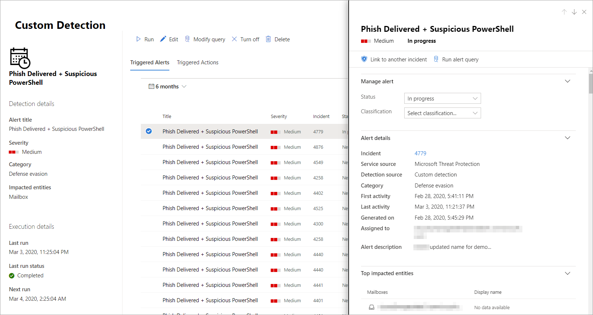

# <a name="create-and-manage-custom-detections-rules"></a><span data-ttu-id="5a198-104">Aangepaste detectieregels maken en beheren</span><span class="sxs-lookup"><span data-stu-id="5a198-104">Create and manage custom detections rules</span></span>

[!INCLUDE [Microsoft 365 Defender rebranding](../includes/microsoft-defender.md)]


<span data-ttu-id="5a198-105">**Van toepassing op:**</span><span class="sxs-lookup"><span data-stu-id="5a198-105">**Applies to:**</span></span>
- <span data-ttu-id="5a198-106">Microsoft 365 Defender</span><span class="sxs-lookup"><span data-stu-id="5a198-106">Microsoft 365 Defender</span></span>

<span data-ttu-id="5a198-107">Aangepaste detectieregels zijn regels die u kunt ontwerpen en aanpassen met geavanceerde zoekquery's. [](advanced-hunting-overview.md)</span><span class="sxs-lookup"><span data-stu-id="5a198-107">Custom detection rules are rules you can design and tweak using [advanced hunting](advanced-hunting-overview.md) queries.</span></span> <span data-ttu-id="5a198-108">Met deze regels kunt u proactief diverse gebeurtenissen en systeemvoorschriften controleren, waaronder verdachte inbreuken en onjuist geconfigureerde eindpunten.</span><span class="sxs-lookup"><span data-stu-id="5a198-108">These rules let you proactively monitor various events and system states, including suspected breach activity and misconfigured endpoints.</span></span> <span data-ttu-id="5a198-109">U kunt instellen dat deze worden uitgevoerd met regelmatige tussenpozen, waarschuwingen genereren en actie ondernemen wanneer er overeenkomsten zijn.</span><span class="sxs-lookup"><span data-stu-id="5a198-109">You can set them to run at regular intervals, generating alerts and taking response actions whenever there are matches.</span></span>

## <a name="required-permissions-for-managing-custom-detections"></a><span data-ttu-id="5a198-110">Vereiste machtigingen voor het beheren van aangepaste detecties</span><span class="sxs-lookup"><span data-stu-id="5a198-110">Required permissions for managing custom detections</span></span>

<span data-ttu-id="5a198-111">Als u aangepaste detecties wilt beheren, moet u een van de volgende rollen toegewezen krijgen:</span><span class="sxs-lookup"><span data-stu-id="5a198-111">To manage custom detections, you need to be assigned one of these roles:</span></span>

- <span data-ttu-id="5a198-112">**Beveiligingsbeheerder:** gebruikers met deze [Azure Active Directory-rol](https://docs.microsoft.com/azure/active-directory/users-groups-roles/directory-assign-admin-roles#security-administrator) kunnen beveiligingsinstellingen beheren in het Microsoft 365-beveiligingscentrum en andere portals en services.</span><span class="sxs-lookup"><span data-stu-id="5a198-112">**Security administrator**—Users with this [Azure Active Directory role](https://docs.microsoft.com/azure/active-directory/users-groups-roles/directory-assign-admin-roles#security-administrator) can manage security settings in Microsoft 365 security center and other portals and services.</span></span>

- <span data-ttu-id="5a198-113">**Beveiligingsoperator:** gebruikers met deze [Azure Active Directory-rol](https://docs.microsoft.com/azure/active-directory/users-groups-roles/directory-assign-admin-roles#security-administrator) kunnen waarschuwingen beheren en globale alleen-lezentoegang hebben tot beveiligingsfuncties, inclusief alle informatie in het Microsoft 365-beveiligingscentrum.</span><span class="sxs-lookup"><span data-stu-id="5a198-113">**Security operator**—Users with this [Azure Active Directory role](https://docs.microsoft.com/azure/active-directory/users-groups-roles/directory-assign-admin-roles#security-administrator) can manage alerts and have global read-only access to security-related features, including all information in Microsoft 365 security center.</span></span> <span data-ttu-id="5a198-114">Deze rol is alleen voldoende voor het beheren van aangepaste detecties als toegangsbeheer op basis van rollen is uitgeschakeld in Microsoft Defender for Endpoint.</span><span class="sxs-lookup"><span data-stu-id="5a198-114">This role is sufficient for managing custom detections only if role-based access control (RBAC) is turned off in Microsoft Defender for Endpoint.</span></span> <span data-ttu-id="5a198-115">Als u RBAC hebt geconfigureerd,  moet u ook de machtiging Beveiligingsinstellingen beheren voor Defender voor eindpunt hebben.</span><span class="sxs-lookup"><span data-stu-id="5a198-115">If you have RBAC configured, you also need the **manage security settings** permission for Defender for Endpoint.</span></span>

<span data-ttu-id="5a198-116">Een globale beheerder kan het volgende doen om vereiste **machtigingen te** beheren:</span><span class="sxs-lookup"><span data-stu-id="5a198-116">To manage required permissions, a **global administrator** can:</span></span>

- <span data-ttu-id="5a198-117">Wijs de **rol van beveiligingsbeheerder** of **beveiligingsoperator** toe in het [Microsoft 365-beheercentrum](https://admin.microsoft.com/) onder   >  **Rollenbeveiligingsbeheerder.**</span><span class="sxs-lookup"><span data-stu-id="5a198-117">Assign the **security administrator** or **security operator** role in [Microsoft 365 admin center](https://admin.microsoft.com/) under **Roles** > **Security admin**.</span></span>
- <span data-ttu-id="5a198-118">Controleer de toegangsstructuurinstellingen voor Microsoft Defender voor het eindpunt in [het Microsoft Defender-beveiligingscentrum](https://securitycenter.windows.com/) onder **Instellingen**  >  **Machtigingenrollen.**  >  </span><span class="sxs-lookup"><span data-stu-id="5a198-118">Check RBAC settings for Microsoft Defender for Endpoint in [Microsoft Defender Security Center](https://securitycenter.windows.com/) under **Settings** > **Permissions** > **Roles**.</span></span> <span data-ttu-id="5a198-119">Selecteer de bijbehorende rol om de machtiging beveiligingsinstellingen **beheren toe te** wijzen.</span><span class="sxs-lookup"><span data-stu-id="5a198-119">Select the corresponding role to assign the **manage security settings** permission.</span></span>

> [!NOTE]
> <span data-ttu-id="5a198-120">Voor het beheren van aangepaste detecties hebben **beveiligingsoperatoren** de machtiging beveiligingsinstellingen in Microsoft Defender voor eindpunt nodig als RBAC is ingeschakeld. </span><span class="sxs-lookup"><span data-stu-id="5a198-120">To manage custom detections, **security operators** will need the **manage security settings** permission in Microsoft Defender for Endpoint if RBAC is turned on.</span></span>

## <a name="create-a-custom-detection-rule"></a><span data-ttu-id="5a198-121">Een aangepaste detectieregel maken</span><span class="sxs-lookup"><span data-stu-id="5a198-121">Create a custom detection rule</span></span>
### <a name="1-prepare-the-query"></a><span data-ttu-id="5a198-122">1. Bereid de query voor.</span><span class="sxs-lookup"><span data-stu-id="5a198-122">1. Prepare the query.</span></span>

<span data-ttu-id="5a198-123">Ga in het Microsoft 365-beveiligingscentrum naar **Geavanceerd** zoeken en selecteer een bestaande query of maak een nieuwe query.</span><span class="sxs-lookup"><span data-stu-id="5a198-123">In Microsoft 365 security center, go to **Advanced hunting** and select an existing query or create a new query.</span></span> <span data-ttu-id="5a198-124">Wanneer u een nieuwe query gebruikt, kunt u de query uitvoeren om fouten te identificeren en de mogelijke resultaten te begrijpen.</span><span class="sxs-lookup"><span data-stu-id="5a198-124">When using a new query, run the query to identify errors and understand possible results.</span></span>

>[!IMPORTANT]
><span data-ttu-id="5a198-125">Om te voorkomen dat de service te veel waarschuwingen retourneert, is elke regel beperkt tot het genereren van slechts 100 waarschuwingen wanneer deze wordt uitgevoerd.</span><span class="sxs-lookup"><span data-stu-id="5a198-125">To prevent the service from returning too many alerts, each rule is limited to generating only 100 alerts whenever it runs.</span></span> <span data-ttu-id="5a198-126">Voordat u een regel maakt, kunt u de query aanpassen om te voorkomen dat u een waarschuwing uitvoert voor normale, dagelijkse activiteiten.</span><span class="sxs-lookup"><span data-stu-id="5a198-126">Before creating a rule, tweak your query to avoid alerting for normal, day-to-day activity.</span></span>


#### <a name="required-columns-in-the-query-results"></a><span data-ttu-id="5a198-127">Vereiste kolommen in de queryresultaten</span><span class="sxs-lookup"><span data-stu-id="5a198-127">Required columns in the query results</span></span>
<span data-ttu-id="5a198-128">Als u een aangepaste detectieregel wilt maken, moet de query de volgende kolommen retourneren:</span><span class="sxs-lookup"><span data-stu-id="5a198-128">To create a custom detection rule, the query must return the following columns:</span></span>

- <span data-ttu-id="5a198-129">`Timestamp`— gebruikt voor het instellen van de tijdstempel voor gegenereerde waarschuwingen</span><span class="sxs-lookup"><span data-stu-id="5a198-129">`Timestamp`—used to set the timestamp for generated alerts</span></span>
- <span data-ttu-id="5a198-130">`ReportId`— schakelt zoekactie naar de oorspronkelijke records in</span><span class="sxs-lookup"><span data-stu-id="5a198-130">`ReportId`—enables lookups for the original records</span></span>
- <span data-ttu-id="5a198-131">Een van de volgende kolommen voor het identificeren van specifieke apparaten, gebruikers of postvakken:</span><span class="sxs-lookup"><span data-stu-id="5a198-131">One of the following columns that identify specific devices, users, or mailboxes:</span></span>
    - `DeviceId`
    - `DeviceName`
    - `RemoteDeviceName`
    - `RecipientEmailAddress`
    - <span data-ttu-id="5a198-132">`SenderFromAddress` (afzender van enveloppen of Return-Path-adres)</span><span class="sxs-lookup"><span data-stu-id="5a198-132">`SenderFromAddress` (envelope sender or Return-Path address)</span></span>
    - <span data-ttu-id="5a198-133">`SenderMailFromAddress` (afzenderadres weergegeven door e-mailclient)</span><span class="sxs-lookup"><span data-stu-id="5a198-133">`SenderMailFromAddress` (sender address displayed by email client)</span></span>
    - `RecipientObjectId`
    - `AccountObjectId`
    - `AccountSid`
    - `AccountUpn`
    - `InitiatingProcessAccountSid`
    - `InitiatingProcessAccountUpn`
    - `InitiatingProcessAccountObjectId`

>[!NOTE]
><span data-ttu-id="5a198-134">Ondersteuning voor aanvullende entiteiten wordt toegevoegd wanneer nieuwe tabellen worden toegevoegd aan het [geavanceerde schema voor zoeken.](advanced-hunting-schema-tables.md)</span><span class="sxs-lookup"><span data-stu-id="5a198-134">Support for additional entities will be added as new tables are added to the [advanced hunting schema](advanced-hunting-schema-tables.md).</span></span>

<span data-ttu-id="5a198-135">Eenvoudige query's, zoals query's die de operator of operator niet gebruiken om resultaten aan te passen of samen te gebruiken, retourneren meestal `project` `summarize` deze gemeenschappelijke kolommen.</span><span class="sxs-lookup"><span data-stu-id="5a198-135">Simple queries, such as those that don't use the `project` or `summarize` operator to customize or aggregate results, typically return these common columns.</span></span>

<span data-ttu-id="5a198-136">Er zijn verschillende manieren om ervoor te zorgen dat complexere query's deze kolommen retourneren.</span><span class="sxs-lookup"><span data-stu-id="5a198-136">There are various ways to ensure more complex queries return these columns.</span></span> <span data-ttu-id="5a198-137">Als u bijvoorbeeld de voorkeur geeft aan aggregeren en tellen per entiteit onder een kolom, kunt u deze nog steeds retourneren van de meest recente gebeurtenis met betrekking tot `DeviceId` `Timestamp` elke unieke `ReportId` `DeviceId` gebeurtenis.</span><span class="sxs-lookup"><span data-stu-id="5a198-137">For example, if you prefer to aggregate and count by entity under a column such as `DeviceId`, you can still return `Timestamp` and `ReportId` by getting it from the most recent event involving each unique `DeviceId`.</span></span>

<span data-ttu-id="5a198-138">Met de onderstaande voorbeeldquery wordt het aantal unieke apparaten () met antivirusdetecties geteld en wordt dit aantal gebruikt om alleen apparaten met meer dan `DeviceId` vijf detecties te vinden.</span><span class="sxs-lookup"><span data-stu-id="5a198-138">The sample query below counts the number of unique devices (`DeviceId`) with antivirus detections and uses this count to find only the devices with more than five detections.</span></span> <span data-ttu-id="5a198-139">Voor het retourneren van de meest recente gegevens en de bijbehorende `Timestamp` functie wordt de operator met de functie `ReportId` `summarize` `arg_max` gebruikt.</span><span class="sxs-lookup"><span data-stu-id="5a198-139">To return the latest `Timestamp` and the corresponding `ReportId`, it uses the `summarize` operator with the `arg_max` function.</span></span>

```kusto
DeviceEvents
| where Timestamp > ago(1d)
| where ActionType == "AntivirusDetection"
| summarize (Timestamp, ReportId)=arg_max(Timestamp, ReportId), count() by DeviceId
| where count_ > 5
```

> [!TIP]
> <span data-ttu-id="5a198-140">Voor betere queryprestaties stelt u een tijdfilter in dat overeenkomt met de geplande frequentie van uitvoeren voor de regel.</span><span class="sxs-lookup"><span data-stu-id="5a198-140">For better query performance, set a time filter that matches your intended run frequency for the rule.</span></span> <span data-ttu-id="5a198-141">Aangezien de meest voorkomende run _om de 24 uur_ is, worden alle nieuwe gegevens verzameld door te filteren op de afgelopen dag.</span><span class="sxs-lookup"><span data-stu-id="5a198-141">Since the least frequent run is _every 24 hours_, filtering for the past day will cover all new data.</span></span>

### <a name="2-create-new-rule-and-provide-alert-details"></a><span data-ttu-id="5a198-142">2. Nieuwe regel maken en details over waarschuwingen verstrekken.</span><span class="sxs-lookup"><span data-stu-id="5a198-142">2. Create new rule and provide alert details.</span></span>

<span data-ttu-id="5a198-143">Met de query in de queryeditor selecteert u **Detectieregel maken** en geeft u de volgende waarschuwingsdetails op:</span><span class="sxs-lookup"><span data-stu-id="5a198-143">With the query in the query editor, select **Create detection rule** and specify the following alert details:</span></span>

- <span data-ttu-id="5a198-144">**Naam van detectie:** naam van de detectieregel</span><span class="sxs-lookup"><span data-stu-id="5a198-144">**Detection name**—name of the detection rule</span></span>
- <span data-ttu-id="5a198-145">**Interval** voor het uitvoeren van de query en het uitvoeren van actie.</span><span class="sxs-lookup"><span data-stu-id="5a198-145">**Frequency**—interval for running the query and taking action.</span></span> [<span data-ttu-id="5a198-146">Zie de onderstaande aanvullende richtlijnen</span><span class="sxs-lookup"><span data-stu-id="5a198-146">See additional guidance below</span></span>](#rule-frequency)
- <span data-ttu-id="5a198-147">**Naam van waarschuwing:** titel weergegeven met waarschuwingen die worden geactiveerd door de regel</span><span class="sxs-lookup"><span data-stu-id="5a198-147">**Alert title**—title displayed with alerts triggered by the rule</span></span>
- <span data-ttu-id="5a198-148">**Ernst:** potentieel risico van het onderdeel of de activiteit die wordt geïdentificeerd door de regel</span><span class="sxs-lookup"><span data-stu-id="5a198-148">**Severity**—potential risk of the component or activity identified by the rule</span></span>
- <span data-ttu-id="5a198-149">**Category**— threat component or activity identified by the rule</span><span class="sxs-lookup"><span data-stu-id="5a198-149">**Category**—threat component or activity identified by the rule</span></span>
- <span data-ttu-id="5a198-150">**MITRE ATT&CK-technieken**: een of meer technieken voor aanvallen die door de regel zijn geïdentificeerd zoals gedocumenteerd in het [MITRE ATT&CK Framework.](https://attack.mitre.org/)</span><span class="sxs-lookup"><span data-stu-id="5a198-150">**MITRE ATT&CK techniques**—one or more attack techniques identified by the rule as documented in the [MITRE ATT&CK framework](https://attack.mitre.org/).</span></span> <span data-ttu-id="5a198-151">Deze sectie is verborgen voor bepaalde categorieën van waarschuwingen, waaronder malware, ransomware, verdachte activiteiten en ongewenste software.</span><span class="sxs-lookup"><span data-stu-id="5a198-151">This section is hidden for certain alert categories, including malware, ransomware, suspicious activity, and unwanted software</span></span>
- <span data-ttu-id="5a198-152">**Beschrijving:** meer informatie over het onderdeel of de activiteit die wordt geïdentificeerd door de regel</span><span class="sxs-lookup"><span data-stu-id="5a198-152">**Description**—more information about the component or activity identified by the rule</span></span> 
- <span data-ttu-id="5a198-153">**Aanbevolen acties**: extra acties die beantwoorders kunnen uitvoeren in reactie op een waarschuwing</span><span class="sxs-lookup"><span data-stu-id="5a198-153">**Recommended actions**—additional actions that responders might take in response to an alert</span></span>

#### <a name="rule-frequency"></a><span data-ttu-id="5a198-154">Regelfrequentie</span><span class="sxs-lookup"><span data-stu-id="5a198-154">Rule frequency</span></span>
<span data-ttu-id="5a198-155">Wanneer u een nieuwe regel op slaan of bewerken, wordt deze uitgevoerd en worden de overeenkomsten van de afgelopen 30 dagen met gegevens gecontroleerd.</span><span class="sxs-lookup"><span data-stu-id="5a198-155">When you save or edit a new rule, it runs and checks for matches from the past 30 days of data.</span></span> <span data-ttu-id="5a198-156">De regel wordt vervolgens opnieuw uitgevoerd met vaste intervallen, met een terugslagduur op basis van de gekozen frequentie:</span><span class="sxs-lookup"><span data-stu-id="5a198-156">The rule then runs again at fixed intervals, applying a lookback duration based on the frequency you choose:</span></span>

- <span data-ttu-id="5a198-157">**Elke 24 uur –** elke 24 uur wordt de gegevens van de afgelopen 30 dagen gecontroleerd</span><span class="sxs-lookup"><span data-stu-id="5a198-157">**Every 24 hours**—runs every 24 hours, checking data from the past 30 days</span></span>
- <span data-ttu-id="5a198-158">**Elke 12 uur –** elke 12 uur wordt de gegevens van de afgelopen 24 uur gecontroleerd</span><span class="sxs-lookup"><span data-stu-id="5a198-158">**Every 12 hours**—runs every 12 hours, checking data from the past 24 hours</span></span>
- <span data-ttu-id="5a198-159">**Elke 3 uur**- elke 3 uur wordt de gegevens van de afgelopen 6 uur gecontroleerd</span><span class="sxs-lookup"><span data-stu-id="5a198-159">**Every 3 hours**—runs every 3 hours, checking data from the past 6 hours</span></span>
- <span data-ttu-id="5a198-160">**Elk uur**- elk uur wordt uitgevoerd, de gegevens van de afgelopen 2 uur controleren</span><span class="sxs-lookup"><span data-stu-id="5a198-160">**Every hour**—runs hourly, checking data from the past 2 hours</span></span>

>[!TIP]
> <span data-ttu-id="5a198-161">De tijdfilters in de query laten overeenkomen met de duur van het terugkijken.</span><span class="sxs-lookup"><span data-stu-id="5a198-161">Match the time filters in your query with the lookback duration.</span></span> <span data-ttu-id="5a198-162">Resultaten buiten de opgeslagen duur worden genegeerd.</span><span class="sxs-lookup"><span data-stu-id="5a198-162">Results outside of the lookback duration are ignored.</span></span>  

<span data-ttu-id="5a198-163">Selecteer de frequentie die overeenkomt met hoe nauw u detecties wilt controleren.</span><span class="sxs-lookup"><span data-stu-id="5a198-163">Select the frequency that matches how closely you want to monitor detections.</span></span> <span data-ttu-id="5a198-164">Houd rekening met de capaciteit van uw organisatie om te reageren op de waarschuwingen.</span><span class="sxs-lookup"><span data-stu-id="5a198-164">Consider your organization's capacity to respond to the alerts.</span></span>

### <a name="3-choose-the-impacted-entities"></a><span data-ttu-id="5a198-165">3. Kies de beïnvloede entiteiten.</span><span class="sxs-lookup"><span data-stu-id="5a198-165">3. Choose the impacted entities.</span></span>
<span data-ttu-id="5a198-166">Identificeer de kolommen in de queryresultaten waarin u verwacht de belangrijkste betrokken of beïnvloede entiteit te vinden.</span><span class="sxs-lookup"><span data-stu-id="5a198-166">Identify the columns in your query results where you expect to find the main affected or impacted entity.</span></span> <span data-ttu-id="5a198-167">Een query kan bijvoorbeeld adressen van afzender ( `SenderFromAddress` of ) en ontvanger `SenderMailFromAddress` `RecipientEmailAddress` () retourneren.</span><span class="sxs-lookup"><span data-stu-id="5a198-167">For example, a query might return sender (`SenderFromAddress` or `SenderMailFromAddress`) and recipient (`RecipientEmailAddress`) addresses.</span></span> <span data-ttu-id="5a198-168">Door te bepalen welke van deze kolommen de belangrijkste beïnvloede entiteit vertegenwoordigt, kan de service relevante waarschuwingen samenvoegen, incidenten correleren en actie op basis van doelreacties uitvoeren.</span><span class="sxs-lookup"><span data-stu-id="5a198-168">Identifying which of these columns represent the main impacted entity helps the service aggregate relevant alerts, correlate incidents, and target response actions.</span></span>

<span data-ttu-id="5a198-169">U kunt slechts één kolom selecteren voor elk entiteitstype (postvak, gebruiker of apparaat).</span><span class="sxs-lookup"><span data-stu-id="5a198-169">You can select only one column for each entity type (mailbox, user, or device).</span></span> <span data-ttu-id="5a198-170">Kolommen die niet door de query worden geretourneerd, kunnen niet worden geselecteerd.</span><span class="sxs-lookup"><span data-stu-id="5a198-170">Columns that are not returned by your query can't be selected.</span></span>

### <a name="4-specify-actions"></a><span data-ttu-id="5a198-171">4. Acties opgeven.</span><span class="sxs-lookup"><span data-stu-id="5a198-171">4. Specify actions.</span></span>
<span data-ttu-id="5a198-172">De aangepaste detectieregel kan automatisch acties uitvoeren op apparaten, bestanden of gebruikers die door de query worden geretourneerd.</span><span class="sxs-lookup"><span data-stu-id="5a198-172">Your custom detection rule can automatically take actions on devices, files, or users that are returned by the query.</span></span>

#### <a name="actions-on-devices"></a><span data-ttu-id="5a198-173">Acties op apparaten</span><span class="sxs-lookup"><span data-stu-id="5a198-173">Actions on devices</span></span>
<span data-ttu-id="5a198-174">Deze acties worden toegepast op apparaten in de `DeviceId` kolom van de queryresultaten:</span><span class="sxs-lookup"><span data-stu-id="5a198-174">These actions are applied to devices in the `DeviceId` column of the query results:</span></span>
- <span data-ttu-id="5a198-175">**Isoleert apparaat**— gebruikt Microsoft Defender voor eindpunt om volledige netwerkisolatie toe te passen, waardoor het apparaat geen verbinding kan maken met een toepassing of service.</span><span class="sxs-lookup"><span data-stu-id="5a198-175">**Isolate device**—uses Microsoft Defender for Endpoint to apply full network isolation, preventing the device from connecting to any application or service.</span></span> [<span data-ttu-id="5a198-176">Meer informatie over computerisolatie van Microsoft Defender voor eindpunt</span><span class="sxs-lookup"><span data-stu-id="5a198-176">Learn more about Microsoft Defender for Endpoint machine isolation</span></span>](https://docs.microsoft.com/windows/security/threat-protection/microsoft-defender-atp/respond-machine-alerts#isolate-devices-from-the-network)
- <span data-ttu-id="5a198-177">**Collect investigation package**— collects device information in a ZIP file.</span><span class="sxs-lookup"><span data-stu-id="5a198-177">**Collect investigation package**—collects device information in a ZIP file.</span></span> [<span data-ttu-id="5a198-178">Meer informatie over het Microsoft Defender for Endpoint-onderzoekspakket</span><span class="sxs-lookup"><span data-stu-id="5a198-178">Learn more about the Microsoft Defender for Endpoint investigation package</span></span>](https://docs.microsoft.com/windows/security/threat-protection/microsoft-defender-atp/respond-machine-alerts#collect-investigation-package-from-devices)
- <span data-ttu-id="5a198-179">**Antivirusscan uitvoeren**— voer een volledige Windows Defender Antivirus-scan uit op het apparaat</span><span class="sxs-lookup"><span data-stu-id="5a198-179">**Run antivirus scan**—performs a full Windows Defender Antivirus scan on the device</span></span>
- <span data-ttu-id="5a198-180">**Onderzoek starten**: start een [geautomatiseerd onderzoek](mtp-autoir.md) op het apparaat</span><span class="sxs-lookup"><span data-stu-id="5a198-180">**Initiate investigation**—initiates an [automated investigation](mtp-autoir.md) on the device</span></span>
- <span data-ttu-id="5a198-181">**Uitvoer van apps beperken:** hiermee stelt u beperkingen in voor het apparaat, zodat alleen bestanden worden uitgevoerd die zijn ondertekend met een door Microsoft uitgegeven certificaat.</span><span class="sxs-lookup"><span data-stu-id="5a198-181">**Restrict app execution**—sets restrictions on device to allow only files that are signed with a Microsoft-issued certificate to run.</span></span> [<span data-ttu-id="5a198-182">Meer informatie over app-beperkingen met Microsoft Defender voor eindpunt</span><span class="sxs-lookup"><span data-stu-id="5a198-182">Learn more about app restrictions with Microsoft Defender for Endpoint</span></span>](https://docs.microsoft.com/windows/security/threat-protection/microsoft-defender-atp/respond-machine-alerts#restrict-app-execution)

#### <a name="actions-on-files"></a><span data-ttu-id="5a198-183">Acties op bestanden</span><span class="sxs-lookup"><span data-stu-id="5a198-183">Actions on files</span></span>
<span data-ttu-id="5a198-184">Als deze optie is geselecteerd, kunt u de actie **Quarantainebestand** toepassen op bestanden in `SHA1` de , of kolom van de `InitiatingProcessSHA1` `SHA256` `InitiatingProcessSHA256` queryresultaten.</span><span class="sxs-lookup"><span data-stu-id="5a198-184">When selected, you can choose to apply the **Quarantine file** action on files in the `SHA1`, `InitiatingProcessSHA1`, `SHA256`, or `InitiatingProcessSHA256` column of the query results.</span></span> <span data-ttu-id="5a198-185">Met deze actie wordt het bestand van de huidige locatie verwijderd en wordt een kopie in quarantaine geplaatst.</span><span class="sxs-lookup"><span data-stu-id="5a198-185">This action deletes the file from its current location and places a copy in quarantine.</span></span>

#### <a name="actions-on-users"></a><span data-ttu-id="5a198-186">Acties voor gebruikers</span><span class="sxs-lookup"><span data-stu-id="5a198-186">Actions on users</span></span>
<span data-ttu-id="5a198-187">Als deze optie **is** geselecteerd, wordt de actie Gebruiker markeren als gecompromitteerd uitgevoerd op gebruikers in de kolom of in de `AccountObjectId` `InitiatingProcessAccountObjectId` `RecipientObjectId` queryresultaten.</span><span class="sxs-lookup"><span data-stu-id="5a198-187">When selected, the **Mark user as compromised** action is taken on users in the `AccountObjectId`, `InitiatingProcessAccountObjectId`, or `RecipientObjectId` column of the query results.</span></span> <span data-ttu-id="5a198-188">Met deze actie stelt u het risiconiveau van gebruikers in op 'hoog' in Azure Active Directory, wat het bijbehorende [identiteitsbeveiligingsbeleid activeert.](https://docs.microsoft.com/azure/active-directory/identity-protection/overview-identity-protection)</span><span class="sxs-lookup"><span data-stu-id="5a198-188">This action sets the users risk level to "high" in Azure Active Directory, triggering corresponding [identity protection policies](https://docs.microsoft.com/azure/active-directory/identity-protection/overview-identity-protection).</span></span>

> [!NOTE]
> <span data-ttu-id="5a198-189">De actie toestaan of blokkeren voor aangepaste detectieregels wordt momenteel niet ondersteund op Microsoft 365 Defender.</span><span class="sxs-lookup"><span data-stu-id="5a198-189">The allow or block action for custom detection rules is currently not supported on Microsoft 365 Defender.</span></span>

### <a name="5-set-the-rule-scope"></a><span data-ttu-id="5a198-190">5. Stel het bereik van de regel in.</span><span class="sxs-lookup"><span data-stu-id="5a198-190">5. Set the rule scope.</span></span>
<span data-ttu-id="5a198-191">Stel het bereik in om aan te geven op welke apparaten de regel van toepassing is.</span><span class="sxs-lookup"><span data-stu-id="5a198-191">Set the scope to specify which devices are covered by the rule.</span></span> <span data-ttu-id="5a198-192">Het bereik is van invloed op regels die apparaten controleren en is niet van invloed op regels die alleen postvakken en gebruikersaccounts of identiteiten controleren.</span><span class="sxs-lookup"><span data-stu-id="5a198-192">The scope influences rules that check devices and doesn't affect rules that check only mailboxes and user accounts or identities.</span></span>

<span data-ttu-id="5a198-193">Wanneer u het bereik instelt, kunt u het volgende selecteren:</span><span class="sxs-lookup"><span data-stu-id="5a198-193">When setting the scope, you can select:</span></span>

- <span data-ttu-id="5a198-194">Alle apparaten</span><span class="sxs-lookup"><span data-stu-id="5a198-194">All devices</span></span>
- <span data-ttu-id="5a198-195">Specifieke apparaatgroepen</span><span class="sxs-lookup"><span data-stu-id="5a198-195">Specific device groups</span></span>

<span data-ttu-id="5a198-196">Alleen gegevens van apparaten binnen het bereik worden opgevraagd.</span><span class="sxs-lookup"><span data-stu-id="5a198-196">Only data from devices in scope will be queried.</span></span> <span data-ttu-id="5a198-197">Ook worden er alleen acties ondernomen op deze apparaten.</span><span class="sxs-lookup"><span data-stu-id="5a198-197">Also, actions will be taken only on those devices.</span></span>

### <a name="6-review-and-turn-on-the-rule"></a><span data-ttu-id="5a198-198">6. Controleer de regel en schakel deze in.</span><span class="sxs-lookup"><span data-stu-id="5a198-198">6. Review and turn on the rule.</span></span>
<span data-ttu-id="5a198-199">Nadat u de regel heeft beoordeeld, **selecteert u Maken om** deze op te slaan.</span><span class="sxs-lookup"><span data-stu-id="5a198-199">After reviewing the rule, select **Create** to save it.</span></span> <span data-ttu-id="5a198-200">De aangepaste detectieregel wordt onmiddellijk uitgevoerd.</span><span class="sxs-lookup"><span data-stu-id="5a198-200">The custom detection rule immediately runs.</span></span> <span data-ttu-id="5a198-201">Het wordt opnieuw uitgevoerd op basis van de geconfigureerde frequentie voor het controleren op overeenkomsten, het genereren van waarschuwingen en het uitvoeren van reactieacties.</span><span class="sxs-lookup"><span data-stu-id="5a198-201">It runs again based on configured frequency to check for matches, generate alerts, and take response actions.</span></span>

## <a name="manage-existing-custom-detection-rules"></a><span data-ttu-id="5a198-202">Bestaande regels voor aangepaste detectie beheren</span><span class="sxs-lookup"><span data-stu-id="5a198-202">Manage existing custom detection rules</span></span>
<span data-ttu-id="5a198-203">U kunt de lijst met bestaande regels voor aangepaste detectie bekijken, de vorige versies controleren en de waarschuwingen bekijken die zijn geactiveerd.</span><span class="sxs-lookup"><span data-stu-id="5a198-203">You can view the list of existing custom detection rules, check their previous runs, and review the alerts they have triggered.</span></span> <span data-ttu-id="5a198-204">U kunt ook een regel op aanvraag uitvoeren en wijzigen.</span><span class="sxs-lookup"><span data-stu-id="5a198-204">You can also run a rule on demand and modify it.</span></span>

### <a name="view-existing-rules"></a><span data-ttu-id="5a198-205">Bestaande regels weergeven</span><span class="sxs-lookup"><span data-stu-id="5a198-205">View existing rules</span></span>

<span data-ttu-id="5a198-206">Als u alle bestaande aangepaste detectieregels wilt weergeven, gaat u naar **Aangepaste**  >  **detecties zoeken.**</span><span class="sxs-lookup"><span data-stu-id="5a198-206">To view all existing custom detection rules, navigate to **Hunting** > **Custom detections**.</span></span> <span data-ttu-id="5a198-207">De pagina bevat alle regels met de volgende gegevens voor het uitvoeren van gegevens:</span><span class="sxs-lookup"><span data-stu-id="5a198-207">The page lists all the rules with the following run information:</span></span>

- <span data-ttu-id="5a198-208">**Laatst uitgevoerd:** wanneer een regel voor het laatst werd uitgevoerd om te controleren op query-overeenkomsten en waarschuwingen te genereren</span><span class="sxs-lookup"><span data-stu-id="5a198-208">**Last run**—when a rule was last run to check for query matches and generate alerts</span></span>
- <span data-ttu-id="5a198-209">**Status laatst uitgevoerd,** ongeacht of een regel is uitgevoerd</span><span class="sxs-lookup"><span data-stu-id="5a198-209">**Last run status**—whether a rule ran successfully</span></span>
- <span data-ttu-id="5a198-210">**Volgende run**: de volgende geplande run</span><span class="sxs-lookup"><span data-stu-id="5a198-210">**Next run**—the next scheduled run</span></span>
- <span data-ttu-id="5a198-211">**Status:** of een regel is in- of uitgeschakeld</span><span class="sxs-lookup"><span data-stu-id="5a198-211">**Status**—whether a rule has been turned on or off</span></span>

### <a name="view-rule-details-modify-rule-and-run-rule"></a><span data-ttu-id="5a198-212">Regeldetails weergeven, regel wijzigen en regel uitvoeren</span><span class="sxs-lookup"><span data-stu-id="5a198-212">View rule details, modify rule, and run rule</span></span>

<span data-ttu-id="5a198-213">Als u uitgebreide informatie over een aangepaste detectieregel wilt bekijken, gaat u naar **Aangepast** zoeken en selecteert u  >   de naam van de regel.</span><span class="sxs-lookup"><span data-stu-id="5a198-213">To view comprehensive information about a custom detection rule, go to **Hunting** > **Custom detections** and then select the name of rule.</span></span> <span data-ttu-id="5a198-214">U kunt vervolgens algemene informatie over de regel bekijken, inclusief de status en het bereik van de regel.</span><span class="sxs-lookup"><span data-stu-id="5a198-214">You can then view general information about the rule, including information its run status and scope.</span></span> <span data-ttu-id="5a198-215">De pagina bevat ook een lijst met geactiveerde waarschuwingen en acties.</span><span class="sxs-lookup"><span data-stu-id="5a198-215">The page also provides the list of triggered alerts and actions.</span></span>

<span data-ttu-id="5a198-216"></span><span class="sxs-lookup"><span data-stu-id="5a198-216"></span></span><br>
<span data-ttu-id="5a198-217">*Details van aangepaste detectieregel*</span><span class="sxs-lookup"><span data-stu-id="5a198-217">*Custom detection rule details*</span></span>

<span data-ttu-id="5a198-218">U kunt ook vanaf deze pagina de volgende acties uitvoeren op de regel:</span><span class="sxs-lookup"><span data-stu-id="5a198-218">You can also take the following actions on the rule from this page:</span></span>

- <span data-ttu-id="5a198-219">**Voer** de regel direct uit.</span><span class="sxs-lookup"><span data-stu-id="5a198-219">**Run**—run the rule immediately.</span></span> <span data-ttu-id="5a198-220">Hiermee wordt ook het interval voor de volgende run opnieuw ingesteld.</span><span class="sxs-lookup"><span data-stu-id="5a198-220">This also resets the interval for the next run.</span></span>
- <span data-ttu-id="5a198-221">**Bewerken**: de regel wijzigen zonder de query te wijzigen</span><span class="sxs-lookup"><span data-stu-id="5a198-221">**Edit**—modify the rule without changing the query</span></span>
- <span data-ttu-id="5a198-222">**Query wijzigen**: de query bewerken in geavanceerd zoeken</span><span class="sxs-lookup"><span data-stu-id="5a198-222">**Modify query**—edit the query in advanced hunting</span></span>
- <span data-ttu-id="5a198-223">**In-/uit**  /  **Uitschakelen :** schakel de regel in of stop het uitvoeren van de regel</span><span class="sxs-lookup"><span data-stu-id="5a198-223">**Turn on** / **Turn off**—enable the rule or stop it from running</span></span>
- <span data-ttu-id="5a198-224">**Verwijderen:** de regel uitschakelen en verwijderen</span><span class="sxs-lookup"><span data-stu-id="5a198-224">**Delete**—turn off the rule and remove it</span></span>

### <a name="view-and-manage-triggered-alerts"></a><span data-ttu-id="5a198-225">Geactiveerde waarschuwingen weergeven en beheren</span><span class="sxs-lookup"><span data-stu-id="5a198-225">View and manage triggered alerts</span></span>

<span data-ttu-id="5a198-226">Ga in het detailscherm van de regel **(Zoeken** naar aangepaste  >  **detecties**  >  **[regelnaam]** naar Geactiveerde waarschuwingen, waarin de waarschuwingen worden weergegeven die worden gegenereerd door overeenkomsten met de regel.</span><span class="sxs-lookup"><span data-stu-id="5a198-226">In the rule details screen (**Hunting** > **Custom detections** > **[Rule name]**), go to  **Triggered alerts**, which lists the alerts generated by matches to the rule.</span></span> <span data-ttu-id="5a198-227">Selecteer een waarschuwing om gedetailleerde informatie te bekijken en de volgende acties uit te voeren:</span><span class="sxs-lookup"><span data-stu-id="5a198-227">Select an alert to view detailed information about it and take the following actions:</span></span>

- <span data-ttu-id="5a198-228">De waarschuwing beheren door de status en classificatie van de waarschuwing in te stellen (waar of onwaar)</span><span class="sxs-lookup"><span data-stu-id="5a198-228">Manage the alert by setting its status and classification (true or false alert)</span></span>
- <span data-ttu-id="5a198-229">De waarschuwing aan een incident koppelen</span><span class="sxs-lookup"><span data-stu-id="5a198-229">Link the alert to an incident</span></span>
- <span data-ttu-id="5a198-230">Voer de query uit die de waarschuwing heeft geactiveerd op geavanceerde zoekopdrachten</span><span class="sxs-lookup"><span data-stu-id="5a198-230">Run the query that triggered the alert on advanced hunting</span></span>

### <a name="review-actions"></a><span data-ttu-id="5a198-231">Acties controleren</span><span class="sxs-lookup"><span data-stu-id="5a198-231">Review actions</span></span>
<span data-ttu-id="5a198-232">Ga in het detailscherm van de regel **(zoeken** naar aangepaste  >  **detecties**  >  **[regelnaam]** naar Geactiveerde acties, waarin de acties worden weergegeven die zijn gemaakt op basis van de regel.</span><span class="sxs-lookup"><span data-stu-id="5a198-232">In the rule details screen (**Hunting** > **Custom detections** > **[Rule name]**), go to **Triggered actions**, which lists the actions taken based on matches to the rule.</span></span>

>[!TIP]
><span data-ttu-id="5a198-233">Als u snel informatie wilt weergeven en actie wilt ondernemen voor een item in een tabel, gebruikt u de selectiekolom [&#10003;] links van de tabel.</span><span class="sxs-lookup"><span data-stu-id="5a198-233">To quickly view information and take action on an item in a table, use the selection column [&#10003;] at the left of the table.</span></span>

## <a name="see-also"></a><span data-ttu-id="5a198-234">Zie ook</span><span class="sxs-lookup"><span data-stu-id="5a198-234">See also</span></span>
- [<span data-ttu-id="5a198-235">Overzicht van aangepaste detectie</span><span class="sxs-lookup"><span data-stu-id="5a198-235">Custom detections overview</span></span>](custom-detections-overview.md)
- [<span data-ttu-id="5a198-236">Overzicht van geavanceerd opsporen</span><span class="sxs-lookup"><span data-stu-id="5a198-236">Advanced hunting overview</span></span>](advanced-hunting-overview.md)
- [<span data-ttu-id="5a198-237">De geavanceerde zoekquerytaal leren</span><span class="sxs-lookup"><span data-stu-id="5a198-237">Learn the advanced hunting query language</span></span>](advanced-hunting-query-language.md)
- [<span data-ttu-id="5a198-238">Geavanceerde zoekquery's migreren van Microsoft Defender for Endpoint</span><span class="sxs-lookup"><span data-stu-id="5a198-238">Migrate advanced hunting queries from Microsoft Defender for Endpoint</span></span>](advanced-hunting-migrate-from-mdatp.md)
