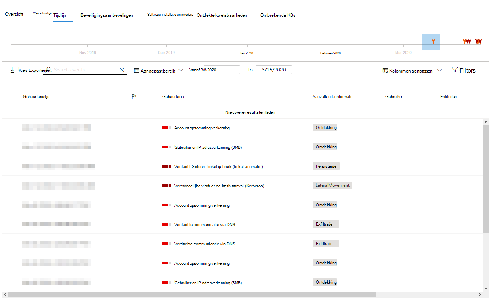

# Pagina apparaatprofielDevice profile page

De Microsoft 365-beveiligingsportal biedt u apparaatprofielpagina's, zodat u snel de status en status van apparaten in uw netwerk beoordelen.The Microsoft 365 security portal provides you with device profile pages, so you can quickly assess the health and status of devices on your network.

> [!IMPORTANT]
> De pagina met apparaatprofielen kan er iets anders uitzien, afhankelijk van of het apparaat is ingeschreven in Microsoft Defender ATP, Azure ATP of beide.The device profile page may appear slightly different, depending on whether the device is enrolled in Microsoft Defender ATP, Azure ATP, or both.

Als het apparaat is ingeschreven bij Microsoft Defender ATP, u de pagina met apparaatprofielen ook gebruiken om enkele veelvoorkomende beveiligingstaken uit te voeren.If the device is enrolled in Microsoft Defender ATP, you can also use the device profile page to perform some common security tasks.

## Navigeren op de pagina apparaatprofielNavigating the device profile page

De profielpagina is opgesplitst in verschillende brede secties.The profile page is broken up into several broad sections.

De zijbalk (1) bevat basisgegevens over het apparaat.The sidebar (1) lists basic details about the device.

Het hoofdinhoudsgebied (2) bevat tabbladen die u inschakelen om verschillende soorten informatie over het apparaat weer te geven.The main content area (2) contains tabs that you can toggle through to view different kinds of information about the device.

Als het apparaat is ingeschreven bij Microsoft Defender ATP, ziet u ook een lijst met reactieacties (3).If the device is enrolled in Microsoft Defender ATP, you will also see a list of response actions (3). Met responsacties u veelvoorkomende beveiligingstaken uitvoeren.Response actions allow you to perform common security-related tasks.

## ZijbalkSidebar

Naast het hoofdinhoudsgebied van de profielpagina van het apparaat bevindt zich de zijbalk.Beside the main content area of the device profile page is the sidebar.

De zijbalk geeft een lijst van de volledige naam en het belichtingsniveau van het apparaat.The sidebar lists the device's full name and exposure level. Het biedt ook een aantal belangrijke basisinformatie in kleine onderafdelingen die kunnen worden geschakeld open of gesloten, zoals:It also provides some important basic information in small subsections which can be toggled open or closed, such as:

* **Tags** : microsoft defender ATP, Azure ATP of aangepaste tags die aan het apparaat zijn gekoppeld, zijn gekoppeld.**Tags** - Any Microsoft Defender ATP, Azure ATP, or custom tags associated with the device. Tags van Azure ATP zijn niet bewerkbaar.Tags from Azure ATP are not editable.
* **Beveiligingsinformatie** - Open incidenten en actieve waarschuwingen.**Security info** - Open incidents and active alerts. Apparaten die zijn ingeschreven bij Microsoft Defender ATP, geven ook het blootstellingsniveau en het risiconiveau weer.Devices enrolled in Microsoft Defender ATP will also display exposure level and risk level.

> [!TIP]
> Het blootstellingsniveau heeft betrekking op de mate van naleving van beveiligingsaanbevelingen, terwijl het risiconiveau wordt berekend op basis van een aantal factoren, waaronder de typen en de ernst van actieve waarschuwingen.Exposure level relates to how much the device is complying with security recommendations, while risk level is calculated based on a number of factors, including the types and severity of active alerts.

* **Apparaatgegevens** - Domein, BE, tijdstempel voor wanneer het apparaat voor het eerst werd gezien, IP-adressen, bronnen.**Device details** - Domain, OS, timestamp for when the device was first seen, IP addresses, resources. Apparaten die zijn ingeschreven bij Microsoft Defender ATP, geven ook de status weer.Devices enrolled in Microsoft Defender ATP also display health state. Apparaten die zijn ingeschreven in Azure ATP geven de NAAM SAM en een tijdstempel weer voor wanneer het apparaat voor het eerst is gemaakt.Devices enrolled in Azure ATP will display SAM name and a timestamp for when the device was first created.
* **Netwerkactiviteit** - Tijdstempels voor de eerste en laatste keer dat het apparaat op het netwerk werd gezien.**Network activity** - Timestamps for the first time and last time the device was seen on the network.
* **Directorygegevens** (*alleen voor apparaten die zijn ingeschreven in Azure ATP*) - [UAC-vlaggen,](https://docs.microsoft.com/windows/security/identity-protection/user-account-control/user-account-control-overview) [SPN's](https://docs.microsoft.com/windows/win32/ad/service-principal-names)en groepslidmaatschappen.**Directory data** (*only for devices enrolled in Azure ATP*) - [UAC](https://docs.microsoft.com/windows/security/identity-protection/user-account-control/user-account-control-overview) flags, [SPNs](https://docs.microsoft.com/windows/win32/ad/service-principal-names), and group memberships.

## ResponsactiesResponse actions

Responsacties bieden een snelle manier om bedreigingen te verdedigen en te analyseren.Response actions offer a quick way to defend against and analyze threats.

> [!IMPORTANT]
> * [Reactieacties](https://docs.microsoft.com/windows/security/threat-protection/microsoft-defender-atp/respond-machine-alerts) zijn alleen beschikbaar als het apparaat is ingeschreven bij Microsoft Defender ATP.[Response actions](https://docs.microsoft.com/windows/security/threat-protection/microsoft-defender-atp/respond-machine-alerts) are only available if the device is enrolled in Microsoft Defender ATP.
> * Apparaten die zijn ingeschreven bij Microsoft Defender ATP kunnen verschillende aantal responsacties weergeven op basis van het besturingssysteem en het versienummer van het apparaat.Devices that are enrolled in Microsoft Defender ATP may display different numbers of response actions, based on the device's OS and version number.

Acties die beschikbaar zijn op de pagina met apparaatprofielen zijn onder andere:Actions available on the device profile page include:

* **Tags beheren** - Werkt aangepaste tags bij die u op dit apparaat hebt toegepast.**Manage tags** - Updates custom tags you have applied to this device.
* **Apparaat isoleren** - Isoleer het apparaat uit het netwerk van uw organisatie en houdt het verbonden met Microsoft Defender Advanced Threat Protection.**Isolate device** - Isolates the device from your organization's network while keeping it connected to Microsoft Defender Advanced Threat Protection. U ervoor kiezen om Outlook, Teams en Skype voor Bedrijven uit te laten werken terwijl het apparaat geïsoleerd is, voor communicatiedoeleinden.You can choose to allow Outlook, Teams, and Skype for Business to run while the device is isolated, for communication purposes.
* **Actiecentrum** - Bekijk de status van ingediende acties.**Action center** - View the status of submitted actions. Alleen beschikbaar als er al een andere actie is geselecteerd.Only available if another action has already been selected.
* **App-uitvoering beperken** : hiermee voorkomt u dat toepassingen die niet door Microsoft zijn ondertekend, worden uitgevoerd.**Restrict app execution** - Prevents applications that are not signed by Microsoft from running.
* **Antivirusscan uitvoeren** - Werkt Windows Defender Antivirus-definities bij en voert onmiddellijk een antivirusscan uit.**Run antivirus scan** - Updates Windows Defender Antivirus definitions and immediately runs an antivirus scan. Kies tussen Quick scan of Volledige scan.Choose between Quick scan or Full scan.
* **Onderzoekspakket verzamelen** - Verzamelt informatie over het apparaat.**Collect investigation package** - Gathers information about the device. Wanneer het onderzoek is voltooid, u het downloaden.When the investigation is completed, you can download it.
* **Live Response Session starten** - Laadt een externe shell op het apparaat voor [diepgaande beveiligingsonderzoeken.](https://docs.microsoft.com/windows/security/threat-protection/microsoft-defender-atp/live-response)**Initiate Live Response Session** - Loads a remote shell on the device for [in-depth security investigations](https://docs.microsoft.com/windows/security/threat-protection/microsoft-defender-atp/live-response).
* **Start geautomatiseerd onderzoek** - [onderzoekt en verherstelt automatisch bedreigingen.](https://docs.microsoft.com/microsoft-365/security/office-365-security/office-365-air)**Initiate automated investigation** - Automatically [investigates and remediates threats](https://docs.microsoft.com/microsoft-365/security/office-365-security/office-365-air). Hoewel u handmatig geautomatiseerde onderzoeken activeren om vanaf deze pagina uit te voeren, leiden [bepaalde waarschuwingsbeleidsregels](https://docs.microsoft.com/microsoft-365/compliance/alert-policies?view=o365-worldwide#default-alert-policies) zelf tot automatische onderzoeken.Although you can manually trigger automated investigations to run from this page, [certain alert policies](https://docs.microsoft.com/microsoft-365/compliance/alert-policies?view=o365-worldwide#default-alert-policies) trigger automatic investigations on their own.
* **Actiecentrum** : geeft informatie weer over eventuele reactieacties die momenteel worden uitgevoerd.**Action center** - Displays information about any response actions that are currently running.

## Sectie TabbladenTabs section

Met de tabbladen apparaatprofiel u schakelen via een overzicht van beveiligingsgegevens over het apparaat en tabellen met een lijst met waarschuwingen.The device profile tabs allow you to toggle through an overview of security details about the device, and tables containing a list of alerts.

Apparaten die zijn ingeschreven bij Microsoft Defender ATP geven ook tabbladen weer met een tijdlijn, een lijst met beveiligingsaanbevelingen, een software-inventaris, een lijst met ontdekte kwetsbaarheden en ontbrekende GB's (beveiligingsupdates).Devices enrolled in Microsoft Defender ATP will also display tabs that feature a timeline, a list of security recommendations, a software inventory, a list of discovered vulnerabilities, and missing KBs (security updates).

### Tabblad OverzichtOverview tab

Het standaardtabblad is **Overzicht**.The default tab is **Overview**. Het biedt een snelle blik op het belangrijkste beveiligingsfeit over het apparaat.It provides a quick look at the most important security fact about the device.

Hier u de actieve waarschuwingen van het apparaat en alle momenteel aangemelde gebruikers snel bekijken.Here, you can get a quick look at the device's active alerts, and any currently logged on users.

Als het apparaat is ingeschreven bij Microsoft Defender ATP, ziet u ook het risiconiveau van het apparaat en alle beschikbare gegevens over beveiligingsbeoordelingen.If the device is enrolled in Microsoft Defender ATP, you will also see the device's risk level and any available data on security assessments. De beveiligingsbeoordelingen beschrijven het blootstellingsniveau van het apparaat, bieden beveiligingsaanbevelingen en vermelden getroffen software en ontdekte kwetsbaarheden.The security assessments describe the device's exposure level, provide security recommendations, and list affected software and discovered vulnerabilities.

### Tabblad WaarschuwingenAlerts tab

Het tabblad **Waarschuwingen** bevat een lijst met waarschuwingen die op het apparaat zijn opgehaald, van zowel Azure ATP als Microsoft Defender ATP.The **Alerts** tab contains a list of alerts that have been raised on the device, from both Azure ATP and Microsoft Defender ATP.

U het aantal weergegeven items aanpassen en welke kolommen voor elk item worden weergegeven.You can customize the number of items displayed, as well as which columns are displayed for each item. Het standaardgedrag is om dertig items per pagina weer te geven.The default behavior is to list thirty items per page.

De kolommen op dit tabblad bevatten informatie over de ernst van de bedreiging die de waarschuwing heeft geactiveerd, evenals de status, de onderzoeksstatus en aan wie de waarschuwing is toegewezen.The columns in this tab include information on the severity of the threat that triggered the alert, as well as status, investigation state, and who the alert has been assigned to.

De *kolom van de getroffen entiteiten* verwijst naar het apparaat (entiteit) waarvan u momenteel het profiel bekijkt, plus alle andere apparaten in uw netwerk die worden beïnvloed.The *impacted entities* column refers to the device (entity) whose profile you are currently viewing, plus any other devices in your network that are affected.

Als u een item uit deze lijst selecteert, wordt een flyout geopend met nog meer informatie over de geselecteerde waarschuwing.Selecting an item from this list will open a flyout containing even more information about the selected alert.

Deze lijst kan worden gefilterd op ernst, status of aan wie de waarschuwing is toegewezen.This list can be filtered by severity, status, or who the alert has been assigned to.

### Tabblad TijdlijnTimeline tab

Het tabblad **Tijdlijn** bevat een interactieve, chronologische grafiek van alle gebeurtenissen die op het apparaat worden weergegeven.The **Timeline** tab includes an interactive, chronological chart of all events raised on the device. Door het gemarkeerde gebied van de grafiek naar links of rechts te verplaatsen, u gebeurtenissen over verschillende perioden bekijken.By moving the highlighted area of the chart left or right, you can view events over different periods of time. U ook een aangepast bereik van datums kiezen in het vervolgkeuzemenu tussen de interactieve grafiek en de lijst met gebeurtenissen.You can also choose a custom range of dates from the dropdown menu in between the interactive chart and the list of events.

Onder de grafiek vindt u een lijst met gebeurtenissen voor het geselecteerde bereik van datums.Below the chart is a list of events for the selected range of dates.

Het aantal weergegeven items en de kolommen in de lijst kunnen beide worden aangepast.The number of items displayed and the columns on the list can both be customized. De standaardkolommen bevatten de gebeurtenistijd, actieve gebruiker, actietype, entiteiten (processen) en aanvullende informatie over de gebeurtenis.The default columns list the event time, active user, action type, entities (processes), and additional information about the event.

Als u een item uit deze lijst selecteert, wordt een flyout geopend met een grafiek voor gebeurtenisentiteiten, met de bovenliggende en onderliggende processen die bij de gebeurtenis betrokken zijn.Selecting an item from this list will open a flyout displaying an Event entities graph, showing the parent and child processes involved in the event.

De lijst kan worden gefilterd op het specifieke soort gebeurtenis; bijvoorbeeld Registergebeurtenissen of Smart Screen-gebeurtenissen.The list can be filtered by the specific kind of event; for example, Registry events or Smart Screen Events.

De lijst kan ook worden geëxporteerd naar een CSV-bestand, om te downloaden.The list can also be exported to a CSV file, for download. Hoewel het bestand niet wordt beperkt door het aantal gebeurtenissen, is het maximale tijdsbereik dat u exporteren zeven dagen.Although the file is not limited by number of events, the maximum time range you can choose to export is seven days.

### Tabblad BeveiligingsaanbevelingenSecurity recommendations tab

Op het tabblad **Beveiligingsaanbevelingen** staan acties die u uitvoeren om het apparaat te beschermen.The **Security recommendations** tab lists actions you can take to protect the device. Als u een item in deze lijst selecteert, opent u een flyout waar u instructies krijgen over het toepassen van de aanbeveling.Selecting an item on this list will open a flyout where you can get instructions on how to apply the recommendation.

Net als bij de vorige tabbladen kan het aantal items dat per pagina wordt weergegeven en welke kolommen zichtbaar zijn, worden aangepast.As with the previous tabs, the number of items displayed per page, as well as which columns are visible, can be customized.

De standaardweergave bevat kolommen waarin de beveiligingszwakke punten worden beschreven die zijn verholpen, de bijbehorende bedreiging, de bijbehorende component of software die door de bedreiging wordt beïnvloed, en meer.The default view includes columns that detail the security weaknesses addressed, the associated threat, the related component or software affected by the threat, and more. Items kunnen worden gefilterd op de status van de aanbeveling.Items can be filtered by the recommendation's status.

### Software-inventarisSoftware inventory

Op het tabblad **Softwareinventaris** vindt u software die op het apparaat is geïnstalleerd.The **Software inventory** tab lists software installed on the device.

De standaardweergave toont de softwareleverancier, het geïnstalleerde versienummer, het aantal bekende softwarezwakke punten, bedreigingsinzichten, productcode en tags.The default view displays the software vendor, installed version number, number of known software weaknesses, threat insights, product code, and tags. Het aantal weergegeven items en welke kolommen worden weergegeven, kan beide worden aangepast.The number of items displayed and which columns are displayed can both be customized.

Als u een item uit deze lijst selecteert, wordt een flyout geopend met meer details over de geselecteerde software, evenals het pad en de tijdstempel voor de laatste keer dat de software is gevonden.Selecting an item from this list opens a flyout containing more details about the selected software, as well as the path and timestamp for the last time the software was found.

Deze lijst kan worden gefilterd op productcode.This list can be filtered by product code.

### Tabblad Ontdekte kwetsbaarhedenDiscovered vulnerabilities tab

Op het tabblad **Ontdekte kwetsbaarheden** worden alle algemene kwetsbaarheden en exploits (CvEs) weergegeven die van invloed kunnen zijn op het apparaat.The **Discovered vulnerabilities** tab lists any Common Vulnerabilities and Exploits (CVEs) that may affect the device.

De standaardweergave geeft een overzicht van de ernst van de CVE, de Common Vulnerability Score (CVS), de software met betrekking tot de CVE, toen de CVE werd gepubliceerd, toen de CVE voor het laatst werd bijgewerkt, en bedreigingen in verband met de CVE.The default view lists the severity of the CVE, the Common Vulnerability Score (CVS), the software related to the CVE, when the CVE was published, when the CVE was last updated, and threats associated with the CVE.

Net als bij de vorige tabbladen kan het aantal weergegeven items en welke kolommen zichtbaar zijn, worden aangepast.As with the previous tabs, the number of items displayed and which columns are visible can be customized.

Als u een item uit deze lijst selecteert, wordt een flyout geopend waarin de CVE wordt beschreven.Selecting an item from this list will open a flyout that describes the CVE.

### Ontbrekende KBsMissing KBs

Op het tabblad **Ontbrekende KBs** worden alle Microsoft-updates weergegeven die nog niet op het apparaat moeten worden toegepast.The **Missing KBs** tab lists any Microsoft Updates that have yet to be applied to the device. De "KBs" in kwestie zijn [Knowledge Base artikelen](https://support.microsoft.com/help/242450/how-to-query-the-microsoft-knowledge-base-by-using-keywords-and-query) die deze updates beschrijven; [KB4551762](https://support.microsoft.com/help/4551762/windows-10-update-kb4551762).The "KBs" in question are [Knowledge Base articles](https://support.microsoft.com/help/242450/how-to-query-the-microsoft-knowledge-base-by-using-keywords-and-query) which describe these updates; for example, [KB4551762](https://support.microsoft.com/help/4551762/windows-10-update-kb4551762).

In de standaardweergave wordt het bulletin weergegeven met de updates, de os-versie, de betrokken producten, aco's, het KB-nummer en de tags.The default view lists the bulletin containing the updates, OS version, products affected, CVEs addressed, the KB number, and tags.

Het aantal items dat per pagina wordt weergegeven en welke kolommen worden weergegeven, kan worden aangepast.The number of items displayed per page and which columns are displayed can be customized.

Als u een item selecteert, wordt een flyout geopend die naar de update verwijst.Selecting an item will open a flyout that links to the update.

## Verwante onderwerpenRelated topics

* [Overzicht van Microsoft Threat ProtectionMicrosoft Threat Protection overview](microsoft-threat-protection.md)
* [Microsoft-bedreigingsbeveiliging inschakelenTurn on Microsoft Threat Protection](mtp-enable.md)
* [Entiteiten op apparaten onderzoeken met live responsInvestigate entities on devices, using live response](https://docs.microsoft.com/windows/security/threat-protection/microsoft-defender-atp/live-response)
* [Geautomatiseerd onderzoek en antwoord (AIR) in Office 365Automated investigation and response (AIR) in Office 365](https://docs.microsoft.com/microsoft-365/security/office-365-security/office-365-air)
