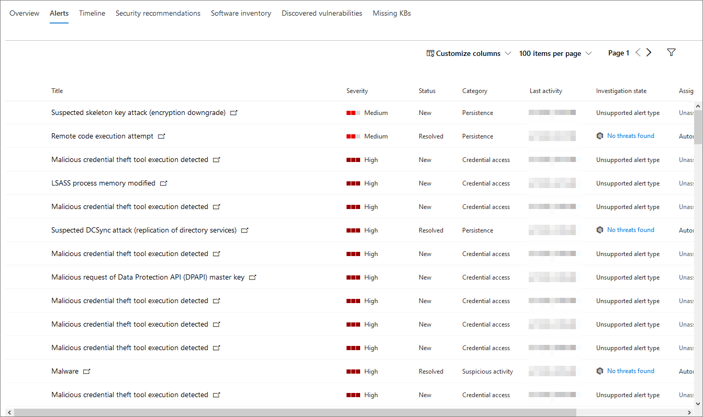

# ApparaatprofielpaginaDevice profile page

[!INCLUDE [Microsoft 365 Defender rebranding](../includes/microsoft-defender.md)]

De Microsoft 365-beveiligingsportal biedt u apparaatprofielpagina's, zodat u snel de status en status van apparaten in uw netwerk kunt beoordelen.The Microsoft 365 security portal provides you with device profile pages, so you can quickly assess the health and status of devices on your network.

> [!IMPORTANT]
> De profielpagina van het apparaat kan er iets anders uit zien, afhankelijk van of het apparaat is ingeschreven bij Microsoft Defender for Endpoint, Microsoft Defender for Identity of beide.The device profile page may appear slightly different, depending on whether the device is enrolled in Microsoft Defender for Endpoint, Microsoft Defender for Identity, or both.

Als het apparaat is geregistreerd bij Microsoft Defender for Endpoint, kunt u ook de profielpagina van het apparaat gebruiken om enkele veelvoorkomende beveiligingstaken uit te voeren.If the device is enrolled in Microsoft Defender for Endpoint, you can also use the device profile page to perform some common security tasks.

## Navigeren op de apparaatprofielpaginaNavigating the device profile page

De profielpagina is onderverdeeld in diverse algemene secties.The profile page is broken up into several broad sections.

De zijbalk (1) bevat basisgegevens over het apparaat.The sidebar (1) lists basic details about the device.

Het gebied met de hoofdinhoud (2) bevat tabbladen waar u doorheen kunt schakelen om verschillende soorten informatie over het apparaat te bekijken.The main content area (2) contains tabs that you can toggle through to view different kinds of information about the device.

Als het apparaat is geregistreerd bij Microsoft Defender for Endpoint, ziet u ook een lijst met antwoordacties (3).If the device is enrolled in Microsoft Defender for Endpoint, you will also see a list of response actions (3). Met antwoordacties kunt u veelvoorkomende beveiligingstaken uitvoeren.Response actions allow you to perform common security-related tasks.

## ZijbalkSidebar

Naast het gebied met de hoofdinhoud van de profielpagina van het apparaat, staat de zijbalk.Beside the main content area of the device profile page is the sidebar.

De zijbalk bevat de volledige naam en het blootstellingsniveau van het apparaat.The sidebar lists the device's full name and exposure level. Daarnaast vindt u hier belangrijke basisinformatie in kleine subsecties die u kunt openen of sluiten, zoals:It also provides some important basic information in small subsections which can be toggled open or closed, such as:

* **Tags:** Alle Microsoft Defender voor eindpunten, Microsoft Defender voor identiteiten of aangepaste tags die aan het apparaat zijn gekoppeld.**Tags** - Any Microsoft Defender for Endpoint, Microsoft Defender for Identity, or custom tags associated with the device. Labels van Microsoft Defender voor identiteit kunnen niet worden bewerkt.Tags from Microsoft Defender for Identity are not editable.
* **Beveiligingsgegevens:** open incidenten en actieve waarschuwingen.**Security info** - Open incidents and active alerts. Apparaten die zijn ingeschreven in Microsoft Defender for Endpoint, geven ook het blootstellingsniveau en het risiconiveau weer.Devices enrolled in Microsoft Defender for Endpoint will also display exposure level and risk level.

> [!TIP]
> Blootstellingsniveau heeft betrekking op hoeveel het apparaat voldoet aan beveiligingsaanbevelingen, terwijl het risiconiveau wordt berekend op basis van een aantal factoren, waaronder de typen en ernst van actieve waarschuwingen.Exposure level relates to how much the device is complying with security recommendations, while risk level is calculated based on a number of factors, including the types and severity of active alerts.

* **Apparaatgegevens:** domein, besturingssysteem, tijdstempel voor wanneer het apparaat voor het eerst werd gezien, IP-adressen, bronnen.**Device details** - Domain, OS, timestamp for when the device was first seen, IP addresses, resources. Apparaten die zijn ingeschreven in Microsoft Defender voor eindpunten geven ook de status van de status weer.Devices enrolled in Microsoft Defender for Endpoint also display health state. Apparaten die zijn geregistreerd met Microsoft Defender for Identity, geven de SAM-naam en een tijdstempel weer voor wanneer het apparaat voor het eerst werd gemaakt.Devices enrolled in Microsoft Defender for Identity will display SAM name and a timestamp for when the device was first created.
* **Netwerkactiviteit:** tijdstempels voor de eerste keer en de laatste keer dat het apparaat in het netwerk is gezien.**Network activity** - Timestamps for the first time and last time the device was seen on the network.
* **Adreslijstgegevens** (alleen voor apparaten die zijn geregistreerd *voor Microsoft Defender voor identiteit)*- [UAC-vlaggen,](https://docs.microsoft.com/windows/security/identity-protection/user-account-control/user-account-control-overview) [SPN's](https://docs.microsoft.com/windows/win32/ad/service-principal-names)en groepslidmaatschap.**Directory data** (*only for devices enrolled in Microsoft Defender for Identity*) - [UAC](https://docs.microsoft.com/windows/security/identity-protection/user-account-control/user-account-control-overview) flags, [SPNs](https://docs.microsoft.com/windows/win32/ad/service-principal-names), and group memberships.

## AntwoordactiesResponse actions

Reactieacties bieden een snelle manier om je te beschermen tegen bedreigingen en om bedreigingen te analyseren.Response actions offer a quick way to defend against and analyze threats.

> [!IMPORTANT]
> * [Antwoordacties](https://docs.microsoft.com/windows/security/threat-protection/microsoft-defender-atp/respond-machine-alerts) zijn alleen beschikbaar als het apparaat is ingeschreven bij Microsoft Defender voor Eindpunt.[Response actions](https://docs.microsoft.com/windows/security/threat-protection/microsoft-defender-atp/respond-machine-alerts) are only available if the device is enrolled in Microsoft Defender for Endpoint.
> * Apparaten die zijn ingeschreven in Microsoft Defender for Endpoint kunnen verschillende aantallen antwoordacties weergeven, op basis van het besturingssysteem en versienummer van het apparaat.Devices that are enrolled in Microsoft Defender for Endpoint may display different numbers of response actions, based on the device's OS and version number.

Acties die beschikbaar zijn op de profielpagina van het apparaat zijn:Actions available on the device profile page include:

* **Tags beheren:** updates van aangepaste tags die u op dit apparaat hebt toegepast.**Manage tags** - Updates custom tags you have applied to this device.
* **Isoleert apparaat:** isoleert het apparaat van het netwerk van uw organisatie terwijl het verbonden blijft met Microsoft Defender voor eindpunt.**Isolate device** - Isolates the device from your organization's network while keeping it connected to Microsoft Defender for Endpoint. U kunt Outlook, Teams en Skype voor Bedrijven laten uitvoeren terwijl het apparaat geïsoleerd is, voor communicatiedoeleinden.You can choose to allow Outlook, Teams, and Skype for Business to run while the device is isolated, for communication purposes.
* **Actiecentrum** - Bekijk de status van verzonden acties.**Action center** - View the status of submitted actions. Alleen beschikbaar als er al een andere actie is geselecteerd.Only available if another action has already been selected.
* **Het uitvoeren van apps** beperken: voorkomt dat toepassingen die niet door Microsoft zijn ondertekend, worden uitgevoerd.**Restrict app execution** - Prevents applications that are not signed by Microsoft from running.
* **Voer antivirusscan uit** - Windows Defender Antivirus-definities worden bijgewerkt en er wordt meteen een antivirusscan uitgevoerd.**Run antivirus scan** - Updates Windows Defender Antivirus definitions and immediately runs an antivirus scan. Kiezen tussen Snelle scan of Volledige scan.Choose between Quick scan or Full scan.
* **Pakket voor onderzoek verzamelen:** verzamelt informatie over het apparaat.**Collect investigation package** - Gathers information about the device. Wanneer het onderzoek is voltooid, kunt u het downloaden.When the investigation is completed, you can download it.
* **Live Response-sessie starten:** er wordt een externe shell op het apparaat geladen voor uitgebreide [beveiligingsonderzoeken.](https://docs.microsoft.com/windows/security/threat-protection/microsoft-defender-atp/live-response)**Initiate Live Response Session** - Loads a remote shell on the device for [in-depth security investigations](https://docs.microsoft.com/windows/security/threat-protection/microsoft-defender-atp/live-response).
* **Automatisch onderzoek starten:** automatisch [bedreigingen onderzoeken en herstellen.](https://docs.microsoft.com/microsoft-365/security/office-365-security/office-365-air)**Initiate automated investigation** - Automatically [investigates and remediates threats](https://docs.microsoft.com/microsoft-365/security/office-365-security/office-365-air). Hoewel u vanaf deze pagina handmatig kunt activeren dat geautomatiseerde onderzoeken worden [uitgevoerd,](https://docs.microsoft.com/microsoft-365/compliance/alert-policies?view=o365-worldwide#default-alert-policies) worden met bepaalde waarschuwingsbeleidsregels automatische onderzoeken automatisch uitgevoerd.Although you can manually trigger automated investigations to run from this page, [certain alert policies](https://docs.microsoft.com/microsoft-365/compliance/alert-policies?view=o365-worldwide#default-alert-policies) trigger automatic investigations on their own.
* **Actiecentrum:** hier wordt informatie weergegeven over alle antwoordacties die momenteel worden uitgevoerd.**Action center** - Displays information about any response actions that are currently running.

## Sectie TabbladenTabs section

Met de profieltabbladen van het apparaat kunt u door een overzicht van beveiligingsdetails over het apparaat schakelen en door tabellen met een lijst met waarschuwingen schakelen.The device profile tabs allow you to toggle through an overview of security details about the device, and tables containing a list of alerts.

Apparaten die zijn geregistreerd in Microsoft Defender for Endpoint, bevatten ook tabbladen met een tijdlijn, een lijst met beveiligingsaanbevelingen, een softwarevoorraad, een lijst met gevonden beveiligingsproblemen en ontbrekende KB's (beveiligingsupdates).Devices enrolled in Microsoft Defender for Endpoint will also display tabs that feature a timeline, a list of security recommendations, a software inventory, a list of discovered vulnerabilities, and missing KBs (security updates).

### Tabblad OverzichtOverview tab

Het standaardtabblad is **Overzicht.**The default tab is **Overview**. In dit artikel vindt u een beknopt overzicht van de belangrijkste beveiligingsrisico's van het apparaat.It provides a quick look at the most important security fact about the device.

Hier kunt u een kort overzicht krijgen van de actieve waarschuwingen op het apparaat en eventuele gebruikers die op dat moment zijn aangemeld.Here, you can get a quick look at the device's active alerts, and any currently logged on users.

Als het apparaat is geregistreerd bij Microsoft Defender for Endpoint, ziet u ook het risiconiveau van het apparaat en alle beschikbare gegevens over beveiligingsbeoordelingen.If the device is enrolled in Microsoft Defender for Endpoint, you will also see the device's risk level and any available data on security assessments. In de beveiligingsbeoordelingen wordt het blootstellingsniveau van het apparaat beschreven, worden beveiligingsaanbevelingen gegeven, wordt de betrokken software vermeld en worden beveiligingsproblemen ontdekt.The security assessments describe the device's exposure level, provide security recommendations, and list affected software and discovered vulnerabilities.

### Tabblad WaarschuwingenAlerts tab

Het **tabblad** Waarschuwingen bevat een lijst met waarschuwingen die zijn verhoogd op het apparaat, van zowel Microsoft Defender for Identity als Microsoft Defender for Endpoint.The **Alerts** tab contains a list of alerts that have been raised on the device, from both Microsoft Defender for Identity and Microsoft Defender for Endpoint.

U kunt het aantal weergegeven items aanpassen en voor elk item welke kolommen worden weergegeven.You can customize the number of items displayed, as well as which columns are displayed for each item. Het standaardgedrag is om dertig items per pagina weer te geven.The default behavior is to list thirty items per page.

De kolommen op dit tabblad bevatten informatie over de ernst van de bedreiging die de waarschuwing heeft geactiveerd, evenals de status, de onderzoeksstatus en aan wie de waarschuwing is toegewezen.The columns in this tab include information on the severity of the threat that triggered the alert, as well as status, investigation state, and who the alert has been assigned to.

De *kolom met beïnvloede entiteiten* verwijst naar het apparaat (de entiteit) waarvan u het profiel momenteel bekijkt, plus alle andere apparaten in uw netwerk die worden beïnvloed.The *impacted entities* column refers to the device (entity) whose profile you are currently viewing, plus any other devices in your network that are affected.

Als u een item in deze lijst selecteert, wordt een flyout geopend met nog meer informatie over de geselecteerde waarschuwing.Selecting an item from this list will open a flyout containing even more information about the selected alert.

Deze lijst kan worden gefilterd op ernst, status of aan wie de waarschuwing is toegewezen.This list can be filtered by severity, status, or who the alert has been assigned to.

### Tabblad TijdlijnTimeline tab

Het **tabblad** Tijdlijn bevat een interactief chronologisch diagram van alle gebeurtenissen die op het apparaat zijn geplaatst.The **Timeline** tab includes an interactive, chronological chart of all events raised on the device. Door het gemarkeerde gebied van de grafiek naar links of rechts te verplaatsen, kunt u gebeurtenissen over verschillende perioden weergeven.By moving the highlighted area of the chart left or right, you can view events over different periods of time. U kunt ook een aangepast datumbereik kiezen in de vervolgkeuzelijst tussen de interactieve grafiek en de lijst met gebeurtenissen.You can also choose a custom range of dates from the dropdown menu in between the interactive chart and the list of events.

Onder de grafiek staat een lijst met gebeurtenissen voor het geselecteerde datumbereik.Below the chart is a list of events for the selected range of dates.

Het aantal weergegeven items en de kolommen in de lijst kunnen beide worden aangepast.The number of items displayed and the columns on the list can both be customized. De standaardkolommen bevatten de gebeurtenistijd, de actieve gebruiker, het actietype, entiteiten (processen) en aanvullende informatie over de gebeurtenis.The default columns list the event time, active user, action type, entities (processes), and additional information about the event.

Als u een item in deze lijst selecteert, wordt er een flyout geopend waarin een grafiek met gebeurtenis-entiteiten wordt weergegeven, waarin de bovenliggende en onderliggende processen voor de gebeurtenis worden weergegeven.Selecting an item from this list will open a flyout displaying an Event entities graph, showing the parent and child processes involved in the event.

De lijst kan worden gefilterd op het specifieke type gebeurtenis; Bijvoorbeeld registergebeurtenissen of slimme schermgebeurtenissen.The list can be filtered by the specific kind of event; for example, Registry events or Smart Screen Events.

De lijst kan ook worden geëxporteerd naar een CSV-bestand om te downloaden.The list can also be exported to a CSV file, for download. Hoewel het bestand niet wordt beperkt door het aantal gebeurtenissen, is de maximumtijd die u kunt kiezen om te exporteren zeven dagen.Although the file is not limited by number of events, the maximum time range you can choose to export is seven days.

### Tabblad BeveiligingsaanbevelingenSecurity recommendations tab

Op **het tabblad Beveiligingsaanbevelingen** worden de acties weergegeven die u kunt uitvoeren om het apparaat te beveiligen.The **Security recommendations** tab lists actions you can take to protect the device. Als u een item in deze lijst selecteert, wordt een flyout geopend waarin u instructies kunt krijgen voor het toepassen van de aanbeveling.Selecting an item on this list will open a flyout where you can get instructions on how to apply the recommendation.

Net als bij de vorige tabbladen, kan het aantal items dat per pagina wordt weergegeven en welke kolommen zichtbaar zijn, worden aangepast.As with the previous tabs, the number of items displayed per page, as well as which columns are visible, can be customized.

De standaardweergave bevat kolommen met een overzicht van de beveiligingsrisico's die worden aangepakt, de bijbehorende bedreiging, het gerelateerde onderdeel of de software die door de bedreiging wordt beïnvloed, en meer.The default view includes columns that detail the security weaknesses addressed, the associated threat, the related component or software affected by the threat, and more. Items kunnen worden gefilterd op de status van de aanbeveling.Items can be filtered by the recommendation's status.

### SoftwarevoorraadSoftware inventory

Op **het tabblad Softwarevoorraad** wordt software vermeld die op het apparaat is geïnstalleerd.The **Software inventory** tab lists software installed on the device.

In de standaardweergave ziet u de softwareleverancier, het geïnstalleerde versienummer, het aantal bekende software zwakke punten, bedreigingsinzichten, productcode en labels.The default view displays the software vendor, installed version number, number of known software weaknesses, threat insights, product code, and tags. Het aantal weergegeven items en welke kolommen kunnen beide worden aangepast.The number of items displayed and which columns are displayed can both be customized.

Als u een item in deze lijst selecteert, wordt een flyout geopend met meer informatie over de geselecteerde software en het pad en de tijdstempel voor de laatste keer dat de software is gevonden.Selecting an item from this list opens a flyout containing more details about the selected software, as well as the path and timestamp for the last time the software was found.

Deze lijst kan worden gefilterd op productcode.This list can be filtered by product code.

### Tabblad Voor ontdekte beveiligingsproblemenDiscovered vulnerabilities tab

Op **het tabblad Gevonden** beveiligingsproblemen worden veelvoorkomende beveiligingslekken en misbruiken (CVEs) vermeld die van invloed kunnen zijn op het apparaat.The **Discovered vulnerabilities** tab lists any Common Vulnerabilities and Exploits (CVEs) that may affect the device.

In de standaardweergave worden de ernst van het CVE, de CVS (Common Vulnerability Score), de software die is gerelateerd aan het CVE, vermeld wanneer de CVE is gepubliceerd, wanneer de CVE voor het laatst werd bijgewerkt, en de bedreigingen die aan het CVE zijn gekoppeld.The default view lists the severity of the CVE, the Common Vulnerability Score (CVS), the software related to the CVE, when the CVE was published, when the CVE was last updated, and threats associated with the CVE.

Net als bij de vorige tabbladen, kan het aantal weergegeven items en welke kolommen worden weergegeven, worden aangepast.As with the previous tabs, the number of items displayed and which columns are visible can be customized.

Als u een item in deze lijst selecteert, wordt een flyout geopend met een beschrijving van het CVE.Selecting an item from this list will open a flyout that describes the CVE.

### Ontbrekende KB'sMissing KBs

Op **het tabblad Ontbrekende KB's** worden alle Microsoft-updates vermeld die nog niet op het apparaat zijn toegepast.The **Missing KBs** tab lists any Microsoft Updates that have yet to be applied to the device. De KB's in kwestie zijn [Knowledge Base-artikelen](https://support.microsoft.com/help/242450/how-to-query-the-microsoft-knowledge-base-by-using-keywords-and-query) waarin deze updates worden beschreven. bijvoorbeeld [KB4551762.](https://support.microsoft.com/help/4551762/windows-10-update-kb4551762)The "KBs" in question are [Knowledge Base articles](https://support.microsoft.com/help/242450/how-to-query-the-microsoft-knowledge-base-by-using-keywords-and-query) which describe these updates; for example, [KB4551762](https://support.microsoft.com/help/4551762/windows-10-update-kb4551762).

In de standaardweergave wordt het bulletin weergegeven met updates, versie van het besturingssysteem, betrokken producten, geadresseerde CV's, het KB-nummer en labels.The default view lists the bulletin containing the updates, OS version, products affected, CVEs addressed, the KB number, and tags.

Het aantal weergegeven items per pagina en welke kolommen kunnen worden aangepast.The number of items displayed per page and which columns are displayed can be customized.

Als u een item selecteert, wordt een flyout geopend die is koppelingen naar de update.Selecting an item will open a flyout that links to the update.

## Verwante onderwerpenRelated topics

* [Overzicht van Microsoft 365 DefenderMicrosoft 365 Defender overview](microsoft-threat-protection.md)
* [Microsoft 365 Defender in te zettenTurn on Microsoft 365 Defender](mtp-enable.md)
* [Entiteiten op apparaten onderzoeken met behulp van live-antwoordenInvestigate entities on devices, using live response](https://docs.microsoft.com/windows/security/threat-protection/microsoft-defender-atp/live-response)
* [Automatisch onderzoek en automatisch onderzoek (AIR) in Office 365Automated investigation and response (AIR) in Office 365](https://docs.microsoft.com/microsoft-365/security/office-365-security/office-365-air)
