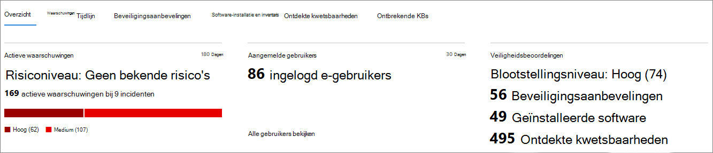

# Pagina apparaatprofiel

De Microsoft 365-beveiligingsportal biedt u apparaatprofielpagina's, zodat u snel de status en status van apparaten in uw netwerk beoordelen.

> [!IMPORTANT]
> De pagina met apparaatprofielen kan er iets anders uitzien, afhankelijk van of het apparaat is ingeschreven in Microsoft Defender ATP, Azure ATP of beide.

Als het apparaat is ingeschreven bij Microsoft Defender ATP, u de pagina met apparaatprofielen ook gebruiken om enkele veelvoorkomende beveiligingstaken uit te voeren.

## Navigeren op de pagina apparaatprofiel

De profielpagina is opgesplitst in verschillende brede secties.

De zijbalk (1) bevat basisgegevens over het apparaat.

Het hoofdinhoudsgebied (2) bevat tabbladen die u inschakelen om verschillende soorten informatie over het apparaat weer te geven.

Als het apparaat is ingeschreven bij Microsoft Defender ATP, ziet u ook een lijst met reactieacties (3). Met responsacties u veelvoorkomende beveiligingstaken uitvoeren.

## Zijbalk

Naast het hoofdinhoudsgebied van de profielpagina van het apparaat bevindt zich de zijbalk.

De zijbalk geeft een lijst van de volledige naam en het belichtingsniveau van het apparaat. Het biedt ook een aantal belangrijke basisinformatie in kleine onderafdelingen die kunnen worden geschakeld open of gesloten, zoals:

* **Tags** : microsoft defender ATP, Azure ATP of aangepaste tags die aan het apparaat zijn gekoppeld, zijn gekoppeld. Tags van Azure ATP zijn niet bewerkbaar.
* **Beveiligingsinformatie** - Open incidenten en actieve waarschuwingen. Apparaten die zijn ingeschreven bij Microsoft Defender ATP, geven ook het blootstellingsniveau en het risiconiveau weer.

> [!TIP]
> Het blootstellingsniveau heeft betrekking op de mate van naleving van beveiligingsaanbevelingen, terwijl het risiconiveau wordt berekend op basis van een aantal factoren, waaronder de typen en de ernst van actieve waarschuwingen.

* **Apparaatgegevens** - Domein, BE, tijdstempel voor wanneer het apparaat voor het eerst werd gezien, IP-adressen, bronnen. Apparaten die zijn ingeschreven bij Microsoft Defender ATP, geven ook de status weer. Apparaten die zijn ingeschreven in Azure ATP geven de NAAM SAM en een tijdstempel weer voor wanneer het apparaat voor het eerst is gemaakt.
* **Netwerkactiviteit** - Tijdstempels voor de eerste en laatste keer dat het apparaat op het netwerk werd gezien.
* **Directorygegevens** (*alleen voor apparaten die zijn ingeschreven in Azure ATP*) - [UAC-vlaggen,](https://docs.microsoft.com/windows/security/identity-protection/user-account-control/user-account-control-overview) [SPN's](https://docs.microsoft.com/windows/win32/ad/service-principal-names)en groepslidmaatschappen.

## Responsacties

Responsacties bieden een snelle manier om bedreigingen te verdedigen en te analyseren.

> [!IMPORTANT]
> * [Reactieacties](https://docs.microsoft.com/windows/security/threat-protection/microsoft-defender-atp/respond-machine-alerts) zijn alleen beschikbaar als het apparaat is ingeschreven bij Microsoft Defender ATP.
> * Apparaten die zijn ingeschreven bij Microsoft Defender ATP kunnen verschillende aantal responsacties weergeven op basis van het besturingssysteem en het versienummer van het apparaat.

Acties die beschikbaar zijn op de pagina met apparaatprofielen zijn onder andere:

* **Tags beheren** - Werkt aangepaste tags bij die u op dit apparaat hebt toegepast.
* **Apparaat isoleren** - Isoleer het apparaat uit het netwerk van uw organisatie en houdt het verbonden met Microsoft Defender Advanced Threat Protection. U ervoor kiezen om Outlook, Teams en Skype voor Bedrijven uit te laten werken terwijl het apparaat geïsoleerd is, voor communicatiedoeleinden.
* **Actiecentrum** - Bekijk de status van ingediende acties. Alleen beschikbaar als er al een andere actie is geselecteerd.
* **App-uitvoering beperken** : hiermee voorkomt u dat toepassingen die niet door Microsoft zijn ondertekend, worden uitgevoerd.
* **Antivirusscan uitvoeren** - Werkt Windows Defender Antivirus-definities bij en voert onmiddellijk een antivirusscan uit. Kies tussen Quick scan of Volledige scan.
* **Onderzoekspakket verzamelen** - Verzamelt informatie over het apparaat. Wanneer het onderzoek is voltooid, u het downloaden.
* **Live Response Session starten** - Laadt een externe shell op het apparaat voor [diepgaande beveiligingsonderzoeken.](https://docs.microsoft.com/windows/security/threat-protection/microsoft-defender-atp/live-response)
* **Start geautomatiseerd onderzoek** - [onderzoekt en verherstelt automatisch bedreigingen.](https://docs.microsoft.com/microsoft-365/security/office-365-security/office-365-air) Hoewel u handmatig geautomatiseerde onderzoeken activeren om vanaf deze pagina uit te voeren, leiden [bepaalde waarschuwingsbeleidsregels](https://docs.microsoft.com/microsoft-365/compliance/alert-policies?view=o365-worldwide#default-alert-policies) zelf tot automatische onderzoeken.
* **Actiecentrum** : geeft informatie weer over eventuele reactieacties die momenteel worden uitgevoerd.

## Sectie Tabbladen

Met de tabbladen apparaatprofiel u schakelen via een overzicht van beveiligingsgegevens over het apparaat en tabellen met een lijst met waarschuwingen.

Apparaten die zijn ingeschreven bij Microsoft Defender ATP geven ook tabbladen weer met een tijdlijn, een lijst met beveiligingsaanbevelingen, een software-inventaris, een lijst met ontdekte kwetsbaarheden en ontbrekende GB's (beveiligingsupdates).

### Tabblad Overzicht

Het standaardtabblad is **Overzicht**. Het biedt een snelle blik op het belangrijkste beveiligingsfeit over het apparaat.

Hier u de actieve waarschuwingen van het apparaat en alle momenteel aangemelde gebruikers snel bekijken.

Als het apparaat is ingeschreven bij Microsoft Defender ATP, ziet u ook het risiconiveau van het apparaat en alle beschikbare gegevens over beveiligingsbeoordelingen. De beveiligingsbeoordelingen beschrijven het blootstellingsniveau van het apparaat, bieden beveiligingsaanbevelingen en vermelden getroffen software en ontdekte kwetsbaarheden.

### Tabblad Waarschuwingen

Het tabblad **Waarschuwingen** bevat een lijst met waarschuwingen die op het apparaat zijn opgehaald, van zowel Azure ATP als Microsoft Defender ATP.

U het aantal weergegeven items aanpassen en welke kolommen voor elk item worden weergegeven. Het standaardgedrag is om dertig items per pagina weer te geven.

De kolommen op dit tabblad bevatten informatie over de ernst van de bedreiging die de waarschuwing heeft geactiveerd, evenals de status, de onderzoeksstatus en aan wie de waarschuwing is toegewezen.

De *kolom van de getroffen entiteiten* verwijst naar het apparaat (entiteit) waarvan u momenteel het profiel bekijkt, plus alle andere apparaten in uw netwerk die worden beïnvloed.

Als u een item uit deze lijst selecteert, wordt een flyout geopend met nog meer informatie over de geselecteerde waarschuwing.

Deze lijst kan worden gefilterd op ernst, status of aan wie de waarschuwing is toegewezen.

### Tabblad Tijdlijn

Het tabblad **Tijdlijn** bevat een interactieve, chronologische grafiek van alle gebeurtenissen die op het apparaat worden weergegeven. Door het gemarkeerde gebied van de grafiek naar links of rechts te verplaatsen, u gebeurtenissen over verschillende perioden bekijken. U ook een aangepast bereik van datums kiezen in het vervolgkeuzemenu tussen de interactieve grafiek en de lijst met gebeurtenissen.

Onder de grafiek vindt u een lijst met gebeurtenissen voor het geselecteerde bereik van datums.

Het aantal weergegeven items en de kolommen in de lijst kunnen beide worden aangepast. De standaardkolommen bevatten de gebeurtenistijd, actieve gebruiker, actietype, entiteiten (processen) en aanvullende informatie over de gebeurtenis.

Als u een item uit deze lijst selecteert, wordt een flyout geopend met een grafiek voor gebeurtenisentiteiten, met de bovenliggende en onderliggende processen die bij de gebeurtenis betrokken zijn.

De lijst kan worden gefilterd op het specifieke soort gebeurtenis; bijvoorbeeld Registergebeurtenissen of Smart Screen-gebeurtenissen.

De lijst kan ook worden geëxporteerd naar een CSV-bestand, om te downloaden. Hoewel het bestand niet wordt beperkt door het aantal gebeurtenissen, is het maximale tijdsbereik dat u exporteren zeven dagen.

### Tabblad Beveiligingsaanbevelingen

Op het tabblad **Beveiligingsaanbevelingen** staan acties die u uitvoeren om het apparaat te beschermen. Als u een item in deze lijst selecteert, opent u een flyout waar u instructies krijgen over het toepassen van de aanbeveling.

Net als bij de vorige tabbladen kan het aantal items dat per pagina wordt weergegeven en welke kolommen zichtbaar zijn, worden aangepast.

De standaardweergave bevat kolommen waarin de beveiligingszwakke punten worden beschreven die zijn verholpen, de bijbehorende bedreiging, de bijbehorende component of software die door de bedreiging wordt beïnvloed, en meer. Items kunnen worden gefilterd op de status van de aanbeveling.

### Software-inventaris

Op het tabblad **Softwareinventaris** vindt u software die op het apparaat is geïnstalleerd.

De standaardweergave toont de softwareleverancier, het geïnstalleerde versienummer, het aantal bekende softwarezwakke punten, bedreigingsinzichten, productcode en tags. Het aantal weergegeven items en welke kolommen worden weergegeven, kan beide worden aangepast.

Als u een item uit deze lijst selecteert, wordt een flyout geopend met meer details over de geselecteerde software, evenals het pad en de tijdstempel voor de laatste keer dat de software is gevonden.

Deze lijst kan worden gefilterd op productcode.

### Tabblad Ontdekte kwetsbaarheden

Op het tabblad **Ontdekte kwetsbaarheden** worden alle algemene kwetsbaarheden en exploits (CvEs) weergegeven die van invloed kunnen zijn op het apparaat.

De standaardweergave geeft een overzicht van de ernst van de CVE, de Common Vulnerability Score (CVS), de software met betrekking tot de CVE, toen de CVE werd gepubliceerd, toen de CVE voor het laatst werd bijgewerkt, en bedreigingen in verband met de CVE.

Net als bij de vorige tabbladen kan het aantal weergegeven items en welke kolommen zichtbaar zijn, worden aangepast.

Als u een item uit deze lijst selecteert, wordt een flyout geopend waarin de CVE wordt beschreven.

### Ontbrekende KBs

Op het tabblad **Ontbrekende KBs** worden alle Microsoft-updates weergegeven die nog niet op het apparaat moeten worden toegepast. De "KBs" in kwestie zijn [Knowledge Base artikelen](https://support.microsoft.com/help/242450/how-to-query-the-microsoft-knowledge-base-by-using-keywords-and-query) die deze updates beschrijven; [KB4551762](https://support.microsoft.com/help/4551762/windows-10-update-kb4551762).

In de standaardweergave wordt het bulletin weergegeven met de updates, de os-versie, de betrokken producten, aco's, het KB-nummer en de tags.

Het aantal items dat per pagina wordt weergegeven en welke kolommen worden weergegeven, kan worden aangepast.

Als u een item selecteert, wordt een flyout geopend die naar de update verwijst.

## Verwante onderwerpen

* [Overzicht van Microsoft Threat Protection](microsoft-threat-protection.md)
* [Microsoft-bedreigingsbeveiliging inschakelen](mtp-enable.md)
* [Entiteiten op apparaten onderzoeken met live respons](https://docs.microsoft.com/windows/security/threat-protection/microsoft-defender-atp/live-response)
* [Geautomatiseerd onderzoek en antwoord (AIR) in Office 365](https://docs.microsoft.com/microsoft-365/security/office-365-security/office-365-air)
