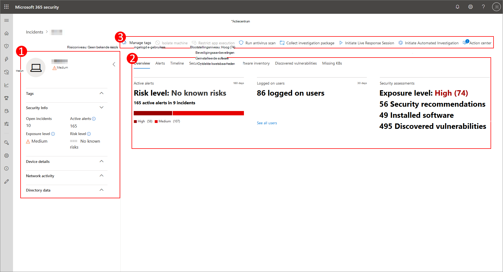

# De pagina apparaat ProfielDevice profile page

[!INCLUDE [Microsoft 365 Defender rebranding](../includes/microsoft-defender.md)]

Met de Microsoft 365-beveiligings Portal beschikt u over apparaatprofielen, zodat u snel de status en status van apparaten in uw netwerk kunt beoordelen.The Microsoft 365 security portal provides you with device profile pages, so you can quickly assess the health and status of devices on your network.

> [!IMPORTANT]
> De pagina apparaat-profiel kan enigszins afwijken, afhankelijk van of het apparaat is ingeschreven in Microsoft Defender for Endpoint, Microsoft Defender for Identity of beide.The device profile page may appear slightly different, depending on whether the device is enrolled in Microsoft Defender for Endpoint, Microsoft Defender for Identity, or both.

Als het apparaat is ingeschreven in Microsoft Defender for Endpoint, kunt u ook de profielpagina van het apparaat gebruiken om enkele veelvoorkomende beveiligingstaken uit te voeren.If the device is enrolled in Microsoft Defender for Endpoint, you can also use the device profile page to perform some common security tasks.

## Navigeren in de profielpagina van het apparaatNavigating the device profile page

De profielpagina is opgesplitst in diverse grote secties.The profile page is broken up into several broad sections.

De zijbalk (1) geeft een overzicht van de algemene Details van het apparaat.The sidebar (1) lists basic details about the device.

Het gebied met de hoofdinhoud (2) bevat tabbladen waarmee u kunt schakelen om verschillende soorten informatie over het apparaat weer te geven.The main content area (2) contains tabs that you can toggle through to view different kinds of information about the device.

Als het apparaat is ingeschreven in Microsoft Defender voor eindpunten, ziet u ook een lijst met antwoord acties (3).If the device is enrolled in Microsoft Defender for Endpoint, you will also see a list of response actions (3). Met antwoord acties kunt u veelvoorkomende taken uitvoeren met betrekking tot beveiliging.Response actions allow you to perform common security-related tasks.

## ProtectionSidebar

Naast het gebied met de hoofdinhoud van de profielpagina van het apparaat is de zijbalk.Beside the main content area of the device profile page is the sidebar.

De zijbalk bevat de volledige naam en het belichtings niveau van het apparaat.The sidebar lists the device's full name and exposure level. Het biedt ook enkele belangrijke basisinformatie in kleine subsecties die kunnen worden geopend of gesloten.It also provides some important basic information in small subsections which can be toggled open or closed, such as:

* **Tags** : Microsoft Defender for endpoints, Microsoft Defender for Identity of aangepaste labels die zijn gekoppeld aan het apparaat.**Tags** - Any Microsoft Defender for Endpoint, Microsoft Defender for Identity, or custom tags associated with the device. Tags van Microsoft Defender for Identity zijn niet bewerkbaar.Tags from Microsoft Defender for Identity are not editable.
* **Beveiligingsgegevens** -open incidenten en actieve meldingen.**Security info** - Open incidents and active alerts. Op apparaten die zijn geregistreerd in Microsoft Defender voor eindpunten, worden ook belichtings niveau en risiconiveau weergegeven.Devices enrolled in Microsoft Defender for Endpoint will also display exposure level and risk level.

> [!TIP]
> Belichtings niveau is afhankelijk van het aantal beveiligingsaanbevelingen, waarbij risiconiveau wordt berekend op basis van een aantal factoren, waaronder de typen en de ernst van actieve waarschuwingen.Exposure level relates to how much the device is complying with security recommendations, while risk level is calculated based on a number of factors, including the types and severity of active alerts.

* **Apparaatgegevens** : domein, besturingssysteem, tijdstempel van wanneer het apparaat voor het eerst werd gezien, IP-adressen, bronnen.**Device details** - Domain, OS, timestamp for when the device was first seen, IP addresses, resources. Op apparaten die zijn geregistreerd in Microsoft Defender voor eindpunten, wordt ook de status status weergegeven.Devices enrolled in Microsoft Defender for Endpoint also display health state. Apparaten die zijn ingeschreven in Microsoft Defender for Identity, tonen SAM-naam en een tijdstempel voor wanneer het apparaat voor het eerst is gemaakt.Devices enrolled in Microsoft Defender for Identity will display SAM name and a timestamp for when the device was first created.
* **Netwerkactiviteit** : tijdstempels voor de eerste keer en de laatste keer dat het apparaat is gedetecteerd op het netwerk.**Network activity** - Timestamps for the first time and last time the device was seen on the network.
* **Active Directory** [-vlaggen,](https://docs.microsoft.com/windows/security/identity-protection/user-account-control/user-account-control-overview) [spn's](https://docs.microsoft.com/windows/win32/ad/service-principal-names)en groepslidmaatschappen ( *alleen voor apparaten die zijn geregistreerd in Microsoft Defender for Identity* ).**Directory data** ( *only for devices enrolled in Microsoft Defender for Identity* ) - [UAC](https://docs.microsoft.com/windows/security/identity-protection/user-account-control/user-account-control-overview) flags, [SPNs](https://docs.microsoft.com/windows/win32/ad/service-principal-names), and group memberships.

## Antwoord actiesResponse actions

Antwoord acties bieden een snelle manier om bedreigingen te verdedigen en analyseren.Response actions offer a quick way to defend against and analyze threats.

> [!IMPORTANT]
> * [Antwoord acties](https://docs.microsoft.com/windows/security/threat-protection/microsoft-defender-atp/respond-machine-alerts) zijn alleen beschikbaar als het apparaat is ingeschreven in Microsoft Defender for Endpoint.[Response actions](https://docs.microsoft.com/windows/security/threat-protection/microsoft-defender-atp/respond-machine-alerts) are only available if the device is enrolled in Microsoft Defender for Endpoint.
> * Apparaten die zijn ingeschreven in Microsoft Defender voor eindpunten, kunnen verschillende nummers van antwoord acties weergeven, op basis van het besturingssysteem van het apparaat en van het versienummer.Devices that are enrolled in Microsoft Defender for Endpoint may display different numbers of response actions, based on the device's OS and version number.

Dit zijn de beschikbare acties op de profielpagina van het apparaat:Actions available on the device profile page include:

* **Tags beheren** : Hiermee worden aangepaste tags bijgewerkt die u hebt toegepast op dit apparaat.**Manage tags** - Updates custom tags you have applied to this device.
* **Isoleer apparaat** : isoleert het apparaat in het netwerk van uw organisatie en houdt het verbonden met Microsoft Defender voor eindpunt.**Isolate device** - Isolates the device from your organization's network while keeping it connected to Microsoft Defender for Endpoint. U kunt ervoor kiezen Outlook, teams en Skype voor bedrijven uit te voeren wanneer het apparaat is geïsoleerd voor communicatiedoeleinden.You can choose to allow Outlook, Teams, and Skype for Business to run while the device is isolated, for communication purposes.
* **Onderhoudscentrum** : de status van ingediende acties weergeven.**Action center** - View the status of submitted actions. Alleen beschikbaar als er nog een actie is geselecteerd.Only available if another action has already been selected.
* **App-uitvoering beperken** : verhindert toepassingen die niet door Microsoft worden uitgevoerd.**Restrict app execution** - Prevents applications that are not signed by Microsoft from running.
* **Voer antivirus scan uit** : updates voor Windows Defender antivirus en direct een antivirus scan uitvoeren.**Run antivirus scan** - Updates Windows Defender Antivirus definitions and immediately runs an antivirus scan. Kies tussen snelle scan of volledige scan.Choose between Quick scan or Full scan.
* **Onderzoek pakket verzamelen** : informatie over het apparaat verzamelen.**Collect investigation package** - Gathers information about the device. Wanneer het onderzoek is voltooid, kunt u het downloaden.When the investigation is completed, you can download it.
* **Live antwoordsessie starten** : Laad een externe shell op het apparaat voor [uitgebreid beveiligings onderzoek](https://docs.microsoft.com/windows/security/threat-protection/microsoft-defender-atp/live-response).**Initiate Live Response Session** - Loads a remote shell on the device for [in-depth security investigations](https://docs.microsoft.com/windows/security/threat-protection/microsoft-defender-atp/live-response).
* Automatisch **onderzoek initiëren** : Hiermee wordt de [bedreiging automatisch onderzocht en hersteld](https://docs.microsoft.com/microsoft-365/security/office-365-security/office-365-air).**Initiate automated investigation** - Automatically [investigates and remediates threats](https://docs.microsoft.com/microsoft-365/security/office-365-security/office-365-air). Hoewel u automatisch controles handmatig moet uitvoeren op deze pagina, activeren [bepaalde waarschuwings beleidsregels](https://docs.microsoft.com/microsoft-365/compliance/alert-policies?view=o365-worldwide#default-alert-policies) zichzelf automatisch onderzoek.Although you can manually trigger automated investigations to run from this page, [certain alert policies](https://docs.microsoft.com/microsoft-365/compliance/alert-policies?view=o365-worldwide#default-alert-policies) trigger automatic investigations on their own.
* **Onderhoudscentrum** : Hier vindt u informatie over eventuele antwoord acties die op dat moment actief zijn.**Action center** - Displays information about any response actions that are currently running.

## SectietabbladenTabs section

Op de tabbladen apparaat-profiel kunt u een overzicht van beveiligings Details over het apparaat en de tabellen met een lijst met waarschuwingen wisselen.The device profile tabs allow you to toggle through an overview of security details about the device, and tables containing a list of alerts.

In Microsoft Defender voor eindpunt ingeschreven apparaten worden ook tabbladen weergegeven met een tijdlijn, een lijst met beveiligingsaanbevelingen, een inventarisatie van de software, een lijst met ontdekte beveiligingslekken en ontbrekende KBs (beveiligingsupdates).Devices enrolled in Microsoft Defender for Endpoint will also display tabs that feature a timeline, a list of security recommendations, a software inventory, a list of discovered vulnerabilities, and missing KBs (security updates).

### Tabblad OverzichtOverview tab

Het standaardtabblad is **overzicht**.The default tab is **Overview**. Dit biedt een kort overzicht van het belangrijkste beveiligings feit van het apparaat.It provides a quick look at the most important security fact about the device.

Hier ziet u een beknopt overzicht van de actieve waarschuwingen van het apparaat en van gebruikers die momenteel zijn aangemeld.Here, you can get a quick look at the device's active alerts, and any currently logged on users.

Als het apparaat is ingeschreven in Microsoft Defender voor eindpunten, wordt ook het risiconiveau van het apparaat en de beschikbare gegevens op beveiligings beoordelingen weergegeven.If the device is enrolled in Microsoft Defender for Endpoint, you will also see the device's risk level and any available data on security assessments. Met de beveiligings beoordelingen wordt het belichtings niveau van het apparaat beschreven, aanbevelingen van beveiligingsaanbevelingen en betroffen software en ontdekte beveiligingslekken.The security assessments describe the device's exposure level, provide security recommendations, and list affected software and discovered vulnerabilities.

### Tabblad waarschuwingenAlerts tab

Het tabblad **waarschuwingen** bevat een lijst met waarschuwingen die op het apparaat zijn geactiveerd, van beide Microsoft Defender for Identity en Microsoft Defender for Endpoint.The **Alerts** tab contains a list of alerts that have been raised on the device, from both Microsoft Defender for Identity and Microsoft Defender for Endpoint.

U kunt het aantal weer te geven items aanpassen, evenals de kolommen die worden weergegeven voor elk item.You can customize the number of items displayed, as well as which columns are displayed for each item. Het standaardgedrag is een lijst van dertig items per pagina.The default behavior is to list thirty items per page.

De kolommen op dit tabblad bevatten informatie over de ernst van de bedreiging waarmee de waarschuwing werd geactiveerd, evenals de status, het onderzoek en de persoon aan wie de waarschuwing is toegewezen.The columns in this tab include information on the severity of the threat that triggered the alert, as well as status, investigation state, and who the alert has been assigned to.

De kolom *beïnvloede entiteiten* verwijst naar het apparaat (de entiteit) waarvan u momenteel kijkt, plus andere apparaten in het netwerk waarop dit van invloed is.The *impacted entities* column refers to the device (entity) whose profile you are currently viewing, plus any other devices in your network that are affected.

Wanneer u een item in deze lijst selecteert, wordt er een flyout met nog meer informatie over de geselecteerde waarschuwing geopend.Selecting an item from this list will open a flyout containing even more information about the selected alert.

U kunt deze lijst filteren op Ernst, status of de persoon aan wie de waarschuwing is toegewezen.This list can be filtered by severity, status, or who the alert has been assigned to.

### Het tabblad tijdlijnTimeline tab

Het tabblad **tijdlijn** bevat een interactieve, chronologische grafiek van alle gebeurtenissen die op het apparaat zijn geactiveerd.The **Timeline** tab includes an interactive, chronological chart of all events raised on the device. Als u het gemarkeerde gebied van de grafiek naar links of naar rechts verplaatst, kunt u gebeurtenissen over verschillende tijdsperioden weergeven.By moving the highlighted area of the chart left or right, you can view events over different periods of time. U kunt ook een aangepast datumbereik kiezen in de vervolgkeuzelijst tussen de interactieve grafiek en de lijst met gebeurtenissen.You can also choose a custom range of dates from the dropdown menu in between the interactive chart and the list of events.

Onder de grafiek bevindt zich een lijst met gebeurtenissen voor het geselecteerde datumbereik.Below the chart is a list of events for the selected range of dates.

Het aantal weergegeven items en de kolommen in de lijst kunnen beide worden aangepast.The number of items displayed and the columns on the list can both be customized. De lijst standaardkolommen de gebeurtenistijd, actieve gebruiker, actietype, entiteiten (processen) en aanvullende informatie over de gebeurtenis.The default columns list the event time, active user, action type, entities (processes), and additional information about the event.

Wanneer u een item in deze lijst selecteert, wordt er een flyout geopend met de grafiek gebeurtenis entiteiten, met daarin de bovenliggende en onderliggende processen van de gebeurtenis.Selecting an item from this list will open a flyout displaying an Event entities graph, showing the parent and child processes involved in the event.

De lijst kan worden gefilterd op het specifieke type gebeurtenis; bijvoorbeeld register gebeurtenissen of slim schermgebeurtenissen.The list can be filtered by the specific kind of event; for example, Registry events or Smart Screen Events.

U kunt de lijst ook exporteren naar een CSV-bestand als u het bestand wilt downloaden.The list can also be exported to a CSV file, for download. Hoewel het bestand niet beperkt is van een aantal gebeurtenissen, kunt u kiezen uit zeven dagen wanneer u wilt exporteren.Although the file is not limited by number of events, the maximum time range you can choose to export is seven days.

### Tabblad beveiligingsaanbevelingenSecurity recommendations tab

Het tabblad **beveiligingsaanbevelingen** bevat een lijst met acties die u kunt uitvoeren om het apparaat te beschermen.The **Security recommendations** tab lists actions you can take to protect the device. Wanneer u een item in deze lijst selecteert, wordt een flyout geopend waarin u instructies kunt krijgen voor het toepassen van de aanbeveling.Selecting an item on this list will open a flyout where you can get instructions on how to apply the recommendation.

Net als met de vorige tabbladen, het aantal weergegeven items per pagina en de kolommen die zichtbaar zijn, kunnen worden aangepast.As with the previous tabs, the number of items displayed per page, as well as which columns are visible, can be customized.

De standaardweergave bevat kolommen die de beantwoorde zwakke punten, de bijbehorende bedreiging, de bijbehorende component of software beïnvloedt door de bedreiging, en nog veel meer.The default view includes columns that detail the security weaknesses addressed, the associated threat, the related component or software affected by the threat, and more. Items kunnen worden gefilterd op de status van de aanbeveling.Items can be filtered by the recommendation's status.

### Software-inventarisatieSoftware inventory

Het tabblad **software-inventaris** bevat een overzicht van de software die op het apparaat is geïnstalleerd.The **Software inventory** tab lists software installed on the device.

In de standaardweergave wordt de softwareleverancier, het geïnstalleerde versienummer, het aantal bekende software-zwakke punten, bedreigings inzichten, productcode en tags weergegeven.The default view displays the software vendor, installed version number, number of known software weaknesses, threat insights, product code, and tags. Het aantal weer te geven items en welke kolommen worden weergegeven, kunnen beide worden aangepast.The number of items displayed and which columns are displayed can both be customized.

Wanneer u een item uit deze lijst selecteert, wordt een flyout geopend met meer informatie over de geselecteerde software, en het pad en de tijdstempel voor de laatste keer dat de software is gevonden.Selecting an item from this list opens a flyout containing more details about the selected software, as well as the path and timestamp for the last time the software was found.

Deze lijst kan worden gefilterd op productcode.This list can be filtered by product code.

### Tabblad ontdekte zwakke plekkenDiscovered vulnerabilities tab

Het tabblad **ontdekte beveiligingslekken** bevat veelvoorkomende problemen met CVEs die van invloed kunnen zijn op het apparaat.The **Discovered vulnerabilities** tab lists any Common Vulnerabilities and Exploits (CVEs) that may affect the device.

De standaardweergave toont de ernst van de CVE, de gang van de gangbare punten van het beveiligingslek (CVS), de software die is gerelateerd aan de CVE, wanneer de CVE werd gepubliceerd, wanneer de CVE voor het laatst is bijgewerkt en de Risico's die zijn gekoppeld aan de CVE.The default view lists the severity of the CVE, the Common Vulnerability Score (CVS), the software related to the CVE, when the CVE was published, when the CVE was last updated, and threats associated with the CVE.

Net als met de vorige tabbladen, zijn het aantal weer te geven items en welke kolommen zichtbaar zijn, kunnen worden aangepast.As with the previous tabs, the number of items displayed and which columns are visible can be customized.

Wanneer u een item in deze lijst selecteert, wordt een flyout geopend met de beschrijving van de CVE.Selecting an item from this list will open a flyout that describes the CVE.

### Ontbrekende KBsMissing KBs

Het **ontbrekende tabblad KBs** bevat een lijst met alle Microsoft-updates die nog op het apparaat moeten worden toegepast.The **Missing KBs** tab lists any Microsoft Updates that have yet to be applied to the device. De vraag ' KBs ' in het [Knowledge Base-artikel bevat Knowledge Base-artikelen](https://support.microsoft.com/help/242450/how-to-query-the-microsoft-knowledge-base-by-using-keywords-and-query) die deze updates beschrijven. bijvoorbeeld [KB4551762](https://support.microsoft.com/help/4551762/windows-10-update-kb4551762).The "KBs" in question are [Knowledge Base articles](https://support.microsoft.com/help/242450/how-to-query-the-microsoft-knowledge-base-by-using-keywords-and-query) which describe these updates; for example, [KB4551762](https://support.microsoft.com/help/4551762/windows-10-update-kb4551762).

De standaardweergave bevat het bulletin dat de updates, de versie van het besturingssysteem, de desbetreffende producten bevat, CVEs verholpen, het KB-nummer en de tags.The default view lists the bulletin containing the updates, OS version, products affected, CVEs addressed, the KB number, and tags.

Het aantal weergegeven items per pagina en welke kolommen worden weergegeven, kunnen worden aangepast.The number of items displayed per page and which columns are displayed can be customized.

Wanneer u een item selecteert, wordt een flyout geopend dat is gekoppeld aan de update.Selecting an item will open a flyout that links to the update.

## Verwante onderwerpenRelated topics

* [Overzicht van Microsoft 365 DefenderMicrosoft 365 Defender overview](microsoft-threat-protection.md)
* [Microsoft 365 Defender inschakelenTurn on Microsoft 365 Defender](mtp-enable.md)
* [Entiteiten op apparaten onderzoeken met Live antwoordInvestigate entities on devices, using live response](https://docs.microsoft.com/windows/security/threat-protection/microsoft-defender-atp/live-response)
* [Geautomatiseerd onderzoek en antwoord (lucht) in Office 365Automated investigation and response (AIR) in Office 365](https://docs.microsoft.com/microsoft-365/security/office-365-security/office-365-air)
