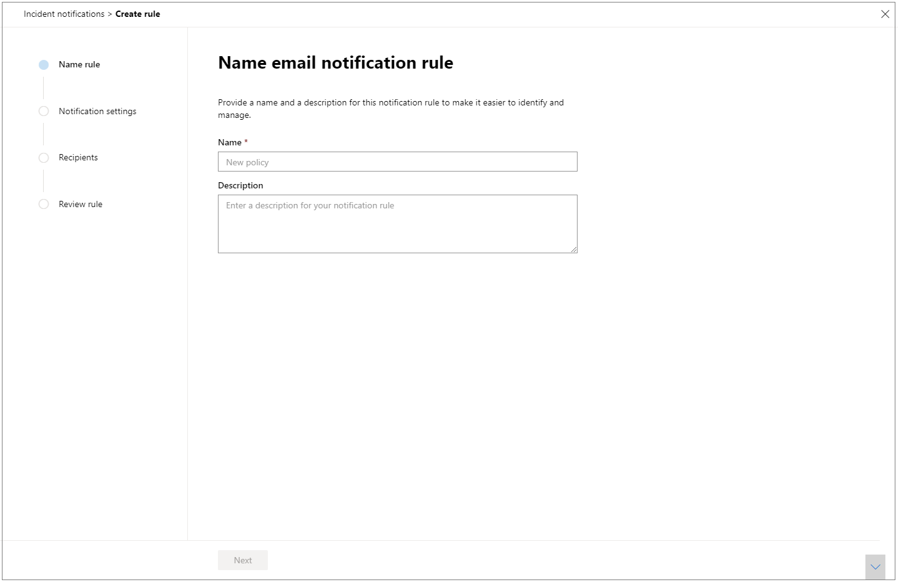
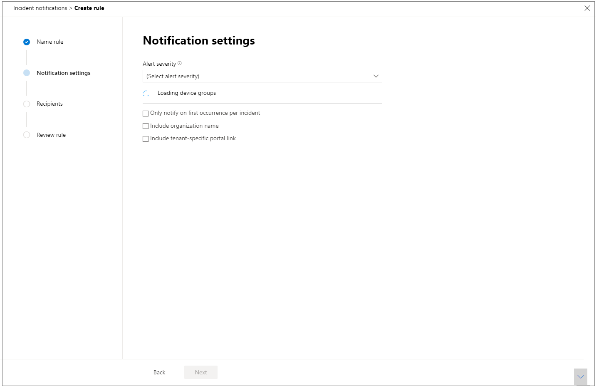
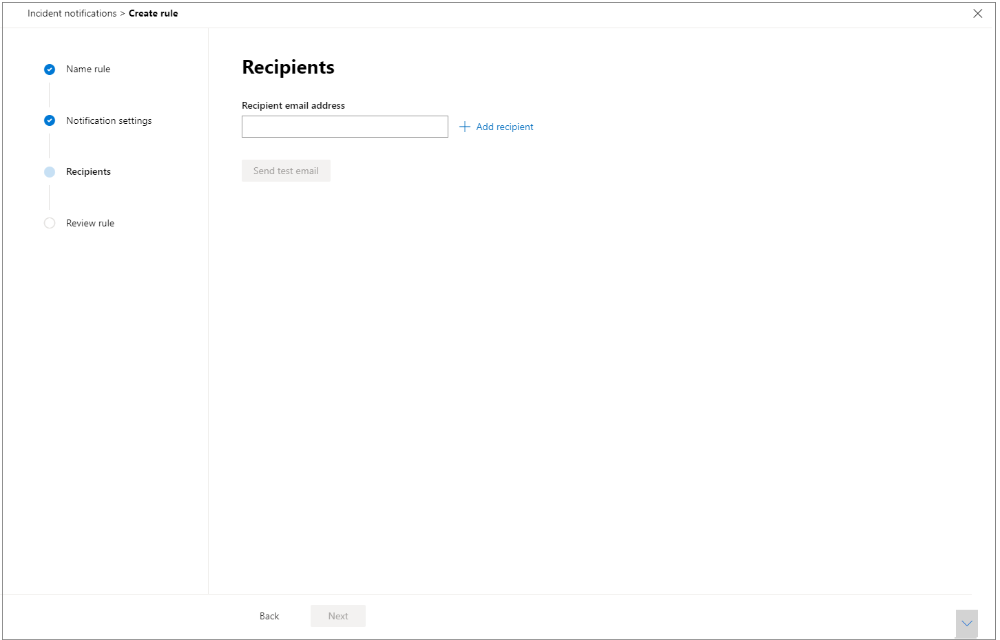

# Meldingen van incidenten per e-mail ontvangen

[!INCLUDE [Microsoft 365 Defender rebranding](../includes/microsoft-defender.md)]

**Van toepassing op:**
- Microsoft 365 Defender

U kunt Microsoft 365 Defender zo instellen dat u per e-mail op de hoogte wordt gehouden wanneer er nieuwe incidenten of nieuwe updates voor bestaande incidenten zijn. 

U kunt ervoor kiezen om meldingen te ontvangen op basis van de ernst van het incident of per apparaatgroep. U kunt er ook voor kiezen om alleen een melding te ontvangen bij de eerste update per incident.

U kunt geadresseerden toevoegen of verwijderen in de e-mailmeldingen. Nieuwe geadresseerden krijgen een melding over incidenten nadat ze zijn toegevoegd. 

De e-mailmelding bevat belangrijke details over het incident, zoals de naam van het incident, de ernst en de categorieën. U kunt ook rechtstreeks naar incidenten gaan, zodat u meteen een onderzoek kunt starten. Zie Incidenten onderzoeken [in Microsoft 365 Defender](./investigate-incidents.md)voor meer informatie over het onderzoeken van incidenten.

>[!NOTE]
>U hebt machtigingen voor beveiligingsinstellingen beheren nodig om instellingen voor e-mailmeldingen te configureren. Als u ervoor hebt gekozen om basismachtigingenbeheer te gebruiken, kunnen gebruikers met beveiligingsbeheerder- of globale beheerdersrollen e-mailmeldingen voor u configureren.    
Als uw organisatie op rollen gebaseerd toegangsbeheer (RBAC) gebruikt, kunt u alleen meldingen maken, bewerken, verwijderen en ontvangen op basis van apparaatgroepen die u mag beheren.

## Regels maken voor incidentenmeldingen

Als u uw eerste e-mailmelding voor incidenten wilt instellen, maakt u een nieuwe regel en past u de instellingen voor e-mailmeldingen aan.

1. Selecteer in het navigatiedeelvenster **Instellingen**  >  **Incident-e-mailmeldingen**.
2. Selecteer **Item toevoegen.**
3. Geef de regel een naam in **Naam en** geef een **beschrijving op.**

     
4. Selecteer **Volgende** om naar **Meldingsinstellingen te gaan.** Hier kunt u opgeven:
    - **Ernst van waarschuwing:** kies de ernst van de waarschuwing die een melding van een incident veroorzaakt. Als u bijvoorbeeld alleen op de hoogte wilt zijn van incidenten met hoge ernst, selecteert u Hoog.
    - **Bereik van apparaatgroep:** in deze vervolgkeuzekeuze wordt alle apparaatgroepen weergegeven die de gebruiker kan openen. Selecteer voor welke apparaatgroepen u de regels voor incidentenmelding maakt.
    - **Alleen een melding bij eerste incident:** als u deze optie selecteert, wordt alleen een e-mailmelding verzonden bij de eerste waarschuwing die overeenkomt met uw andere selecties. Latere updates of waarschuwingen met betrekking tot het incident leiden niet tot een melding.
    - **Naam van organisatie opnemen:** geeft aan of de klantnaam wordt weergegeven in de e-mailmelding of niet.
    - **Tenantspecifieke portalkoppeling opnemen:** hiermee voegt u een koppeling met de tenant-id toe om toegang tot een specifieke tenant toe te staan.
    
    
5. Selecteer **Volgende** om naar de **sectie Geadresseerden te** gaan. Hier kunt u e-mailadressen opgeven die de meldingen voor incident-e-mail ontvangen. Selecteer **Een geadresseerde toevoegen nadat** u elk e-mailadres hebt typen.

     

6. Selecteer ten slotte **Volgende om** naar Regel controleren **te gaan,** zodat u alle instellingen kunt zien die aan de nieuwe regel zijn gekoppeld. Geadresseerden ontvangen incidentmeldingen via e-mail op basis van de instellingen.

## Zie ook
- [Overzicht van incidenten in Microsoft 365 Defender](./incidents-overview.md)
- [Prioriteit geven aan incidenten in Microsoft 365 Defender](./incident-queue.md)
- [Incidenten in Microsoft 365 Defender onderzoeken](./investigate-incidents.md)