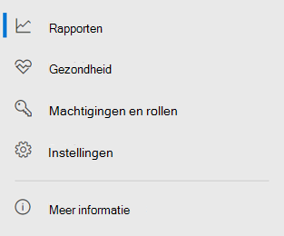

# Microsoft Defender voor Eindpunt in het Microsoft 365-beveiligingscentrum

[!INCLUDE [Microsoft 365 Defender rebranding](../includes/microsoft-defender.md)]

[!INCLUDE [Prerelease](../includes/prerelease.md)]

**Van toepassing op:**

- [Microsoft 365 Defender](./microsoft-threat-protection.md)
- [Microsoft Defender for Endpoint](https://go.microsoft.com/fwlink/p/?linkid=2146631)
- [Microsoft Defender voor Office 365](../office-365-security/office-365-atp.md)

Het verbeterde [Microsoft 365-beveiligingscentrum](overview-security-center.md) combineert beveiligingsfuncties die e-mail, samenwerking, identiteit en apparaatbedreigingen beveiligen, detecteren, [https://security.microsoft.com](https://security.microsoft.com) onderzoeken en erop reageren. Dit beveiligingscentrum brengt functionaliteit samen van bestaande Microsoft-beveiligingsportalen, waaronder Microsoft Defender Security Center en het Office 365-beveiligingscentrum & Compliancecentrum.

Als u bekend bent met het Microsoft Defender-beveiligingscentrum, worden in dit artikel enkele wijzigingen en verbeteringen in het verbeterde Microsoft 365-beveiligingscentrum beschreven. Er zijn echter enkele nieuwe en bijgewerkte elementen waar u rekening mee moet houden.

In het verleden [was het Microsoft Defender-beveiligingscentrum](/windows/security/threat-protection/microsoft-defender-atp/portal-overview) de thuisbasis van Microsoft Defender voor Eindpunt. Beveiligingsteams van ondernemingen hebben deze gebruikt om waarschuwingen van potentiële geavanceerde permanente bedreigingsactiviteit of datalekken te controleren en te helpen beantwoorden. Om het aantal portals te verminderen, is het Microsoft 365-beveiligingscentrum de thuisbasis voor het bewaken en beheren van beveiliging in uw Microsoft-identiteiten, gegevens, apparaten, apps en infrastructuur.

Microsoft Defender voor Eindpunt in het Microsoft 365-beveiligingscentrum ondersteunt het verlenen van toegang tot beheerde [beveiligingsserviceproviders (MSSP's)](/windows/security/threat-protection/microsoft-defender-atp/grant-mssp-access) op dezelfde manier als toegang wordt verleend in het [Microsoft Defender-beveiligingscentrum.](mssp-access.md)

> [!IMPORTANT]
> Wat u ziet in het Microsoft 365-beveiligingscentrum, is afhankelijk van uw huidige abonnementen. Als u bijvoorbeeld geen licentie voor Microsoft Defender voor Office 365 hebt, wordt de sectie E-mail & samenwerking niet weergegeven.

>[!Note]
>De nieuwe geïntegreerde portal is niet beschikbaar voor:
>- Us Government Community Cloud (GCC)
>- US Government Community Cloud High (GCC High)
>- Amerikaanse ministerie van Defensie
>- Alle Amerikaanse overheidsinstellingen met commerciële licenties

Bekijk het verbeterde Microsoft 365-beveiligingscentrum: [https://security.microsoft.com](https://security.microsoft.com) .

Meer informatie over de voordelen: [Overzicht van het Microsoft 365-beveiligingscentrum](overview-security-center.md)

## Wat is er gewijzigd

Deze tabel is een beknopt overzicht van de wijzigingen tussen het Microsoft Defender-beveiligingscentrum en het Microsoft 365-beveiligingscentrum.

### Waarschuwingen en acties

|**Gebied**  |**Beschrijving van wijziging**  |
|---------|---------|
| [Incidenten & waarschuwingen](incidents-overview.md)  | In het Microsoft 365-beveiligingscentrum kunt u incidenten en waarschuwingen beheren voor al uw eindpunten, e-mail en identiteiten. We hebben de ervaring geconvergeerd om u te helpen gerelateerde gebeurtenissen gemakkelijker te vinden. Zie Overzicht van [incidenten voor meer informatie.](incidents-overview.md)   |
| [Jagen](advanced-hunting-overview.md)  |  Als u aangepaste detectieregels wijzigt die zijn gemaakt in Microsoft Defender voor Eindpunt om identiteits- en e-mailtabellen op te nemen, worden deze automatisch verplaatst naar Microsoft 365 Defender. De bijbehorende waarschuwingen worden ook weergegeven in Microsoft 365 Defender. Lees Aangepaste detectieregels migreren voor meer informatie over [deze wijzigingen.](advanced-hunting-migrate-from-mdatp.md#migrate-custom-detection-rules)   De `DeviceAlertEvents` tabel voor geavanceerde jacht is niet beschikbaar in Microsoft 365 Defender. Als u apparaatspecifieke waarschuwingsgegevens wilt opvragen in Microsoft 365 Defender, kunt u de tabellen en tabellen gebruiken om nog meer informatie uit `AlertInfo` diverse bronnen op te `AlertEvidence` vragen. Maak uw volgende apparaatgerelateerde query door [Schrijfquery's te volgen zonder DeviceAlertEvents.](advanced-hunting-migrate-from-mdatp.md#write-queries-without-devicealertevents)|
|[Actiecentrum](mtp-action-center.md)    | Lijsten in behandeling en voltooide acties die zijn uitgevoerd na geautomatiseerde onderzoeken en herstelacties. Voorheen werd het Actiecentrum in het Microsoft Defender-beveiligingscentrum vermeld in behandeling en voltooide acties voor herstelacties die alleen op apparaten zijn uitgevoerd, terwijl automatische onderzoeken waarschuwingen en status vermeldden. In het verbeterde Microsoft 365-beveiligingscentrum worden in het Actiecentrum herstelacties en onderzoeken op e-mail, apparaten en gebruikers bijeengeplaatst, allemaal op één locatie.  |
| [Dreigingsanalyse](threat-analytics.md) |  Verplaatst naar de bovenkant van de navigatiebalk voor eenvoudigere detectie en gebruik. Bevat nu bedreigingsgegevens voor zowel eindpunten als e-mail en samenwerking.    |

### Eindpunten

|**Gebied**  |**Beschrijving van wijziging**  |
|---------|---------|
|Zoeken   |  In plaats van in de kop te staan, wordt de zoekbalk van Microsoft Defender voor Eindpunt verplaatst onder de sectie Eindpunten. U kunt blijven zoeken naar apparaten, bestanden, gebruikers, URL's, IPs, beveiligingslekken, software en aanbevelingen.  |
|[Dashboard](/windows/security/threat-protection/microsoft-defender-atp/security-operations-dashboard)   |  Dit is uw dashboard voor beveiligingsbewerkingen. Bekijk een overzicht van het aantal actieve waarschuwingen dat is geactiveerd, welke apparaten risico lopen, welke gebruikers risico lopen en het ernstniveau voor waarschuwingen, apparaten en gebruikers. U kunt ook zien of apparaten sensorproblemen hebben, uw algehele service-status en hoe er niet-opgeloste waarschuwingen zijn gedetecteerd. |
|Apparaatvoorraad | Geen wijzigingen. |
|[Beveiligingsprobleembeheer](/windows/security/threat-protection/microsoft-defender-atp/next-gen-threat-and-vuln-mgt)    |    De naam is ingekort om in het navigatiedeelvenster te passen. Het is hetzelfde als de sectie bedreigings- en kwetsbaarheidsbeheer, met alle pagina's eronder.     |
| Partners en API's | Geen wijzigingen. |
| Evaluaties & zelfstudies    |     Nieuwe test- en leermogelijkheden.     |
| Configuratiebeheer   |  Geen wijzigingen.  |

> [!NOTE]
> **Automatisch onderzoek en herstel** maakt nu deel uit van incidenten. U kunt gebeurtenissen voor automatisch onderzoek en herstel zien op het **tabblad Incident > Onderzoek.**

### Toegang en rapportage

|**Gebied**  |**Beschrijving van wijziging**  |
|---------|---------|
| Rapporten  | Zie rapporten voor eindpunten en e-mail & samenwerking, waaronder bedreigingsbeveiliging, apparaattoestand en -naleving en Kwetsbare apparaten. |
| Gezondheid  |  Momenteel wordt een koppeling gemaakt naar de pagina 'Service-status' in het [Microsoft 365-beheercentrum.](https://admin.microsoft.com/) |
| Instellingen |  Beheer uw instellingen voor het Microsoft 365-beveiligingscentrum, Microsoft 365 Defender, Eindpunten, E-mail & samenwerking, Identiteiten en Apparaatdetectie.   |

## Microsoft 365-beveiligingsnavigatie en -mogelijkheden

De linkernavigatiebalk of snelstartbalk ziet er vertrouwd uit. Er zijn echter enkele nieuwe en bijgewerkte elementen in dit beveiligingscentrum.

### Incidenten en waarschuwingen

Brengt incident- en waarschuwingsbeheer samen op uw e-mail, apparaten en identiteiten. De waarschuwingspagina biedt volledige context voor de waarschuwing door aanvalssignalen te combineren om een gedetailleerd verhaal te maken. Een nieuwe, geïntegreerde ervaring biedt nu een consistente weergave van waarschuwingen voor werkbelastingen. U kunt snel triage, onderzoeken en effectieve actie ondernemen.

- [Meer informatie over incidenten](incidents-overview.md)
- [Meer informatie over het beheren van waarschuwingen](investigate-alerts.md)

### Jagen

Zoek proactief naar bedreigingen, malware en schadelijke activiteiten in uw eindpunten, Office 365-postvakken en meer met behulp van geavanceerde [zoekquery's.](advanced-hunting-overview.md) Deze krachtige query's kunnen worden gebruikt om bedreigingsindicatoren en entiteiten te zoeken en te controleren op bekende en potentiële bedreigingen.

[Aangepaste detectieregels kunnen](custom-detection-rules.md) worden gemaakt van geavanceerde zoekquery's om u te helpen proactief te kijken naar gebeurtenissen die een indicatie kunnen zijn van inbreukactiviteit en verkeerd geconfigureerde apparaten.

### Actiecentrum

Actiecentrum toont de onderzoeken die zijn gemaakt door geautomatiseerde onderzoeks- en antwoordmogelijkheden. Deze automatische, zelfherstellende werking in Microsoft 365 Defender kan beveiligingsteams helpen door automatisch te reageren op specifieke gebeurtenissen.

[Meer informatie over het Actiecentrum](mtp-action-center.md)

### Bedreigingsanalyse

Krijg bedreigingsinformatie van deskundige Microsoft-beveiligingsonderzoekers. Bedreigingsanalyse helpt beveiligingsteams efficiënter te werken wanneer ze geconfronteerd worden met nieuwe bedreigingen. Bedreigingsanalyse omvat:

- E-mailgerelateerde detecties en mitigaties van Microsoft Defender voor Office 365. Dit komt bovenop de eindpuntgegevens die al beschikbaar zijn in Microsoft Defender voor Eindpunt.
- De weergave Incidenten met betrekking tot de bedreigingen.
- Verbeterde ervaring voor het snel identificeren en gebruiken van actiebare informatie in de rapporten.

U hebt toegang tot bedreigingsanalyse via de navigatiebalk linksboven in het Microsoft 365-beveiligingscentrum of via een speciale dashboardkaart met de belangrijkste bedreigingen voor uw organisatie.

Meer informatie over het bijhouden en beantwoorden van nieuwe [bedreigingen met bedreigingsanalyses](./threat-analytics.md)

### Sectie Eindpunten

De beveiliging van eindpunten in uw organisatie weergeven en beheren. Als u het Microsoft Defender-beveiligingscentrum hebt gebruikt, ziet het er vertrouwd uit.

### Access en rapporten

Rapporten weergeven, uw instellingen wijzigen en gebruikersrollen wijzigen.

### SIEM API-verbindingen

Als u de [SIEM-API van Defender voor Eindpunt gebruikt,](/windows/security/threat-protection/microsoft-defender-atp/enable-siem-integration.md)kunt u dit blijven doen. We hebben nieuwe koppelingen toegevoegd op de API-payload die naar de waarschuwingspagina of de pagina met incidenten in de Microsoft 365-beveiligingsportal wijzen. Nieuwe API-velden zijn LinkToMTP en IncidentLinkToMTP. Zie Accounts omleiden van Microsoft Defender voor Eindpunt naar [het Microsoft 365-beveiligingscentrum](./microsoft-365-security-mde-redirection.md)voor meer informatie.

### E-mailwaarschuwingen

U kunt e-mailwaarschuwingen blijven gebruiken voor Defender voor Eindpunt. We hebben nieuwe koppelingen toegevoegd in de e-mailberichten die naar de waarschuwingspagina of de incidentpagina in het Microsoft 365-beveiligingscentrum wijzen. Zie Accounts omleiden van Microsoft Defender voor Eindpunt naar [het Microsoft 365-beveiligingscentrum](./microsoft-365-security-mde-redirection.md)voor meer informatie.

## Gerelateerde informatie

- [Microsoft 365-beveiligingscentrum](overview-security-center.md)
- [Microsoft Defender voor Eindpunt in het Microsoft 365-beveiligingscentrum](microsoft-365-security-center-mde.md)
- [Accounts omleiden van Microsoft Defender voor Eindpunt naar het Microsoft 365-beveiligingscentrum](microsoft-365-security-mde-redirection.md)