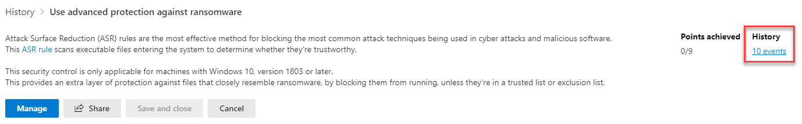
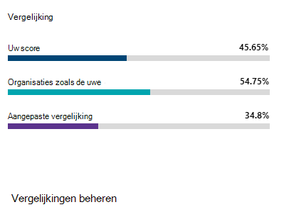
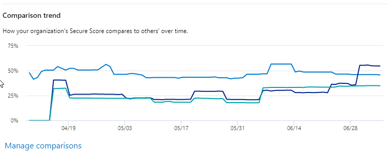

# De geschiedenis van uw Microsoft Secure Score bijhouden en bereikenTrack your Microsoft Secure Score history and meet goals

[Secure Score van Microsoft](microsoft-secure-score.md) is een afmeting van de beveiligings Posture van een organisatie, met een hoger nummer voor het uitvoeren van extra verbeterings acties.[Microsoft Secure Score](microsoft-secure-score.md) is a measurement of an organization's security posture, with a higher number indicating more improvement actions taken. U vindt het https://security.microsoft.com/securescore in [microsoft 365 Beveiligingscentrum](overview-security-center.md).It can be found at https://security.microsoft.com/securescore in the [Microsoft 365 security center](overview-security-center.md).

## Inzicht krijgen in activiteiten die van invloed zijn op uw ScoreGain insights into activity that has affected your score

Bekijk een grafiek van de Score van uw organisatie in de loop van de tijd op het tabblad **geschiedenis** .View a graph of your organization's score over time in the **History** tab.

Onder de grafiek bevindt zich een lijst met alle acties die zijn gemaakt in het geselecteerde tijdsbereik en de bijbehorende kenmerken, zoals de resultaten van de uitkomst, en de categorie.Below the graph is a list of all the actions taken in the selected time range and their attributes, such as resulting points and category. U kunt een datumbereik en de categorie filteren op categorie aanpassen.You can customize a date range and filter by category.

Als u de actie voor verbetering van een activiteit selecteert, wordt de actie flyout voor de volledige verbetering weergegeven.If you select the improvement action associated with an activity, the full improvement action flyout will appear.

Als u alle geschiedenis voor de specifieke actie voor verbetering wilt bekijken, selecteert u de koppeling geschiedenis in het vervolgmenu.To view all history for that specific improvement action, select the history link in the flyout.

## Trends ontdekken en doelstellingen instellenDiscover trends and set goals

In het tabblad **statistieken & trends** zijn er verschillende grafieken en grafieken waarmee u inzicht kunt krijgen in trends en doelstellingen kunt instellen.In the **Metrics & trends** tab, there are several graphs and charts to give you more visibility into trends and set goals. U kunt het datumbereik voor de hele pagina met visualisaties instellen.You can set the date range for the whole page of visualizations. De visualisaties zijn:The visualizations include:

* **De beveiligde Score zone** , aangepast op basis van de doelstellingen en definities van uw organisatie**Your Secure Score zone** - Customized based on your organization's goals and definitions of good, okay, and bad score ranges.
* **Regressie trend** : een tijdlijn van punten met regressed vanwege configuratie-, gebruikers-of apparaat-wijzigingen.**Regression trend** - A timeline of points that have regressed because of configuration, user, or device changes.  
* **Vergelijkings trend** -hoe de Secure Score van uw organisatie vergelijkt met de verschillende tijd.**Comparison trend** - How your organization's Secure Score compares to others' over time. In deze weergave kunt u lijnen opnemen die het gemiddelde van de score voor bedrijven met een vergelijkbaar aantal gelijke stoelen en een aangepaste vergelijkings weergave kunnen instellen.This view can include lines representing the score average of organizations with similar seat count and a custom comparison view that you can set.
* **Trend van risico acceptatie** -tijdlijn met verbeterings acties gemarkeerd als risico geaccepteerd.**Risk acceptance trend** - Timeline of improvement actions marked as "risk accepted."
* **Wijzigingen van scores** : het aantal bereikte punten, punten regressed, samen met de wijziging van de eerstvolgende Score in het opgegeven datumbereik.**Score changes** - The number of points achieved, points regressed, along with the subsequent score change, in the specified date range.

### Uw score vergelijken met organisaties zoals uCompare your score to organizations like yours

Er zijn twee locaties om te zien hoe uw score wordt vergeleken met organisaties die vergelijkbaar zijn met u.There are two places to see how your score compares to organizations that are similar to you.

De eerste locatie bevindt zich op het tabblad **overzicht** , waar u een vergelijkings balk diagram kunt zien.The first place is in the **Overview** tab, where you can see a comparison bar graph. Plaats de muisaanwijzer op de grafiek om de score en de verkoopkans weer te geven.Hover over the chart to view the score and score opportunity.

De tweede locatie bevindt zich op het tabblad **trends van &** , waar u kunt zien hoe de veilige Score van uw organisatie wordt vergeleken met anderen.The second place is in the **Metrics & trends** tab, where you can view how your organization's Secure Score compares to others' over time.

U kunt in beide grafieken de optie **vergelijkingen beheren** selecteren om de gegevens van uw organisatie weer te geven en te bewerken.In both charts, you can select **Manage comparisons** to view and edit your organization's information. U kunt ook een aangepaste vergelijking maken op basis van sector, organisatie formaat, licenties en regio's.You can also create a custom comparison based on industry, organization size, licenses, and regions.

## We horen graag van uWe want to hear from you

Als u problemen ondervindt, kunt u het ons laten weten dat u de community [beveiliging, Privacy & naleving](https://techcommunity.microsoft.com/t5/Security-Privacy-Compliance/bd-p/security_privacy) .If you have any issues, let us know by posting in the [Security, Privacy & Compliance](https://techcommunity.microsoft.com/t5/Security-Privacy-Compliance/bd-p/security_privacy) community. We volgen de community en bieden hulp.We're monitoring the community and will provide help.

## Verwante informatiebronnenRelated resources

- [Overzicht van Microsoft Secure ScoreMicrosoft Secure Score overview](microsoft-secure-score.md)
- [Uw beveiligingspositie vaststellenAssess your security posture](microsoft-secure-score-improvement-actions.md)
- [Binnenkort beschikbaarWhat's coming](microsoft-secure-score-whats-coming.md)
- [Wat is er nieuwWhat's new](microsoft-secure-score-whats-new.md)