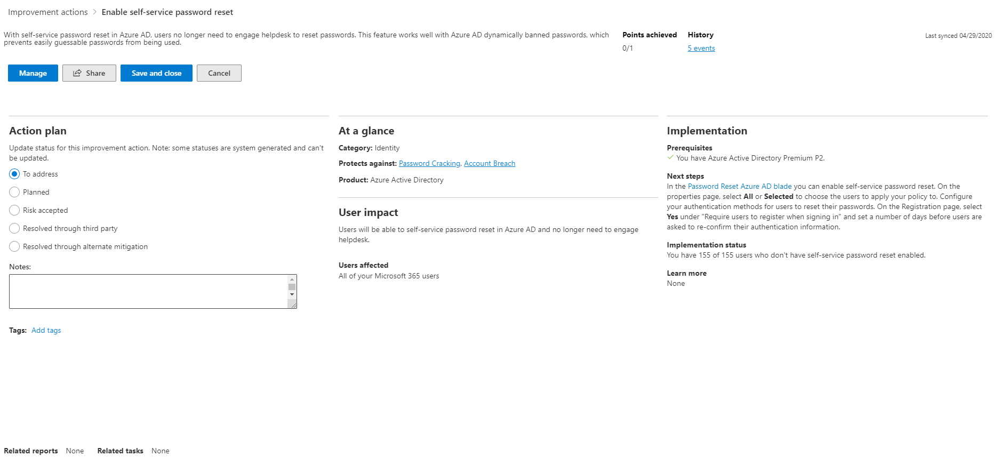

# Microsoft Secure Score

Microsoft Secure Score is een meting van de beveiligingshouding van een organisatie, waarbij een hoger aantal aangeeft dat er meer verbeteringsacties worden ondernomen. Het kan worden gevonden op https://security.microsoft.com/securescore in de [Microsoft 365 security center](overview-security-center.md).

Als u de aanbevelingen voor de securescore volgt, u uw organisatie beschermen tegen bedreigingen. Vanuit een gecentraliseerd dashboard in het Microsoft 365-beveiligingscentrum kunnen organisaties de beveiliging van hun Microsoft 365-identiteiten, gegevens, apps, apparaten en infrastructuur bewaken en werken.

Secure Score helpt organisaties:  

* Rapporteer over de huidige status van de beveiligingshouding van de organisatie.
* Verbeter hun beveiligingshouding door vindbaarheid, zichtbaarheid, begeleiding en controle te bieden.  
* Vergelijk met benchmarks en stel key performance indicators (KPI's) vast.

Organisaties krijgen toegang tot robuuste visualisaties van statistieken en trends, integratie met andere Microsoft-producten, scorevergelijking met vergelijkbare organisaties en nog veel meer. De score kan ook reflecteren wanneer oplossingen van derden aanbevolen acties hebben aangepakt.

## Hoe het werkt

U krijgt punten voor het configureren van aanbevolen beveiligingsfuncties, het uitvoeren van beveiligingstaken of het aanpakken van de verbeteringsactie met een toepassing of software van derden, of een alternatieve beperking. Sommige verbeteringsacties geven alleen punten wanneer deze volledig zijn voltooid en sommige geven gedeeltelijke punten als ze voor sommige apparaten of gebruikers zijn voltooid. Als u een van de verbeteracties niet of wilt uitvoeren, u ervoor kiezen om het risico of het resterende risico te accepteren.

We laten u de volledige set van mogelijke verbeteringen zien, ongeacht de licentie, zodat u de best practices voor beveiliging begrijpen en uw score verbeteren. Uw absolute beveiligingshouding wordt vertegenwoordigd door Secure Score, dat hetzelfde blijft, ongeacht welk productlicentie uw organisatie bezit. Houd er rekening mee dat beveiliging moet worden afgewogen tegen bruikbaarheid, en niet elke aanbeveling kan werken voor uw omgeving.

Uw score wordt in realtime bijgewerkt om de informatie weer te geven die wordt weergegeven in de visualisaties en actiepagina's voor verbetering. Secure Score synchroniseert ook dagelijks om systeemgegevens te ontvangen over uw behaalde punten voor elke actie.

### Hoe verbeteracties worden beoordeeld

Elke verbeteringsactie is 10 punten of minder waard. De meeste worden op een binaire manier gescoord - als u de verbeteringsactie implementeert, zoals het maken van een nieuw beleid of een specifieke instelling inschakelen, krijgt u 100% van de punten. Voor andere verbeteringsacties worden punten gegeven als een percentage van de totale configuratie. Bijvoorbeeld, als de verbetering actie staten krijg je 10 punten door het beschermen van al uw gebruikers met multi-factor authenticatie en je hebt slechts 50 van de 100 totale gebruikers beschermd, zou je een gedeeltelijke score van 5 punten (50 beschermd / 100 totaal * 10 max ptn = 5 pts gedeeltelijke score).

### Producten die zijn opgenomen in Secure Score

Momenteel zijn er aanbevelingen voor Microsoft 365 (inclusief Exchange Online), Azure AD, Microsoft Defender ATP, Azure ATP en Cloud App Security. Aanbevelingen voor andere beveiligingsproducten komen binnenkort. De aanbevelingen hebben niet betrekking op alle aanvalsoppervlakken die aan elk product zijn gekoppeld, maar ze zijn een goede basislijn. U de verbeteringsacties ook markeren als gedekt door een derde partij of alternatieve mitigatie.

### Standaardinstellingen voor beveiliging

Microsoft Secure Score heeft [verbeteringsacties](https://docs.microsoft.com/azure/active-directory/fundamentals/concept-fundamentals-security-defaults)bijgewerkt om beveiligingsstandaarden in Azure Active Directory te ondersteunen, waardoor het eenvoudiger wordt om uw organisatie te beschermen met vooraf geconfigureerde beveiligingsinstellingen voor veelvoorkomende aanvallen.

Als u beveiligingsstandaarden inschakelt, krijgt u volledige punten voor de volgende verbeteringsacties:

- Zorg ervoor dat alle gebruikers meervoudige verificatie kunnen voltooien voor beveiligde toegang (9 punten)
- MFA vereisen voor administratieve rollen (10 punten)
- Beleid inschakelen om verouderde verificatie te blokkeren (7 punten)

>[!IMPORTANT]
>Beveiligingsstandaarden bevatten beveiligingsfuncties die vergelijkbare beveiliging bieden als de verbeteringsacties 'aanmeldingsrisicobeleid' en 'gebruikersrisicobeleid'. In plaats van dit beleid naast de beveiligingsstandaarden in te stellen, raden we u aan hun statussen bij te werken naar 'Opgelost via alternatieve mitigatie'.

## Vereiste machtigingen

Als u toestemming wilt hebben voor toegang tot Microsoft Secure Score, moet u een van de volgende rollen in Azure Active Directory toegewezen krijgen.

### Rollen lezen en schrijven

Met lees- en schrijftoegang u wijzigingen aanbrengen en direct communiceren met Secure Score. U ook alleen-lezen toegang toewijzen aan andere gebruikers.

* Globale beheerder
* Beveiligingsbeheerder
* Exchange-beheerder
* SharePoint-beheerder
* Accountbeheerder

### Alleen-lezen rollen

Met alleen-lezen toegang u geen status of notities bewerken voor een verbeteringsactie, scorezones bewerken of aangepaste vergelijkingen bewerken.

* Helpdeskbeheerder
* Gebruikersbeheerder
* Servicebeheerder
* Beveiligingslezer
* Beveiligingsoperator
* Algemene lezer

## Krijg inzicht in uw beveiligingshouding

Om u sneller te helpen met de informatie die u nodig hebt, worden de verbeteracties van Microsoft in groepen georganiseerd:

* Identiteit (Azure AD-accounts & rollen)
* Gegevens (Microsoft Information Protection)
* Apparaat (Microsoft Defender ATP, bekend als [Configuratiescore](https://docs.microsoft.com/windows/security/threat-protection/microsoft-defender-atp/configuration-score))
* App (e-mail- en cloud-apps, waaronder Office 365 en Microsoft Cloud App Security)
* Infrastructuur (voorlopig geen verbeteringsacties)

>[!NOTE]
>In de recente release van Microsoft Secure Score is een verbeterd scoremodel uitgebracht waardoor Microsoft Secure Score tijdelijk niet compatibel is met Identity Secure Score en de Graph API. [Details weergeven](microsoft-secure-score.md#incompatibility-with-identity-secure-score-and-graph-api)

Op de overzichtspagina van Microsoft Secure Score u zien hoe punten worden verdeeld tussen deze groepen en welke punten beschikbaar zijn. De overzichtspagina is ook de plek om een all-up weergave te krijgen van de totale score, historische trend van uw veilige score met benchmarkvergelijkingen en geprioriteerde verbeteracties die kunnen worden genomen om uw score te verbeteren.

## Onderneem actie om je score te verbeteren

Op het tabblad **Verbeteracties** worden de beveiligingsaanbevelingen weergegeven die mogelijke aanvalsoppervlakken aanpakken, samen met hun status (om aan te pakken, gepland, risico geaccepteerd, opgelost via derden, opgelost door alternatieve mitigatie en voltooid). U alle verbeteracties zoeken, filteren en groeperen.  

### Ranking

Ranking is gebaseerd op het aantal resterende punten dat nog moet worden bereikt, implementatieproblemen, gebruikersimpact en complexiteit. De hoogst gerangschikte verbeteringsacties hebben een groot aantal punten die met lage moeilijkheidsgraad, gebruikerseffect, en ingewikkeldheid blijven.

### Details van de verbeteringsactie weergeven

Wanneer u een specifieke verbeteringsactie selecteert, wordt een flyout voor de volledige pagina weergegeven.  

 *figuur 2: Flyout voor de actie verbetering*

Als u de actie wilt voltooien, hebt u een aantal opties:

* Selecteer **Beheren** om het configuratiescherm te gaan en de wijziging aan te brengen. U krijgt dan de punten die de actie waard is, zichtbaar in de fly out. Punten duren over het algemeen ongeveer 24 uur om te updaten.

* Selecteer **Delen** om de directe koppeling naar de verbeteringsactie te kopiëren of kies het platform om de koppeling te delen, zoals e-mail, Microsoft Teams, Microsoft Planner of ServiceNow. Als u ServiceNow selecteert, u een wijzigingsticket maken dat zichtbaar is in ServiceNow en het microsoft 365-beveiligingscentrum thuis. Zie [Microsoft 365 Security Center en ServiceNow-integratie](tickets-security-center.md)voor meer informatie.

### Een status voor verbeteringsactie kiezen

Kies statussen en nota's die specifiek zijn voor de verbeteringsactie. De beelden die u selecteren zijn de volgende:

* **Aan te pakken** - U erkent dat de verbetering actie nodig is en van plan om het aan te pakken op een bepaald punt in de toekomst. Deze status is ook van toepassing op acties die gedeeltelijk worden gedetecteerd, maar niet volledig zijn voltooid.
* **Gepland** — Er zijn concrete plannen om de verbeteractie af te ronden.
* **Geaccepteerde risico's** — Beveiliging moet altijd in evenwicht zijn met bruikbaarheid, en niet elke aanbeveling zal werken voor uw omgeving. Wanneer dat het geval is, u ervoor kiezen om het risico, of het resterende risico te accepteren, en niet de verbetering actie uit te voeren. U krijgt geen punten, maar de actie is niet langer zichtbaar in de lijst met verbeteracties. U deze actie in de geschiedenis bekijken of op elk gewenst moment ongedaan maken.
* **Opgelost via derden** en **opgelost door alternatieve mitigatie** - De verbeteringsactie is al verholpen door een toepassing of software van derden of een intern hulpmiddel. U krijgt de punten die de actie waard is, zodat uw score beter weerspiegelt uw algehele veiligheid houding. Als een derde partij of intern gereedschap het besturingselement niet meer dekt, u een andere status kiezen. Houd er rekening mee dat Microsoft geen inzicht heeft in de volledigheid van de implementatie als de verbeteringsactie is gemarkeerd als een van deze statussen.

#### Verbeteracties voor & vulnerability management

Voor verbeteracties in de categorie 'Apparaat' u geen statussen kiezen. In plaats daarvan wordt u doorverwezen naar de bijbehorende [beveiligingsaanbeveling voor Threat & Vulnerability Management (TVM)](https://docs.microsoft.com/windows/security/threat-protection/microsoft-defender-atp/tvm-security-recommendation) in het [Microsoft Defender Security Center](https://docs.microsoft.com/windows/security/threat-protection/microsoft-defender-atp/use) om actie te ondernemen. De uitzondering die u kiest en rechtvaardiging die u schrijft, is specifiek voor die portal en is niet aanwezig in de Microsoft Secure Score-portal.

#### Voltooide verbeteringsacties

Verbeteringsacties hebben een "voltooide" status zodra alle mogelijke punten voor de verbeteringsactie zijn bereikt. Voltooide verbeteringsacties worden bevestigd met Microsoft-gegevens en u de status niet wijzigen.

### Informatie beoordelen en de impact van de gebruiker beoordelen

De **in één oogopslag** sectie vertelt u de categorie, aanvallen die het kan beschermen tegen, en het product.

De **impact van** de gebruiker laat zien wat de gebruikers zullen ervaren als de verbeteringsactie wordt uitgevoerd en gebruikers die er last **van** hebben, laat zien wie deze zal ervaren.

### De verbeteringsactie uitvoeren

In de sectie **Implementatie** worden alle vereisten weergegeven, stap voor stap volgende stappen om de verbeteringsactie te voltooien, de huidige implementatiestatus van de verbeteringsactie en meer koppelingen.

Voorwaarde is dat er licenties moeten worden verkregen of acties die moeten worden voltooid voordat de verbeteringsactie wordt aangepakt. Zorg ervoor dat u voldoende plaatsen in uw licentie hebt om de verbeteringsactie te voltooien en dat deze licenties worden toegepast op de benodigde gebruikers.  

## Houd je scoregeschiedenis bij en voldoe doelen

U een grafiek van de score van uw organisatie in de loop van de tijd bekijken op het tabblad **Geschiedenis.** Hieronder vindt u een lijst met alle acties die zijn uitgevoerd in het geselecteerde tijdbereik en de bijbehorende kenmerken, zoals de resulterende punten en categorie. U een datumbereik aanpassen en filteren op categorie.

Op het tabblad **Statistieken & trends** zijn er verschillende grafieken en grafieken om u meer inzicht te geven in trends en doelen te stellen. U het datumbereik instellen voor de hele pagina met visualisaties. De visualisaties omvatten:

* **Uw Secure Score-zone** - Aangepast op basis van de doelen en definities van goede, oke- en slechte scorebereiken van uw organisatie.
* **Regressietrend** : een tijdlijn van punten die zijn achteruitgegaan als gevolg van configuratie-, gebruikers- of apparaatwijzigingen.  
* **Vergelijkingstrend** : hoe de Secure Score van uw organisatie zich verhoudt tot de tijd van anderen. Deze weergave kan regels bevatten die het scoregemiddelde vertegenwoordigen van organisaties met een vergelijkbaar aantal zitplaatsen en een aangepaste vergelijkingsweergave die u instellen.
* Trend naar acceptatie van **risico's** — Tijdlijn van verbeteracties gemarkeerd als 'geaccepteerd risico'.
* **Scorewijzigingen** — Het aantal behaalde punten, punten, samen met de daaropvolgende scorewijziging, in het opgegeven datumbereik.

## Risicobewustzijn

Microsoft Secure Score is een numeriek overzicht van uw beveiligingshouding op basis van systeemconfiguraties, gebruikersgedrag en andere beveiligingsgerelateerde metingen; het is geen absolute meting van hoe waarschijnlijk uw systeem of gegevens zullen worden geschonden. Integendeel, het vertegenwoordigt de mate waarin u beveiligingscontroles hebt aangenomen in uw Microsoft-omgeving die kunnen helpen het risico van inbreuk te compenseren. Geen enkele online service is volledig immuun voor inbreuken op de beveiliging, en een veilige score mag niet worden geïnterpreteerd als een garantie tegen inbreuk op de beveiliging op enigerlei wijze.

## Wat is er nieuw? 

Om van Microsoft Secure Score een betere vertegenwoordiger van uw beveiligingshouding te maken, hebben we enkele wijzigingen aangebracht. Zie Wat komt er in Microsoft Secure Score voor meer informatie over geplande [wijzigingen?](microsoft-secure-score-whats-coming.md)

### Onverenigbaarheid met Identity Secure Score en Graph API

In de recente release van Microsoft Secure Score is een verbeterd scoremodel uitgebracht. Deze wijzigingen zorgen voor een flexibeler en nauwkeuriger beeld van uw beveiligingshouding. Deze updates hebben Microsoft Secure Score echter tijdelijk onverenigbaar gemaakt met Identity Secure Score en de Graph API.

Na verloop van tijd zullen Identity Secure Score en de Graph API het nieuwe scoremodel aannemen. Tot die tijd zien klanten verschillen in de scores die worden gerapporteerd door Microsoft Secure Score, Identity Secure Score en de Graph API. Onze excuses voor het ongemak dat dit veroorzaakt, en werken om ervoor te zorgen dat deze ervaringen meer compatibel zijn in de toekomst.

### Bijgewerkte verbeteringsacties

- Azure Active Directory-verbeteringsacties toegevoegd
- Azure Advanced Threat Protection-verbeteringsacties toegevoegd
- Ondersteuning voor microsoft Defender ATP [Threat & Beveiligingsaanbevelingen voor kwetsbaarheidsbeheer](https://docs.microsoft.com/windows/security/threat-protection/microsoft-defender-atp/next-gen-threat-and-vuln-mgt)
    - Alle vrijgegeven beveiligingsaanbevelingen geleverd door TVM zijn nu beschikbaar

### Bijgewerkte interface en functionaliteit

* Alle nieuwe statistieken en trends weergaven voor CISO en lead level discussies
* Nieuwe manieren om je score bij te houden en te benchmarken
* Beter volgen en begrijpen voor scoreregressies
* Uw verbeteracties filteren, taggen, zoeken en groeperen
* Beheer richting uw toekomstige doelen met behulp van scoreprojecties en geplande acties
* En nog veel meer!

### Juni 2020

#### Verwijderde verbeteringsactie voor Geavanceerde bedreigingsbeveiliging van Microsoft Defender

* Regels voor attack surface reduction inschakelen

#### Verbeterde acties voor Microsoft Defender Advanced Threat Protection

* Adobe Reader blokkeren voor het maken van onderliggende processen
* Gebruik geavanceerde bescherming tegen ransomware
* Alle Office-toepassingen blokkeren bij het maken van onderliggende processen
* Office-toepassingen blokkeren bij het maken van uitvoerbare inhoud
* JavaScript of VBScript blokkeren bij het starten van gedownloade uitvoerbare inhoud
* De uitvoering van mogelijk versluierde scripts blokkeren
* Uitvoerbare inhoud blokkeren van e-mailclient en webmail
* Office-communicatietoepassing blokkeren bij het maken van onderliggende processen
* Niet-vertrouwde en niet-ondertekende processen blokkeren die worden uitgevoerd vanaf USB
* Persistentie blokkeren via WMI-evenementabonnement
* Office-toepassingen blokkeren om code in andere processen te injecteren
* Uitvoerbare bestanden blokkeren voor het uitvoeren van bestanden, tenzij ze voldoen aan een prevalentie-, leeftijds- of vertrouwde lijstcriterium
* Procescreaties blokkeren die afkomstig zijn van OPDRACHTEN PSExec en WMI
* Het stelen van referenties blokkeren van het subsysteem van de windows-lokale beveiligingsautoriteit (lsass.exe)
* Win32 API-aanroepen blokkeren vanuit Office-macro's

## We willen graag van u horen

Als je problemen hebt, laat het ons weten door een bericht te plaatsen in de [community Beveiliging, privacy & Compliance.](https://techcommunity.microsoft.com/t5/Security-Privacy-Compliance/bd-p/security_privacy) We houden de gemeenschap in de gaten en zullen hulp bieden.

