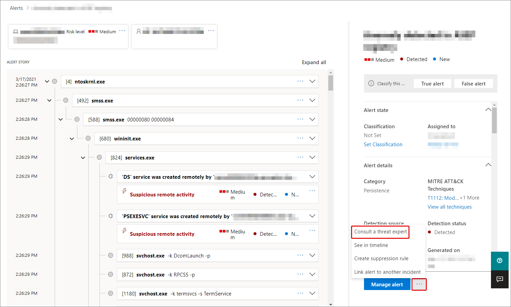

# Microsoft Threat Experts in Microsoft 365 overzicht

[!INCLUDE [Microsoft 365 Defender rebranding](../includes/microsoft-defender.md)]

**Van toepassing op:**

- [Microsoft 365 Defender](https://go.microsoft.com/fwlink/?linkid=2118804)
- [Microsoft Defender voor Endpoint](https://go.microsoft.com/fwlink/p/?linkid=2154037)

[!INCLUDE [Prerelease](../includes/prerelease.md)]

Microsoft Threat Experts - Targeted Attack Notifications is een managed threat hunting service. Zodra u van toepassing bent en geaccepteerd, ontvangt u gerichte aanvalsmeldingen van Microsoft-bedreigingsexperts, zodat u geen kritieke bedreigingen voor uw omgeving mist. Met deze meldingen kunt u de eindpunten, e-mail en identiteiten van uw organisatie beschermen.
Microsoft Threat Experts : experts op aanvraag kunt u deskundig advies krijgen over bedreigingen waarmee uw organisatie wordt geconfronteerd. U kunt hulp vragen bij bedreigingen waarmee uw organisatie te maken heeft. Deze is beschikbaar als abonnementsservice.

## Aanvragen voor Microsoft Threat Experts - Meldingen van gerichte aanvallen

> [!IMPORTANT]
> Voordat u van toepassing bent, moet u de geschiktheidsvereisten voor Microsoft Threat Experts - Targeted Attack Notifications bespreken met uw Microsoft Technical Service-provider en accountteam.

Als u al Microsoft Defender voor Eindpunt en Microsoft 365 Defender hebt, kunt u een aanvraag indienen voor Microsoft Threat Experts - Targeted Attack Notifications via hun Microsoft 365 Defender-portal. Ga naar **Instellingen > endpoints > Algemene > Geavanceerde** functies > Microsoft Threat Experts : Targeted Attack Notifications , en selecteer **Toepassen.** Zie [De Microsoft Threat Experts configureren voor](./configure-microsoft-threat-experts.md) een volledige beschrijving.

Zodra uw toepassing is goedgekeurd, ontvangt u gerichte meldingen over aanvallen wanneer bedreigingsexperts een bedreiging voor uw omgeving detecteren.

## Abonneren op Microsoft Threat Experts - Experts on Demand

Neem contact op met uw Microsoft-vertegenwoordiger om u te abonneren op Experts on Demand.  Zie [De Microsoft Threat Experts configureren voor](./configure-microsoft-threat-experts.md) meer informatie.

## Melding van gerichte aanval ontvangen

De Microsoft Threat Experts : de mogelijkheid voor melding van gerichte aanvallen biedt proactief zoeken naar de belangrijkste bedreigingen voor uw netwerk. Onze bedreigingsexperts zoeken naar inbreuken op menselijke tegenaanvallen, hands-on-keyboard-aanvallen en geavanceerde aanvallen, zoals cyberspionage. Deze meldingen worden als een nieuwe waarschuwing weer te geven. De beheerde huntingservice bevat:

- Bedreigingsmonitoring en -analyse, waardoor de tijd en het risico voor uw bedrijf worden verkleind
- Door de jager getrainde kunstmatige intelligentie om bekende aanvallen en nieuwe bedreigingen te ontdekken en te richten
- Identificatie van de meest relevante risico's, zodat soc's hun effectiviteit kunnen maximaliseren
- Help bij het zoeken naar compromissen en het bieden van zoveel context als snel kan worden geleverd om een snelle soc-reactie mogelijk te maken.

## Samenwerken met experts op aanvraag

U kunt ook rechtstreeks vanuit de beveiligingsportal contact opnemen met microsoft-bedreigingsexperts Microsoft 365 voor een snelle en nauwkeurige reactie op bedreigingen.  Experts kunnen inzicht bieden om beter inzicht te krijgen in de complexe bedreigingen waar uw organisatie mee te maken kan krijgen.  Neem contact op met een expert om:

- Aanvullende informatie verzamelen over waarschuwingen en incidenten, waaronder hoofdoorzaken en bereik
- Krijg meer duidelijkheid over verdachte apparaten, waarschuwingen of incidenten en krijg de volgende stappen als u te maken krijgt met een geavanceerde aanvaller
- Risico's en beschikbare beveiligingen met betrekking tot bedreigingsacacteurs, campagnes of opkomende technieken voor aanvallers bepalen

De optie Om **een bedreigingsexpert te raadplegen** is beschikbaar op verschillende plaatsen in de portal:

- <i>**Menu Apparaatpaginaacties**</i> 

- <i>**Flyoutmenu van de pagina Apparaatinventarisatie**</i> 

- <i>**Flyout-menu van de pagina Waarschuwingen**</i> 

- <i>**Menu Incidentenpaginaacties**</i> 

- <i>**Inventarispagina incidenten**</i> 

> [!NOTE]
> Als u een Premier Support-abonnement hebt dat is Office 365 licentie voor Microsoft Defender, kunt u de status van uw experts op aanvraag bijhouden via Microsoft Services Hub.

Bekijk deze video voor een kort overzicht van de Microsoft Services Hub.

> [!VIDEO https://www.microsoft.com/videoplayer/embed/RE4pk9f]

## Zie ook

- [De Microsoft Threat Experts configureren](./configure-microsoft-threat-experts.md)
