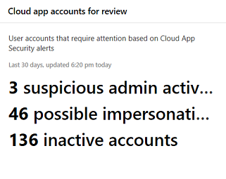

# Apps volgen en rapporteren in het Microsoft 365-Beveiligingscentrum

[!INCLUDE [Microsoft 365 Defender rebranding](../includes/microsoft-defender.md)]

Deze rapporten bieden meer inzicht in de manier waarop Cloud-apps in uw organisatie worden gebruikt. Inclusief verschillende typen apps, het risiconiveau en waarschuwingen.

## E-mailaccounts van risico controleren

**E-mail beveiliging** toont het risico voor e-mailaccounts. U kunt een account selecteren dat u verder wilt onderzoeken in Microsoft Defender-Beveiligingscentrum.

## App-machtigingen controleren die gebruikers hebben toegestaan

**Beveiligings-app voor de Cloud app** de apps van de Cloud-app die door gebruikers zijn gedetecteerd, worden weergegeven. De risico catalogus van de Cloud app-beveiliging omvat meer dan 16.000-apps die worden beoordeeld met meer dan 70 risicofactoren.

De risicofactoren beginnen met algemene gegevens, zoals de App-uitgever. Vervolgens gaat u naar beveiligingsmaatregelen en-besturingselementen, zoals of de app versleuteling voor de rest ondersteunt of een auditlogboek van gebruikersactiviteiten biedt.

## Gebruikersaccounts van de Cloud app bewaken

**Cloud-app-accounts voor nakijken naar** accounts waarvan de aandacht moet worden besteed.

## Inzicht in de gebruikte Cloud apps

**Gedetecteerde Cloud-apps (categorieën)** tonen welke soorten apps in uw organisatie worden gebruikt. De koppeling naar het Cloud Discovery-dashboard in de beveiliging van de Cloud-app. Zie voor meer informatie [Snelstartgids: werken met ontdekte apps](https://docs.microsoft.com/cloud-app-security/discovered-apps).  

## Controleren waar gebruikers toegang hebben tot Cloud-apps

**Locaties van de Cloud app-activiteit** geven aan waar gebruikers toegang hebben tot Cloud-apps.

## De status van infrastructuur van infrastructuur controleren

**Infrastructuur** status toont waarschuwingen voor de status van infrastructuur in azure Defender.

Azure Defender biedt Unified Security Management en Defender for Office 365 in on-premises en in de Cloud workloads. U kunt in verschillende bronnen beveiligingsgegevens verzamelen, zoeken en analyseren, waaronder firewalls en andere Partneroplossingen.

Zie de [documentatie van Azure Defender](https://docs.microsoft.com/azure/security-center/)voor meer informatie.

