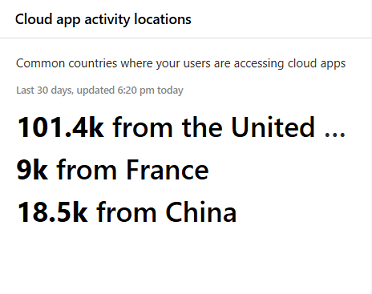

# App-controle en -rapportage in het Microsoft 365-beveiligingscentrumApp monitoring and reporting in the Microsoft 365 security center

[!INCLUDE [Microsoft 365 Defender rebranding](../includes/microsoft-defender.md)]

Deze rapporten bieden meer inzicht in hoe cloud-apps worden gebruikt in uw organisatie.These reports provide more insight into how cloud apps are being used in your organization. Omvat verschillende soorten apps, hun risiconiveau en waarschuwingen.Includes different kinds of apps, their level of risk, and alerts.

## Risico's van e-mailaccounts controlerenMonitor email accounts at risk

**E-mailbeveiliging** toont risicovolle e-mailaccounts.**Email protection** shows email accounts at risk. U kunt een account selecteren om nader te onderzoeken in het Microsoft Defender-beveiligingscentrum.You can select an account to investigate further in Microsoft Defender Security Center.

## App-machtigingen controleren die door gebruikers zijn verleendMonitor app permissions granted by users

**Cloud-appbeveiliging: OAuth-apps** geven apps weer die door Cloud App-beveiliging zijn ontdekt en die machtigingen van gebruikers hebben gekregen.**Cloud App Security - OAuth apps** lists apps discovered by Cloud App Security that have been granted permissions by users. De risicocatalogus van Cloud App Security bevat meer dan 16.000 apps die worden geëvalueerd op basis van meer dan 70 risicofactoren.Cloud App Security's risk catalog includes over 16,000 apps that are assessed using over 70 risk factors.

De risicofactoren beginnen met algemene informatie, zoals de uitgever van de app.The risk factors start from general information, such as the app publisher. Vervolgens worden beveiligingsmaatregelen en -besturingselementen gebruikt, bijvoorbeeld of de app in rust versleuteling ondersteunt of een auditlogboek van gebruikersactiviteit geeft.It then moves to security measures and controls, such as whether the app supports encryption at rest or provides an audit log of user activity.

## Gebruikersaccounts voor de cloud-app controlerenMonitor cloud app user accounts

**Cloud-app-accounts voor het controleren** van accounts die mogelijk aandacht vereisen.**Cloud app accounts for review** lists accounts that may require attention.

## Begrijpen welke cloud-apps worden gebruiktUnderstand which cloud apps are used

**Gevonden cloud-apps (categorieën)** laten zien welke soorten apps in uw organisatie worden gebruikt.**Discovered cloud apps (categories)** show what kinds of apps are being used in your organization. Het is een koppeling naar het Cloud Discovery-dashboard in Cloud App Security.It links to the Cloud Discovery dashboard in Cloud App Security. Zie [Quickstart: Werken](https://docs.microsoft.com/cloud-app-security/discovered-apps)met gevonden apps voor meer informatie.For more information, see [Quickstart: Work with discovered apps](https://docs.microsoft.com/cloud-app-security/discovered-apps).  

## Controleren waar gebruikers toegang hebben tot cloud-appsMonitor where users access cloud apps

**Locaties van activiteit in cloud-apps** geven aan waar gebruikers toegang hebben tot cloud-apps.**Cloud app activity locations** show where users are accessing cloud apps.

## Status controleren op werkbelasting van infrastructuurMonitor health for infrastructure workloads

**De infrastructuurstatus** toont statuswaarschuwingen voor infrastructuurwerkbelastingen in Azure Defender.**Infrastructure health** shows health status alerts for infrastructure workloads in Azure Defender.

Azure Defender biedt geïntegreerde beveiligingsbeheer en Defender voor Office 365 voor on-premises en cloud-workloads.Azure Defender provides unified security management and Defender for Office 365 across on-premises and cloud workloads. U kunt beveiligingsgegevens uit verschillende bronnen verzamelen, doorzoeken en analyseren, waaronder firewalls en andere partneroplossingen.You can collect, search, and analyze security data from different sources, including firewalls and other partner solutions.

Zie de documentatie bij [Azure Defender voor meer informatie.](https://docs.microsoft.com/azure/security-center/)For more information, see [Azure Defender Documentation](https://docs.microsoft.com/azure/security-center/).

