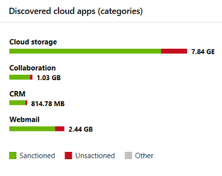

# App-monitoring en rapportage in het Microsoft 365-beveiligingscentrum

Deze rapporten geven meer inzicht in hoe cloud-apps worden gebruikt in uw organisatie, inclusief wat voor soort apps, hun risiconiveau en waarschuwingen.

## E-mailaccounts in gevaar houden

**E-mailbeveiliging** toont e-mailaccounts die risico lopen. U op een account klikken om verder te onderzoeken in Microsoft Defender Security Center.

## App-machtigingen controleren die door gebruikers worden verleend

**Cloud App Security - OAuth-apps** bevatten apps die zijn ontdekt door Cloud App Security en die door gebruikers machtigingen hebben gekregen. De risicocatalogus van Cloud App Security bevat meer dan 16.000 apps die worden beoordeeld aan de hand van meer dan 70 risicofactoren.

De risicofactoren gaan uit van algemene informatie, zoals de uitgever van de app, tot beveiligingsmaatregelen en besturingselementen, zoals of de app ondersteuning biedt voor versleuteling in rust of een controlelogboek van gebruikersactiviteit biedt.

## Gebruikersaccounts van cloud-apps controleren

**Cloud-app-accounts voor revisie** lijsten accounts die mogelijk aandacht vereisen.

## Begrijpen welke cloud-apps worden gebruikt

**Gedetecteerde cloud-apps (categorieën)** laten zien welke soorten apps in uw organisatie worden gebruikt en koppelingen naar het Cloud Discovery-dashboard in Cloud App Security. Zie [Snelstart: Werken met gedetecteerde apps](https://docs.microsoft.com/cloud-app-security/discovered-apps)voor meer informatie.  

## Controleren waar gebruikers toegang hebben tot cloud-apps

**Locaties voor activiteit in de cloud-app** laten zien waar gebruikers toegang hebben tot cloud-apps.

## Status controleren op infrastructuurworkloads

**De status van de** infrastructuur toont statuswaarschuwingen voor infrastructuurworkloads in Azure Security Center.

Azure Security Center biedt uniform beveiligingsbeheer en geavanceerde bescherming tegen bedreigingen voor on-premises en cloudworkloads. U beveiligingsgegevens uit verschillende bronnen verzamelen, doorzoeken en analyseren, waaronder firewalls en andere partneroplossingen.

Zie [Azure Security Center Documentation](https://docs.microsoft.com/azure/security-center/)voor meer informatie.

