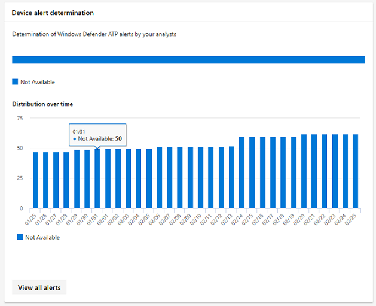

# <a name="device-monitoring-and-reporting-in-the-microsoft-365-security-center"></a>Apparaatbewaking en -rapportage in het Microsoft 365-beveiligingscentrum

Houd uw apparaten veilig, up-to-date en spot potentiële bedreigingen in het Microsoft 365-beveiligingscentrum.

## <a name="view-device-alerts"></a>Apparaatwaarschuwingen weergeven

Ontvang up-to-date meldingen over inbreukactiviteiten en andere bedreigingen op uw apparaten van Microsoft Defender ATP (beschikbaar met een E5-licentie). Microsoft 365 security center controleert deze waarschuwingen effectief op een hoog niveau met behulp van uw voorkeursworkflow.

### <a name="monitor-high-impact-alerts"></a>Waarschuwingen met een hoge impact controleren

Elke Microsoft Defender ATP-waarschuwing heeft een overeenkomstige ernst (hoog, gemiddeld, laag of informatief) die de potentiële impact ervan op uw netwerk aangeeft als deze onbeheerd wordt achtergelaten.  

Gebruik de **apparaatwaarschuwingskaart** om specifiek te focussen op waarschuwingen die ernstiger zijn en mogelijk onmiddellijk moeten worden gereageerd. Op deze kaart u meer informatie bekijken op de Microsoft Defender Security Center-portal.


### <a name="understand-sources-of-alerts"></a>Bronnen van waarschuwingen begrijpen

Microsoft Defender ATP maakt gebruik van gegevens van een breed scala aan beveiligingssensoren en inlichtingenbronnen om waarschuwingen te genereren. Het kan bijvoorbeeld detectie-informatie van Windows Defender Antivirus en antimalware van derden gebruiken, evenals uw eigen aangepaste bedreigingsinformatie die wordt geleverd via de webservice-API.

De kaart **met waarschuwingsdetectievan het apparaat** toont de verdeling van waarschuwingen per bron. Met deze kaart u activiteiten bijhouden die verband houden met bepaalde bronnen, met name uw aangepaste bronnen. U dit ook gebruiken om u te concentreren op waarschuwingen afkomstig van sensoren die niet zijn geconfigureerd om schadelijke activiteiten of onderdelen automatisch te blokkeren.


Op deze kaart u meer informatie bekijken op de Microsoft Defender Security Center-portal.

### <a name="understand-the-types-of-threats-that-trigger-alerts"></a>Inzicht in de soorten bedreigingen die waarschuwingen activeren

Microsoft Defender ATP sorteert elke waarschuwing in een categorie die een bepaalde fase in de aanvalsketen of een type bedreigingscomponent vertegenwoordigt. Een gedetecteerde bedreigingsactiviteit kan bijvoorbeeld worden gecategoriseerd als 'laterale beweging' om aan te geven dat er een poging is gedaan om andere apparaten in het netwerk te bereiken. De activiteit is waarschijnlijk ook opgetreden nadat aanvallers een eerste voet aan de grond kregen. Wanneer gedetecteerd, een bedreiging component kan ofwel in grote lijnen worden geclassificeerd als malware, of meer specifiek als ransomware, credential stealing, of andere vormen van kwaadaardige of ongewenste software.

De kaart **met bedreigingscategorieën voor apparaten** toont de verdeling van waarschuwingen in deze categorieën. U deze informatie gebruiken om bedreigingsactiviteiten te identificeren, zoals pogingen tot diefstal van referenties, die een hogere impact kunnen hebben in vergelijking met pogingen tot social engineering. U deze informatie ook gebruiken om te controleren op mogelijk destructieve bedreigingen zoals ransomware.


### <a name="monitor-active-alerts"></a>Actieve waarschuwingen controleren

De **statuskaart apparaatwaarschuwing** geeft het aantal waarschuwingen aan dat niet is opgelost en mogelijk aandacht nodig heeft. Op deze kaart u meer informatie bekijken op de Microsoft Defender Security Center-portal.


### <a name="monitor-classification-of-resolved-alerts"></a>Classificatie van opgeloste waarschuwingen controleren

Wanneer u een ATP-waarschuwing van Microsoft Defender oplost, kunnen uw beveiligingsmedewerkers opgeven of een waarschuwing is geverifieerd als:

* Een echte waarschuwing die werkelijke inbreukactiviteit of bedreigingscomponenten identificeert
* Een valse waarschuwing die de normale activiteit onjuist heeft gedetecteerd

De **classificatiekaart voor apparaatwaarschuwingen** geeft aan of uw opgeloste waarschuwingen zijn geclassificeerd als true- of false alerts. Op deze kaart u meer informatie bekijken op de Microsoft Defender Security Center-portal.

Opmerking: In sommige gevallen is classificatiegegevens niet beschikbaar voor bepaalde waarschuwingen.


### <a name="monitor-determination-of-resolved-alerts"></a>Controle bepaling van opgeloste waarschuwingen

Naast het classificeren of een waarschuwing waar of onwaar is tijdens het oplossen, kunnen uw beveiligingsmedewerkers een bepaling geven, waarbij het type normale of schadelijke activiteit wordt aangegeven dat is gevonden tijdens het valideren van de waarschuwing.

De **apparaatwaarschuwingsbepalingskaart** toont de bepaling die voor elke waarschuwing is opgegeven.

* **APT**: geavanceerde aanhoudende dreiging, wat aangeeft dat de gedetecteerde activiteit of bedreigingcomponent deel uitmaakt van een geavanceerde inbreuk die is ontworpen om voet aan de grond te krijgen in het getroffen netwerk  
* **Malware:** kwaadaardig bestand of code
* **Beveiligingspersoneel**: normale activiteit door beveiligingspersoneel
* **Beveiligingstests**: activiteit of componenten die zijn ontworpen om werkelijke bedreigingen te simuleren en die naar verwachting beveiligingssensoren activeren en waarschuwingen genereren
* **Ongewenste software**: apps en andere software die niet als kwaadaardig worden beschouwd, maar anderszins beleid of aanvaardbare gebruiksnormen schenden
* **Andere**: elke andere bepaling die niet onder de verstrekte

Op deze kaart u meer informatie bekijken in Microsoft Defender Security Center.



### <a name="understand-which-devices-are-at-risk"></a>Begrijpen welke apparaten risico lopen

**Apparaatbeveiliging** toont het risiconiveau voor apparaten. Het risiconiveau is gebaseerd op factoren zoals het type en de ernst van waarschuwingen op het apparaat.


## <a name="monitor-and-report-status-of-intune-managed-devices"></a>Status van intune-beheerde apparaten controleren en rapporteren

De volgende rapporten bevatten gegevens van apparaten die zijn ingeschreven in Intune. Gegevens van niet-ingeschreven apparaten zijn niet inbegrepen. Alleen globale beheerders kunnen deze kaarten bekijken.

Intune ingeschreven apparaatgegevens omvatten:

* Naleving van het apparaat
* Apparaten met actieve malware
* Typen malware op apparaten
* Malware op apparaten
* Apparaten met malwaredetecties
* Gebruikers met malwaredetecties

### <a name="monitor-device-compliance"></a>Naleving van het apparaat controleren

**Naleving van het apparaat** geeft aan hoeveel apparaten die zijn ingeschreven bij Intune voldoen aan het configuratiebeleid.


### <a name="discover-devices-with-malware-detections"></a>Apparaten ontdekken met malwaredetecties

**Detecties** van apparaatmalware bieden het aantal Intune-ingeschreven apparaten met malware die nog niet volledig is opgelost. Dit kan te wijten zijn aan lopende acties, een herstart, een volledige scan, handmatige gebruikersacties of als de herstelactie niet is voltooid.


### <a name="understand-the-types-of-malware-detected"></a>Inzicht in de soorten malware gedetecteerd

**Soorten malware op apparaten** tonen verschillende soorten malware die zijn gedetecteerd op apparaten die zijn ingeschreven in Intune. U elk type onderzoeken in het Microsoft 365-beveiligingscentrum.


### <a name="understand-the-specific-malware-detected-on-your-devices"></a>Inzicht in de specifieke malware die op uw apparaten wordt gedetecteerd

**Malware op apparaten** bevat een lijst met de specifieke malware die op uw apparaten wordt gedetecteerd.


### <a name="understand-which-devices-have-the-most-malware"></a>Begrijpen welke apparaten de meeste malware hebben

**Apparaten met malwaredetecties** laten zien welke apparaten de meeste malwaredetecties hebben. in het Microsoft 365-beveiligingscentrum u onderzoeken of malware actief is, wie het apparaat gebruikt en de beheerstatus in Intune.


### <a name="understand-which-users-have-devices-with-the-most-malware"></a>Begrijpen welke gebruikers apparaten hebben met de meeste malware

**Gebruikers met malwaredetecties** tonen gebruikers met apparaten met de meeste malwaredetecties. In het Microsoft 365-beveiligingscentrum u zien hoeveel apparaten aan elke gebruiker zijn toegewezen en meer informatie over elk apparaat en het type malware.


## <a name="monitor-and-manage-asr-rule-deployment-and-detections"></a>Asr-regelimplementatie en -detecties bewaken en beheren

[Attack Surface Reduction (ASR)-regels](https://docs.microsoft.com/windows/security/threat-protection/microsoft-defender-atp/attack-surface-reduction) helpen acties en apps te voorkomen die doorgaans worden gebruikt door malware te gebruiken om apparaten te infecteren. Deze regels bepalen wanneer en hoe uitvoerbare bestanden kunnen worden uitgevoerd. U bijvoorbeeld voorkomen dat JavaScript of VBScript een gedownloade uitvoerbare start, Win32 API-aanroepen van Office-macro's blokkeren of processen blokkeren die vanaf USB-stations worden uitgevoerd.


De **attack surface reduction rules** card geeft een overzicht van de implementatie van regels op uw apparaten.

De bovenste balk op de kaart toont het totale aantal apparaten dat zich in de volgende implementatiemodi begeeft:

* **Blokmodus:** apparaten met ten minste één regel die is geconfigureerd om gedetecteerde activiteit te blokkeren
* **Controlemodus:** apparaten zonder regels die zijn ingesteld om gedetecteerde activiteit te blokkeren, maar hebben ten minste één regel ingesteld om gedetecteerde activiteit te controleren  
* **Uit**: apparaten met alle ASR-regels uitgeschakeld

Het onderste deel van deze kaart toont instellingen per regel op uw apparaten. Elke balk geeft het aantal apparaten aan dat is ingesteld om detectie te blokkeren of te controleren of de regel volledig is uitgeschakeld.

### <a name="view-asr-detections"></a>ASR-detecties weergeven

Als u gedetailleerde informatie wilt weergeven over ASR-regeldetecties in uw netwerk, selecteert u **Detecties weergeven** op de kaart voor regels voor beperking van het **aanvalsoppervlak.** Het tabblad **Detecties** op de gedetailleerde rapportpagina wordt geopend.


De grafiek boven aan de pagina toont detecties in de loop van de tijd stapelen detecties die ofwel werden geblokkeerd of gecontroleerd. De tabel onderaan bevat de meest recente detecties. Gebruik de volgende informatie op de tabel om de aard van de detecties te begrijpen:

* **Gedetecteerd bestand:** het bestand, meestal een script of een document, waarvan de inhoud de vermoedelijke aanvalsactiviteit heeft geactiveerd
* **Regel:** naam die de aanvalsactiviteiten beschrijft, is ontworpen om te vangen. Lees meer over bestaande ASR-regels
* **Bron-app:** de toepassing die inhoud heeft geladen of uitgevoerd die de vermoedelijke aanvalsactiviteit activeert. Dit kan een legitieme toepassing zijn, zoals webbrowser, een Office-toepassing of een systeemtool zoals PowerShell
* **Uitgever**: de leverancier die de bron-app heeft uitgebracht

### <a name="review-device-asr-rule-settings"></a>Instellingen voor de ASR-regelinstellingen van het apparaat controleren

Ga op de rapportpagina **Regels voor beperking van het oppervlak** aanvallen naar het tabblad **Configuratie** om regelinstellingen voor afzonderlijke apparaten te controleren. Selecteer een apparaat om gedetailleerde informatie te krijgen over de vraag of elke regel in de blokmodus, de controlemodus of volledig is uitgeschakeld.


Microsoft Intune biedt beheerfunctionaliteit voor uw ASR-regels. Als u uw instellingen wilt bijwerken, selecteert u **Aan de slag** onder Apparaten **configureren** op het tabblad om apparaatbeheer op Intune te openen.

### <a name="exclude-files-from-asr-rules"></a>Bestanden uitsluiten van ASR-regels

Microsoft 365 security center verzamelt de namen van de [bestanden die u mogelijk wilt uitsluiten](https://docs.microsoft.com/windows/security/threat-protection/microsoft-defender-atp/enable-attack-surface-reduction#exclude-files-and-folders-from-asr-rules) van detecties door de regels voor het verkleinen van het oppervlak aan te vallen. Door bestanden uit te sluiten, u fout-positieve detecties verminderen en regels voor het verminderen van aanvalsoppervlakken in de blokmodus beter implementeren.

De uitsluitingen worden beheerd op Microsoft Intune, maar microsoft 365 security center biedt een analysetool om u te helpen de bestanden te begrijpen. Als u bestanden wilt verzamelen voor uitsluiting, gaat u naar het tabblad Uitsluitingen toevoegen op de rapportpagina **Regels voor beperking van het aanvalsoppervlak.** **Add exclusions**

>[!NOTE]  
>De tool analyseert detecties door alle regels voor het verminderen van het aanvalsoppervlak, maar [slechts enkele regels ondersteunen uitsluitingen.](https://docs.microsoft.com/windows/security/threat-protection/microsoft-defender-atp/troubleshoot-asr)


De tabel bevat alle bestandsnamen die zijn gedetecteerd door de regels voor het verkleinen van het aanvalsoppervlak. U bestanden selecteren om de impact van het uitsluiten ervan te bekijken:

* Hoeveel detecties zijn er minder
* Hoeveel apparaten minder apparaten melden de detecties

Als u een lijst met geselecteerde bestanden wilt krijgen met hun volledige paden voor uitsluiting, selecteert **u Uitsluitingspaden opvragen**.

Logboeken voor de ASR-regel **Blokkeer referenties die stelen uit het subsysteem van de lokale beveiligingsautoriteit van Windows (lsass.exe)** en leggen de bronapp **lsass.exe**, een normaal systeembestand, vast als het gedetecteerde bestand. Als gevolg hiervan bevat de gegenereerde lijst met uitsluitingspaden dit bestand. Als u het bestand wilt uitsluiten dat deze regel heeft geactiveerd in plaats van **lsass.exe,** gebruikt u het pad naar de bron-app in plaats van het gedetecteerde bestand.

Als u de bron-app wilt zoeken, voert u de volgende [geavanceerde jachtquery](https://docs.microsoft.com/windows/security/threat-protection/microsoft-defender-atp/advanced-hunting) uit voor deze specifieke regel (geïdentificeerd door regel-ID 9e6c4e1f-7d60-472f-ba1a-a39ef669e4b2):

```kusto
DeviceEvents
| where Timestamp > ago(7d)
| where ActionType startswith "Asr"
| where AdditionalFields contains "9e6c4e1f-7d60-472f-ba1a-a39ef669e4b2"
| project InitiatingProcessFolderPath, InitiatingProcessFileName
```

#### <a name="check-files-for-exclusion"></a>Bestanden controleren op uitsluiting

Voordat u een bestand van ASR uitsluit, raden we u aan het bestand te inspecteren om te bepalen of het inderdaad niet kwaadaardig is.

Als u een bestand wilt controleren, gebruikt u de [pagina bestandsgegevens](https://docs.microsoft.com/windows/security/threat-protection/microsoft-defender-atp/investigate-files) op Microsoft Defender Security Center. De pagina biedt prevalentieinformatie en de virustotal-antivirusdetectieratio. U de pagina ook gebruiken om het bestand in te dienen voor diepgaande analyse.

Als u een gedetecteerd bestand wilt vinden in Microsoft Defender Security Center, zoekt u naar alle ASR-detecties met behulp van de volgende geavanceerde jachtquery:

```kusto
MiscEvents
| where EventTime > ago(7d)
| where ActionType startswith "Asr"
| project FolderPath, FileName, SHA1, InitiatingProcessFolderPath, InitiatingProcessFileName, InitiatingProcessSHA1
```

Gebruik de **SHA1** of het **ProcesstartenSHA1** in de resultaten om naar het bestand te zoeken met behulp van de universele zoekbalk in Microsoft Defender Security Center.
