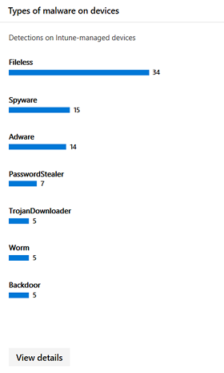
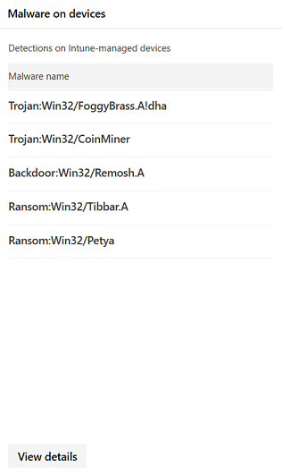

# <a name="device-monitoring-and-reporting-in-the-microsoft-365-security-center"></a><span data-ttu-id="43452-104">Apparaatcontrole en rapportage in het Microsoft 365-beveiligingscentrum</span><span class="sxs-lookup"><span data-stu-id="43452-104">Device monitoring and reporting in the Microsoft 365 security center</span></span>

[!INCLUDE [Microsoft 365 Defender rebranding](../includes/microsoft-defender.md)]


<span data-ttu-id="43452-105">Houd uw apparaten veilig, up-to-date en spot potentiële bedreigingen in het Microsoft 365-beveiligingscentrum.</span><span class="sxs-lookup"><span data-stu-id="43452-105">Keep your devices secure, up-to-date, and spot potential threats in the Microsoft 365 security center.</span></span>

## <a name="view-device-alerts"></a><span data-ttu-id="43452-106">Apparaatwaarschuwingen weergeven</span><span class="sxs-lookup"><span data-stu-id="43452-106">View device alerts</span></span>

<span data-ttu-id="43452-107">Ontvang up-to-date waarschuwingen over inbreukactiviteit en andere bedreigingen op uw apparaten van Microsoft Defender for Endpoint (beschikbaar met een E5-licentie).</span><span class="sxs-lookup"><span data-stu-id="43452-107">Get up-to-date alerts about breach activity and other threats on your devices from Microsoft Defender for Endpoint (available with an E5 license).</span></span> <span data-ttu-id="43452-108">Het Microsoft 365-beveiligingscentrum bewaakt deze waarschuwingen effectief op een hoog niveau met behulp van de werkstroom van uw voorkeur.</span><span class="sxs-lookup"><span data-stu-id="43452-108">Microsoft 365 security center effectively monitors these alerts at a high level using your preferred workflow.</span></span>

### <a name="monitor-high-impact-alerts"></a><span data-ttu-id="43452-109">Impactwaarschuwingen bewaken</span><span class="sxs-lookup"><span data-stu-id="43452-109">Monitor high-impact alerts</span></span>

<span data-ttu-id="43452-110">Elke waarschuwing van Microsoft Defender voor eindpunt heeft een bijbehorende ernst (hoog, gemiddeld, laag of informatief).</span><span class="sxs-lookup"><span data-stu-id="43452-110">Each Microsoft Defender for Endpoint alert has a corresponding severity (high, medium, low, or informational).</span></span> <span data-ttu-id="43452-111">Hiermee wordt de potentiële impact op uw netwerk aangegeven als deze onbeheerd blijft.</span><span class="sxs-lookup"><span data-stu-id="43452-111">It indicates potential impact to your network if left unattended.</span></span>  

<span data-ttu-id="43452-112">Gebruik de **kaart ernst van de apparaatwaarschuwing** om u specifiek te richten op waarschuwingen die ernstiger zijn en mogelijk onmiddellijke reactie vereisen.</span><span class="sxs-lookup"><span data-stu-id="43452-112">Use the **Device alert severity** card to focus specifically on alerts that are more severe and might require immediate response.</span></span> <span data-ttu-id="43452-113">Via deze kaart kunt u meer informatie bekijken in de portal van het Microsoft Defender-beveiligingscentrum.</span><span class="sxs-lookup"><span data-stu-id="43452-113">From this card, you can view more information on the Microsoft Defender Security Center portal.</span></span>


### <a name="understand-sources-of-alerts"></a><span data-ttu-id="43452-115">Informatiebronnen voor waarschuwingen</span><span class="sxs-lookup"><span data-stu-id="43452-115">Understand sources of alerts</span></span>

<span data-ttu-id="43452-116">Microsoft Defender for Endpoint maakt gebruik van gegevens van een groot aantal beveiligingsonderzoekers en -informatiebronnen om waarschuwingen te genereren.</span><span class="sxs-lookup"><span data-stu-id="43452-116">Microsoft Defender for Endpoint leverages data from a broad range of security sensors and intelligence sources to generate alerts.</span></span> <span data-ttu-id="43452-117">U kunt bijvoorbeeld detectiegegevens van Microsoft Defender Antivirus en antimalware van derden gebruiken.</span><span class="sxs-lookup"><span data-stu-id="43452-117">For example, it can use detection information from Microsoft Defender Antivirus and third-party antimalware.</span></span> <span data-ttu-id="43452-118">Het kan ook uw eigen aangepaste bedreigingsinformatie gebruiken die via de webservice-API wordt aangeboden.</span><span class="sxs-lookup"><span data-stu-id="43452-118">It can also use your own custom threat intelligence provided through the web service API.</span></span>

<span data-ttu-id="43452-119">Op **de kaart apparaat met detectiebronnen** voor waarschuwingen ziet u de verdeling van waarschuwingen per bron.</span><span class="sxs-lookup"><span data-stu-id="43452-119">The **Device alert detection** sources card shows the distribution of alerts by source.</span></span> <span data-ttu-id="43452-120">Houd activiteiten bij met betrekking tot bepaalde bronnen, met name uw aangepaste bronnen.</span><span class="sxs-lookup"><span data-stu-id="43452-120">Track activity related to certain sources, particularly your custom sources.</span></span> <span data-ttu-id="43452-121">U kunt de kaart ook gebruiken om te focussen op waarschuwingen van sensoren die niet zijn geconfigureerd om schadelijke activiteiten of onderdelen automatisch te blokkeren.</span><span class="sxs-lookup"><span data-stu-id="43452-121">You can also use the card to focus on alerts coming from sensors that aren't configured to automatically block malicious activity or components.</span></span>


<span data-ttu-id="43452-123">Via deze kaart kunt u meer informatie bekijken in de portal van het Microsoft Defender-beveiligingscentrum.</span><span class="sxs-lookup"><span data-stu-id="43452-123">From this card, you can view more information on the Microsoft Defender Security Center portal.</span></span>

### <a name="understand-the-types-of-threats-that-trigger-alerts"></a><span data-ttu-id="43452-124">Informatie over de typen bedreigingen die waarschuwingen activeren</span><span class="sxs-lookup"><span data-stu-id="43452-124">Understand the types of threats that trigger alerts</span></span>

<span data-ttu-id="43452-125">Microsoft Defender for Endpoint sorteert elke waarschuwing in een categorie die een bepaalde fase in de aanvalsketen of het type bedreigingsonderdeel vertegenwoordigt.</span><span class="sxs-lookup"><span data-stu-id="43452-125">Microsoft Defender for Endpoint sorts each alert into a category representing a certain stage in the attack chain or type of threat component.</span></span> <span data-ttu-id="43452-126">Een gedetecteerde bedreigingsactiviteit kan bijvoorbeeld worden gecategoriseerd als 'laterale beweging' om aan te geven dat er een poging is gedaan om andere apparaten op het netwerk te bereiken.</span><span class="sxs-lookup"><span data-stu-id="43452-126">For example, a detected threat activity might be categorized as "lateral movement" to indicate there was an attempt to reach other devices on the network.</span></span> <span data-ttu-id="43452-127">De activiteit heeft waarschijnlijk plaatsgevonden nadat aanvallers een eerste voettekst hebben gekregen.</span><span class="sxs-lookup"><span data-stu-id="43452-127">The activity has likely occurred after attackers gained an initial foothold.</span></span> <span data-ttu-id="43452-128">Wanneer dit wordt gedetecteerd, kan een bedreigingsonderdeel algemeen worden geclassificeerd als malware of specifiek als een specifiek bedreigingstype.</span><span class="sxs-lookup"><span data-stu-id="43452-128">When detected, a threat component might be classified broadly as malware or specifically as a specific threat type.</span></span> <span data-ttu-id="43452-129">Specifiek zijn ransomware, het stelen van referenties of andere typen schadelijke of ongewenste software.</span><span class="sxs-lookup"><span data-stu-id="43452-129">Specifics include ransomware, credential stealing, or other types of malicious or unwanted software.</span></span>

<span data-ttu-id="43452-130">De **kaart Apparaat bedreigingscategorieën** toont de verdeling van waarschuwingen in deze categorieën.</span><span class="sxs-lookup"><span data-stu-id="43452-130">The **Device threat categories** card shows the distribution of alerts into these categories.</span></span> <span data-ttu-id="43452-131">Gebruik deze gegevens om risicoactiviteit te identificeren, zoals pogingen tot diefstal van referenties, die meestal meer impact hebben dan pogingen van sociale netwerken.</span><span class="sxs-lookup"><span data-stu-id="43452-131">Use this information to identify threat activity, such as credential theft attempts, that usually have higher impact than social engineering attempts.</span></span> <span data-ttu-id="43452-132">U kunt ook controleren op potentiële schadelijke bedreigingen, zoals ransomware.</span><span class="sxs-lookup"><span data-stu-id="43452-132">You can also to monitor for potentially destructive threats like ransomware.</span></span>


### <a name="monitor-active-alerts"></a><span data-ttu-id="43452-134">Actieve waarschuwingen bewaken</span><span class="sxs-lookup"><span data-stu-id="43452-134">Monitor active alerts</span></span>

<span data-ttu-id="43452-135">De **statuskaart voor apparaatwaarschuwingen** geeft het aantal waarschuwingen aan dat niet is opgelost en vereist mogelijk aandacht.</span><span class="sxs-lookup"><span data-stu-id="43452-135">The **Device alert status** card indicates the number of alerts that haven't been resolved and may require attention.</span></span> <span data-ttu-id="43452-136">Via deze kaart kunt u meer informatie bekijken in de portal van het Microsoft Defender-beveiligingscentrum.</span><span class="sxs-lookup"><span data-stu-id="43452-136">From this card, you can view more information on the Microsoft Defender Security Center portal.</span></span>


### <a name="monitor-classification-of-resolved-alerts"></a><span data-ttu-id="43452-138">Classificatie van opgeloste waarschuwingen controleren</span><span class="sxs-lookup"><span data-stu-id="43452-138">Monitor classification of resolved alerts</span></span>

<span data-ttu-id="43452-139">Bij het oplossen van een waarschuwing van Microsoft Defender voor eindpunt, kan uw beveiligingspersoneel opgeven of een waarschuwing is geverifieerd als:</span><span class="sxs-lookup"><span data-stu-id="43452-139">When resolving a Microsoft Defender for Endpoint alert, your security staff can specify whether an alert has been verified as:</span></span>

* <span data-ttu-id="43452-140">Een echte waarschuwing die werkelijke inbreukactiviteit of bedreigingsonderdelen identificeert</span><span class="sxs-lookup"><span data-stu-id="43452-140">A true alert that identifies actual breach activity or threat components</span></span>
* <span data-ttu-id="43452-141">Een foutmelding die ten onrechte normale activiteit heeft gedetecteerd</span><span class="sxs-lookup"><span data-stu-id="43452-141">A false alert that has incorrectly detected normal activity</span></span>

<span data-ttu-id="43452-142">Op **de kaart met de classificatie** van apparaatwaarschuwingen kunt u zien of uw opgeloste waarschuwingen zijn geclassificeerd als waar of onwaar.</span><span class="sxs-lookup"><span data-stu-id="43452-142">The **Device alert classification** card shows whether your resolved alerts have been classified as true or false alerts.</span></span> <span data-ttu-id="43452-143">Via deze kaart kunt u meer informatie bekijken in de portal van het Microsoft Defender-beveiligingscentrum.</span><span class="sxs-lookup"><span data-stu-id="43452-143">From this card, you can view more information on the Microsoft Defender Security Center portal.</span></span>

<span data-ttu-id="43452-144">Opmerking: In sommige gevallen zijn classificatiegegevens niet beschikbaar voor bepaalde waarschuwingen.</span><span class="sxs-lookup"><span data-stu-id="43452-144">Note: In some cases, classification information is unavailable for certain alerts.</span></span>


### <a name="monitor-determination-of-resolved-alerts"></a><span data-ttu-id="43452-146">Controle van het aantal opgeloste waarschuwingen</span><span class="sxs-lookup"><span data-stu-id="43452-146">Monitor determination of resolved alerts</span></span>

<span data-ttu-id="43452-147">Naast het classificeren of een waarschuwing waar of onwaar is tijdens de oplossing, kan uw beveiligingspersoneel een beslissing nemen.</span><span class="sxs-lookup"><span data-stu-id="43452-147">Along with classifying whether an alert is true or false during resolution, your security staff can provide a determination.</span></span> <span data-ttu-id="43452-148">Een bericht geeft het type normale of schadelijke activiteit aan dat is aangetroffen tijdens het valideren van de waarschuwing.</span><span class="sxs-lookup"><span data-stu-id="43452-148">A determination indicates the type of normal or malicious activity that was found while validating the alert.</span></span>

<span data-ttu-id="43452-149">Op **de kaart voor het bericht van** de apparaatmelding ziet u de bepalingen die voor elke waarschuwing zijn verstrekt.</span><span class="sxs-lookup"><span data-stu-id="43452-149">The **Device alert determination** card shows the determination provided for each alert.</span></span>

* <span data-ttu-id="43452-150">**APT:** geavanceerde permanente bedreiging, waarmee wordt aangegeven dat de gedetecteerde activiteit of het bedreigingsonderdeel deel uitmaakt van een geavanceerde inbreuk die is ontworpen om voetteksten te krijgen in het betreffende netwerk</span><span class="sxs-lookup"><span data-stu-id="43452-150">**APT**: advanced persistent threat, indicating that the detected activity or threat component is part of a sophisticated breach designed to gain a foothold in the affected network</span></span>  
* <span data-ttu-id="43452-151">**Malware:** schadelijk bestand of schadelijke code</span><span class="sxs-lookup"><span data-stu-id="43452-151">**Malware**: malicious file or code</span></span>
* <span data-ttu-id="43452-152">**Beveiligingsmedewerkers:** normale activiteiten uitgevoerd door beveiligingsmedewerkers</span><span class="sxs-lookup"><span data-stu-id="43452-152">**Security personnel**: normal activity performed by security staff</span></span>
* <span data-ttu-id="43452-153">**Beveiligingstests:** activiteiten of onderdelen die zijn ontworpen om werkelijke bedreigingen na te bootsen en die naar verwachting beveiligingscamera's activeren en waarschuwingen genereren</span><span class="sxs-lookup"><span data-stu-id="43452-153">**Security testing**: activity or components designed to simulate actual threats and expected to trigger security sensors and generate alerts</span></span>
* <span data-ttu-id="43452-154">**Ongewenste software:** apps en andere software die niet als schadelijk worden beschouwd, maar die anders in strijd zijn met het beleid of acceptabele gebruiksstandaarden</span><span class="sxs-lookup"><span data-stu-id="43452-154">**Unwanted software**: apps and other software that are not considered malicious, but otherwise violate policy or acceptable use standards</span></span>
* <span data-ttu-id="43452-155">**Overige:** alle andere bepalingen die niet onder de opgegeven typen vallen</span><span class="sxs-lookup"><span data-stu-id="43452-155">**Others**: any other determination that doesn't fall under the provided types</span></span>

<span data-ttu-id="43452-156">Via deze kaart kunt u meer informatie bekijken in het Microsoft Defender-beveiligingscentrum.</span><span class="sxs-lookup"><span data-stu-id="43452-156">From this card, you can view more information in Microsoft Defender Security Center.</span></span>


### <a name="understand-which-devices-are-at-risk"></a><span data-ttu-id="43452-158">Begrijpen welke apparaten risico lopen</span><span class="sxs-lookup"><span data-stu-id="43452-158">Understand which devices are at risk</span></span>

<span data-ttu-id="43452-159">**Apparaatbeveiliging** toont het risiconiveau voor apparaten.</span><span class="sxs-lookup"><span data-stu-id="43452-159">**Device protection** shows the risk level for devices.</span></span> <span data-ttu-id="43452-160">Het risiconiveau is gebaseerd op factoren zoals het type en de ernst van waarschuwingen op het apparaat.</span><span class="sxs-lookup"><span data-stu-id="43452-160">The risk level is based on factors such as the type and severity of alerts on the device.</span></span>


## <a name="monitor-and-report-status-of-intune-managed-devices"></a><span data-ttu-id="43452-162">De status van Intune-beheerde apparaten controleren en rapporteren</span><span class="sxs-lookup"><span data-stu-id="43452-162">Monitor and report status of Intune-managed devices</span></span>

<span data-ttu-id="43452-163">De volgende rapporten bevatten gegevens van apparaten die zijn geregistreerd in Intune.</span><span class="sxs-lookup"><span data-stu-id="43452-163">The following reports contain data from devices enrolled in Intune.</span></span> <span data-ttu-id="43452-164">Gegevens van niet-geregistreerde apparaten zijn niet opgenomen.</span><span class="sxs-lookup"><span data-stu-id="43452-164">Data from unenrolled devices isn't included.</span></span> <span data-ttu-id="43452-165">Alleen globale beheerders kunnen deze kaarten bekijken.</span><span class="sxs-lookup"><span data-stu-id="43452-165">Only Global Administrators can view these cards.</span></span>

<span data-ttu-id="43452-166">Intune geregistreerde apparaatgegevens omvatten:</span><span class="sxs-lookup"><span data-stu-id="43452-166">Intune enrolled device data includes:</span></span>

* <span data-ttu-id="43452-167">Apparaat compliance</span><span class="sxs-lookup"><span data-stu-id="43452-167">Device compliance</span></span>
* <span data-ttu-id="43452-168">Apparaten met actieve malware</span><span class="sxs-lookup"><span data-stu-id="43452-168">Devices with active malware</span></span>
* <span data-ttu-id="43452-169">Typen malware op apparaten</span><span class="sxs-lookup"><span data-stu-id="43452-169">Types of malware on devices</span></span>
* <span data-ttu-id="43452-170">Malware op apparaten</span><span class="sxs-lookup"><span data-stu-id="43452-170">Malware on devices</span></span>
* <span data-ttu-id="43452-171">Apparaten met malwaredetectie</span><span class="sxs-lookup"><span data-stu-id="43452-171">Devices with malware detections</span></span>
* <span data-ttu-id="43452-172">Gebruikers met malwaredetectie</span><span class="sxs-lookup"><span data-stu-id="43452-172">Users with malware detections</span></span>

### <a name="monitor-device-compliance"></a><span data-ttu-id="43452-173">Apparaat compliance bewaken</span><span class="sxs-lookup"><span data-stu-id="43452-173">Monitor device compliance</span></span>

<span data-ttu-id="43452-174">**Apparaat compliance** laat zien hoeveel apparaten die zijn ingeschreven in Intune voldoen aan configuratiebeleidsregels.</span><span class="sxs-lookup"><span data-stu-id="43452-174">**Device compliance** shows how many devices that are enrolled in Intune comply with configuration policies.</span></span>


### <a name="discover-devices-with-malware-detections"></a><span data-ttu-id="43452-176">Apparaten ontdekken met malwaredetectie</span><span class="sxs-lookup"><span data-stu-id="43452-176">Discover devices with malware detections</span></span>

<span data-ttu-id="43452-177">**Detectie van malware op** apparaten biedt het aantal intune geregistreerde apparaten met malware die nog niet volledig is opgelost.</span><span class="sxs-lookup"><span data-stu-id="43452-177">**Device malware detections** provide the number of Intune enrolled devices with malware that hasn't been fully resolved.</span></span> <span data-ttu-id="43452-178">Een gebrek aan oplossing kan te maken hebben met acties die in behandeling zijn, een opnieuw opstarten, een volledige scan, handmatige gebruikersacties of als de herstelactie niet is voltooid.</span><span class="sxs-lookup"><span data-stu-id="43452-178">A lack of resolution can be because of pending actions, a restart, a full scan, manual user actions, or if the remediation action was not successfully completed.</span></span>


### <a name="understand-the-types-of-malware-detected"></a><span data-ttu-id="43452-180">Meer informatie over de gevonden typen malware</span><span class="sxs-lookup"><span data-stu-id="43452-180">Understand the types of malware detected</span></span>

<span data-ttu-id="43452-181">**Typen malware op apparaten** bevatten verschillende soorten malware die zijn gedetecteerd op apparaten die zijn geregistreerd in Intune.</span><span class="sxs-lookup"><span data-stu-id="43452-181">**Types of malware on devices** show different kinds of malware that have been detected on devices enrolled in Intune.</span></span> <span data-ttu-id="43452-182">U kunt elk type onderzoeken in het Microsoft 365-beveiligingscentrum.</span><span class="sxs-lookup"><span data-stu-id="43452-182">You can investigate each type in the Microsoft 365 security center.</span></span>



### <a name="understand-the-specific-malware-detected-on-your-devices"></a><span data-ttu-id="43452-184">Meer informatie over de specifieke malware die op uw apparaten is gedetecteerd</span><span class="sxs-lookup"><span data-stu-id="43452-184">Understand the specific malware detected on your devices</span></span>

<span data-ttu-id="43452-185">**Malware op apparaten bevat** een lijst met specifieke malware die op uw apparaten is gedetecteerd.</span><span class="sxs-lookup"><span data-stu-id="43452-185">**Malware on devices** provides a list of the specific malware detected on your devices.</span></span>



### <a name="understand-which-devices-have-the-most-malware"></a><span data-ttu-id="43452-187">Begrijpen welke apparaten de meeste malware bevatten</span><span class="sxs-lookup"><span data-stu-id="43452-187">Understand which devices have the most malware</span></span>

<span data-ttu-id="43452-188">**Apparaten met malwaredetectie geven** aan op welke apparaten de meeste malwaredetecties zijn geïnstalleerd.</span><span class="sxs-lookup"><span data-stu-id="43452-188">**Devices with malware detections** show which devices have the most malware detections.</span></span> <span data-ttu-id="43452-189">in het Microsoft 365-beveiligingscentrum kunt u onderzoeken of malware actief is, wie het apparaat gebruikt en wat de beheerstatus is in Intune.</span><span class="sxs-lookup"><span data-stu-id="43452-189">in the Microsoft 365 security center, you can investigate whether malware is active, who uses the device, and its management status in Intune.</span></span>


### <a name="understand-which-users-have-devices-with-the-most-malware"></a><span data-ttu-id="43452-191">Begrijpen welke gebruikers apparaten hebben met de meeste malware</span><span class="sxs-lookup"><span data-stu-id="43452-191">Understand which users have devices with the most malware</span></span>

<span data-ttu-id="43452-192">**Gebruikers met malwaredetectie tonen** gebruikers met apparaten met de meeste malwaredetecties.</span><span class="sxs-lookup"><span data-stu-id="43452-192">**Users with malware detections** show users with devices that had the most malware detections.</span></span> <span data-ttu-id="43452-193">In het Microsoft 365-beveiligingscentrum kunt u zien hoeveel apparaten aan elke gebruiker zijn toegewezen, en meer informatie over elk apparaat en het type malware.</span><span class="sxs-lookup"><span data-stu-id="43452-193">In the Microsoft 365 security center, you can see how many devices are assigned to each user and more information about each device and the type of malware.</span></span>


## <a name="monitor-and-manage-attack-surface-reduction-rule-deployment-and-detections"></a><span data-ttu-id="43452-195">Controle en beheer van regelimplementatie en detecties voor het aanvallen van surfaces</span><span class="sxs-lookup"><span data-stu-id="43452-195">Monitor and manage attack surface reduction rule deployment and detections</span></span>

<span data-ttu-id="43452-196">[Asr-regels (Attack Surface Reduction)](https://docs.microsoft.com/windows/security/threat-protection/microsoft-defender-atp/attack-surface-reduction) helpen acties en apps te voorkomen die doorgaans worden gebruikt door misbruik van malware om apparaten te infecteren.</span><span class="sxs-lookup"><span data-stu-id="43452-196">[Attack Surface Reduction (ASR) rules](https://docs.microsoft.com/windows/security/threat-protection/microsoft-defender-atp/attack-surface-reduction) help prevent actions and apps that are typically used by exploit-seeking malware to infect devices.</span></span> <span data-ttu-id="43452-197">Deze regels bepalen wanneer en hoe uitvoerbare bestanden kunnen worden uitgevoerd.</span><span class="sxs-lookup"><span data-stu-id="43452-197">These rules control when and how executables can run.</span></span> <span data-ttu-id="43452-198">U kunt bijvoorbeeld voorkomen dat JavaScript of VBScript een gedownload uitvoerbaar uitvoerbaar bestand start, Win32 API-aanroepen vanuit Office-macro's blokkeert of processen blokkeert die worden uitgevoerd vanaf USB-stations.</span><span class="sxs-lookup"><span data-stu-id="43452-198">For example, you can prevent JavaScript or VBScript from launching a downloaded executable, block Win32 API calls from Office macros, or block processes that run from USB drives.</span></span>


<span data-ttu-id="43452-200">De **kaart voor het verminderen van regels** voor aanvallen biedt een overzicht van de implementatie van regels op uw apparaten.</span><span class="sxs-lookup"><span data-stu-id="43452-200">The **Attack surface reduction rules** card provides an overview of the deployment of rules across your devices.</span></span>

<span data-ttu-id="43452-201">Op de bovenste balk van de kaart ziet u het totale aantal apparaten in de volgende implementatiemodi:</span><span class="sxs-lookup"><span data-stu-id="43452-201">The top bar on the card shows the total number of devices that are in the following deployment modes:</span></span>

* <span data-ttu-id="43452-202">**Blokkeringsmodus:** apparaten met ten minste één regel geconfigureerd om gedetecteerde activiteit te blokkeren</span><span class="sxs-lookup"><span data-stu-id="43452-202">**Block mode**: devices with at least one rule configured to block detected activity</span></span>
* <span data-ttu-id="43452-203">**Controlemodus:** apparaten zonder regels die zijn ingesteld om gedetecteerde activiteit te blokkeren, maar minimaal één regel ingesteld om gedetecteerde activiteit te controleren</span><span class="sxs-lookup"><span data-stu-id="43452-203">**Audit mode**: devices with no rules set to block detected activity, but has at least one rule set to audit detected activity</span></span>  
* <span data-ttu-id="43452-204">**Uitgeschakeld:** apparaten met alle ASR-regels uitgeschakeld</span><span class="sxs-lookup"><span data-stu-id="43452-204">**Off**: devices with all ASR rules turned off</span></span>

<span data-ttu-id="43452-205">In het onderste deel van deze kaart ziet u instellingen per regel op uw apparaten.</span><span class="sxs-lookup"><span data-stu-id="43452-205">The lower part of this card shows settings by rule across your devices.</span></span> <span data-ttu-id="43452-206">Elke balk geeft het aantal apparaten aan dat is ingesteld voor blokkering, controle of dat de regel volledig is uitgeschakeld.</span><span class="sxs-lookup"><span data-stu-id="43452-206">Each bar indicates the number of devices that are set to block, audit detection, or have the rule completely turned off.</span></span>

### <a name="view-asr-detections"></a><span data-ttu-id="43452-207">ASR-detecties weergeven</span><span class="sxs-lookup"><span data-stu-id="43452-207">View ASR detections</span></span>

<span data-ttu-id="43452-208">Als u gedetailleerde informatie over ASR-regeldetectie in uw  netwerk wilt bekijken, selecteert u **Detecties** weergeven op de kaart Regels voor het verminderen van het aanvallenoppervlak.</span><span class="sxs-lookup"><span data-stu-id="43452-208">To view detailed information about ASR rule detections in your network, select **View detections** on the **Attack surface reduction rules** card.</span></span> <span data-ttu-id="43452-209">Het **tabblad Detecties** op de gedetailleerde rapportpagina wordt geopend.</span><span class="sxs-lookup"><span data-stu-id="43452-209">The **Detections** tab in the detailed report page will open.</span></span>


<span data-ttu-id="43452-211">In het diagram boven aan de pagina ziet u detecties tijdens het stapelen van detecties die zijn geblokkeerd of gecontroleerd.</span><span class="sxs-lookup"><span data-stu-id="43452-211">The chart at the top of the page shows detections over time stacking detections that were either blocked or audited.</span></span> <span data-ttu-id="43452-212">De tabel onderaan bevat de meest recente detecties.</span><span class="sxs-lookup"><span data-stu-id="43452-212">The table at the bottom lists the most recent detections.</span></span> <span data-ttu-id="43452-213">Gebruik de volgende informatie in de tabel om de aard van de detecties te begrijpen:</span><span class="sxs-lookup"><span data-stu-id="43452-213">Use the following information on the table to understand the nature of the detections:</span></span>

* <span data-ttu-id="43452-214">**Bestand gedetecteerd:** het bestand, meestal een script of document, waarvan de inhoud de verdachte aanvalsactiviteit heeft geactiveerd</span><span class="sxs-lookup"><span data-stu-id="43452-214">**Detected file**: the file, typically a script or document, whose contents triggered the suspected attack activity</span></span>
* <span data-ttu-id="43452-215">**Regel:** de naam die de aanvalsactiviteiten beschrijft die door de regel worden beschreven.</span><span class="sxs-lookup"><span data-stu-id="43452-215">**Rule**: name describing the attack activities the rule is designed to catch.</span></span> <span data-ttu-id="43452-216">Meer informatie over bestaande ASR-regels</span><span class="sxs-lookup"><span data-stu-id="43452-216">Read about existing ASR rules</span></span>
* <span data-ttu-id="43452-217">**Bron-app:** de toepassing waarmee inhoud wordt geladen of uitgevoerd die de verdachte aanvalsactiviteit activeert.</span><span class="sxs-lookup"><span data-stu-id="43452-217">**Source app**: the application that loaded or executed content triggering the suspected attack activity.</span></span> <span data-ttu-id="43452-218">Dit kan een legitieme toepassing zijn, zoals een webbrowser, een Office-toepassing of een systeemprogramma zoals PowerShell.</span><span class="sxs-lookup"><span data-stu-id="43452-218">It could be a legitimate application, such as web browser, an Office application, or a system tool like PowerShell</span></span>
* <span data-ttu-id="43452-219">**Publisher:** de leverancier die de bron-app heeft uitgebracht</span><span class="sxs-lookup"><span data-stu-id="43452-219">**Publisher**: the vendor that released the source app</span></span>

### <a name="review-device-asr-rule-settings"></a><span data-ttu-id="43452-220">Instellingen voor ASR-regels op apparaat controleren</span><span class="sxs-lookup"><span data-stu-id="43452-220">Review device ASR rule settings</span></span>

<span data-ttu-id="43452-221">Ga op **de rapportpagina Regels** voor  het verminderen van aanvallen naar het tabblad Configuratie om de regelinstellingen voor afzonderlijke apparaten te bekijken.</span><span class="sxs-lookup"><span data-stu-id="43452-221">In the **Attack surface reduction rules** report page, go to the **Configuration** tab to review rule settings for individual devices.</span></span> <span data-ttu-id="43452-222">Selecteer een apparaat voor gedetailleerde informatie over of elke regel de blokkeringsmodus, de auditmodus of helemaal is uitgeschakeld.</span><span class="sxs-lookup"><span data-stu-id="43452-222">Select a device to get detailed information about whether each rule is in block mode, audit mode, or turned off entirely.</span></span>


<span data-ttu-id="43452-224">Microsoft Intune biedt beheerfunctionaliteit voor uw ASR-regels.</span><span class="sxs-lookup"><span data-stu-id="43452-224">Microsoft Intune provides management functionality for your ASR rules.</span></span> <span data-ttu-id="43452-225">Als u uw instellingen wilt bijwerken, selecteert u **Aan** de slag onder Apparaten configureren **op** het tabblad om apparaatbeheer te openen in Intune.</span><span class="sxs-lookup"><span data-stu-id="43452-225">If you want to update your settings, select **Get started** under **Configure devices** in the tab to open device management on Intune.</span></span>

### <a name="exclude-files-from-asr-rules"></a><span data-ttu-id="43452-226">Bestanden uitsluiten van ASR-regels</span><span class="sxs-lookup"><span data-stu-id="43452-226">Exclude files from ASR rules</span></span>

<span data-ttu-id="43452-227">Het Microsoft 365-beveiligingscentrum verzamelt [](https://docs.microsoft.com/windows/security/threat-protection/microsoft-defender-atp/enable-attack-surface-reduction#exclude-files-and-folders-from-asr-rules) de namen van de bestanden die u mogelijk wilt uitsluiten van detecties door regels voor het verminderen van het aanvallen van het oppervlak.</span><span class="sxs-lookup"><span data-stu-id="43452-227">Microsoft 365 security center collects the names of the [files you might want to exclude](https://docs.microsoft.com/windows/security/threat-protection/microsoft-defender-atp/enable-attack-surface-reduction#exclude-files-and-folders-from-asr-rules) from detections by attack surface reduction rules.</span></span> <span data-ttu-id="43452-228">Door bestanden uit te sluiten, kunt u fout-positieve detecties verminderen en met meer vertrouwen de regels voor het beperken van het aanvalsoppervlak implementeren in de blokkeringsmodus.</span><span class="sxs-lookup"><span data-stu-id="43452-228">By excluding files, you can reduce false positive detections and more confidently deploy attack surface reduction rules in block mode.</span></span>

<span data-ttu-id="43452-229">De uitsluitingen worden beheerd op Microsoft Intune, maar het Microsoft 365-beveiligingscentrum biedt een analysehulpmiddel om de bestanden beter te begrijpen.</span><span class="sxs-lookup"><span data-stu-id="43452-229">The exclusions are managed on Microsoft Intune, but Microsoft 365 security center provides an analysis tool to help you understand the files.</span></span> <span data-ttu-id="43452-230">Om te beginnen met het  verzamelen van bestanden voor uitsluitingen, gaat u naar het tabblad Uitsluitingen toevoegen op de rapportpagina Regels voor het verminderen van **aanvallen.**</span><span class="sxs-lookup"><span data-stu-id="43452-230">To start collecting files for exclusion, go to the **Add exclusions** tab in the **Attack surface reduction rules** report page.</span></span>

>[!NOTE]  
><span data-ttu-id="43452-231">Het hulpprogramma analyseert detecties door alle regels voor het verminderen van aanvallen, maar slechts enkele [regels ondersteunen uitsluitingen.](https://docs.microsoft.com/windows/security/threat-protection/microsoft-defender-atp/troubleshoot-asr)</span><span class="sxs-lookup"><span data-stu-id="43452-231">The tool analyzes detections by all attack surface reduction rules, but [only some rules support exclusions](https://docs.microsoft.com/windows/security/threat-protection/microsoft-defender-atp/troubleshoot-asr).</span></span>


<span data-ttu-id="43452-233">De tabel bevat alle bestandsnamen die zijn gedetecteerd door uw regels voor het verminderen van aanvallen.</span><span class="sxs-lookup"><span data-stu-id="43452-233">The table lists all the file names detected by your attack surface reduction rules.</span></span> <span data-ttu-id="43452-234">U kunt bestanden selecteren om de gevolgen van het uitsluiten ervan te bekijken:</span><span class="sxs-lookup"><span data-stu-id="43452-234">You can select files to review the impact of excluding them:</span></span>

* <span data-ttu-id="43452-235">Het aantal minder detecties</span><span class="sxs-lookup"><span data-stu-id="43452-235">How many fewer detections</span></span>
* <span data-ttu-id="43452-236">Het aantal apparaten dat de detecties meldt</span><span class="sxs-lookup"><span data-stu-id="43452-236">How many fewer devices report the detections</span></span>

<span data-ttu-id="43452-237">Als u een lijst wilt zien van de geselecteerde bestanden met hun volledige paden voor uitsluiting, selecteert u **Uitsluitingspaden downloaden.**</span><span class="sxs-lookup"><span data-stu-id="43452-237">To get a list of the selected files with their full paths for exclusion, select **Get exclusion paths**.</span></span>

<span data-ttu-id="43452-238">Logboeken voor het blokkeren van referenties voor asr-regels die het subsysteem van de lokale beveiligingsinstantie **van Windows (lsass.exe)** stelen, vastleggen de bron-app \*\*\*\* lsass.exe.</span><span class="sxs-lookup"><span data-stu-id="43452-238">Logs for the ASR rule **Block credential stealing from the Windows local security authority subsystem (lsass.exe)** capture the source app **lsass.exe**.</span></span> <span data-ttu-id="43452-239">Het is een normaal systeembestand, maar geregistreerd als het gedetecteerde bestand.</span><span class="sxs-lookup"><span data-stu-id="43452-239">It is a normal system file, but captured as the detected file.</span></span> <span data-ttu-id="43452-240">Hierdoor wordt dit bestand opgenomen in de gegenereerde lijst met uitsluitingspaden.</span><span class="sxs-lookup"><span data-stu-id="43452-240">As a result, the generated list of exclusion paths will include this file.</span></span> <span data-ttu-id="43452-241">Als u het bestand dat deze regel heeft veroorzaakt wilt uitsluiten **lsass.exe,** gebruikt u het pad naar de bron-app in plaats van het gedetecteerde bestand.</span><span class="sxs-lookup"><span data-stu-id="43452-241">To exclude the file that triggered this rule instead of **lsass.exe**, use the path to the source app instead of the detected file.</span></span>

<span data-ttu-id="43452-242">Voer de volgende geavanceerde zoekquery uit voor deze specifieke regel (geïdentificeerd met regel-id 9e6c4e1f-7d60-472f-ba1a-a39ef669e4b2): [](https://docs.microsoft.com/windows/security/threat-protection/microsoft-defender-atp/advanced-hunting)</span><span class="sxs-lookup"><span data-stu-id="43452-242">To locate the source app, run the following [advanced hunting query](https://docs.microsoft.com/windows/security/threat-protection/microsoft-defender-atp/advanced-hunting) for this specific rule (identified by rule ID 9e6c4e1f-7d60-472f-ba1a-a39ef669e4b2):</span></span>

```kusto
DeviceEvents
| where Timestamp > ago(7d)
| where ActionType startswith "Asr"
| where AdditionalFields contains "9e6c4e1f-7d60-472f-ba1a-a39ef669e4b2"
| project InitiatingProcessFolderPath, InitiatingProcessFileName
```

#### <a name="check-files-for-exclusion"></a><span data-ttu-id="43452-243">Bestanden controleren op uitsluiting</span><span class="sxs-lookup"><span data-stu-id="43452-243">Check files for exclusion</span></span>

<span data-ttu-id="43452-244">Voordat u een bestand uit uitsluiten van ASR, raden we u aan het bestand te controleren om na te gaan of het inderdaad niet schadelijk is.</span><span class="sxs-lookup"><span data-stu-id="43452-244">Before excluding a file from ASR, we recommend that you inspect the file to determine if it's indeed not malicious.</span></span>

<span data-ttu-id="43452-245">Als u een bestand wilt controleren, gebruikt [u de pagina met bestandsgegevens](https://docs.microsoft.com/windows/security/threat-protection/microsoft-defender-atp/investigate-files) in het Microsoft Defender-beveiligingscentrum.</span><span class="sxs-lookup"><span data-stu-id="43452-245">To review a file, use the [file information page](https://docs.microsoft.com/windows/security/threat-protection/microsoft-defender-atp/investigate-files) on Microsoft Defender Security Center.</span></span> <span data-ttu-id="43452-246">De pagina bevat informatie over het virus en de antivirusdetectieverhouding van VirusTotal.</span><span class="sxs-lookup"><span data-stu-id="43452-246">The page provides prevalence information and the VirusTotal antivirus detection ratio.</span></span> <span data-ttu-id="43452-247">U kunt het bestand ook verzenden via de pagina voor uitgebreide analyse.</span><span class="sxs-lookup"><span data-stu-id="43452-247">You can also use the page to submit the file for deep analysis.</span></span>

<span data-ttu-id="43452-248">Als u een gevonden bestand wilt vinden in het Microsoft Defender-beveiligingscentrum, zoekt u naar alle ASR-detecties met behulp van de volgende geavanceerde zoekquery:</span><span class="sxs-lookup"><span data-stu-id="43452-248">To locate a detected file in Microsoft Defender Security Center, search for all ASR detections using the following advanced hunting query:</span></span>

```kusto
MiscEvents
| where EventTime > ago(7d)
| where ActionType startswith "Asr"
| project FolderPath, FileName, SHA1, InitiatingProcessFolderPath, InitiatingProcessFileName, InitiatingProcessSHA1
```

<span data-ttu-id="43452-249">Gebruik de **SHA1** of **de InitiatingProcessSHA1** in de resultaten om naar het bestand te zoeken met behulp van de universele zoekbalk in het Microsoft Defender-beveiligingscentrum.</span><span class="sxs-lookup"><span data-stu-id="43452-249">Use the **SHA1** or the **InitiatingProcessSHA1** in the results to search for the file using the universal search bar in Microsoft Defender Security Center.</span></span>
