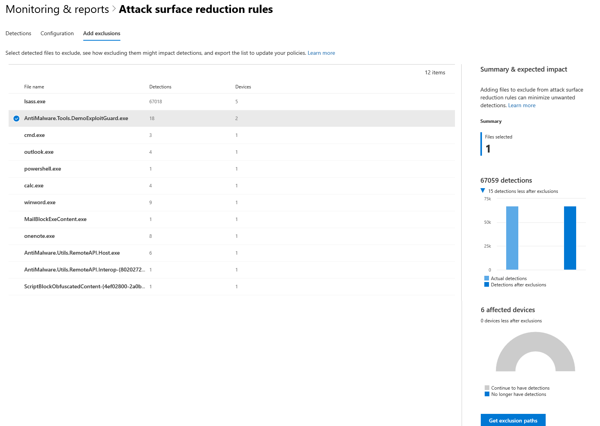

# <a name="device-monitoring-and-reporting-in-the-microsoft-365-security-center"></a>Apparaatcontrole en rapportage in het Microsoft 365-beveiligingscentrum

[!INCLUDE [Microsoft 365 Defender rebranding](../includes/microsoft-defender.md)]


Houd uw apparaten veilig, up-to-date en spot potentiële bedreigingen in het Microsoft 365-beveiligingscentrum.

## <a name="view-device-alerts"></a>Apparaatwaarschuwingen weergeven

Ontvang up-to-date waarschuwingen over inbreukactiviteit en andere bedreigingen op uw apparaten van Microsoft Defender for Endpoint (beschikbaar met een E5-licentie). Het Microsoft 365-beveiligingscentrum bewaakt deze waarschuwingen effectief op een hoog niveau met behulp van de werkstroom van uw voorkeur.

### <a name="monitor-high-impact-alerts"></a>Impactwaarschuwingen bewaken

Elke waarschuwing van Microsoft Defender voor eindpunt heeft een bijbehorende ernst (hoog, gemiddeld, laag of informatief). Hiermee wordt de potentiële impact op uw netwerk aangegeven als deze onbeheerd blijft.  

Gebruik de **kaart ernst van de apparaatwaarschuwing** om u specifiek te richten op waarschuwingen die ernstiger zijn en mogelijk onmiddellijke reactie vereisen. Via deze kaart kunt u meer informatie bekijken in de portal van het Microsoft Defender-beveiligingscentrum.


### <a name="understand-sources-of-alerts"></a>Informatiebronnen voor waarschuwingen

Microsoft Defender for Endpoint maakt gebruik van gegevens van een groot aantal beveiligingsonderzoekers en -informatiebronnen om waarschuwingen te genereren. U kunt bijvoorbeeld detectiegegevens van Microsoft Defender Antivirus en antimalware van derden gebruiken. Het kan ook uw eigen aangepaste bedreigingsinformatie gebruiken die via de webservice-API wordt aangeboden.

Op **de kaart apparaat met detectiebronnen** voor waarschuwingen ziet u de verdeling van waarschuwingen per bron. Houd activiteiten bij met betrekking tot bepaalde bronnen, met name uw aangepaste bronnen. U kunt de kaart ook gebruiken om te focussen op waarschuwingen van sensoren die niet zijn geconfigureerd om schadelijke activiteiten of onderdelen automatisch te blokkeren.


Via deze kaart kunt u meer informatie bekijken in de portal van het Microsoft Defender-beveiligingscentrum.

### <a name="understand-the-types-of-threats-that-trigger-alerts"></a>Informatie over de typen bedreigingen die waarschuwingen activeren

Microsoft Defender for Endpoint sorteert elke waarschuwing in een categorie die een bepaalde fase in de aanvalsketen of het type bedreigingsonderdeel vertegenwoordigt. Een gedetecteerde bedreigingsactiviteit kan bijvoorbeeld worden gecategoriseerd als 'laterale beweging' om aan te geven dat er een poging is gedaan om andere apparaten op het netwerk te bereiken. De activiteit heeft waarschijnlijk plaatsgevonden nadat aanvallers een eerste voettekst hebben gekregen. Wanneer dit wordt gedetecteerd, kan een bedreigingsonderdeel algemeen worden geclassificeerd als malware of specifiek als een specifiek bedreigingstype. Specifiek zijn ransomware, het stelen van referenties of andere typen schadelijke of ongewenste software.

De **kaart Apparaat bedreigingscategorieën** toont de verdeling van waarschuwingen in deze categorieën. Gebruik deze gegevens om risicoactiviteit te identificeren, zoals pogingen tot diefstal van referenties, die meestal meer impact hebben dan pogingen van sociale netwerken. U kunt ook controleren op potentiële schadelijke bedreigingen, zoals ransomware.


### <a name="monitor-active-alerts"></a>Actieve waarschuwingen bewaken

De **statuskaart voor apparaatwaarschuwingen** geeft het aantal waarschuwingen aan dat niet is opgelost en vereist mogelijk aandacht. Via deze kaart kunt u meer informatie bekijken in de portal van het Microsoft Defender-beveiligingscentrum.


### <a name="monitor-classification-of-resolved-alerts"></a>Classificatie van opgeloste waarschuwingen controleren

Bij het oplossen van een waarschuwing van Microsoft Defender voor eindpunt, kan uw beveiligingspersoneel opgeven of een waarschuwing is geverifieerd als:

* Een echte waarschuwing die werkelijke inbreukactiviteit of bedreigingsonderdelen identificeert
* Een foutmelding die ten onrechte normale activiteit heeft gedetecteerd

Op **de kaart met de classificatie** van apparaatwaarschuwingen kunt u zien of uw opgeloste waarschuwingen zijn geclassificeerd als waar of onwaar. Via deze kaart kunt u meer informatie bekijken in de portal van het Microsoft Defender-beveiligingscentrum.

Opmerking: In sommige gevallen zijn classificatiegegevens niet beschikbaar voor bepaalde waarschuwingen.


### <a name="monitor-determination-of-resolved-alerts"></a>Controle van het aantal opgeloste waarschuwingen

Naast het classificeren of een waarschuwing waar of onwaar is tijdens de oplossing, kan uw beveiligingspersoneel een beslissing nemen. Een bericht geeft het type normale of schadelijke activiteit aan dat is aangetroffen tijdens het valideren van de waarschuwing.

Op **de kaart voor het bericht van** de apparaatmelding ziet u de bepalingen die voor elke waarschuwing zijn verstrekt.

* **APT:** geavanceerde permanente bedreiging, waarmee wordt aangegeven dat de gedetecteerde activiteit of het bedreigingsonderdeel deel uitmaakt van een geavanceerde inbreuk die is ontworpen om voetteksten te krijgen in het betreffende netwerk  
* **Malware:** schadelijk bestand of schadelijke code
* **Beveiligingsmedewerkers:** normale activiteiten uitgevoerd door beveiligingsmedewerkers
* **Beveiligingstests:** activiteiten of onderdelen die zijn ontworpen om werkelijke bedreigingen na te bootsen en die naar verwachting beveiligingscamera's activeren en waarschuwingen genereren
* **Ongewenste software:** apps en andere software die niet als schadelijk worden beschouwd, maar die anders in strijd zijn met het beleid of acceptabele gebruiksstandaarden
* **Overige:** alle andere bepalingen die niet onder de opgegeven typen vallen

Via deze kaart kunt u meer informatie bekijken in het Microsoft Defender-beveiligingscentrum.


### <a name="understand-which-devices-are-at-risk"></a>Begrijpen welke apparaten risico lopen

**Apparaatbeveiliging** toont het risiconiveau voor apparaten. Het risiconiveau is gebaseerd op factoren zoals het type en de ernst van waarschuwingen op het apparaat.


## <a name="monitor-and-report-status-of-intune-managed-devices"></a>De status van Intune-beheerde apparaten controleren en rapporteren

De volgende rapporten bevatten gegevens van apparaten die zijn geregistreerd in Intune. Gegevens van niet-geregistreerde apparaten zijn niet opgenomen. Alleen globale beheerders kunnen deze kaarten bekijken.

Intune geregistreerde apparaatgegevens omvatten:

* Apparaat compliance
* Apparaten met actieve malware
* Typen malware op apparaten
* Malware op apparaten
* Apparaten met malwaredetectie
* Gebruikers met malwaredetectie

### <a name="monitor-device-compliance"></a>Apparaat compliance bewaken

**Apparaat compliance** laat zien hoeveel apparaten die zijn ingeschreven in Intune voldoen aan configuratiebeleidsregels.


### <a name="discover-devices-with-malware-detections"></a>Apparaten ontdekken met malwaredetectie

**Detectie van malware op** apparaten biedt het aantal intune geregistreerde apparaten met malware die nog niet volledig is opgelost. Een gebrek aan oplossing kan te maken hebben met acties die in behandeling zijn, een opnieuw opstarten, een volledige scan, handmatige gebruikersacties of als de herstelactie niet is voltooid.


### <a name="understand-the-types-of-malware-detected"></a>Meer informatie over de gevonden typen malware

**Typen malware op apparaten** bevatten verschillende soorten malware die zijn gedetecteerd op apparaten die zijn geregistreerd in Intune. U kunt elk type onderzoeken in het Microsoft 365-beveiligingscentrum.


### <a name="understand-the-specific-malware-detected-on-your-devices"></a>Meer informatie over de specifieke malware die op uw apparaten is gedetecteerd

**Malware op apparaten bevat** een lijst met specifieke malware die op uw apparaten is gedetecteerd.


### <a name="understand-which-devices-have-the-most-malware"></a>Begrijpen welke apparaten de meeste malware bevatten

**Apparaten met malwaredetectie geven** aan op welke apparaten de meeste malwaredetecties zijn geïnstalleerd. in het Microsoft 365-beveiligingscentrum kunt u onderzoeken of malware actief is, wie het apparaat gebruikt en wat de beheerstatus is in Intune.


### <a name="understand-which-users-have-devices-with-the-most-malware"></a>Begrijpen welke gebruikers apparaten hebben met de meeste malware

**Gebruikers met malwaredetectie tonen** gebruikers met apparaten met de meeste malwaredetecties. In het Microsoft 365-beveiligingscentrum kunt u zien hoeveel apparaten aan elke gebruiker zijn toegewezen, en meer informatie over elk apparaat en het type malware.


## <a name="monitor-and-manage-attack-surface-reduction-rule-deployment-and-detections"></a>Controle en beheer van regelimplementatie en detecties voor het aanvallen van surfaces

[Asr-regels (Attack Surface Reduction)](https://docs.microsoft.com/windows/security/threat-protection/microsoft-defender-atp/attack-surface-reduction) helpen acties en apps te voorkomen die doorgaans worden gebruikt door misbruik van malware om apparaten te infecteren. Deze regels bepalen wanneer en hoe uitvoerbare bestanden kunnen worden uitgevoerd. U kunt bijvoorbeeld voorkomen dat JavaScript of VBScript een gedownload uitvoerbaar uitvoerbaar bestand start, Win32 API-aanroepen vanuit Office-macro's blokkeert of processen blokkeert die worden uitgevoerd vanaf USB-stations.


De **kaart voor het verminderen van regels** voor aanvallen biedt een overzicht van de implementatie van regels op uw apparaten.

Op de bovenste balk van de kaart ziet u het totale aantal apparaten in de volgende implementatiemodi:

* **Blokkeringsmodus:** apparaten met ten minste één regel geconfigureerd om gedetecteerde activiteit te blokkeren
* **Controlemodus:** apparaten zonder regels die zijn ingesteld om gedetecteerde activiteit te blokkeren, maar minimaal één regel ingesteld om gedetecteerde activiteit te controleren  
* **Uitgeschakeld:** apparaten met alle ASR-regels uitgeschakeld

In het onderste deel van deze kaart ziet u instellingen per regel op uw apparaten. Elke balk geeft het aantal apparaten aan dat is ingesteld voor blokkering, controle of dat de regel volledig is uitgeschakeld.

### <a name="view-asr-detections"></a>ASR-detecties weergeven

Als u gedetailleerde informatie over ASR-regeldetectie in uw  netwerk wilt bekijken, selecteert u **Detecties** weergeven op de kaart Regels voor het verminderen van het aanvallenoppervlak. Het **tabblad Detecties** op de gedetailleerde rapportpagina wordt geopend.


In het diagram boven aan de pagina ziet u detecties tijdens het stapelen van detecties die zijn geblokkeerd of gecontroleerd. De tabel onderaan bevat de meest recente detecties. Gebruik de volgende informatie in de tabel om de aard van de detecties te begrijpen:

* **Bestand gedetecteerd:** het bestand, meestal een script of document, waarvan de inhoud de verdachte aanvalsactiviteit heeft geactiveerd
* **Regel:** de naam die de aanvalsactiviteiten beschrijft die door de regel worden beschreven. Meer informatie over bestaande ASR-regels
* **Bron-app:** de toepassing waarmee inhoud wordt geladen of uitgevoerd die de verdachte aanvalsactiviteit activeert. Dit kan een legitieme toepassing zijn, zoals een webbrowser, een Office-toepassing of een systeemprogramma zoals PowerShell.
* **Publisher:** de leverancier die de bron-app heeft uitgebracht

### <a name="review-device-asr-rule-settings"></a>Instellingen voor ASR-regels op apparaat controleren

Ga op **de rapportpagina Regels** voor  het verminderen van aanvallen naar het tabblad Configuratie om de regelinstellingen voor afzonderlijke apparaten te bekijken. Selecteer een apparaat voor gedetailleerde informatie over of elke regel de blokkeringsmodus, de auditmodus of helemaal is uitgeschakeld.


Microsoft Intune biedt beheerfunctionaliteit voor uw ASR-regels. Als u uw instellingen wilt bijwerken, selecteert u **Aan** de slag onder Apparaten configureren **op** het tabblad om apparaatbeheer te openen in Intune.

### <a name="exclude-files-from-asr-rules"></a>Bestanden uitsluiten van ASR-regels

Het Microsoft 365-beveiligingscentrum verzamelt [](https://docs.microsoft.com/windows/security/threat-protection/microsoft-defender-atp/enable-attack-surface-reduction#exclude-files-and-folders-from-asr-rules) de namen van de bestanden die u mogelijk wilt uitsluiten van detecties door regels voor het verminderen van het aanvallen van het oppervlak. Door bestanden uit te sluiten, kunt u fout-positieve detecties verminderen en met meer vertrouwen de regels voor het beperken van het aanvalsoppervlak implementeren in de blokkeringsmodus.

De uitsluitingen worden beheerd op Microsoft Intune, maar het Microsoft 365-beveiligingscentrum biedt een analysehulpmiddel om de bestanden beter te begrijpen. Om te beginnen met het  verzamelen van bestanden voor uitsluitingen, gaat u naar het tabblad Uitsluitingen toevoegen op de rapportpagina Regels voor het verminderen van **aanvallen.**

>[!NOTE]  
>Het hulpprogramma analyseert detecties door alle regels voor het verminderen van aanvallen, maar slechts enkele [regels ondersteunen uitsluitingen.](https://docs.microsoft.com/windows/security/threat-protection/microsoft-defender-atp/troubleshoot-asr)



De tabel bevat alle bestandsnamen die zijn gedetecteerd door uw regels voor het verminderen van aanvallen. U kunt bestanden selecteren om de gevolgen van het uitsluiten ervan te bekijken:

* Het aantal minder detecties
* Het aantal apparaten dat de detecties meldt

Als u een lijst wilt zien van de geselecteerde bestanden met hun volledige paden voor uitsluiting, selecteert u **Uitsluitingspaden downloaden.**

Logboeken voor het blokkeren van referenties voor asr-regels die het subsysteem van de lokale beveiligingsinstantie **van Windows (lsass.exe)** stelen, vastleggen de bron-app **** lsass.exe. Het is een normaal systeembestand, maar geregistreerd als het gedetecteerde bestand. Hierdoor wordt dit bestand opgenomen in de gegenereerde lijst met uitsluitingspaden. Als u het bestand dat deze regel heeft veroorzaakt wilt uitsluiten **lsass.exe,** gebruikt u het pad naar de bron-app in plaats van het gedetecteerde bestand.

Voer de volgende geavanceerde zoekquery uit voor deze specifieke regel (geïdentificeerd met regel-id 9e6c4e1f-7d60-472f-ba1a-a39ef669e4b2): [](https://docs.microsoft.com/windows/security/threat-protection/microsoft-defender-atp/advanced-hunting)

```kusto
DeviceEvents
| where Timestamp > ago(7d)
| where ActionType startswith "Asr"
| where AdditionalFields contains "9e6c4e1f-7d60-472f-ba1a-a39ef669e4b2"
| project InitiatingProcessFolderPath, InitiatingProcessFileName
```

#### <a name="check-files-for-exclusion"></a>Bestanden controleren op uitsluiting

Voordat u een bestand uit uitsluiten van ASR, raden we u aan het bestand te controleren om na te gaan of het inderdaad niet schadelijk is.

Als u een bestand wilt controleren, gebruikt [u de pagina met bestandsgegevens](https://docs.microsoft.com/windows/security/threat-protection/microsoft-defender-atp/investigate-files) in het Microsoft Defender-beveiligingscentrum. De pagina bevat informatie over het virus en de antivirusdetectieverhouding van VirusTotal. U kunt het bestand ook verzenden via de pagina voor uitgebreide analyse.

Als u een gevonden bestand wilt vinden in het Microsoft Defender-beveiligingscentrum, zoekt u naar alle ASR-detecties met behulp van de volgende geavanceerde zoekquery:

```kusto
MiscEvents
| where EventTime > ago(7d)
| where ActionType startswith "Asr"
| project FolderPath, FileName, SHA1, InitiatingProcessFolderPath, InitiatingProcessFileName, InitiatingProcessSHA1
```

Gebruik de **SHA1** of **de InitiatingProcessSHA1** in de resultaten om naar het bestand te zoeken met behulp van de universele zoekbalk in het Microsoft Defender-beveiligingscentrum.
