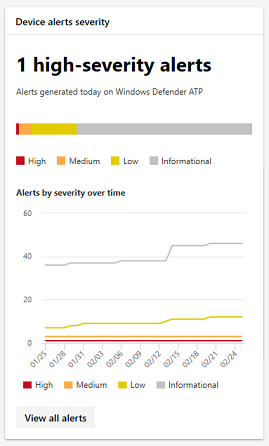

# <a name="device-monitoring-and-reporting-in-the-microsoft-365-security-center"></a>Apparaatbewaking en -rapportage in het Microsoft 365-beveiligingscentrum

Houd uw apparaten veilig, up-to-date en spot potentiële bedreigingen in het Microsoft 365-beveiligingscentrum.

## <a name="view-device-alerts"></a>Apparaatwaarschuwingen weergeven

Ontvang up-to-date meldingen over inbreukactiviteiten en andere bedreigingen op uw apparaten via Microsoft Defender ATP (beschikbaar met een E5-licentie). Microsoft 365 security center controleert deze waarschuwingen effectief op een hoog niveau met behulp van uw gewenste workflow.

### <a name="monitor-high-impact-alerts"></a>Waarschuwingen met hoge impact controleren

Elke Microsoft Defender ATP-waarschuwing heeft een overeenkomstige ernst (hoog, gemiddeld, laag of informatief) die de mogelijke impact op uw netwerk aangeeft als deze onbeheerd achterblijft.  

Gebruik de **apparaatwaarschuwingskaart** om zich specifiek te richten op waarschuwingen die ernstiger zijn en mogelijk onmiddellijk moeten worden beantwoord. Op deze kaart u meer informatie bekijken over de Microsoft Defender Security Center-portal.



### <a name="understand-sources-of-alerts"></a>Bronnen van waarschuwingen begrijpen

Microsoft Defender ATP maakt gebruik van gegevens van een breed scala aan beveiligingssensoren en inlichtingenbronnen om waarschuwingen te genereren. Het kan bijvoorbeeld detectie-informatie van Windows Defender Antivirus en antimalware van derden gebruiken, evenals uw eigen aangepaste bedreigingsinformatie die wordt verstrekt via de API van de webservice.

De kaart voor **detectiedetectie** van apparaten toont de verspreiding van waarschuwingen per bron. Deze kaart kan u helpen bij te houden activiteit met betrekking tot bepaalde bronnen, met name uw aangepaste bronnen. U dit ook gebruiken om u te concentreren op waarschuwingen afkomstig van sensoren die niet zijn geconfigureerd om schadelijke activiteiten of componenten automatisch te blokkeren.


Op deze kaart u meer informatie bekijken over de Microsoft Defender Security Center-portal.

### <a name="understand-the-types-of-threats-that-trigger-alerts"></a>Inzicht in de soorten bedreigingen die waarschuwingen veroorzaken

Microsoft Defender ATP sorteert elke waarschuwing in een categorie die een bepaalde fase in de aanvalsketen of een type bedreigingscomponent vertegenwoordigt. Een gedetecteerde bedreigingsactiviteit kan bijvoorbeeld worden gecategoriseerd als 'zijdelingse beweging' om aan te geven dat er een poging is gedaan om andere apparaten in het netwerk te bereiken. De activiteit heeft waarschijnlijk ook plaatsgevonden nadat aanvallers een eerste voet aan de grond kregen. Wanneer gedetecteerd, een bedreiging component kan ofwel in grote lijnen worden geclassificeerd als malware, of meer specifiek als ransomware, referentie stelen, of andere vormen van kwaadaardige of ongewenste software.

De kaart **voor bedreigingscategorieën apparaat** toont de verdeling van waarschuwingen in deze categorieën. U deze informatie gebruiken om bedreigingsactiviteit te identificeren, zoals pogingen tot diefstal van referenties, die een grotere impact kunnen hebben in vergelijking met pogingen tot social engineering. U deze informatie ook gebruiken om te controleren op potentieel destructieve bedreigingen zoals ransomware.


### <a name="monitor-active-alerts"></a>Actieve waarschuwingen controleren

De **statuskaart voor apparaatwaarschuwingen** geeft het aantal waarschuwingen aan dat niet is opgelost en waar mogelijk aandacht voor nodig is. Op deze kaart u meer informatie bekijken over de Microsoft Defender Security Center-portal.


### <a name="monitor-classification-of-resolved-alerts"></a>Classificatie van opgeloste waarschuwingen controleren

Wanneer u een Microsoft Defender ATP-waarschuwing oplost, kan uw beveiligingspersoneel opgeven of een waarschuwing is geverifieerd als:

* Een echte waarschuwing die werkelijke inbreukactiviteit of bedreigingscomponenten identificeert
* Een valse waarschuwing die ten onrechte normale activiteit heeft gedetecteerd

De **classificatiekaart voor apparaatwaarschuwingen** geeft aan of uw opgeloste waarschuwingen zijn geclassificeerd als echte of valse waarschuwingen. Op deze kaart u meer informatie bekijken over de Microsoft Defender Security Center-portal.

Opmerking: In sommige gevallen is classificatiegegevens niet beschikbaar voor bepaalde waarschuwingen.


### <a name="monitor-determination-of-resolved-alerts"></a>Controle bepaling van opgeloste waarschuwingen

Naast het classificeren of een waarschuwing waar of onwaar is tijdens de oplossing, kan uw beveiligingspersoneel een bepaling geven, die het type normale of kwaadaardige activiteit aangeeft dat is gevonden tijdens het valideren van de waarschuwing.

De **apparaatwaarschuwingsbepalingskaart** toont de bepaling die voor elke waarschuwing is opgegeven.

* **APT**: geavanceerde aanhoudende dreiging, die aangeeft dat de gedetecteerde activiteit of bedreigingscomponent deel uitmaakt van een geavanceerde inbreuk die is ontworpen om voet aan de grond te krijgen in het getroffen netwerk  
* **Malware**: kwaadaardig bestand of code
* **Beveiligingspersoneel**: normale activiteit uitgevoerd door beveiligingspersoneel
* **Beveiligingstests**: activiteit of componenten die zijn ontworpen om werkelijke bedreigingen te simuleren en naar verwachting beveiligingssensoren activeren en waarschuwingen genereren
* **Ongewenste software**: apps en andere software die niet als kwaadaardig worden beschouwd, maar anderszins in strijd zijn met beleid of aanvaardbare gebruiksnormen
* **Andere**: elke andere bepaling die niet onder de opgegeven typen valt

Op deze kaart u meer informatie bekijken in Microsoft Defender Security Center.


### <a name="understand-which-devices-are-at-risk"></a>Begrijpen welke apparaten risico lopen

**Apparaatbeveiliging** toont het risiconiveau voor apparaten. Het risiconiveau is gebaseerd op factoren zoals het type en de ernst van waarschuwingen op het apparaat.


## <a name="monitor-and-report-status-of-intune-managed-devices"></a>Status van intune-beheerde apparaten controleren en rapporteren

De volgende rapporten bevatten gegevens van apparaten die zijn ingeschreven in Intune. Gegevens van niet-ingeschreven apparaten worden niet opgenomen. Alleen globale beheerders kunnen deze kaarten bekijken.

Intune-gegevens van het apparaat omvatten:

* Naleving van het apparaat
* Apparaten met actieve malware
* Typen malware op apparaten
* Malware op apparaten
* Apparaten met malwaredetecties
* Gebruikers met malwaredetecties

### <a name="monitor-device-compliance"></a>Naleving van het apparaat controleren

**Apparaatnaleving** geeft aan hoeveel apparaten zijn ingeschreven bij Intune en voldoen aan het configuratiebeleid.


### <a name="discover-devices-with-malware-detections"></a>Ontdek apparaten met malwaredetecties

**Apparaat malware detecties** bieden het aantal Intune ingeschreven apparaten met malware die niet volledig zijn opgelost. Dit kan te wijten zijn aan lopende acties, een herstart, een volledige scan, handmatige gebruikersacties of als de herstelactie niet is voltooid.


### <a name="understand-the-types-of-malware-detected"></a>Inzicht in de soorten gedetecteerde malware

**Typen malware op apparaten** tonen verschillende soorten malware die zijn gedetecteerd op apparaten die zijn ingeschreven in Intune. U elk type in het Microsoft 365-beveiligingscentrum onderzoeken.


### <a name="understand-the-specific-malware-detected-on-your-devices"></a>Inzicht in de specifieke malware die op uw apparaten wordt gedetecteerd

**Malware op apparaten** biedt een lijst van de specifieke malware die op uw apparaten wordt gedetecteerd.


### <a name="understand-which-devices-have-the-most-malware"></a>Begrijpen welke apparaten de meeste malware hebben

**Apparaten met malwaredetecties** laten zien welke apparaten de meeste malwaredetecties hebben. in het Microsoft 365-beveiligingscentrum u onderzoeken of malware actief is, wie het apparaat gebruikt en de beheerstatus ervan in Intune.


### <a name="understand-which-users-have-devices-with-the-most-malware"></a>Begrijpen welke gebruikers apparaten met de meeste malware hebben

**Gebruikers met malwaredetecties** tonen gebruikers met apparaten die de meeste malwaredetecties hadden. In het Microsoft 365-beveiligingscentrum u zien hoeveel apparaten aan elke gebruiker zijn toegewezen en meer informatie over elk apparaat en het type malware.


## <a name="monitor-and-manage-asr-rule-deployment-and-detections"></a>Implementatie en detecties van ASR-regels bewaken en beheren

[Attack Surface Reduction (ASR) regels](https://docs.microsoft.com/windows/security/threat-protection/microsoft-defender-atp/attack-surface-reduction) helpen voorkomen dat acties en apps die meestal worden gebruikt door exploit-seeking malware om apparaten te infecteren. Deze regels bepalen wanneer en hoe uitvoerbare artikelen kunnen worden uitgevoerd. U bijvoorbeeld voorkomen dat JavaScript of VBScript een gedownloade uitvoerbare, Win32 API-aanroepen van Office-macro's blokkeert of processen blokkeren die vanaf USB-stations worden uitgevoerd.


De regels voor het verminderen van **het aanvalsoppervlak** bieden een overzicht van de implementatie van regels op uw apparaten.

De bovenste balk op de kaart toont het totale aantal apparaten dat zich in de volgende implementatiemodi begeeft:

* **Blokmodus:** apparaten met ten minste één regel geconfigureerd om gedetecteerde activiteit te blokkeren
* **Controlemodus**: apparaten zonder regels die zijn ingesteld om gedetecteerde activiteit te blokkeren, maar ten minste één regel hebben ingesteld om gedetecteerde activiteit te controleren  
* **Uit:** apparaten met alle ASR-regels uitgeschakeld

Het onderste deel van deze kaart toont instellingen per regel op uw apparaten. Elke balk geeft het aantal apparaten aan dat is ingesteld op het blokkeren of controleren van detectie of het volledig uitschakelen van de regel.

### <a name="view-asr-detections"></a>ASR-detecties weergeven

Als u gedetailleerde informatie over ASR-regeldetecties in uw netwerk wilt weergeven, selecteert u **Detecties weergeven** op de regels voor de beperking van het **aanvalsoppervlak.** Het tabblad **Detecties** op de gedetailleerde rapportpagina wordt geopend.


De grafiek boven aan de pagina toont detecties in de loop van de tijd stapelen detecties die werden geblokkeerd of gecontroleerd. De tabel onderaan bevat de meest recente detecties. Gebruik de volgende informatie op de tabel om de aard van de detecties te begrijpen:

* **Gedetecteerd bestand:** het bestand, meestal een script of een document, waarvan de inhoud de vermoedelijke aanvalsactiviteit heeft geactiveerd
* **Regel**: naam die de aanvalsactiviteiten beschrijft die de regel moet vangen. Lees meer over bestaande ASR-regels
* **Bron-app**: de toepassing die inhoud heeft geladen of uitgevoerd die de vermoedelijke aanvalsactiviteit activeerde. Dit kan een legitieme toepassing zijn, zoals webbrowser, een Office-toepassing of een systeemtool zoals PowerShell
* **Uitgever**: de leverancier die de bron-app heeft uitgebracht

### <a name="review-device-asr-rule-settings"></a>Asr-regelinstellingen van apparaat controleren

Ga op de rapportpagina **Aanvalsregels voor oppervlaktereductie** naar het tabblad **Configuratie** om regelinstellingen voor afzonderlijke apparaten te controleren. Selecteer een apparaat om gedetailleerde informatie te krijgen over de vraag of elke regel zich in de blokmodus, de controlemodus of de volledig uitgeschakelde modus bevindt.


Microsoft Intune biedt beheerfunctionaliteit voor uw ASR-regels. Als u uw instellingen wilt bijwerken, selecteert u **Aan de slag** onder Apparaten **configureren** op het tabblad om apparaatbeheer op Intune te openen.

### <a name="exclude-files-from-asr-rules"></a>Bestanden uitsluiten van ASR-regels

Microsoft 365 security center verzamelt de namen van de [bestanden die u zou willen uitsluiten](https://docs.microsoft.com/windows/security/threat-protection/microsoft-defender-atp/enable-attack-surface-reduction#exclude-files-and-folders-from-asr-rules) van detecties door aanval oppervlakte reductie regels. Door bestanden uit te sluiten, u fout-positieve detecties verminderen en met meer vertrouwen regels voor het verminderen van het aanvalsoppervlak implementeren in de blokmodus.

De uitsluitingen worden beheerd op Microsoft Intune, maar Microsoft 365 security center biedt een analysetool om u te helpen de bestanden te begrijpen. Als u wilt beginnen met het verzamelen van bestanden voor uitsluiting, gaat u naar het tabblad **Uitsluitingen toevoegen** op de rapportpagina **Aanvalsregels voor oppervlaktereductie.**

>[!NOTE]  
>De tool analyseert detecties door alle regels voor het verminderen van het aanvalsoppervlak, maar [slechts enkele regels ondersteunen uitsluitingen.](https://docs.microsoft.com/windows/security/threat-protection/microsoft-defender-atp/troubleshoot-asr)


De tabel bevat alle bestandsnamen die zijn gedetecteerd door de regels voor het verminderen van het aanvalsoppervlak. U bestanden selecteren om de impact van het uitsluiten ervan te controleren:

* Hoeveel minder detecties
* Hoeveel apparaten er minder zijn, melden de detecties

Als u een lijst wilt krijgen met de geselecteerde bestanden met hun volledige paden voor uitsluiting, selecteert u **Uitsluitingspaden opvragen**.

Logboeken voor de ASR-regel **Het blokkeren van referenties die stelen uit het subsysteem Windows local security authority (lsass.exe)** leggen de bron-app **lsass.exe**vast, een normaal systeembestand, als het gedetecteerde bestand. Als gevolg hiervan bevat de gegenereerde lijst met uitsluitingspaden dit bestand. Als u het bestand wilt uitsluiten dat deze regel heeft geactiveerd in plaats van **lsass.exe,** gebruikt u het pad naar de bron-app in plaats van het gedetecteerde bestand.

Voer de volgende [geavanceerde jachtquery](https://docs.microsoft.com/windows/security/threat-protection/microsoft-defender-atp/advanced-hunting) uit voor deze specifieke regel (aangeduid met regel-ID 9e6c4e1f-7d60-472f-ba1a-a39ef669e4b2):

```kusto
MiscEvents
| where EventTime > ago(7d)
| where ActionType startswith "Asr"
| where AdditionalFields contains "9e6c4e1f-7d60-472f-ba1a-a39ef669e4b2"
| project InitiatingProcessFolderPath, InitiatingProcessFileName
```

#### <a name="check-files-for-exclusion"></a>Bestanden controleren op uitsluiting

Voordat u een bestand van ASR uitsluit, raden we u aan het bestand te inspecteren om te bepalen of het inderdaad niet kwaadaardig is.

Als u een bestand wilt controleren, gebruikt u de [pagina bestandsgegevens](https://docs.microsoft.com/windows/security/threat-protection/microsoft-defender-atp/investigate-files) in Microsoft Defender Security Center. De pagina biedt prevalentie-informatie en de VirusTotal antivirusdetectieratio. U de pagina ook gebruiken om het bestand in te dienen voor diepe analyse.

Als u een gedetecteerd bestand wilt zoeken in Microsoft Defender Security Center, zoekt u naar alle ASR-detecties met behulp van de volgende geavanceerde jachtquery:

```kusto
MiscEvents
| where EventTime > ago(7d)
| where ActionType startswith "Asr"
| project FolderPath, FileName, SHA1, InitiatingProcessFolderPath, InitiatingProcessFileName, InitiatingProcessSHA1
```

Gebruik de **SHA1** of de **InitiateProcessSHA1** in de resultaten om naar het bestand te zoeken met behulp van de universele zoekbalk in Microsoft Defender Security Center.
