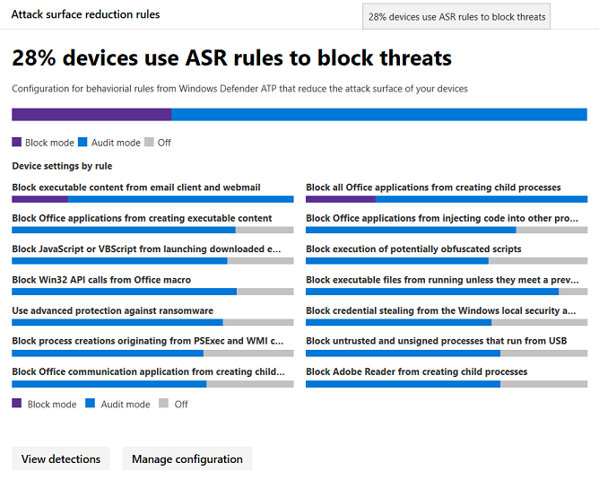

# <a name="device-monitoring-and-reporting-in-the-microsoft-365-security-center"></a><span data-ttu-id="65204-104">Apparaatbewaking en -rapportage in het Microsoft 365-beveiligingscentrum</span><span class="sxs-lookup"><span data-stu-id="65204-104">Device monitoring and reporting in the Microsoft 365 security center</span></span>

<span data-ttu-id="65204-105">Houd uw apparaten veilig, up-to-date en spot potentiële bedreigingen in het Microsoft 365-beveiligingscentrum.</span><span class="sxs-lookup"><span data-stu-id="65204-105">Keep your devices secure, up-to-date, and spot potential threats in the Microsoft 365 security center.</span></span>

## <a name="view-device-alerts"></a><span data-ttu-id="65204-106">Apparaatwaarschuwingen weergeven</span><span class="sxs-lookup"><span data-stu-id="65204-106">View device alerts</span></span>

<span data-ttu-id="65204-107">Ontvang up-to-date meldingen over inbreukactiviteiten en andere bedreigingen op uw apparaten via Microsoft Defender ATP (beschikbaar met een E5-licentie).</span><span class="sxs-lookup"><span data-stu-id="65204-107">Get up-to-date alerts about breach activity and other threats on your devices from Microsoft Defender ATP (available with an E5 license).</span></span> <span data-ttu-id="65204-108">Microsoft 365 security center controleert deze waarschuwingen effectief op een hoog niveau met behulp van uw gewenste workflow.</span><span class="sxs-lookup"><span data-stu-id="65204-108">Microsoft 365 security center effectively monitors these alerts at a high level using your preferred workflow.</span></span>

### <a name="monitor-high-impact-alerts"></a><span data-ttu-id="65204-109">Waarschuwingen met hoge impact controleren</span><span class="sxs-lookup"><span data-stu-id="65204-109">Monitor high-impact alerts</span></span>

<span data-ttu-id="65204-110">Elke Microsoft Defender ATP-waarschuwing heeft een overeenkomstige ernst (hoog, gemiddeld, laag of informatief) die de mogelijke impact op uw netwerk aangeeft als deze onbeheerd achterblijft.</span><span class="sxs-lookup"><span data-stu-id="65204-110">Each Microsoft Defender ATP alert has a corresponding severity (high, medium, low, or informational) that indicates its potential impact to your network if left unattended.</span></span>  

<span data-ttu-id="65204-111">Gebruik de **apparaatwaarschuwingskaart** om zich specifiek te richten op waarschuwingen die ernstiger zijn en mogelijk onmiddellijk moeten worden beantwoord.</span><span class="sxs-lookup"><span data-stu-id="65204-111">Use the **Device alert severity** card to focus specifically on alerts that are more severe and might require immediate response.</span></span> <span data-ttu-id="65204-112">Op deze kaart u meer informatie bekijken over de Microsoft Defender Security Center-portal.</span><span class="sxs-lookup"><span data-stu-id="65204-112">From this card, you can view more information on the Microsoft Defender Security Center portal.</span></span>


### <a name="understand-sources-of-alerts"></a><span data-ttu-id="65204-114">Bronnen van waarschuwingen begrijpen</span><span class="sxs-lookup"><span data-stu-id="65204-114">Understand sources of alerts</span></span>

<span data-ttu-id="65204-115">Microsoft Defender ATP maakt gebruik van gegevens van een breed scala aan beveiligingssensoren en inlichtingenbronnen om waarschuwingen te genereren.</span><span class="sxs-lookup"><span data-stu-id="65204-115">Microsoft Defender ATP leverages data from a broad range of security sensors and intelligence sources to generate alerts.</span></span> <span data-ttu-id="65204-116">Het kan bijvoorbeeld detectie-informatie van Windows Defender Antivirus en antimalware van derden gebruiken, evenals uw eigen aangepaste bedreigingsinformatie die wordt verstrekt via de API van de webservice.</span><span class="sxs-lookup"><span data-stu-id="65204-116">For example, it can use detection information from Windows Defender Antivirus and third-party antimalware, as well as your own custom threat intelligence provided through the web service API.</span></span>

<span data-ttu-id="65204-117">De kaart voor **detectiedetectie** van apparaten toont de verspreiding van waarschuwingen per bron.</span><span class="sxs-lookup"><span data-stu-id="65204-117">The **Device alert detection** sources card shows the distribution of alerts by source.</span></span> <span data-ttu-id="65204-118">Deze kaart kan u helpen bij te houden activiteit met betrekking tot bepaalde bronnen, met name uw aangepaste bronnen.</span><span class="sxs-lookup"><span data-stu-id="65204-118">This card can help you track activity related to certain sources, particularly your custom sources.</span></span> <span data-ttu-id="65204-119">U dit ook gebruiken om u te concentreren op waarschuwingen afkomstig van sensoren die niet zijn geconfigureerd om schadelijke activiteiten of componenten automatisch te blokkeren.</span><span class="sxs-lookup"><span data-stu-id="65204-119">You can also use this to focus on alerts coming from sensors that are not configured to automatically block malicious activity or components.</span></span>


<span data-ttu-id="65204-121">Op deze kaart u meer informatie bekijken over de Microsoft Defender Security Center-portal.</span><span class="sxs-lookup"><span data-stu-id="65204-121">From this card, you can view more information on the Microsoft Defender Security Center portal.</span></span>

### <a name="understand-the-types-of-threats-that-trigger-alerts"></a><span data-ttu-id="65204-122">Inzicht in de soorten bedreigingen die waarschuwingen veroorzaken</span><span class="sxs-lookup"><span data-stu-id="65204-122">Understand the types of threats that trigger alerts</span></span>

<span data-ttu-id="65204-123">Microsoft Defender ATP sorteert elke waarschuwing in een categorie die een bepaalde fase in de aanvalsketen of een type bedreigingscomponent vertegenwoordigt.</span><span class="sxs-lookup"><span data-stu-id="65204-123">Microsoft Defender ATP sorts each alert into a category representing a certain stage in the attack chain or a type of threat component.</span></span> <span data-ttu-id="65204-124">Een gedetecteerde bedreigingsactiviteit kan bijvoorbeeld worden gecategoriseerd als 'zijdelingse beweging' om aan te geven dat er een poging is gedaan om andere apparaten in het netwerk te bereiken.</span><span class="sxs-lookup"><span data-stu-id="65204-124">For example, a detected threat activity might be categorized as "lateral movement" to indicate that there was an attempt to reach other devices on the network.</span></span> <span data-ttu-id="65204-125">De activiteit heeft waarschijnlijk ook plaatsgevonden nadat aanvallers een eerste voet aan de grond kregen.</span><span class="sxs-lookup"><span data-stu-id="65204-125">The activity has also likely occurred after attackers gained an initial foothold.</span></span> <span data-ttu-id="65204-126">Wanneer gedetecteerd, een bedreiging component kan ofwel in grote lijnen worden geclassificeerd als malware, of meer specifiek als ransomware, referentie stelen, of andere vormen van kwaadaardige of ongewenste software.</span><span class="sxs-lookup"><span data-stu-id="65204-126">When detected, a threat component might either be classified broadly as malware, or more specifically as ransomware, credential stealing, or other types of malicious or unwanted software.</span></span>

<span data-ttu-id="65204-127">De kaart **voor bedreigingscategorieën apparaat** toont de verdeling van waarschuwingen in deze categorieën.</span><span class="sxs-lookup"><span data-stu-id="65204-127">The **Device threat categories** card shows the distribution of alerts into these categories.</span></span> <span data-ttu-id="65204-128">U deze informatie gebruiken om bedreigingsactiviteit te identificeren, zoals pogingen tot diefstal van referenties, die een grotere impact kunnen hebben in vergelijking met pogingen tot social engineering.</span><span class="sxs-lookup"><span data-stu-id="65204-128">You can use this information to identify threat activity, such as credential theft attempts, that can have higher impact compared to social engineering attempts.</span></span> <span data-ttu-id="65204-129">U deze informatie ook gebruiken om te controleren op potentieel destructieve bedreigingen zoals ransomware.</span><span class="sxs-lookup"><span data-stu-id="65204-129">You can also use this information to monitor for potentially destructive threats like ransomware.</span></span>


### <a name="monitor-active-alerts"></a><span data-ttu-id="65204-131">Actieve waarschuwingen controleren</span><span class="sxs-lookup"><span data-stu-id="65204-131">Monitor active alerts</span></span>

<span data-ttu-id="65204-132">De **statuskaart voor apparaatwaarschuwingen** geeft het aantal waarschuwingen aan dat niet is opgelost en waar mogelijk aandacht voor nodig is.</span><span class="sxs-lookup"><span data-stu-id="65204-132">The **Device alert status** card indicates the number of alerts that have not been resolved and might require attention.</span></span> <span data-ttu-id="65204-133">Op deze kaart u meer informatie bekijken over de Microsoft Defender Security Center-portal.</span><span class="sxs-lookup"><span data-stu-id="65204-133">From this card, you can view more information on the Microsoft Defender Security Center portal.</span></span>


### <a name="monitor-classification-of-resolved-alerts"></a><span data-ttu-id="65204-135">Classificatie van opgeloste waarschuwingen controleren</span><span class="sxs-lookup"><span data-stu-id="65204-135">Monitor classification of resolved alerts</span></span>

<span data-ttu-id="65204-136">Wanneer u een Microsoft Defender ATP-waarschuwing oplost, kan uw beveiligingspersoneel opgeven of een waarschuwing is geverifieerd als:</span><span class="sxs-lookup"><span data-stu-id="65204-136">When resolving a Microsoft Defender ATP alert, your security staff can specify whether an alert has been verified as:</span></span>

* <span data-ttu-id="65204-137">Een echte waarschuwing die werkelijke inbreukactiviteit of bedreigingscomponenten identificeert</span><span class="sxs-lookup"><span data-stu-id="65204-137">A true alert that identifies actual breach activity or threat components</span></span>
* <span data-ttu-id="65204-138">Een valse waarschuwing die ten onrechte normale activiteit heeft gedetecteerd</span><span class="sxs-lookup"><span data-stu-id="65204-138">A false alert that has incorrectly detected normal activity</span></span>

<span data-ttu-id="65204-139">De **classificatiekaart voor apparaatwaarschuwingen** geeft aan of uw opgeloste waarschuwingen zijn geclassificeerd als echte of valse waarschuwingen.</span><span class="sxs-lookup"><span data-stu-id="65204-139">The **Device alert classification** card shows whether your resolved alerts have been classified as true or false alerts.</span></span> <span data-ttu-id="65204-140">Op deze kaart u meer informatie bekijken over de Microsoft Defender Security Center-portal.</span><span class="sxs-lookup"><span data-stu-id="65204-140">From this card, you can view more information on the Microsoft Defender Security Center portal.</span></span>

<span data-ttu-id="65204-141">Opmerking: In sommige gevallen is classificatiegegevens niet beschikbaar voor bepaalde waarschuwingen.</span><span class="sxs-lookup"><span data-stu-id="65204-141">Note: In some cases, classification information is unavailable for certain alerts.</span></span>


### <a name="monitor-determination-of-resolved-alerts"></a><span data-ttu-id="65204-143">Controle bepaling van opgeloste waarschuwingen</span><span class="sxs-lookup"><span data-stu-id="65204-143">Monitor determination of resolved alerts</span></span>

<span data-ttu-id="65204-144">Naast het classificeren of een waarschuwing waar of onwaar is tijdens de oplossing, kan uw beveiligingspersoneel een bepaling geven, die het type normale of kwaadaardige activiteit aangeeft dat is gevonden tijdens het valideren van de waarschuwing.</span><span class="sxs-lookup"><span data-stu-id="65204-144">In addition to classifying whether an alert is true or false during resolution, your security staff can provide a determination, indicating the type of normal or malicious activity that was found while validating the alert.</span></span>

<span data-ttu-id="65204-145">De **apparaatwaarschuwingsbepalingskaart** toont de bepaling die voor elke waarschuwing is opgegeven.</span><span class="sxs-lookup"><span data-stu-id="65204-145">The **Device alert determination** card shows the determination provided for each alert.</span></span>

* <span data-ttu-id="65204-146">**APT**: geavanceerde aanhoudende dreiging, die aangeeft dat de gedetecteerde activiteit of bedreigingscomponent deel uitmaakt van een geavanceerde inbreuk die is ontworpen om voet aan de grond te krijgen in het getroffen netwerk</span><span class="sxs-lookup"><span data-stu-id="65204-146">**APT**: advanced persistent threat, indicating that the detected activity or threat component is part of a sophisticated breach designed to gain a foothold in the affected network</span></span>  
* <span data-ttu-id="65204-147">**Malware**: kwaadaardig bestand of code</span><span class="sxs-lookup"><span data-stu-id="65204-147">**Malware**: malicious file or code</span></span>
* <span data-ttu-id="65204-148">**Beveiligingspersoneel**: normale activiteit uitgevoerd door beveiligingspersoneel</span><span class="sxs-lookup"><span data-stu-id="65204-148">**Security personnel**: normal activity performed by security staff</span></span>
* <span data-ttu-id="65204-149">**Beveiligingstests**: activiteit of componenten die zijn ontworpen om werkelijke bedreigingen te simuleren en naar verwachting beveiligingssensoren activeren en waarschuwingen genereren</span><span class="sxs-lookup"><span data-stu-id="65204-149">**Security testing**: activity or components designed to simulate actual threats and expected to trigger security sensors and generate alerts</span></span>
* <span data-ttu-id="65204-150">**Ongewenste software**: apps en andere software die niet als kwaadaardig worden beschouwd, maar anderszins in strijd zijn met beleid of aanvaardbare gebruiksnormen</span><span class="sxs-lookup"><span data-stu-id="65204-150">**Unwanted software**: apps and other software that are not considered malicious, but otherwise violate policy or acceptable use standards</span></span>
* <span data-ttu-id="65204-151">**Andere**: elke andere bepaling die niet onder de opgegeven typen valt</span><span class="sxs-lookup"><span data-stu-id="65204-151">**Others**: any other determination that does not fall under the provided types</span></span>

<span data-ttu-id="65204-152">Op deze kaart u meer informatie bekijken in Microsoft Defender Security Center.</span><span class="sxs-lookup"><span data-stu-id="65204-152">From this card, you can view more information in Microsoft Defender Security Center.</span></span>


### <a name="understand-which-devices-are-at-risk"></a><span data-ttu-id="65204-154">Begrijpen welke apparaten risico lopen</span><span class="sxs-lookup"><span data-stu-id="65204-154">Understand which devices are at risk</span></span>

<span data-ttu-id="65204-155">**Apparaatbeveiliging** toont het risiconiveau voor apparaten.</span><span class="sxs-lookup"><span data-stu-id="65204-155">**Device protection** shows the risk level for devices.</span></span> <span data-ttu-id="65204-156">Het risiconiveau is gebaseerd op factoren zoals het type en de ernst van waarschuwingen op het apparaat.</span><span class="sxs-lookup"><span data-stu-id="65204-156">The risk level is based on factors such as the type and severity of alerts on the device.</span></span>


## <a name="monitor-and-report-status-of-intune-managed-devices"></a><span data-ttu-id="65204-158">Status van intune-beheerde apparaten controleren en rapporteren</span><span class="sxs-lookup"><span data-stu-id="65204-158">Monitor and report status of Intune-managed devices</span></span>

<span data-ttu-id="65204-159">De volgende rapporten bevatten gegevens van apparaten die zijn ingeschreven in Intune.</span><span class="sxs-lookup"><span data-stu-id="65204-159">The following reports contain data from devices enrolled in Intune.</span></span> <span data-ttu-id="65204-160">Gegevens van niet-ingeschreven apparaten worden niet opgenomen.</span><span class="sxs-lookup"><span data-stu-id="65204-160">Data from unenrolled devices is not included.</span></span> <span data-ttu-id="65204-161">Alleen globale beheerders kunnen deze kaarten bekijken.</span><span class="sxs-lookup"><span data-stu-id="65204-161">Only Global Administrators can view these cards.</span></span>

<span data-ttu-id="65204-162">Intune-gegevens van het apparaat omvatten:</span><span class="sxs-lookup"><span data-stu-id="65204-162">Intune enrolled device data includes:</span></span>

* <span data-ttu-id="65204-163">Naleving van het apparaat</span><span class="sxs-lookup"><span data-stu-id="65204-163">Device compliance</span></span>
* <span data-ttu-id="65204-164">Apparaten met actieve malware</span><span class="sxs-lookup"><span data-stu-id="65204-164">Devices with active malware</span></span>
* <span data-ttu-id="65204-165">Typen malware op apparaten</span><span class="sxs-lookup"><span data-stu-id="65204-165">Types of malware on devices</span></span>
* <span data-ttu-id="65204-166">Malware op apparaten</span><span class="sxs-lookup"><span data-stu-id="65204-166">Malware on devices</span></span>
* <span data-ttu-id="65204-167">Apparaten met malwaredetecties</span><span class="sxs-lookup"><span data-stu-id="65204-167">Devices with malware detections</span></span>
* <span data-ttu-id="65204-168">Gebruikers met malwaredetecties</span><span class="sxs-lookup"><span data-stu-id="65204-168">Users with malware detections</span></span>

### <a name="monitor-device-compliance"></a><span data-ttu-id="65204-169">Naleving van het apparaat controleren</span><span class="sxs-lookup"><span data-stu-id="65204-169">Monitor device compliance</span></span>

<span data-ttu-id="65204-170">**Apparaatnaleving** geeft aan hoeveel apparaten zijn ingeschreven bij Intune en voldoen aan het configuratiebeleid.</span><span class="sxs-lookup"><span data-stu-id="65204-170">**Device compliance** shows how many devices that are enrolled in Intune comply with configuration policies.</span></span>


### <a name="discover-devices-with-malware-detections"></a><span data-ttu-id="65204-172">Ontdek apparaten met malwaredetecties</span><span class="sxs-lookup"><span data-stu-id="65204-172">Discover devices with malware detections</span></span>

<span data-ttu-id="65204-173">**Apparaat malware detecties** bieden het aantal Intune ingeschreven apparaten met malware die niet volledig zijn opgelost.</span><span class="sxs-lookup"><span data-stu-id="65204-173">**Device malware detections** provide the number of Intune enrolled devices with malware that have not been fully resolved.</span></span> <span data-ttu-id="65204-174">Dit kan te wijten zijn aan lopende acties, een herstart, een volledige scan, handmatige gebruikersacties of als de herstelactie niet is voltooid.</span><span class="sxs-lookup"><span data-stu-id="65204-174">This can be due to pending actions, a restart, a full scan, manual user actions, or if the remediation action did not complete successfully.</span></span>


### <a name="understand-the-types-of-malware-detected"></a><span data-ttu-id="65204-176">Inzicht in de soorten gedetecteerde malware</span><span class="sxs-lookup"><span data-stu-id="65204-176">Understand the types of malware detected</span></span>

<span data-ttu-id="65204-177">**Typen malware op apparaten** tonen verschillende soorten malware die zijn gedetecteerd op apparaten die zijn ingeschreven in Intune.</span><span class="sxs-lookup"><span data-stu-id="65204-177">**Types of malware on devices** show different kinds of malware that have been detected on devices enrolled in Intune.</span></span> <span data-ttu-id="65204-178">U elk type in het Microsoft 365-beveiligingscentrum onderzoeken.</span><span class="sxs-lookup"><span data-stu-id="65204-178">You can investigate each type in the Microsoft 365 security center.</span></span>


### <a name="understand-the-specific-malware-detected-on-your-devices"></a><span data-ttu-id="65204-180">Inzicht in de specifieke malware die op uw apparaten wordt gedetecteerd</span><span class="sxs-lookup"><span data-stu-id="65204-180">Understand the specific malware detected on your devices</span></span>

<span data-ttu-id="65204-181">**Malware op apparaten** biedt een lijst van de specifieke malware die op uw apparaten wordt gedetecteerd.</span><span class="sxs-lookup"><span data-stu-id="65204-181">**Malware on devices** provide a list of the specific malware detected on your devices.</span></span>


### <a name="understand-which-devices-have-the-most-malware"></a><span data-ttu-id="65204-183">Begrijpen welke apparaten de meeste malware hebben</span><span class="sxs-lookup"><span data-stu-id="65204-183">Understand which devices have the most malware</span></span>

<span data-ttu-id="65204-184">**Apparaten met malwaredetecties** laten zien welke apparaten de meeste malwaredetecties hebben.</span><span class="sxs-lookup"><span data-stu-id="65204-184">**Devices with malware detections** show which devices have the most malware detections.</span></span> <span data-ttu-id="65204-185">in het Microsoft 365-beveiligingscentrum u onderzoeken of malware actief is, wie het apparaat gebruikt en de beheerstatus ervan in Intune.</span><span class="sxs-lookup"><span data-stu-id="65204-185">in the Microsoft 365 security center, you can investigate whether malware is active, who uses the device, and its management status in Intune.</span></span>


### <a name="understand-which-users-have-devices-with-the-most-malware"></a><span data-ttu-id="65204-187">Begrijpen welke gebruikers apparaten met de meeste malware hebben</span><span class="sxs-lookup"><span data-stu-id="65204-187">Understand which users have devices with the most malware</span></span>

<span data-ttu-id="65204-188">**Gebruikers met malwaredetecties** tonen gebruikers met apparaten die de meeste malwaredetecties hadden.</span><span class="sxs-lookup"><span data-stu-id="65204-188">**Users with malware detections** show users with devices that had the most malware detections.</span></span> <span data-ttu-id="65204-189">In het Microsoft 365-beveiligingscentrum u zien hoeveel apparaten aan elke gebruiker zijn toegewezen en meer informatie over elk apparaat en het type malware.</span><span class="sxs-lookup"><span data-stu-id="65204-189">In the Microsoft 365 security center, you can see how many devices are assigned to each user and more information about each device and the type of malware.</span></span>


## <a name="monitor-and-manage-asr-rule-deployment-and-detections"></a><span data-ttu-id="65204-191">Implementatie en detecties van ASR-regels bewaken en beheren</span><span class="sxs-lookup"><span data-stu-id="65204-191">Monitor and manage ASR rule deployment and detections</span></span>

<span data-ttu-id="65204-192">[Attack Surface Reduction (ASR) regels](https://docs.microsoft.com/windows/security/threat-protection/microsoft-defender-atp/attack-surface-reduction) helpen voorkomen dat acties en apps die meestal worden gebruikt door exploit-seeking malware om apparaten te infecteren.</span><span class="sxs-lookup"><span data-stu-id="65204-192">[Attack Surface Reduction (ASR) rules](https://docs.microsoft.com/windows/security/threat-protection/microsoft-defender-atp/attack-surface-reduction) help prevent actions and apps that are typically used by exploit-seeking malware to infect devices.</span></span> <span data-ttu-id="65204-193">Deze regels bepalen wanneer en hoe uitvoerbare artikelen kunnen worden uitgevoerd.</span><span class="sxs-lookup"><span data-stu-id="65204-193">These rules control when and how executables can run.</span></span> <span data-ttu-id="65204-194">U bijvoorbeeld voorkomen dat JavaScript of VBScript een gedownloade uitvoerbare, Win32 API-aanroepen van Office-macro's blokkeert of processen blokkeren die vanaf USB-stations worden uitgevoerd.</span><span class="sxs-lookup"><span data-stu-id="65204-194">For example, you can prevent JavaScript or VBScript from launching a downloaded executable, block Win32 API calls from Office macros, or block processes that run from USB drives.</span></span>



<span data-ttu-id="65204-196">De regels voor het verminderen van **het aanvalsoppervlak** bieden een overzicht van de implementatie van regels op uw apparaten.</span><span class="sxs-lookup"><span data-stu-id="65204-196">The **Attack surface reduction rules** card provides an overview of the deployment of rules across your devices.</span></span>

<span data-ttu-id="65204-197">De bovenste balk op de kaart toont het totale aantal apparaten dat zich in de volgende implementatiemodi begeeft:</span><span class="sxs-lookup"><span data-stu-id="65204-197">The top bar on the card shows the total number of devices that are in the following deployment modes:</span></span>

* <span data-ttu-id="65204-198">**Blokmodus:** apparaten met ten minste één regel geconfigureerd om gedetecteerde activiteit te blokkeren</span><span class="sxs-lookup"><span data-stu-id="65204-198">**Block mode**: devices with at least one rule configured to block detected activity</span></span>
* <span data-ttu-id="65204-199">**Controlemodus**: apparaten zonder regels die zijn ingesteld om gedetecteerde activiteit te blokkeren, maar ten minste één regel hebben ingesteld om gedetecteerde activiteit te controleren</span><span class="sxs-lookup"><span data-stu-id="65204-199">**Audit mode**: devices with no rules set to block detected activity, but has at least one rule set to audit detected activity</span></span>  
* <span data-ttu-id="65204-200">**Uit:** apparaten met alle ASR-regels uitgeschakeld</span><span class="sxs-lookup"><span data-stu-id="65204-200">**Off**: devices with all ASR rules turned off</span></span>

<span data-ttu-id="65204-201">Het onderste deel van deze kaart toont instellingen per regel op uw apparaten.</span><span class="sxs-lookup"><span data-stu-id="65204-201">The lower part of this card shows settings by rule across your devices.</span></span> <span data-ttu-id="65204-202">Elke balk geeft het aantal apparaten aan dat is ingesteld op het blokkeren of controleren van detectie of het volledig uitschakelen van de regel.</span><span class="sxs-lookup"><span data-stu-id="65204-202">Each bar indicates the number of devices that are set to block or audit detection or have the rule completely turned off.</span></span>

### <a name="view-asr-detections"></a><span data-ttu-id="65204-203">ASR-detecties weergeven</span><span class="sxs-lookup"><span data-stu-id="65204-203">View ASR detections</span></span>

<span data-ttu-id="65204-204">Als u gedetailleerde informatie over ASR-regeldetecties in uw netwerk wilt weergeven, selecteert u **Detecties weergeven** op de regels voor de beperking van het **aanvalsoppervlak.**</span><span class="sxs-lookup"><span data-stu-id="65204-204">To view detailed information about ASR rule detections in your network, select **View detections** on the **Attack surface reduction rules** card.</span></span> <span data-ttu-id="65204-205">Het tabblad **Detecties** op de gedetailleerde rapportpagina wordt geopend.</span><span class="sxs-lookup"><span data-stu-id="65204-205">The **Detections** tab in the detailed report page will open.</span></span>


<span data-ttu-id="65204-207">De grafiek boven aan de pagina toont detecties in de loop van de tijd stapelen detecties die werden geblokkeerd of gecontroleerd.</span><span class="sxs-lookup"><span data-stu-id="65204-207">The chart at the top of the page shows detections over time stacking detections that were either blocked or audited.</span></span> <span data-ttu-id="65204-208">De tabel onderaan bevat de meest recente detecties.</span><span class="sxs-lookup"><span data-stu-id="65204-208">The table at the bottom lists the most recent detections.</span></span> <span data-ttu-id="65204-209">Gebruik de volgende informatie op de tabel om de aard van de detecties te begrijpen:</span><span class="sxs-lookup"><span data-stu-id="65204-209">Use the following information on the table to understand the nature of the detections:</span></span>

* <span data-ttu-id="65204-210">**Gedetecteerd bestand:** het bestand, meestal een script of een document, waarvan de inhoud de vermoedelijke aanvalsactiviteit heeft geactiveerd</span><span class="sxs-lookup"><span data-stu-id="65204-210">**Detected file**: the file, typically a script or a document, whose contents triggered the suspected attack activity</span></span>
* <span data-ttu-id="65204-211">**Regel**: naam die de aanvalsactiviteiten beschrijft die de regel moet vangen.</span><span class="sxs-lookup"><span data-stu-id="65204-211">**Rule**: name describing the attack activities the rule is designed to catch.</span></span> <span data-ttu-id="65204-212">Lees meer over bestaande ASR-regels</span><span class="sxs-lookup"><span data-stu-id="65204-212">Read about existing ASR rules</span></span>
* <span data-ttu-id="65204-213">**Bron-app**: de toepassing die inhoud heeft geladen of uitgevoerd die de vermoedelijke aanvalsactiviteit activeerde.</span><span class="sxs-lookup"><span data-stu-id="65204-213">**Source app**: the application that loaded or executed content triggering the suspected attack activity.</span></span> <span data-ttu-id="65204-214">Dit kan een legitieme toepassing zijn, zoals webbrowser, een Office-toepassing of een systeemtool zoals PowerShell</span><span class="sxs-lookup"><span data-stu-id="65204-214">This could be a legitimate application, such as web browser, an Office application, or a system tool like PowerShell</span></span>
* <span data-ttu-id="65204-215">**Uitgever**: de leverancier die de bron-app heeft uitgebracht</span><span class="sxs-lookup"><span data-stu-id="65204-215">**Publisher**: the vendor that released the source app</span></span>

### <a name="review-device-asr-rule-settings"></a><span data-ttu-id="65204-216">Asr-regelinstellingen van apparaat controleren</span><span class="sxs-lookup"><span data-stu-id="65204-216">Review device ASR rule settings</span></span>

<span data-ttu-id="65204-217">Ga op de rapportpagina **Aanvalsregels voor oppervlaktereductie** naar het tabblad **Configuratie** om regelinstellingen voor afzonderlijke apparaten te controleren.</span><span class="sxs-lookup"><span data-stu-id="65204-217">In the **Attack surface reduction rules** report page, go to the **Configuration** tab to review rule settings for individual devices.</span></span> <span data-ttu-id="65204-218">Selecteer een apparaat om gedetailleerde informatie te krijgen over de vraag of elke regel zich in de blokmodus, de controlemodus of de volledig uitgeschakelde modus bevindt.</span><span class="sxs-lookup"><span data-stu-id="65204-218">Select a device to get detailed information about whether each rule is in block mode, audit mode, or turned off entirely.</span></span>


<span data-ttu-id="65204-220">Microsoft Intune biedt beheerfunctionaliteit voor uw ASR-regels.</span><span class="sxs-lookup"><span data-stu-id="65204-220">Microsoft Intune provides management functionality for your ASR rules.</span></span> <span data-ttu-id="65204-221">Als u uw instellingen wilt bijwerken, selecteert u **Aan de slag** onder Apparaten **configureren** op het tabblad om apparaatbeheer op Intune te openen.</span><span class="sxs-lookup"><span data-stu-id="65204-221">If you want to update your settings, select **Get started** under **Configure devices** in the tab to open device management on Intune.</span></span>

### <a name="exclude-files-from-asr-rules"></a><span data-ttu-id="65204-222">Bestanden uitsluiten van ASR-regels</span><span class="sxs-lookup"><span data-stu-id="65204-222">Exclude files from ASR rules</span></span>

<span data-ttu-id="65204-223">Microsoft 365 security center verzamelt de namen van de [bestanden die u zou willen uitsluiten](https://docs.microsoft.com/windows/security/threat-protection/microsoft-defender-atp/enable-attack-surface-reduction#exclude-files-and-folders-from-asr-rules) van detecties door aanval oppervlakte reductie regels.</span><span class="sxs-lookup"><span data-stu-id="65204-223">Microsoft 365 security center collects the names of the [files you might want to exclude](https://docs.microsoft.com/windows/security/threat-protection/microsoft-defender-atp/enable-attack-surface-reduction#exclude-files-and-folders-from-asr-rules) from detections by attack surface reduction rules.</span></span> <span data-ttu-id="65204-224">Door bestanden uit te sluiten, u fout-positieve detecties verminderen en met meer vertrouwen regels voor het verminderen van het aanvalsoppervlak implementeren in de blokmodus.</span><span class="sxs-lookup"><span data-stu-id="65204-224">By excluding files, you can reduce false positive detections and more confidently deploy attack surface reduction rules in block mode.</span></span>

<span data-ttu-id="65204-225">De uitsluitingen worden beheerd op Microsoft Intune, maar Microsoft 365 security center biedt een analysetool om u te helpen de bestanden te begrijpen.</span><span class="sxs-lookup"><span data-stu-id="65204-225">The exclusions are managed on Microsoft Intune, but Microsoft 365 security center provides an analysis tool to help you understand the files.</span></span> <span data-ttu-id="65204-226">Als u wilt beginnen met het verzamelen van bestanden voor uitsluiting, gaat u naar het tabblad **Uitsluitingen toevoegen** op de rapportpagina **Aanvalsregels voor oppervlaktereductie.**</span><span class="sxs-lookup"><span data-stu-id="65204-226">To start collecting files for exclusion, go to the **Add exclusions** tab in the **Attack surface reduction rules** report page.</span></span>

>[!NOTE]  
><span data-ttu-id="65204-227">De tool analyseert detecties door alle regels voor het verminderen van het aanvalsoppervlak, maar [slechts enkele regels ondersteunen uitsluitingen.](https://docs.microsoft.com/windows/security/threat-protection/microsoft-defender-atp/troubleshoot-asr)</span><span class="sxs-lookup"><span data-stu-id="65204-227">The tool analyzes detections by all attack surface reduction rules, but [only some rules support exclusions](https://docs.microsoft.com/windows/security/threat-protection/microsoft-defender-atp/troubleshoot-asr).</span></span>


<span data-ttu-id="65204-229">De tabel bevat alle bestandsnamen die zijn gedetecteerd door de regels voor het verminderen van het aanvalsoppervlak.</span><span class="sxs-lookup"><span data-stu-id="65204-229">The table lists all the file names detected by your attack surface reduction rules.</span></span> <span data-ttu-id="65204-230">U bestanden selecteren om de impact van het uitsluiten ervan te controleren:</span><span class="sxs-lookup"><span data-stu-id="65204-230">You can select files to review the impact of excluding them:</span></span>

* <span data-ttu-id="65204-231">Hoeveel minder detecties</span><span class="sxs-lookup"><span data-stu-id="65204-231">How many fewer detections</span></span>
* <span data-ttu-id="65204-232">Hoeveel apparaten er minder zijn, melden de detecties</span><span class="sxs-lookup"><span data-stu-id="65204-232">How many fewer devices report the detections</span></span>

<span data-ttu-id="65204-233">Als u een lijst wilt krijgen met de geselecteerde bestanden met hun volledige paden voor uitsluiting, selecteert u **Uitsluitingspaden opvragen**.</span><span class="sxs-lookup"><span data-stu-id="65204-233">To get a list of the selected files with their full paths for exclusion, select **Get exclusion paths**.</span></span>

<span data-ttu-id="65204-234">Logboeken voor de ASR-regel **Het blokkeren van referenties die stelen uit het subsysteem Windows local security authority (lsass.exe)** leggen de bron-app **lsass.exe**vast, een normaal systeembestand, als het gedetecteerde bestand.</span><span class="sxs-lookup"><span data-stu-id="65204-234">Logs for the ASR rule **Block credential stealing from the Windows local security authority subsystem (lsass.exe)** capture the source app **lsass.exe**, a normal system file, as the detected file.</span></span> <span data-ttu-id="65204-235">Als gevolg hiervan bevat de gegenereerde lijst met uitsluitingspaden dit bestand.</span><span class="sxs-lookup"><span data-stu-id="65204-235">As a result, the generated list of exclusion paths will include this file.</span></span> <span data-ttu-id="65204-236">Als u het bestand wilt uitsluiten dat deze regel heeft geactiveerd in plaats van **lsass.exe,** gebruikt u het pad naar de bron-app in plaats van het gedetecteerde bestand.</span><span class="sxs-lookup"><span data-stu-id="65204-236">To exclude the file that triggered this rule instead of **lsass.exe**, use the path to the source app instead of the detected file.</span></span>

<span data-ttu-id="65204-237">Voer de volgende [geavanceerde jachtquery](https://docs.microsoft.com/windows/security/threat-protection/microsoft-defender-atp/advanced-hunting) uit voor deze specifieke regel (aangeduid met regel-ID 9e6c4e1f-7d60-472f-ba1a-a39ef669e4b2):</span><span class="sxs-lookup"><span data-stu-id="65204-237">To locate the source app, run the following [advanced hunting query](https://docs.microsoft.com/windows/security/threat-protection/microsoft-defender-atp/advanced-hunting) for this specific rule (identified by rule ID 9e6c4e1f-7d60-472f-ba1a-a39ef669e4b2):</span></span>

```kusto
MiscEvents
| where EventTime > ago(7d)
| where ActionType startswith "Asr"
| where AdditionalFields contains "9e6c4e1f-7d60-472f-ba1a-a39ef669e4b2"
| project InitiatingProcessFolderPath, InitiatingProcessFileName
```

#### <a name="check-files-for-exclusion"></a><span data-ttu-id="65204-238">Bestanden controleren op uitsluiting</span><span class="sxs-lookup"><span data-stu-id="65204-238">Check files for exclusion</span></span>

<span data-ttu-id="65204-239">Voordat u een bestand van ASR uitsluit, raden we u aan het bestand te inspecteren om te bepalen of het inderdaad niet kwaadaardig is.</span><span class="sxs-lookup"><span data-stu-id="65204-239">Before excluding a file from ASR, we recommend that you inspect the file to determine if it is indeed not malicious.</span></span>

<span data-ttu-id="65204-240">Als u een bestand wilt controleren, gebruikt u de [pagina bestandsgegevens](https://docs.microsoft.com/windows/security/threat-protection/microsoft-defender-atp/investigate-files) in Microsoft Defender Security Center.</span><span class="sxs-lookup"><span data-stu-id="65204-240">To review a file, use the [file information page](https://docs.microsoft.com/windows/security/threat-protection/microsoft-defender-atp/investigate-files) on Microsoft Defender Security Center.</span></span> <span data-ttu-id="65204-241">De pagina biedt prevalentie-informatie en de VirusTotal antivirusdetectieratio.</span><span class="sxs-lookup"><span data-stu-id="65204-241">The page provides prevalence information as well as the VirusTotal antivirus detection ratio.</span></span> <span data-ttu-id="65204-242">U de pagina ook gebruiken om het bestand in te dienen voor diepe analyse.</span><span class="sxs-lookup"><span data-stu-id="65204-242">You can also use the page to submit the file for deep analysis.</span></span>

<span data-ttu-id="65204-243">Als u een gedetecteerd bestand wilt zoeken in Microsoft Defender Security Center, zoekt u naar alle ASR-detecties met behulp van de volgende geavanceerde jachtquery:</span><span class="sxs-lookup"><span data-stu-id="65204-243">To locate a detected file in Microsoft Defender Security Center, search for all ASR detections using the following advanced hunting query:</span></span>

```kusto
MiscEvents
| where EventTime > ago(7d)
| where ActionType startswith "Asr"
| project FolderPath, FileName, SHA1, InitiatingProcessFolderPath, InitiatingProcessFileName, InitiatingProcessSHA1
```

<span data-ttu-id="65204-244">Gebruik de **SHA1** of de **InitiateProcessSHA1** in de resultaten om naar het bestand te zoeken met behulp van de universele zoekbalk in Microsoft Defender Security Center.</span><span class="sxs-lookup"><span data-stu-id="65204-244">Use the **SHA1** or the **InitiatingProcessSHA1** in the results to search for the file using the universal search bar in Microsoft Defender Security Center.</span></span>
