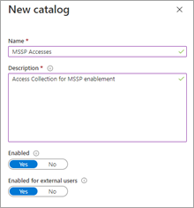

# MsSP-toegang (Managed Security Service Provider) bieden 

[!INCLUDE [Microsoft 365 Defender rebranding](../includes/microsoft-defender.md)]

[!INCLUDE [Prerelease](../includes/prerelease.md)]

**Van toepassing op:**

- [Microsoft 365 Defender](https://go.microsoft.com/fwlink/?linkid=2118804)
- [Microsoft Defender for Endpoint](https://go.microsoft.com/fwlink/p/?linkid=2146631)

Als u een oplossing voor gedelegeerde toegang met meerdere tenants wilt implementeren, voert u de volgende stappen uit:

1. Schakel [toegangsbeheer op basis van rollen](https://docs.microsoft.com/windows/security/threat-protection/microsoft-defender-atp/rbac) in Defender for Endpoint in in het Microsoft 365-beveiligingscentrum en maak verbinding met Azure Active Directory-groepen (Azure AD).

2. Configureer [Beheerbeheertoegangspakketten voor toegangsaanvraag](https://docs.microsoft.com/azure/active-directory/governance/identity-governance-overview) en inrichting.

3. Beheer toegangsaanvragen en audits in [Microsoft Myaccess.](https://docs.microsoft.com/azure/active-directory/governance/entitlement-management-request-approve)

## Toegangsbesturingselementen op basis van rollen inschakelen in Microsoft Defender for Endpoint in het Microsoft 365-beveiligingscentrum

1. **Toegangsgroepen maken voor MSSP-resources in AAD klant: groepen**

    Deze groepen worden gekoppeld aan de rollen die u maakt in Defender voor eindpunt in het Microsoft 365-beveiligingscentrum. Maak in de AD-tenant van de klant drie groepen. In onze voorbeeldbenadering maken we de volgende groepen:

    - Laag 1-analist 
    - Laag 2-analist 
    - MSSP-analist goedkeurders  

2. Maak Defender voor eindpuntrollen voor de juiste toegangsniveaus in Customer Defender voor het eindpunt in de rollen en groepen van het Microsoft 365-beveiligingscentrum.

    Om RBAC in teschakelen in het Microsoft 365-beveiligingscentrum van de klant, hebben de rollen machtigingen > eindpunten & groepen **> Rollen** met een gebruikersaccount met de rechten van globale beheerders > beveiligingsbeheerders.

    

    Maak vervolgens RBAC-rollen om te voldoen aan de behoeften van MSSP SOC Tier. Koppel deze rollen aan de gemaakte gebruikersgroepen via Toegewezen gebruikersgroepen.

    Twee mogelijke rollen:

    - **Laag 1-analisten**  
      Alle acties uitvoeren, met uitzondering van live antwoorden en beveiligingsinstellingen beheren.

    - **Laag 2-analisten**  
      Laag 1-mogelijkheden met de toevoeging aan [live-antwoorden](https://docs.microsoft.com/windows/security/threat-protection/microsoft-defender-atp/live-response)

    Zie Toegangsbeheer op basis van rollen [gebruiken voor meer informatie.](https://docs.microsoft.com/windows/security/threat-protection/microsoft-defender-atp/rbac)

## Toegangspakketten voor beheerbeheer configureren

1.  **MSSP toevoegen als verbonden organisatie in AAD klant: identiteitsbeheer**
    
    Als u de MSSP toevoegt als verbonden organisatie, kan de MSSP aanvragen en toegang krijgen. 

    Dit doet u door in de AD-tenant van de klant identiteitsbeheer te openen: verbonden organisatie. Voeg een nieuwe organisatie toe en zoek naar uw MSSP Analyst-tenant via tenant-id of domein. We raden u aan een afzonderlijke AD-tenant te maken voor uw MSSP-analisten.

2. **Een resourcecatalogus maken in Klant-AAD: Identiteitsbeheer**

    Resourcecatalogi zijn een logische verzameling toegangspakketten die zijn gemaakt in de AD-tenant van de klant.

    Dit doet u door in de AD-tenant van de klant identiteitsbeheer te openen: Catalogi en Nieuwe catalogus **toe te voegen.** In ons voorbeeld noemen we dit **MSSP Accesses.** 

    

    Zie Een catalogus [met resources maken voor meer informatie.](https://docs.microsoft.com/azure/active-directory/governance/entitlement-management-catalog-create)

3. **Maak toegangspakketten voor MSSP-resources Klant AAD: Identiteitsbeheer**

    Access-pakketten zijn de verzameling rechten en toegangen die een aanvragende krijgt na goedkeuring. 

    Dit doet u door in de AD-tenant van de klant identiteitsbeheer te openen: Access-pakketten en **nieuw toegangspakket toe te voegen.** Maak een toegangspakket voor de MSSP-goedkeurders en elke analistlaag. Met de volgende Laag 1-analistenconfiguratie wordt bijvoorbeeld een toegangspakket gemaakt dat:

    - Vereist een lid van de **MSSP-analist van de AD-groep om** nieuwe aanvragen te kunnen goedkeuren
    - Heeft jaarlijkse toegangsbeoordelingen, waarbij de SOC-analisten een toegangsuitbreiding kunnen aanvragen
    - Kan alleen worden aangevraagd door gebruikers in de MSSP SOC-tenant
    - Access verloopt automatisch na 365 dagen

    

    Zie Een nieuw [toegangspakket maken voor meer informatie.](https://docs.microsoft.com/azure/active-directory/governance/entitlement-management-access-package-create)

4. **Koppeling voor toegangsaanvraag naar MSSP-resources bieden vanuit Klant AAD: Identiteitsbeheer**

    De koppeling mijn toegangsportal wordt gebruikt door MSSP SOC-analisten om toegang aan te vragen via de gemaakte toegangspakketten. De koppeling is langer durend, wat betekent dat dezelfde koppeling in de tijd kan worden gebruikt voor nieuwe analisten. Het verzoek van de analist wordt ter goedkeuring in een wachtrij geplaatst door de **MSSP-analist Goedkeurders.**

    

    De koppeling bevindt zich op de overzichtspagina van elk toegangspakket.

## Toegang beheren 

1. Bekijk en autor geef toestemming voor toegangsaanvragen in Klant en/of MSSP myaccess.

    Toegangsaanvragen worden beheerd in De klant Mijn toegang, door leden van de groep Goedkeurders voor MSSP-analisten.

    U doet dit door de myaccess van de klant te openen met behulp van: `https://myaccess.microsoft.com/@<Customer Domain >` 

    Voorbeeld:  `https://myaccess.microsoft.com/@M365x440XXX.onmicrosoft.com#/`   
2. Verzoeken goedkeuren of weigeren in **de sectie Goedkeuringen** van de gebruikersinterface.

     Op dit moment is toegang tot de analisten ingericht en moet elke analist toegang hebben tot het Microsoft 365-beveiligingscentrum van de klant: 

    `https://security.microsoft.com/?tid=<CustomerTenantId>` met de machtigingen en rollen die aan hen zijn toegewezen.

> [!IMPORTANT]
> Gedelegeerde toegang tot Microsoft Defender voor eindpunt in het Microsoft 365-beveiligingscentrum biedt op dit moment toegang tot één tenant per browservenster. 