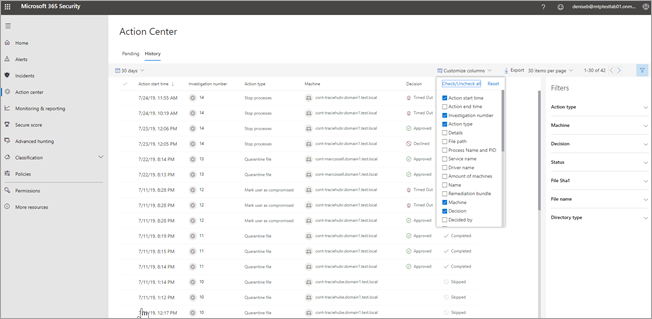

# Het Actiecentrum

[!INCLUDE [Microsoft 365 Defender rebranding](../includes/microsoft-defender.md)]

**Van toepassing op:**
- Microsoft 365 Defender

Met behulp van het Actiecentrum kunt u de resultaten van huidig en vorig onderzoek op de apparaten en postvakken van uw organisatie bekijken. Afhankelijk van het type bedreiging en het resultaat Verdict, worden [herstelacties](https://docs.microsoft.com/microsoft-365/security/mtp/mtp-remediation-actions) automatisch of na goedkeuring uitgevoerd door het team van uw organisatie. Alle herstelacties, of ze nu moeten worden goedgekeurd of al zijn goedgekeurd, worden in het Actiecentrum geconsolideerd. 

## Een "één ruit glas"-ervaring

Het Actiecentrum biedt een ' één ruit ruit ' voor taken, zoals:
- Acties voor herstel in behandeling goedkeuren;
- Een auditlogboek met al goedgekeurde herstelacties weergeven. en
- U bekijkt voltooide herstelbewerkingen.

Uw team van beveiligingsactiviteiten kan effectiever en efficiënt werken omdat het Actiecentrum een uitgebreide weergave biedt van Microsoft 365 Defender op het werk.

## Ga naar het Actiecentrum

1. Ga naar [https://security.microsoft.com](https://security.microsoft.com) en meld u aan. 

2. Kies in het navigatiedeelvenster de optie **Onderhoudscentrum**. 

3. In het Actiecentrum ziet u twee tabbladen: **in behandeling** en **geschiedenis**.

    - Het tabblad **in behandeling** bevat verificatieverzoeken die moeten worden gecontroleerd en goedgekeurd door iemand in uw Beveiligingsteam om door te gaan. Zorg ervoor dat u de items die in behandeling zijn, controleert en actie onderneemt.

    - Het tabblad **geschiedenis** bevat eerdere onderzoeken-en herstelacties die automatisch zijn doorgevoerd. U kunt de gegevens voor de afgelopen dag, week, maand of zes maanden weergeven.

4. Als u alleen de kolommen wilt weergeven die u wilt weergeven, selecteert u **kolommen aanpassen**. 

5. Selecteer een item in de lijst om meer details over een onderzoek te bekijken. De weergave Details van onderzoek wordt geopend. 

    - Als het onderzoek betrekking heeft op e-mail inhoud (zoals de entiteit is een postvak), worden details van onderzoek geopend in het beveiligings & compliance Center ( [https://protection.office.com/threatinvestigation](https://protection.office.com/threatinvestigation) ). 

    - Als het onderzoek een apparaat omvat, worden details van het onderzoek geopend in het Beveiligingscentrum ( [https://security.microsoft.com](https://security.microsoft.com) ). 

> [!TIP]
> Laat het ons weten als u denkt dat er een probleem is opgetreden met een automatisch onderzoek en antwoord functies in Microsoft 365 Defender. Lees [hoe u in Microsoft 365 Defender onjuiste positieve en negatieve functies kunt melden voor automatisch onderzoek en Reacties (lucht)](mtp-autoir-report-false-positives-negatives.md).

## Beschikbare acties

Wanneer herstelacties worden uitgevoerd, worden deze weergegeven op het tabblad geschiedenis in het Actiecentrum. Dit zijn onder andere de volgende acties:

- Onderzoek pakket verzamelen 
- Apparaat isoleren (deze actie kan ongedaan worden gemaakt) 
- Verwijderen-computer 
- Uitvoering van release code 
- Release van quarantaine 
- Voorbeeld van aanvraag 
- Uitvoering van code beperken (deze actie kan ongedaan worden gemaakt) 
- Antivirus scan uitvoeren 
- Stoppen en quarantineen 

## Vereiste machtigingen voor taken in het Actiecentrum

Als u in het Actiecentrum in behandeling zijnde acties wilt goedkeuren of weigeren, moet u beschikken over de machtigingen die zijn toegewezen aan de hand van de volgende tabel:

|Herstelactie |Vereiste rollen en machtigingen |
|--|----|
|Microsoft Defender voor herstel van eindpunten (apparaten) |Rollen van beveiligingsbeheerders toegewezen in azure Active Directory ( [https://portal.azure.com](https://portal.azure.com) ) of het Microsoft 365-Beheercentrum ( [https://admin.microsoft.com](https://admin.microsoft.com) ) ------ De rol Active aanherstel actie toegewezen in Microsoft Defender voor eindpunt     Zie de volgende bronnen voor meer informatie:  - [Machtigingen voor beheerdersrollen in azure Active Directory](https://docs.microsoft.com/azure/active-directory/users-groups-roles/directory-assign-admin-roles) - [Rollen maken en beheren voor toegangsbeheer op basis van rollen (Microsoft Defender voor eindpunt)](https://docs.microsoft.com/windows/security/threat-protection/microsoft-defender-atp/user-roles)  |
|Microsoft Defender voor Office 365 herstel (Office-inhoud en e-mail)  |Rollen van beveiligingsbeheerders toegewezen in azure Active Directory ( [https://portal.azure.com](https://portal.azure.com) ) of het Microsoft 365-Beheercentrum ( [https://admin.microsoft.com](https://admin.microsoft.com) ) ---en---  Rol zoeken en wissen toegewezen aan de beveiligings & compliance Center ( [https://protection.office.com](https://protection.office.com) )   **Belangrijk** : als u alleen de rol van beveiligingsbeheerder hebt toegewezen aan de beveiligings & nalevings centrum, hebt u geen toegang tot de mogelijkheden van het Actiecentrum of microsoft 365. U moet de rol van beveiligingsbeheerder zijn toegewezen in azure Active Directory of het Microsoft 365-Beheercentrum.   Zie de volgende bronnen voor meer informatie:  - [Machtigingen voor beheerdersrollen in azure Active Directory](https://docs.microsoft.com/azure/active-directory/users-groups-roles/directory-assign-admin-roles) - [Machtigingen in het nalevings centrum voor beveiligings &](https://docs.microsoft.com/microsoft-365/security/office-365-security/permissions-in-the-security-and-compliance-center) |

> [!NOTE]
> Gebruikers met de rol van globale beheerder die zijn toegewezen aan Azure Active Directory, kunnen een actie in behandeling goedkeuren of weigeren in het Actiecentrum. De beste manier om het aantal personen met de rol van globale beheerder in de organisatie te beperken. U wordt aangeraden gebruik te maken van de bovenstaande beveiligingsbeheerder, actieve herstelacties en de hierboven vermelde functies voor het Actiecentrum.

## Volgende stappen 

- [Acties die in behandeling zijn, goedkeuren of weigeren na een geautomatiseerd onderzoek](mtp-autoir-actions.md)
- [De resultaten van een geautomatiseerd onderzoek weergeven](mtp-autoir-results.md)

