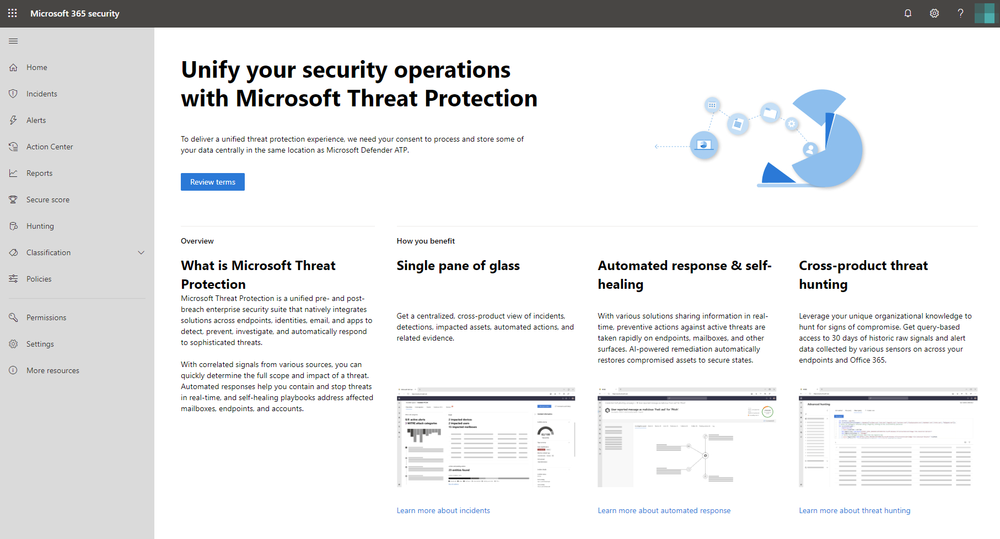
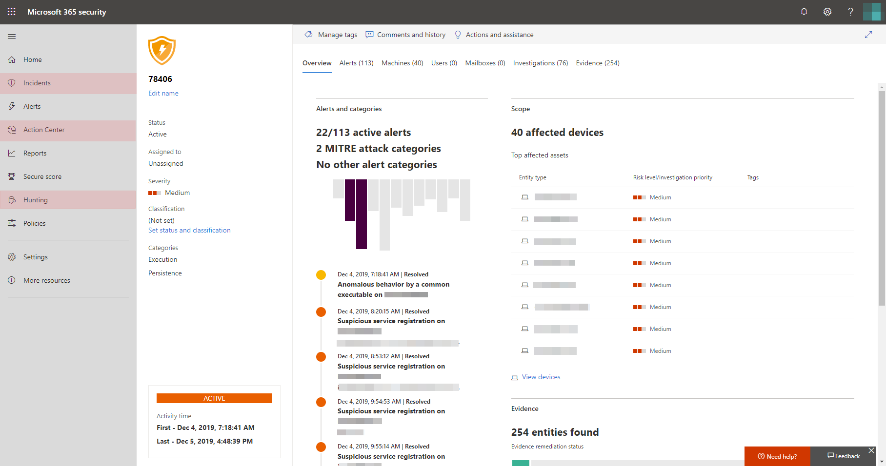

# Microsoft Threat Protection inschakelen

**Geldt voor:**
- Microsoft Threat Protection

Microsoft Threat Protection maakt een oplossing voor incidentrespons door de integratie van belangrijke mogelijkheden voor Microsoft Defender Advanced Threat Protection (ATP), Office 365 ATP, Microsoft Cloud App Security en Azure ATP. Deze uniforme ervaring voegt krachtige functies toe die u openen in het Microsoft 365-beveiligingscentrum.

Om de beste bescherming te krijgen en Microsoft Threat Protection te optimaliseren, raden we u aan alle toepasselijke ondersteunde services in uw netwerk te implementeren. Lees voor meer informatie [over het implementeren van ondersteunde services](deploy-supported-services.md).

## Controleer de geschiktheid van de licentie en vereiste machtigingen
Een Microsoft 365 E5-, E5 Security-, A5- of A5-beveiligingslicentie of een geldige combinatie van licenties biedt toegang tot ondersteunde services en geeft u het recht om Microsoft Threat Protection te gebruiken in het Microsoft 365-beveiligingscentrum.

Lees voor gedetailleerde licentie-informatie [de licentievereisten.](prerequisites.md#licensing-requirements)

### Controleer uw rol
U moet een **globale beheerder** of **beveiligingsbeheerder** in Azure Active Directory zijn om Microsoft Threat Protection in te schakelen. [Uw rollen weergeven in Azure AD](https://docs.microsoft.com//azure/active-directory/users-groups-roles/directory-manage-roles-portal)

## De service gaan gebruiken
Microsoft Threat Protection verzamelt gegevens van de verschillende geïntegreerde services. Het zal gegevens centraal verwerken en opslaan om nieuwe inzichten te identificeren en gecentraliseerde responsworkflows mogelijk te maken.

Voordat u de service inschakelt, wordt in het Microsoft 365-beveiligingscentrum[(security.microsoft.com](https://security.microsoft.com)) de welkomstpagina van Microsoft Threat Protection weergegeven wanneer u **Incidenten,** **actiecentrum**of **Jagen** selecteert in het navigatiedeelvenster. Deze navigatieopties worden niet weergegeven als u niet in aanmerking komt voor microsoft-beveiligingsbeveiliging.

wordt weergegeven als Microsoft Threat Protection niet is ingeschakeld op*de welkomstpagina van Microsoft Threat Protection in het Microsoft 365-beveiligingscentrum*

Als u Microsoft Threat Protection wilt inschakelen, voltooit u het proces vanaf de welkomstpagina. U Microsoft Threat Protection ook inschakelen door **instellingen** [(security.microsoft.com/settings)](https://security.microsoft.com/settings)in het navigatiedeelvenster te openen en **Microsoft Threat Protection te selecteren.** Klik op **Opslaan**.

>[!NOTE]
>Als u **instellingen** niet ziet in het navigatiedeelvenster of geen toegang hebt tot de pagina, controleert u uw machtigingen en licenties.

### Locatie van het datacenter selecteren
Als Microsoft Defender ATP is ingericht voor uw organisatie, worden gegevens opgeslagen en verwerkt op dezelfde datacenterlocatie die u hebt geselecteerd voor [uw ATP-gegevens](https://docs.microsoft.com/windows/security/threat-protection/microsoft-defender-atp/data-storage-privacy)van Microsoft Defender. Als u geen Microsoft Defender ATP hebt, wordt u gevraagd om een nieuwe datacenterlocatie te kiezen die specifiek voor Microsoft Threat Protection is bedoeld. 

U moet toestemming geven voordat gegevens worden gedeeld tussen services en worden samengevoegd.

### Controleren of de service is ingeschakeld
Zodra de service is ingericht, voegt het toe:

- [Incidentenbeheer](incidents-overview.md)
- Een actiecentrum voor het beheren van [geautomatiseerd onderzoek en respons](mtp-autoir.md)
- [Geavanceerde jachtmogelijkheden](advanced-hunting-overview.md)

van Microsoft 365 met Microsoft Threat Protection-functies*Microsoft 365-beveiligingscentrum met incidentenbeheer en andere mogelijkheden voor Microsoft-bedreigingsbeveiliging*

### Azure ATP-gegevens opvragen
Als u Azure ATP-gegevens wilt delen met Microsoft Threat Protection, moet u ervoor zorgen dat Microsoft Cloud App Security en Azure ATP-integratie zijn ingeschakeld. [Meer informatie over deze integratie](https://docs.microsoft.com/cloud-app-security/aatp-integration)

## Microsoft-bedreigingsbeveiliging uitschakelen
Als u microsoft-beveiligingsbeveiliging niet meer wilt gebruiken, gaat u naar >  **Opt-in-instellingen** > **van Microsoft Threat Protection**/**Opt-out** in het Microsoft 365-beveiligingscentrum. Schakel De optie **Microsoft Threat Protection inschakelen uit** en sla de wijzigingen op.

Overeenkomstige functies worden verwijderd uit het Microsoft 365-beveiligingscentrum.

## Hulp krijgen

Microsoft-ondersteuningsmedewerkers kunnen helpen bij het inrichten of deprovisioneren van de service en gerelateerde bronnen op uw tenant. Selecteer Hulp **nodig** in het Microsoft 365-beveiligingscentrum voor hulp? Vermeld Microsoft Threat Protection wanneer u contact opneemt met ondersteuning.

## Verwante onderwerpen

- [Overzicht van Microsoft Threat Protection](microsoft-threat-protection.md)
- [Licentievereisten en andere vereisten](prerequisites.md)
- [Ondersteunde services implementeren](deploy-supported-services.md)
- [Overzicht van Microsoft Defender ATP](https://docs.microsoft.com/windows/security/threat-protection/microsoft-defender-atp/microsoft-defender-advanced-threat-protection)
- [Overzicht van Office 365 ATP](../office-365-security/office-365-atp.md)
- [Overzicht van Microsoft Cloud App-beveiliging](https://docs.microsoft.com/cloud-app-security/what-is-cloud-app-security)
- [Overzicht van Azure ATP](https://docs.microsoft.com/azure-advanced-threat-protection/what-is-atp)
- [Microsoft Defender ATP-gegevensopslag](https://docs.microsoft.com/windows/security/threat-protection/microsoft-defender-atp/data-storage-privacy)
