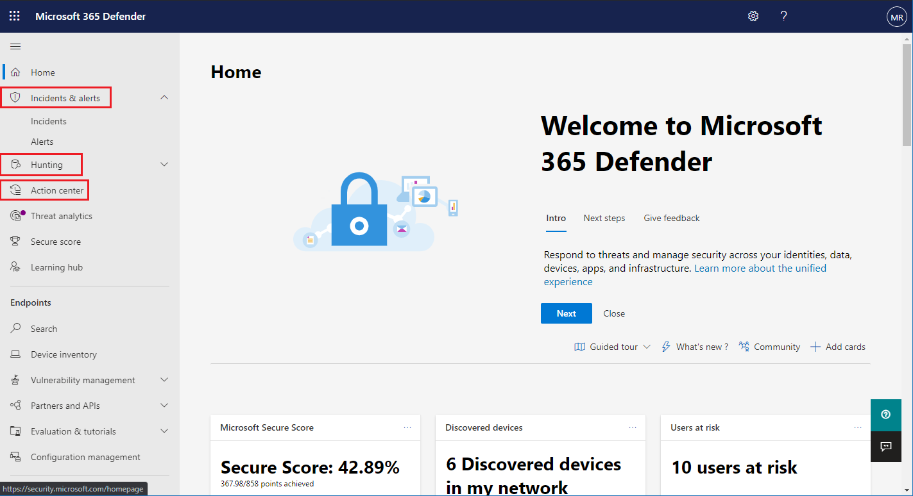

# Microsoft Threat Protection inschakelen

[!INCLUDE [Microsoft 365 Defender rebranding](../includes/microsoft-defender.md)]

**Van toepassing op:**
- Microsoft Threat Protection

[Microsoft Threat Protection](microsoft-threat-protection.md) bundelt uw incident-antwoord proces door de belangrijkste functies in Microsoft Defender Advanced Threat Protection (ATP), Office 365 ATP, Microsoft Cloud app Security en Azure ATP te integreren. Deze geïntegreerde ervaring voegt krachtige functies toe die u kunt gebruiken in het Microsoft 365-Beveiligingscentrum.

Microsoft Threat Protection wordt automatisch ingeschakeld wanneer klanten die in aanmerking komen met de vereiste machtigingen naar Microsoft 365-Beveiligingscentrum. Lees dit artikel voor meer informatie over diverse vereisten en de manier waarop Microsoft Threat Protection wordt ingericht.

## Geschiktheid voor de licentie en de vereiste machtigingen controleren
Met een licentie voor een Microsoft 365-beveiligings product hebt u algemene informatie over het gebruik van Microsoft Threat Protection in Microsoft 365 Beveiligingscentrum zonder extra licentiekosten. U wordt aangeraden een Microsoft 365 E5-, E5-beveiligings licentie, A5, of A5-beveiligings licentie of een geldige combinatie van licenties te verkrijgen die toegang biedt tot alle ondersteunde services.

[Lees de licentievereisten](prerequisites.md#licensing-requirements)voor uitgebreide licentiegegevens.

### Uw rol controleren
U moet een **globale beheerder** of een **beveiligingsbeheerder** van Azure Active Directory zijn om Microsoft Threat Protection in te schakelen. [Uw rollen weergeven in azure AD](https://docs.microsoft.com//azure/active-directory/users-groups-roles/directory-manage-roles-portal)

## Ondersteunde services
Microsoft Threat Protection voegt gegevens samen van de verschillende ondersteunde services die u al hebt geïmplementeerd. De gegevens worden centraal verwerkt en opgeslagen om nieuwe inzichten te identificeren en mogelijk gecentraliseerde antwoord werkstromen te maken. Dit gebeurt zonder dat dit invloed heeft op bestaande installaties, instellingen of gegevens die zijn gekoppeld aan de geïntegreerde services.

Om de beste beveiliging te bieden en Microsoft Threat Protection te optimaliseren, wordt u aangeraden alle toepasselijke ondersteunde services op uw netwerk te implementeren. Lees voor meer informatie [over het implementeren van ondersteunde services](deploy-supported-services.md).

## Voordat u de service start
Voordat u de service inschakelt, ziet u in het micro[soft 365-beveiligings](https://security.microsoft.com)centrum de pagina instellingen voor Microsoft Threat Protection wanneer u **incidenten**, **Onderhoudscentrum**of **jacht** selecteert in het navigatiedeelvenster. Deze navigatie-items worden niet weergegeven als u niet in aanmerking komt om Microsoft Threat Protection te gebruiken.

 *Protection in microsoft 365 Beveiligingscentrum*

## De service starten
Als u Microsoft Threat Protection wilt inschakelen, selecteert u **Microsoft bedreigingsbeveiliging inschakelen** en voegt u de wijziging toe. U kunt deze optie ook openen door **instellingen** ([Security.Microsoft.com/Settings](https://security.microsoft.com/settings)) te selecteren in het navigatiedeelvenster en vervolgens **Microsoft Threat Protection**te selecteren.

>[!NOTE]
>Als u **instellingen** niet ziet in het navigatiedeelvenster of de pagina niet kunt openen, controleert u de machtigingen en licenties.

### Locatie van het Data Center
Microsoft Threat Protection opslaat en verwerkt gegevens op [dezelfde locatie als in Microsoft Defender ATP](https://docs.microsoft.com/windows/security/threat-protection/microsoft-defender-atp/data-storage-privacy). Als u niet over Microsoft Defender ATP beschikt, wordt een nieuwe locatie voor het datacenter automatisch geselecteerd op basis van de locatie van de actieve beveiligingsservices van Microsoft 365. De geselecteerde locatie van het datacenter wordt in het scherm weergegeven. 

Selecteer **hulp nodig?** in het microsoft 365-Beveiligingscentrum kunt u contact opnemen met Microsoft ondersteuning voor het inrichten van Microsoft Threat Protection op een andere locatie van het datacenter. 

>[!NOTE]
>In Microsoft Defender ATP worden automatisch de voorzieningen van de Europese Unie (EU)-datacenters automatisch ingericht wanneer ze zijn ingeschakeld via Azure Beveiligingscentrum. Microsoft Threat Protection wordt automatisch ingericht in hetzelfde EU-datacenter voor klanten die op deze manier Microsoft Defender ATP hebben ingericht. 

### Ga na of de service is ingeschakeld
Wanneer de service is ingericht, wordt het volgende toegevoegd:

- [Beheer van incidenten](incidents-overview.md)
- Een Actiecentrum voor het beheren van [geautomatiseerde onderzoek en reacties](mtp-autoir.md)
- [Geavanceerde](advanced-hunting-overview.md) functies voor de jacht

 *microsoft 365 Beveiligingscentrum met incidentenbeheer en andere mogelijkheden van Microsoft Threat Protection*

### Azure ATP-gegevens verkrijgen
Als u Azure ATP-gegevens wilt delen met Microsoft Threat Protection, moet u ervoor zorgen dat Microsoft Cloud app Security en Azure ATP-integratie is ingeschakeld. [Meer informatie over deze integratie](https://docs.microsoft.com/cloud-app-security/aatp-integration)

## Microsoft Threat Protection uitschakelen
Als u wilt stoppen met het gebruik van Microsoft Threat Protection, gaat u naar **instellingen**  >  **Microsoft bedreigingsbeveiliging**  >  **/Afmelden** in het Microsoft 365-Beveiligingscentrum. Schakel **Microsoft Threat Protection uit** en pas de wijzigingen toe.

De bijbehorende functies worden verwijderd uit het Microsoft 365-Beveiligingscentrum.

## Ondersteuning vragen

Voor antwoorden op de meest gestelde vragen over het inschakelen van Microsoft Threat Protection [raadpleegt u de veelgestelde vragen](mtp-enable-faq.md).

Ondersteuningspersoneel van Microsoft kan u helpen bij het inrichten van of het inrichten van de service en verwante bronnen voor uw Tenant. Als u hulp nodig hebt, selecteert u **hulp nodig?** in het microsoft 365-Beveiligingscentrum. Vermeld Microsoft Threat Protection wanneer u contact opneemt met de ondersteuning.

## Verwante onderwerpen

- [Veelgestelde vragen](mtp-enable-faq.md)
- [Licentievereisten en andere vereisten](prerequisites.md)
- [Ondersteunde services implementeren](deploy-supported-services.md)
- [Overzicht van Microsoft Threat Protection](microsoft-threat-protection.md)
- [Overzicht van Microsoft Defender ATP](https://docs.microsoft.com/windows/security/threat-protection/microsoft-defender-atp/microsoft-defender-advanced-threat-protection)
- [Overzicht van Office 365 ATP](../office-365-security/office-365-atp.md)
- [Overzicht van de beveiliging van Microsoft Cloud-app](https://docs.microsoft.com/cloud-app-security/what-is-cloud-app-security)
- [Overzicht van Azure ATP](https://docs.microsoft.com/azure-advanced-threat-protection/what-is-atp)
- [Microsoft Defender ATP Data Storage](https://docs.microsoft.com/windows/security/threat-protection/microsoft-defender-atp/data-storage-privacy)
